## 首先进行网段扫描

```
└─# arp-scan -l                                                                                                                                                                                                 
Interface: eth0, type: EN10MB, MAC: 00:0c:29:df:e2:a7, IPv4: 192.168.26.128                                                                                                                                     
WARNING: Cannot open MAC/Vendor file ieee-oui.txt: Permission denied                                                                                                                                            
WARNING: Cannot open MAC/Vendor file mac-vendor.txt: Permission denied                                                                                                                                          
Starting arp-scan 1.10.0 with 256 hosts (https://github.com/royhills/arp-scan)                                                                                                                                  
192.168.26.2    00:50:56:e8:d4:e1       (Unknown)                                                                                                                                                               
192.168.26.1    00:50:56:c0:00:08       (Unknown)                                                                                                                                                               
192.168.26.160  00:0c:29:a1:5d:a3       (Unknown)                                                                                                                                                               
192.168.26.254  00:50:56:e3:3d:3d       (Unknown)                                                                                                                                                               
                                                                                                                                                                                                                
4 packets received by filter, 0 packets dropped by kernel                                                                                                                                                       
Ending arp-scan 1.10.0: 256 hosts scanned in 1.950 seconds (131.28 hosts/sec). 4 responded    
```

## 端口扫描

```
└─# nmap -p- -sC -sV 192.168.26.160                                                                                                                                                                             
Starting Nmap 7.94SVN ( https://nmap.org ) at 2025-01-15 22:27 EST                                                                                                                                              
Nmap scan report for 192.168.26.160 (192.168.26.160)                                                                                                                                                            
Host is up (0.0011s latency).                                                                                                                                                                                   
Not shown: 65532 closed tcp ports (reset)                                                                                                                                                                       
PORT     STATE SERVICE      VERSION                                                                                                                                                                             
22/tcp   open  ssh          OpenSSH 8.4p1 Debian 5+deb11u2 (protocol 2.0)                                                                                                                                       
| ssh-hostkey:                                                                                                                                                                                                  
|   3072 f0:e6:24:fb:9e:b0:7a:1a:bd:f7:b1:85:23:7f:b1:6f (RSA)                                                                                                                                                  
|   256 99:c8:74:31:45:10:58:b0:ce:cc:63:b4:7a:82:57:3d (ECDSA)                                                                                                                                                 
|_  256 60:da:3e:31:38:fa:b5:49:ab:48:c3:43:2c:9f:d1:32 (ED25519)                                                                                                                                               
80/tcp   open  http         Apache httpd 2.4.56 ((Debian))                                                                                                                                                      
|_http-server-header: Apache/2.4.56 (Debian)                                                                                                                                                                    
|_http-title: Site doesn't have a title (text/html).                                                                                                                                                            
3000/tcp open  microsoft-ds                                                                                                                                                                                     
| fingerprint-strings:                                                                                                                                                                                          
|   SMBProgNeg:                                                                                                                                                                                                 
|     SMBr                                                                                                                                                                                                      
|_    "3DUfw                                                                                                                                                                                                    
1 service unrecognized despite returning data. If you know the service/version, please submit the following fingerprint at https://nmap.org/cgi-bin/submit.cgi?new-service :                                    
SF-Port3000-TCP:V=7.94SVN%I=7%D=1/15%Time=67887D19%P=x86_64-pc-linux-gnu%r                                                                                                                                      
SF:(SMBProgNeg,51,"\0\0\0M\xffSMBr\0\0\0\0\x80\0\xc0\0\0\0\0\0\0\0\0\0\0\0                                                                                                                                      
SF:\0\0\0@\x06\0\0\x01\0\x11\x07\0\x03\x01\0\x01\0\0\xfa\0\0\0\0\x01\0\0\0                                                                                                                                      
SF:\0\0p\0\0\0\0\0\0\0\0\0\0\0\0\0\x08\x08\0\x11\"3DUfw\x88");                                                                                                                                                  
MAC Address: 00:0C:29:A1:5D:A3 (VMware)                                                                                                                                                                         
Service Info: OS: Linux; CPE: cpe:/o:linux:linux_kernel                                                                                                                                                         
                                                                                                                                                                                                                
Service detection performed. Please report any incorrect results at https://nmap.org/submit/ .                                                                                                                  
Nmap done: 1 IP address (1 host up) scanned in 132.84 seconds 
```

```
└─# nmap -sU --top-ports 20 192.168.26.160                                                                                                                                                                      
Starting Nmap 7.94SVN ( https://nmap.org ) at 2025-01-15 23:21 EST                                                                                                                                              
Nmap scan report for 192.168.26.160 (192.168.26.160)                                                                                                                                                            
Host is up (0.0019s latency).                                                                                                                                                                                   
                                                                                                                                                                                                                
PORT      STATE         SERVICE                                                                                                                                                                                 
53/udp    closed        domain                                                                                                                                                                                  
67/udp    closed        dhcps                                                                                                                                                                                   
68/udp    open|filtered dhcpc                                                                                                                                                                                   
69/udp    closed        tftp                                                                                                                                                                                    
123/udp   closed        ntp                                                                                                                                                                                     
135/udp   closed        msrpc                                                                                                                                                                                   
137/udp   closed        netbios-ns                                                                                                                                                                              
138/udp   closed        netbios-dgm                                                                                                                                                                             
139/udp   closed        netbios-ssn                                                                                                                                                                             
161/udp   open          snmp                                                                                                                                                                                    
162/udp   closed        snmptrap                                                                                                                                                                                
445/udp   closed        microsoft-ds                                                                                                                                                                            
500/udp   closed        isakmp                                                                                                                                                                                  
514/udp   closed        syslog                                                                                                                                                                                  
520/udp   closed        route                                                                                                                                                                                   
631/udp   closed        ipp                                                                                                                                                                                     
1434/udp  closed        ms-sql-m                                                                                                                                                                                
1900/udp  closed        upnp                                                                                                                                                                                    
4500/udp  closed        nat-t-ike                                                                                                                                                                               
49152/udp closed        unknown                                                                                                                                                                                 
MAC Address: 00:0C:29:A1:5D:A3 (VMware)                                                                                                                                                                         
                                                                                                                                                                                                                
Nmap done: 1 IP address (1 host up) scanned in 17.13 seconds 
```

>这里可以看到出现了一个3000端口，端口解析为SMB的提示，并且在扫描UDP 服务出现了161的snmp服务

## 这里去hacktricks查询对应的相关内容

>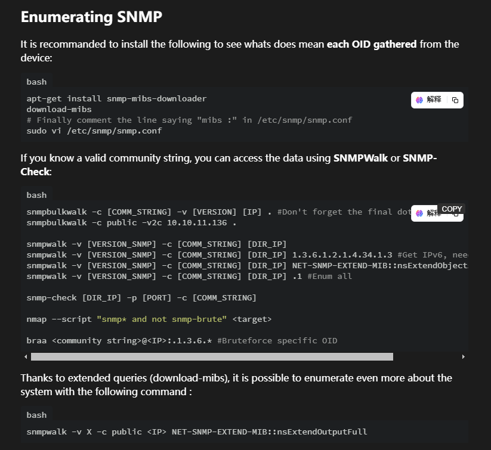
>
>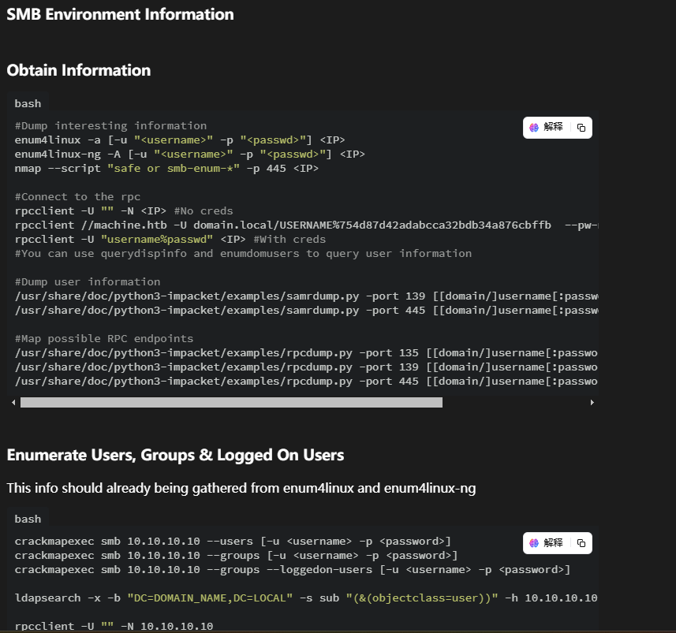
>
>这里需要利用关于snmp爆破的工具去查找对应的snmp的特征
>
>这里利用的工具是onesixtyone，使用kali的朋友这个是自带的不用安装目录选择snmp对应目录即可
>
>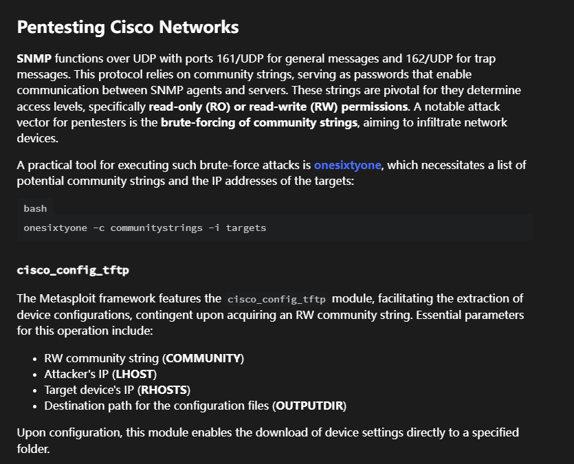

## 利用特征去snmp查询对应的内容

>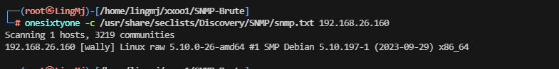
>
>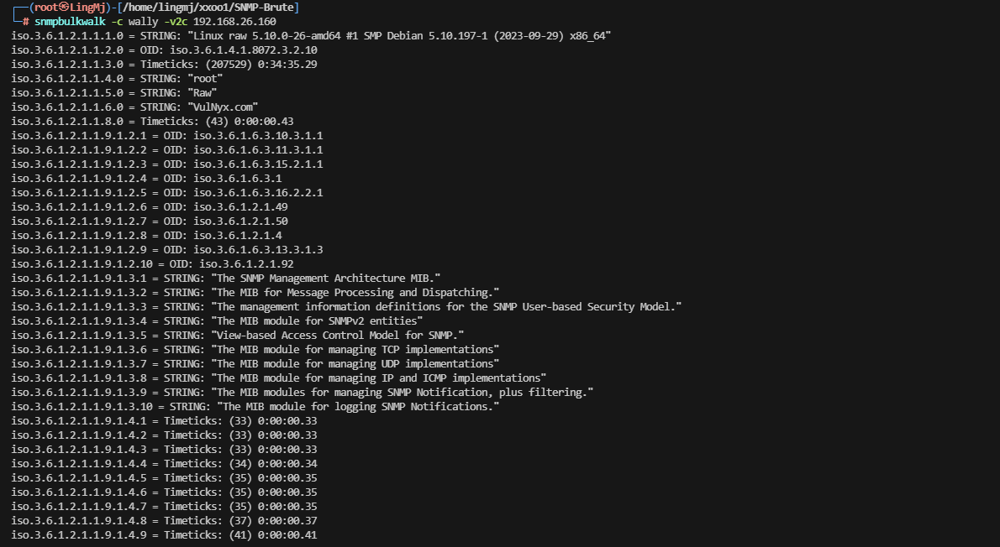
>
>这里出现很多的snmp的相关内容我们需要利用正则过滤一下并且找到对应服务
>
>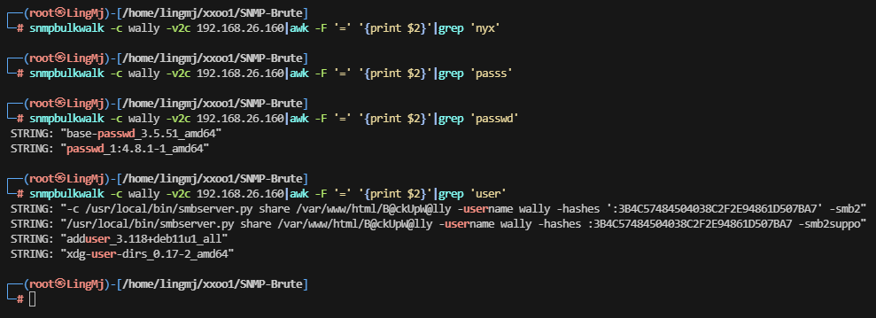
>
>正常我选择过滤一下域名，用户名称或者密码等，这里发现获取关键信息目录，用户 hashes，这里需要说明一下不用官方的crackmapexec
>
>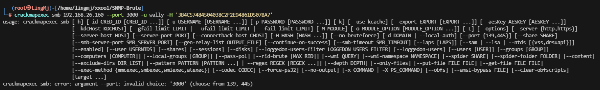
>
>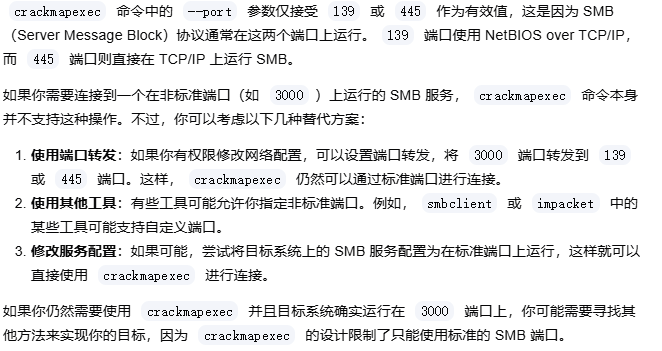
>
>它给我们设计了限制使用无法使用这个工具，这里推荐使用netexec，需要安装一下
>
>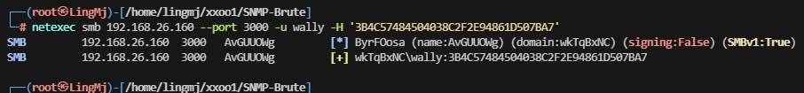
>
>安装完利用的画面，这里有domain和账号密码的形式需要利用smbclient去操作
>
>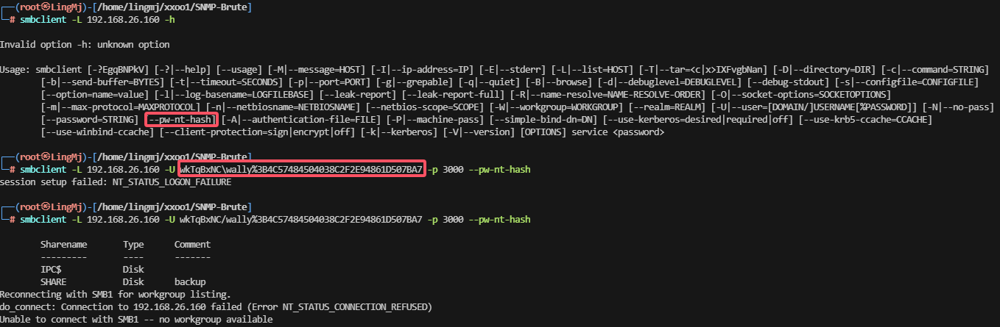
>
>这里需要注意利用 hash登录方式和用户形式，这里来自于ll104567和softyhack大佬的开荒时的记录
>
>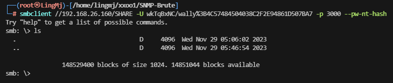
>
>这里利用对应目录形式完成smb登录操作

## 文件上传获取shell

>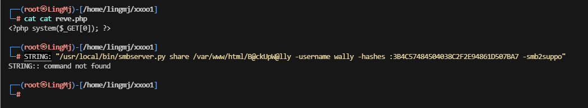
>
>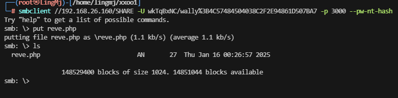
>
>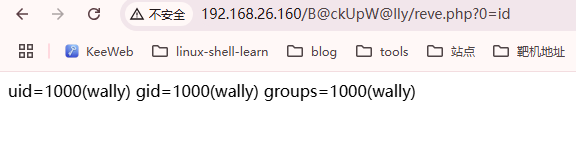
>
>这里可以看到我们已经将php上传到对应的目录中并且可以解析

## 获取webshell

>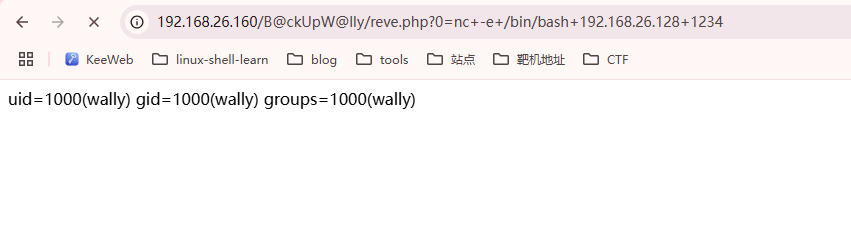
>
>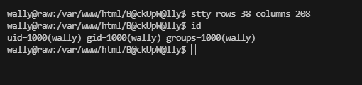


## 提权

>```
>wally@raw:/var/www/html/B@ckUpW@lly$ sudo -l                                                                                                                                                                    
>Matching Defaults entries for wally on raw:                                                                                                                                                                     
>    env_reset, mail_badpass, secure_path=/usr/local/sbin\:/usr/local/bin\:/usr/sbin\:/usr/bin\:/sbin\:/bin                                                                                                      
>                                                                                                                                                                                                                
>User wally may run the following commands on raw:                                                                                                                                                               
>    (loko) NOPASSWD: /usr/bin/nawk
>```

>这里存在对应的gtfobins形式
>
>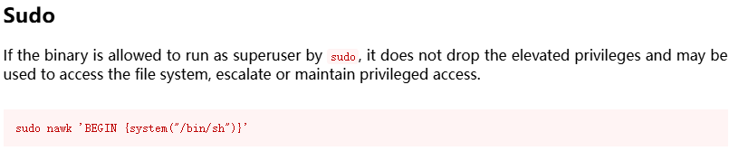
>
>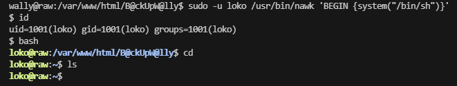
>
>```
>loko@raw:~$ sudo -l                                                                                                                                                                                             
>Matching Defaults entries for loko on raw:                                                                                                                                                                      
>    env_reset, mail_badpass, secure_path=/usr/local/sbin\:/usr/local/bin\:/usr/sbin\:/usr/bin\:/sbin\:/bin                                                                                                      
>                                                                                                                                                                                                                
>User loko may run the following commands on raw:                                                                                                                                                                
>    (root) NOPASSWD: /usr/bin/more /root/Pwn3

>这里可以看到root 利用的是more读取文件形式
>
>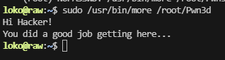
>
>只有2行文字的情况下，我们需要缩小窗口达到显示不完全既可以拿到root权限
>
>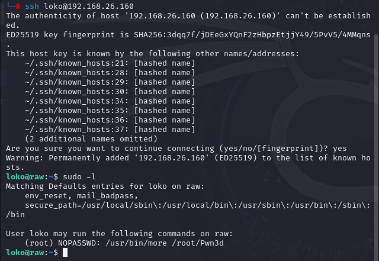
>
>这里需要回到原来的kali操作不能用ssh连接窗口
>
>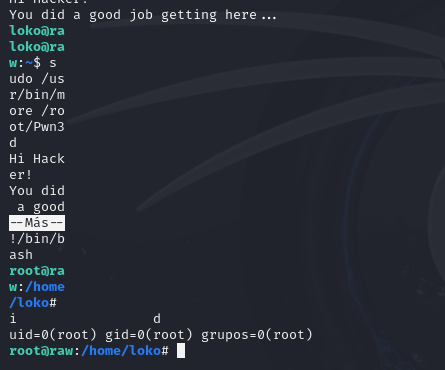
>
>这里要记住他需要横向缩小到最小不过我有其他方案之前我把stty都改成1，但是不展示了
>
>到这里靶场就复盘完毕
>
>userflag：e893d69e2c84ad538627e4c3efcd43af 
>
>rootflag：badb73b2ee357907af836e10a1a318a9 

