## 网段扫描
```
└─# arp-scan -l
Interface: eth0, type: EN10MB, MAC: 00:0c:29:df:e2:a7, IPv4: 192.168.26.128
Starting arp-scan 1.10.0 with 256 hosts (https://github.com/royhills/arp-scan)
192.168.26.1    00:50:56:c0:00:08       VMware, Inc.
192.168.26.2    00:50:56:e8:d4:e1       VMware, Inc.
192.168.26.165  00:0c:29:e3:59:79       VMware, Inc.
192.168.26.254  00:50:56:e2:a3:32       VMware, Inc.

4 packets received by filter, 0 packets dropped by kernel
Ending arp-scan 1.10.0: 256 hosts scanned in 2.604 seconds (98.31 hosts/sec). 4 responded
```

## 端口扫描

```
└─# nmap -p- -sC -sV 192.168.26.165       
Starting Nmap 7.94SVN ( https://nmap.org ) at 2025-01-16 22:54 EST
Nmap scan report for 192.168.26.165 (192.168.26.165)
Host is up (0.0011s latency).
Not shown: 65532 closed tcp ports (reset)
PORT   STATE SERVICE VERSION
22/tcp open  ssh     OpenSSH 7.9p1 Debian 10+deb10u3 (protocol 2.0)
| ssh-hostkey: 
|   2048 f7:ea:48:1a:a3:46:0b:bd:ac:47:73:e8:78:25:af:42 (RSA)
|   256 2e:41:ca:86:1c:73:ca:de:ed:b8:74:af:d2:06:5c:68 (ECDSA)
|_  256 33:6e:a2:58:1c:5e:37:e1:98:8c:44:b1:1c:36:6d:75 (ED25519)
53/tcp open  domain  (unknown banner: not currently available)
| dns-nsid: 
|_  bind.version: not currently available
| fingerprint-strings: 
|   DNSVersionBindReqTCP: 
|     version
|     bind
|_    currently available
80/tcp open  http    Apache httpd 2.4.38 ((Debian))
| http-robots.txt: 1 disallowed entry 
|_hunterzone.nyx
|_http-title: Apache2 Debian Default Page: It works
|_http-server-header: Apache/2.4.38 (Debian)
1 service unrecognized despite returning data. If you know the service/version, please submit the following fingerprint at https://nmap.org/cgi-bin/submit.cgi?new-service :
SF-Port53-TCP:V=7.94SVN%I=7%D=1/16%Time=6789D4CF%P=x86_64-pc-linux-gnu%r(D
SF:NSVersionBindReqTCP,52,"\0P\0\x06\x85\0\0\x01\0\x01\0\x01\0\0\x07versio
SF:n\x04bind\0\0\x10\0\x03\xc0\x0c\0\x10\0\x03\0\0\0\0\0\x18\x17not\x20cur
SF:rently\x20available\xc0\x0c\0\x02\0\x03\0\0\0\0\0\x02\xc0\x0c");
MAC Address: 00:0C:29:E3:59:79 (VMware)
Service Info: OS: Linux; CPE: cpe:/o:linux:linux_kernel

Service detection performed. Please report any incorrect results at https://nmap.org/submit/ .
Nmap done: 1 IP address (1 host up) scanned in 89.90 seconds
```

## 获取webshell

>发现53，查看是否存在domain，80端口出有hunterzone.nyx
>
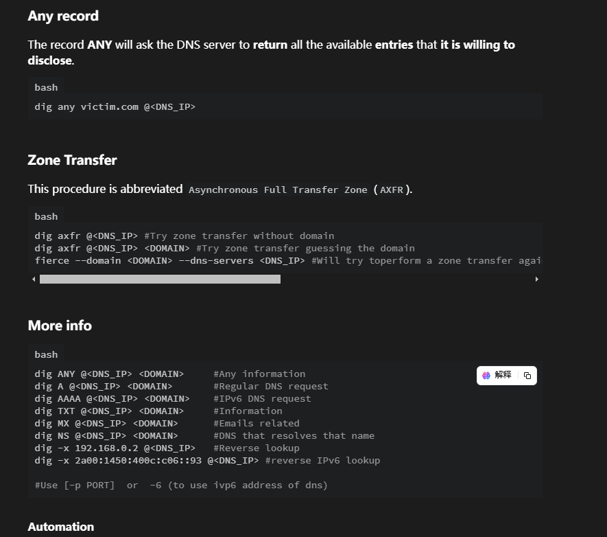  

>利用上面的工具完成有关域名的查找
>
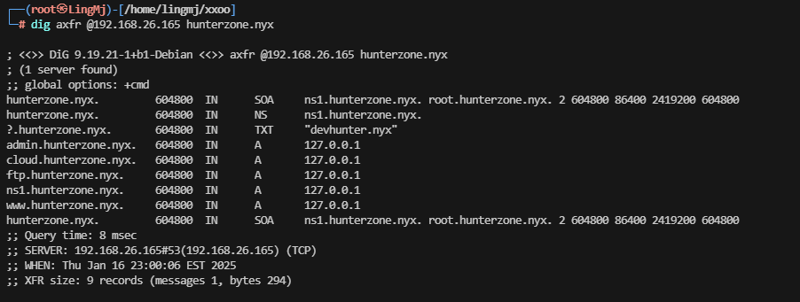  

>需要把域名拿出来可以利用正则处理
>
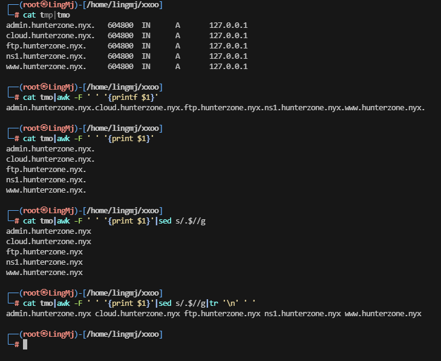  

>利用扫描进行域名内容扫描，利用扫描把上面的所以子域名扫会没有线索
>

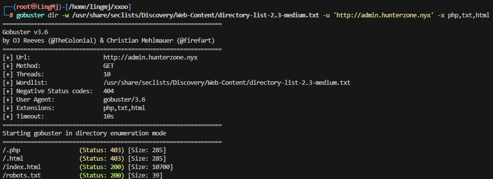  

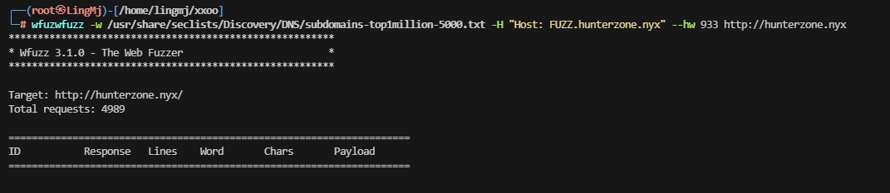  

>这里扫了半天发现domain还有一个域名
>
>?.hunterzone.nyx.       604800  IN      TXT     "devhunter.nyx"
>
>这里把这个域名一起加上去
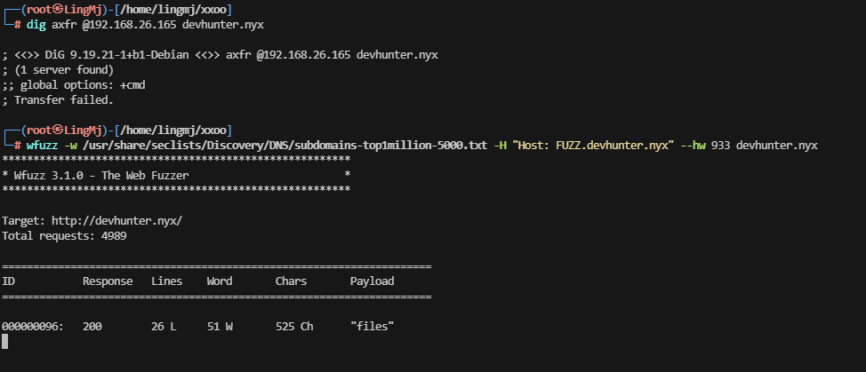  

>这里出现了子域名，我们可以上wbe看一下是什么服务
>

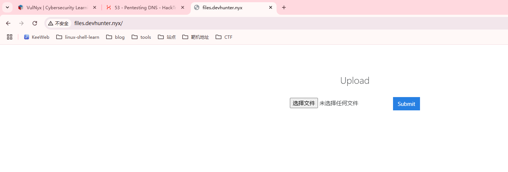  

>是一个文件上传，这里要准备一下上传的php文件
>
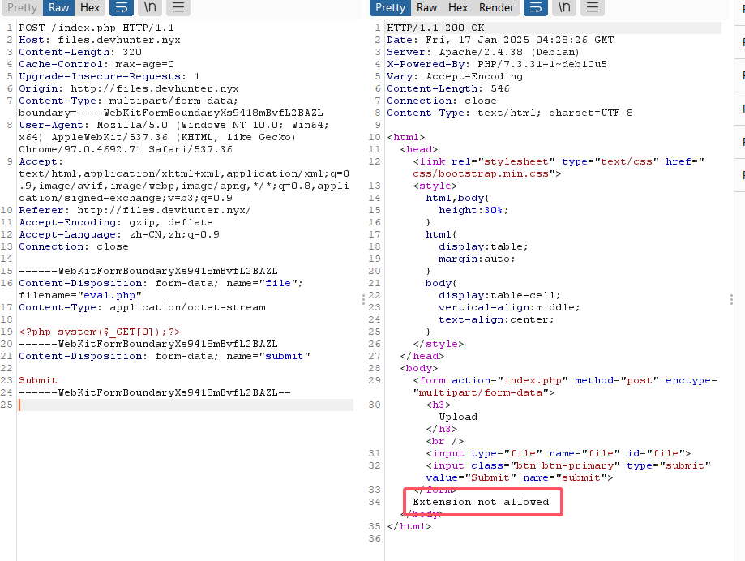  
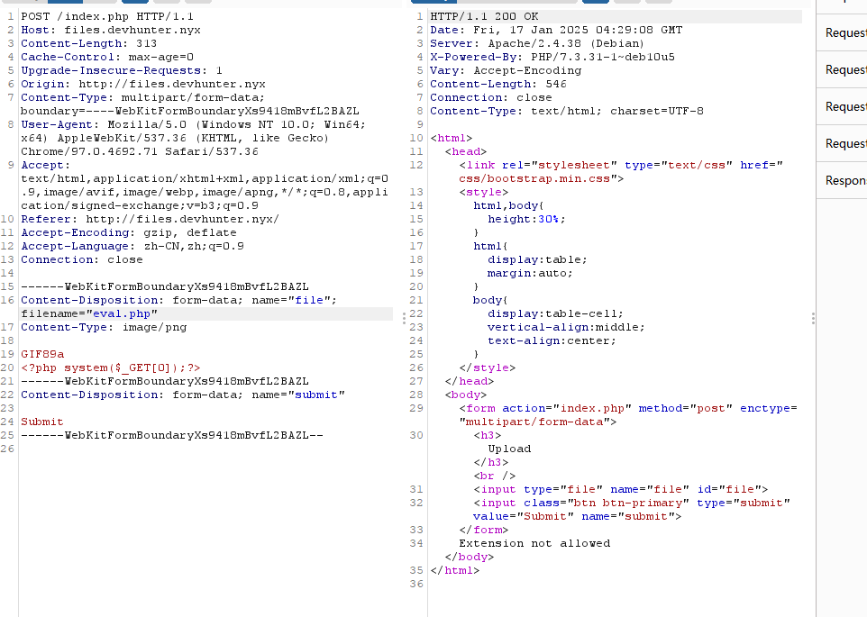 
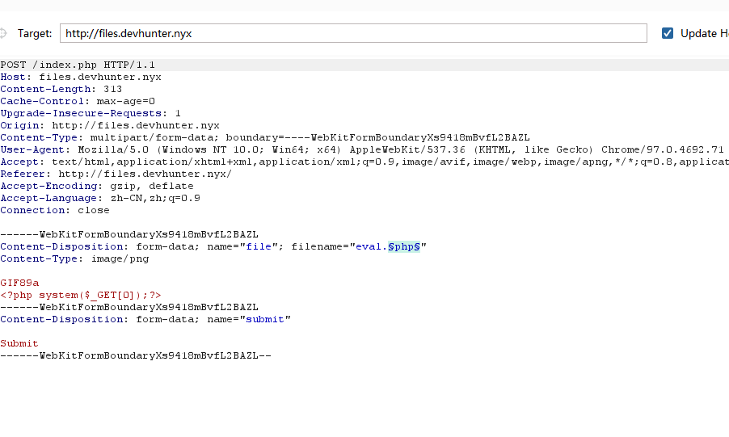  
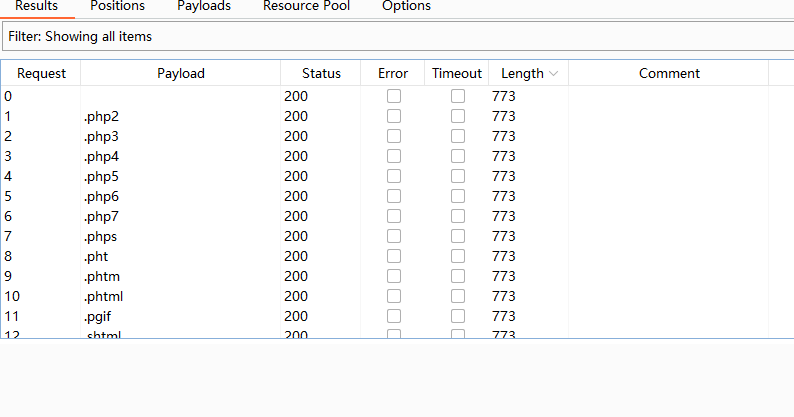  

>无线索看看，其他部分比如配置文件.htaccess,并且找一下配置这个的方法
>

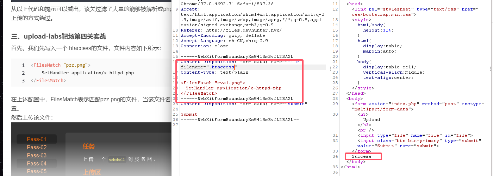  

>找一下上传的路径位置
>
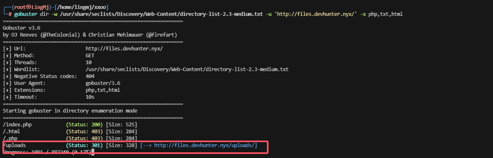  

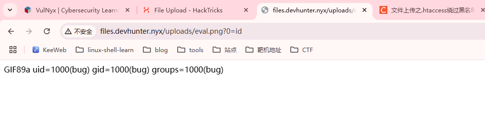  
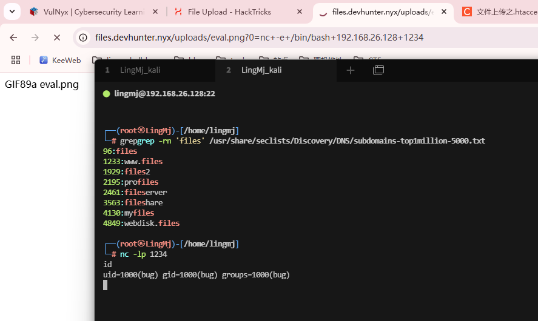  

## 提权

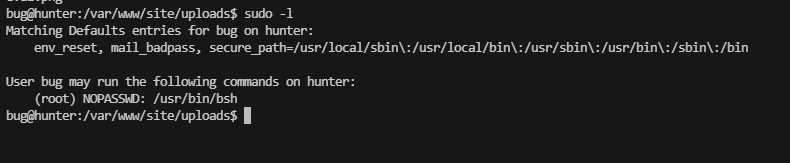  

>bug@hunter:/tmp$ sudo /usr/bin/bsh -h
File not found: java.io.FileNotFoundException: /tmp/-h (No such file or directory)
bug@hunter:/tmp$
>
>没什么东西
>
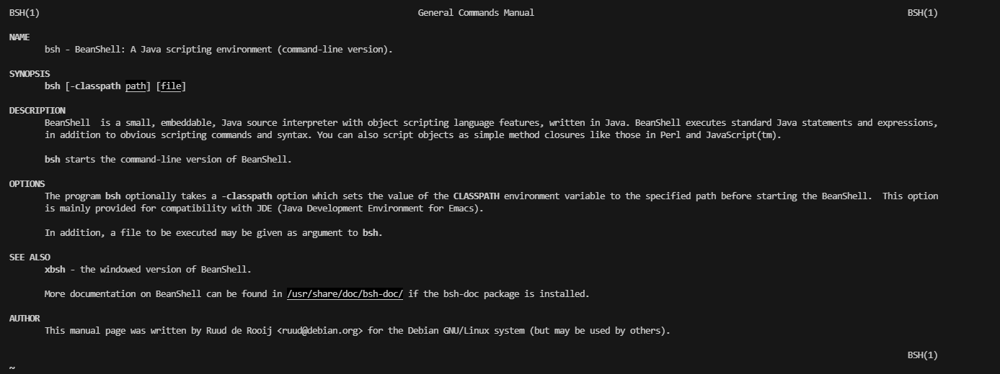  

>查看一下手册看看有什么能利用
>
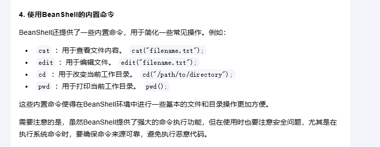  
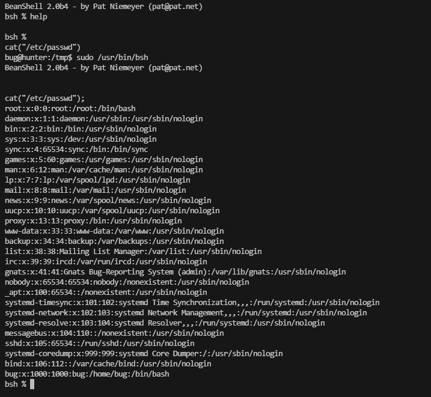  

>这里可以看到可以读取文件，也可以修改文件
>
```
└─# openssl passwd 111111
$1$O4S5rKPu$NLZeHWyGZBSlySU7AlIu6/
```
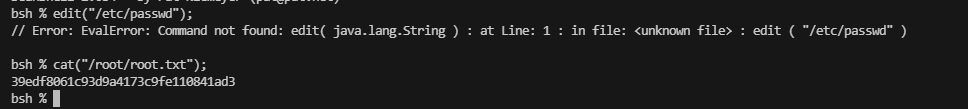  
>没改成功

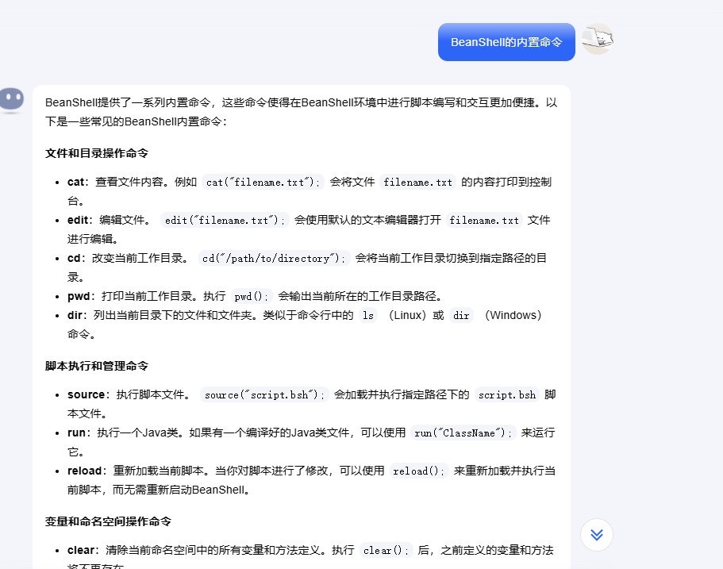  

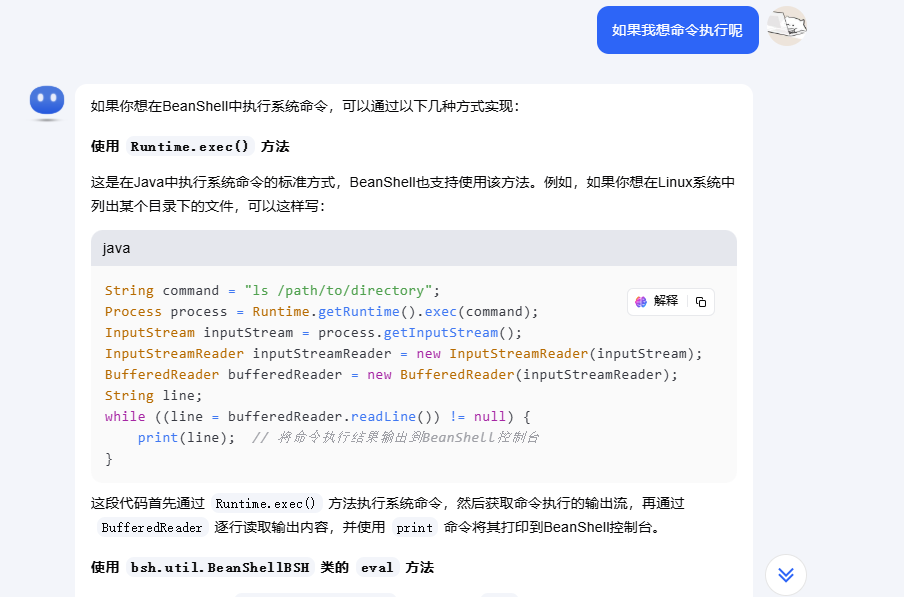  

>这里出现的有用的命令执行是写java文件，继续查找
>
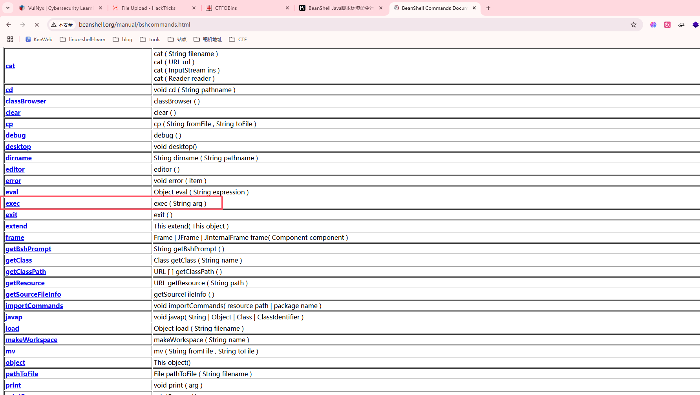  
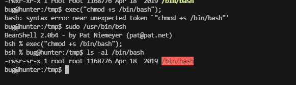  
>这里出现命令执行完成操作
>
>userflag:4dbd02025cadc283bf3d5cfe95e40ce3
>
>rootflag:39edf8061c93d9a4173c9fe110841ad3