## 网段扫描
```
└─# arp-scan -l
Interface: eth0, type: EN10MB, MAC: 00:0c:29:df:e2:a7, IPv4: 192.168.26.128
Starting arp-scan 1.10.0 with 256 hosts (https://github.com/royhills/arp-scan)
192.168.26.1    00:50:56:c0:00:08       VMware, Inc.
192.168.26.2    00:50:56:e8:d4:e1       VMware, Inc.
192.168.26.162  00:0c:29:ad:63:7a       VMware, Inc.
192.168.26.163  00:0c:29:29:6e:32       VMware, Inc.
192.168.26.254  00:50:56:e2:a3:32       VMware, Inc.

105 packets received by filter, 0 packets dropped by kernel
Ending arp-scan 1.10.0: 256 hosts scanned in 2.986 seconds (85.73 hosts/sec). 5 responded
```

## 端口扫描

```
└─# nmap -p- -sC -sV 192.168.26.163
Starting Nmap 7.94SVN ( https://nmap.org ) at 2025-01-16 20:42 EST
Nmap scan report for 192.168.26.163 (192.168.26.163)
Host is up (0.0013s latency).
Not shown: 65533 closed tcp ports (reset)
PORT   STATE SERVICE VERSION
22/tcp open  ssh     OpenSSH 9.2p1 Debian 2+deb12u1 (protocol 2.0)
| ssh-hostkey: 
|   256 a9:a8:52:f3:cd:ec:0d:5b:5f:f3:af:5b:3c:db:76:b6 (ECDSA)
|_  256 73:f5:8e:44:0c:b9:0a:e0:e7:31:0c:04:ac:7e:ff:fd (ED25519)
80/tcp open  http    Apache httpd 2.4.57 ((Debian))
|_http-title: Apache2 Debian Default Page: It works
|_http-server-header: Apache/2.4.57 (Debian)
MAC Address: 00:0C:29:29:6E:32 (VMware)
Service Info: OS: Linux; CPE: cpe:/o:linux:linux_kernel

Service detection performed. Please report any incorrect results at https://nmap.org/submit/ .
Nmap done: 1 IP address (1 host up) scanned in 71.44 seconds

└─# nmap -sU --top-ports 20 192.168.26.163
Starting Nmap 7.94SVN ( https://nmap.org ) at 2025-01-16 20:48 EST
Nmap scan report for 192.168.26.163 (192.168.26.163)
Host is up (0.0018s latency).

PORT      STATE         SERVICE
53/udp    closed        domain
67/udp    closed        dhcps
68/udp    open|filtered dhcpc
69/udp    closed        tftp
123/udp   closed        ntp
135/udp   closed        msrpc
137/udp   closed        netbios-ns
138/udp   closed        netbios-dgm
139/udp   closed        netbios-ssn
161/udp   closed        snmp
162/udp   closed        snmptrap
445/udp   closed        microsoft-ds
500/udp   closed        isakmp
514/udp   closed        syslog
520/udp   closed        route
631/udp   closed        ipp
1434/udp  closed        ms-sql-m
1900/udp  closed        upnp
4500/udp  closed        nat-t-ike
49152/udp closed        unknown
MAC Address: 00:0C:29:29:6E:32 (VMware)

Nmap done: 1 IP address (1 host up) scanned in 20.16 seconds
```

## 获取shell
>这里只有一个80，22端口，去网页查看有用信息
>

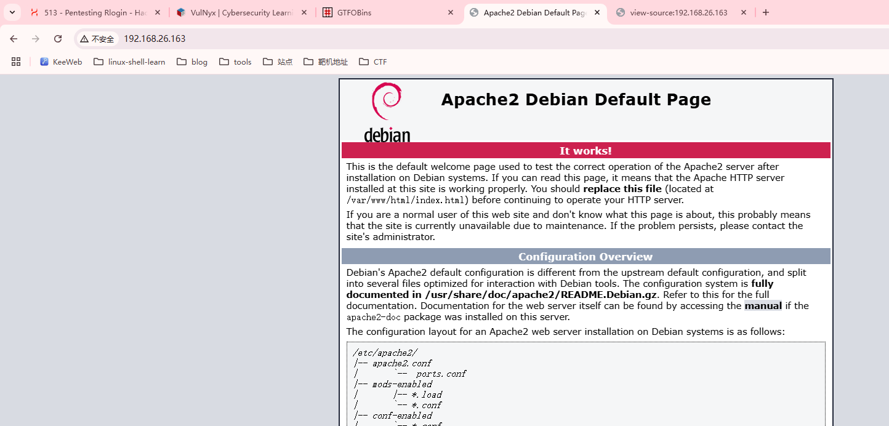  

>一个apache服务而且网页源码没有藏东西，进行目录扫描
>

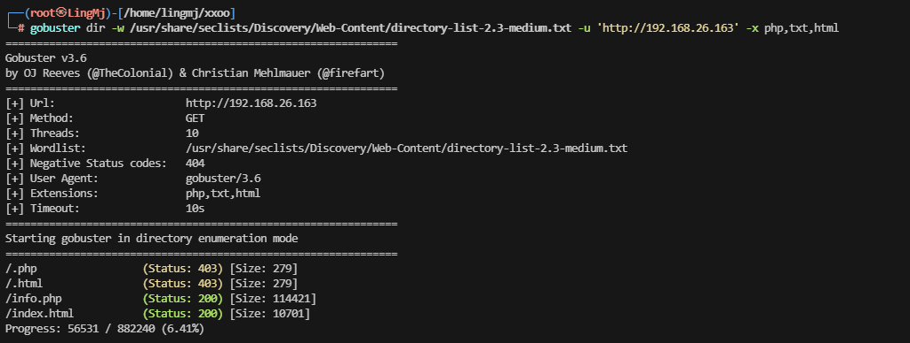  

>这里出现有用信息info.php
>
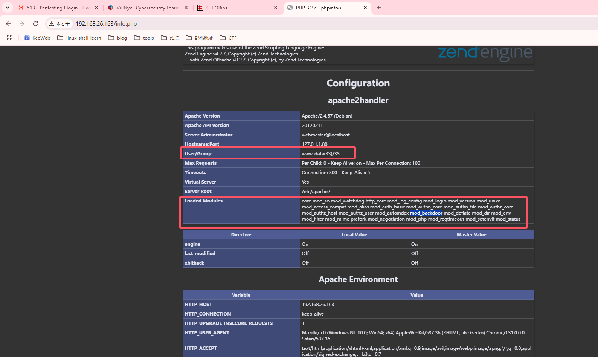  

>这里有用户为www-data和一系列mod，backdoor引起我的注意
>

  

>利用搜索漏洞发现了exploit，尝试进行利用
>

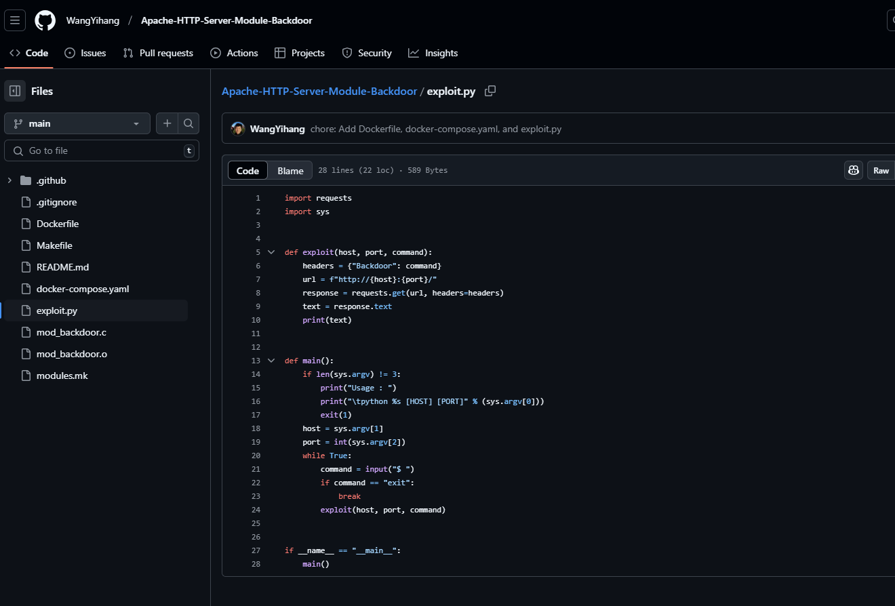  

>存在python的poc，直接利用获取webshell
>

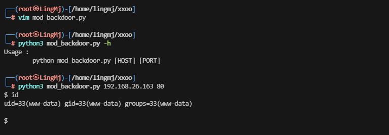  

## 提权

  
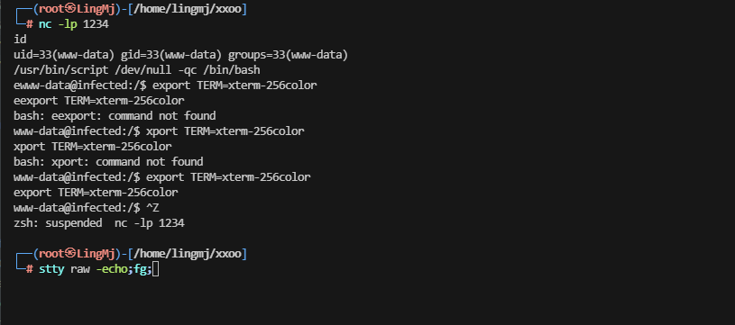  


>这里没发现目录穿越，nc直接失败利用busybox成功
>
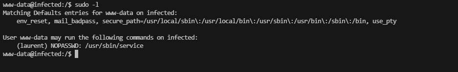  
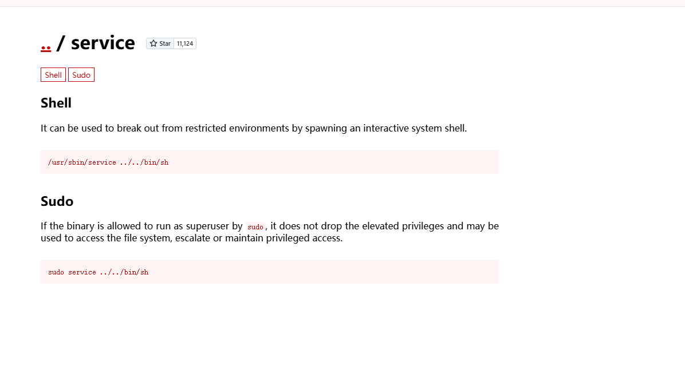  
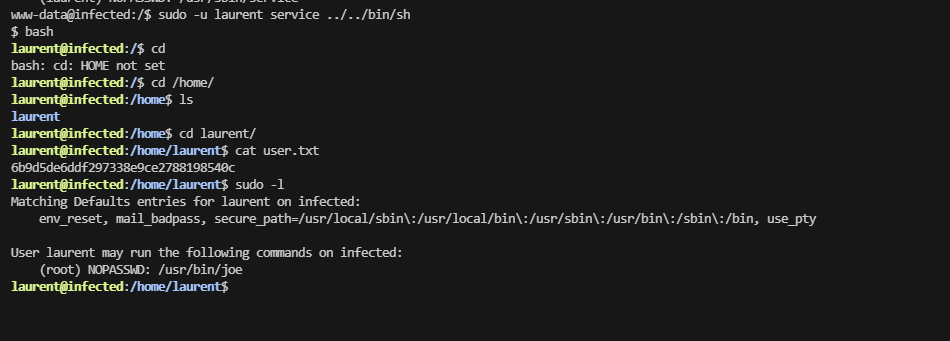  
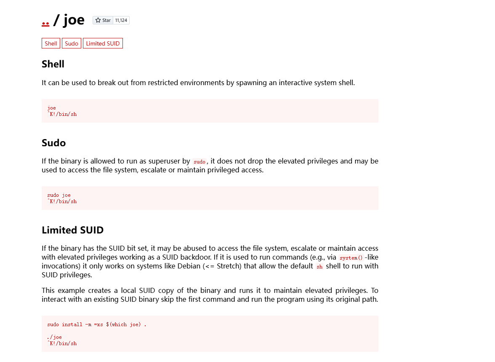  
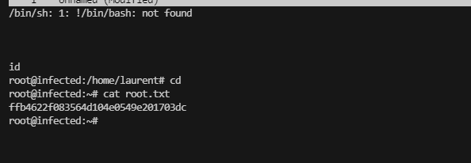  

>这个靶场复盘结束
>
>userflag:6b9d5de6ddf297338e9ce2788198540c
>
>rootflag:ffb4622f083564d104e0549e201703dc
>


