## 网段扫描
```
└─# arp-scan -l
Interface: eth0, type: EN10MB, MAC: 00:0c:29:df:e2:a7, IPv4: 192.168.26.128
WARNING: Cannot open MAC/Vendor file ieee-oui.txt: Permission denied
WARNING: Cannot open MAC/Vendor file mac-vendor.txt: Permission denied
Starting arp-scan 1.10.0 with 256 hosts (https://github.com/royhills/arp-scan)
192.168.26.1    00:50:56:c0:00:08       (Unknown)
192.168.26.2    00:50:56:e8:d4:e1       (Unknown)
192.168.26.162  00:0c:29:ad:63:7a       (Unknown)
192.168.26.254  00:50:56:e2:a3:32       (Unknown)

5 packets received by filter, 0 packets dropped by kernel
Ending arp-scan 1.10.0: 256 hosts scanned in 1.921 seconds (133.26 hosts/sec). 4 responded
```
## 端口扫描
```
└─# nmap -p- -sC -sV 192.168.26.162       
Starting Nmap 7.94SVN ( https://nmap.org ) at 2025-01-16 20:03 EST
Nmap scan report for 192.168.26.162 (192.168.26.162)
Host is up (0.0012s latency).
Not shown: 65531 closed tcp ports (reset)
PORT    STATE SERVICE    VERSION
80/tcp  open  http       Apache httpd 2.4.56 ((Debian))
|_http-title: Monna Lisa
|_http-server-header: Apache/2.4.56 (Debian)
512/tcp open  exec?
513/tcp open  login
514/tcp open  tcpwrapped
MAC Address: 00:0C:29:AD:63:7A (VMware)

Service detection performed. Please report any incorrect results at https://nmap.org/submit/ .
Nmap done: 1 IP address (1 host up) scanned in 127.88 seconds
```
>这里我们可以获取到开放的端口显眼的是512，513，514，它们像是一种登录操作的描述
>
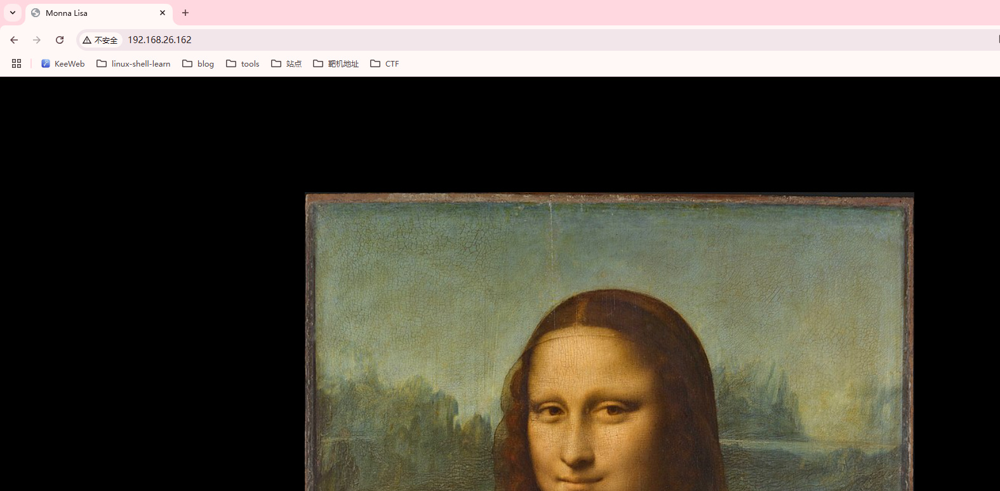  
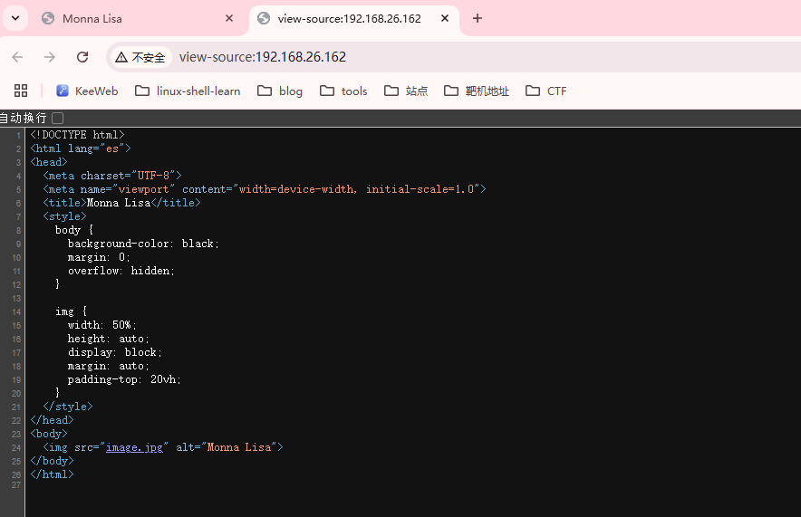

## 获取shell

>这里我们可以把图片下载下来进行steg的一系列操作
>

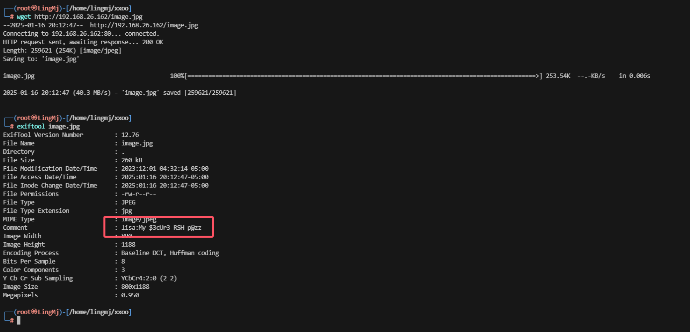  

>这里我们可以获取到一个像是账号密码的东西继续进行操作
>

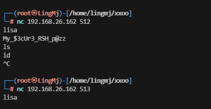  

>操作了一下并没有特殊的回显内容
>

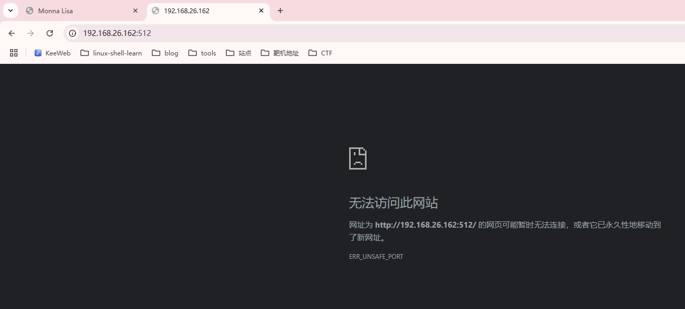  

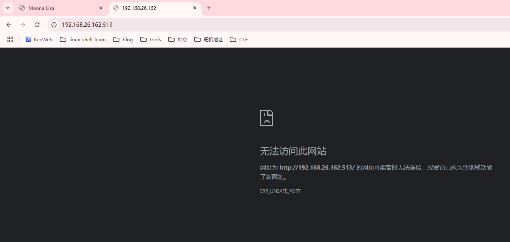  

>没有收获，需要查找对应的一些资料
>

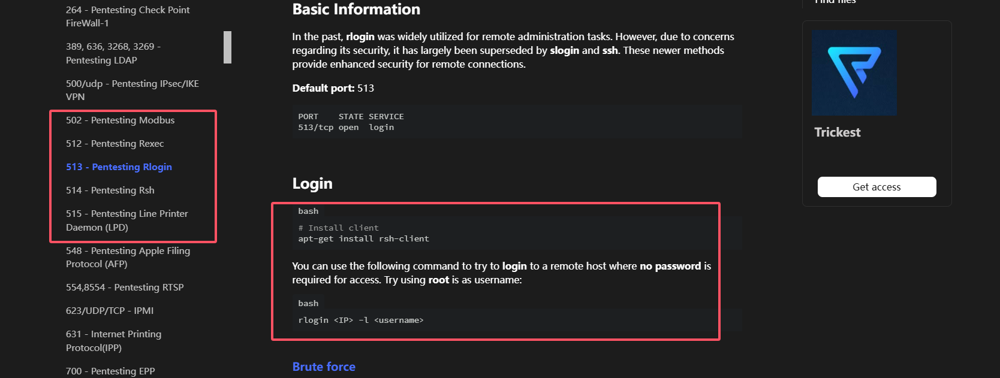  

>到这里大概有思路了
>

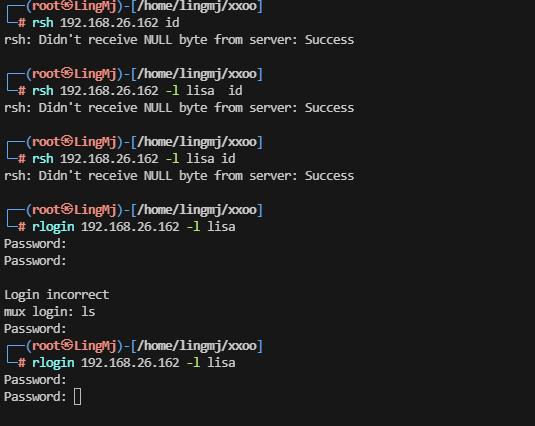  

>有点问题登录，这里有点卡住，先扫描目录缓缓思路
>

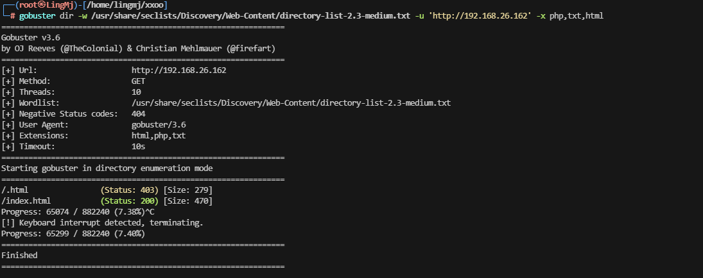  

>有点没头绪，唯一线索是图片，上面我只做了exif可以试试其他方法
>

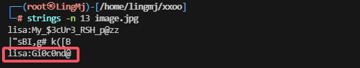  

>这里还有一个密码尝试一下
>

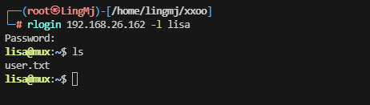  

>看来主要的图片查询方式为strings
>

## 提权

>先进行sudo -l
>
```
lisa@mux:~$ sudo -l
Matching Defaults entries for lisa on mux:
    env_reset, mail_badpass, secure_path=/usr/local/sbin\:/usr/local/bin\:/usr/sbin\:/usr/bin\:/sbin\:/bin

User lisa may run the following commands on mux:
    (root) NOPASSWD: /usr/bin/tmux
```
>发现不存在与ctfobins，这里利用-h进行操作
>

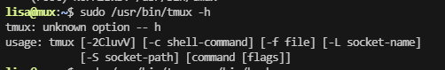  


>好像可以执行命令
>

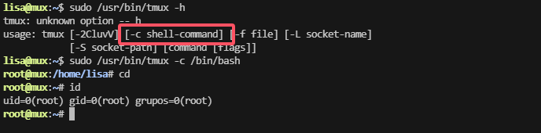  

>到这里靶场复盘结束
>
>uesrflag:be2034f028ebe41244687a8498c7cd3d
>
>rootflag:bcb441bf0878dca6f6d4d2c7787c6f4b
