## 网段扫描
```
└─# arp-scan -l
Interface: eth0, type: EN10MB, MAC: 00:0c:29:df:e2:a7, IPv4: 192.168.26.128
Starting arp-scan 1.10.0 with 256 hosts (https://github.com/royhills/arp-scan)
192.168.26.1    00:50:56:c0:00:08       VMware, Inc.
192.168.26.2    00:50:56:e8:d4:e1       VMware, Inc.
192.168.26.171  00:0c:29:1b:e0:1f       VMware, Inc.
192.168.26.254  00:50:56:e0:6d:ff       VMware, Inc.

5 packets received by filter, 0 packets dropped by kernel
Ending arp-scan 1.10.0: 256 hosts scanned in 2.579 seconds (99.26 hosts/sec). 4 responded
```

## 端口扫描

```
└─# nmap -p- -sC -sV 192.168.26.171
Starting Nmap 7.94SVN ( https://nmap.org ) at 2025-01-18 02:00 EST
Nmap scan report for 192.168.26.171 (192.168.26.171)
Host is up (0.00097s latency).
Not shown: 65532 closed tcp ports (reset)
PORT     STATE SERVICE  VERSION
21/tcp   open  ftp      pyftpdlib 1.5.4
| ftp-syst: 
|   STAT: 
| FTP server status:
|  Connected to: 192.168.26.171:21
|  Waiting for username.
|  TYPE: ASCII; STRUcture: File; MODE: Stream
|  Data connection closed.
|_End of status.
| ftp-anon: Anonymous FTP login allowed (FTP code 230)
|_drwxrwxrwx   2 root     root         4096 Feb 09  2024 .backup [NSE: writeable]
80/tcp   open  http     Apache httpd 2.4.38 ((Debian))
|_http-title: Apache2 Debian Default Page: It works
|_http-server-header: Apache/2.4.38 (Debian)
4200/tcp open  ssl/http ShellInABox
|_ssl-date: TLS randomness does not represent time
| ssl-cert: Subject: commonName=dump
| Not valid before: 2024-02-09T11:53:57
|_Not valid after:  2044-02-04T11:53:57
|_http-title: Shell In A Box
MAC Address: 00:0C:29:1B:E0:1F (VMware)

Service detection performed. Please report any incorrect results at https://nmap.org/submit/ .
Nmap done: 1 IP address (1 host up) scanned in 80.85 seconds
```
## 获取Webshell
>发现存在ftp，可以利用ftp获取关键信息
>
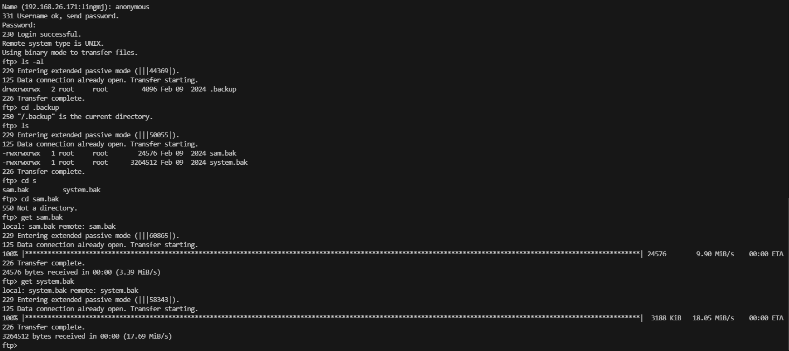  
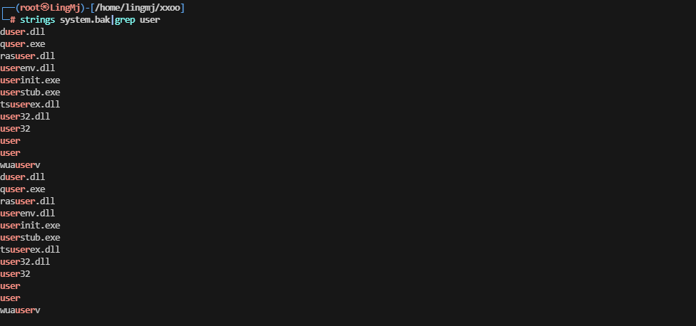  
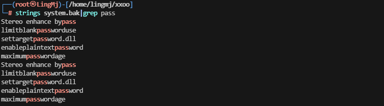  

>目前这2个bak文件没有获取对应有用的信息，去扫一下web目录，查看web信息
>
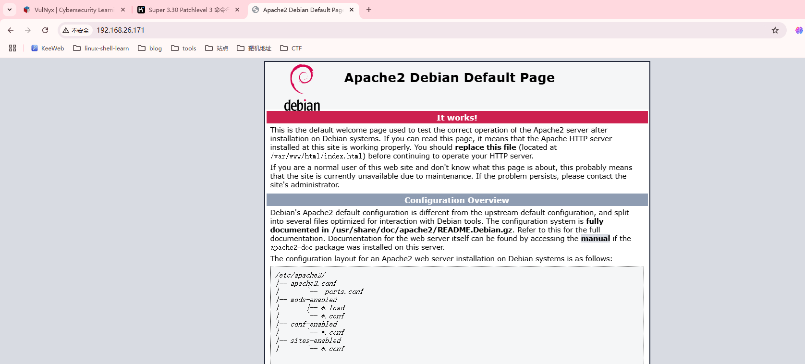  
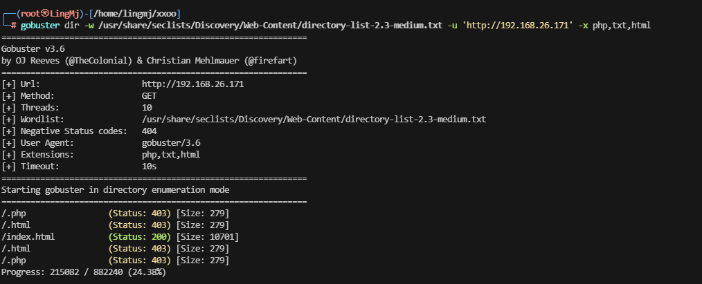
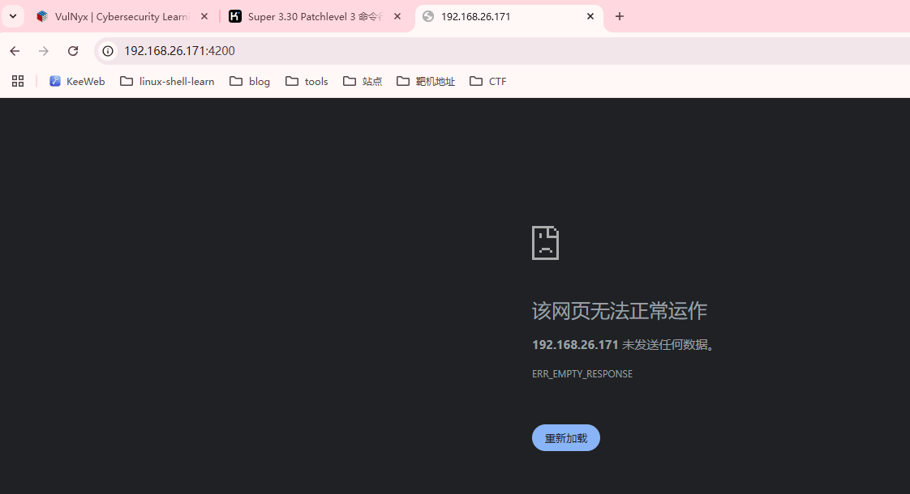  
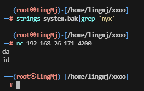  

>此时无线索，查看bak的用法吧。
>
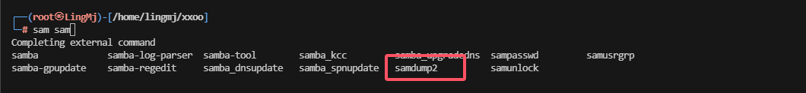  
>查到一个工具是用于dump bak文件的,看一下手册
>
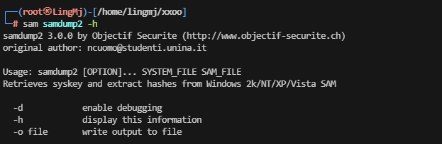  
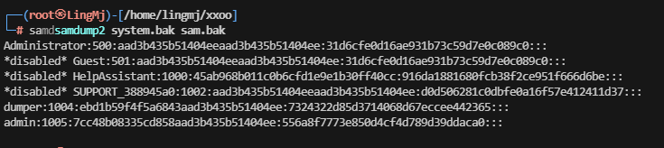  
>获取的信息是这个样子的
>
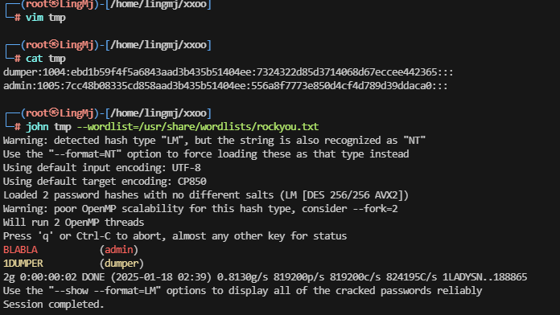  
>这里没有登录的地方,选择尝试4200端口突破
>
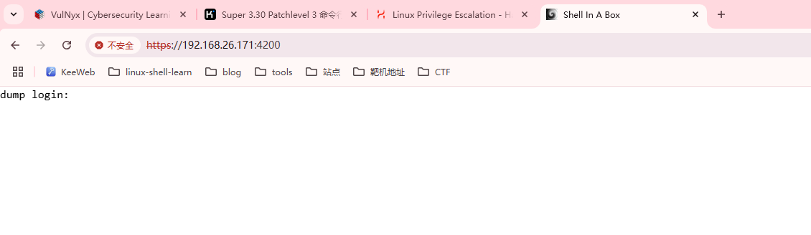  

>需要https进行操作
>
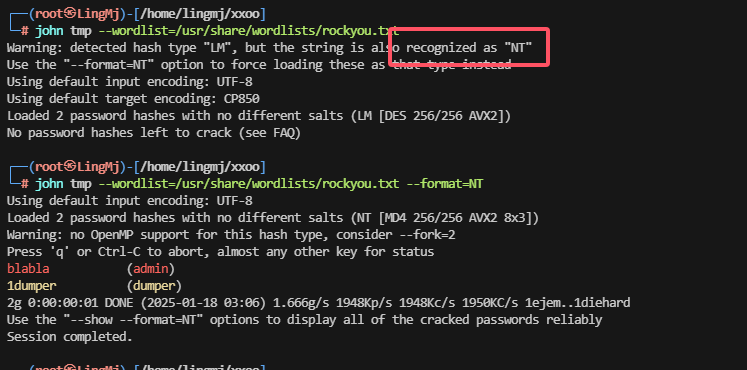  

>这里发现大写的无法进行登录选择使用对应的东西再次爆破。
>
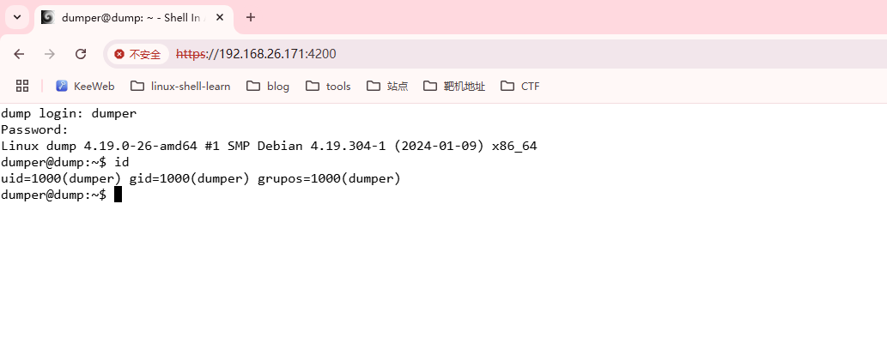  
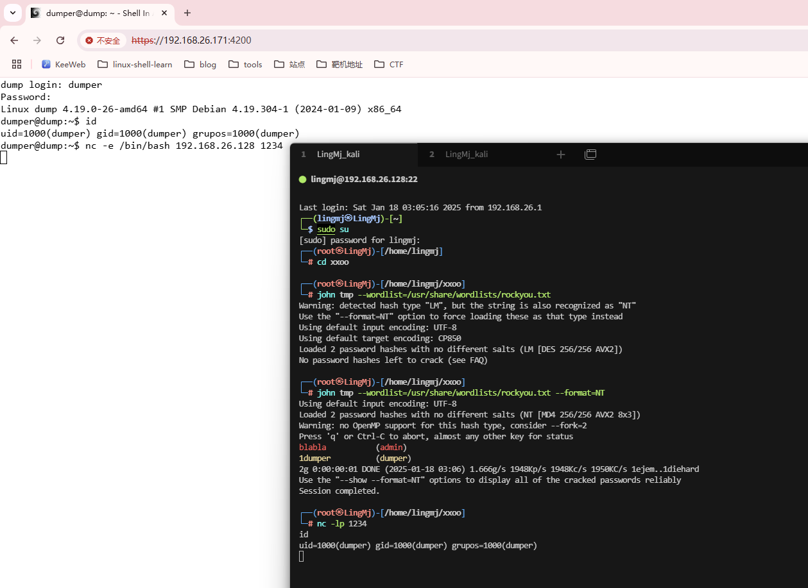  

## 提权
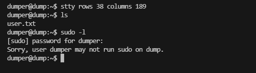
>利用工具找一下对应的文件
>
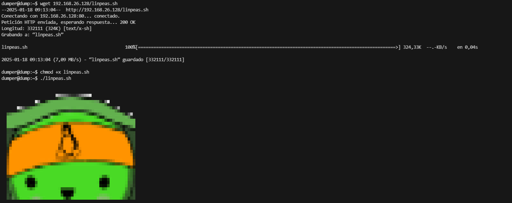  
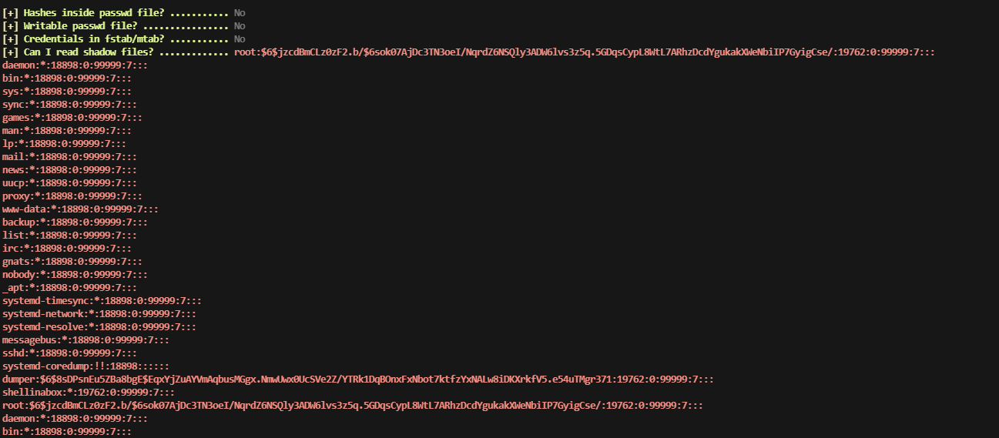  
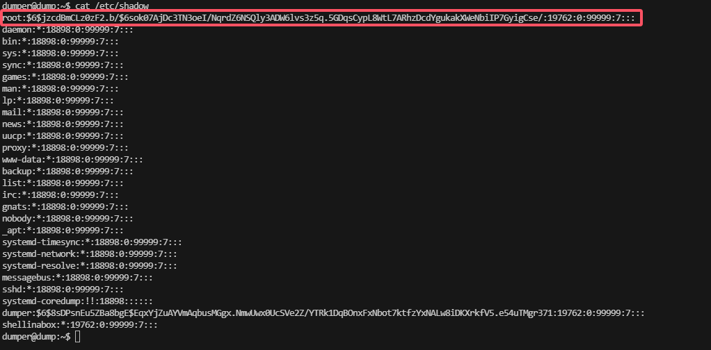  
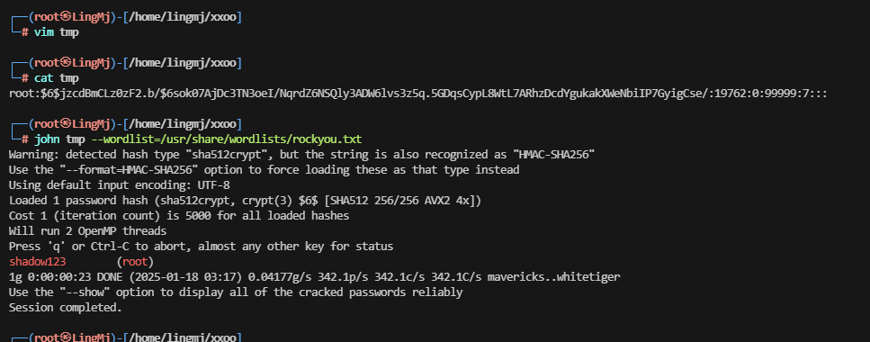  
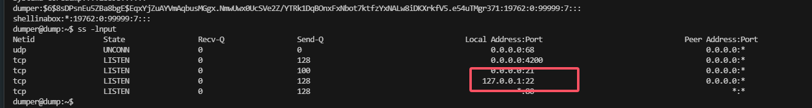  
  
>这里需要把端口开出来
>
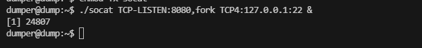  
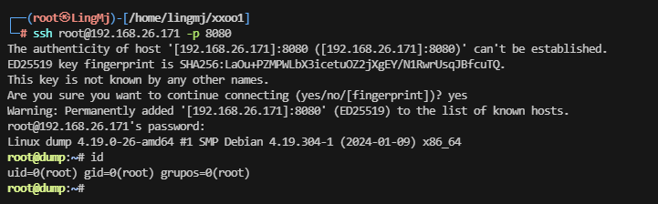  

>到这里靶场复盘结束
>
>userflag:cfbe86765c16e9bf8ddc3739f4f270a9
>
>rootflag:60c60f8e926b65a55bf8bd6239bb616d
>


