## 网段扫描
```
└─# arp-scan -l
Interface: eth0, type: EN10MB, MAC: 00:0c:29:df:e2:a7, IPv4: 192.168.26.128
Starting arp-scan 1.10.0 with 256 hosts (https://github.com/royhills/arp-scan)
192.168.26.1    00:50:56:c0:00:08       VMware, Inc.
192.168.26.2    00:50:56:e8:d4:e1       VMware, Inc.
192.168.26.176  00:0c:29:10:db:8c       VMware, Inc.
192.168.26.254  00:50:56:ff:4b:3d       VMware, Inc.
192.168.26.1    00:50:56:c0:00:08       VMware, Inc. (DUP: 2)

5 packets received by filter, 0 packets dropped by kernel
Ending arp-scan 1.10.0: 256 hosts scanned in 2.227 seconds (114.95 hosts/sec). 4 responded
```

## 端口扫描

```
└─# nmap -p- -sC -sV 192.168.26.176       
Starting Nmap 7.94SVN ( https://nmap.org ) at 2025-01-18 23:26 EST
Nmap scan report for 192.168.26.176 (192.168.26.176)
Host is up (0.0012s latency).
Not shown: 65534 closed tcp ports (reset)
PORT   STATE SERVICE VERSION
21/tcp open  ssh     OpenSSH 7.9p1 Debian 10+deb10u4 (protocol 2.0)
|_ftp-bounce: ERROR: Script execution failed (use -d to debug)
| ssh-hostkey: 
|   2048 56:9b:dd:56:a5:c1:e3:52:a8:42:46:18:5e:0c:12:86 (RSA)
|   256 1b:d2:cc:59:21:50:1b:39:19:77:1d:28:c0:be:c6:82 (ECDSA)
|_  256 9c:e7:41:b6:ad:03:ed:f5:a1:4c:cc:0a:50:79:1c:20 (ED25519)
MAC Address: 00:0C:29:10:DB:8C (VMware)
Service Info: OS: Linux; CPE: cpe:/o:linux:linux_kernel

Service detection performed. Please report any incorrect results at https://nmap.org/submit/ .
Nmap done: 1 IP address (1 host up) scanned in 36.84 seconds
```
>重启一下，一个21而且没有匿名登录，单纯打不了，重新看一下描述是ssh端口，看看udp吧
>

```
└─# nmap -p- -sC -sV 192.168.26.176
Starting Nmap 7.94SVN ( https://nmap.org ) at 2025-01-18 23:30 EST
Nmap scan report for 192.168.26.176 (192.168.26.176)
Host is up (0.00093s latency).
Not shown: 65534 closed tcp ports (reset)
PORT   STATE SERVICE VERSION
21/tcp open  ssh     OpenSSH 7.9p1 Debian 10+deb10u4 (protocol 2.0)
|_ftp-bounce: ERROR: Script execution failed (use -d to debug)
| ssh-hostkey: 
|   2048 56:9b:dd:56:a5:c1:e3:52:a8:42:46:18:5e:0c:12:86 (RSA)
|   256 1b:d2:cc:59:21:50:1b:39:19:77:1d:28:c0:be:c6:82 (ECDSA)
|_  256 9c:e7:41:b6:ad:03:ed:f5:a1:4c:cc:0a:50:79:1c:20 (ED25519)
MAC Address: 00:0C:29:10:DB:8C (VMware)
Service Info: OS: Linux; CPE: cpe:/o:linux:linux_kernel

Service detection performed. Please report any incorrect results at https://nmap.org/submit/ .
Nmap done: 1 IP address (1 host up) scanned in 37.29 seconds

└─# nmap -sU --top-ports 20 192.168.26.176
Starting Nmap 7.94SVN ( https://nmap.org ) at 2025-01-18 23:31 EST
Nmap scan report for 192.168.26.176 (192.168.26.176)
Host is up (0.0016s latency).

PORT      STATE         SERVICE
53/udp    closed        domain
67/udp    open|filtered dhcps
68/udp    open|filtered dhcpc
69/udp    closed        tftp
123/udp   open|filtered ntp
135/udp   closed        msrpc
137/udp   open|filtered netbios-ns
138/udp   closed        netbios-dgm
139/udp   open|filtered netbios-ssn
161/udp   closed        snmp
162/udp   closed        snmptrap
445/udp   open|filtered microsoft-ds
500/udp   open|filtered isakmp
514/udp   closed        syslog
520/udp   closed        route
631/udp   closed        ipp
1434/udp  closed        ms-sql-m
1900/udp  closed        upnp
4500/udp  open|filtered nat-t-ike
49152/udp closed        unknown
MAC Address: 00:0C:29:10:DB:8C (VMware)

Nmap done: 1 IP address (1 host up) scanned in 7.88 seconds
```

>挨个查看一下并且查看ssh的版本cve
>

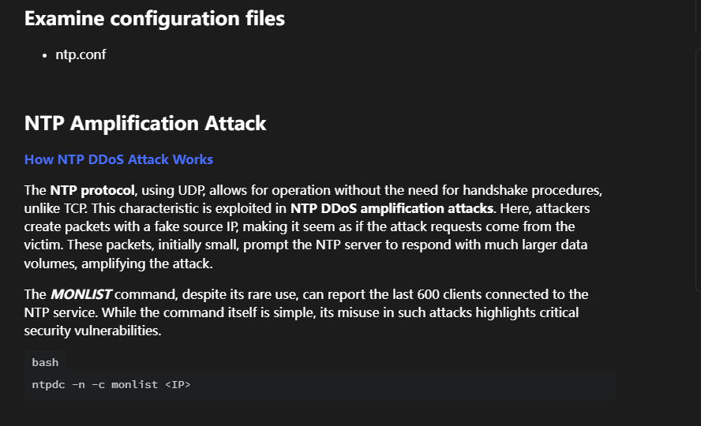  
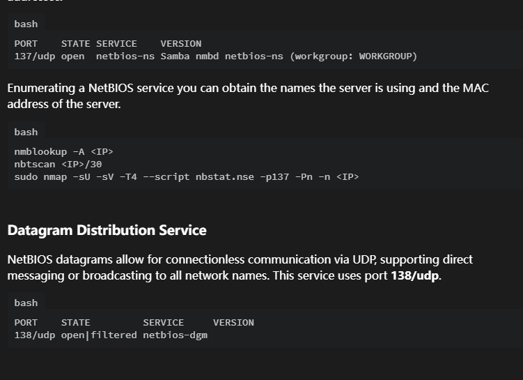  

>有139，445可以利用一下
>
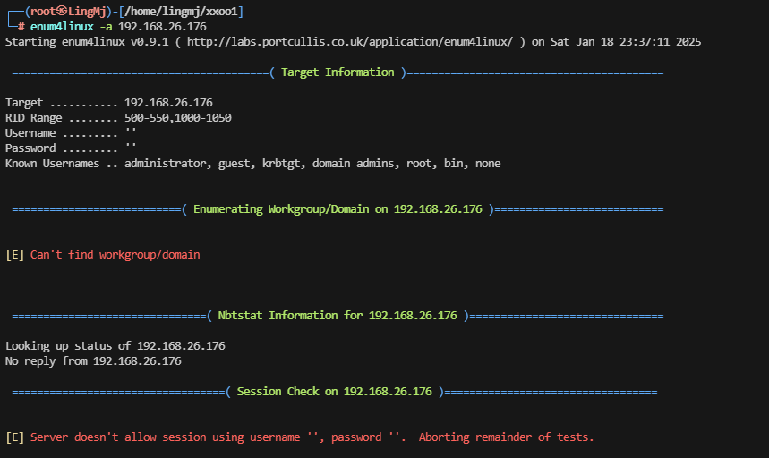  
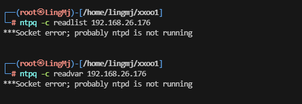  

>无获,感觉应该要进行一些其他操作。
>

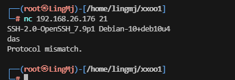  
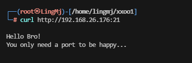  

>新线索，可以试curl 21端口
>
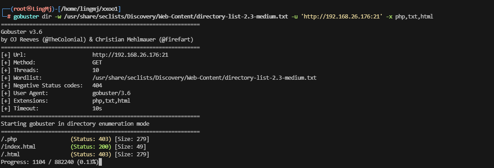  

>竟然能扫描，我是没想到的，很新奇
>

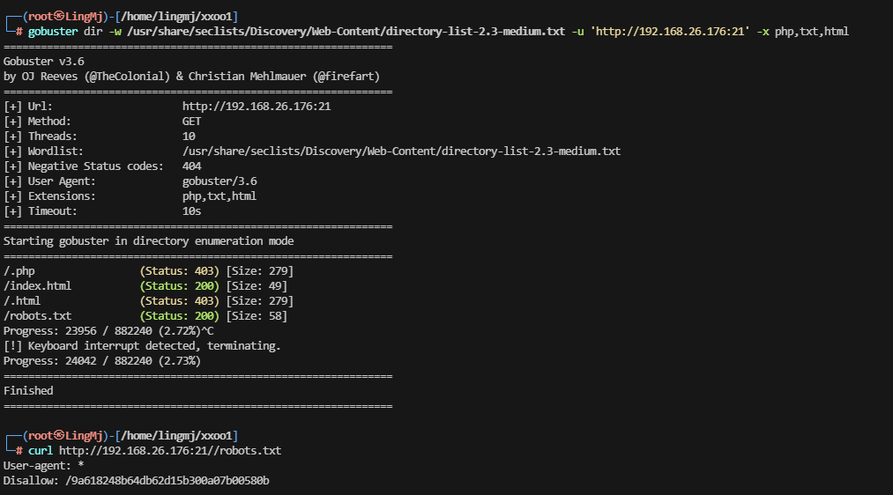  
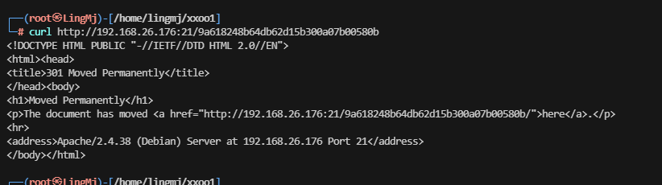  

>评价一下这个线索有问题,好像后面还有一部分内容
>

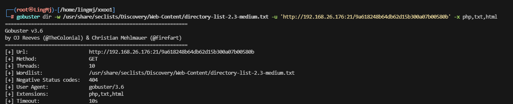  

>继续扫,看看有什么新东西出来
>
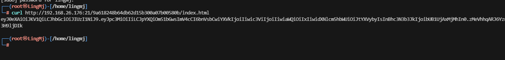  
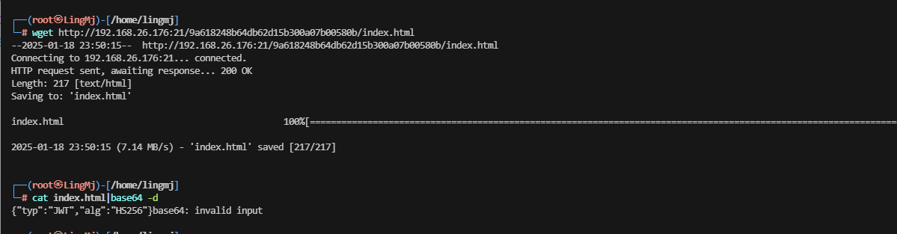  
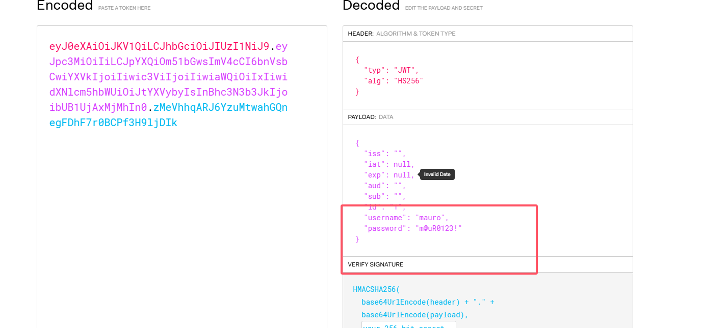  
>ok,拿到线索
>

## 提权
```
└─# ssh mauro@192.168.26.176 -p 21                
The authenticity of host '[192.168.26.176]:21 ([192.168.26.176]:21)' can't be established.
ED25519 key fingerprint is SHA256:LaOu+PZMPWLbX3icetuOZ2jXgEY/N1RwrUsqJBfcuTQ.
This host key is known by the following other names/addresses:
    ~/.ssh/known_hosts:52: [hashed name]
Are you sure you want to continue connecting (yes/no/[fingerprint])? yes
Warning: Permanently added '[192.168.26.176]:21' (ED25519) to the list of known hosts.
mauro@192.168.26.176's password: 
mauro@plex:~$ id
uid=1000(mauro) gid=1000(mauro) grupos=1000(mauro)
mauro@plex:~$ 

mauro@plex:~$ sudo -l
Matching Defaults entries for mauro on plex:
    env_reset, mail_badpass, secure_path=/usr/local/sbin\:/usr/local/bin\:/usr/sbin\:/usr/bin\:/sbin\:/bin

User mauro may run the following commands on plex:
    (root) NOPASSWD: /usr/bin/mutt
mauro@plex:~$ 
```

>到这里这个靶场基本结束,无ctfobins，但是可以看手册，有-e
>

```
mauro@plex:~$ /usr/bin/mutt -h
Mutt 1.10.1 (2018-07-13)
usage: mutt [<options>] [-z] [-f <file> | -yZ]
       mutt [<options>] [-Ex] [-Hi <file>] [-s <subj>] [-bc <addr>] [-a <file> [...] --] <addr> [...]
       mutt [<options>] [-x] [-s <subj>] [-bc <addr>] [-a <file> [...] --] <addr> [...] < message
       mutt [<options>] -p
       mutt [<options>] -A <alias> [...]
       mutt [<options>] -Q <query> [...]
       mutt [<options>] -D
       mutt -v[v]

options:
  -A <alias>    expand the given alias
  -a <file> [...] --    attach file(s) to the message
                the list of files must be terminated with the "--" sequence
  -b <address>  specify a blind carbon-copy (BCC) address
  -c <address>  specify a carbon-copy (CC) address
  -D            print the value of all variables to stdout
  -d <level>    log debugging output to ~/.muttdebug0
  -E            edit the draft (-H) or include (-i) file
  -e <command>  specify a command to be executed after initialization
  -f <file>     specify which mailbox to read
  -F <file>     specify an alternate muttrc file
  -H <file>     specify a draft file to read header and body from
  -i <file>     specify a file which Mutt should include in the body
  -m <type>     specify a default mailbox type
  -n            causes Mutt not to read the system Muttrc
  -p            recall a postponed message
  -Q <variable> query a configuration variable
  -R            open mailbox in read-only mode
  -s <subj>     specify a subject (must be in quotes if it has spaces)
  -v            show version and compile-time definitions
  -x            simulate the mailx send mode
  -y            select a mailbox specified in your `mailboxes' list
  -z            exit immediately if there are no messages in the mailbox
  -Z            open the first folder with new message, exit immediately if none
  -h            this help message
```
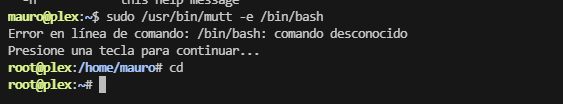  

>进去随便点就能输入命令完成提权，靶场复盘结束
>
>userflag:05135a0133cbb692dc66761e5d99364a
>
>rootflag:943f08fb32181d5f8171332146f39e41
>


