## 网段扫描
```
└─# arp-scan -l
Interface: eth0, type: EN10MB, MAC: 00:0c:29:df:e2:a7, IPv4: 192.168.26.128
Starting arp-scan 1.10.0 with 256 hosts (https://github.com/royhills/arp-scan)
192.168.26.1    00:50:56:c0:00:08       VMware, Inc.
192.168.26.2    00:50:56:e8:d4:e1       VMware, Inc.
192.168.26.186  00:0c:29:53:a9:b0       VMware, Inc.
192.168.26.254  00:50:56:e8:96:d1       VMware, Inc.

4 packets received by filter, 0 packets dropped by kernel
Ending arp-scan 1.10.0: 256 hosts scanned in 2.536 seconds (100.95 hosts/sec). 4 responded
```

## 端口扫描

```
└─# nmap -p- -sC -sV 192.168.26.186       
Starting Nmap 7.94SVN ( https://nmap.org ) at 2025-01-20 07:15 EST
Nmap scan report for 192.168.26.186 (192.168.26.186)
Host is up (0.0015s latency).
Not shown: 65533 closed tcp ports (reset)
PORT   STATE SERVICE VERSION
22/tcp open  ssh     OpenSSH 9.2p1 Debian 2+deb12u2 (protocol 2.0)
| ssh-hostkey: 
|   256 e1:85:8b:7b:6d:a2:6b:1a:ed:18:8e:08:a0:90:87:2a (ECDSA)
|_  256 ad:fe:77:78:a0:57:70:cc:33:68:b5:84:26:a3:b3:63 (ED25519)
80/tcp open  http    Apache httpd 2.4.59 ((Debian))
|_http-server-header: Apache/2.4.59 (Debian)
|_http-title: Essex
MAC Address: 00:0C:29:53:A9:B0 (VMware)
Service Info: OS: Linux; CPE: cpe:/o:linux:linux_kernel

Service detection performed. Please report any incorrect results at https://nmap.org/submit/ .
Nmap done: 1 IP address (1 host up) scanned in 78.85 seconds
```

## 获取webshell

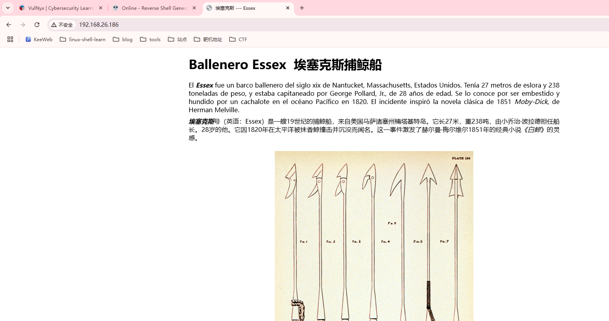  
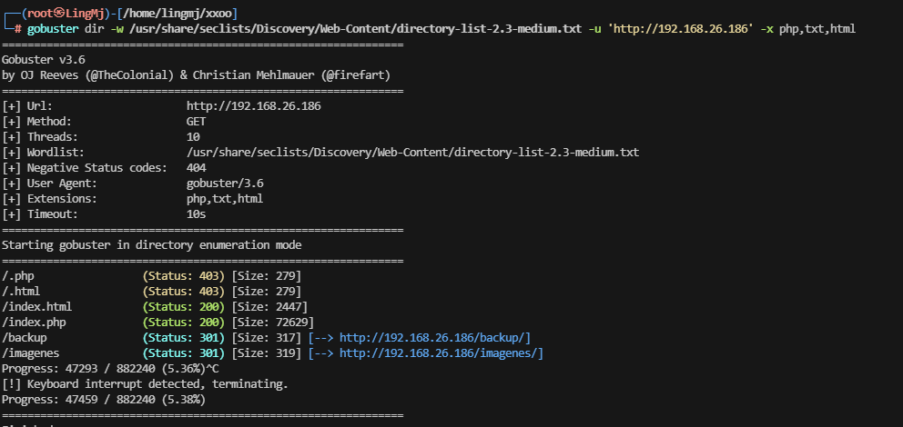  

>没什么看点爆破一下，思路有了
>
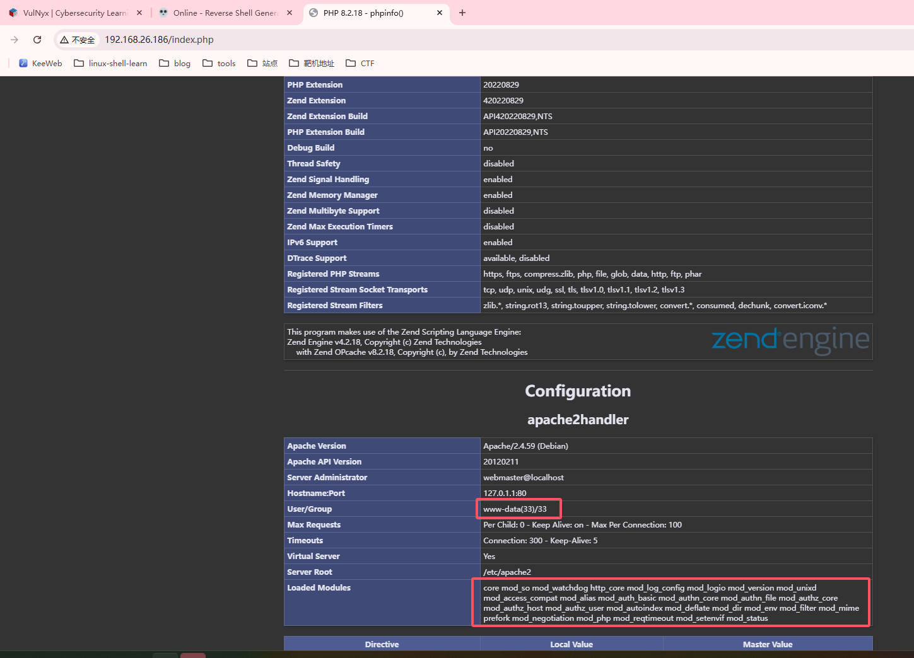  
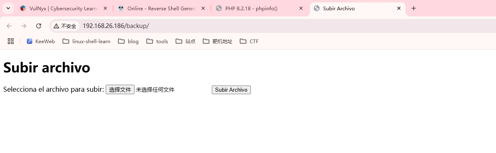  

>有上传，研究上传
>
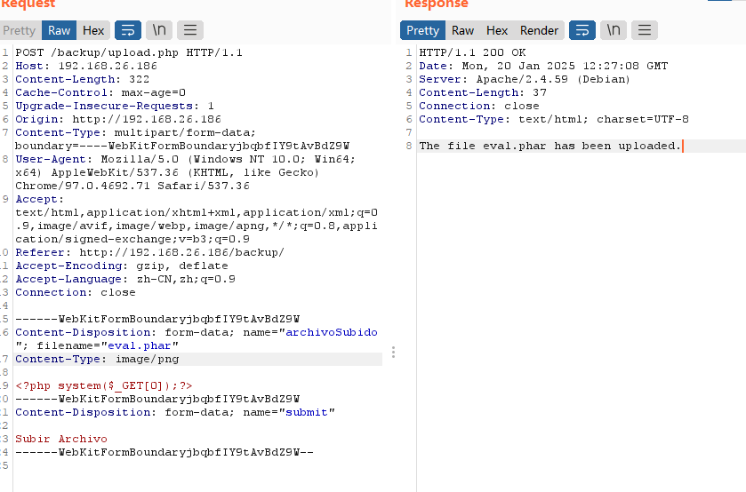  

>这个靶机可以秒了，哈哈哈，不过没看出上传点在那
>
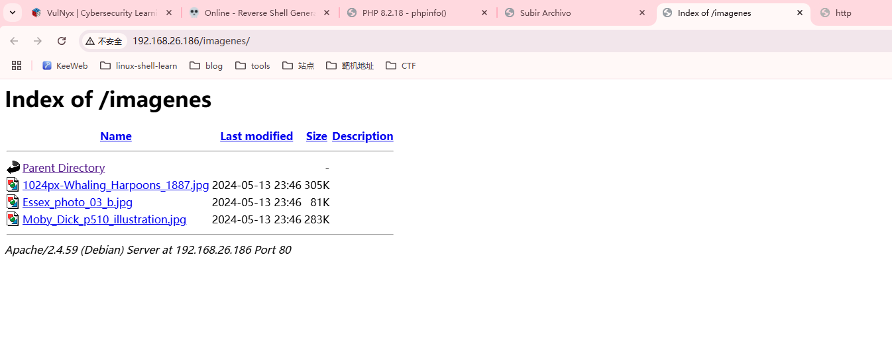  
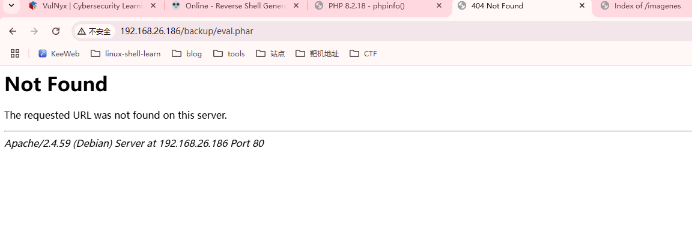  
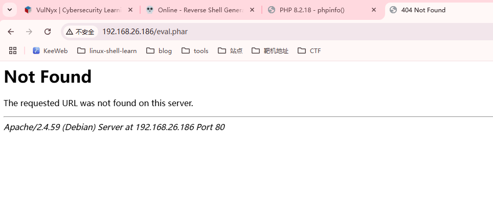  
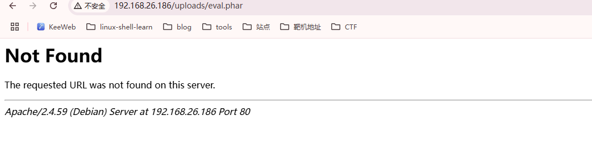  
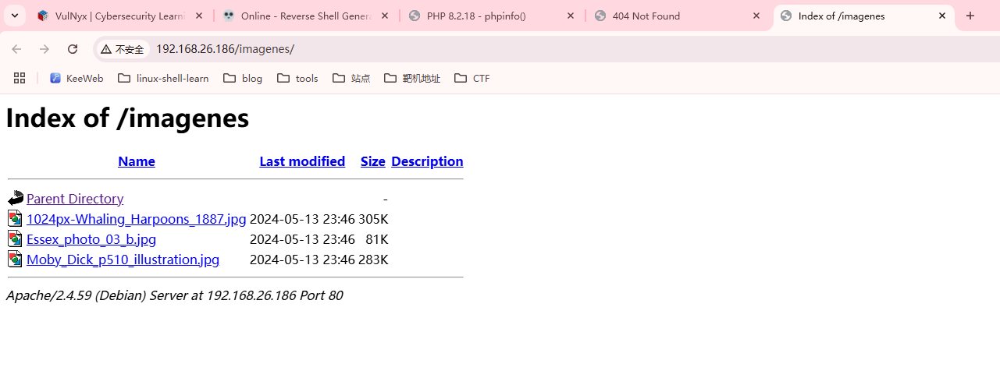  

>统统不见，说早了，没路径秒不了
>
   
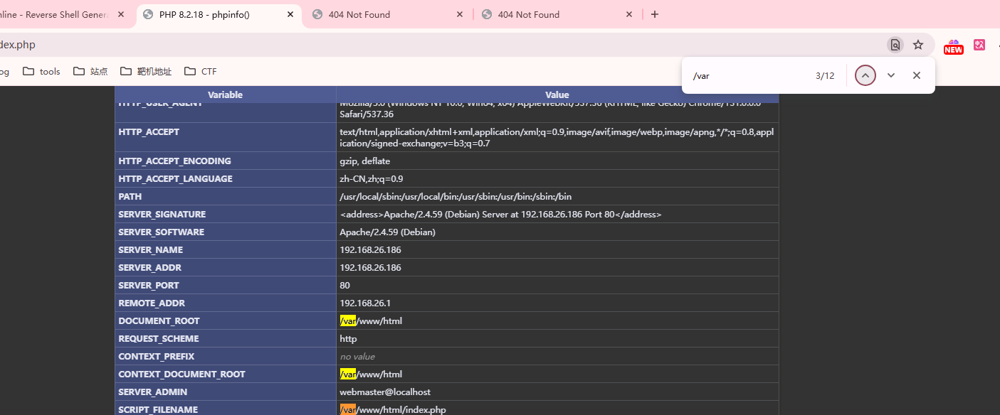  

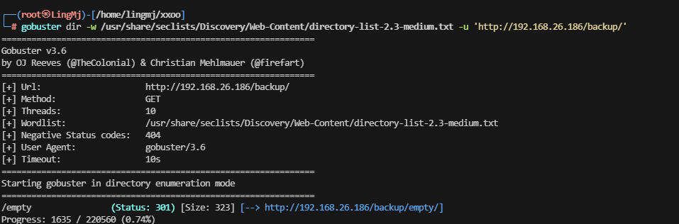  
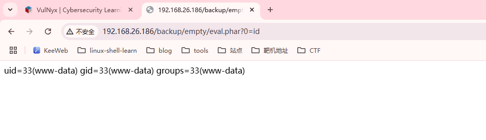  

>还是挺简单的只不过还是得目录扫全
>

## 提权
```
www-data@arpon:/var/www/html/backup/empty$ ls -al
total 24
drwxr-xr-x 3 www-data www-data 4096 Jan 20 13:27 .
drwxr-xr-x 3 www-data www-data 4096 May 12  2024 ..
drwxr-xr-x 2 www-data www-data 4096 May 13  2024 .hidden
-rw-r--r-- 1 www-data www-data   25 Jan 20 13:26 eval.html
-rw-r--r-- 1 www-data www-data   25 Jan 20 13:27 eval.phar
-rw-r--r-- 1 www-data www-data    1 May 12  2024 index.html
www-data@arpon:/var/www/html/backup/empty$ sudo -l
[sudo] password for www-data: 
sudo: a password is required
www-data@arpon:/var/www/html/backup/empty$ cd ..
www-data@arpon:/var/www/html/backup$ ls -al
total 20
drwxr-xr-x 3 www-data www-data 4096 May 12  2024 .
drwxr-xr-x 4 root     root     4096 May 13  2024 ..
drwxr-xr-x 3 www-data www-data 4096 Jan 20 13:27 empty
-rw-r--r-- 1 www-data www-data  421 May 12  2024 index.html
-rw-r--r-- 1 www-data www-data  919 May 12  2024 upload.php
www-data@arpon:/var/www/html/backup$ cd ..
www-data@arpon:/var/www/html$ ls -al
total 24
drwxr-xr-x 4 root     root     4096 May 13  2024 .
drwxr-xr-x 3 root     root     4096 May 12  2024 ..
drwxr-xr-x 3 www-data www-data 4096 May 12  2024 backup
drwxr-xr-x 2 root     root     4096 May 13  2024 imagenes
-rw-r--r-- 1 root     root     2447 May 13  2024 index.html
-rw-r--r-- 1 root     root       20 May 12  2024 index.php
```

```
www-data@arpon:/var/www/html/backup/empty$ cd /home/
www-data@arpon:/home$ ls -al
total 16
drwxr-xr-x  4 root      root      4096 May 14  2024 .
drwxr-xr-x 18 root      root      4096 May 11  2024 ..
drwx------  3 calabrote calabrote 4096 May 12  2024 calabrote
drwx------  5 foque     foque     4096 May 13  2024 foque
www-data@arpon:/home$ cd /opt/
www-data@arpon:/opt$ ls -al
total 12
drwxr-xr-x  3 root root 4096 May 13  2024 .
drwxr-xr-x 18 root root 4096 May 11  2024 ..
drwx--x--x  4 root root 4096 May 13  2024 containerd
www-data@arpon:/opt$ cdco
bash: cdco: command not found
www-data@arpon:/opt$ cd containerd/
www-data@arpon:/opt/containerd$ ls a-l
ls: cannot access 'a-l': No such file or directory
www-data@arpon:/opt/containerd$ ls -al
ls: cannot open directory '.': Permission denied
www-data@arpon:/opt/containerd$ ls -al
ls: cannot open directory '.': Permission denied
www-data@arpon:/opt/containerd$ cd ..
www-data@arpon:/opt$ ls -al
total 12
drwxr-xr-x  3 root root 4096 May 13  2024 .
drwxr-xr-x 18 root root 4096 May 11  2024 ..
drwx--x--x  4 root root 4096 May 13  2024 containerd
www-data@arpon:/opt$ cd /var/backups/
www-data@arpon:/var/backups$ ls -al
total 432
drwxr-xr-x  2 root root   4096 May 14  2024 .
drwxr-xr-x 12 root root   4096 May 12  2024 ..
-rw-r--r--  1 root root  40960 May 14  2024 alternatives.tar.0
-rw-r--r--  1 root root   9716 May 13  2024 apt.extended_states.0
-rw-r--r--  1 root root    943 May 12  2024 apt.extended_states.1.gz
-rw-r--r--  1 root root      0 May 14  2024 dpkg.arch.0
-rw-r--r--  1 root root    186 May 11  2024 dpkg.diversions.0
-rw-r--r--  1 root root    172 May 12  2024 dpkg.statoverride.0
-rw-r--r--  1 root root 368486 May 13  2024 dpkg.status.0
www-data@arpon:/var/backups$ 
```
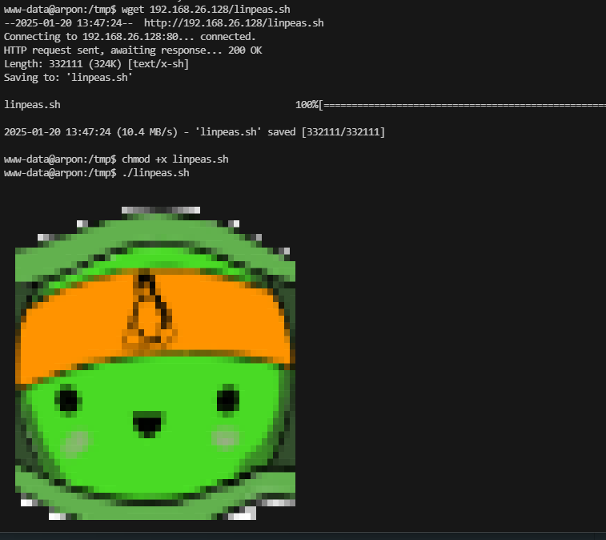  
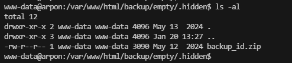  
  
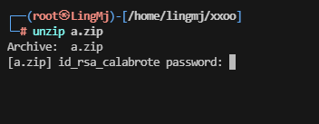  
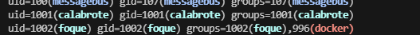  

>差不多了
>

```
└─# zip2john a.zip > tmp
ver 2.0 efh 5455 efh 7875 a.zip/id_rsa_calabrote PKZIP Encr: TS_chk, cmplen=2106, decmplen=3369, crc=30838030 ts=B802 cs=b802 type=8
ver 2.0 efh 5455 efh 7875 a.zip/id_rsa_calabrote.pub PKZIP Encr: TS_chk, cmplen=602, decmplen=735, crc=155F3DD3 ts=B802 cs=b802 type=8
NOTE: It is assumed that all files in each archive have the same password.
If that is not the case, the hash may be uncrackable. To avoid this, use
option -o to pick a file at a time.
                                                                                                                                                                                                                
┌──(root㉿LingMj)-[/home/lingmj/xxoo]
└─# john tmp --wordlist=/usr/share/wordlists/rockyou.txt
Using default input encoding: UTF-8
Loaded 1 password hash (PKZIP [32/64])
Will run 2 OpenMP threads
Press 'q' or Ctrl-C to abort, almost any other key for status
swordfish        (a.zip)     
1g 0:00:00:00 DONE (2025-01-20 07:52) 20.00g/s 81920p/s 81920c/s 68266C/s 123456..oooooo
Use the "--show" option to display all of the cracked passwords reliably
Session completed. 
                                                                                                                                                                                                                
┌──(root㉿LingMj)-[/home/lingmj/xxoo]
└─# unzip a.zip
Archive:  a.zip
[a.zip] id_rsa_calabrote password: 
  inflating: id_rsa_calabrote        
  inflating: id_rsa_calabrote.pub 
```
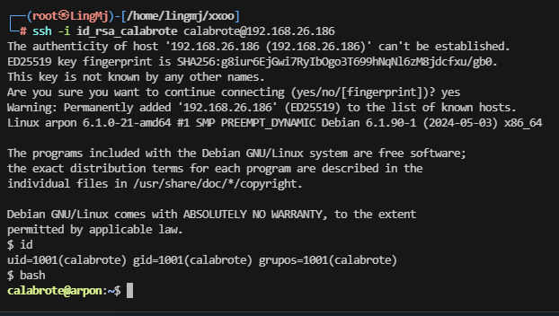  
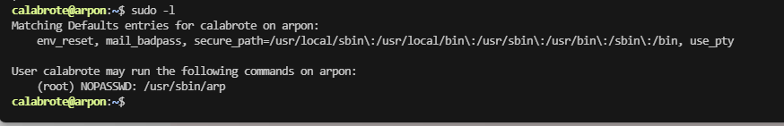  
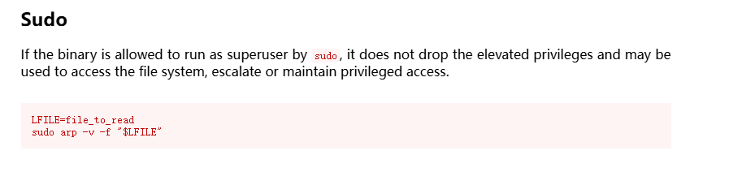  

>竟然没考docker
>
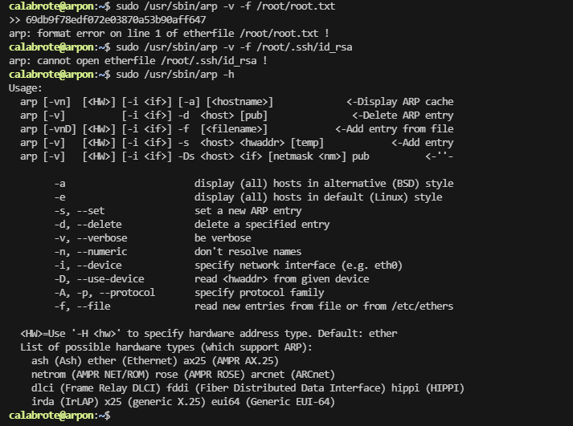  

>按理来说已经完事了，不过我试一下提权
>
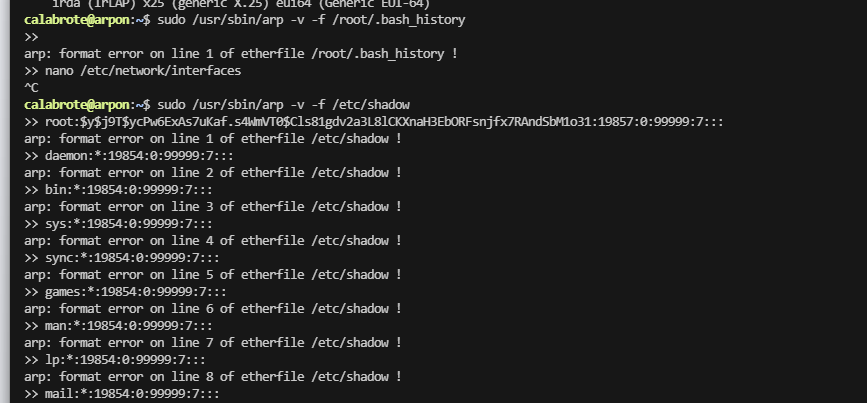  
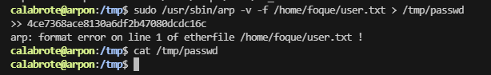  

>保留再议
>


>userflag:4ce7368ace8130a6df2b47080dcdc16c
>
>rootflag:69db9f78edf072e03870a53b90aff647
>


