## 网段扫描
```
└─# arp-scan -l
Interface: eth0, type: EN10MB, MAC: 00:0c:29:df:e2:a7, IPv4: 192.168.26.128
WARNING: Cannot open MAC/Vendor file ieee-oui.txt: Permission denied
WARNING: Cannot open MAC/Vendor file mac-vendor.txt: Permission denied
Starting arp-scan 1.10.0 with 256 hosts (https://github.com/royhills/arp-scan)
192.168.26.1    00:50:56:c0:00:08       (Unknown)
192.168.26.2    00:50:56:e8:d4:e1       (Unknown)
192.168.26.181  00:0c:29:7e:50:28       (Unknown)
192.168.26.254  00:50:56:e8:96:d1       (Unknown)

6 packets received by filter, 0 packets dropped by kernel
Ending arp-scan 1.10.0: 256 hosts scanned in 1.935 seconds (132.30 hosts/sec). 4 responded
```

## 端口扫描

```
└─# nmap -p- -sC -sV 192.168.26.181                
Starting Nmap 7.94SVN ( https://nmap.org ) at 2025-01-19 20:40 EST
Nmap scan report for 192.168.26.181 (192.168.26.181)
Host is up (0.0012s latency).
Not shown: 65534 closed tcp ports (reset)
PORT   STATE SERVICE VERSION
80/tcp open  http    Apache httpd 2.4.57 ((Debian))
|_http-server-header: Apache/2.4.57 (Debian)
|_http-title: Diff3r3ntS3c
MAC Address: 00:0C:29:7E:50:28 (VMware)

Service detection performed. Please report any incorrect results at https://nmap.org/submit/ .
Nmap done: 1 IP address (1 host up) scanned in 61.08 seconds
```

## 获取webshell

  

>存在上传点，毫无疑问这个是个上传的靶机
>

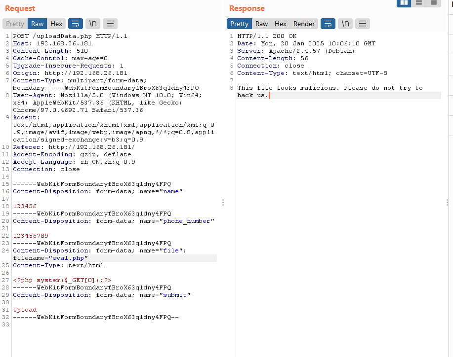  
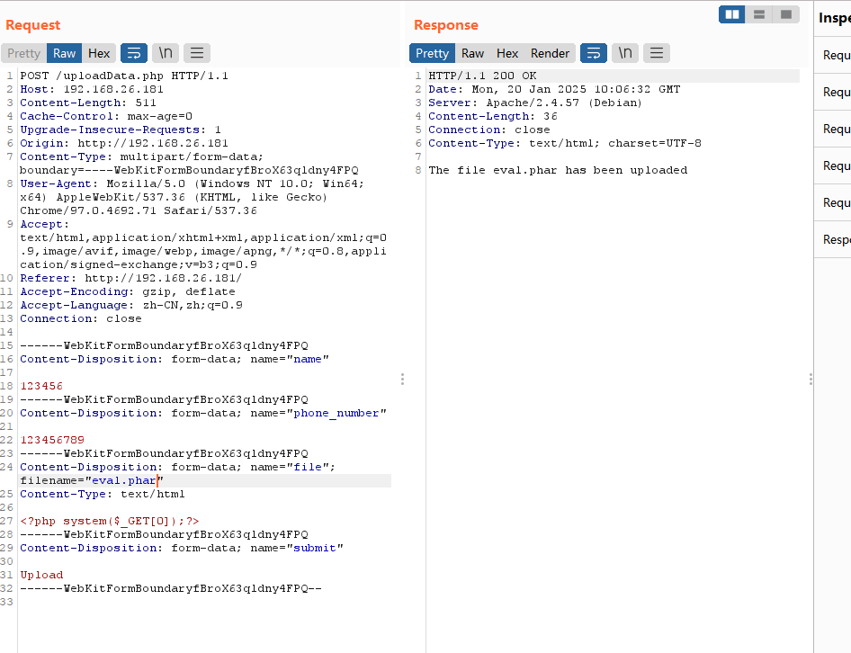  
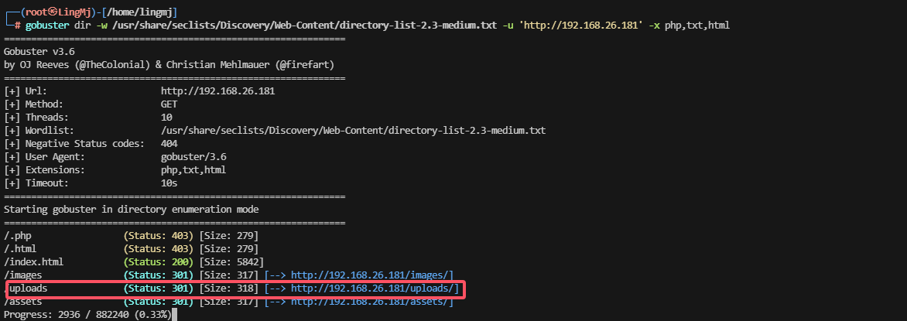  
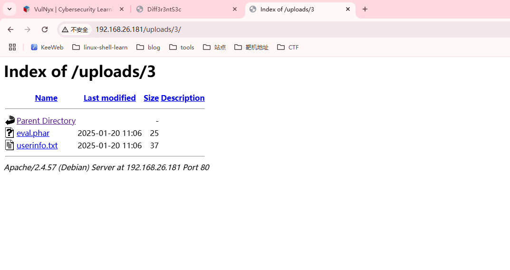  
  
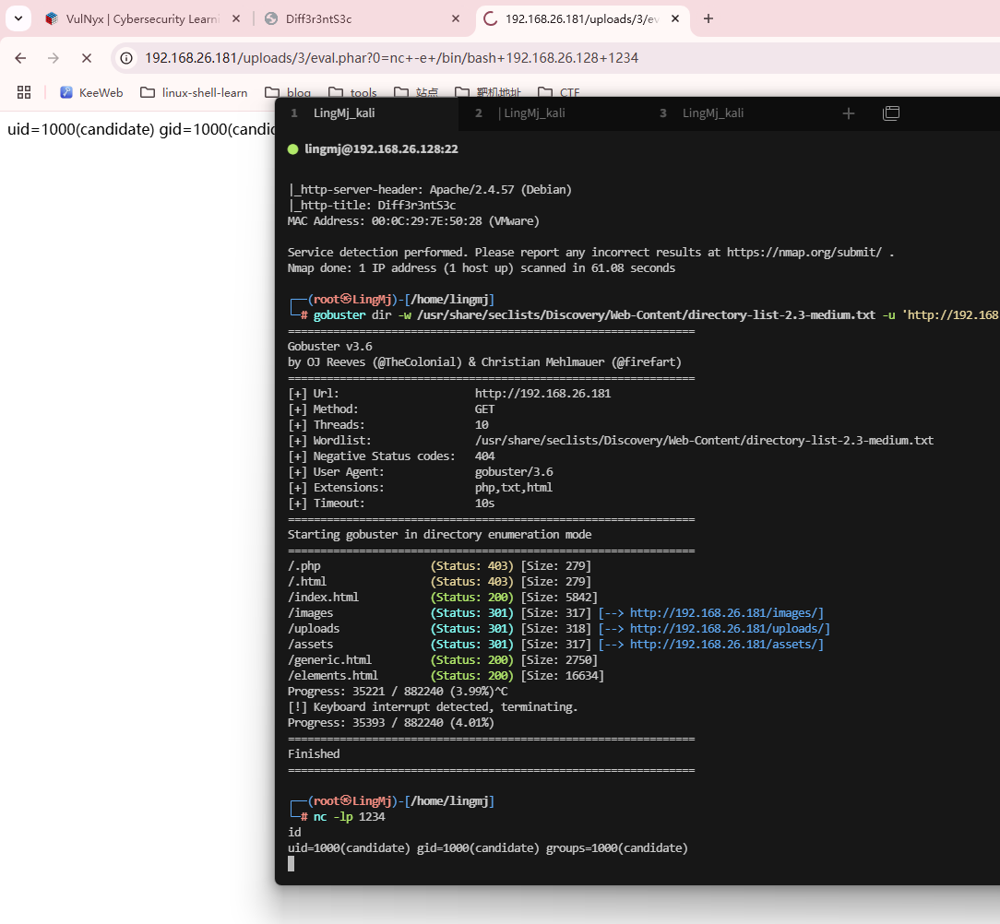  

## 提权
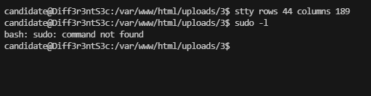  

>不存在sudo -l
>

```
candidate@Diff3r3ntS3c:/var/www$ ls -al
total 12
drwxr-xr-x  3 candidate candidate 4096 Mar 28  2024 .
drwxr-xr-x 12 root      root      4096 Mar 28  2024 ..
drwxr-xr-x  5 candidate candidate 4096 Mar 28  2024 html
candidate@Diff3r3ntS3c:/var/www$ cd /opt/
candidate@Diff3r3ntS3c:/opt$ ls -al
total 8
drwxr-xr-x  2 root root 4096 Nov 15  2023 .
drwxr-xr-x 18 root root 4096 Mar 28  2024 ..
candidate@Diff3r3ntS3c:/opt$ cd /var/www/
candidate@Diff3r3ntS3c:/var/www$ ls -al
total 12
drwxr-xr-x  3 candidate candidate 4096 Mar 28  2024 .
drwxr-xr-x 12 root      root      4096 Mar 28  2024 ..
drwxr-xr-x  5 candidate candidate 4096 Mar 28  2024 html
candidate@Diff3r3ntS3c:/var/www$ cd /var/backups/
candidate@Diff3r3ntS3c:/var/backups$ ls -al
total 16
drwxr-xr-x  2 root root 4096 Mar 28  2024 .
drwxr-xr-x 12 root root 4096 Mar 28  2024 ..
-rw-r--r--  1 root root 6765 Mar 28  2024 apt.extended_states.0
candidate@Diff3r3ntS3c:/var/backups$ cd 
bash: cd: HOME not set
candidate@Diff3r3ntS3c:/var/backups$ cd /home/
candidate@Diff3r3ntS3c:/home$ ls
candidate
candidate@Diff3r3ntS3c:/home$ cd candidate/
candidate@Diff3r3ntS3c:/home/candidate$ ls -al
total 36
drwx------ 5 candidate candidate 4096 Mar 28  2024 .
drwxr-xr-x 3 root      root      4096 Mar 28  2024 ..
drwxr-xr-x 2 candidate candidate 4096 Mar 28  2024 .backups
lrwxrwxrwx 1 root      root         9 Nov 15  2023 .bash_history -> /dev/null
-rw-r--r-- 1 candidate candidate  220 Nov 15  2023 .bash_logout
-rw-r--r-- 1 candidate candidate 3526 Nov 15  2023 .bashrc
drwxr-xr-x 3 candidate candidate 4096 Mar 28  2024 .local
-rw-r--r-- 1 candidate candidate  807 Nov 15  2023 .profile
drwxr-xr-x 2 candidate candidate 4096 Mar 28  2024 .scripts
-r-------- 1 candidate candidate   33 Mar 28  2024 user.txt
candidate@Diff3r3ntS3c:/home/candidate$ 
```
>看看这个backup
>

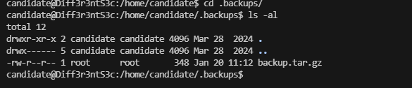  
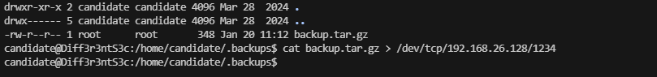  
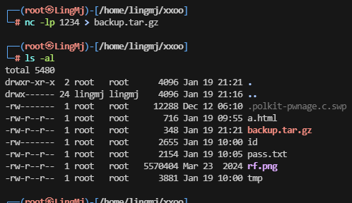  
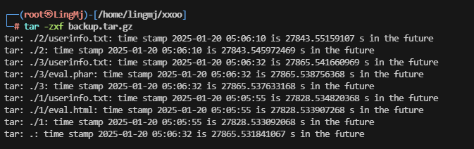  
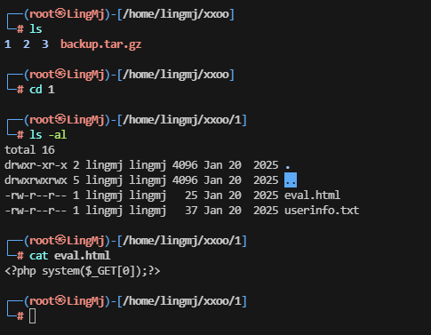  

>这个单纯是上传的打包地址
>
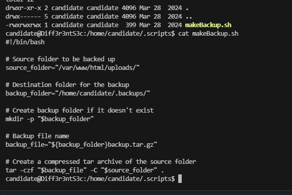  

>用工具跑一下没啥想法
>
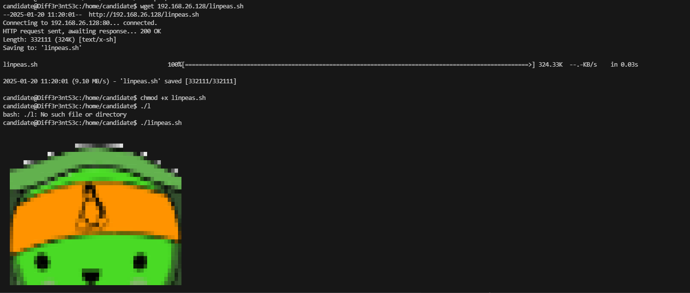  

>等一下好像存在定时任务。这个打包的
>

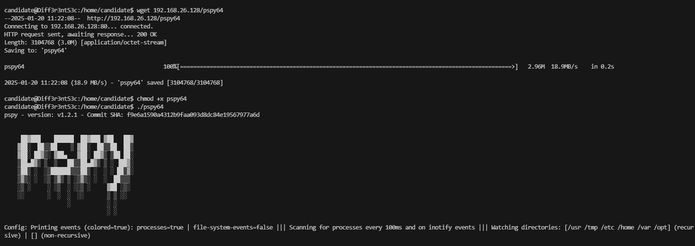  

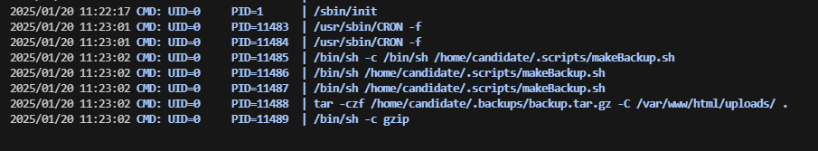  

>好了王炸方案即可
>

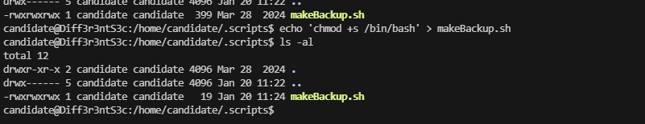  

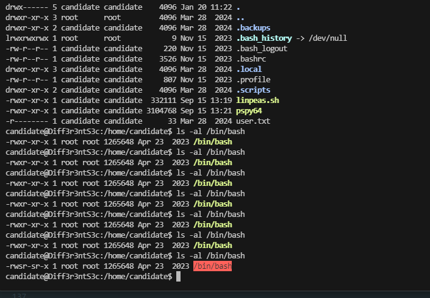  

  

>好了到这里就结束了
>

>userflag:9b71bc22041491a690f7c7b5fe0f4e8d
>
>rootflag:24886c4b2777d4359cd3dbd118741dda
>


