## 网段扫描
```
└─# arp-scan -l
Interface: eth0, type: EN10MB, MAC: 00:0c:29:df:e2:a7, IPv4: 192.168.26.128
WARNING: Cannot open MAC/Vendor file ieee-oui.txt: Permission denied
WARNING: Cannot open MAC/Vendor file mac-vendor.txt: Permission denied
Starting arp-scan 1.10.0 with 256 hosts (https://github.com/royhills/arp-scan)
192.168.26.1    00:50:56:c0:00:08       (Unknown)
192.168.26.2    00:50:56:e8:d4:e1       (Unknown)
192.168.26.182  00:0c:29:91:ed:f1       (Unknown)
192.168.26.254  00:50:56:e8:96:d1       (Unknown)

4 packets received by filter, 0 packets dropped by kernel
Ending arp-scan 1.10.0: 256 hosts scanned in 1.897 seconds (134.95 hosts/sec). 4 responded
```

## 端口扫描

```
└─# nmap -p- -sC -sV 192.168.26.182                
Starting Nmap 7.94SVN ( https://nmap.org ) at 2025-01-19 21:36 EST
Nmap scan report for 192.168.26.182 (192.168.26.182)
Host is up (0.0013s latency).
Not shown: 65530 closed tcp ports (reset)
PORT     STATE SERVICE     VERSION
22/tcp   open  ssh         OpenSSH 9.2p1 Debian 2+deb12u2 (protocol 2.0)
| ssh-hostkey: 
|   256 a9:a8:52:f3:cd:ec:0d:5b:5f:f3:af:5b:3c:db:76:b6 (ECDSA)
|_  256 73:f5:8e:44:0c:b9:0a:e0:e7:31:0c:04:ac:7e:ff:fd (ED25519)
80/tcp   open  http        nginx 1.22.1
|_http-title: Sun
|_http-server-header: nginx/1.22.1
139/tcp  open  netbios-ssn Samba smbd 4.6.2
445/tcp  open  netbios-ssn Samba smbd 4.6.2
8080/tcp open  http        nginx 1.22.1
|_http-title: Sun
|_http-server-header: nginx/1.22.1
|_http-open-proxy: Proxy might be redirecting requests
MAC Address: 00:0C:29:91:ED:F1 (VMware)
Service Info: OS: Linux; CPE: cpe:/o:linux:linux_kernel

Host script results:
| smb2-time: 
|   date: 2025-01-20T10:38:20
|_  start_date: N/A
|_clock-skew: 7h59m59s
| smb2-security-mode: 
|   3:1:1: 
|_    Message signing enabled but not required
|_nbstat: NetBIOS name: SUN, NetBIOS user: <unknown>, NetBIOS MAC: <unknown> (unknown)

Service detection performed. Please report any incorrect results at https://nmap.org/submit/ .
Nmap done: 1 IP address (1 host up) scanned in 85.43 seconds
                                                             
```


## 获取webshell
  

```
└─# enum4linux -a 192.168.26.182                                                                              
Starting enum4linux v0.9.1 ( http://labs.portcullis.co.uk/application/enum4linux/ ) on Sun Jan 19 21:39:50 2025

 =========================================( Target Information )=========================================

Target ........... 192.168.26.182
RID Range ........ 500-550,1000-1050
Username ......... ''
Password ......... ''
Known Usernames .. administrator, guest, krbtgt, domain admins, root, bin, none


 ===========================( Enumerating Workgroup/Domain on 192.168.26.182 )===========================


[+] Got domain/workgroup name: WORKGROUP


 ===============================( Nbtstat Information for 192.168.26.182 )===============================

Looking up status of 192.168.26.182
        SUN             <00> -         B <ACTIVE>  Workstation Service
        SUN             <03> -         B <ACTIVE>  Messenger Service
        SUN             <20> -         B <ACTIVE>  File Server Service
        ..__MSBROWSE__. <01> - <GROUP> B <ACTIVE>  Master Browser
        WORKGROUP       <00> - <GROUP> B <ACTIVE>  Domain/Workgroup Name
        WORKGROUP       <1d> -         B <ACTIVE>  Master Browser
        WORKGROUP       <1e> - <GROUP> B <ACTIVE>  Browser Service Elections

        MAC Address = 00-00-00-00-00-00

 ==================================( Session Check on 192.168.26.182 )==================================


[+] Server 192.168.26.182 allows sessions using username '', password ''


 ===============================( Getting domain SID for 192.168.26.182 )===============================

Domain Name: WORKGROUP
Domain Sid: (NULL SID)

[+] Can't determine if host is part of domain or part of a workgroup


 ==================================( OS information on 192.168.26.182 )==================================


[E] Can't get OS info with smbclient


[+] Got OS info for 192.168.26.182 from srvinfo: 
        SUN            Wk Sv PrQ Unx NT SNT Samba 4.17.12-Debian
        platform_id     :       500
        os version      :       6.1
        server type     :       0x809a03


 ======================================( Users on 192.168.26.182 )======================================

index: 0x1 RID: 0x3e8 acb: 0x00000010 Account: punt4n0  Name: punt4n0   Desc: 

user:[punt4n0] rid:[0x3e8]

 ================================( Share Enumeration on 192.168.26.182 )================================

smbXcli_negprot_smb1_done: No compatible protocol selected by server.

        Sharename       Type      Comment
        ---------       ----      -------
        print$          Disk      Printer Drivers
        IPC$            IPC       IPC Service (Samba 4.17.12-Debian)
        nobody          Disk      File Upload Path
Reconnecting with SMB1 for workgroup listing.
Protocol negotiation to server 192.168.26.182 (for a protocol between LANMAN1 and NT1) failed: NT_STATUS_INVALID_NETWORK_RESPONSE
Unable to connect with SMB1 -- no workgroup available

[+] Attempting to map shares on 192.168.26.182

//192.168.26.182/print$ Mapping: DENIED Listing: N/A Writing: N/A

[E] Can't understand response:

NT_STATUS_CONNECTION_REFUSED listing \*
//192.168.26.182/IPC$   Mapping: N/A Listing: N/A Writing: N/A
//192.168.26.182/nobody Mapping: DENIED Listing: N/A Writing: N/A

 ===========================( Password Policy Information for 192.168.26.182 )===========================


[+] Attaching to 192.168.26.182 using a NULL share

[+] Trying protocol 139/SMB...

[+] Found domain(s):

        [+] SUN
        [+] Builtin

[+] Password Info for Domain: SUN

        [+] Minimum password length: 5
        [+] Password history length: None
        [+] Maximum password age: 37 days 6 hours 21 minutes 
        [+] Password Complexity Flags: 000000

                [+] Domain Refuse Password Change: 0
                [+] Domain Password Store Cleartext: 0
                [+] Domain Password Lockout Admins: 0
                [+] Domain Password No Clear Change: 0
                [+] Domain Password No Anon Change: 0
                [+] Domain Password Complex: 0

        [+] Minimum password age: None
        [+] Reset Account Lockout Counter: 30 minutes 
        [+] Locked Account Duration: 30 minutes 
        [+] Account Lockout Threshold: None
        [+] Forced Log off Time: 37 days 6 hours 21 minutes 


[+] Retieved partial password policy with rpcclient:


Password Complexity: Disabled
Minimum Password Length: 5


 ======================================( Groups on 192.168.26.182 )======================================


[+] Getting builtin groups:


[+]  Getting builtin group memberships:


[+]  Getting local groups:


[+]  Getting local group memberships:


[+]  Getting domain groups:


[+]  Getting domain group memberships:


 =================( Users on 192.168.26.182 via RID cycling (RIDS: 500-550,1000-1050) )=================


[I] Found new SID: 
S-1-22-1

[I] Found new SID: 
S-1-5-32

[I] Found new SID: 
S-1-5-32

[I] Found new SID: 
S-1-5-32

[I] Found new SID: 
S-1-5-32

[+] Enumerating users using SID S-1-5-32 and logon username '', password ''

S-1-5-32-544 BUILTIN\Administrators (Local Group)
S-1-5-32-545 BUILTIN\Users (Local Group)
S-1-5-32-546 BUILTIN\Guests (Local Group)
S-1-5-32-547 BUILTIN\Power Users (Local Group)
S-1-5-32-548 BUILTIN\Account Operators (Local Group)
S-1-5-32-549 BUILTIN\Server Operators (Local Group)
S-1-5-32-550 BUILTIN\Print Operators (Local Group)

[+] Enumerating users using SID S-1-5-21-3376172362-2708036654-1072164461 and logon username '', password ''

S-1-5-21-3376172362-2708036654-1072164461-501 SUN\nobody (Local User)
S-1-5-21-3376172362-2708036654-1072164461-513 SUN\None (Domain Group)
S-1-5-21-3376172362-2708036654-1072164461-1000 SUN\punt4n0 (Local User)

[+] Enumerating users using SID S-1-22-1 and logon username '', password ''

S-1-22-1-1000 Unix User\punt4n0 (Local User)

 ==============================( Getting printer info for 192.168.26.182 )==============================

No printers returned.


enum4linux complete on Sun Jan 19 21:42:07 2025
```
>有线索一个是用户名punt4n0，还有一个nobody          Disk      File Upload Path
>

>直接操作一手
>
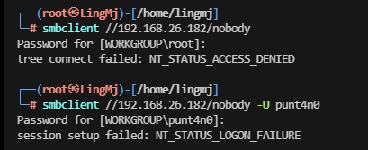  

>跑一下密码了
>

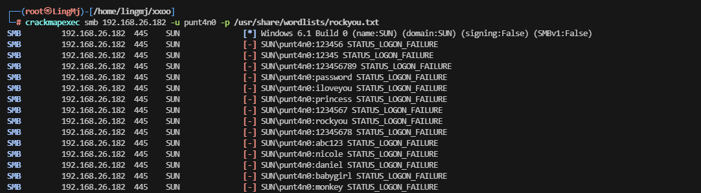  

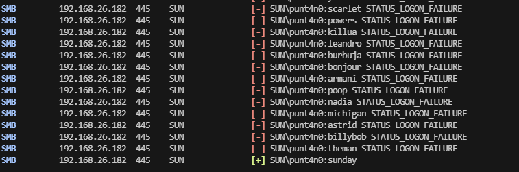  

>拿到了测试一下上传
>

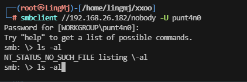  

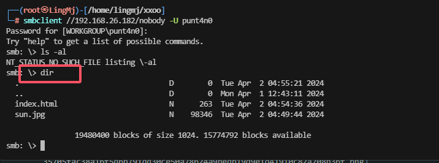  

>这是一个windows的smb控制
>
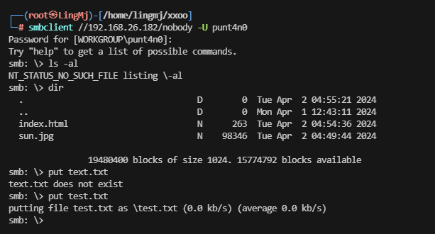  

>测试上传路径
>
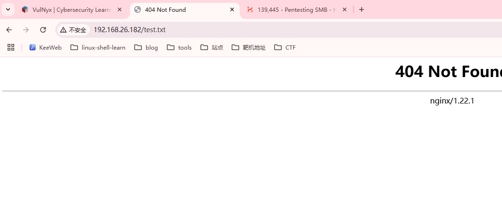  
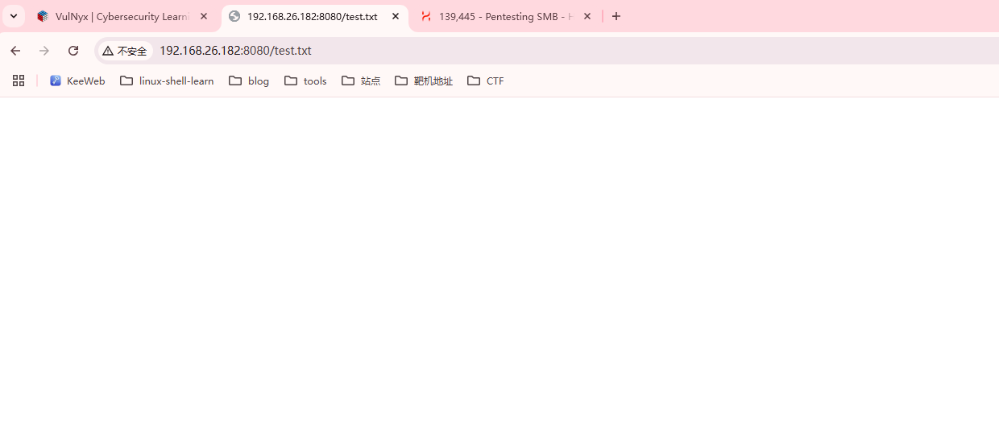  

>证明在8080端口，因为是windows所以不能直接用php，Windows的话用的是aspx，kali自带
>
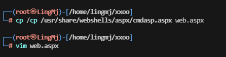  

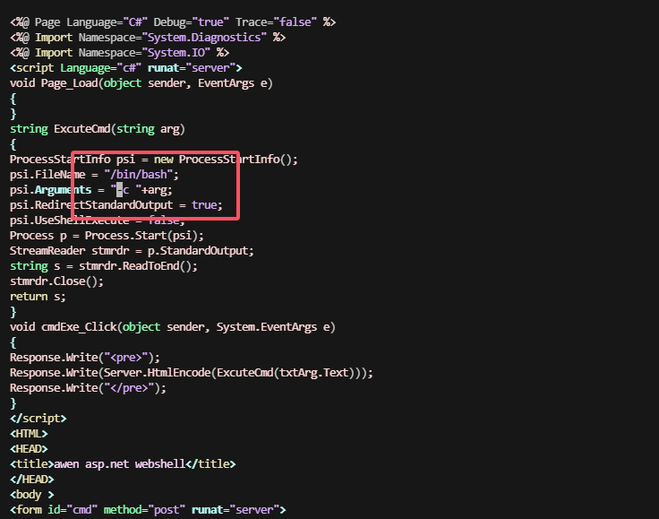  
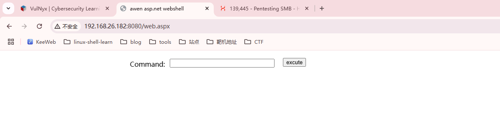  

>这些是前面控制的基本操作
>

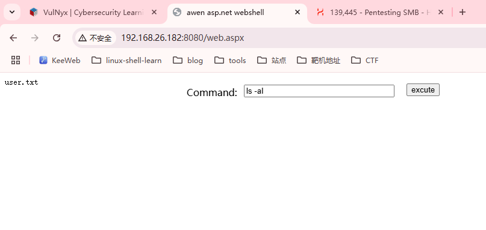  
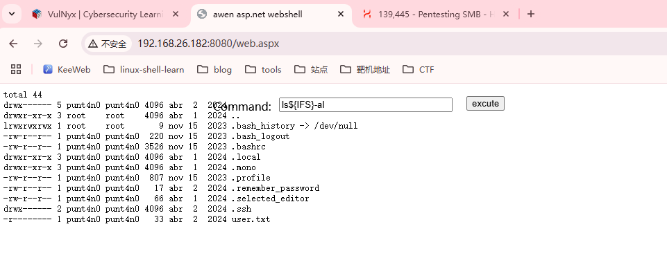  

>不能直接用空格
>
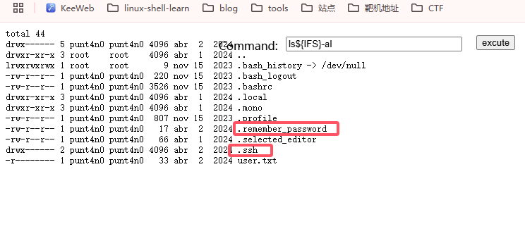  

>有关键的passwd和id_rsa
>
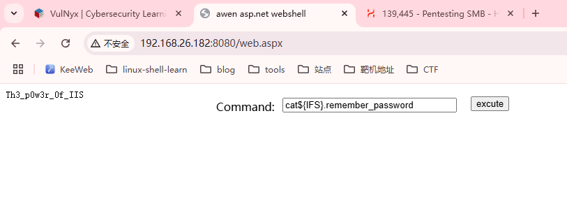  
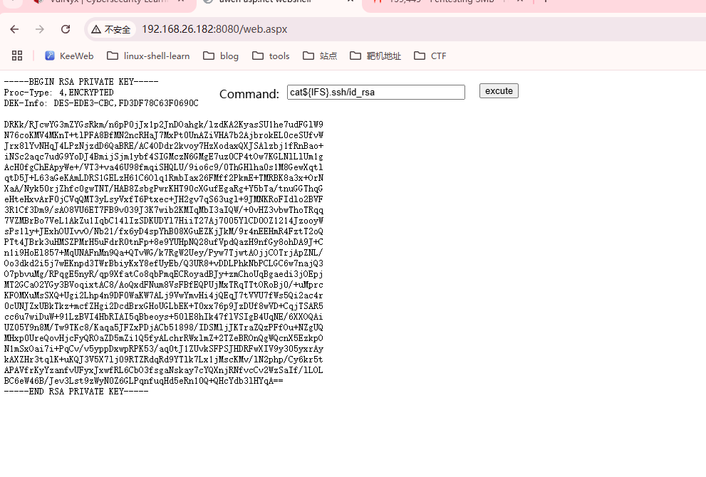  
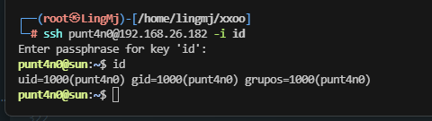  

## 提权
```
punt4n0@sun:~$ sudo -l
-bash: sudo: orden no encontrada
```
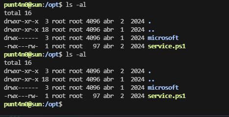  
```
punt4n0@sun:/opt$ ls -al
total 16
drwxr-xr-x  3 root root 4096 abr  2  2024 .
drwxr-xr-x 18 root root 4096 abr  1  2024 ..
drwx------  3 root root 4096 abr  1  2024 microsoft
-rwx---rw-  1 root root   97 abr  2  2024 service.ps1
punt4n0@sun:/opt$ cat service.ps1 
$idOutput = id

$outputFilePath = "/dev/shm/out"

$idOutput | Out-File -FilePath $outputFilePath
punt4n0@sun:/opt$ cd /var/www/html/
punt4n0@sun:/var/www/html$ ls -al
total 112
drwxr-xr-x 2 punt4n0 punt4n0  4096 abr  2  2024 .
drwxr-xr-x 4 punt4n0 punt4n0  4096 abr  1  2024 ..
-rw-r--r-- 1 punt4n0 punt4n0   263 abr  2  2024 index.html
-rw-r--r-- 1 punt4n0 punt4n0 98346 abr  2  2024 sun.jpg
punt4n0@sun:/var/www/html$ cd /var/backups/
punt4n0@sun:/var/backups$ ls -al
total 588
drwxr-xr-x  2 root root   4096 ene 20 11:37 .
drwxr-xr-x 12 root root   4096 abr  1  2024 ..
-rw-r--r--  1 root root  30720 abr  2  2024 alternatives.tar.0
-rw-r--r--  1 root root  27662 abr  2  2024 apt.extended_states.0
-rw-r--r--  1 root root   2395 abr  1  2024 apt.extended_states.1.gz
-rw-r--r--  1 root root   2345 abr  1  2024 apt.extended_states.2.gz
-rw-r--r--  1 root root   2320 abr  1  2024 apt.extended_states.3.gz
-rw-r--r--  1 root root      0 abr  2  2024 dpkg.arch.0
-rw-r--r--  1 root root    186 nov 15  2023 dpkg.diversions.0
-rw-r--r--  1 root root    100 nov 15  2023 dpkg.statoverride.0
-rw-r--r--  1 root root 510706 abr  1  2024 dpkg.status.0
```
>可以看看有无定时任务还是直接利用这个
>

  

>好像明白了
>

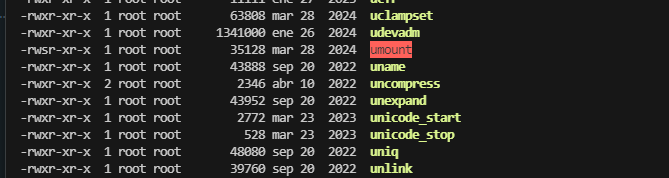  
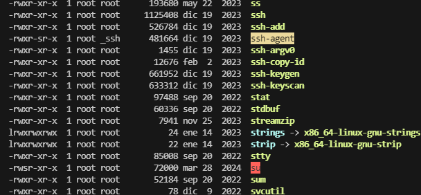  
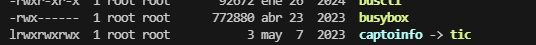  

  

>不能传文件，算了手动看定时任务
>
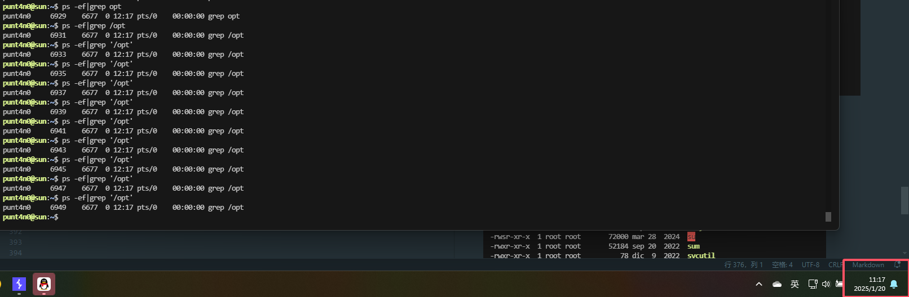  

  

>这样可以看到定时任务
>

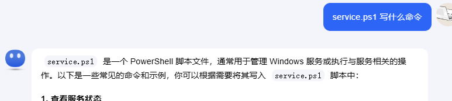  

>算了随便试
>
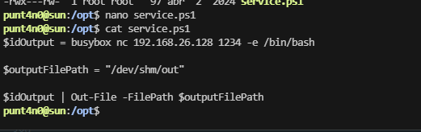  
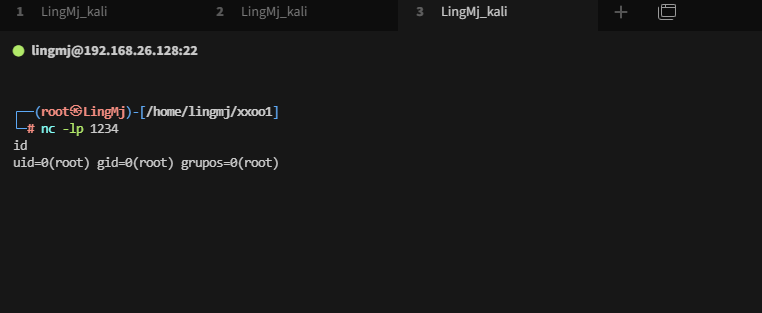  

>为啥写busybox，因为这个主机有，不过得root所以才这样写，不行就换一个没事影响,ok结束
>

>userflag:3b16b996837f6e87ffb20ab19edb88b7
>
>rootflag:e1e7f5e01538acad8c272a5da450f9f6
>


