## 网段扫描
```
└─# arp-scan -l
Interface: eth0, type: EN10MB, MAC: 00:0c:29:df:e2:a7, IPv4: 192.168.26.128
Starting arp-scan 1.10.0 with 256 hosts (https://github.com/royhills/arp-scan)
192.168.26.1    00:50:56:c0:00:08       VMware, Inc.
192.168.26.2    00:50:56:e8:d4:e1       VMware, Inc.
192.168.26.191  00:0c:29:be:d4:37       VMware, Inc.
192.168.26.254  00:50:56:e5:dc:17       VMware, Inc.

5 packets received by filter, 0 packets dropped by kernel
Ending arp-scan 1.10.0: 256 hosts scanned in 2.558 seconds (100.08 hosts/sec). 4 responded
```

## 端口扫描

```
└─# nmap -p- -sC -sV 192.168.26.191
Starting Nmap 7.94SVN ( https://nmap.org ) at 2025-01-21 06:06 EST
Nmap scan report for 192.168.26.191 (192.168.26.191)
Host is up (0.0013s latency).
Not shown: 65532 closed tcp ports (reset)
PORT    STATE SERVICE VERSION
22/tcp  open  ssh     OpenSSH 8.4p1 Debian 5+deb11u3 (protocol 2.0)
| ssh-hostkey: 
|   3072 f0:e6:24:fb:9e:b0:7a:1a:bd:f7:b1:85:23:7f:b1:6f (RSA)
|   256 99:c8:74:31:45:10:58:b0:ce:cc:63:b4:7a:82:57:3d (ECDSA)
|_  256 60:da:3e:31:38:fa:b5:49:ab:48:c3:43:2c:9f:d1:32 (ED25519)
80/tcp  open  http    Apache httpd 2.4.59 ((Debian))
|_http-title: Site doesn't have a title (text/html).
|_http-server-header: Apache/2.4.59 (Debian)
873/tcp open  rsync   (protocol version 31)
MAC Address: 00:0C:29:BE:D4:37 (VMware)
Service Info: OS: Linux; CPE: cpe:/o:linux:linux_kernel

Service detection performed. Please report any incorrect results at https://nmap.org/submit/ .
Nmap done: 1 IP address (1 host up) scanned in 55.60 seconds
```

## 获取webshell
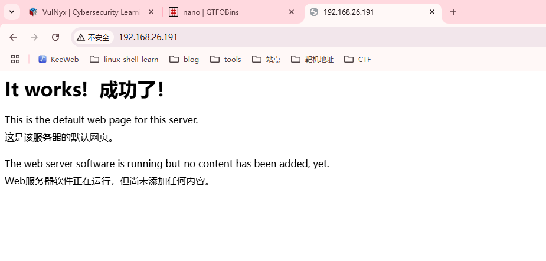  
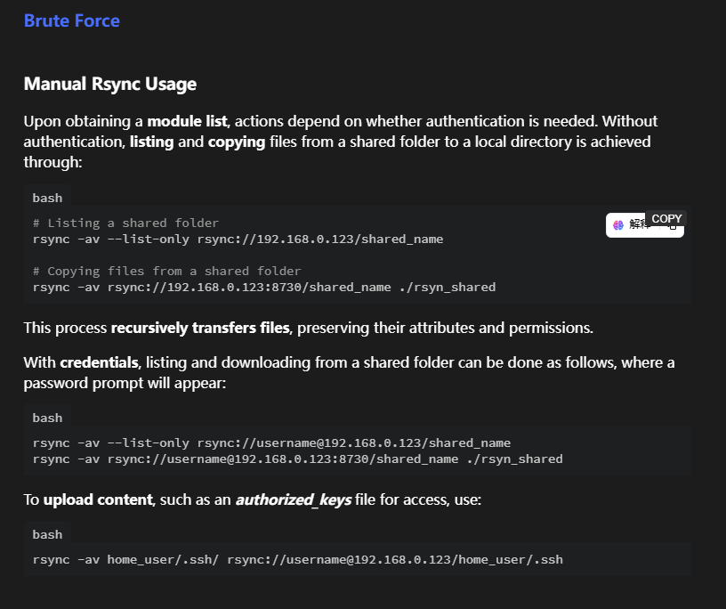  
  
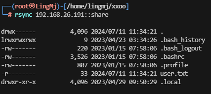  
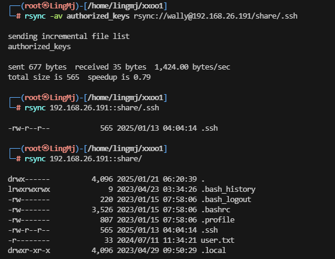  
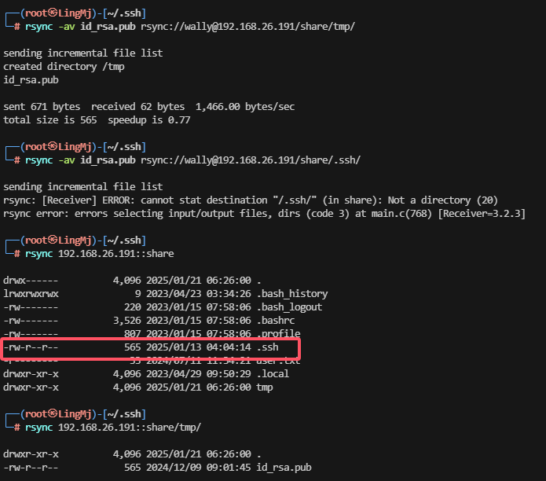  

>环境搞坏了，重新安装
>
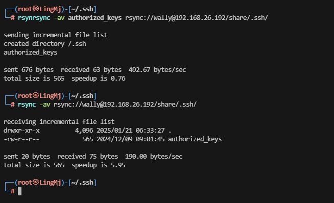  
>重新来过用一下上面不同方法查看，单纯闲的哈哈哈
>

## 提权
```
└─# ssh wally@192.168.26.192                        
The authenticity of host '192.168.26.192 (192.168.26.192)' can't be established.
ED25519 key fingerprint is SHA256:3dqq7f/jDEeGxYQnF2zHbpzEtjjY49/5PvV5/4MMqns.
This host key is known by the following other names/addresses:
    ~/.ssh/known_hosts:21: [hashed name]
    ~/.ssh/known_hosts:28: [hashed name]
    ~/.ssh/known_hosts:29: [hashed name]
    ~/.ssh/known_hosts:30: [hashed name]
    ~/.ssh/known_hosts:34: [hashed name]
    ~/.ssh/known_hosts:35: [hashed name]
    ~/.ssh/known_hosts:36: [hashed name]
    ~/.ssh/known_hosts:37: [hashed name]
    (6 additional names omitted)
Are you sure you want to continue connecting (yes/no/[fingerprint])? yes
Warning: Permanently added '192.168.26.192' (ED25519) to the list of known hosts.
wally@send:~$ id
uid=1000(wally) gid=1000(wally) grupos=1000(wally)
wally@send:~$ sudo -l

We trust you have received the usual lecture from the local System
Administrator. It usually boils down to these three things:

    #1) Respect the privacy of others.
    #2) Think before you type.
    #3) With great power comes great responsibility.

[sudo] password for wally: 
sudo: a password is required
wally@send:~$ 
```
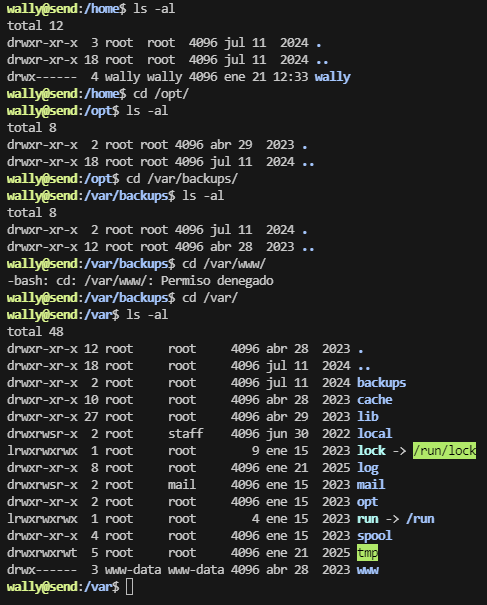  
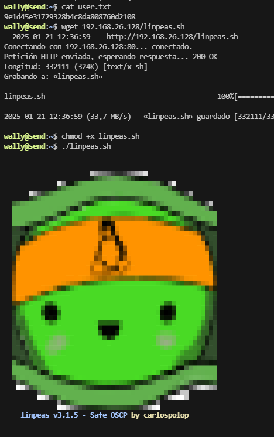  
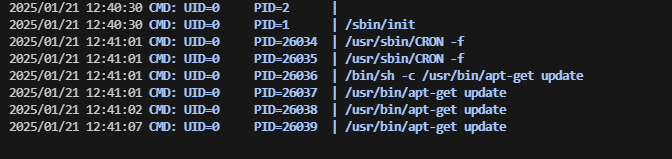  

>存在定时任务，是apt的直接找apt可读写文件
>
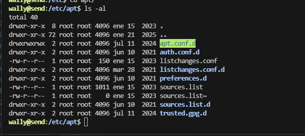  
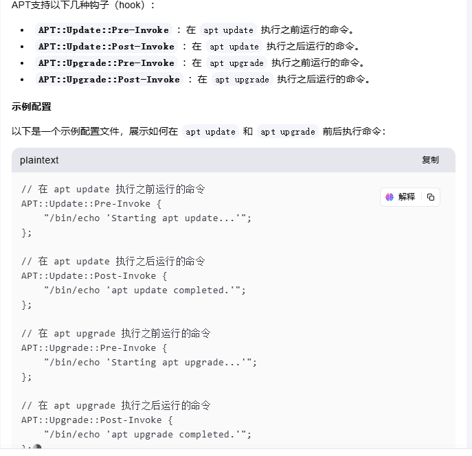  

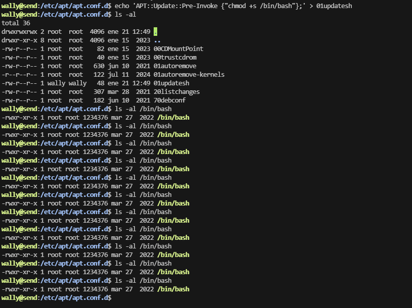
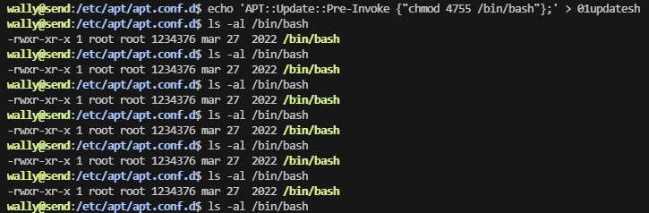  
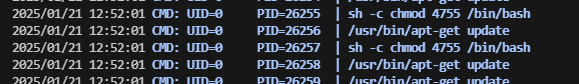  
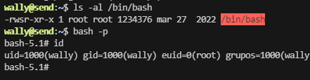  


>userflag:9e1d45e31729328b4c8da808760d2108
>
>rootflag:78fc0f33441d0fc383b3327233343d41
>