## 网段扫描
```
└─# arp-scan -l
Interface: eth0, type: EN10MB, MAC: 00:0c:29:df:e2:a7, IPv4: 192.168.26.128
WARNING: Cannot open MAC/Vendor file ieee-oui.txt: Permission denied
WARNING: Cannot open MAC/Vendor file mac-vendor.txt: Permission denied
Starting arp-scan 1.10.0 with 256 hosts (https://github.com/royhills/arp-scan)
192.168.26.1    00:50:56:c0:00:08       (Unknown)
192.168.26.2    00:50:56:e8:d4:e1       (Unknown)
192.168.26.187  00:0c:29:59:39:c0       (Unknown)
192.168.26.254  00:50:56:e5:dc:17       (Unknown)

5 packets received by filter, 0 packets dropped by kernel
Ending arp-scan 1.10.0: 256 hosts scanned in 1.957 seconds (130.81 hosts/sec). 4 responded
```

## 端口扫描

```
└─# nmap -p- -sC -sV 192.168.26.187       
Starting Nmap 7.94SVN ( https://nmap.org ) at 2025-01-20 21:58 EST
Nmap scan report for 192.168.26.187 (192.168.26.187)
Host is up (0.0012s latency).
Not shown: 65533 closed tcp ports (reset)
PORT   STATE SERVICE VERSION
22/tcp open  ssh     OpenSSH 9.2p1 Debian 2+deb12u2 (protocol 2.0)
| ssh-hostkey: 
|   256 bc:cd:ce:6e:98:09:e5:60:d2:f3:96:74:eb:3f:cc:e3 (ECDSA)
|_  256 b0:38:0c:1c:76:d0:de:64:0a:c4:07:89:4b:71:69:86 (ED25519)
80/tcp open  http    Apache httpd 2.4.59 ((Debian))
|_http-title: Apache2 Debian Default Page: It works
|_http-server-header: Apache/2.4.59 (Debian)
MAC Address: 00:0C:29:59:39:C0 (VMware)
Service Info: OS: Linux; CPE: cpe:/o:linux:linux_kernel

Service detection performed. Please report any incorrect results at https://nmap.org/submit/ .
Nmap done: 1 IP address (1 host up) scanned in 78.29 seconds
```
```
└─# nmap -sU --top-ports 20 192.168.26.187
Starting Nmap 7.94SVN ( https://nmap.org ) at 2025-01-20 21:59 EST
Nmap scan report for 192.168.26.187 (192.168.26.187)
Host is up (0.0022s latency).

PORT      STATE         SERVICE
53/udp    open|filtered domain
67/udp    closed        dhcps
68/udp    open|filtered dhcpc
69/udp    closed        tftp
123/udp   closed        ntp
135/udp   closed        msrpc
137/udp   open|filtered netbios-ns
138/udp   open|filtered netbios-dgm
139/udp   closed        netbios-ssn
161/udp   closed        snmp
162/udp   open|filtered snmptrap
445/udp   closed        microsoft-ds
500/udp   closed        isakmp
514/udp   open|filtered syslog
520/udp   open|filtered route
631/udp   open|filtered ipp
1434/udp  closed        ms-sql-m
1900/udp  closed        upnp
4500/udp  closed        nat-t-ike
49152/udp open|filtered unknown
MAC Address: 00:0C:29:59:39:C0 (VMware)

Nmap done: 1 IP address (1 host up) scanned in 9.85 seconds
```

## 获取webshell
>扫描一下目录看看
>
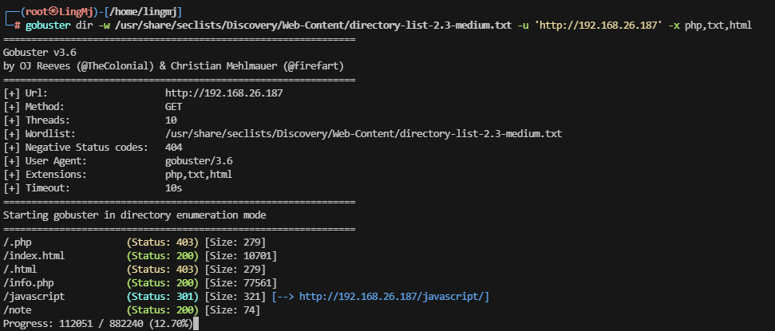  
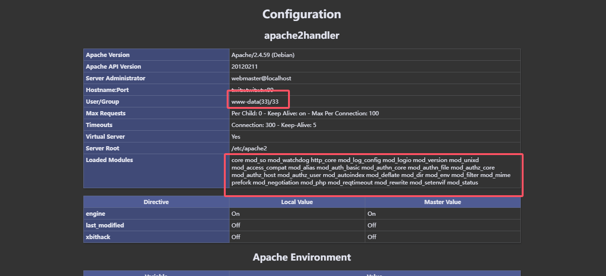  
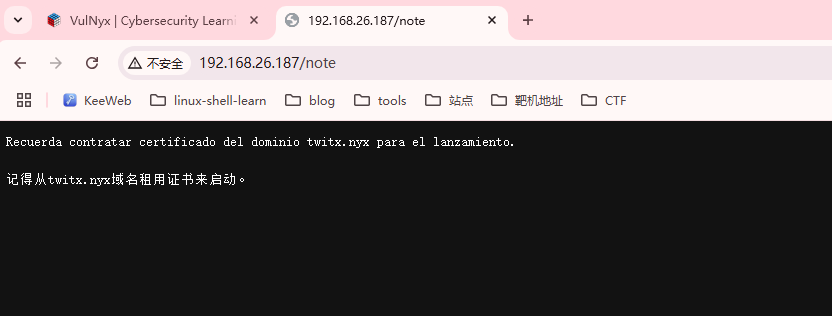  
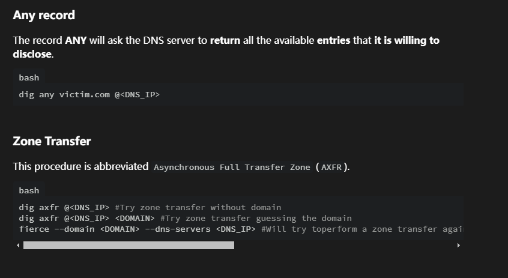  
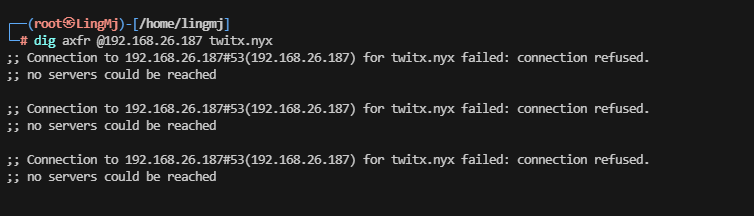  
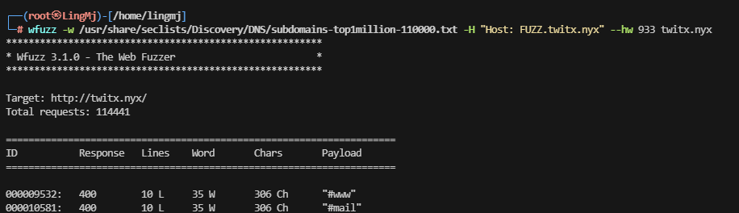  
>目前没有子域名
>
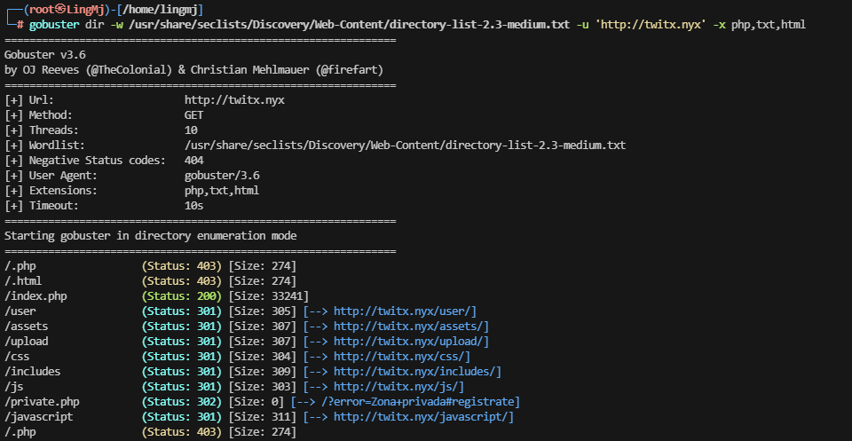  
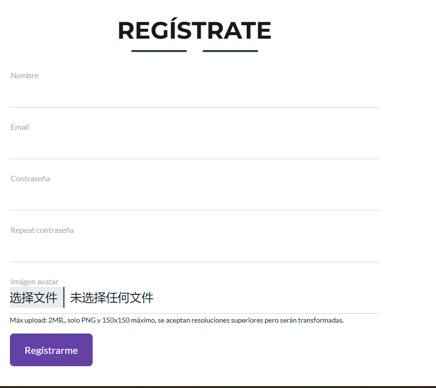  
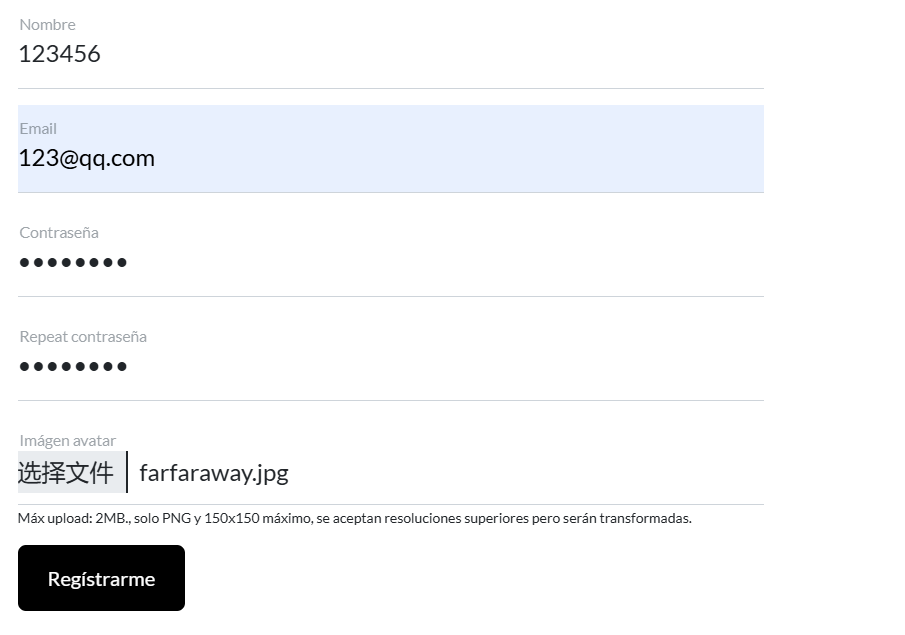  
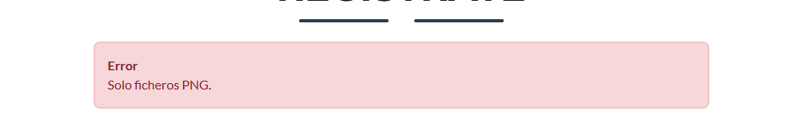  
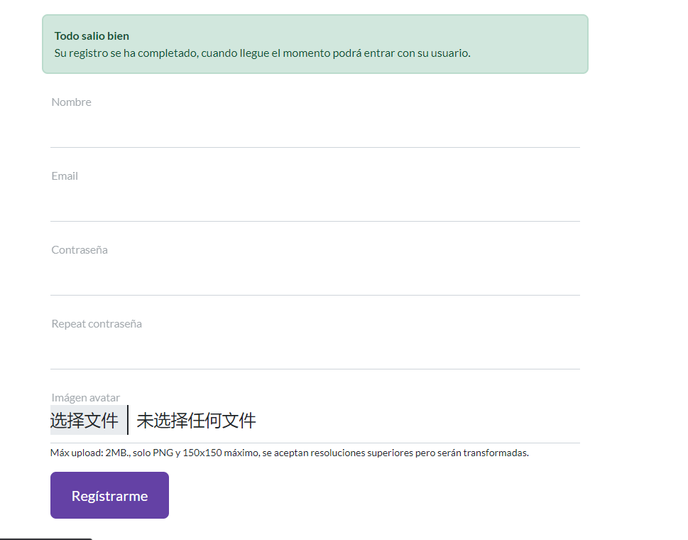  
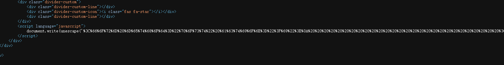  

```
 document.write(unescape('<form method="post" action="?i">
                            <div class="mb-4 row">
                                <div class="form-floating mb-3">
                                    <input class="form-control" id="email" type="email" name="email"
                                        required="required" />
                                    <label for="email">Email </label>
                                </div>
                                <!-- Password number input-->
                                <div class="form-floating mb-3">
                                    <input class="form-control" id="password" type="password" name="password"
                                        required="required" />
                                    <label for="password">Contraseña</label>
                                </div>


                            </div>
                            <button class="btn btn-secondary me-5">
                                <i class="fa-solid fa-right-to-bracket me-2"></i>Log-in
                            </button>
                            <button class="btn btn-primary" type="button" data-bs-dismiss="modal">
                                <i class="fas fa-xmark fa-fw"></i>
                                Cerrar
                            </button>
                            </form>'));
```
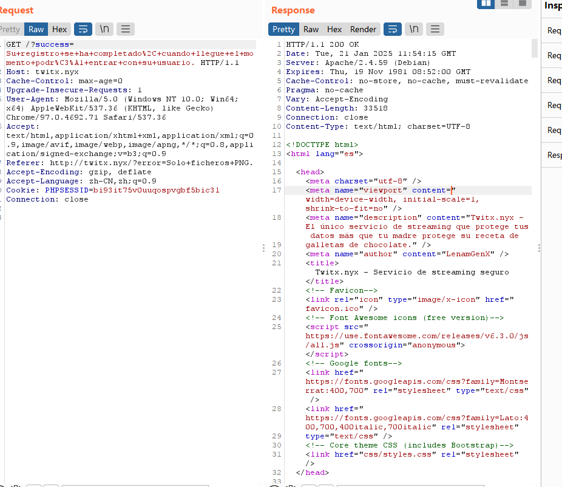  
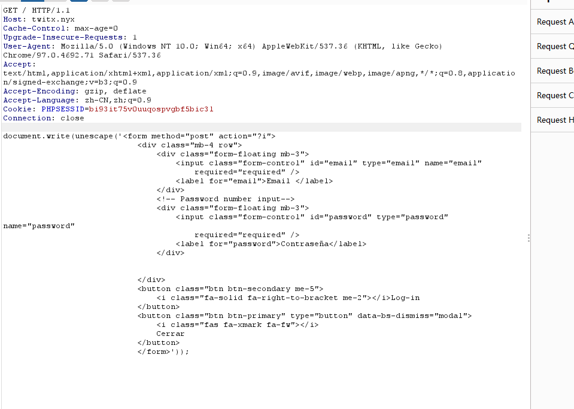  
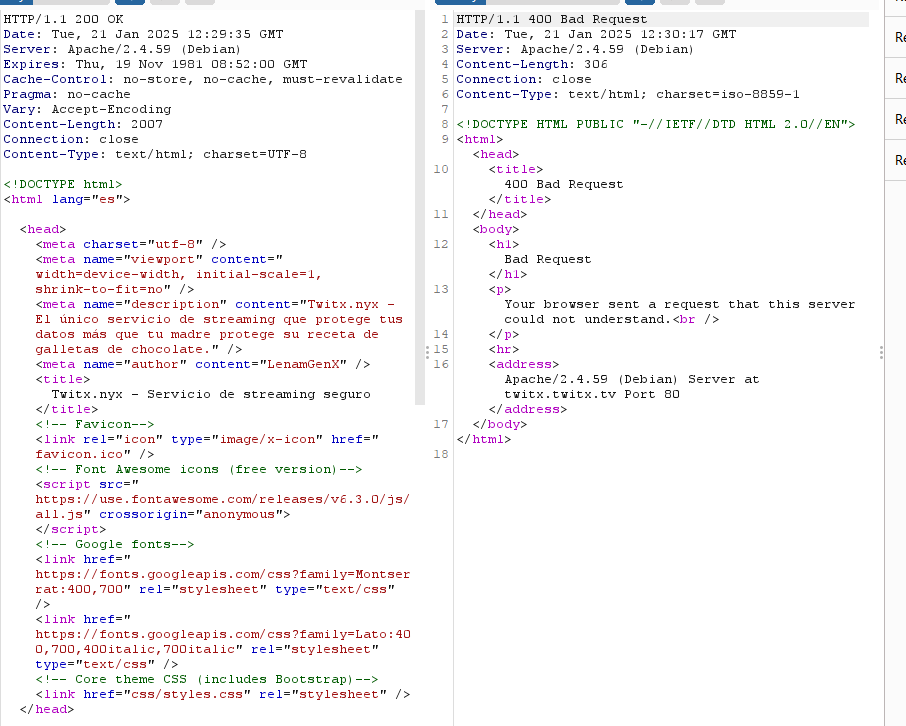  

>没成功直接先搁置了
>


## 提权


>userflag:
>
>rootflag:
>