## 网段扫描
```
└─# arp-scan -l
Interface: eth0, type: EN10MB, MAC: 00:0c:29:df:e2:a7, IPv4: 192.168.26.128
WARNING: Cannot open MAC/Vendor file ieee-oui.txt: Permission denied
WARNING: Cannot open MAC/Vendor file mac-vendor.txt: Permission denied
Starting arp-scan 1.10.0 with 256 hosts (https://github.com/royhills/arp-scan)
192.168.26.1    00:50:56:c0:00:08       (Unknown)
192.168.26.2    00:50:56:e8:d4:e1       (Unknown)
192.168.26.197  00:0c:29:1b:da:11       (Unknown)
192.168.26.254  00:50:56:f7:71:cb       (Unknown)

5 packets received by filter, 0 packets dropped by kernel
Ending arp-scan 1.10.0: 256 hosts scanned in 1.958 seconds (130.75 hosts/sec). 4 responded
```

## 端口扫描

```
└─# nmap -p- -sC -sV 192.168.26.197
Starting Nmap 7.94SVN ( https://nmap.org ) at 2025-01-21 22:33 EST
Nmap scan report for 192.168.26.197 (192.168.26.197)
Host is up (0.0019s latency).
Not shown: 65534 closed tcp ports (reset)
PORT   STATE SERVICE VERSION
80/tcp open  http    Apache httpd 2.4.59 ((Debian))
|_http-title: Apache2 Debian Default Page: It works
|_http-server-header: Apache/2.4.59 (Debian)
MAC Address: 00:0C:29:1B:DA:11 (VMware)

Service detection performed. Please report any incorrect results at https://nmap.org/submit/ .
Nmap done: 1 IP address (1 host up) scanned in 50.09 seconds
```

## 获取webshell
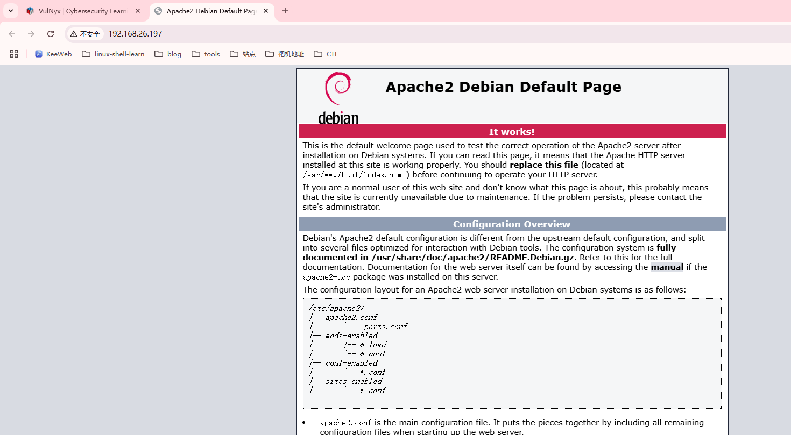  
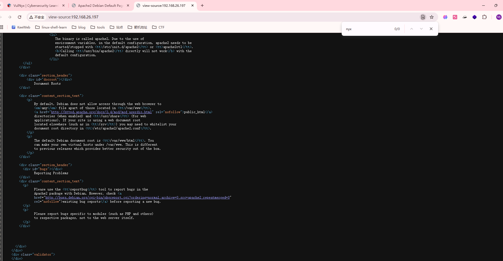  


```
└─# nmap -p- -sY 192.168.26.197
Starting Nmap 7.94SVN ( https://nmap.org ) at 2025-01-21 22:59 EST
Nmap scan report for 192.168.26.197 (192.168.26.197)
Host is up (0.0012s latency).
Not shown: 65533 closed sctp ports (abort)
PORT      STATE SERVICE
22/sctp   open  ssh
8080/sctp open  unknown
MAC Address: 00:0C:29:1B:DA:11 (VMware)

Nmap done: 1 IP address (1 host up) scanned in 62.58 seconds
```
>发现存在这个sctp，但是http://不能直接访问
>

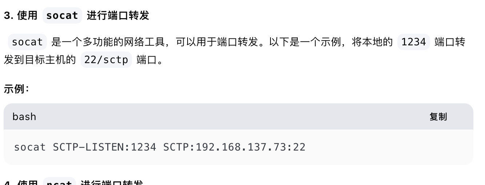  

>这里端口转发利用socat就好了非常简单
>

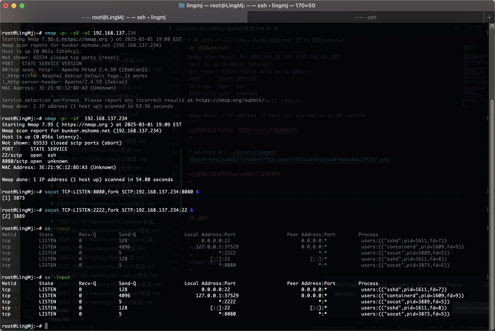  

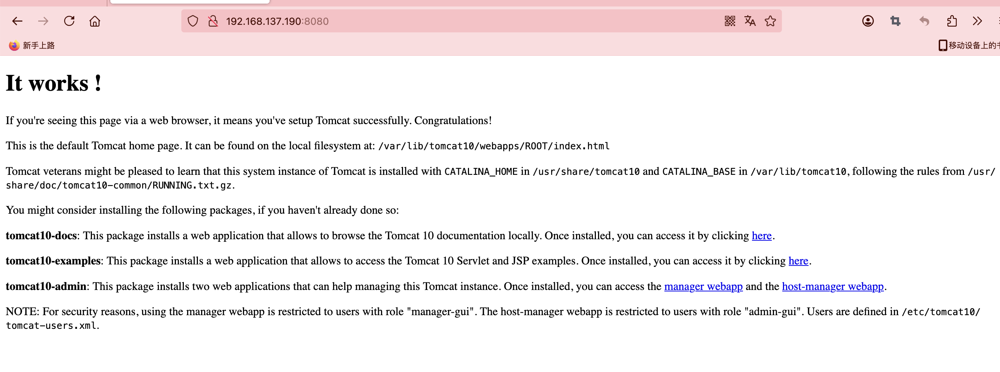  

>是一个tomcat的网站，我查了默认账号密码可能为admin，password和tomcat，tomcat所以我挨个试一下
>

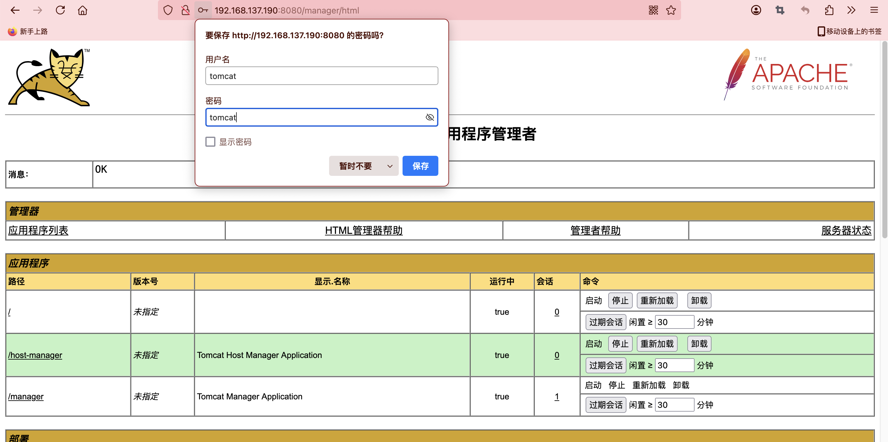  

>发现账号密码为tomcat，tomcat,这里上传是war直接找相应的reverse poc就行了
>

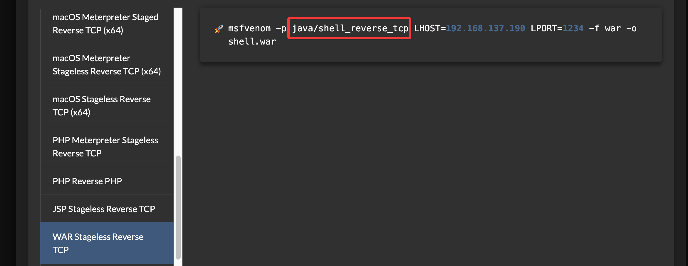  

>可选择其他方案为选了另外的reverse方案，这个没成功
>

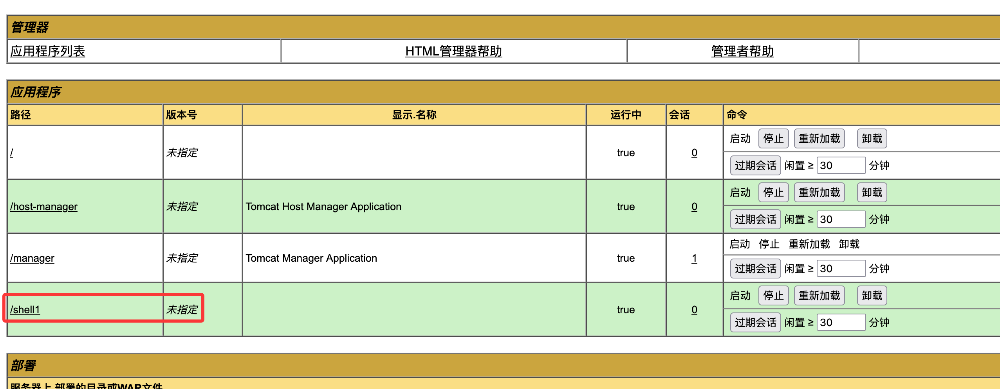  
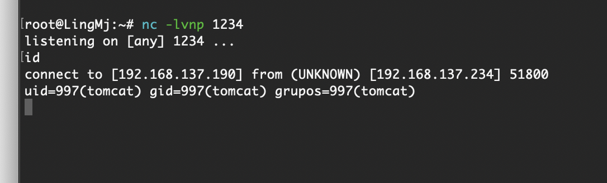  
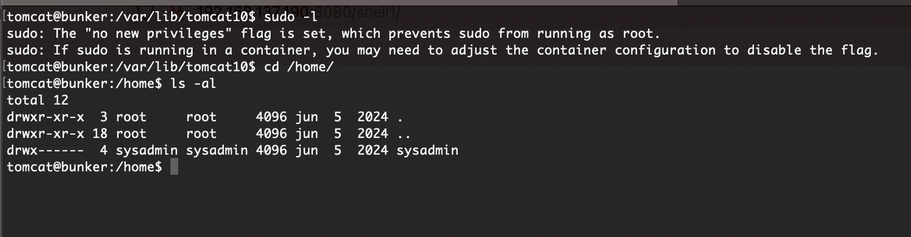  

## 提权
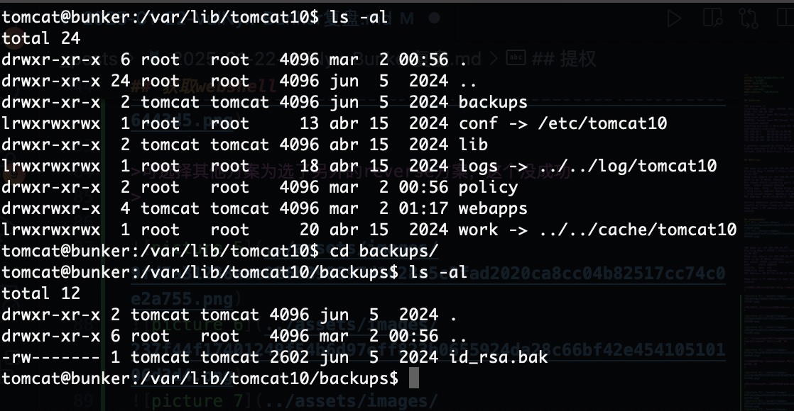  
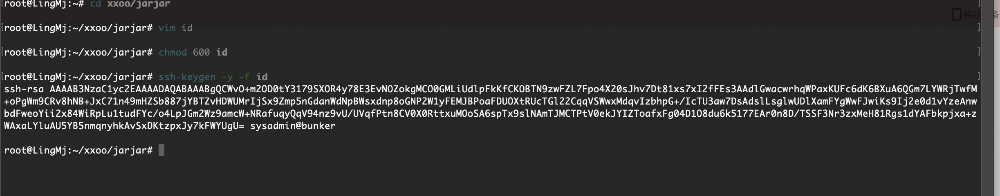  
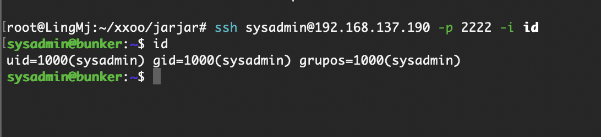  

>无密码直接连接
>

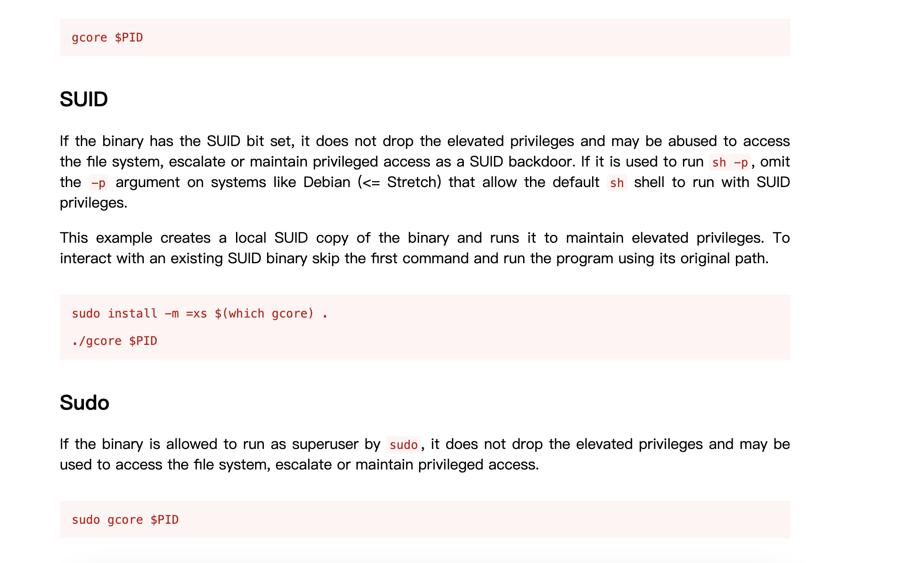  
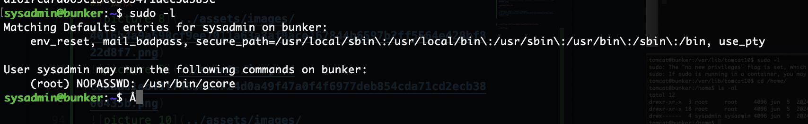  
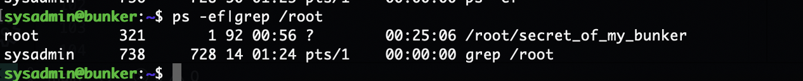  

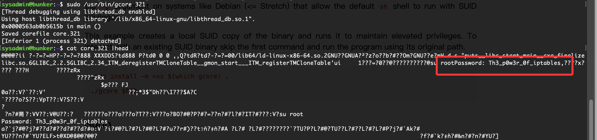  
  


>好了这个靶机结束了，整体还是非常简单的没有任何弯弯绕绕
>


>userflag:a1617ca7d069c13ee365471dec5a389c
>
>rootflag:390a25fd99cfb340eff6c51665109e52
>