## 网段扫描
```
└─# arp-scan -l
Interface: eth0, type: EN10MB, MAC: 00:0c:29:df:e2:a7, IPv4: 192.168.56.110
WARNING: Cannot open MAC/Vendor file ieee-oui.txt: Permission denied
WARNING: Cannot open MAC/Vendor file mac-vendor.txt: Permission denied
Starting arp-scan 1.10.0 with 256 hosts (https://github.com/royhills/arp-scan)
192.168.56.1    0a:00:27:00:00:12       (Unknown: locally administered)
192.168.56.100  08:00:27:63:b7:be       (Unknown)
192.168.56.117  08:00:27:36:67:ef       (Unknown)

4 packets received by filter, 0 packets dropped by kernel
Ending arp-scan 1.10.0: 256 hosts scanned in 1.954 seconds (131.01 hosts/sec). 3 responded
```

## 端口扫描

```
└─# nmap -p- -sC -sV 192.168.56.117
Starting Nmap 7.94SVN ( https://nmap.org ) at 2025-01-25 03:19 EST
mass_dns: warning: Unable to determine any DNS servers. Reverse DNS is disabled. Try using --system-dns or specify valid servers with --dns-servers
Nmap scan report for 192.168.56.117
Host is up (0.00087s latency).
Not shown: 65532 closed tcp ports (reset)
PORT     STATE SERVICE     VERSION
22/tcp   open  ssh         OpenSSH 9.2p1 Debian 2+deb12u1 (protocol 2.0)
| ssh-hostkey: 
|   256 dd:83:da:cb:45:d3:a8:ea:c6:be:19:03:45:76:43:8c (ECDSA)
|_  256 e5:5f:7f:25:aa:c0:18:04:c4:46:98:b3:5d:a5:2b:48 (ED25519)
80/tcp   open  http        Apache httpd 2.4.57 ((Debian))
|_http-server-header: Apache/2.4.57 (Debian)
|_http-title: Polo's Adventures
9090/tcp open  zeus-admin?
| fingerprint-strings: 
|   GetRequest, HTTPOptions: 
|     HTTP/1.1 400 Bad request
|     Content-Type: text/html; charset=utf8
|     Transfer-Encoding: chunked
|     X-DNS-Prefetch-Control: off
|     Referrer-Policy: no-referrer
|     X-Content-Type-Options: nosniff
|     Cross-Origin-Resource-Policy: same-origin
|     X-Frame-Options: sameorigin
|     <!DOCTYPE html>
|     <html>
|     <head>
|     <title>
|     request
|     </title>
|     <meta http-equiv="Content-Type" content="text/html; charset=utf-8">
|     <meta name="viewport" content="width=device-width, initial-scale=1.0">
|     <style>
|     body {
|     margin: 0;
|     font-family: "RedHatDisplay", "Open Sans", Helvetica, Arial, sans-serif;
|     font-size: 12px;
|     line-height: 1.66666667;
|     color: #333333;
|     background-color: #f5f5f5;
|     border: 0;
|     vertical-align: middle;
|_    font-weight: 300;
1 service unrecognized despite returning data. If you know the service/version, please submit the following fingerprint at https://nmap.org/cgi-bin/submit.cgi?new-service :
SF-Port9090-TCP:V=7.94SVN%I=7%D=1/25%Time=67949ED8%P=x86_64-pc-linux-gnu%r
SF:(GetRequest,DB1,"HTTP/1\.1\x20400\x20Bad\x20request\r\nContent-Type:\x2
SF:0text/html;\x20charset=utf8\r\nTransfer-Encoding:\x20chunked\r\nX-DNS-P
SF:refetch-Control:\x20off\r\nReferrer-Policy:\x20no-referrer\r\nX-Content
SF:-Type-Options:\x20nosniff\r\nCross-Origin-Resource-Policy:\x20same-orig
SF:in\r\nX-Frame-Options:\x20sameorigin\r\n\r\n29\r\n<!DOCTYPE\x20html>\n<
SF:html>\n<head>\n\x20\x20\x20\x20<title>\r\nb\r\nBad\x20request\r\nc2c\r\
SF:n</title>\n\x20\x20\x20\x20<meta\x20http-equiv=\"Content-Type\"\x20cont
SF:ent=\"text/html;\x20charset=utf-8\">\n\x20\x20\x20\x20<meta\x20name=\"v
SF:iewport\"\x20content=\"width=device-width,\x20initial-scale=1\.0\">\n\x
SF:20\x20\x20\x20<style>\n\tbody\x20{\n\x20\x20\x20\x20\x20\x20\x20\x20\x2
SF:0\x20\x20\x20margin:\x200;\n\x20\x20\x20\x20\x20\x20\x20\x20\x20\x20\x2
SF:0\x20font-family:\x20\"RedHatDisplay\",\x20\"Open\x20Sans\",\x20Helveti
SF:ca,\x20Arial,\x20sans-serif;\n\x20\x20\x20\x20\x20\x20\x20\x20\x20\x20\
SF:x20\x20font-size:\x2012px;\n\x20\x20\x20\x20\x20\x20\x20\x20\x20\x20\x2
SF:0\x20line-height:\x201\.66666667;\n\x20\x20\x20\x20\x20\x20\x20\x20\x20
SF:\x20\x20\x20color:\x20#333333;\n\x20\x20\x20\x20\x20\x20\x20\x20\x20\x2
SF:0\x20\x20background-color:\x20#f5f5f5;\n\x20\x20\x20\x20\x20\x20\x20\x2
SF:0}\n\x20\x20\x20\x20\x20\x20\x20\x20img\x20{\n\x20\x20\x20\x20\x20\x20\
SF:x20\x20\x20\x20\x20\x20border:\x200;\n\x20\x20\x20\x20\x20\x20\x20\x20\
SF:x20\x20\x20\x20vertical-align:\x20middle;\n\x20\x20\x20\x20\x20\x20\x20
SF:\x20}\n\x20\x20\x20\x20\x20\x20\x20\x20h1\x20{\n\x20\x20\x20\x20\x20\x2
SF:0\x20\x20\x20\x20\x20\x20font-weight:\x20300;\n\x20\x20\x20\x20\x20\x20
SF:\x20\x20}\n\x20\x20\x20\x20\x20\x20\x20\x20p\x20")%r(HTTPOptions,DB1,"H
SF:TTP/1\.1\x20400\x20Bad\x20request\r\nContent-Type:\x20text/html;\x20cha
SF:rset=utf8\r\nTransfer-Encoding:\x20chunked\r\nX-DNS-Prefetch-Control:\x
SF:20off\r\nReferrer-Policy:\x20no-referrer\r\nX-Content-Type-Options:\x20
SF:nosniff\r\nCross-Origin-Resource-Policy:\x20same-origin\r\nX-Frame-Opti
SF:ons:\x20sameorigin\r\n\r\n29\r\n<!DOCTYPE\x20html>\n<html>\n<head>\n\x2
SF:0\x20\x20\x20<title>\r\nb\r\nBad\x20request\r\nc2c\r\n</title>\n\x20\x2
SF:0\x20\x20<meta\x20http-equiv=\"Content-Type\"\x20content=\"text/html;\x
SF:20charset=utf-8\">\n\x20\x20\x20\x20<meta\x20name=\"viewport\"\x20conte
SF:nt=\"width=device-width,\x20initial-scale=1\.0\">\n\x20\x20\x20\x20<sty
SF:le>\n\tbody\x20{\n\x20\x20\x20\x20\x20\x20\x20\x20\x20\x20\x20\x20margi
SF:n:\x200;\n\x20\x20\x20\x20\x20\x20\x20\x20\x20\x20\x20\x20font-family:\
SF:x20\"RedHatDisplay\",\x20\"Open\x20Sans\",\x20Helvetica,\x20Arial,\x20s
SF:ans-serif;\n\x20\x20\x20\x20\x20\x20\x20\x20\x20\x20\x20\x20font-size:\
SF:x2012px;\n\x20\x20\x20\x20\x20\x20\x20\x20\x20\x20\x20\x20line-height:\
SF:x201\.66666667;\n\x20\x20\x20\x20\x20\x20\x20\x20\x20\x20\x20\x20color:
SF:\x20#333333;\n\x20\x20\x20\x20\x20\x20\x20\x20\x20\x20\x20\x20backgroun
SF:d-color:\x20#f5f5f5;\n\x20\x20\x20\x20\x20\x20\x20\x20}\n\x20\x20\x20\x
SF:20\x20\x20\x20\x20img\x20{\n\x20\x20\x20\x20\x20\x20\x20\x20\x20\x20\x2
SF:0\x20border:\x200;\n\x20\x20\x20\x20\x20\x20\x20\x20\x20\x20\x20\x20ver
SF:tical-align:\x20middle;\n\x20\x20\x20\x20\x20\x20\x20\x20}\n\x20\x20\x2
SF:0\x20\x20\x20\x20\x20h1\x20{\n\x20\x20\x20\x20\x20\x20\x20\x20\x20\x20\
SF:x20\x20font-weight:\x20300;\n\x20\x20\x20\x20\x20\x20\x20\x20}\n\x20\x2
SF:0\x20\x20\x20\x20\x20\x20p\x20");
MAC Address: 08:00:27:36:67:EF (Oracle VirtualBox virtual NIC)
Service Info: OS: Linux; CPE: cpe:/o:linux:linux_kernel

Service detection performed. Please report any incorrect results at https://nmap.org/submit/ .
Nmap done: 1 IP address (1 host up) scanned in 220.07 seconds
```

## 获取webshell
>存在80和9090端口，上web看一眼
>

  
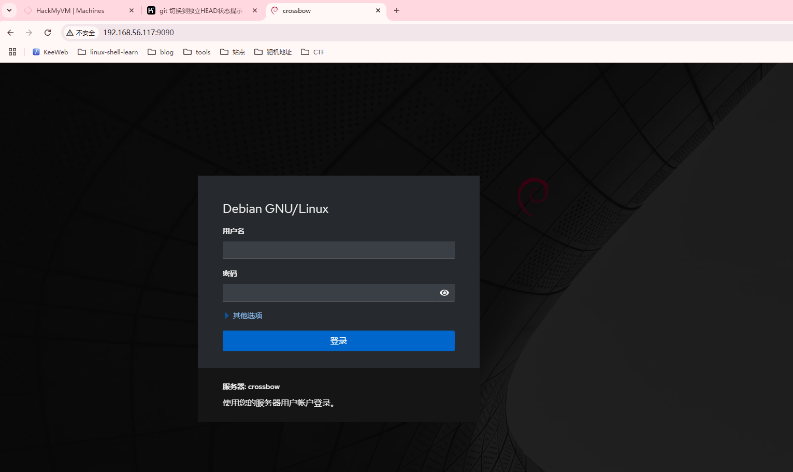  
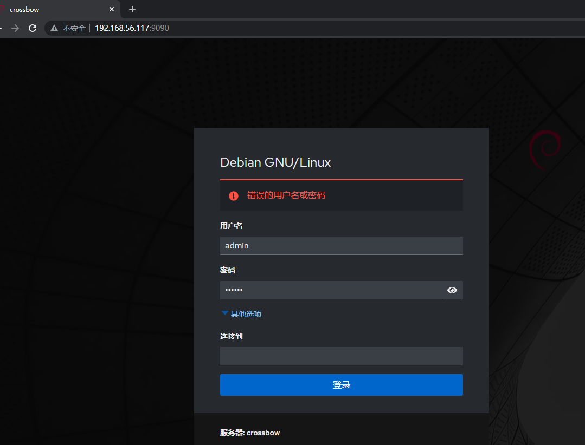  
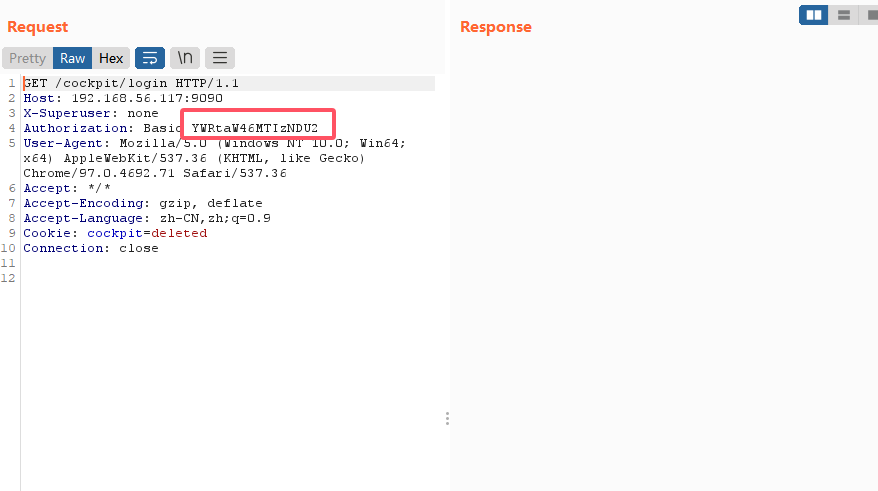  
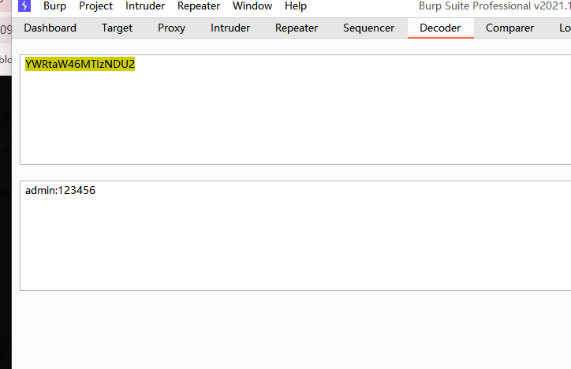  
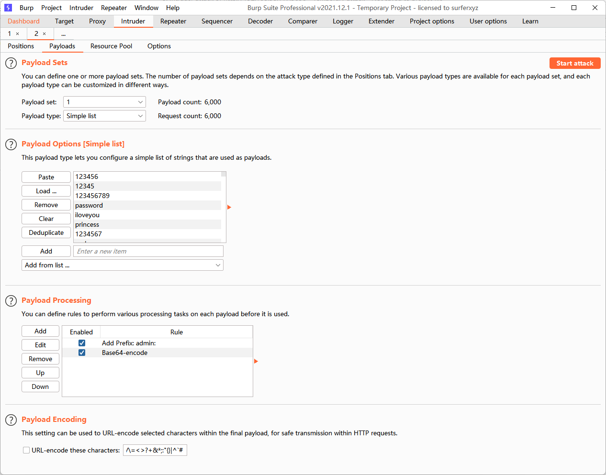  
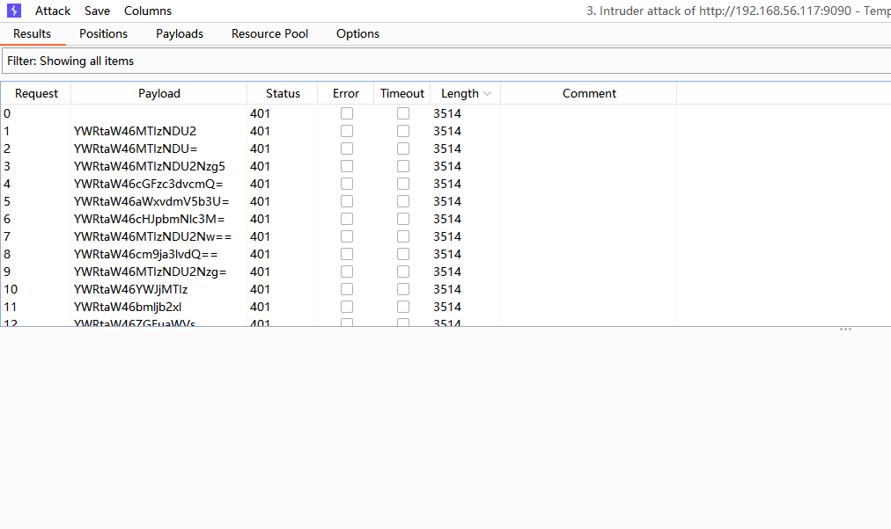  

>爆破无果
>
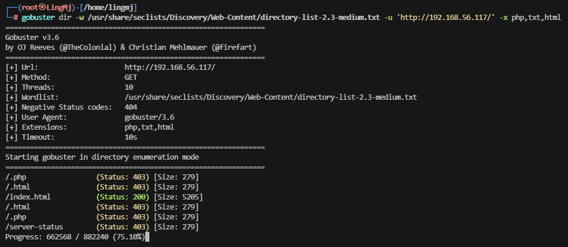  
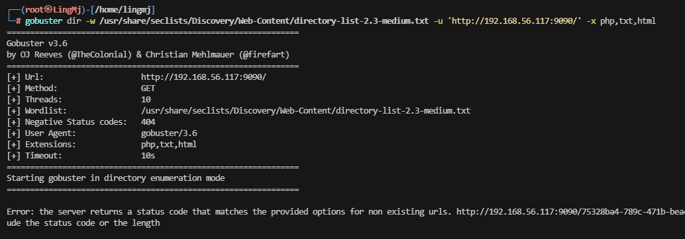  
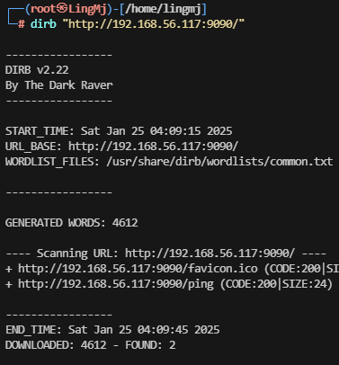  
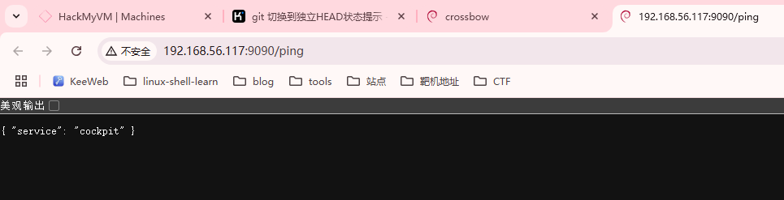  
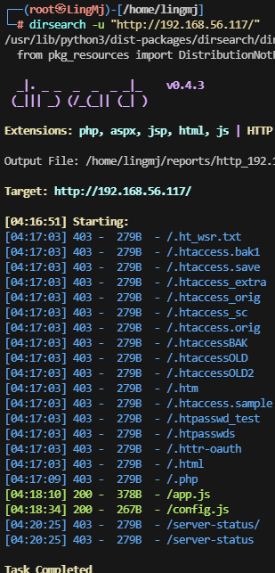  
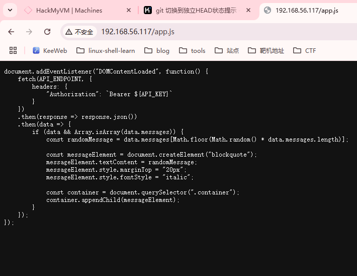  
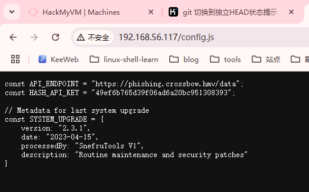  

>到这里我们发现存在域名，phishing.crossbow.hmv
>
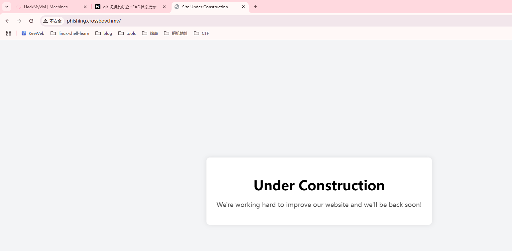  
>扫描无果，继续扫描子域名，浪费了一段时间回归网页的js，里面的key可以试着解开
>
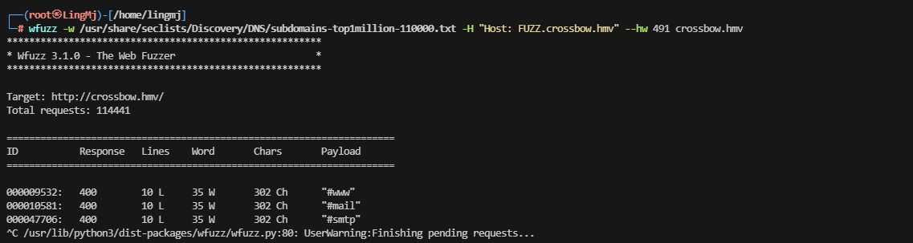  
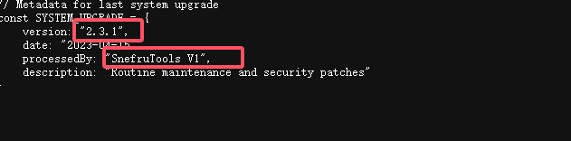  

>找到的解密网址：https://md5hashing.net/
>

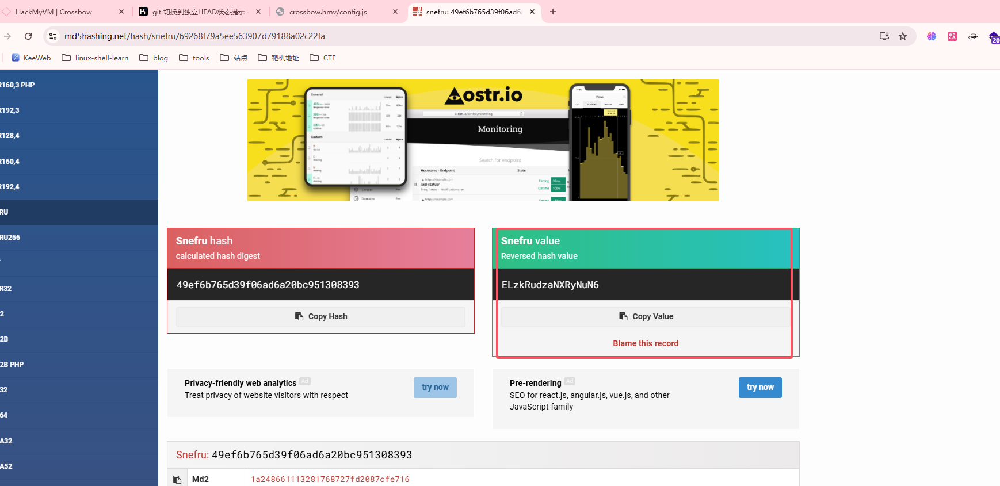  
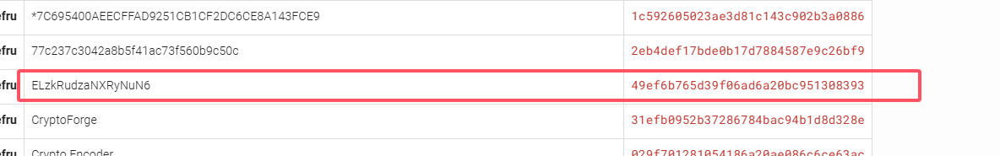  

>记得存在的登录页面，但是不知道用户名，不是admin，可以试主界面的polo
>
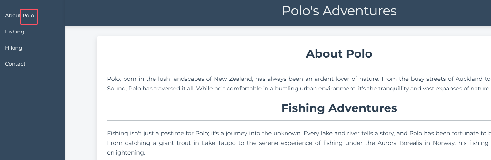  
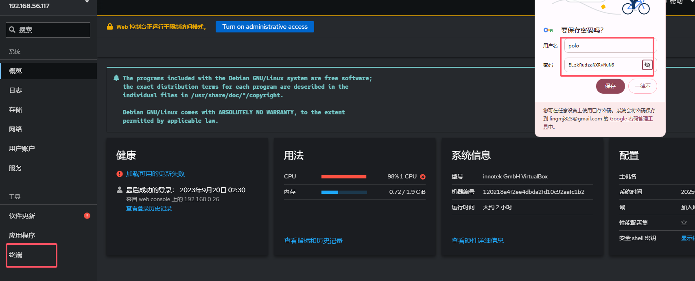  
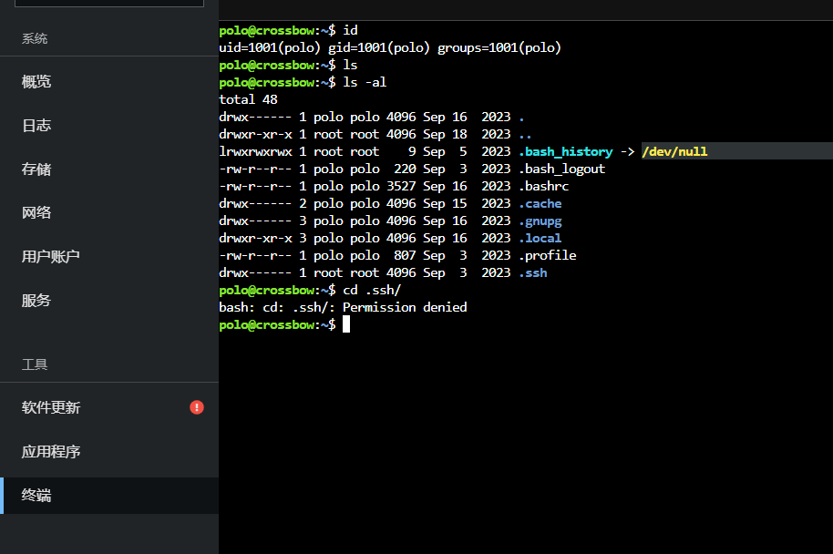  


## 提权
```
polo@crossbow:~$ ls -al
total 48
drwx------ 1 polo polo 4096 Sep 16  2023 .
drwxr-xr-x 1 root root 4096 Sep 18  2023 ..
lrwxrwxrwx 1 root root    9 Sep  5  2023 .bash_history -> /dev/null
-rw-r--r-- 1 polo polo  220 Sep  3  2023 .bash_logout
-rw-r--r-- 1 polo polo 3527 Sep 16  2023 .bashrc
drwx------ 2 polo polo 4096 Sep 15  2023 .cache
drwx------ 3 polo polo 4096 Sep 16  2023 .gnupg
drwxr-xr-x 3 polo polo 4096 Sep 16  2023 .local
-rw-r--r-- 1 polo polo  807 Sep  3  2023 .profile
drwx------ 1 root root 4096 Sep  3  2023 .ssh
polo@crossbow:~$ sudo -l
[sudo] password for polo: 
Sorry, user polo may not run sudo on crossbow.
polo@crossbow:~$ 
```

```
polo@crossbow:/home$ ls -al
total 28
drwxr-xr-x 1 root root 4096 Sep 18  2023 .
drwxr-xr-x 1 root root 4096 Dec 14  2023 ..
drwxr-xr-x 1 lea  lea  4096 Sep 18  2023 lea
drwx------ 1 polo polo 4096 Sep 16  2023 polo
polo@crossbow:/home$ cd lea/
polo@crossbow:/home/lea$ ls a-l
ls: cannot access 'a-l': No such file or directory
polo@crossbow:/home/lea$ ls -al
total 48
drwxr-xr-x 1 lea  lea  4096 Sep 18  2023 .
drwxr-xr-x 1 root root 4096 Sep 18  2023 ..
lrwxrwxrwx 1 root root    9 Sep  5  2023 .bash_history -> /dev/null
-rw-r--r-- 1 lea  lea   220 Apr 23  2023 .bash_logout
-rw-r--r-- 1 lea  lea  3527 Sep 18  2023 .bashrc
drwx------ 2 lea  lea  4096 Sep 18  2023 .keychain
drwxr-xr-x 1 lea  lea  4096 Dec 14  2023 .local
-rw-r--r-- 1 lea  lea   807 Apr 23  2023 .profile
drwx------ 1 lea  lea  4096 Dec 14  2023 .ssh
polo@crossbow:/home/lea$ 
```

```
polo@crossbow:/var$ ss -lnput
Netid                State                 Recv-Q                Send-Q                               Local Address:Port                                Peer Address:Port                Process                
tcp                  LISTEN                0                     128                                        0.0.0.0:22                                       0.0.0.0:*                                          
tcp                  LISTEN                0                     511                                        0.0.0.0:80                                       0.0.0.0:*                                          
tcp                  LISTEN                0                     10                                               *:9090                                           *:*                                          
tcp                  LISTEN                0                     128                                           [::]:22                                          [::]:*                                          
polo@crossbow:/var$ ps -ef
UID          PID    PPID  C STIME TTY          TIME CMD
root           1       0  0 08:16 ?        00:00:18 /usr/bin/python3 /usr/bin/supervisord
root           6       1  0 08:16 ?        00:00:00 /bin/sh /usr/sbin/apachectl -D FOREGROUND
root           8       1  0 08:16 ?        00:00:37 /usr/lib/cockpit/cockpit-ws --no-tls
lea           11       1  5 08:16 ?        00:06:52 /bin/bash /home/lea/.local/agent
root          16       6  0 08:16 ?        00:00:00 /usr/sbin/apache2 -D FOREGROUND
root          27       1  0 08:16 ?        00:00:00 /usr/sbin/cron
root          30       1  0 08:16 ?        00:00:00 sshd: /usr/sbin/sshd [listener] 0 of 10-100 startups
lea         1081       1  0 08:16 ?        00:00:00 ssh-agent
www-data 1555777      16  0 09:16 ?        00:00:08 /usr/sbin/apache2 -D FOREGROUND
www-data 2043171      16  0 09:36 ?        00:00:04 /usr/sbin/apache2 -D FOREGROUND
www-data 2043620      16  0 09:36 ?        00:00:04 /usr/sbin/apache2 -D FOREGROUND
www-data 2043621      16  0 09:36 ?        00:00:04 /usr/sbin/apache2 -D FOREGROUND
www-data 2043622      16  0 09:36 ?        00:00:04 /usr/sbin/apache2 -D FOREGROUND
www-data 2192187      16  0 09:41 ?        00:00:03 /usr/sbin/apache2 -D FOREGROUND
www-data 2192978      16  0 09:41 ?        00:00:03 /usr/sbin/apache2 -D FOREGROUND
www-data 2192980      16  0 09:41 ?        00:00:03 /usr/sbin/apache2 -D FOREGROUND
www-data 2495615      16  0 09:55 ?        00:00:00 /usr/sbin/apache2 -D FOREGROUND
www-data 2550880      16  0 09:57 ?        00:00:00 /usr/sbin/apache2 -D FOREGROUND
root     2834847       8  0 10:07 ?        00:00:00 /usr/lib/cockpit/cockpit-session localhost
polo     2834859       1  0 10:07 ?        00:00:00 /usr/bin/ssh-agent
polo     2834868 2834847  0 10:07 ?        00:00:00 cockpit-bridge
polo     2834871 2834868  0 10:07 ?        00:00:00 dbus-daemon --print-address --session
polo     2844414 2834868  0 10:08 pts/0    00:00:00 /bin/bash
polo     2875978 2844414  0 10:09 pts/0    00:00:00 bash
polo     2883198 2875978  0 10:09 pts/0    00:00:00 /usr/bin/script /dev/null -qc /bin/bash
polo     2883200 2883198  0 10:09 pts/1    00:00:00 /bin/bash
polo     2977841 2883200  0 10:13 pts/1    00:00:00 ps -ef
lea      2977842      11  0 10:13 ?        00:00:00 find /tmp -name ssh-* -type d
polo@crossbow:/var$ 
```
>利用工具进行操作一下，没啥线索
>
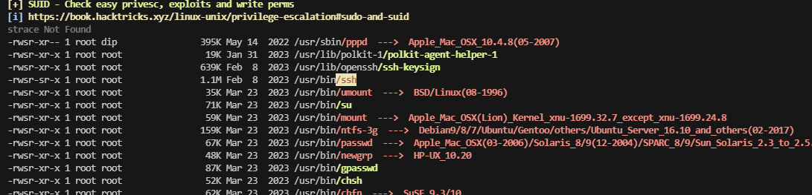  
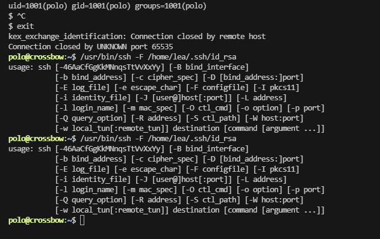  

>用了一下没啥突破没没有读取文件，命令注入不知道怎么注入
>
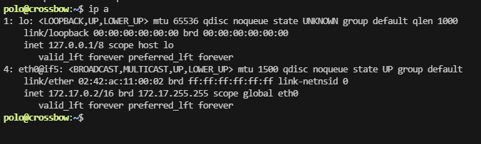  

>这里我才发现他是一个docker，所以使用ssh才会出错，
>
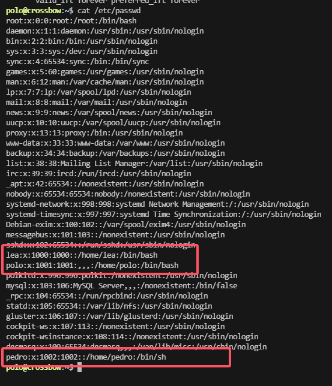  

>可以看到一共三个用户，除了本身都可以进行实验
>
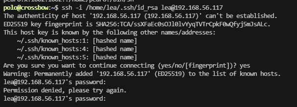  
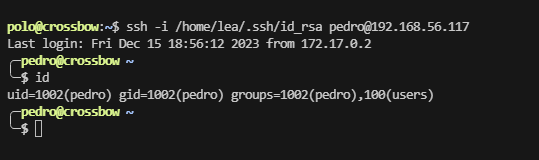  

>ok,拿到下一个用户
>
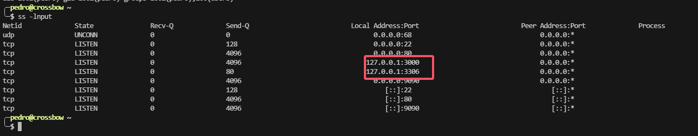  

>存在3306和3000
>

```
╭─pedro@crossbow ~/.gnupg 
╰─$ ls -al
total 20
drwx------ 3 pedro pedro 4096 Sep 16  2023 .
drwx------ 6 pedro pedro 4096 Jan 26 05:12 ..
drwx------ 2 pedro pedro 4096 Sep 16  2023 private-keys-v1.d
-rw------- 1 pedro pedro   32 Sep 16  2023 pubring.kbx
-rw------- 1 pedro pedro 1200 Sep 16  2023 trustdb.gpg
╭─pedro@crossbow ~/.gnupg 
╰─$ cd private-keys-v1.d 
╭─pedro@crossbow ~/.gnupg/private-keys-v1.d 
╰─$ ls -al
total 8
drwx------ 2 pedro pedro 4096 Sep 16  2023 .
drwx------ 3 pedro pedro 4096 Sep 16  2023 ..
╭─pedro@crossbow ~/.gnupg/private-keys-v1.d 
╰─$ sudo -l  
[sudo] password for pedro: 
sudo: a password is required
╭─pedro@crossbow ~/.gnupg/private-keys-v1.d 
╰─$  
```

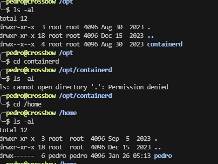  

>opt 有一个东西，看看怎么利用，没想法直接用工具
>
  
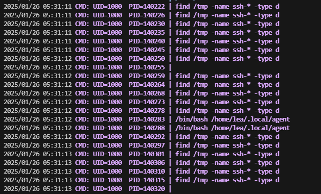  

>这个利用点不太懂
>

```
╰─$ ./socat TCP-LISTEN:8080,fork TCP4:127.0.0.1:3000 &  
[1] 148396
╭─pedro@crossbow ~ 
╰─$ ss -lnput
Netid           State            Recv-Q           Send-Q                     Local Address:Port                     Peer Address:Port           Process                                      
udp             UNCONN           0                0                                0.0.0.0:68                            0.0.0.0:*                                                           
tcp             LISTEN           0                128                              0.0.0.0:22                            0.0.0.0:*                                                           
tcp             LISTEN           0                4096                             0.0.0.0:80                            0.0.0.0:*                                                           
tcp             LISTEN           0                4096                           127.0.0.1:3000                          0.0.0.0:*                                                           
tcp             LISTEN           0                80                             127.0.0.1:3306                          0.0.0.0:*                                                           
tcp             LISTEN           0                5                                0.0.0.0:8080                          0.0.0.0:*               users:(("socat",pid=148396,fd=5))           
tcp             LISTEN           0                4096                             0.0.0.0:9090                          0.0.0.0:*                                                           
tcp             LISTEN           0                128                                 [::]:22                               [::]:*                                                           
tcp             LISTEN           0                4096                                [::]:80                               [::]:*                                                           
tcp             LISTEN           0                4096                                [::]:9090                             [::]:*                                                           
╭─pedro@crossbow ~ 
╰─$ 
```

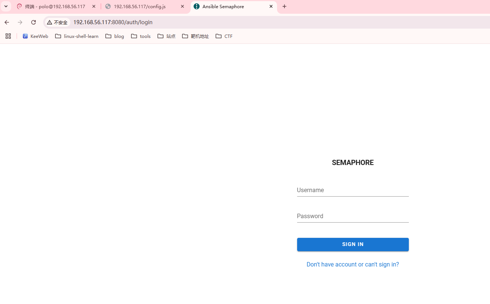  
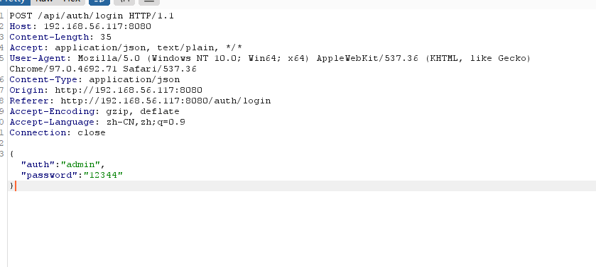  
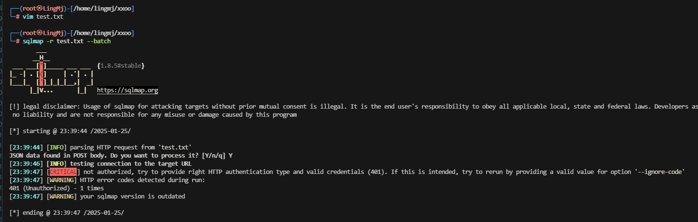  

>无想法，去看一眼wp，默认的弱口令，我还以为找东西
>
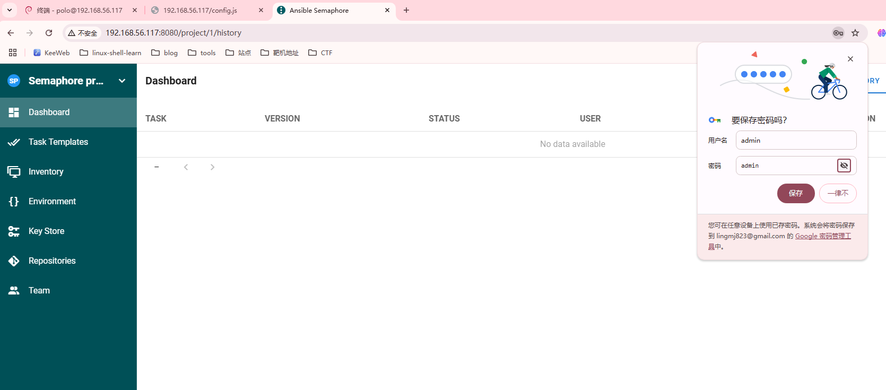  

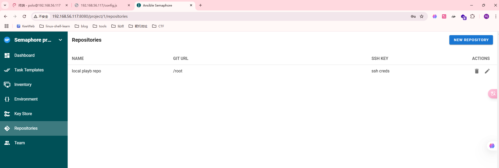  
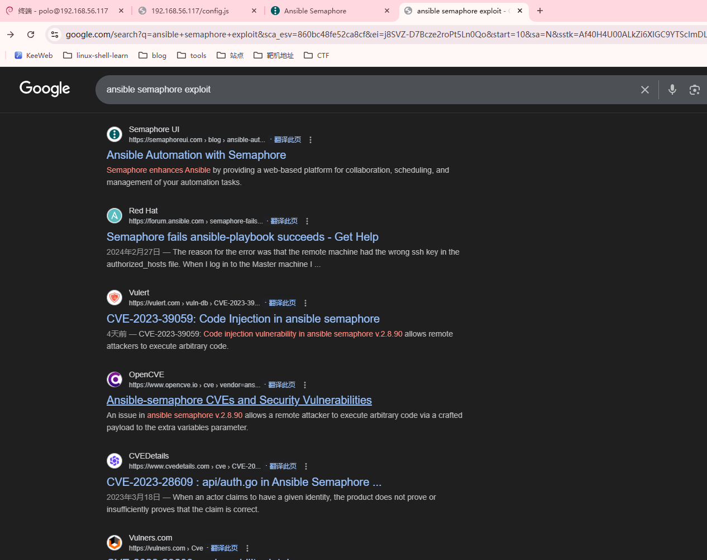  

>这个确实是有漏洞的，可以利用一下，地址：https://www.alevsk.com/2023/07/a-quick-story-of-security-pitfalls-with-execcommand-in-software-integrations/
>

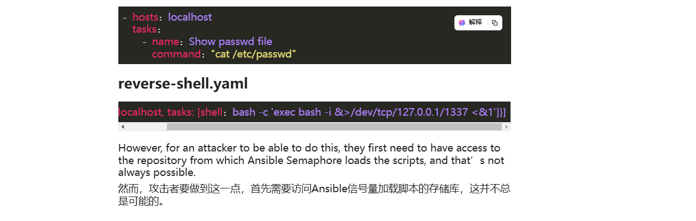  

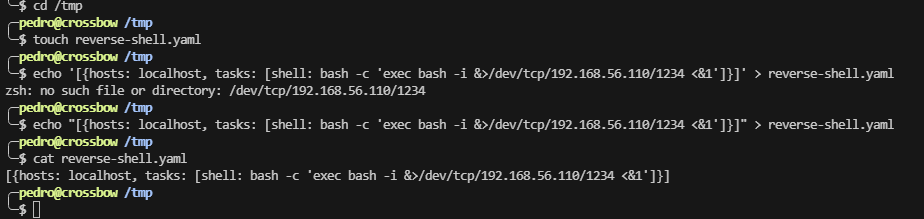  

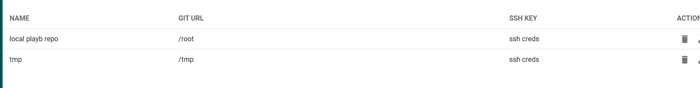  
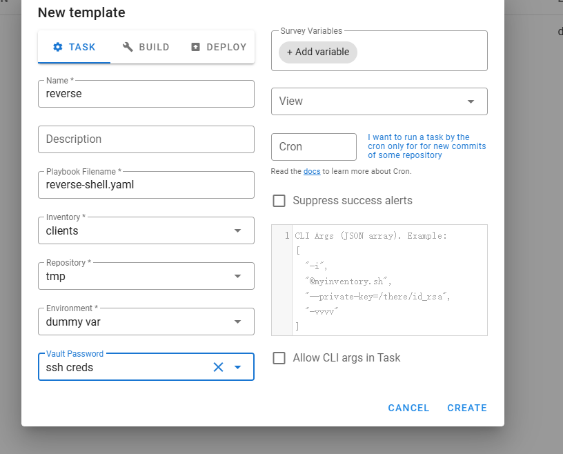  
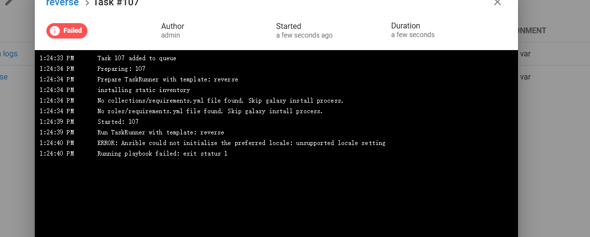  
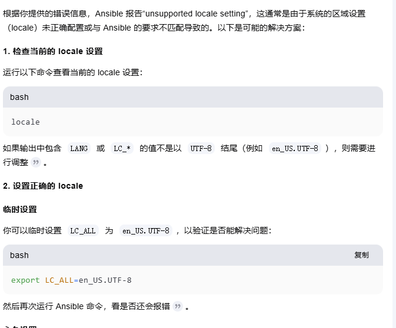  
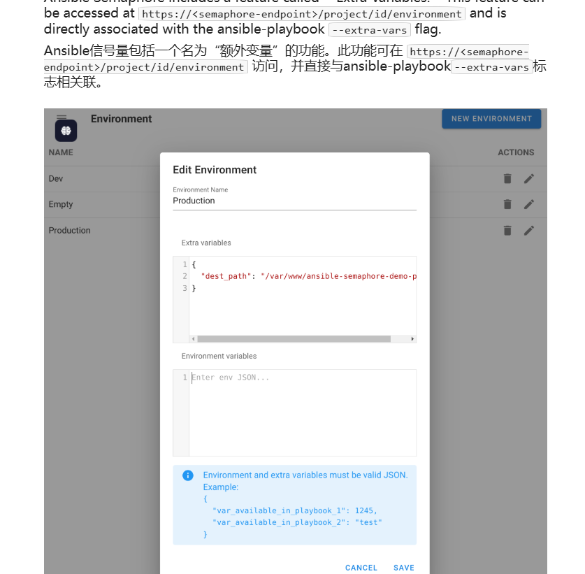  
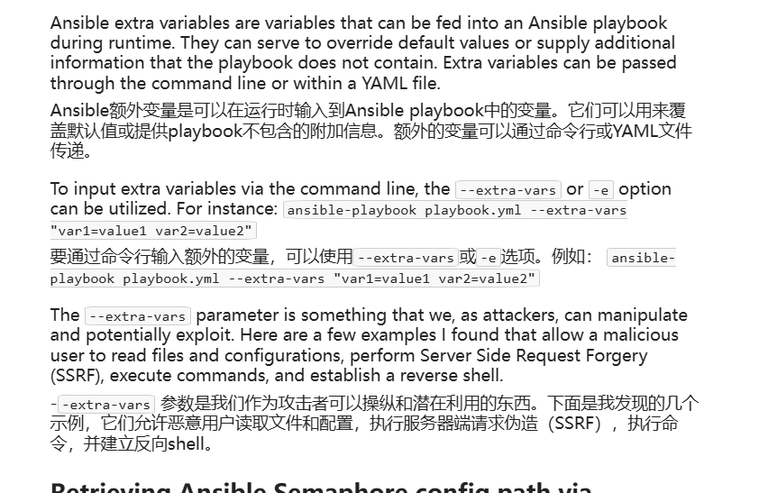  
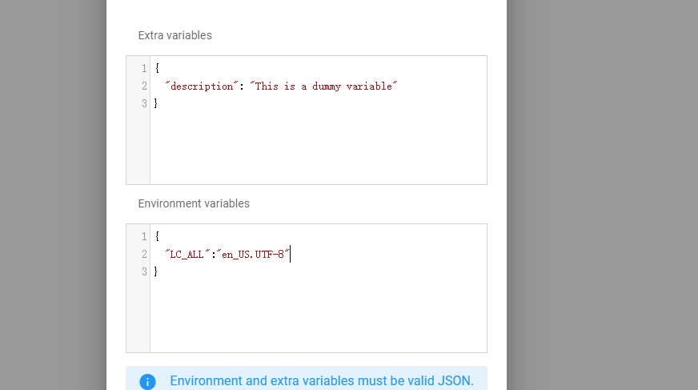  
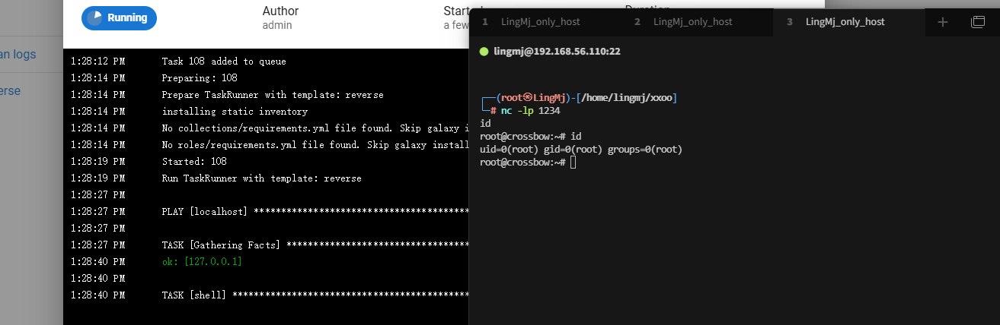  

>到这里就结束了
>


>userflag:58cb1e1bdb3a348ddda53f22ee7c1613
>
>rootflag:7a299c41b1daac46d5ab98745b212e09
>