## 网段扫描
```
root@LingMj:/home/lingmj# arp-scan -l
Interface: eth0, type: EN10MB, MAC: 00:0c:29:df:e2:a7, IPv4: 192.168.56.110
WARNING: Cannot open MAC/Vendor file ieee-oui.txt: Permission denied
WARNING: Cannot open MAC/Vendor file mac-vendor.txt: Permission denied
Starting arp-scan 1.10.0 with 256 hosts (https://github.com/royhills/arp-scan)
192.168.56.1    0a:00:27:00:00:13       (Unknown: locally administered)
192.168.56.100  08:00:27:fd:61:55       (Unknown)
192.168.56.127  08:00:27:a3:e0:b0       (Unknown)

3 packets received by filter, 0 packets dropped by kernel
Ending arp-scan 1.10.0: 256 hosts scanned in 1.859 seconds (137.71 hosts/sec). 3 responded
```

## 端口扫描

```
root@LingMj:/home/lingmj# nmap -p- -sC -sV 192.168.56.127        
Starting Nmap 7.94SVN ( https://nmap.org ) at 2025-02-02 22:52 EST
mass_dns: warning: Unable to determine any DNS servers. Reverse DNS is disabled. Try using --system-dns or specify valid servers with --dns-servers
Nmap scan report for 192.168.56.127
Host is up (0.00058s latency).
Not shown: 65533 closed tcp ports (reset)
PORT   STATE SERVICE VERSION
21/tcp open  ftp     vsftpd 3.0.3
80/tcp open  http    nginx 1.18.0 (Ubuntu)
|_http-server-header: nginx/1.18.0 (Ubuntu)
|_http-title: Site doesn't have a title (text/html).
MAC Address: 08:00:27:A3:E0:B0 (Oracle VirtualBox virtual NIC)
Service Info: OSs: Unix, Linux; CPE: cpe:/o:linux:linux_kernel

Service detection performed. Please report any incorrect results at https://nmap.org/submit/ .
Nmap done: 1 IP address (1 host up) scanned in 575.42 seconds
```

## 获取webshell

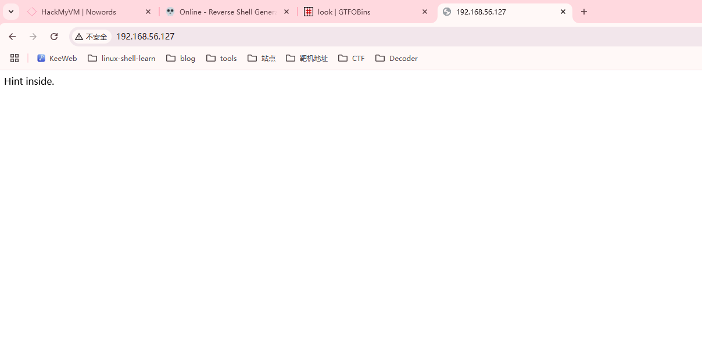  
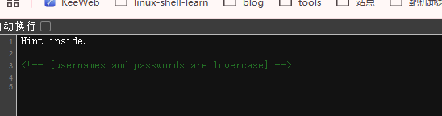  
  
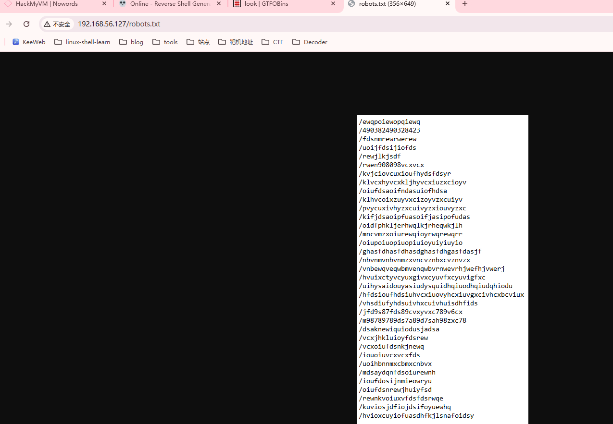  

```
/ewqpoiewopqiewq
/490382490328423
/fdsnmrewrwerew
/uoijfdsijiofds
/rewjlkjsdf
/rwen908098vcxvcx
/kvjciovcuxioufhydsfdsyr
/klvcxhyvcxkljhyvcxiuzxcioyv
/oiufdsaoifndasuiofhdsa
/klhvcoixzuyvxcizoyvzxcuiyv
/pvycuxivhyzxcuivyzxiouvyzxc
/kifjdsaoipfuasoifjasipofudas
/oidfphkljerhwqlkjrheqwkjlh
/mncvmzxoiurewqioyrwqrewqrr
/oiupoiuopiuopiuioyuiyiuyio
/ghasfdhasfdhasdghasfdhgasfdasjf
/nbvnmvnbvnmzxvncvznbxcvznvzx
/vnbewqveqwbmvenqwbvrnwevrhjwefhjvwerj
/hvuixctyvcyuxgivxcyuvfxcyuvigfxc
/uihysaidouyasiudysquidhqiuodhqiudqhiodu
/hfdsioufhdsiuhvcxiuovyhcxiuvgxcivhcxbcviux
/vhsdiufyhdsuivhxcuivhuisdhfids
/jfd9s87fds89cvxyvxc789v6cx
/m98789789ds7a89d7sah98zxc78
/dsaknewiquiodusjadsa
/vcxjhkluioyfdsrew
/vcxoiufdsnkjnewq
/iouoiuvcxvcxfds
/uoihbnnmxcbmxcnbvx
/mdsaydqnfdsoiurewnh
/ioufdosijnmieowryu
/oiufdsnrewjhuiyfsd
/rewnkvoiuxvfdsfdsrwqe
/kuviosjdfiojdsifoyuewhq
/hvioxcuyiofuasdhfkjlsnafoidsy
```

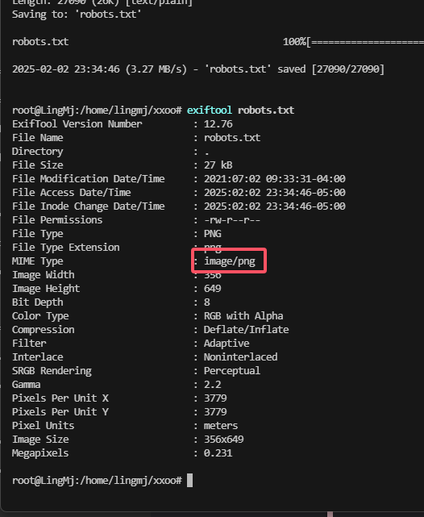  


```
root@LingMj:/home/lingmj/xxoo# cat tmp|xargs|tr ' ' '\n'|tr '/' '' 
tr: when not truncating set1, string2 must be non-empty
                                                                                                                                                                                             
root@LingMj:/home/lingmj/xxoo# cat tmp|xargs|tr ' ' '\n'|tr '\/' ''
tr: when not truncating set1, string2 must be non-empty
                                                                                                                                                                                             
root@LingMj:/home/lingmj/xxoo# cat tmp|xargs|tr ' ' '\n'|sed 's/\///g'
ewqpoiewopqiewq
490382490328423
fdsnmrewrwerew
uoijfdsijiofds
rewjlkjsdf
rwen908098vcxvcx
kvjciovcuxioufhydsfdsyr
klvcxhyvcxkljhyvcxiuzxcioyv
oiufdsaoifndasuiofhdsa
klhvcoixzuyvxcizoyvzxcuiyv
pvycuxivhyzxcuivyzxiouvyzxc
kifjdsaoipfuasoifjasipofudas
oidfphkljerhwqlkjrheqwkjlh
mncvmzxoiurewqioyrwqrewqrr
oiupoiuopiuopiuioyuiyiuyio
ghasfdhasfdhasdghasfdhgasfdasjf
nbvnmvnbvnmzxvncvznbxcvznvzx
vnbewqveqwbmvenqwbvrnwevrhjwefhjvwerj
hvuixctyvcyuxgivxcyuvfxcyuvigfxc
uihysaidouyasiudysquidhqiuodhqiudqhiodu
hfdsioufhdsiuhvcxiuovyhcxiuvgxcivhcxbcviux
vhsdiufyhdsuivhxcuivhuisdhfids
jfd9s87fds89cvxyvxc789v6cx
m98789789ds7a89d7sah98zxc78
dsaknewiquiodusjadsa
vcxjhkluioyfdsrew
vcxoiufdsnkjnewq
iouoiuvcxvcxfds
uoihbnnmxcbmxcnbvx
mdsaydqnfdsoiurewnh
ioufdosijnmieowryu
oiufdsnrewjhuiyfsd
rewnkvoiuxvfdsfdsrwqe
kuviosjdfiojdsifoyuewhq
hvioxcuyiofuasdhfkjlsnafoidsy
                                                                                                                                                                                             
root@LingMj:/home/lingmj/xxoo# cat tmp|xargs|tr ' ' '\n'|sed 's/\///g' > dir
                                                                                                                                                                                             
root@LingMj:/home/lingmj/xxoo# gobuster dir -w dir -u 'http://192.168.56.127/'                     
===============================================================
Gobuster v3.6
by OJ Reeves (@TheColonial) & Christian Mehlmauer (@firefart)
===============================================================
[+] Url:                     http://192.168.56.127/
[+] Method:                  GET
[+] Threads:                 10
[+] Wordlist:                dir
[+] Negative Status codes:   404
[+] User Agent:              gobuster/3.6
[+] Timeout:                 10s
===============================================================
Starting gobuster in directory enumeration mode
===============================================================
/oiufdsnrewjhuiyfsd   (Status: 200) [Size: 58506]
Progress: 35 / 36 (97.22%)
===============================================================
Finished
===============================================================
```


  


>又是一个文件
>

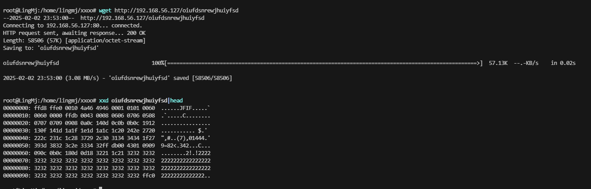  
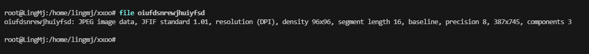  
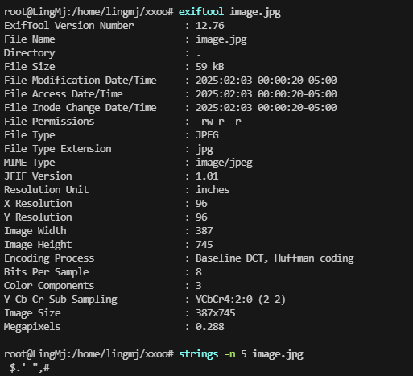  
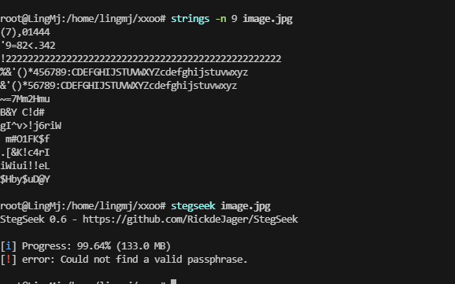  
  

>有思路了直接进行提权爆破ftp
>

```
Brielle
Quinn
Mary
Athena
Delilah
Nevaeh
Andrea
Leilani
Jasmine
Lyla
Margaret
Alyssa
Adalyn
Arya
Norah
Isla
Piper
Ruby
Rylee
Katherine
Serenity
Willow
Sophie
Josephine
Ivy
Everly
Cora
Kaylee
Liliana
Lydia
Jade
Aubree
Maria
Arianna
Taylor
Khloe
Hadley
Kayla
Eden
Eliza
Eliana
Kylie
Peyton
Emery
Melanie
Rose
Gianna
Adalynn
Natalia
Ariel
Isabelle
Melody
Alexis
Isabel
Sydney
Juliana
Brianna
Lauren
Mackenzie
lris
Raelynn
Madeline
Bailey
Emerson
Julia
Annabelle
Faith
Valentina
Nova
Alexandra
Ximena
Clara
Vivian
Ashley
Reagan
```

```
root@LingMj:/home/lingmj/xxoo# cat tmp|tr 'A-Z' 'a-z'                       
brielle
quinn
mary
athena
delilah
nevaeh
andrea
leilani
jasmine
lyla
margaret
alyssa
adalyn
arya
norah
isla
piper
ruby
rylee
katherine
serenity
willow
sophie
josephine
ivy
everly
cora
kaylee
liliana
lydia
jade
aubree
maria
arianna
taylor
khloe
hadley
kayla
eden
eliza
eliana
kylie
peyton
emery
melanie
rose
gianna
adalynn
natalia
ariel
isabelle
melody
alexis
isabel
sydney
juliana
brianna
lauren
mackenzie
lris
raelynn
madeline
bailey
emerson
julia
annabelle
faith
valentina
nova
alexandra
ximena
clara
vivian
ashley
reagan
                                                                                                                                                                                             
root@LingMj:/home/lingmj/xxoo# cat tmp|tr 'A-Z' 'a-z' > user
```

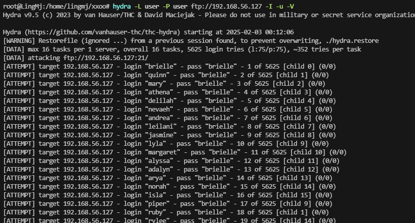  

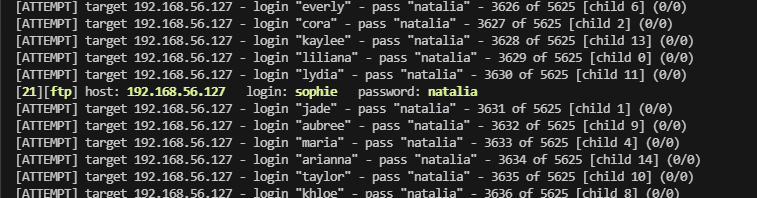  
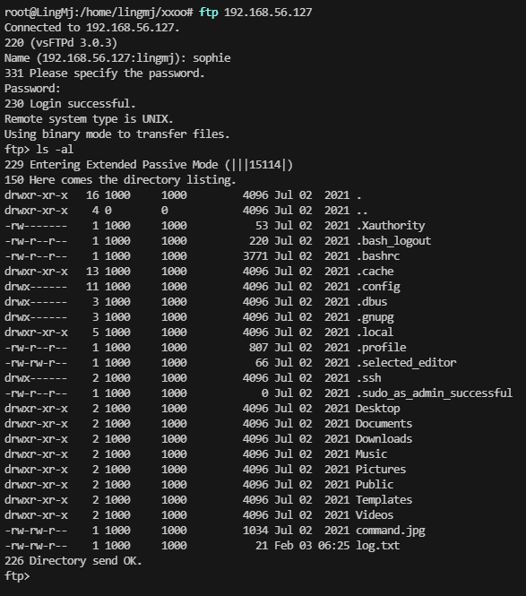  

>有ssh，但是没有22端口，查看ipv6
>

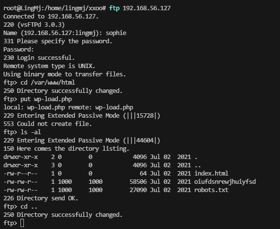  

>无法上传到www，所以不能直接获取东西
>

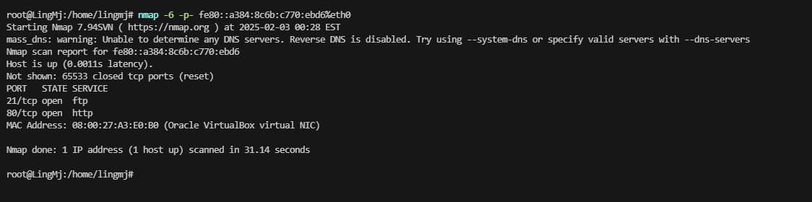  
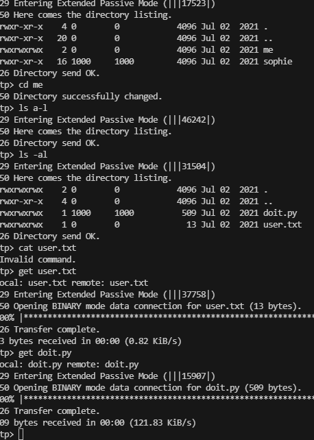  
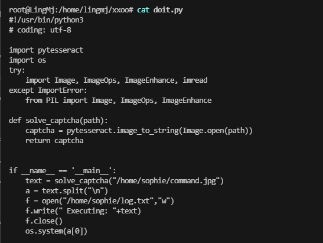  

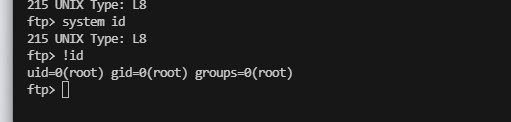  
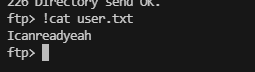  
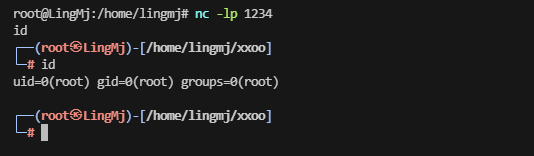  

>有点问题
>

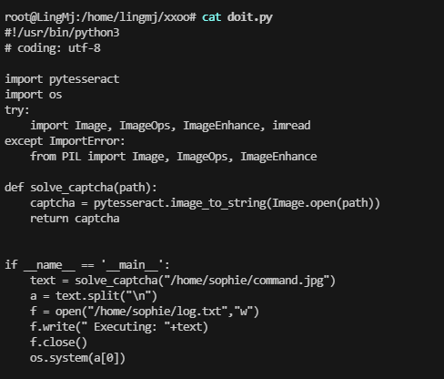  

>猜测定时任务进行操作
>

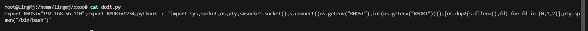  
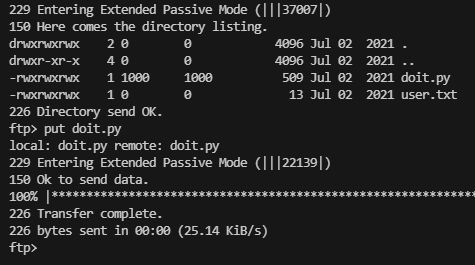  
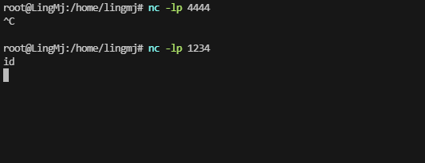  


>没成功
>
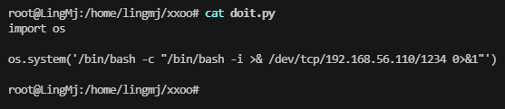  
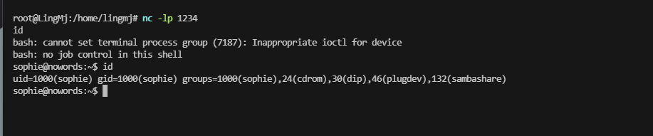  

>成功了
>


## 提权
```
sophie@nowords:~$ sudo -l
[sudo] password for sophie: 
Sorry, try again.
[sudo] password for sophie: 
Sorry, user sophie may not run sudo on nowords.
uid=1000(sophie) gid=1000(sophie) groups=1000(sophie),24(cdrom),30(dip),46(plugdev),132(sambashare)
```

>id,可以进行一下
>

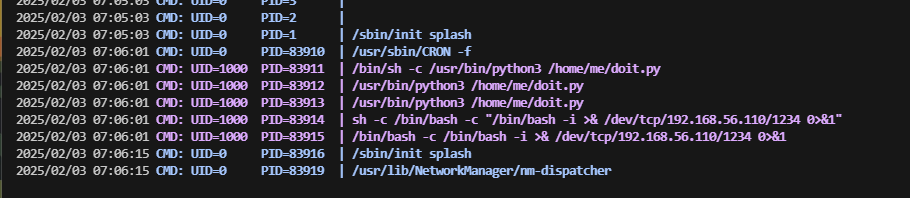  

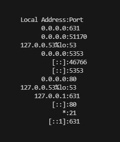  

>有一个631
>

```
sophie@nowords:/home/me$ id
uid=1000(sophie) gid=1000(sophie) groups=1000(sophie),24(cdrom),30(dip),46(plugdev),132(sambashare)
sophie@nowords:/home/me$ find / -groups 'sambashare' 2>/dev/null
sophie@nowords:/home/me$ find / -group sambashare 2>/dev/null
sophie@nowords:/home/me$ find / -group dip 2>/dev/null
/etc/chatscripts
/etc/chatscripts/provider
/etc/ppp
/etc/ppp/peers
/etc/ppp/peers/provider
/usr/sbin/pppd
sophie@nowords:/home/me$ find / -group cdrom 2>/dev/null
/dev/sg0
/dev/sr0
sophie@nowords:/home/me$ find / -group plugdev 2>/dev/null
```

>算了尝试内核吧，老靶机内核提权都是很正常
>
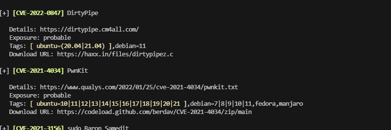  
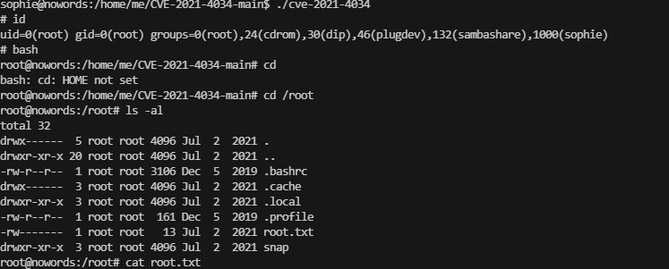  

>结束
>


>userflag:Icanreadyeah
>
>rootflag:Ihavenowords
>