## 网段扫描
```
root@LingMj:/home/lingmj/xxoo# arp-scan -l
Interface: eth0, type: EN10MB, MAC: 00:0c:29:df:e2:a7, IPv4: 192.168.56.110
Starting arp-scan 1.10.0 with 256 hosts (https://github.com/royhills/arp-scan)
192.168.56.1    0a:00:27:00:00:13       (Unknown: locally administered)
192.168.56.100  08:00:27:fd:61:55       PCS Systemtechnik GmbH
192.168.56.129  08:00:27:6a:2f:23       PCS Systemtechnik GmbH

3 packets received by filter, 0 packets dropped by kernel
Ending arp-scan 1.10.0: 256 hosts scanned in 2.389 seconds (107.16 hosts/sec). 3 responded
```

## 端口扫描

```
root@LingMj:/home/lingmj/xxoo# nmap -p- -sC -sV 192.168.56.129           
Starting Nmap 7.94SVN ( https://nmap.org ) at 2025-02-03 05:09 EST
mass_dns: warning: Unable to determine any DNS servers. Reverse DNS is disabled. Try using --system-dns or specify valid servers with --dns-servers
Nmap scan report for 192.168.56.129
Host is up (0.0081s latency).
Not shown: 65533 closed tcp ports (reset)
PORT   STATE SERVICE VERSION
22/tcp open  ssh     OpenSSH 9.2p1 Debian 2+deb12u3 (protocol 2.0)
| ssh-hostkey: 
|   256 21:a5:80:4d:e9:b6:f0:db:71:4d:30:a0:69:3a:c5:0e (ECDSA)
|_  256 40:90:68:70:66:eb:f2:6c:f4:ca:f5:be:36:82:d0:72 (ED25519)
80/tcp open  http    Apache httpd 2.4.62 ((Debian))
|_http-title: Apache2 Debian Default Page: It works
|_http-server-header: Apache/2.4.62 (Debian)
MAC Address: 08:00:27:6A:2F:23 (Oracle VirtualBox virtual NIC)
Service Info: OS: Linux; CPE: cpe:/o:linux:linux_kernel

Service detection performed. Please report any incorrect results at https://nmap.org/submit/ .
Nmap done: 1 IP address (1 host up) scanned in 31.93 seconds
```

## 获取webshell
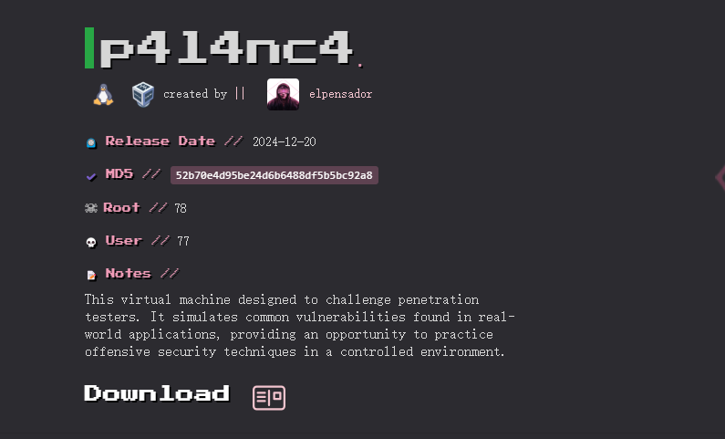  
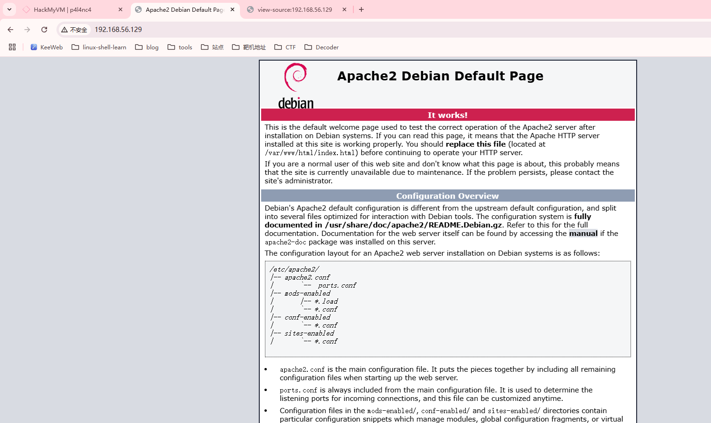  
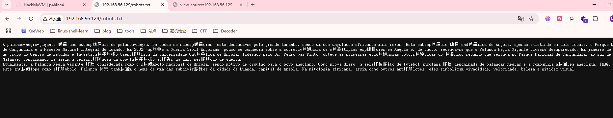  
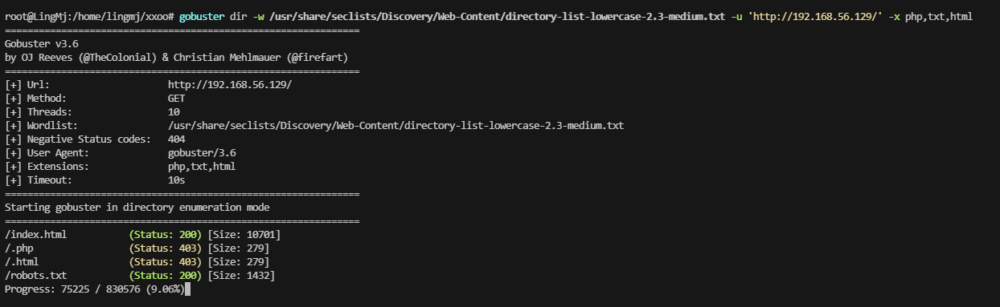  

```
A palanca-negra-gigante é uma subespécie de palanca-negra. De todas as subespécies, esta destaca-se pelo grande tamanho, sendo um dos ungulados africanos mais raros. Esta subespécie é endémica de Angola, apenas existindo em dois locais, o Parque Nacional de Cangandala e a Reserva Natural Integral de Luando. Em 2002, após a Guerra Civil Angolana, pouco se conhecia sobre a sobrevivência de múltiplas espécies em Angola e, de facto, receava-se que a Palanca Negra Gigante tivesse desaparecido. Em janeiro de 2004, um grupo do Centro de Estudos e Investigação Científica da Universidade Católica de Angola, liderado pelo Dr. Pedro vaz Pinto, obteve as primeiras evidências fotográficas do único rebanho que restava no Parque Nacional de Cangandala, ao sul de Malanje, confirmando-se assim a persistência da população após um duro período de guerra.
Atualmente, a Palanca Negra Gigante é considerada como o símbolo nacional de Angola, sendo motivo de orgulho para o povo angolano. Como prova disso, a seleção de futebol angolana é denominada de palancas-negras e a companhia aérea angolana, TAAG, tem este antílope como símbolo. Palanca é também o nome de uma das subdivisões da cidade de Luanda, capital de Angola. Na mitologia africana, assim como outros antílopes, eles simbolizam vivacidade, velocidade, beleza e nitidez visual
```
```
cat dir|sed 's/i/1/g'|sed 's/l/1/g'|sed 's/a/4/g'|sed 's/e/3/g' > dir1
cat dir1|sort|uniq|tr 'A-Z' 'a-z'|sed 's/-/\n/g' > dir2
```


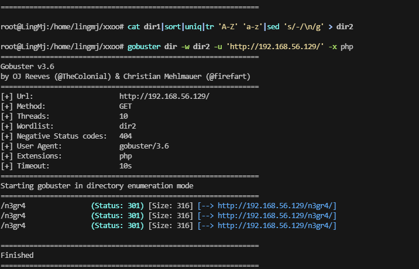  
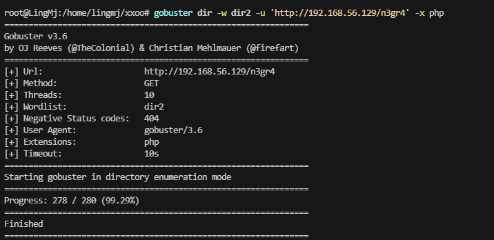  
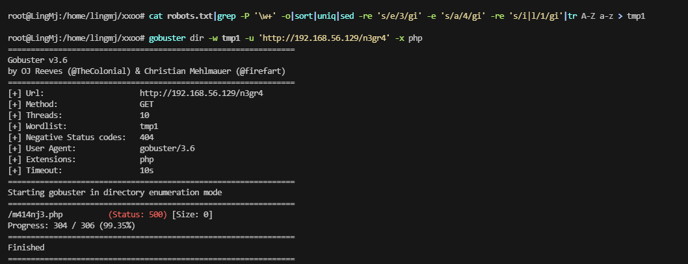  

>大题过滤就是这样，是一个500的php，wfuzz一下吧
>

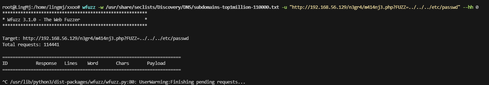  

>没成功怀疑不是LFI，感觉是直接命令执行
>
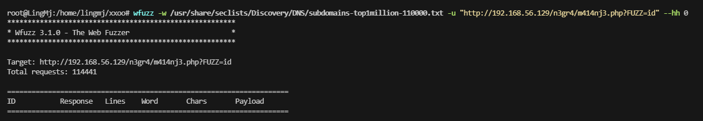  

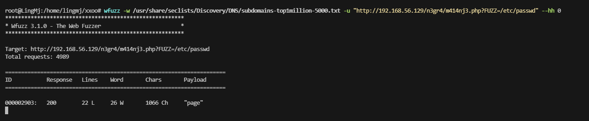  

>去掉目录穿越就出来
>
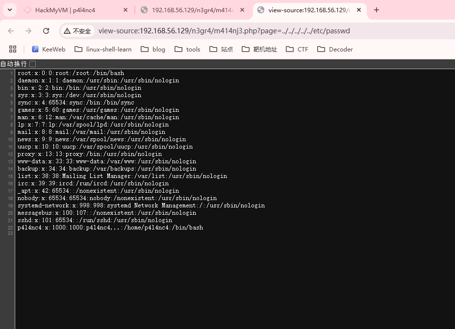  

>只能说字典太大的问题
>
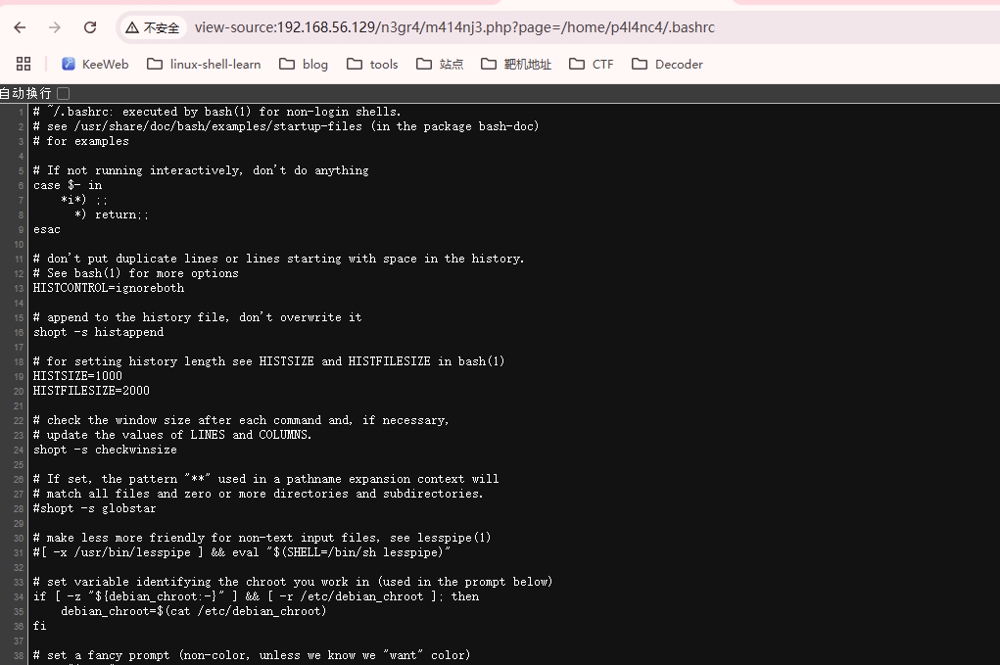  
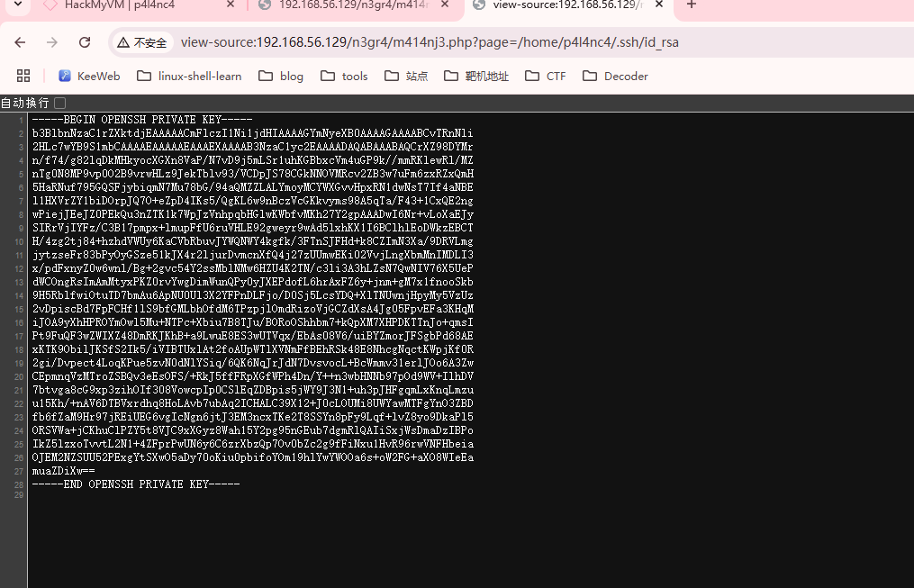  
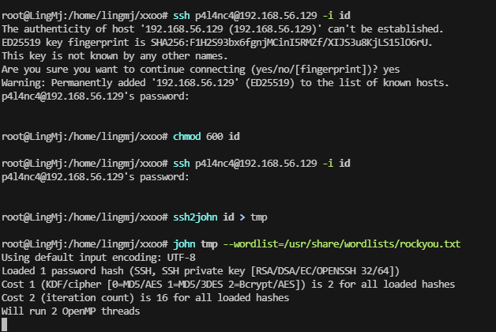  
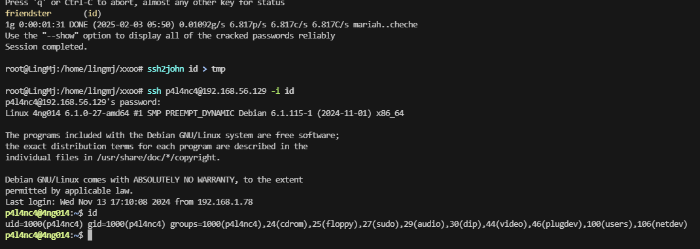  


## 提权
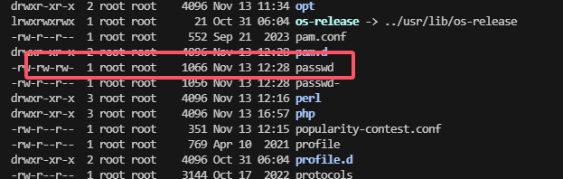  
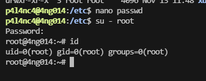  

>结束

>userflag:HMV{4c3b9d0468240fbd4a9148c8559600fe2f9ad727}
>
>rootflag:HMV{4c3b9d0468240fbd4a9148c8559600fe2f9ad727}
>