## 网段扫描
```
root@LingMj:/home/lingmj/xxoo1# arp-scan -l
Interface: eth0, type: EN10MB, MAC: 00:0c:29:df:e2:a7, IPv4: 192.168.56.110
Starting arp-scan 1.10.0 with 256 hosts (https://github.com/royhills/arp-scan)
192.168.56.1    0a:00:27:00:00:13       (Unknown: locally administered)
192.168.56.100  08:00:27:cd:6d:19       PCS Systemtechnik GmbH
192.168.56.132  08:00:27:52:21:f4       PCS Systemtechnik GmbH

3 packets received by filter, 0 packets dropped by kernel
Ending arp-scan 1.10.0: 256 hosts scanned in 2.232 seconds (114.70 hosts/sec). 3 responded
```

## 端口扫描

```
root@LingMj:/home/lingmj/xxoo1# nmap -p- -sC -sV 192.168.56.132
Starting Nmap 7.94SVN ( https://nmap.org ) at 2025-02-04 01:02 EST
mass_dns: warning: Unable to determine any DNS servers. Reverse DNS is disabled. Try using --system-dns or specify valid servers with --dns-servers
Nmap scan report for 192.168.56.132
Host is up (0.0010s latency).
Not shown: 65532 closed tcp ports (reset)
PORT   STATE SERVICE VERSION
21/tcp open  ftp     vsftpd 3.0.3
| ftp-syst: 
|   STAT: 
| FTP server status:
|      Connected to ::ffff:192.168.56.110
|      Logged in as ftp
|      TYPE: ASCII
|      No session bandwidth limit
|      Session timeout in seconds is 300
|      Control connection is plain text
|      Data connections will be plain text
|      At session startup, client count was 3
|      vsFTPd 3.0.3 - secure, fast, stable
|_End of status
| ftp-anon: Anonymous FTP login allowed (FTP code 230)
|_drwxr-xr--    2 1001     33           4096 Oct 19  2020 html
22/tcp open  ssh     OpenSSH 7.9p1 Debian 10+deb10u2 (protocol 2.0)
| ssh-hostkey: 
|   2048 09:0e:11:1f:72:0e:6c:10:18:55:1a:73:a5:4b:e5:64 (RSA)
|   256 c0:9f:66:34:56:1d:16:4a:32:ad:25:0c:8b:a0:1b:5a (ECDSA)
|_  256 4c:95:57:f4:38:a3:ce:ae:f0:e2:a6:d9:71:42:07:c5 (ED25519)
80/tcp open  http    nginx 1.14.2
|_http-title: Site doesn't have a title (text/html).
|_http-server-header: nginx/1.14.2
MAC Address: 08:00:27:52:21:F4 (Oracle VirtualBox virtual NIC)
Service Info: OSs: Unix, Linux; CPE: cpe:/o:linux:linux_kernel

Service detection performed. Please report any incorrect results at https://nmap.org/submit/ .
Nmap done: 1 IP address (1 host up) scanned in 18.71 seconds
```

## 获取webshell
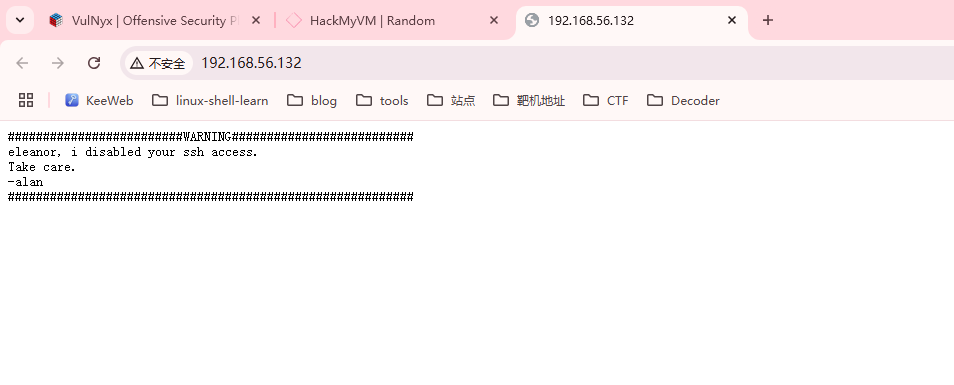  
  

>alan好像是用户，但是ssh不能用目前来看，还有一个是eleanor
>
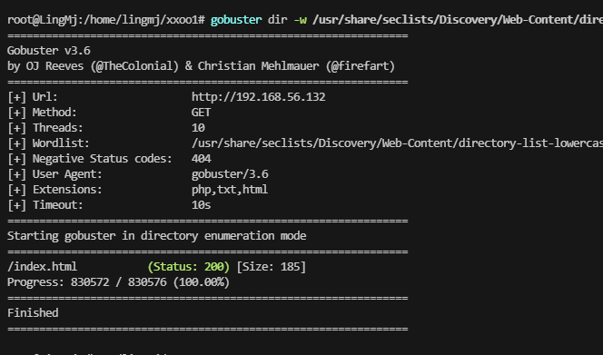  

>无其他信息选择爆破密码
>

```
root@LingMj:/home/lingmj# ftp 192.168.56.132  
Connected to 192.168.56.132.
220 (vsFTPd 3.0.3)
Name (192.168.56.132:lingmj): anonymous
331 Please specify the password.
Password: 
230 Login successful.
Remote system type is UNIX.
Using binary mode to transfer files.
ftp> ls
229 Entering Extended Passive Mode (|||36548|)
150 Here comes the directory listing.
drwxr-xr--    2 1001     33           4096 Oct 19  2020 html
226 Directory send OK.
ftp> cd html
550 Failed to change directory.
ftp> get html
local: html remote: html
229 Entering Extended Passive Mode (|||44797|)
550 Failed to open file.
ftp> 
```

>根据提示可以看到alan禁用了eleanor的ssh,所以爆破情况只能爆破ftp
>

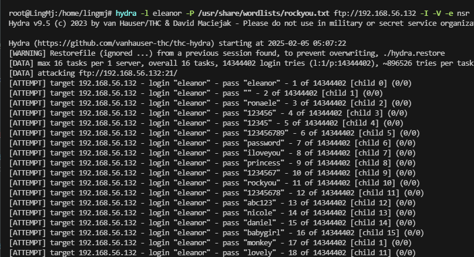  
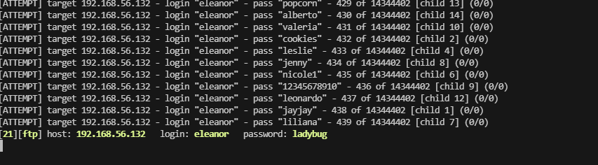  

>500的位置奥
>


```
root@LingMj:/home/lingmj# ftp 192.168.56.132 
Connected to 192.168.56.132.
220 (vsFTPd 3.0.3)
Name (192.168.56.132:lingmj): eleanor
331 Please specify the password.
Password: 
230 Login successful.
Remote system type is UNIX.
Using binary mode to transfer files.
ftp> ls -al
229 Entering Extended Passive Mode (|||42238|)
150 Here comes the directory listing.
drwxr-xr-x    3 0        113          4096 Oct 19  2020 .
drwxr-xr-x    3 0        113          4096 Oct 19  2020 ..
drwxr-xr--    2 1001     33           4096 Oct 19  2020 html
226 Directory send OK.
ftp> cd html
250 Directory successfully changed.
ftp> ls -al
229 Entering Extended Passive Mode (|||64346|)
150 Here comes the directory listing.
drwxr-xr--    2 1001     33           4096 Oct 19  2020 .
drwxr-xr-x    3 0        113          4096 Oct 19  2020 ..
-rw-r--r--    1 33       33            185 Oct 19  2020 index.html
226 Directory send OK.
ftp> put rrr
local: rrr remote: rrr
ftp: Can't open `rrr': No such file or directory
ftp> exit
221 Goodbye.
                                                                                                                                                                                                                
root@LingMj:/home/lingmj# cd xxoo1
                                                                                                                                                                                                                
root@LingMj:/home/lingmj/xxoo1# ftp 192.168.56.132
Connected to 192.168.56.132.
220 (vsFTPd 3.0.3)
Name (192.168.56.132:lingmj): eleanor
331 Please specify the password.
Password: 
230 Login successful.
Remote system type is UNIX.
Using binary mode to transfer files.
ftp> put wp-load.php
local: wp-load.php remote: wp-load.php
229 Entering Extended Passive Mode (|||40635|)
550 Permission denied.
ftp> ls
229 Entering Extended Passive Mode (|||32808|)
150 Here comes the directory listing.
drwxr-xr--    2 1001     33           4096 Oct 19  2020 html
226 Directory send OK.
ftp> 
```


>不行不能上传只有get，index.html,就是页面没法进行getshell
>

```
root@LingMj:/home/lingmj/xxoo1# ssh eleanor@192.168.56.132
eleanor@192.168.56.132's password: 
This service allows sftp connections only.
Connection to 192.168.56.132 closed.
                                                                                                                                                                                                                
root@LingMj:/home/lingmj/xxoo1# 
```

>只允许sftp进行服务操作
>

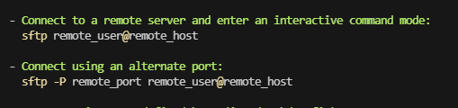  

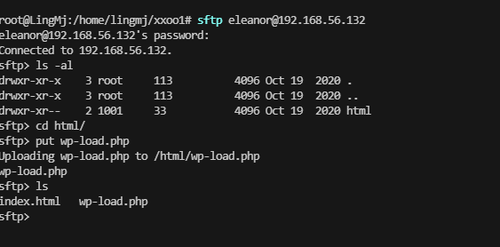  

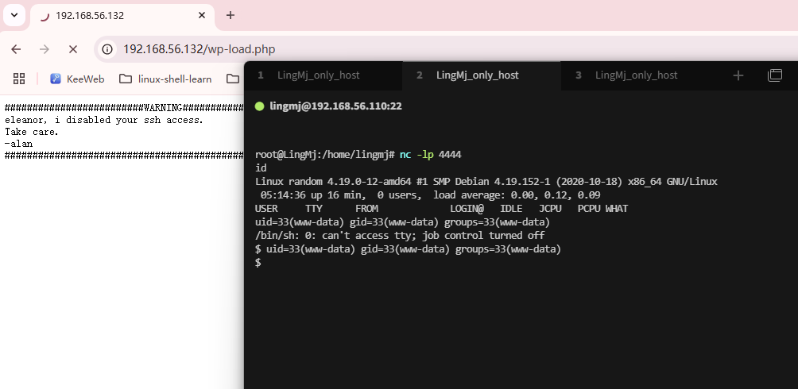  


## 提权
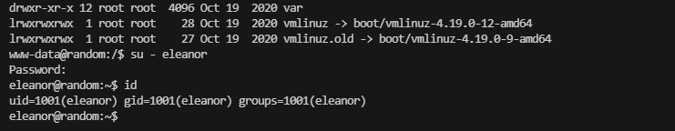  

>这样可以登录密码
>

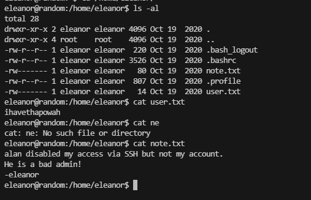  
  
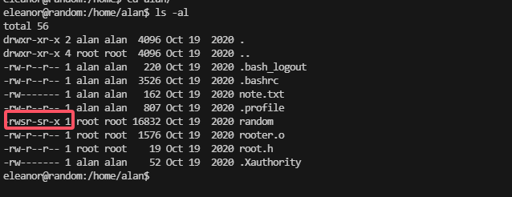  

>有一个suid权限的文件，逆向看看
>

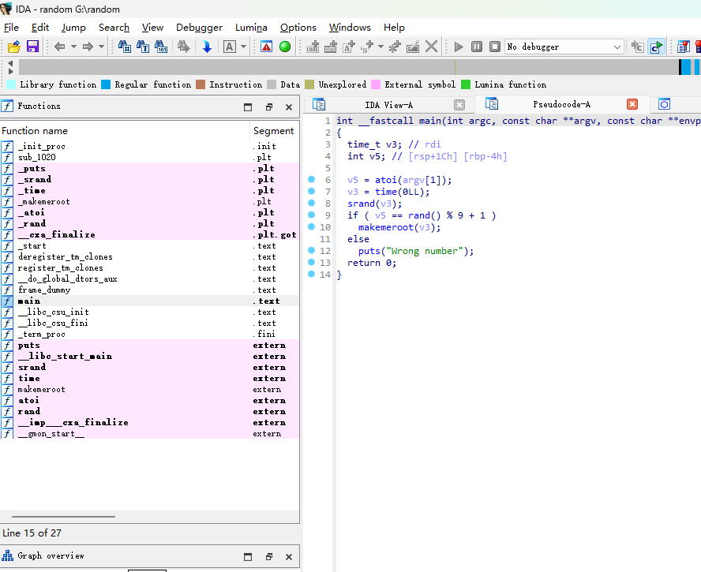  

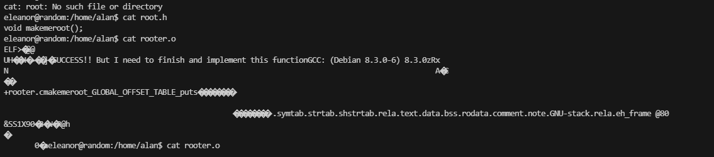  
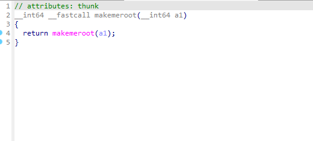  
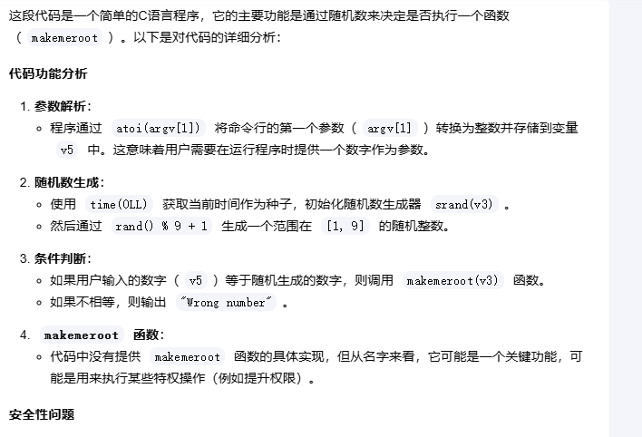  


>这里说明了一件是就是当我们猜到他输入的random值就会返回函数内容
>

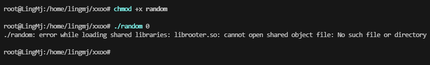  

>主机没有这个东西，去靶机测试
>

  

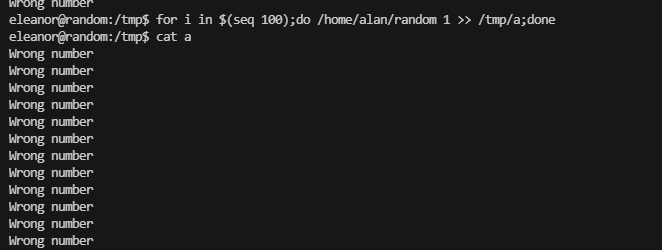  


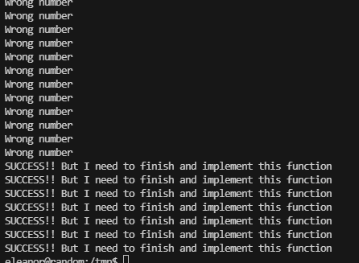  


>1-9范围所以0不行
>

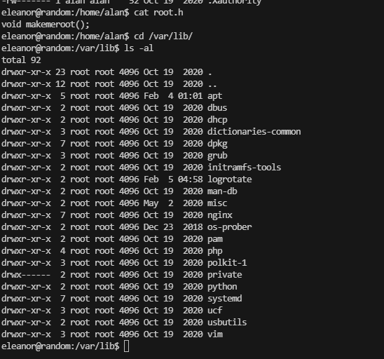  

>找到这个函数的位置改一下，目前是这个思路
>

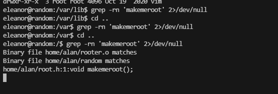  
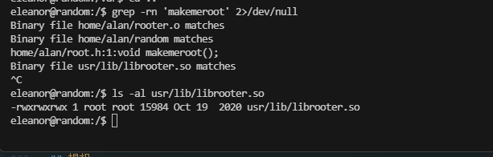  
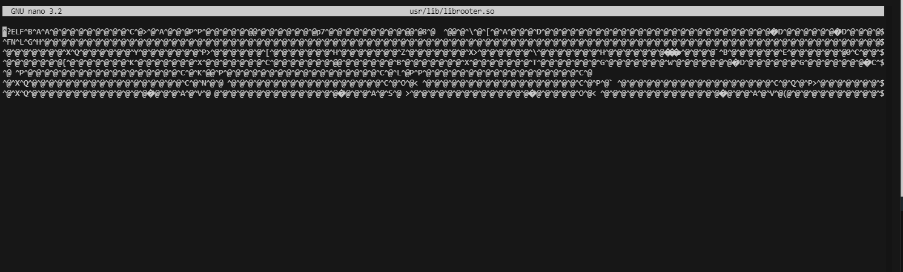  

>这个是写好的我应该在其他地方编辑好然后扔进去就你能成功了
>

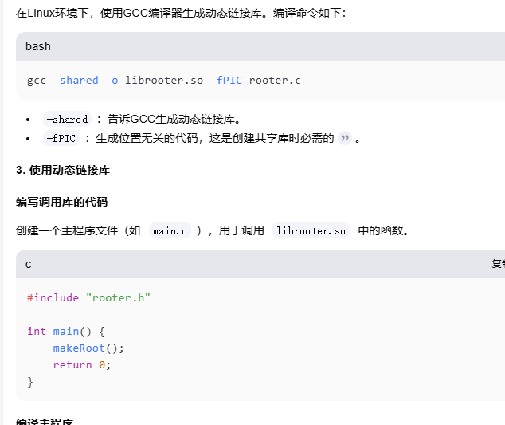  
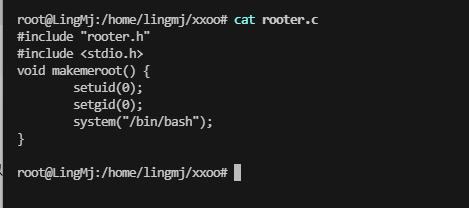  
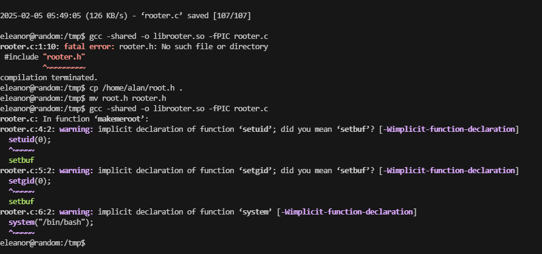  
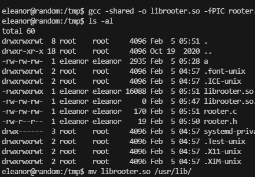  
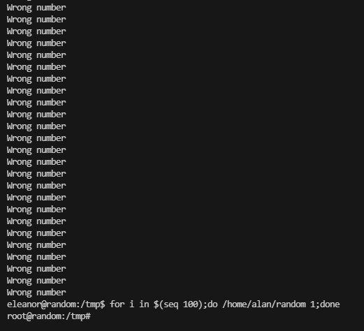  

>成功了，有意思，到这里就结束了这个靶场
>


>userflag:ihavethapowah
>
>rootflag:howiarrivedhere
>