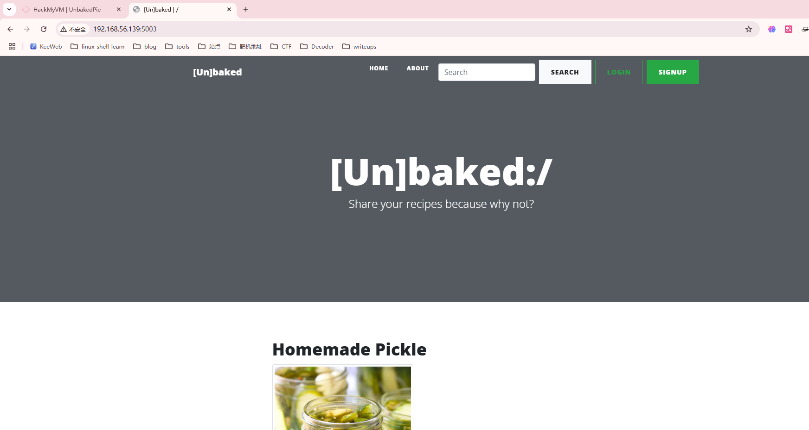
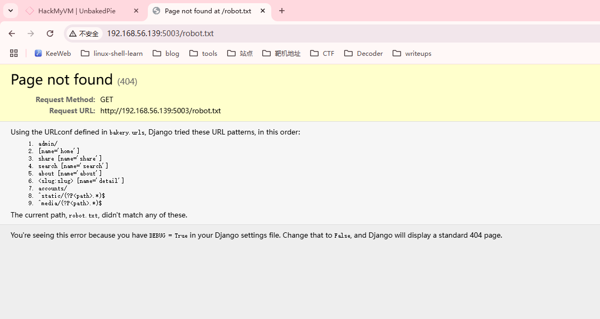
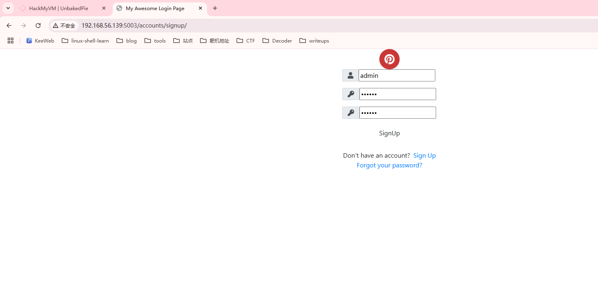
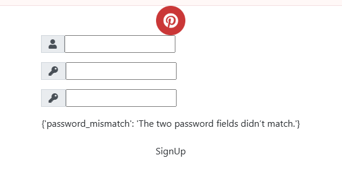
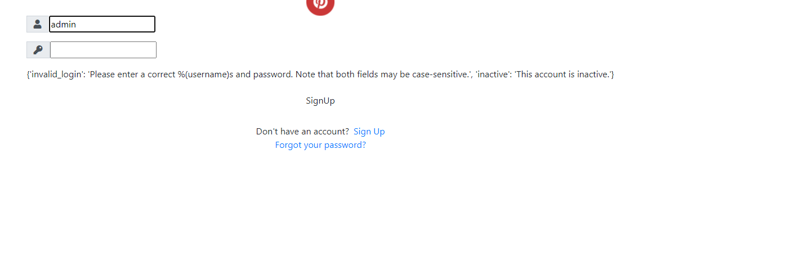
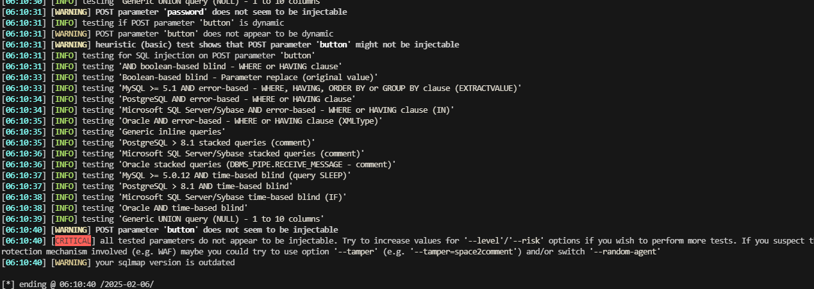
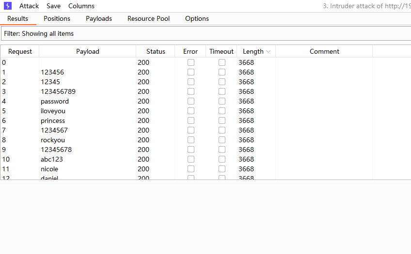
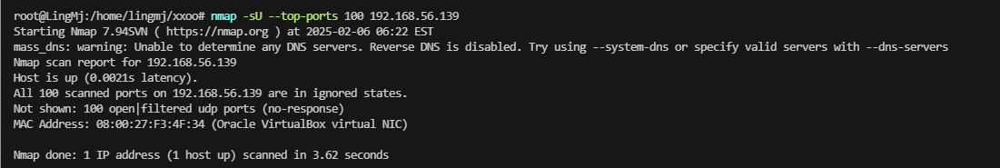

## 网段扫描
```
root@LingMj:/home/lingmj# arp-scan -l
Interface: eth0, type: EN10MB, MAC: 00:0c:29:df:e2:a7, IPv4: 192.168.56.110
WARNING: Cannot open MAC/Vendor file ieee-oui.txt: Permission denied
WARNING: Cannot open MAC/Vendor file mac-vendor.txt: Permission denied
Starting arp-scan 1.10.0 with 256 hosts (https://github.com/royhills/arp-scan)
192.168.56.1    0a:00:27:00:00:12       (Unknown: locally administered)
192.168.56.100  08:00:27:28:3f:b7       (Unknown)
192.168.56.139  08:00:27:f3:4f:34       (Unknown)

3 packets received by filter, 0 packets dropped by kernel
Ending arp-scan 1.10.0: 256 hosts scanned in 1.839 seconds (139.21 hosts/sec). 3 responded
```

## 端口扫描

```
root@LingMj:/home/lingmj# nmap -p- -sC -sV 192.168.56.139
Starting Nmap 7.94SVN ( https://nmap.org ) at 2025-02-06 05:44 EST
mass_dns: warning: Unable to determine any DNS servers. Reverse DNS is disabled. Try using --system-dns or specify valid servers with --dns-servers
Nmap scan report for 192.168.56.139
Host is up (0.0010s latency).
Not shown: 65534 filtered tcp ports (no-response)
PORT     STATE SERVICE    VERSION
5003/tcp open  filemaker?
| fingerprint-strings: 
|   GetRequest: 
|     HTTP/1.1 200 OK
|     Date: Thu, 06 Feb 2025 10:56:59 GMT
|     Server: WSGIServer/0.2 CPython/3.8.6
|     Content-Type: text/html; charset=utf-8
|     X-Frame-Options: DENY
|     Vary: Cookie
|     Content-Length: 7453
|     X-Content-Type-Options: nosniff
|     Referrer-Policy: same-origin
|     Set-Cookie: csrftoken=LWNN6efMtabWVjyGCT0Zv6szeJQEzRJDFOVi0A6rDffJ0O4cGVllNGNlNIGIX43L; expires=Thu, 05 Feb 2026 10:56:59 GMT; Max-Age=31449600; Path=/; SameSite=Lax
|     <!DOCTYPE html>
|     <html lang="en">
|     <head>
|     <meta charset="utf-8">
|     <meta name="viewport" content="width=device-width, initial-scale=1, shrink-to-fit=no">
|     <meta name="description" content="">
|     <meta name="author" content="">
|     <title>[Un]baked | /</title>
|     <!-- Bootstrap core CSS -->
|     <link href="/static/vendor/bootstrap/css/bootstrap.min.css" rel="stylesheet">
|     <!-- Custom fonts for this template -->
|     <link href="/static/vendor/fontawesome-free/css/all.min.cs
|   HTTPOptions: 
|     HTTP/1.1 200 OK
|     Date: Thu, 06 Feb 2025 10:57:00 GMT
|     Server: WSGIServer/0.2 CPython/3.8.6
|     Content-Type: text/html; charset=utf-8
|     X-Frame-Options: DENY
|     Vary: Cookie
|     Content-Length: 7453
|     X-Content-Type-Options: nosniff
|     Referrer-Policy: same-origin
|     Set-Cookie: csrftoken=H3xKIBwqq9jHjMA0CxWdmYPOGcKaX55Ouspm6ttj44zN0FWBkMaxok35AA44Wuig; expires=Thu, 05 Feb 2026 10:57:00 GMT; Max-Age=31449600; Path=/; SameSite=Lax
|     <!DOCTYPE html>
|     <html lang="en">
|     <head>
|     <meta charset="utf-8">
|     <meta name="viewport" content="width=device-width, initial-scale=1, shrink-to-fit=no">
|     <meta name="description" content="">
|     <meta name="author" content="">
|     <title>[Un]baked | /</title>
|     <!-- Bootstrap core CSS -->
|     <link href="/static/vendor/bootstrap/css/bootstrap.min.css" rel="stylesheet">
|     <!-- Custom fonts for this template -->
|_    <link href="/static/vendor/fontawesome-free/css/all.min.cs
1 service unrecognized despite returning data. If you know the service/version, please submit the following fingerprint at https://nmap.org/cgi-bin/submit.cgi?new-service :
SF-Port5003-TCP:V=7.94SVN%I=7%D=2/6%Time=67A4957D%P=x86_64-pc-linux-gnu%r(
SF:GetRequest,1EC5,"HTTP/1\.1\x20200\x20OK\r\nDate:\x20Thu,\x2006\x20Feb\x
SF:202025\x2010:56:59\x20GMT\r\nServer:\x20WSGIServer/0\.2\x20CPython/3\.8
SF:\.6\r\nContent-Type:\x20text/html;\x20charset=utf-8\r\nX-Frame-Options:
SF:\x20DENY\r\nVary:\x20Cookie\r\nContent-Length:\x207453\r\nX-Content-Typ
SF:e-Options:\x20nosniff\r\nReferrer-Policy:\x20same-origin\r\nSet-Cookie:
SF:\x20\x20csrftoken=LWNN6efMtabWVjyGCT0Zv6szeJQEzRJDFOVi0A6rDffJ0O4cGVllN
SF:GNlNIGIX43L;\x20expires=Thu,\x2005\x20Feb\x202026\x2010:56:59\x20GMT;\x
SF:20Max-Age=31449600;\x20Path=/;\x20SameSite=Lax\r\n\r\n\n<!DOCTYPE\x20ht
SF:ml>\n<html\x20lang=\"en\">\n\n<head>\n\n\x20\x20<meta\x20charset=\"utf-
SF:8\">\n\x20\x20<meta\x20name=\"viewport\"\x20content=\"width=device-widt
SF:h,\x20initial-scale=1,\x20shrink-to-fit=no\">\n\x20\x20<meta\x20name=\"
SF:description\"\x20content=\"\">\n\x20\x20<meta\x20name=\"author\"\x20con
SF:tent=\"\">\n\n\x20\x20<title>\[Un\]baked\x20\|\x20/</title>\n\n\x20\x20
SF:<!--\x20Bootstrap\x20core\x20CSS\x20-->\n\x20\x20<link\x20href=\"/stati
SF:c/vendor/bootstrap/css/bootstrap\.min\.css\"\x20rel=\"stylesheet\">\n\n
SF:\x20\x20<!--\x20Custom\x20fonts\x20for\x20this\x20template\x20-->\n\x20
SF:\x20<link\x20href=\"/static/vendor/fontawesome-free/css/all\.min\.cs")%
SF:r(HTTPOptions,1EC5,"HTTP/1\.1\x20200\x20OK\r\nDate:\x20Thu,\x2006\x20Fe
SF:b\x202025\x2010:57:00\x20GMT\r\nServer:\x20WSGIServer/0\.2\x20CPython/3
SF:\.8\.6\r\nContent-Type:\x20text/html;\x20charset=utf-8\r\nX-Frame-Optio
SF:ns:\x20DENY\r\nVary:\x20Cookie\r\nContent-Length:\x207453\r\nX-Content-
SF:Type-Options:\x20nosniff\r\nReferrer-Policy:\x20same-origin\r\nSet-Cook
SF:ie:\x20\x20csrftoken=H3xKIBwqq9jHjMA0CxWdmYPOGcKaX55Ouspm6ttj44zN0FWBkM
SF:axok35AA44Wuig;\x20expires=Thu,\x2005\x20Feb\x202026\x2010:57:00\x20GMT
SF:;\x20Max-Age=31449600;\x20Path=/;\x20SameSite=Lax\r\n\r\n\n<!DOCTYPE\x2
SF:0html>\n<html\x20lang=\"en\">\n\n<head>\n\n\x20\x20<meta\x20charset=\"u
SF:tf-8\">\n\x20\x20<meta\x20name=\"viewport\"\x20content=\"width=device-w
SF:idth,\x20initial-scale=1,\x20shrink-to-fit=no\">\n\x20\x20<meta\x20name
SF:=\"description\"\x20content=\"\">\n\x20\x20<meta\x20name=\"author\"\x20
SF:content=\"\">\n\n\x20\x20<title>\[Un\]baked\x20\|\x20/</title>\n\n\x20\
SF:x20<!--\x20Bootstrap\x20core\x20CSS\x20-->\n\x20\x20<link\x20href=\"/st
SF:atic/vendor/bootstrap/css/bootstrap\.min\.css\"\x20rel=\"stylesheet\">\
SF:n\n\x20\x20<!--\x20Custom\x20fonts\x20for\x20this\x20template\x20-->\n\
SF:x20\x20<link\x20href=\"/static/vendor/fontawesome-free/css/all\.min\.cs
SF:");
MAC Address: 08:00:27:F3:4F:34 (Oracle VirtualBox virtual NIC)

Service detection performed. Please report any incorrect results at https://nmap.org/submit/ .
Nmap done: 1 IP address (1 host up) scanned in 829.24 seconds
```

## 获取webshell
  
  
  
  

>测测数据库
>
  
  

>无sql注入，爆破了
>
  

>无看看有啥其他东西没找到吧
>

  

>无想法搁置一下，换一个打
>


## 提权


>userflag:
>
>rootflag:
>
