## 网段扫描
```                                      
root@LingMj:/home/lingmj# arp-scan -l
Interface: eth0, type: EN10MB, MAC: 00:0c:29:df:e2:a7, IPv4: 192.168.56.110
WARNING: Cannot open MAC/Vendor file ieee-oui.txt: Permission denied
WARNING: Cannot open MAC/Vendor file mac-vendor.txt: Permission denied
Starting arp-scan 1.10.0 with 256 hosts (https://github.com/royhills/arp-scan)
192.168.56.1    0a:00:27:00:00:12       (Unknown: locally administered)
192.168.56.100  08:00:27:0a:12:7f       (Unknown)
192.168.56.162  08:00:27:91:56:86       (Unknown)

5 packets received by filter, 0 packets dropped by kernel
Ending arp-scan 1.10.0: 256 hosts scanned in 1.865 seconds (137.27 hosts/sec). 3 responded
```

## 端口扫描

```
root@LingMj:/home/lingmj# nmap -p- -sC -sV 192.168.56.162
Starting Nmap 7.95 ( https://nmap.org ) at 2025-02-22 21:57 EST
mass_dns: warning: Unable to determine any DNS servers. Reverse DNS is disabled. Try using --system-dns or specify valid servers with --dns-servers
Nmap scan report for 192.168.56.162
Host is up (0.0015s latency).
Not shown: 65532 closed tcp ports (reset)
PORT     STATE SERVICE VERSION
22/tcp   open  ssh     OpenSSH 7.9p1 Debian 10+deb10u2 (protocol 2.0)
| ssh-hostkey: 
|   2048 93:a4:92:55:72:2b:9b:4a:52:66:5c:af:a9:83:3c:fd (RSA)
|   256 1e:a7:44:0b:2c:1b:0d:77:83:df:1d:9f:0e:30:08:4d (ECDSA)
|_  256 d0:fa:9d:76:77:42:6f:91:d3:bd:b5:44:72:a7:c9:71 (ED25519)
80/tcp   open  http    Apache httpd 2.4.59 ((Debian))
|_http-title: Don't Hack Me
|_http-server-header: Apache/2.4.59 (Debian)
6666/tcp open  irc?
|_irc-info: Unable to open connection
1 service unrecognized despite returning data. If you know the service/version, please submit the following fingerprint at https://nmap.org/cgi-bin/submit.cgi?new-service :
SF-Port6666-TCP:V=7.95%I=7%D=2/22%Time=67BA8EDE%P=x86_64-pc-linux-gnu%r(He
SF:lp,25,"\n\[!\]\x20\xe6\x8d\x95\xe8\x8e\xb7\xe4\xbf\xa1\xe5\x8f\xb7:\x20
SF:11\xef\xbc\x8c\xe6\x9c\x8d\xe5\x8a\xa1\xe7\xbb\x88\xe6\xad\xa2\n");
MAC Address: 08:00:27:91:56:86 (PCS Systemtechnik/Oracle VirtualBox virtual NIC)
Service Info: OS: Linux; CPE: cpe:/o:linux:linux_kernel

Service detection performed. Please report any incorrect results at https://nmap.org/submit/ .
Nmap done: 1 IP address (1 host up) scanned in 50.52 seconds
```

## 获取webshell
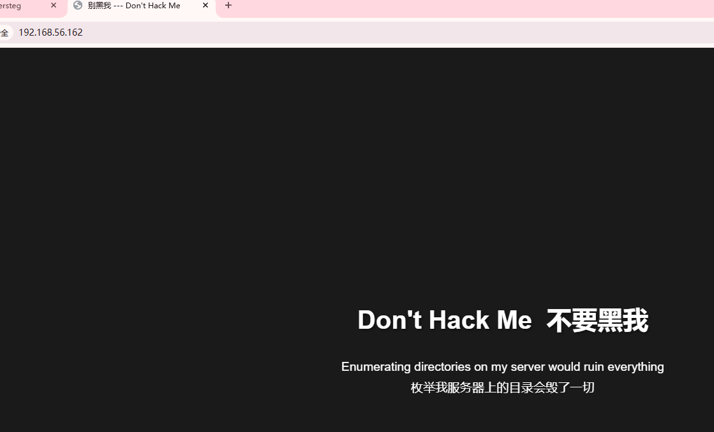  
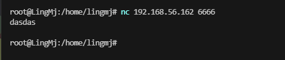  
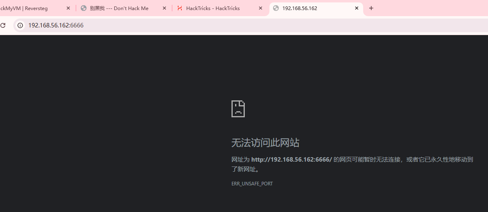  

>枚举目录么，我直接爆破一下吧，但好像测试服没加其他字典奥
>

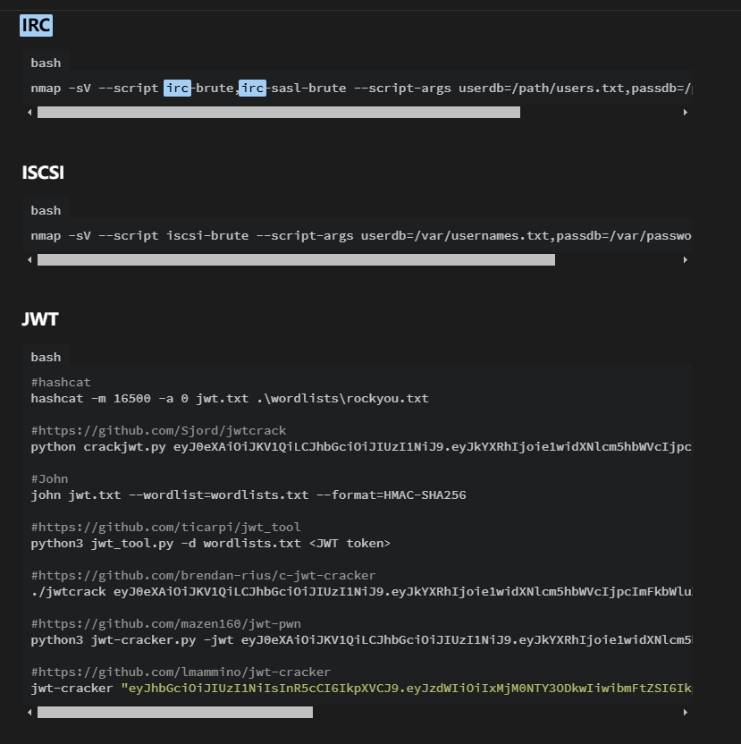  
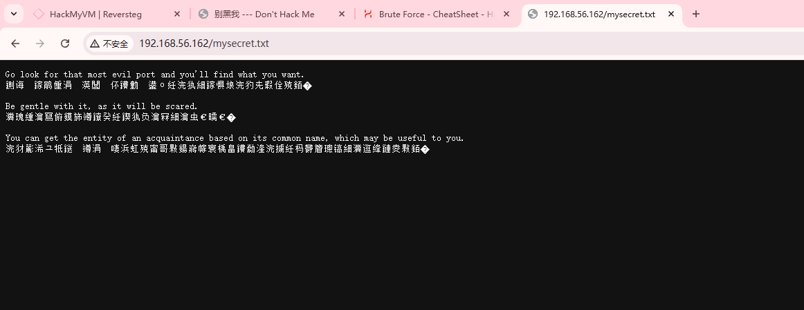  
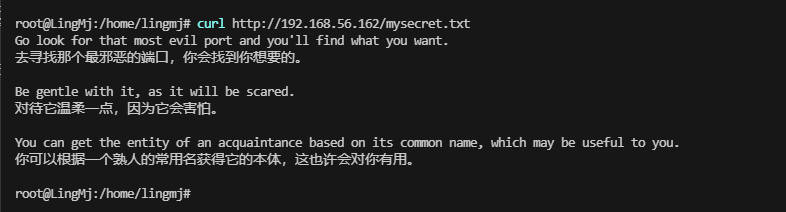  

>端口么？我只见一个6666还访问不了，他不能连接目前看
>

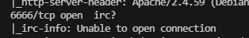  
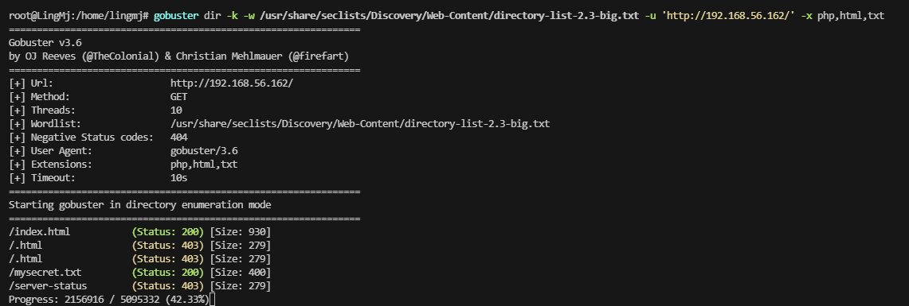  

>好像只能在6666这块花费功夫了
>

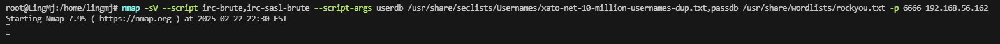  
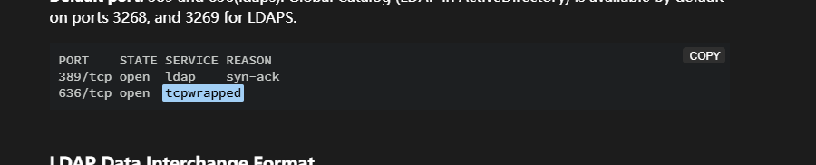  

>没想法，看来前面这个入口我得花点时间了
>

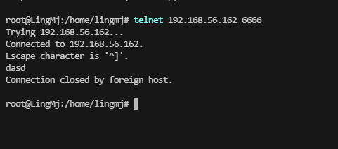  

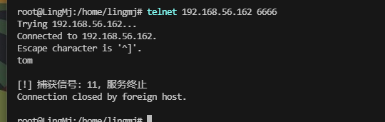  

>去看wp了，我把整个流程看了，现在自主复盘一下，我对于pwn部分实在是不会，所以只能这样了不过改找的信息都找了一下
>

  

>熟人嘛，无非就是一些群友或者群主，这里试过是群主
>

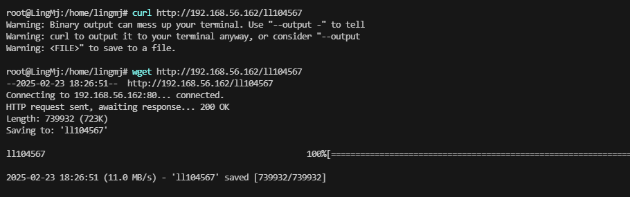  
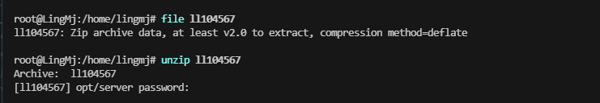  
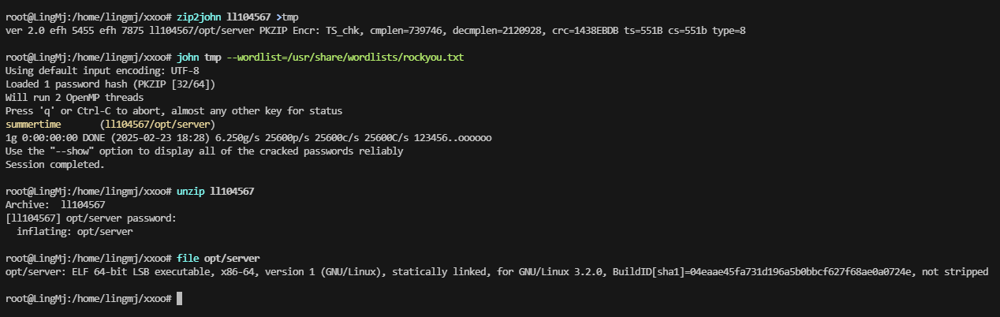  

>拖去ida，看看，它是一个c++的代码我看c的伪代码都费劲，更别说c++了不过大体逻辑还是知道就是不知道咋用
>
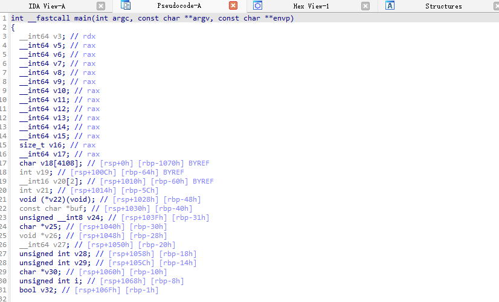  

>这里是一个函数的地方，判断等一就退出的好比它是禁用字符什么的
>
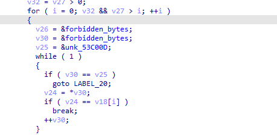  
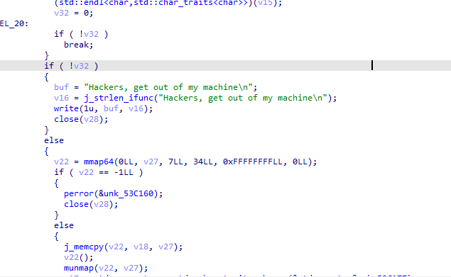  

>接下来就是函数调用
>

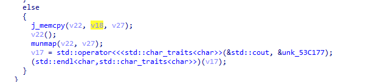  

>当你上面的通过会有一个v18的值进来传递到v22然后你就会调用v22完成函数
>

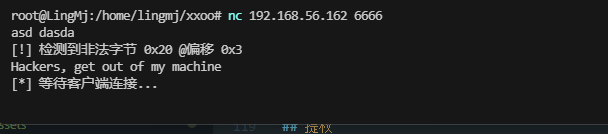  

>这里可以看到我输入空格被干掉了但是会进行客户端连接，只要写一个绕过这个空格的反弹shell的16进制就能shellcode，作者给了payload方案奥
>

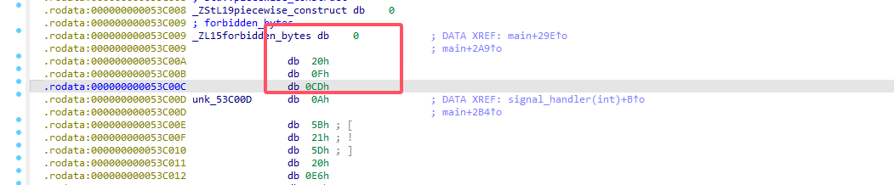  

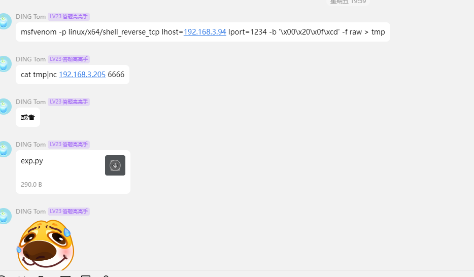  

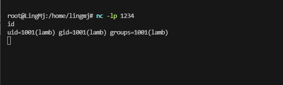  
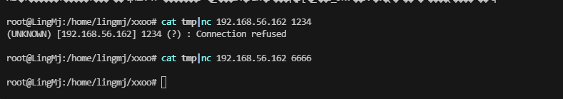  

## 提权

```
lamb@pwnding:~$ ./key 
54287lamb@pwnding:~$ cat note.txt 
There is only one way to become ROOT, which is to execute getroot!!!
成为ROOT的方法只有一条，就是执行 getroot !!!
lamb@pwnding:~$ cat this_is_a_tips.txt 
There is a fun tool called cupp.
Are there really people that stupid these days? haha.

有一个很好玩的工具叫做 cupp.
现在真的还会有人这么蠢吗？haha
```

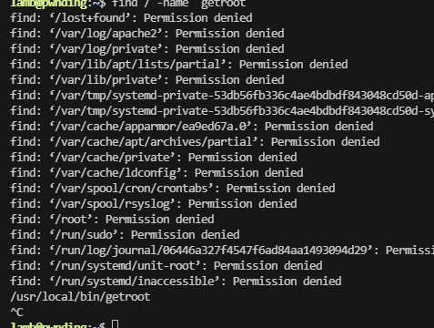  

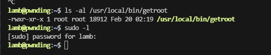  

>找密码吧上面有一个cupp的提示
>

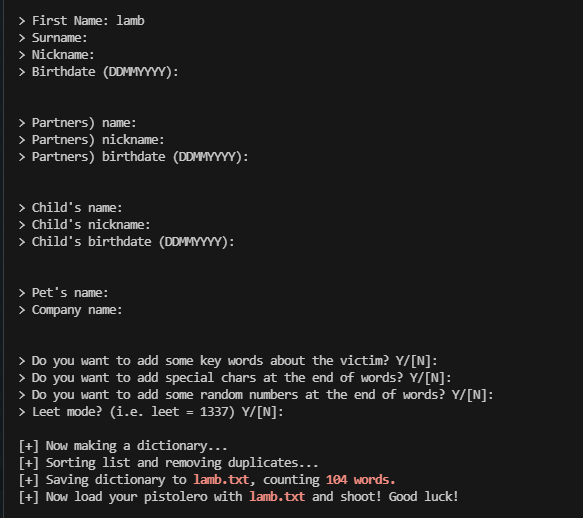  
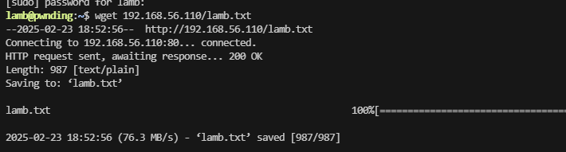  

>我的suforce用不了我用的是sucrack的密码爆破形式
>

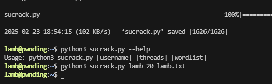  

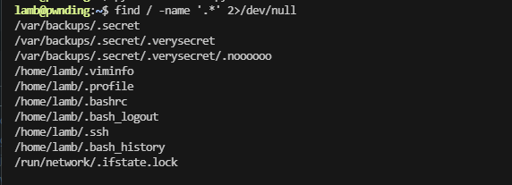  

>存在隐藏文件所以可以去利用一手
>

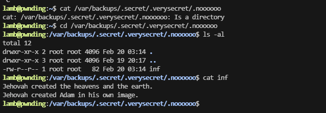  
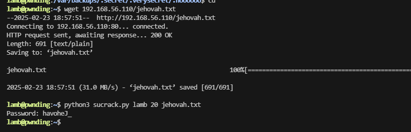  

>找到密码了
>

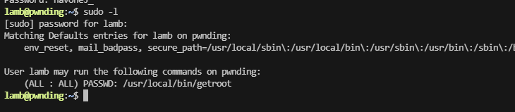  
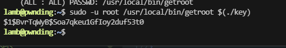  
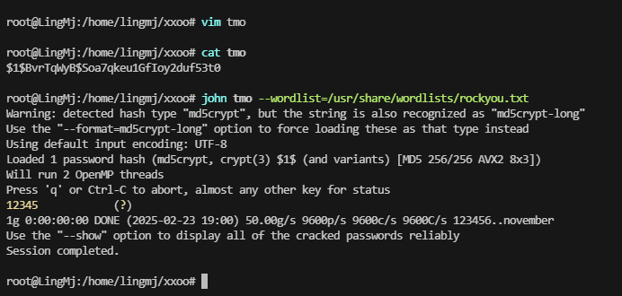  
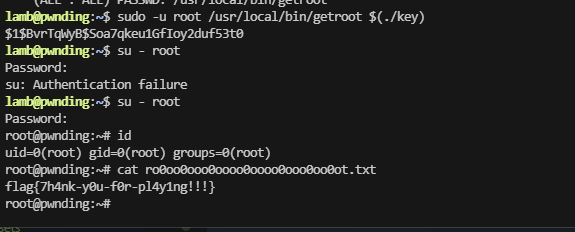  

>密码就是哈希值不是12345，好了结束是一个非常好的靶机感谢DING Tom的靶机制作与提供！！
>


>userflag:flag{祝你新的一年开开心心啊!}
>
>rootflag:flag{7h4nk-y0u-f0r-pl4y1ng!!!}
>