## 网段扫描
```
root@LingMj:/home/lingmj# arp-scan -l
Interface: eth0, type: EN10MB, MAC: 00:0c:29:df:e2:a7, IPv4: 192.168.56.110
WARNING: Cannot open MAC/Vendor file ieee-oui.txt: Permission denied
WARNING: Cannot open MAC/Vendor file mac-vendor.txt: Permission denied
Starting arp-scan 1.10.0 with 256 hosts (https://github.com/royhills/arp-scan)
192.168.56.1    0a:00:27:00:00:12       (Unknown: locally administered)
192.168.56.100  08:00:27:0a:12:7f       (Unknown)
192.168.56.161  08:00:27:a9:9e:c0       (Unknown)

3 packets received by filter, 0 packets dropped by kernel
Ending arp-scan 1.10.0: 256 hosts scanned in 1.886 seconds (135.74 hosts/sec). 3 responded
```

## 端口扫描

```
root@LingMj:/home/lingmj# nmap -p- -sC -sV 192.168.56.161
Starting Nmap 7.95 ( https://nmap.org ) at 2025-02-22 19:30 EST
Nmap scan report for 192.168.56.161
Host is up (0.0024s latency).
Not shown: 65533 closed tcp ports (reset)
PORT   STATE SERVICE VERSION
22/tcp open  ssh     OpenSSH 9.2p1 Debian 2+deb12u3 (protocol 2.0)
| ssh-hostkey: 
|   256 af:79:a1:39:80:45:fb:b7:cb:86:fd:8b:62:69:4a:64 (ECDSA)
|_  256 6d:d4:9d:ac:0b:f0:a1:88:66:b4:ff:f6:42:bb:f2:e5 (ED25519)
80/tcp open  http    Apache httpd 2.4.62 ((Debian))
|_http-title: Asignatura: Administraci\xC3\xB3n de Sistemas - Ingenier\xC3\xADa Inform\xC3\xA1...
|_http-server-header: Apache/2.4.62 (Debian)
MAC Address: 08:00:27:A9:9E:C0 (PCS Systemtechnik/Oracle VirtualBox virtual NIC)
Service Info: OS: Linux; CPE: cpe:/o:linux:linux_kernel

Service detection performed. Please report any incorrect results at https://nmap.org/submit/ .
Nmap done: 1 IP address (1 host up) scanned in 63.50 seconds
```

## 获取webshell
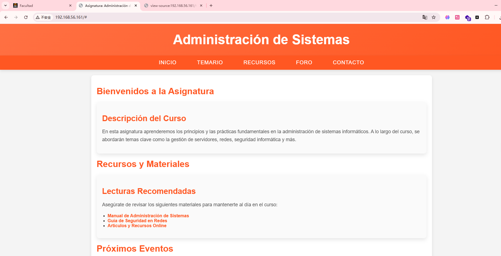  
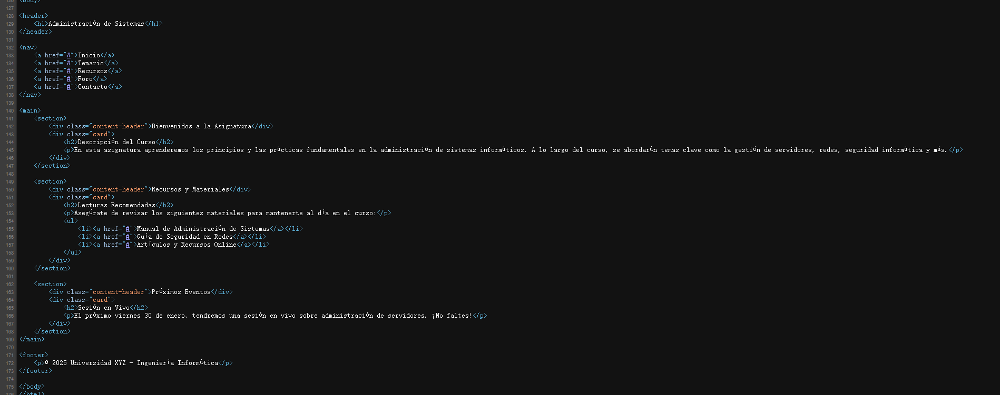  
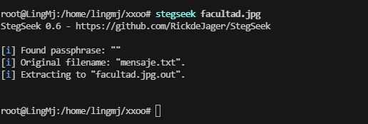  
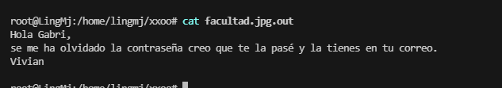  
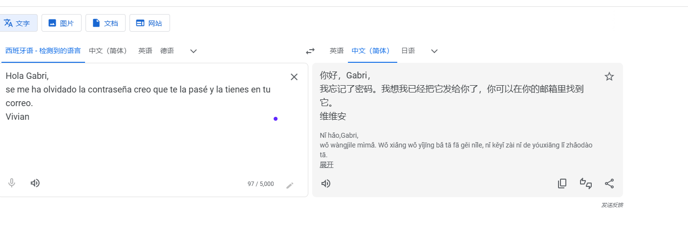  

>感觉要么找信息要么爆破了，边爆破边找信息吧
>

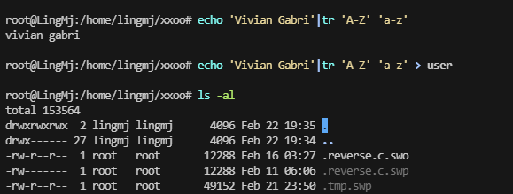  
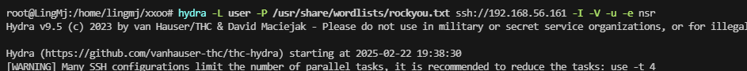  
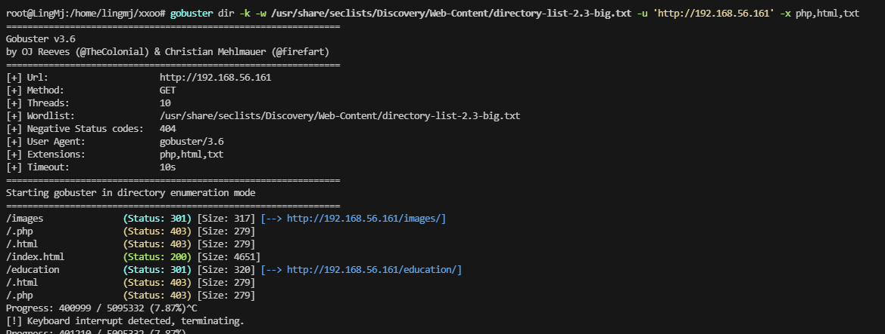  
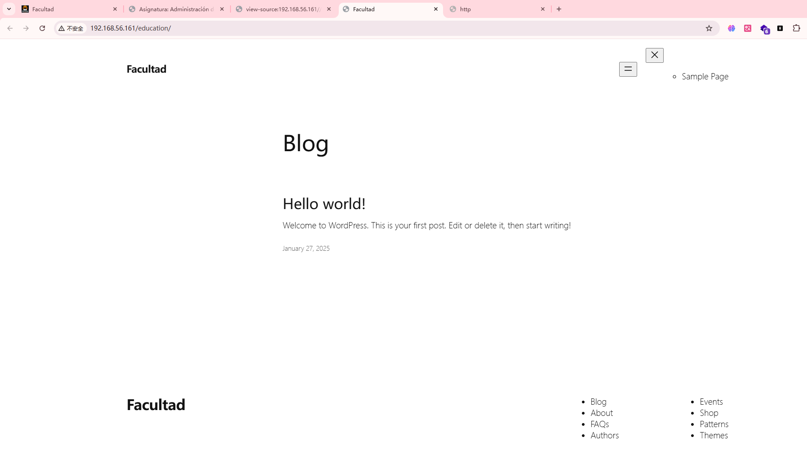  

>又是wordpress算了，直接找wordpress吧
>

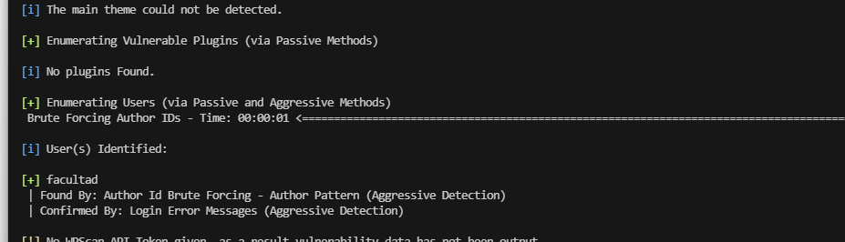  


>目前我没看到插件奥，也不知道跟插件有没有关系
>

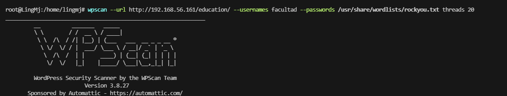  
  
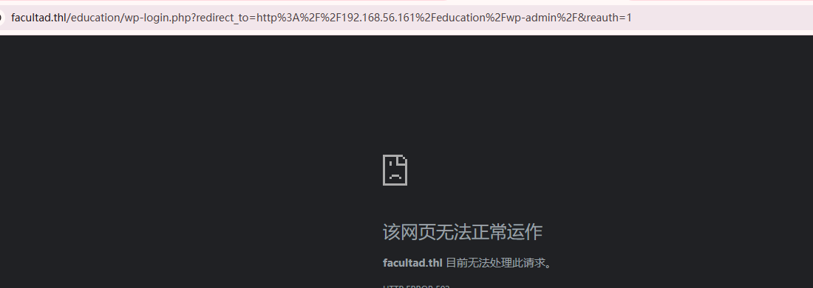  

>存在域名奥，账号密码:facultad / asdfghjkl
>

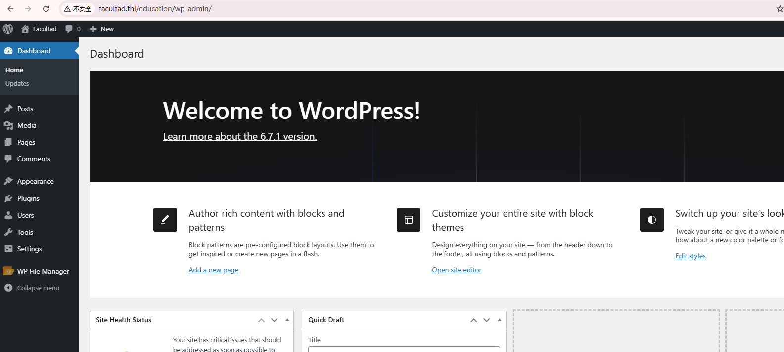
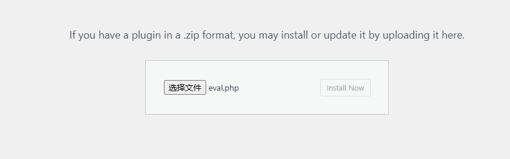  
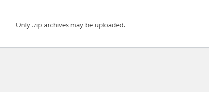  

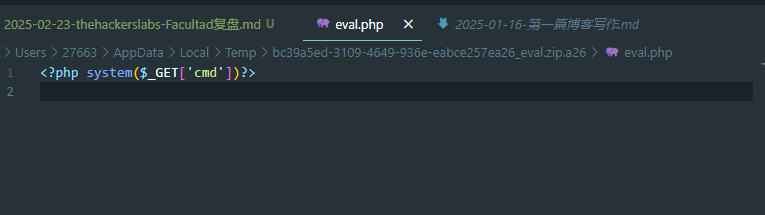  
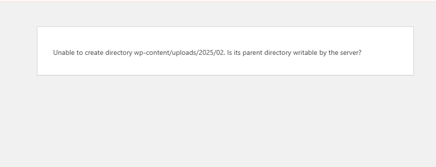  
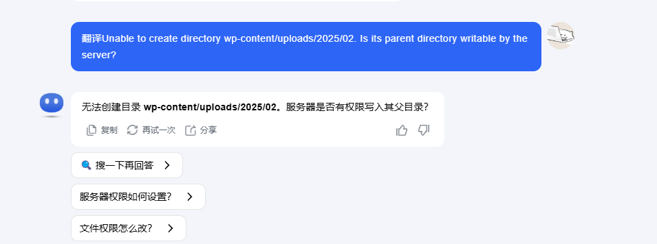  
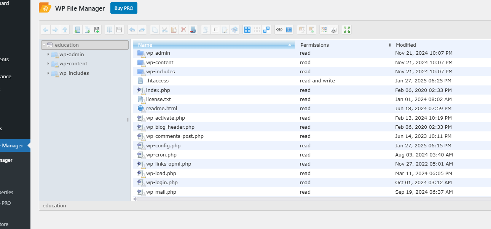  
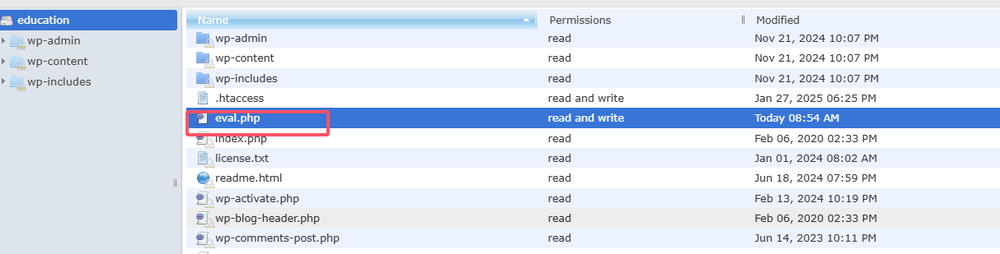  
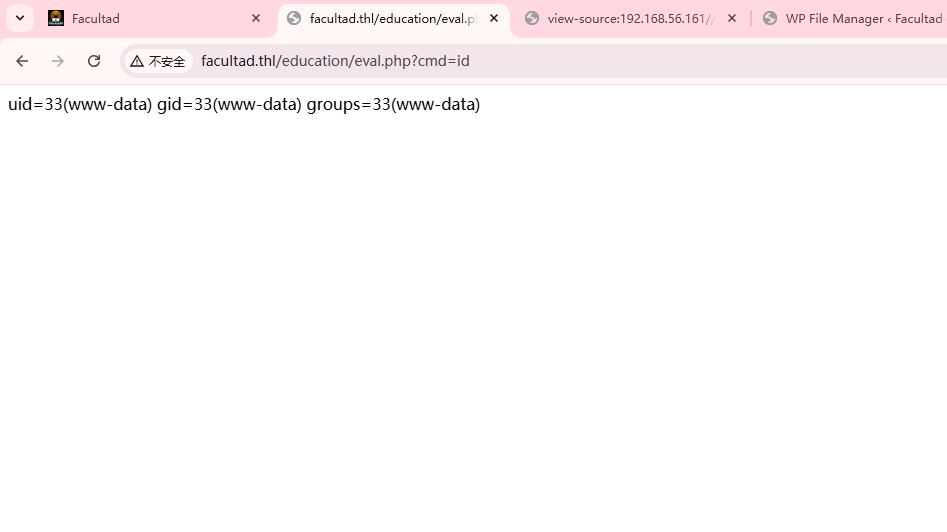  

>简单可以直接下一步了
>
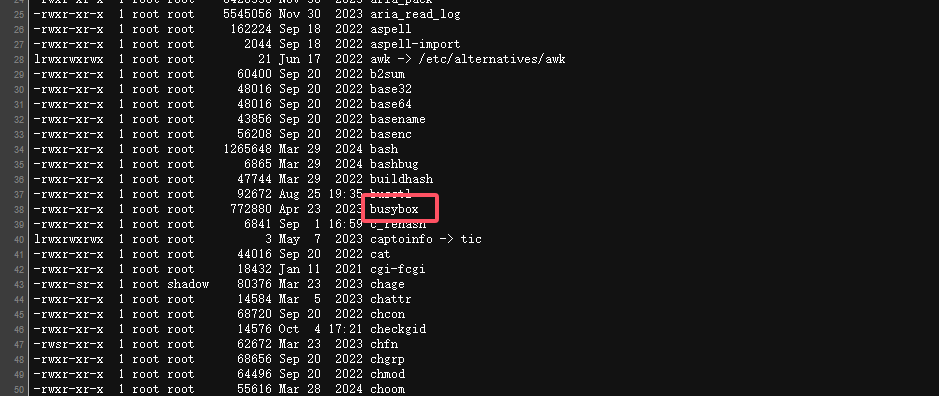  
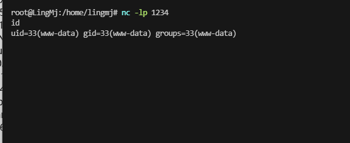  

## 提权
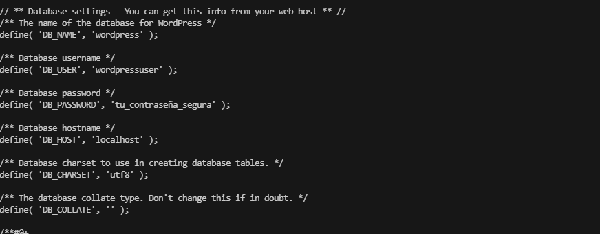  

```
MariaDB [(none)]> show databases;
+--------------------+
| Database           |
+--------------------+
| information_schema |
| wordpress          |
+--------------------+
2 rows in set (0.001 sec)

MariaDB [(none)]> use wordpress
Reading table information for completion of table and column names
You can turn off this feature to get a quicker startup with -A

Database changed
MariaDB [wordpress]> show table;
ERROR 1064 (42000): You have an error in your SQL syntax; check the manual that corresponds to your MariaDB server version for the right syntax to use near '' at line 1
MariaDB [wordpress]> show tables
    -> ;
+-----------------------+
| Tables_in_wordpress   |
+-----------------------+
| wp_commentmeta        |
| wp_comments           |
| wp_links              |
| wp_options            |
| wp_postmeta           |
| wp_posts              |
| wp_term_relationships |
| wp_term_taxonomy      |
| wp_termmeta           |
| wp_terms              |
| wp_usermeta           |
| wp_users              |
| wp_wpfm_backup        |
+-----------------------+
13 rows in set (0.001 sec)

MariaDB [wordpress]> select * from wp_users;
+----+------------+------------------------------------+---------------+------------+-------------------------------+---------------------+---------------------+-------------+--------------+
| ID | user_login | user_pass                          | user_nicename | user_email | user_url                      | user_registered     | user_activation_key | user_status | display_name |
+----+------------+------------------------------------+---------------+------------+-------------------------------+---------------------+---------------------+-------------+--------------+
|  1 | Facultad   | $P$BErY/zc8BR4TJBrKLWcxOwJuU6UrOY/ | facultad      | a@a.com    | http://facultad.thl/education | 2025-01-27 10:25:10 |                     |           0 | Facultad     |
+----+------------+------------------------------------+---------------+------------+-------------------------------+---------------------+---------------------+-------------+--------------+
1 row in set (0.000 sec)

MariaDB [wordpress]> 
```


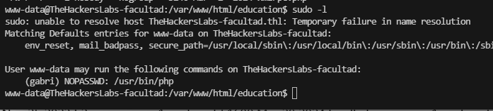  
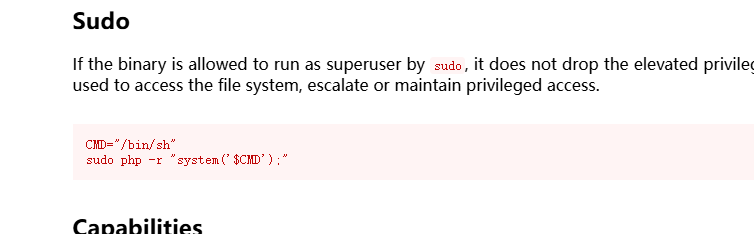  
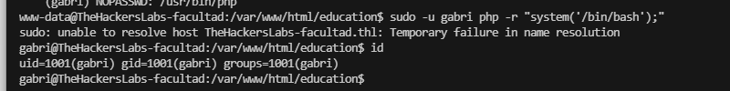  
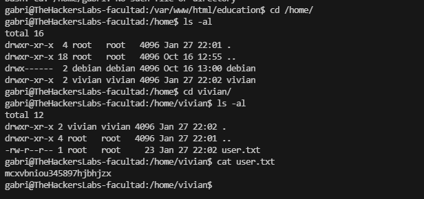  
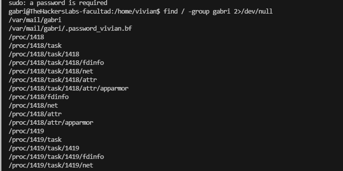  


```
gabri@TheHackersLabs-facultad:/var/mail/gabri$ ls -al
total 12
drwxr-sr-x 2 gabri gabri 4096 Jan 25 23:05 .
drwxrwsr-x 4 root  mail  4096 Jan 25 22:56 ..
-rw-r--r-- 1 gabri gabri  176 Jan 25 22:56 .password_vivian.bf
gabri@TheHackersLabs-facultad:/var/mail/gabri$ cat .password_vivian.bf 
++++++++++[>+>+++>+++++++>++++++++++<<<<-]>>>>++++++++.-----------.+++++++++++++++.---------------.+++++++++++++++++++.--.---.-.-------------.<<++++++++++++++++++++.--.++.+++.
gabri@TheHackersLabs-facultad:/var/mail/gabri$ 
```

>突然忘了是啥加密了去一个特定网站看看或者查查
>

  
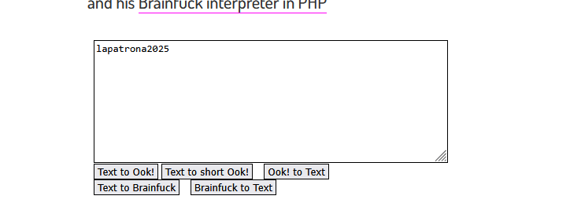  

>之前有提示但是不知道是不是这个密码：lapatrona2025，无法su直接ssh
>

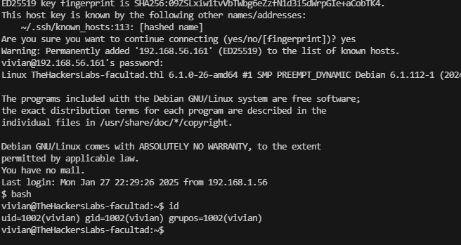  


```
    (ALL) NOPASSWD: /opt/vivian/script.sh
vivian@TheHackersLabs-facultad:~$ ls -al /opt/vivian/script.sh
-rwxr-xr-x 1 vivian vivian 58 ene 27 22:34 /opt/vivian/script.sh
vivian@TheHackersLabs-facultad:~$ cat /opt/vivian/script.sh
#!/bin/bash
echo "Ejecutado como vivian para mis alumnos"
vivian@TheHackersLabs-facultad:~$ 
```

>这里有有点没找到东西如果环境变量劫持的话可是sudo应该做不了直接工具跑一下，工具跑完没见啥，看来我目前得手动找线索了
>

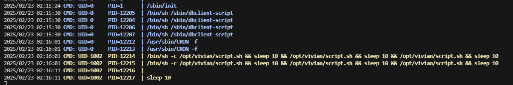  

>能拦截的改这个文件么？但是他是easy靶机不应该是这个方案奥
>

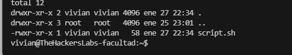  

>试试王炸方案
>

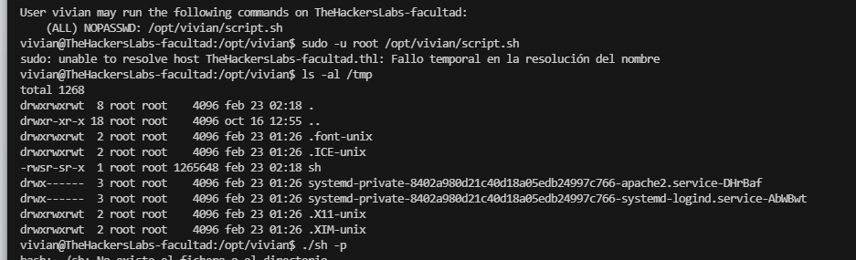  

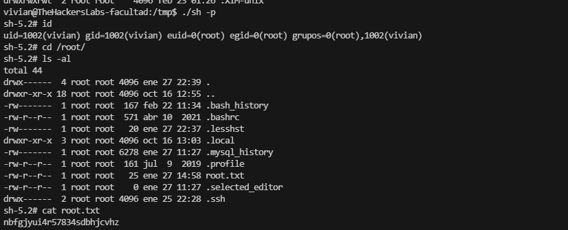  

>好了结束了，我以为2条路呢才发现是一个方案，结束
>


>userflag:mcxvbniou345897hjbhjzx
>
>rootflag:nbfgjyui4r57834sdbhjcvhz
>
