## 网段扫描
```
root@LingMj:~# arp-scan -l   
Interface: eth0, type: EN10MB, MAC: 00:0c:29:d1:27:55, IPv4: 192.168.137.190
Starting arp-scan 1.10.0 with 256 hosts (https://github.com/royhills/arp-scan)
192.168.137.1	3e:21:9c:12:bd:a3	(Unknown: locally administered)
192.168.137.66	a0:78:17:62:e5:0a	Apple, Inc.
192.168.137.147	3e:21:9c:12:bd:a3	(Unknown: locally administered)

8 packets received by filter, 0 packets dropped by kernel
Ending arp-scan 1.10.0: 256 hosts scanned in 2.063 seconds (124.09 hosts/sec). 3 responded
```

## 端口扫描
```
root@LingMj:~# nmap -p- -sC -sV 192.168.137.147
Starting Nmap 7.95 ( https://nmap.org ) at 2025-03-02 04:07 EST
Nmap scan report for backend.mshome.net (192.168.137.147)
Host is up (0.037s latency).
Not shown: 65533 closed tcp ports (reset)
PORT     STATE SERVICE VERSION
22/tcp   open  ssh     OpenSSH 8.2p1 Ubuntu 4ubuntu0.11 (Ubuntu Linux; protocol 2.0)
| ssh-hostkey: 
|   3072 48:ec:8d:c2:a6:1e:52:43:62:44:29:36:58:73:15:6b (RSA)
|   256 0d:39:f5:86:a1:fc:7d:ba:c6:55:14:37:2c:91:fe:37 (ECDSA)
|_  256 d6:91:b0:62:48:85:9c:51:dd:f9:20:35:d2:53:a6:25 (ED25519)
8080/tcp open  http    Jetty 10.0.18
| http-robots.txt: 1 disallowed entry 
|_/
|_http-title: Site doesn't have a title (text/html;charset=utf-8).
|_http-server-header: Jetty(10.0.18)
MAC Address: 3E:21:9C:12:BD:A3 (Unknown)
Service Info: OS: Linux; CPE: cpe:/o:linux:linux_kernel

Service detection performed. Please report any incorrect results at https://nmap.org/submit/ .
Nmap done: 1 IP address (1 host up) scanned in 19.40 seconds
```

## 获取webshell

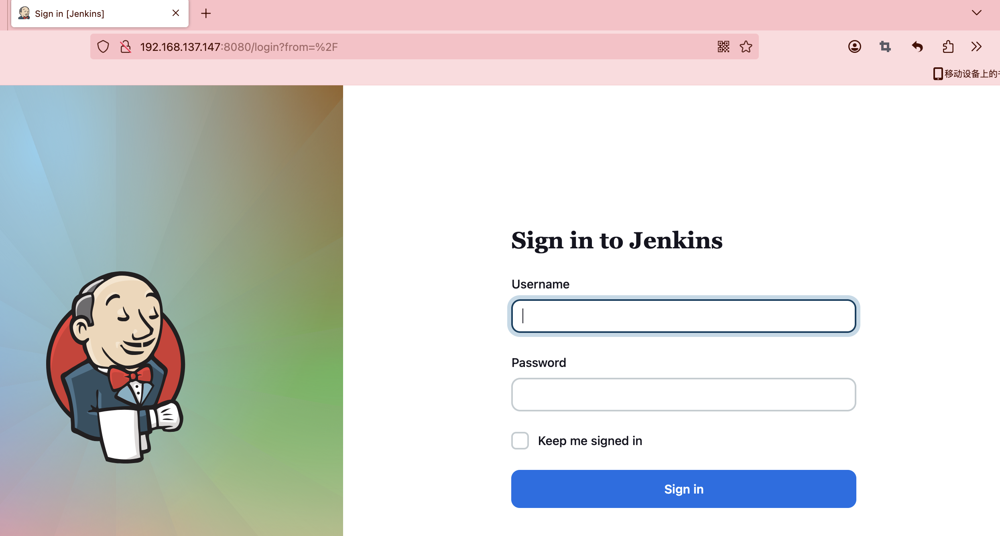  
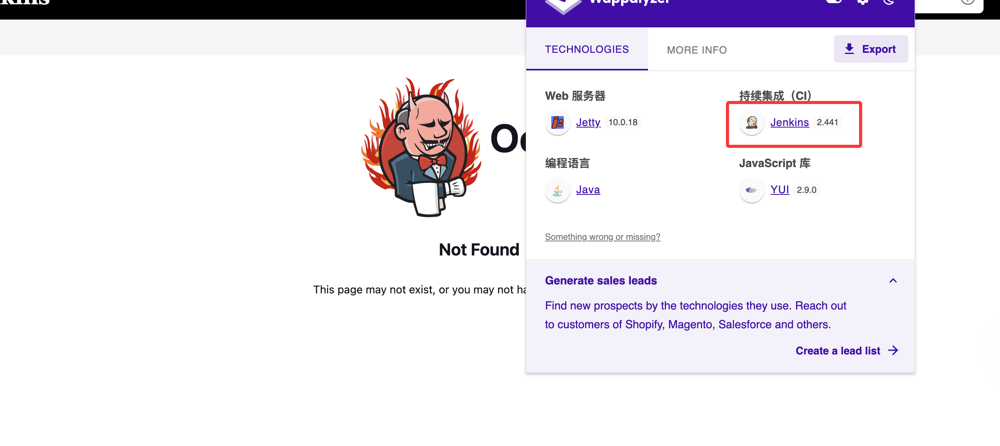  

>这里的版本是有LFI漏洞，但是有问题它只能读取一行，我看了一篇关于这个的文章：https://www.leavesongs.com/PENETRATION/jenkins-cve-2024-23897.html
>

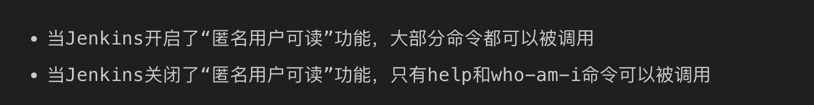  

>我得到的结论是我们被匿名关闭了，并且加了权限设置，所以我们如果要突破必须进行密码读取，这里我找到了密码的明文路径：/secrets/initialAdminPassword，用户admin
>

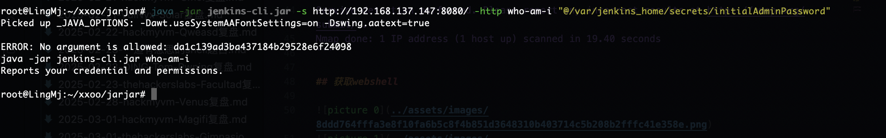  
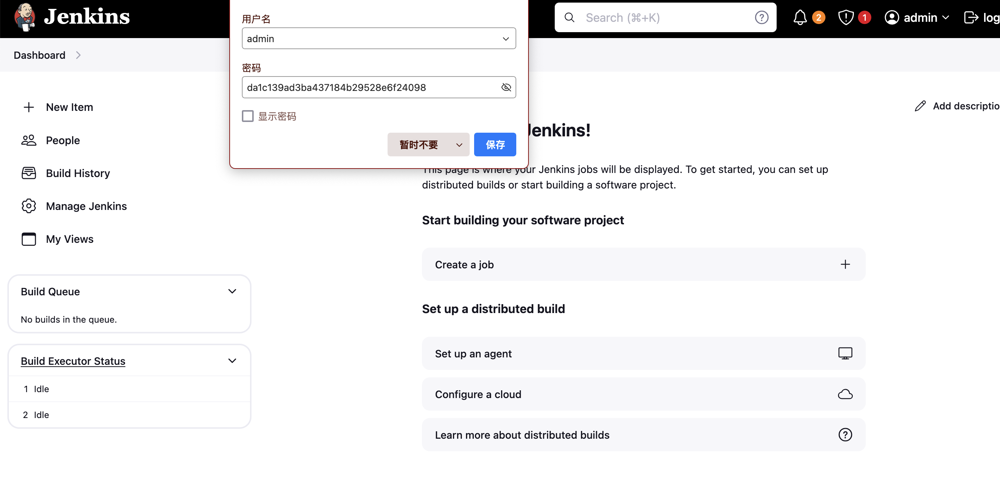  
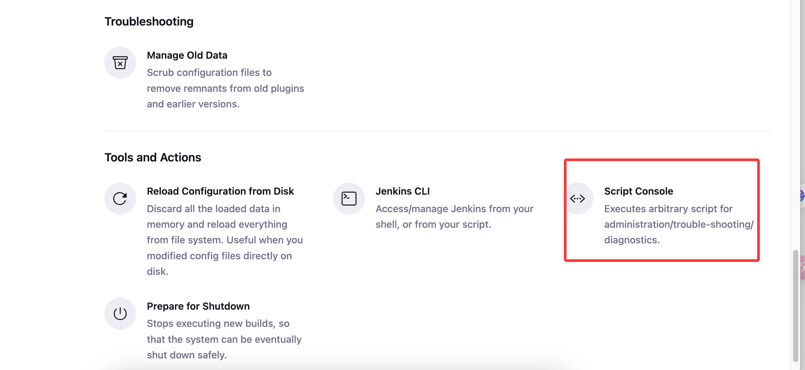  
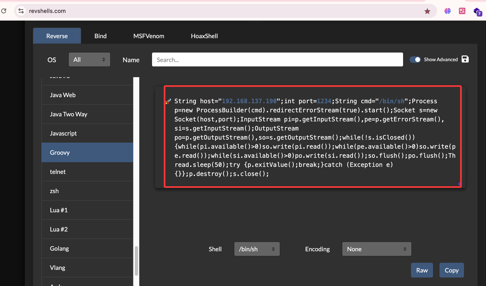  
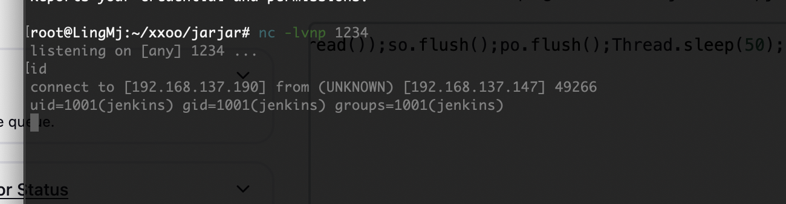  

>我后面直接给自己加ssh省得调终端
>

## 提权

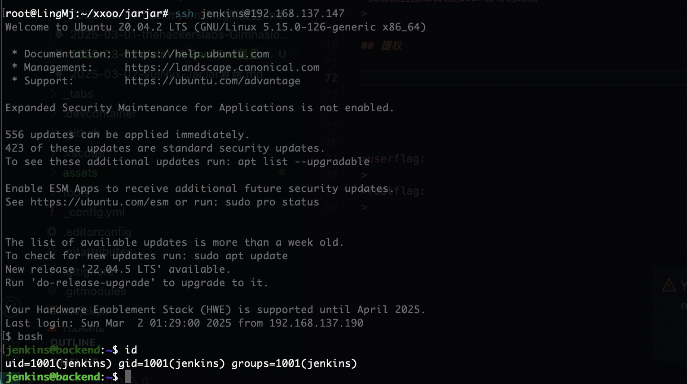  
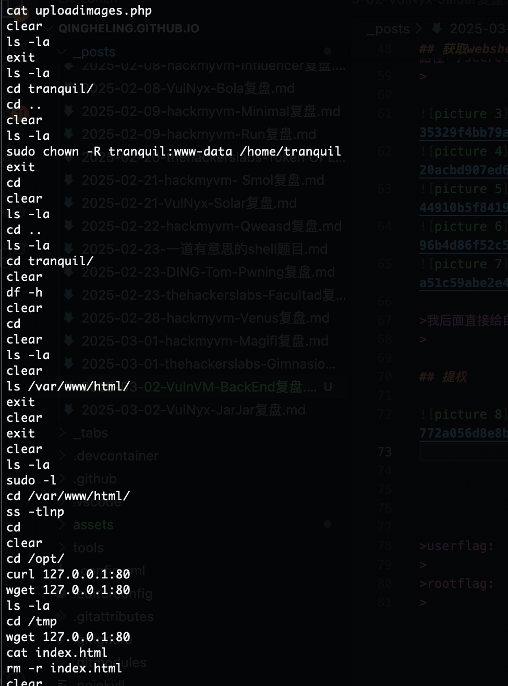  

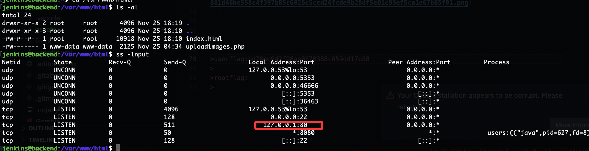  

>需要进行端口转发
>

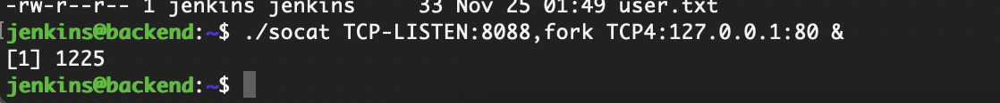  
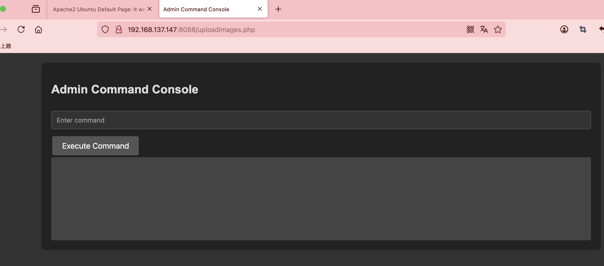  
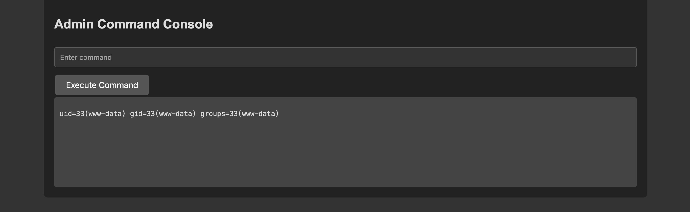  
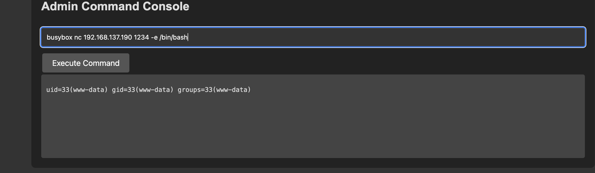  
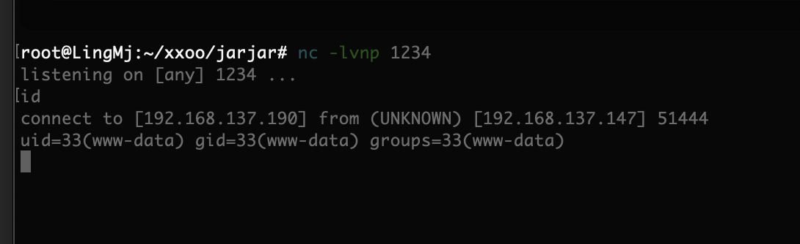  
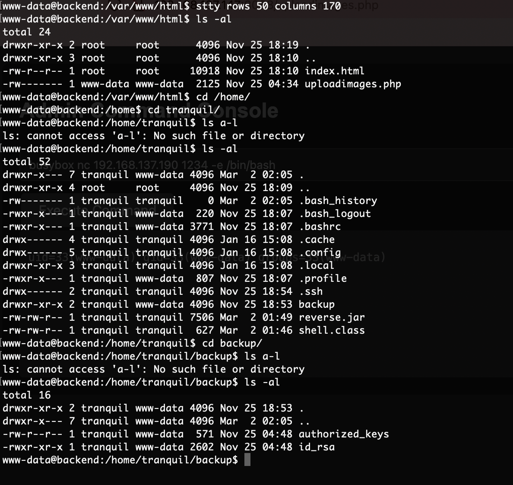  
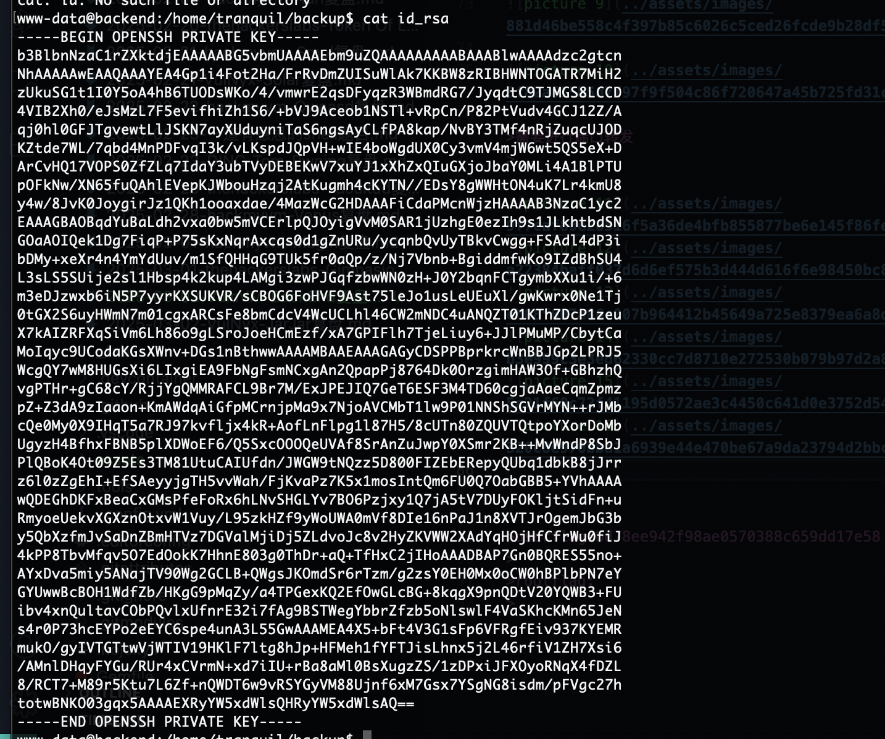  
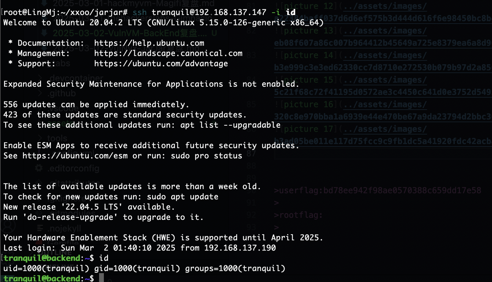  

>无密码登录，OK
>

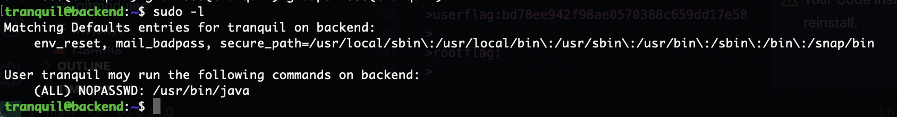  

>到这里结束了本来我以为我写个java脚步运行就成功了，但是脚步失败还是最朴素的方案吧
>

  
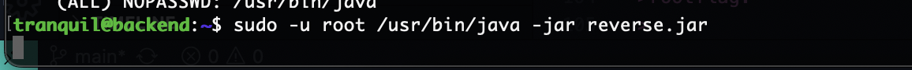  
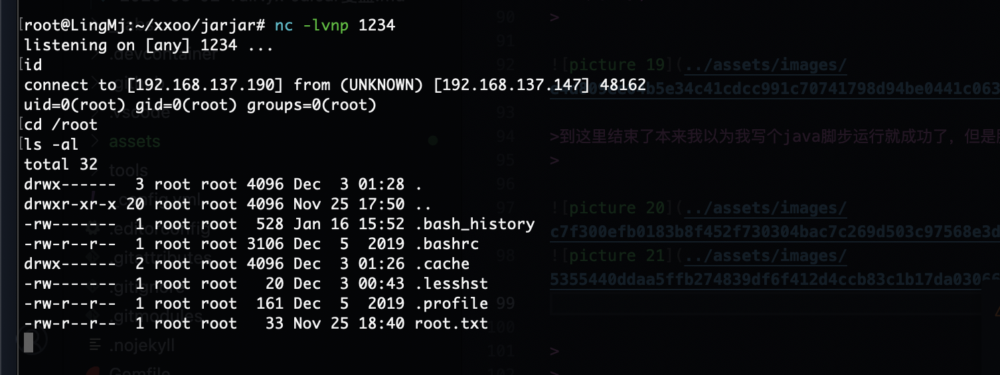  


>好了靶机到这里就结束了，整体来说是一个easy的靶机后面，前面可能费点劲
>

>userflag:bd78ee****98ae0570388c****d17e58
>
>rootflag:37589**c75122**c17af**17467294f2
>