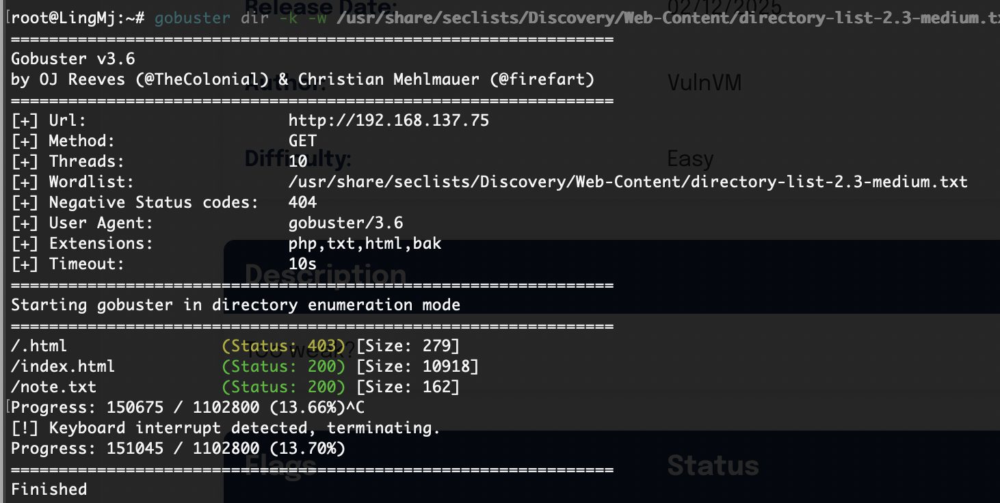
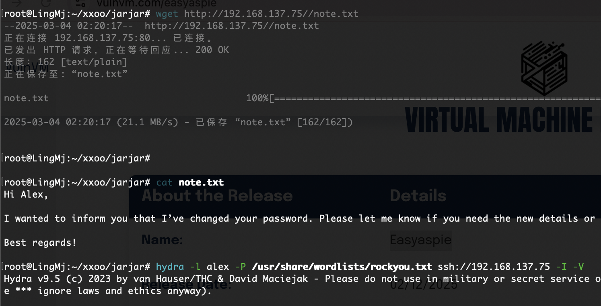
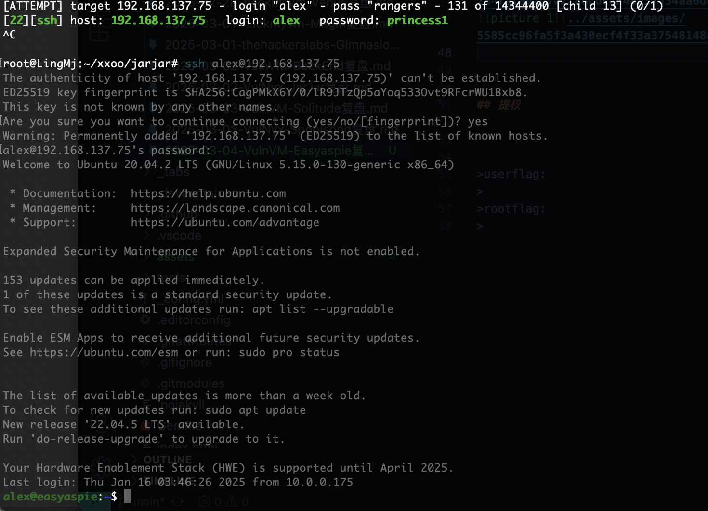
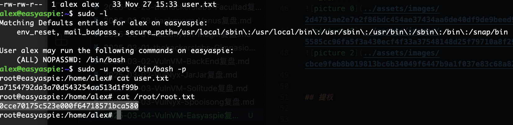

## 网段扫描
```
root@LingMj:~# arp-scan -l         
Interface: eth0, type: EN10MB, MAC: 00:0c:29:d1:27:55, IPv4: 192.168.137.190
Starting arp-scan 1.10.0 with 256 hosts (https://github.com/royhills/arp-scan)
192.168.137.1	3e:21:9c:12:bd:a3	(Unknown: locally administered)
192.168.137.66	a0:78:17:62:e5:0a	Apple, Inc.
192.168.137.75	3e:21:9c:12:bd:a3	(Unknown: locally administered)
192.168.137.92	62:2f:e8:e4:77:5d	(Unknown: locally administered)

5 packets received by filter, 0 packets dropped by kernel
Ending arp-scan 1.10.0: 256 hosts scanned in 2.090 seconds (122.49 hosts/sec). 4 responded
```

## 端口扫描

```
root@LingMj:~# nmap -p- -sC -sV 192.168.137.75
Starting Nmap 7.95 ( https://nmap.org ) at 2025-03-04 02:17 EST
Nmap scan report for easyaspie.mshome.net (192.168.137.75)
Host is up (0.0064s latency).
Not shown: 65533 closed tcp ports (reset)
PORT   STATE SERVICE VERSION
22/tcp open  ssh     OpenSSH 8.2p1 Ubuntu 4ubuntu0.11 (Ubuntu Linux; protocol 2.0)
| ssh-hostkey: 
|   3072 8c:c5:70:a6:8f:7c:53:6f:98:6d:01:9c:63:b7:3b:60 (RSA)
|   256 31:1f:74:73:32:ff:8e:f0:f9:63:fb:51:13:98:32:27 (ECDSA)
|_  256 7e:1f:ea:1b:50:38:d8:88:5a:fc:cb:6f:70:3f:25:0b (ED25519)
80/tcp open  http    Apache httpd 2.4.41 ((Ubuntu))
|_http-server-header: Apache/2.4.41 (Ubuntu)
|_http-title: Apache2 Ubuntu Default Page: It works
MAC Address: 3E:21:9C:12:BD:A3 (Unknown)
Service Info: OS: Linux; CPE: cpe:/o:linux:linux_kernel
```

## 获取webshell
  
  
  


## 提权

  

>low中之low，不想多说了
>


>userflag:a7154792da3a70d543254aa513d1f99b
>
>rootflag:0cce70175c523e000f64718571bca580
>