## 网段扫描
```
root@LingMj:~# arp-scan -l
Interface: eth0, type: EN10MB, MAC: 00:0c:29:d1:27:55, IPv4: 192.168.137.190
Starting arp-scan 1.10.0 with 256 hosts (https://github.com/royhills/arp-scan)
192.168.137.1	3e:21:9c:12:bd:a3	(Unknown: locally administered)
192.168.137.66	a0:78:17:62:e5:0a	Apple, Inc.
192.168.137.149	3e:21:9c:12:bd:a3	(Unknown: locally administered)

6 packets received by filter, 0 packets dropped by kernel
Ending arp-scan 1.10.0: 256 hosts scanned in 2.143 seconds (119.46 hosts/sec). 3 responded
```

## 端口扫描

```
root@LingMj:~# nmap -p- -sC -sV 192.168.137.149
Starting Nmap 7.95 ( https://nmap.org ) at 2025-03-04 07:42 EST
Nmap scan report for hacked.mshome.net (192.168.137.149)
Host is up (0.0094s latency).
Not shown: 65533 closed tcp ports (reset)
PORT   STATE SERVICE VERSION
22/tcp open  ssh     OpenSSH 7.9p1 Debian 10+deb10u2 (protocol 2.0)
| ssh-hostkey: 
|   2048 8d:75:44:05:5f:f8:4f:ac:a1:33:fa:84:03:db:6f:94 (RSA)
|   256 5a:b6:c6:9d:a9:15:42:74:4c:7a:f9:dd:67:ae:75:0e (ECDSA)
|_  256 05:97:3c:74:bd:cf:8d:80:87:05:26:64:7f:d9:3d:c3 (ED25519)
80/tcp open  http    nginx 1.14.2
|_http-title: Site doesn't have a title (text/html).
|_http-server-header: nginx/1.14.2
MAC Address: 3E:21:9C:12:BD:A3 (Unknown)
Service Info: OS: Linux; CPE: cpe:/o:linux:linux_kernel

Service detection performed. Please report any incorrect results at https://nmap.org/submit/ .
Nmap done: 1 IP address (1 host up) scanned in 21.01 seconds
```

## 获取webshell
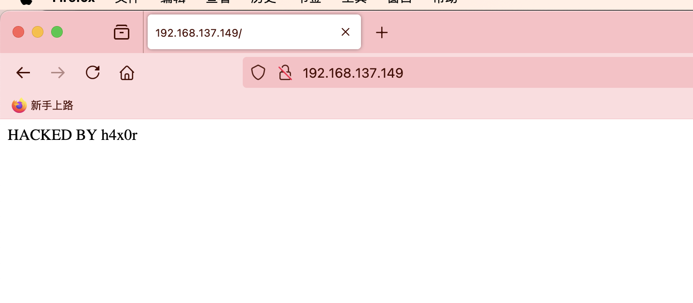  
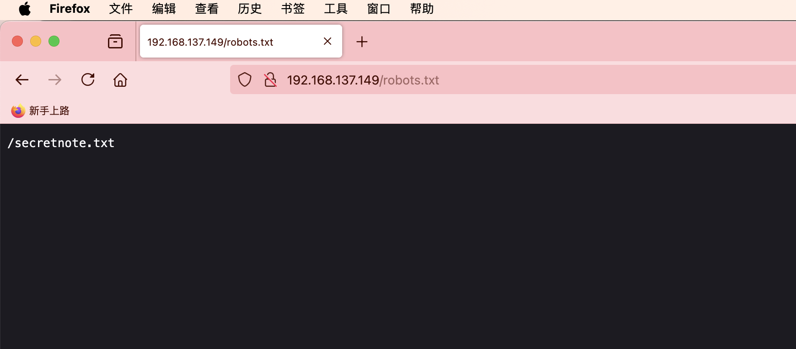
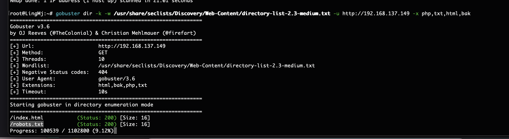  

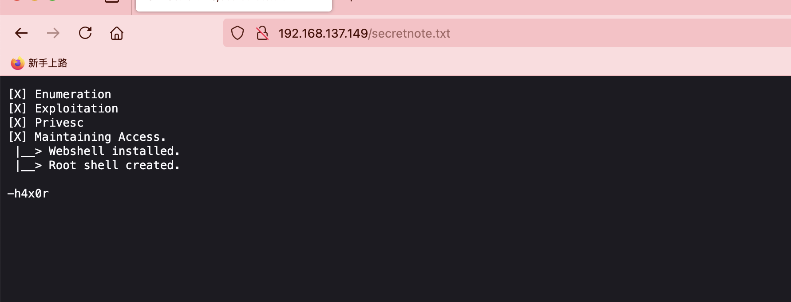  

>看起来这个像是一个用户名
>

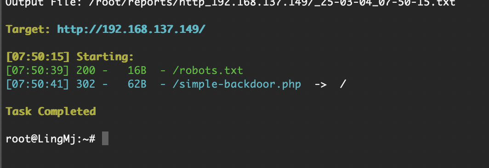  
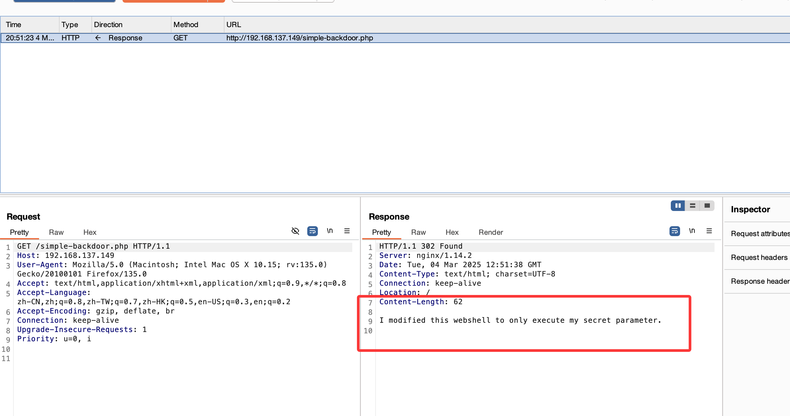  
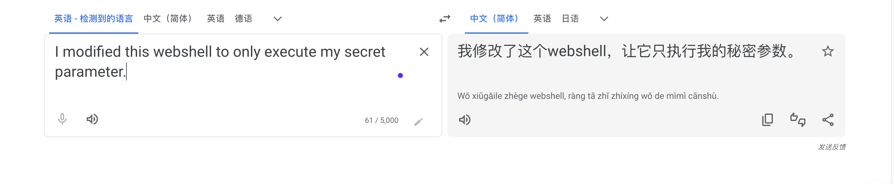  
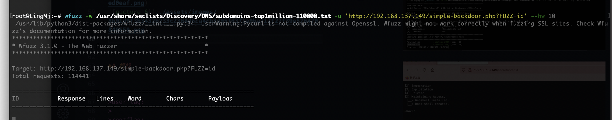  

>看名字是执行rce的
>

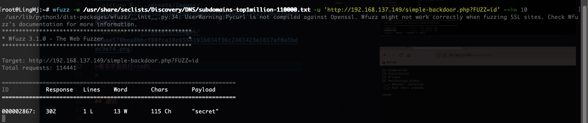  
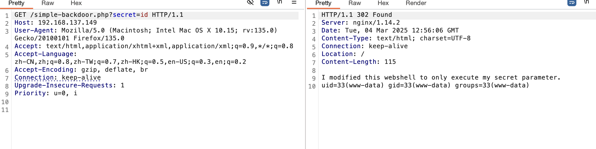  
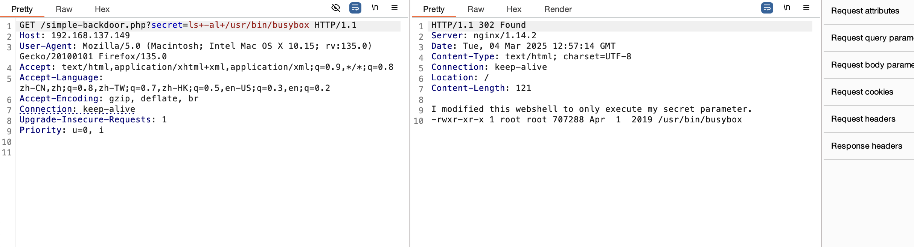  
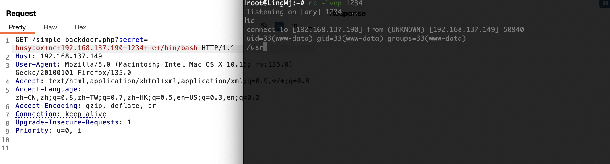  

>好了shell还是很好拿的
>

## 提权
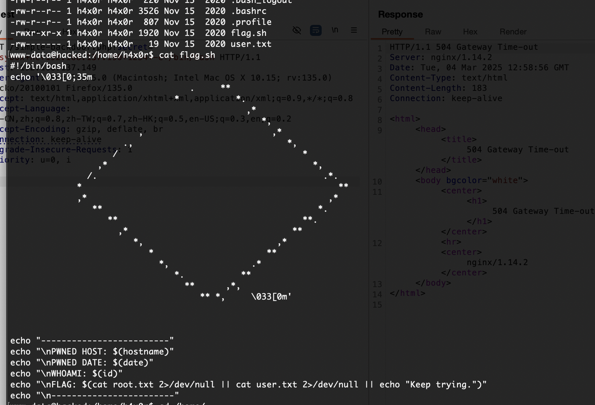  

>环境劫持么？但好像劫持user会比劫持root简单看看其他地方不然不是劫持就说爆破了，看完opt和var没有有用线索
>

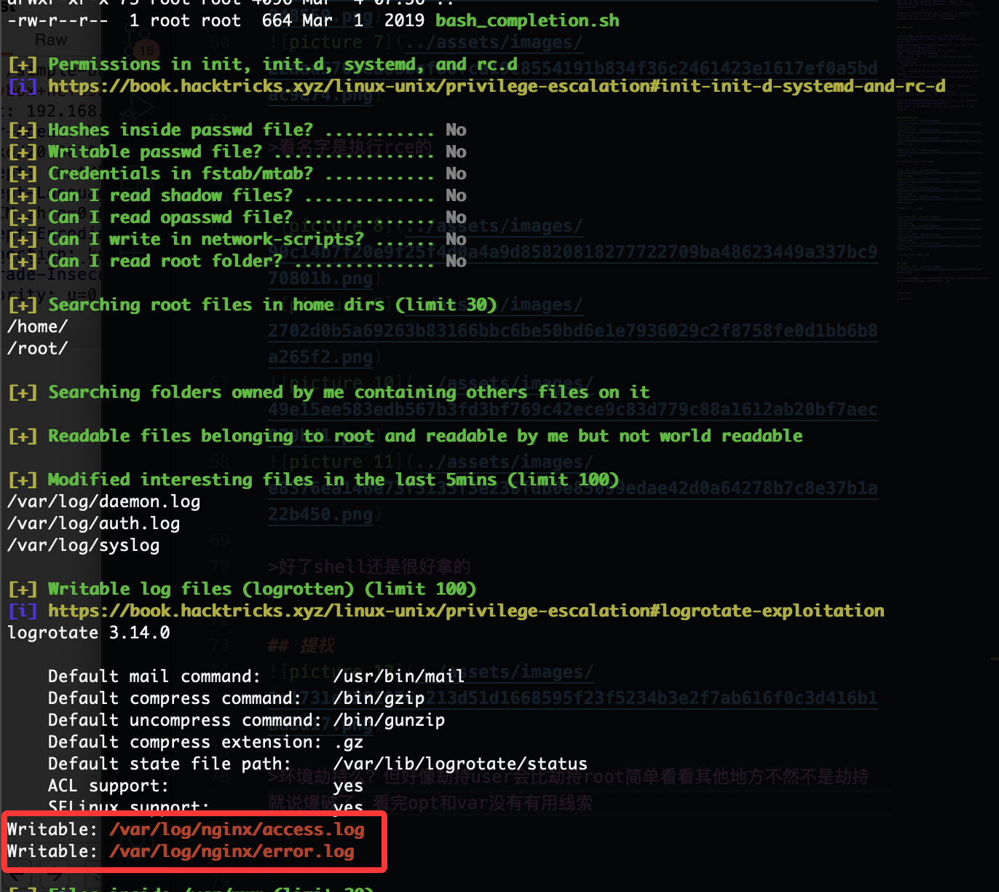  
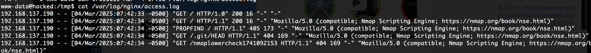  
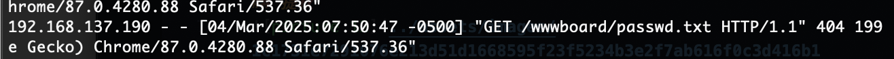  

>无有用信息，尝试环境劫持
>

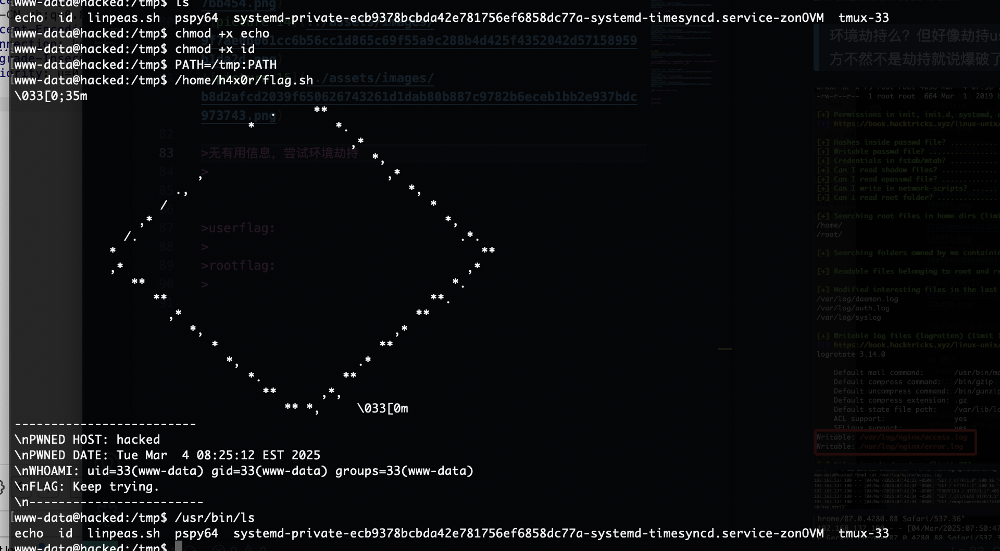  
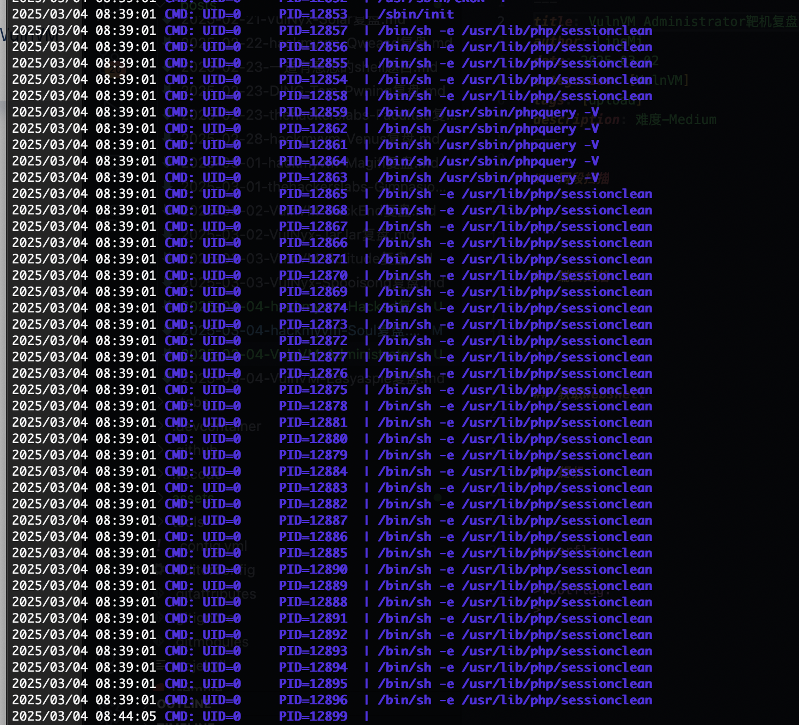  


>没有用跟这个无关爆破用户名了，得到了些线索导致我觉得很难熬，所以搁置了，哈哈哈哈
>

>补一下后面找到了wp看还是内核我对这个研究一向不通
>地址：https://github.com/m0nad/Diamorphine
>


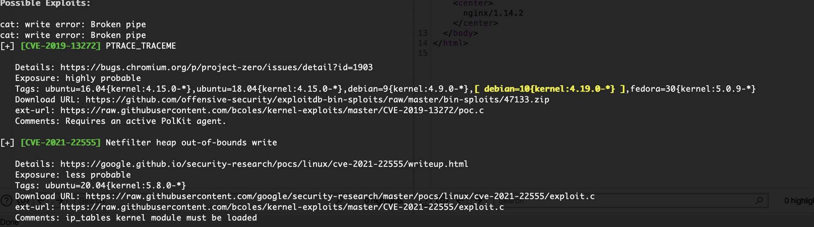  
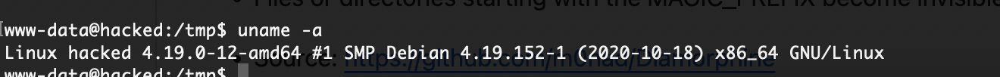  

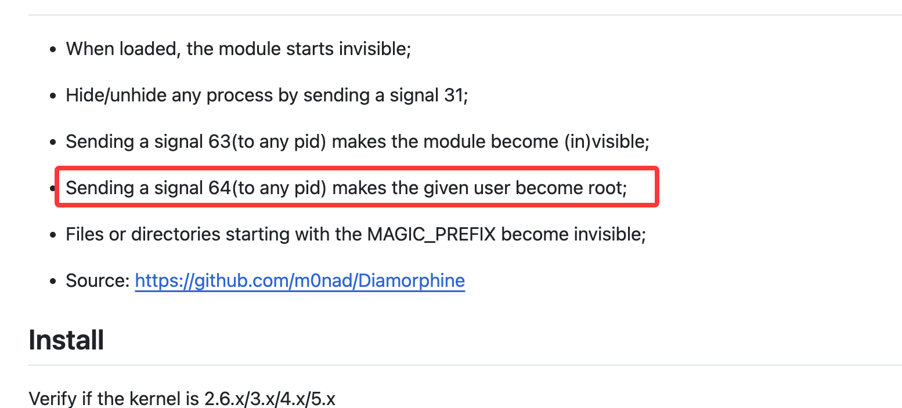  
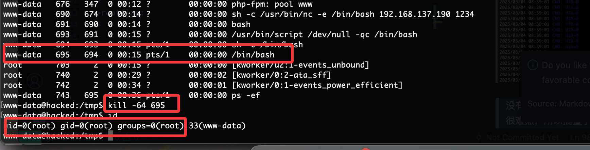  

>这样就结束了
>


>userflag:HMVimthabesthacker
>
>rootflag:HMVhackingthehacker
>
