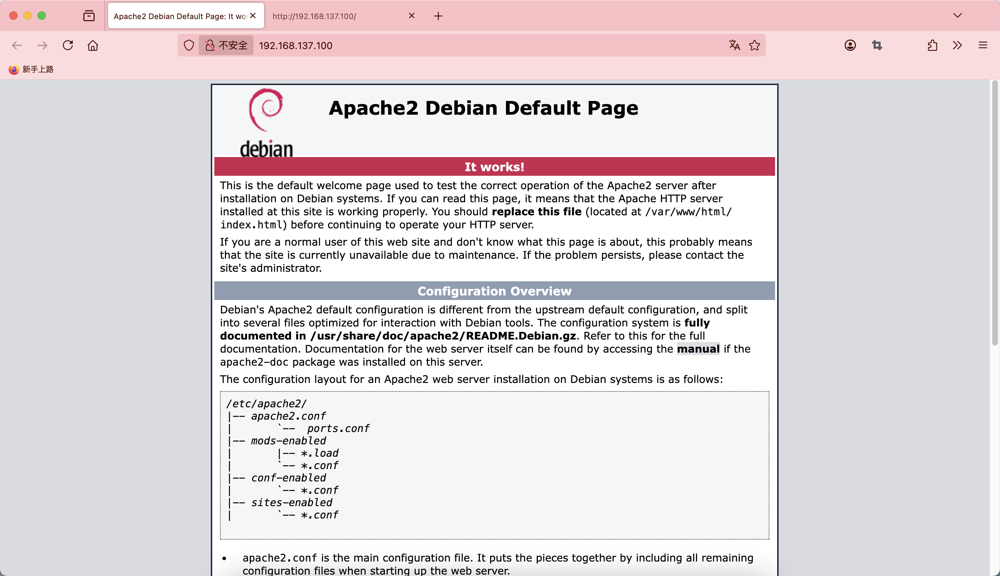
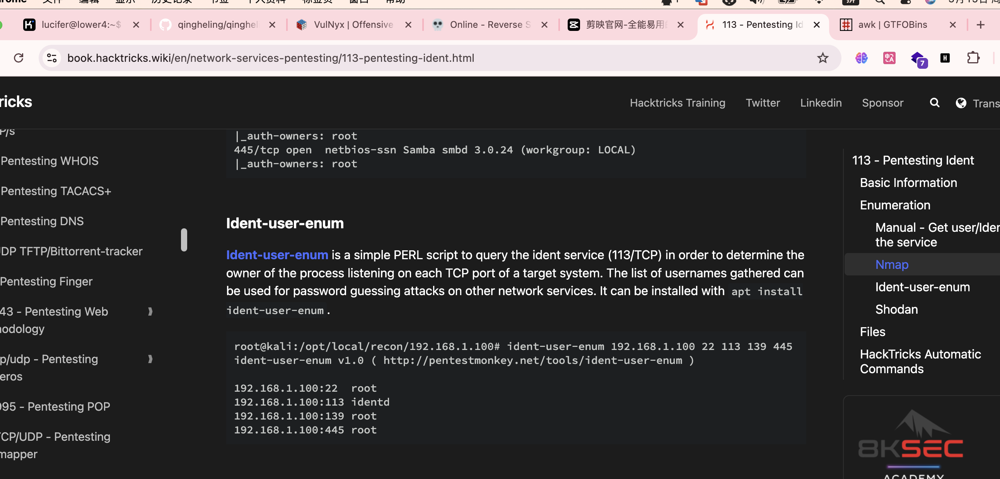
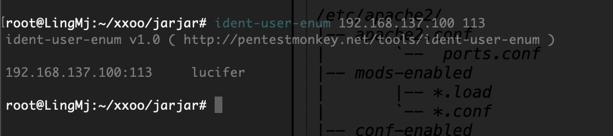
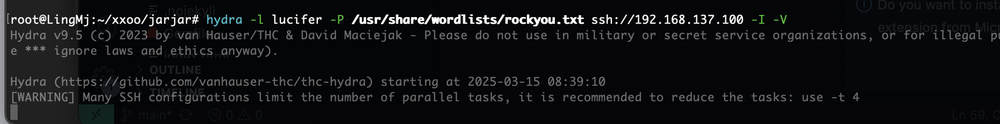
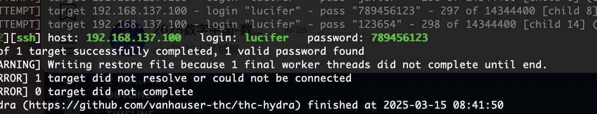
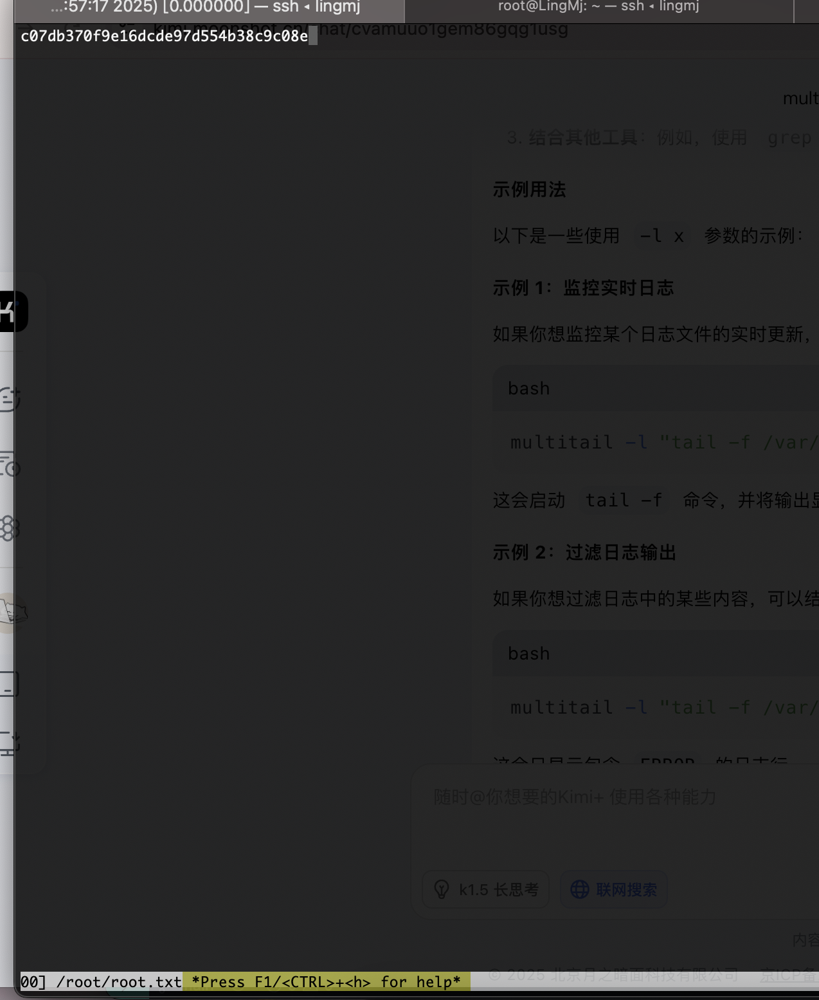
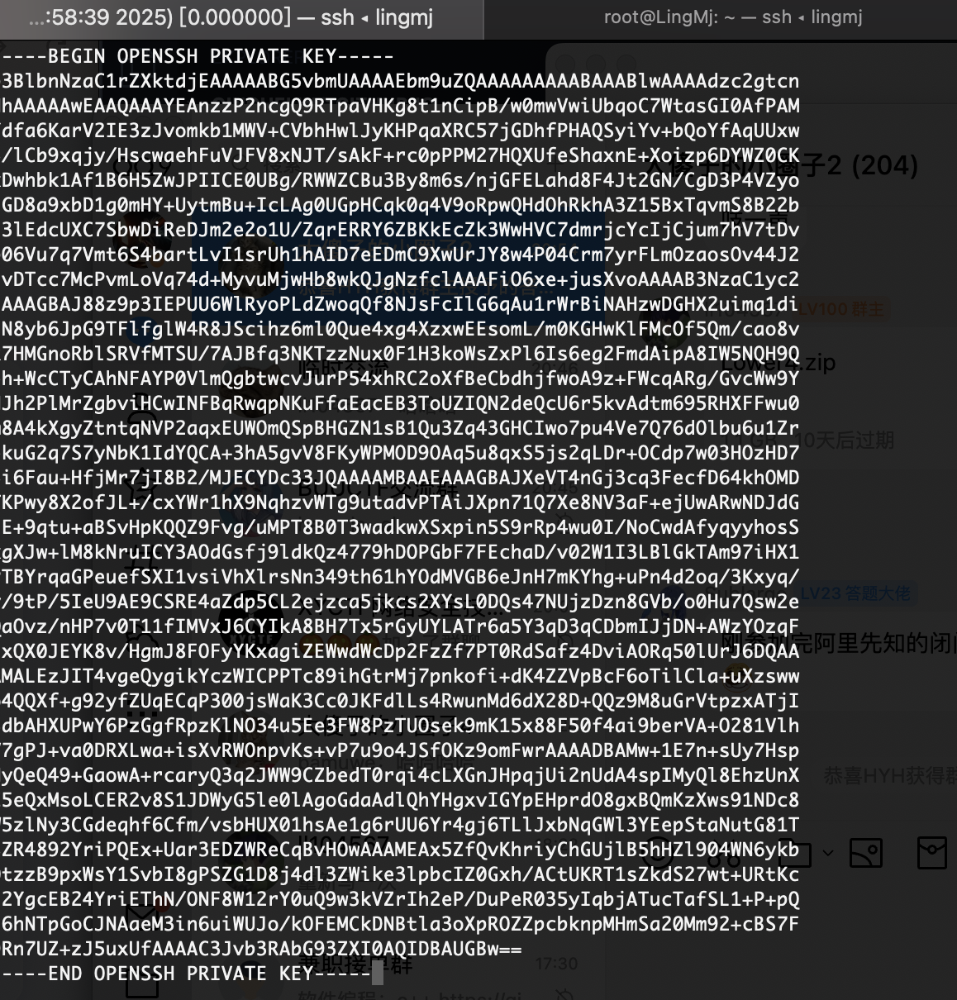
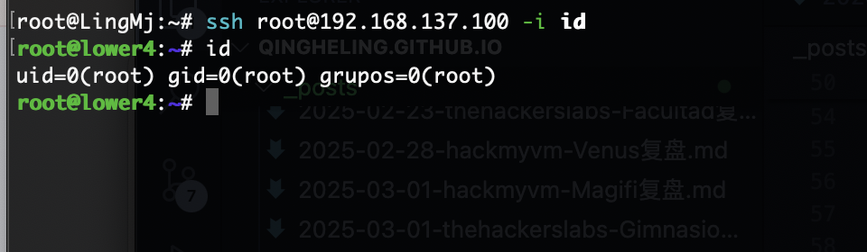
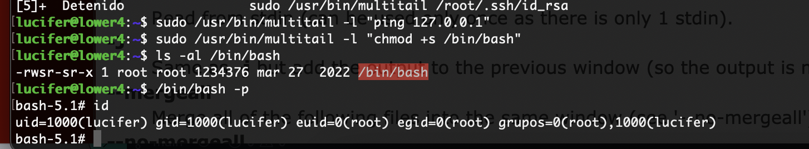

## 网段扫描
```
root@LingMj:~/xxoo/jarjar# arp-scan -l
Interface: eth0, type: EN10MB, MAC: 00:0c:29:d1:27:55, IPv4: 192.168.137.190
Starting arp-scan 1.10.0 with 256 hosts (https://github.com/royhills/arp-scan)
192.168.137.1	3e:21:9c:12:bd:a3	(Unknown: locally administered)
192.168.137.93	a0:78:17:62:e5:0a	Apple, Inc.
192.168.137.100	3e:21:9c:12:bd:a3	(Unknown: locally administered)

6 packets received by filter, 0 packets dropped by kernel
Ending arp-scan 1.10.0: 256 hosts scanned in 2.081 seconds (123.02 hosts/sec). 3 responded
```

## 端口扫描

```
root@LingMj:~/xxoo/jarjar# nmap -p- -sV -sC 192.168.137.100
Starting Nmap 7.95 ( https://nmap.org ) at 2025-03-15 08:33 EDT
Nmap scan report for lower4.mshome.net (192.168.137.100)
Host is up (0.0085s latency).
Not shown: 65532 closed tcp ports (reset)
PORT    STATE SERVICE VERSION
22/tcp  open  ssh     OpenSSH 8.4p1 Debian 5+deb11u1 (protocol 2.0)
|_auth-owners: root
| ssh-hostkey: 
|   3072 f0:e6:24:fb:9e:b0:7a:1a:bd:f7:b1:85:23:7f:b1:6f (RSA)
|   256 99:c8:74:31:45:10:58:b0:ce:cc:63:b4:7a:82:57:3d (ECDSA)
|_  256 60:da:3e:31:38:fa:b5:49:ab:48:c3:43:2c:9f:d1:32 (ED25519)
80/tcp  open  http    Apache httpd 2.4.56 ((Debian))
|_http-title: Apache2 Debian Default Page: It works
|_http-server-header: Apache/2.4.56 (Debian)
113/tcp open  ident?
|_auth-owners: lucifer
MAC Address: 3E:21:9C:12:BD:A3 (Unknown)
Service Info: OS: Linux; CPE: cpe:/o:linux:linux_kernel

Service detection performed. Please report any incorrect results at https://nmap.org/submit/ .
Nmap done: 1 IP address (1 host up) scanned in 109.24 seconds
```

## 获取webshell

  
  

>就找用户名
>

  
  
  

## 提权

  

>具有任意文件读取，并且可以注入命令
>
  
  

>正常这里已经结束了，我来说说命令注入
>
  

>当输入就已经出发所以如果你跑出来已经是root，但是习惯按q或者crtl + c｜z会忘记
>


>userflag:8e99e9f5a7d2d7a067314e34d9fd957f
>
>rootflag:c07db370f9e16dcde97d554b38c9c08e
>