## 网段扫描
```
root@LingMj:~# arp-scan -l    
Interface: eth0, type: EN10MB, MAC: 00:0c:29:d1:27:55, IPv4: 192.168.137.190
Starting arp-scan 1.10.0 with 256 hosts (https://github.com/royhills/arp-scan)
192.168.137.1	3e:21:9c:12:bd:a3	(Unknown: locally administered)
192.168.137.71	a0:78:17:62:e5:0a	Apple, Inc.
192.168.137.215	3e:21:9c:12:bd:a3	(Unknown: locally administered)
192.168.137.110	62:2f:e8:e4:77:5d	(Unknown: locally administered)

8 packets received by filter, 0 packets dropped by kernel
Ending arp-scan 1.10.0: 256 hosts scanned in 2.133 seconds (120.02 hosts/sec). 4 responded
```

## 端口扫描

```
root@LingMj:~# nmap -p- -sV -sC 192.168.137.215
Starting Nmap 7.95 ( https://nmap.org ) at 2025-03-24 03:50 EDT
Nmap scan report for corrosion.mshome.net (192.168.137.215)
Host is up (0.0099s latency).
Not shown: 65532 closed tcp ports (reset)
PORT     STATE SERVICE VERSION
22/tcp   open  ssh     OpenSSH 8.2p1 Ubuntu 4ubuntu0.3 (Ubuntu Linux; protocol 2.0)
| ssh-hostkey: 
|   3072 6a:d8:44:60:80:39:7e:f0:2d:08:2f:e5:83:63:f0:70 (RSA)
|   256 f2:a6:62:d7:e7:6a:94:be:7b:6b:a5:12:69:2e:fe:d7 (ECDSA)
|_  256 28:e1:0d:04:80:19:be:44:a6:48:73:aa:e8:6a:65:44 (ED25519)
80/tcp   open  http    Apache httpd 2.4.41 ((Ubuntu))
|_http-title: Apache2 Ubuntu Default Page: It works
|_http-server-header: Apache/2.4.41 (Ubuntu)
8080/tcp open  http    Apache Tomcat 9.0.53
|_http-favicon: Apache Tomcat
|_http-title: Apache Tomcat/9.0.53
MAC Address: 3E:21:9C:12:BD:A3 (Unknown)
Service Info: OS: Linux; CPE: cpe:/o:linux:linux_kernel
```

## 获取webshell
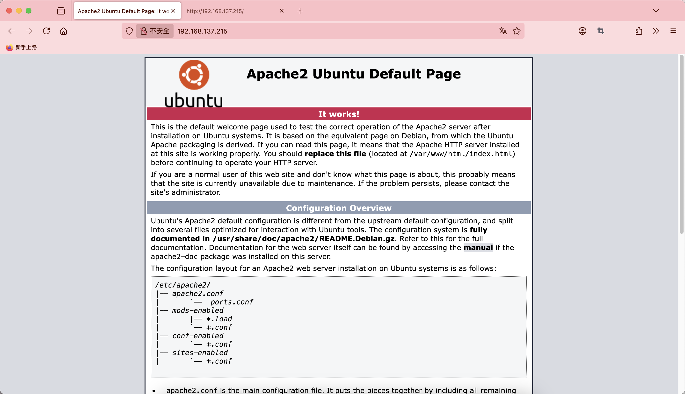  
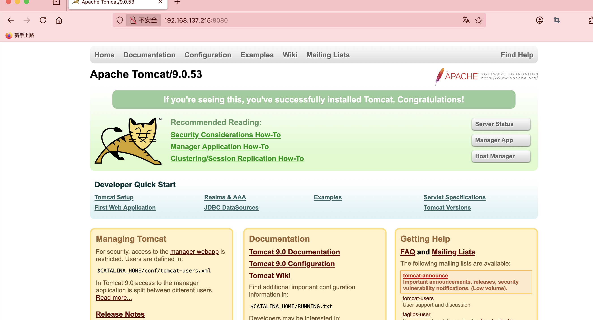  
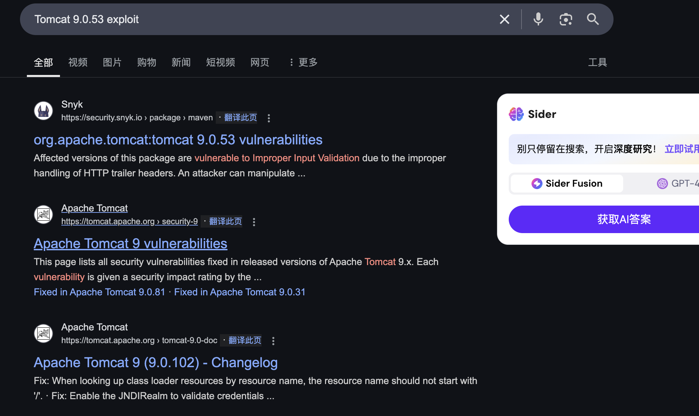  

>无直接利用的漏洞看到登录进行拿shell了
>

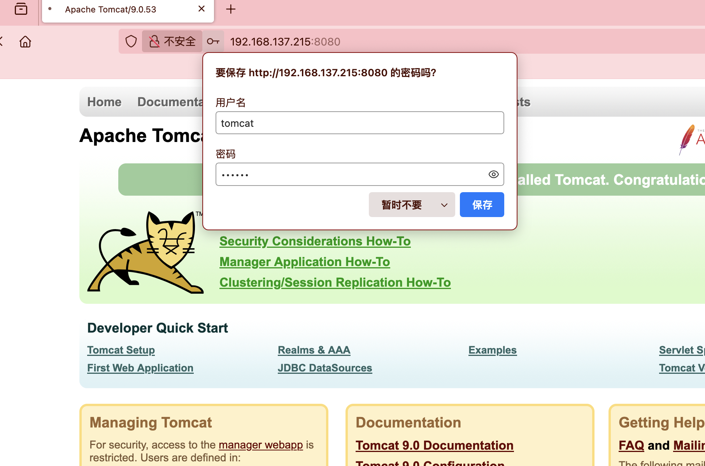  
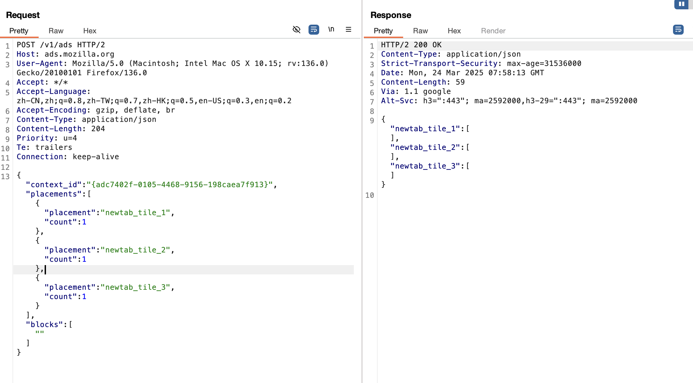  
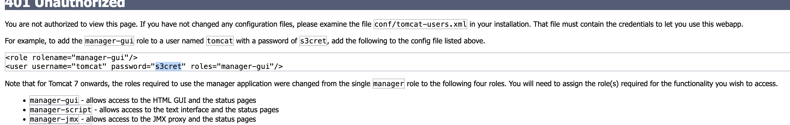  
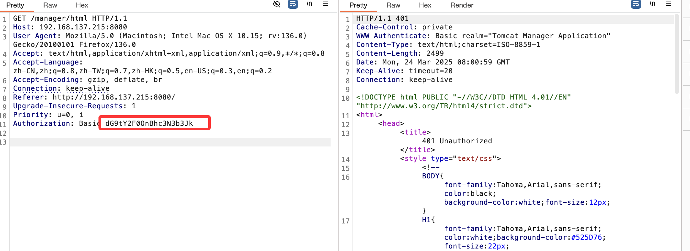  

>爆破一手
>

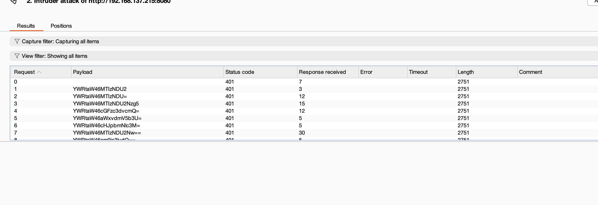  

>很卡的前提我先等着了
>

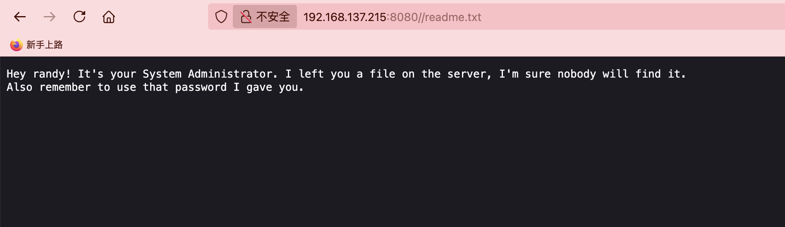  
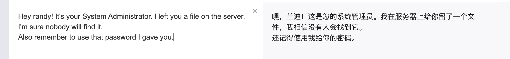  

>目前来看2个方案好像是ssh登录或者tomcat爆破登录先试ssh，因为那边在跑，网站里面有一个文件
>

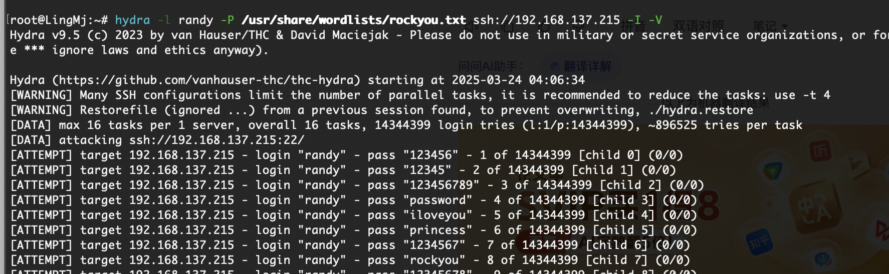  
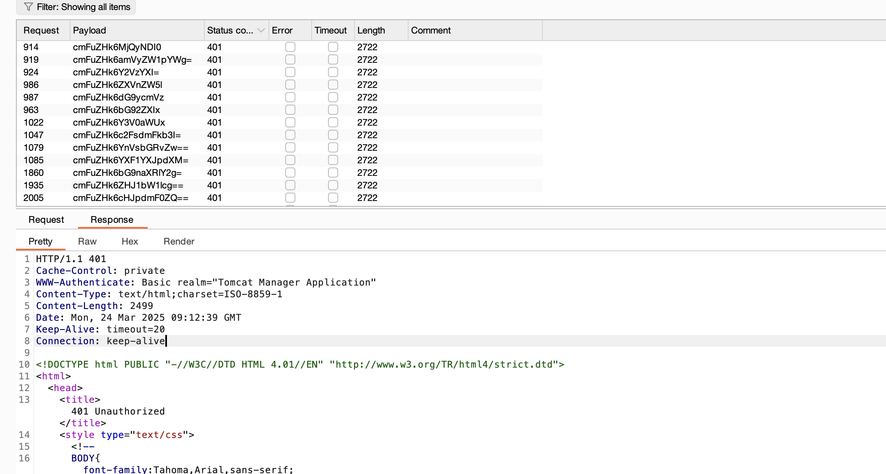  

>换一下工具跑起来就是快但是好像不是这个方向。
>

```
Hey randy! It's your System Administrator. I left you a file on the server, I'm sure nobody will find it.
Also remember to use that password I gave you.
```

>难到这句话不是跑密码登录么，现在ssh和tomcat都没见成功,所以它是需要目录全扫找文件么？
>

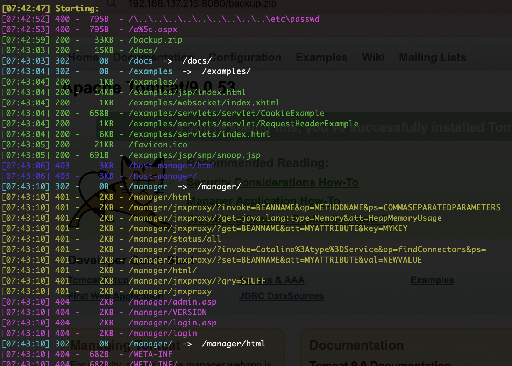  
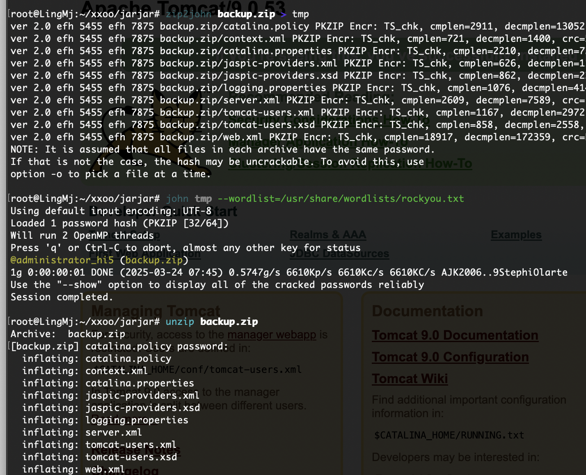  
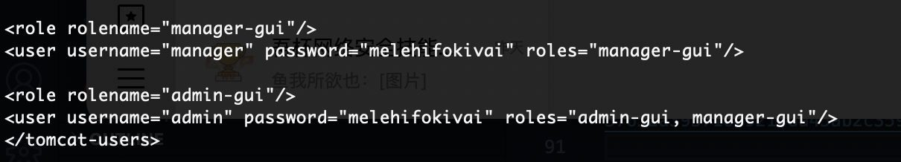  

```
<?xml version="1.0" encoding="UTF-8"?>
<!--
  Licensed to the Apache Software Foundation (ASF) under one or more
  contributor license agreements.  See the NOTICE file distributed with
  this work for additional information regarding copyright ownership.
  The ASF licenses this file to You under the Apache License, Version 2.0
  (the "License"); you may not use this file except in compliance with
  the License.  You may obtain a copy of the License at

      http://www.apache.org/licenses/LICENSE-2.0

  Unless required by applicable law or agreed to in writing, software
  distributed under the License is distributed on an "AS IS" BASIS,
  WITHOUT WARRANTIES OR CONDITIONS OF ANY KIND, either express or implied.
  See the License for the specific language governing permissions and
  limitations under the License.
-->
<tomcat-users xmlns="http://tomcat.apache.org/xml"
              xmlns:xsi="http://www.w3.org/2001/XMLSchema-instance"
              xsi:schemaLocation="http://tomcat.apache.org/xml tomcat-users.xsd"
              version="1.0">
<!--
  By default, no user is included in the "manager-gui" role required
  to operate the "/manager/html" web application.  If you wish to use this app,
  you must define such a user - the username and password are arbitrary.

  Built-in Tomcat manager roles:
    - manager-gui    - allows access to the HTML GUI and the status pages
    - manager-script - allows access to the HTTP API and the status pages
    - manager-jmx    - allows access to the JMX proxy and the status pages
    - manager-status - allows access to the status pages only

  The users below are wrapped in a comment and are therefore ignored. If you
  wish to configure one or more of these users for use with the manager web
  application, do not forget to remove the <!.. ..> that surrounds them. You
  will also need to set the passwords to something appropriate.
-->
<!--
  <user username="admin" password="<must-be-changed>" roles="manager-gui"/>
  <user username="robot" password="<must-be-changed>" roles="manager-script"/>
-->
<!--
  The sample user and role entries below are intended for use with the
  examples web application. They are wrapped in a comment and thus are ignored
  when reading this file. If you wish to configure these users for use with the
  examples web application, do not forget to remove the <!.. ..> that surrounds
  them. You will also need to set the passwords to something appropriate.
-->
<!--
  <role rolename="tomcat"/>
  <role rolename="role1"/>
  <user username="tomcat" password="<must-be-changed>" roles="tomcat"/>
  <user username="both" password="<must-be-changed>" roles="tomcat,role1"/>
  <user username="role1" password="<must-be-changed>" roles="role1"/>

-->

<role rolename="manager-gui"/>
<user username="manager" password="melehifokivai" roles="manager-gui"/>

<role rolename="admin-gui"/>
<user username="admin" password="melehifokivai" roles="admin-gui, manager-gui"/>
</tomcat-users>
```

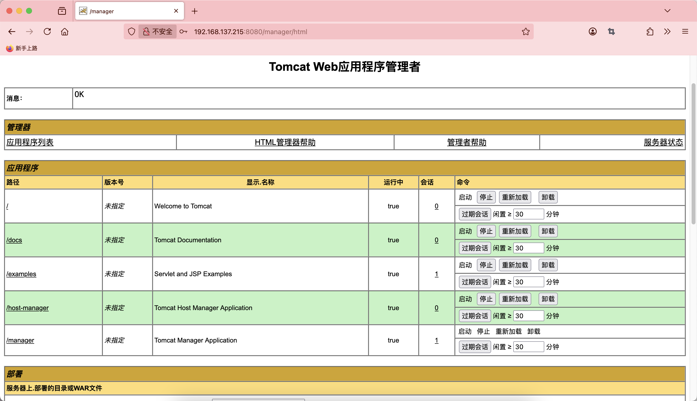  

>无语，算了也算能拿shell了
>

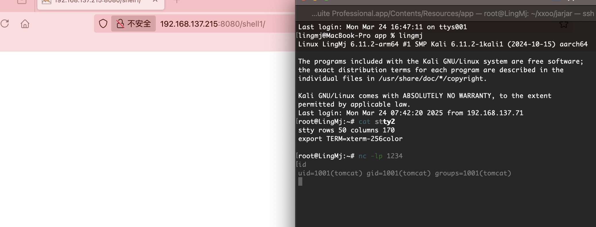  


## 提权
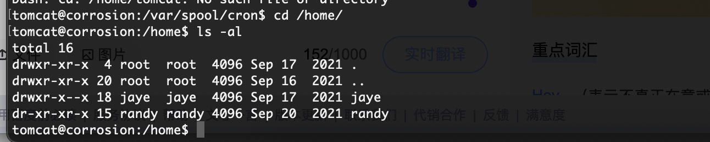  

```
tomcat@corrosion:/home/randy$ cat .bash_history 
tomcat@corrosion:/home/randy$ cat note.txt 
Hey randy this is your system administrator, hope your having a great day! I just wanted to let you know
that I changed your permissions for your home directory. You won't be able to remove or add files for now.

I will change these permissions later on.

See you next Monday randy!
tomcat@corrosion:/home/randy$ 
```

>又是猜谜哈哈哈
>

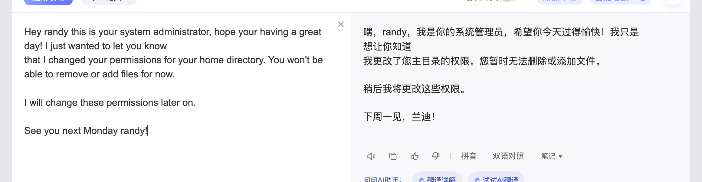  
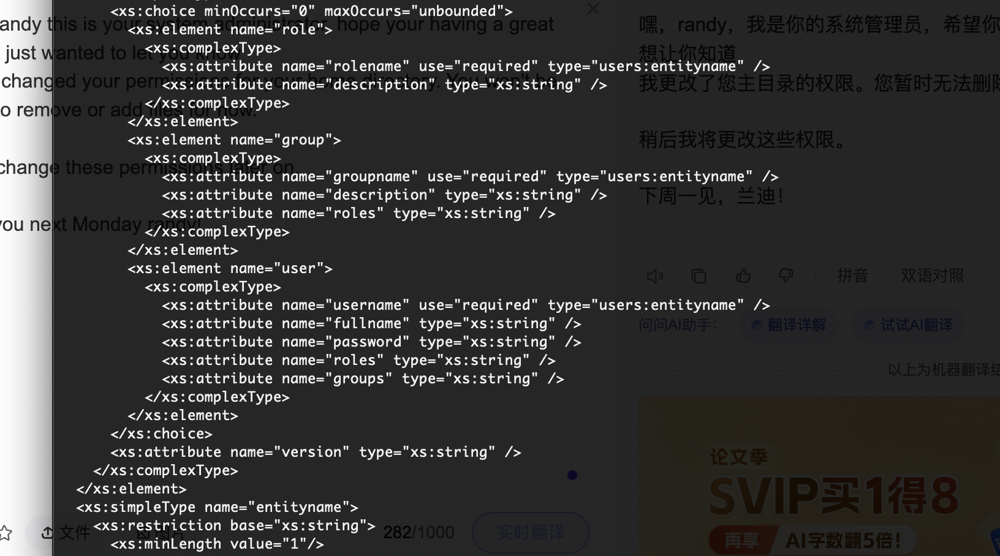  
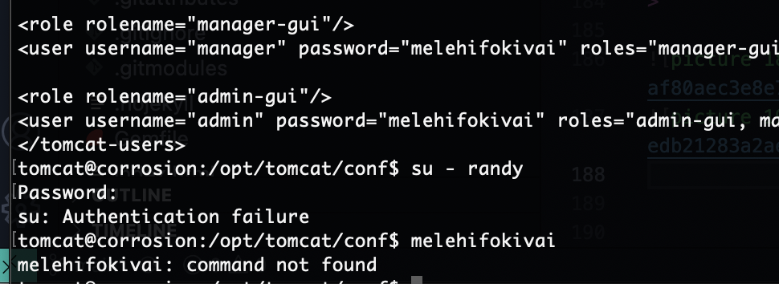  
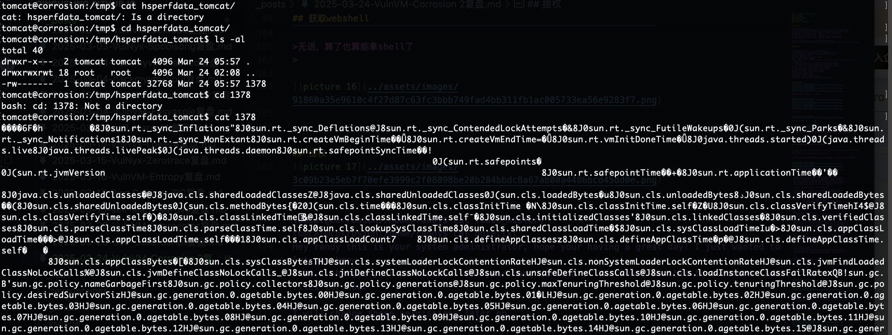  

>不像是有密码的样子
>

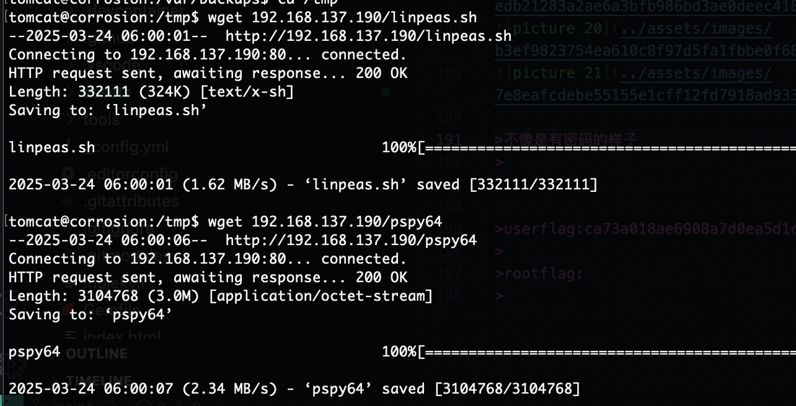  

>跑一下工具，不想看,根据原来的提示是找密码但是现在压根找不到爆破不现实
>

>它密码就是tomcat那个，melehifokivai，不过我一直试randy肯定是不对的
>

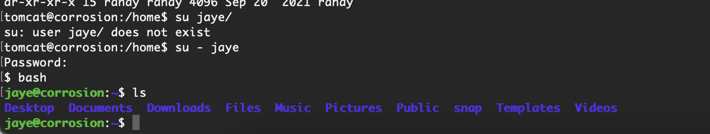  
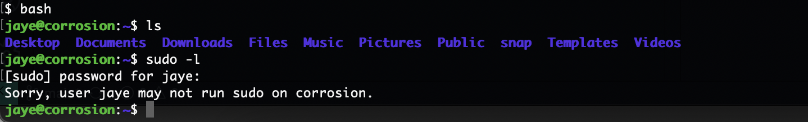  
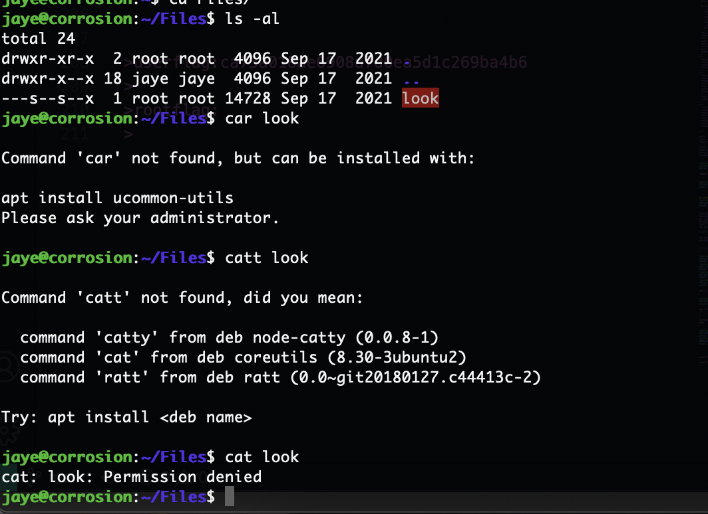  

>正常要是能改什么的就直接结束了
>

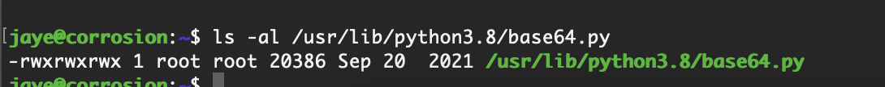  

>能改那就是可以直接提权了，但是我得知道调用了什么，很烦
>

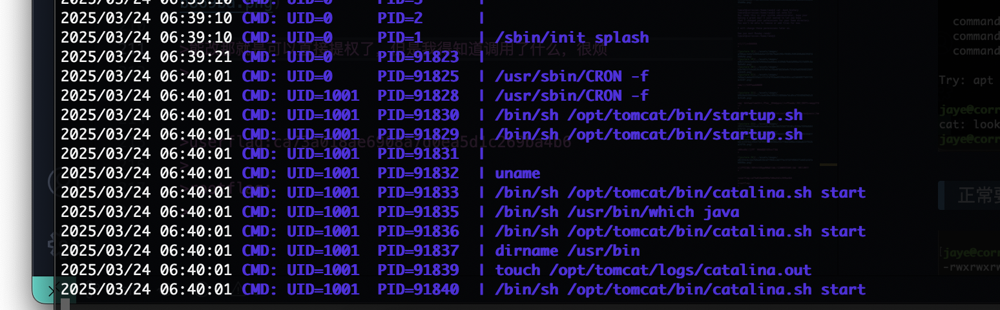  

>这个进程也不对啊很烦，不应该啊
>

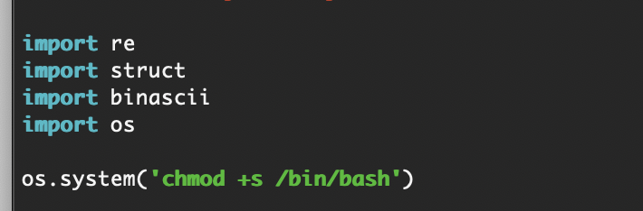  

>改一下看看谁会调用它
>

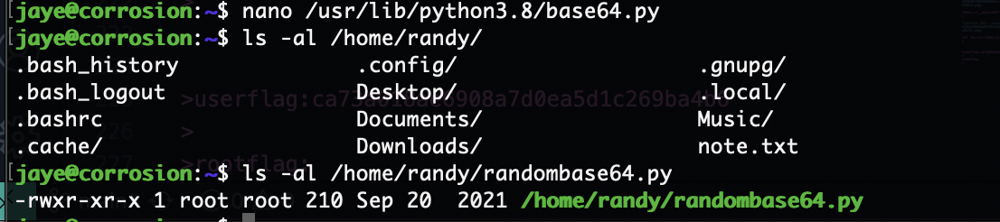  
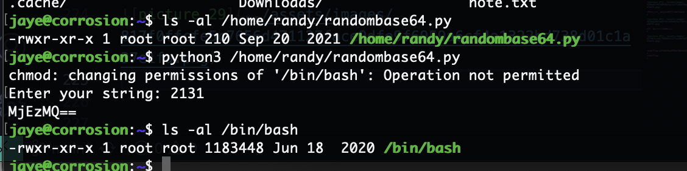  

>还是得提权到randy才行
>

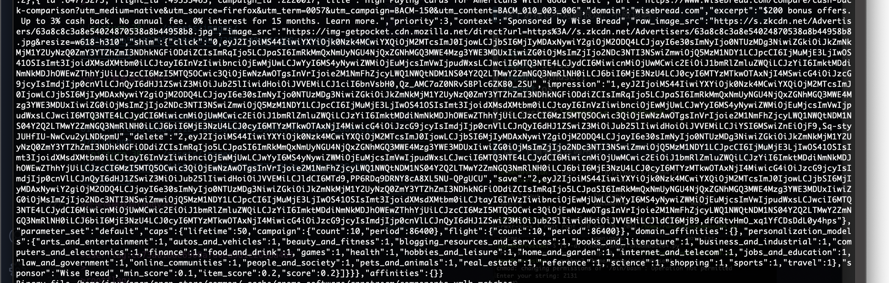  
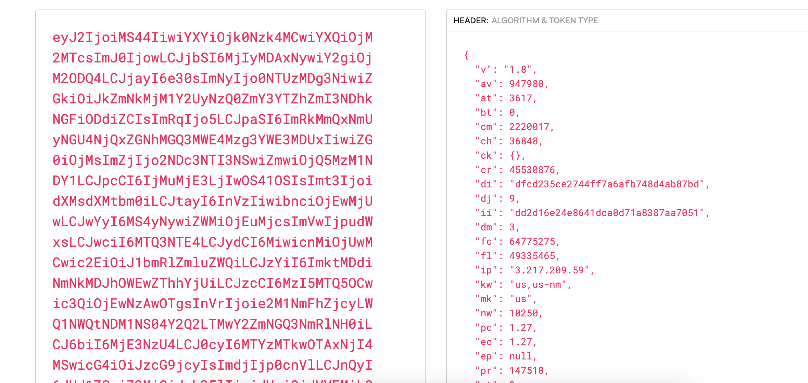  

>无,真不知道咋找这个信息，给我卡在这里卡得死死的
>

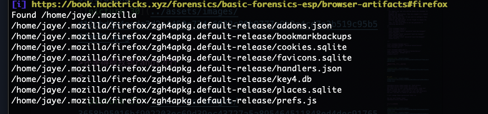  

>对了个东西，看看能拿信息不再不行我受不了了
>

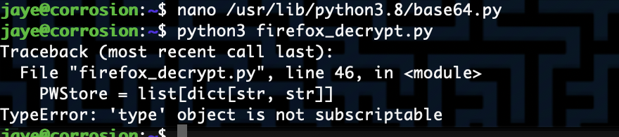  

>啥啊不能干
>

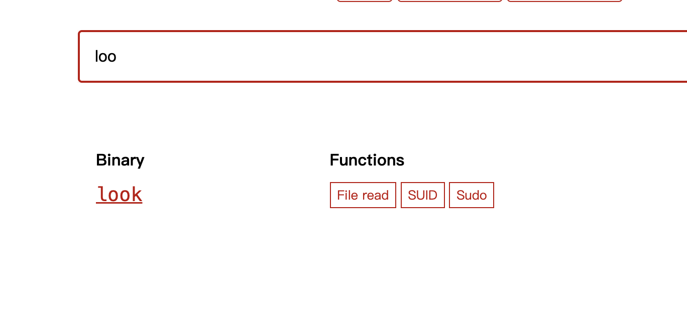  

>无语找一下发现look是这个，很烦
>

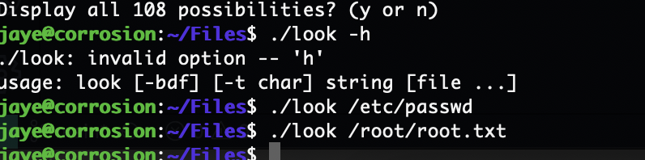  
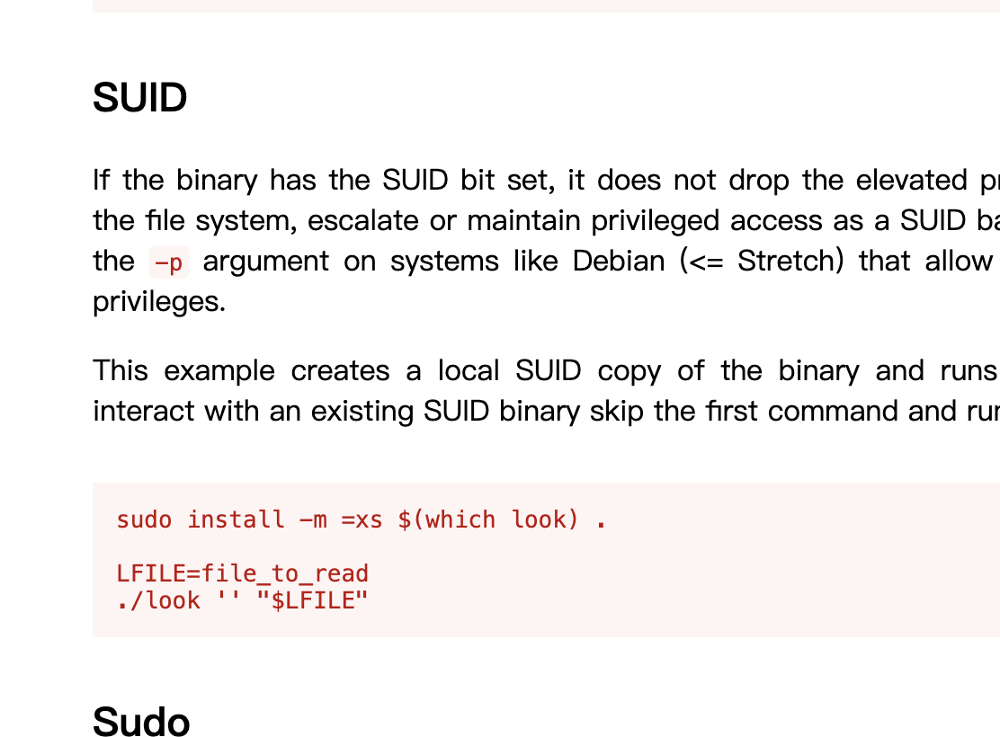  

>要空格
>

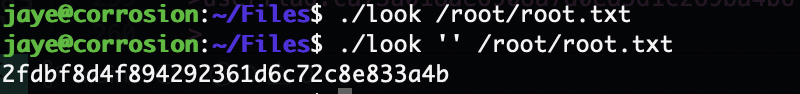  

>真是垃圾靶场
>

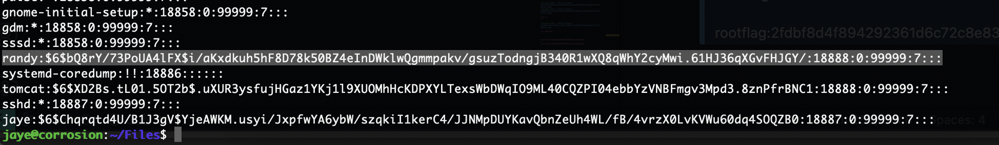  

>等着把密码跑了
>

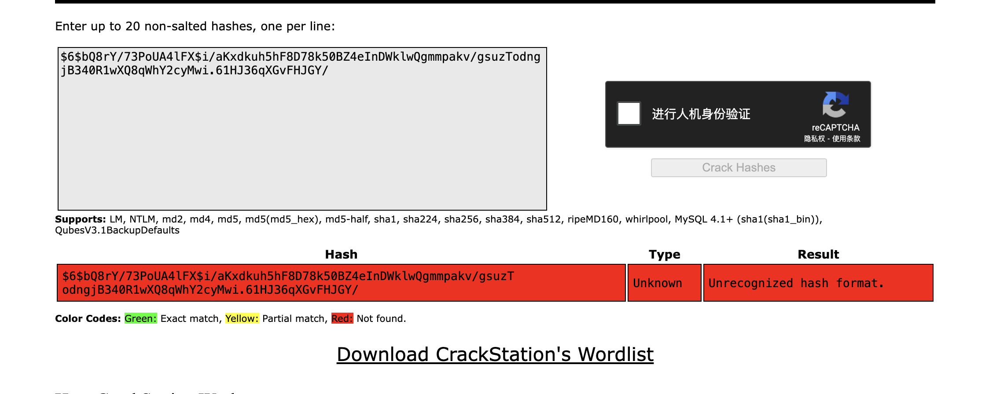  

>算了记得有ssh
>

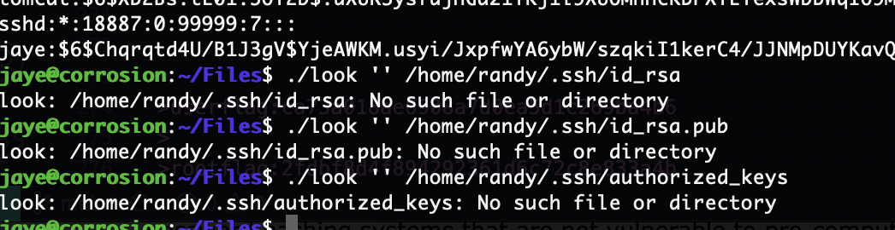  

>哈？真的假的啥也没有，还要一直等，无语了现在没辙不过其实也不用拿我也知道后面咋提权，就是改base64直接提权没啥压力所以我再跑8分钟没有就下机了，主要是base64可以写奥，所以怎么猜，反正我拿root了，所以拿不拿shell不重要感觉
>

>算了密码没有，不打了，反正目前看也不是啥难的靶机
>


>userflag:ca73a018ae6908a7d0ea5d1c269ba4b6
>
>rootflag:2fdbf8d4f894292361d6c72c8e833a4b
>