## 网段扫描
```
root@LingMj:~# arp-scan -l
Interface: eth0, type: EN10MB, MAC: 00:0c:29:d1:27:55, IPv4: 192.168.137.190
Starting arp-scan 1.10.0 with 256 hosts (https://github.com/royhills/arp-scan)
192.168.137.1	3e:21:9c:12:bd:a3	(Unknown: locally administered)
192.168.137.71	a0:78:17:62:e5:0a	Apple, Inc.
192.168.137.197	3e:21:9c:12:bd:a3	(Unknown: locally administered)
192.168.137.249	2e:5c:af:d4:ea:c8	(Unknown: locally administered)

8 packets received by filter, 0 packets dropped by kernel
Ending arp-scan 1.10.0: 256 hosts scanned in 2.126 seconds (120.41 hosts/sec). 4 responded
```

## 端口扫描

```
root@LingMj:~# nmap -p- -sV -sC 192.168.137.197
Starting Nmap 7.95 ( https://nmap.org ) at 2025-03-24 19:47 EDT
Nmap scan report for ephemeral.mshome.net (192.168.137.197)
Host is up (0.029s latency).
Not shown: 65533 closed tcp ports (reset)
PORT   STATE SERVICE VERSION
22/tcp open  ssh     OpenSSH 8.2p1 Ubuntu 4ubuntu0.5 (Ubuntu Linux; protocol 2.0)
| ssh-hostkey: 
|   3072 f0:f2:b8:e0:da:41:9b:96:3b:b6:2b:98:95:4c:67:60 (RSA)
|   256 a8:cd:e7:a7:0e:ce:62:86:35:96:02:43:9e:3e:9a:80 (ECDSA)
|_  256 14:a7:57:a9:09:1a:7e:7e:ce:1e:91:f3:b1:1d:1b:fd (ED25519)
80/tcp open  http    Apache httpd 2.4.41 ((Ubuntu))
|_http-title: Apache2 Ubuntu Default Page: It works
|_http-server-header: Apache/2.4.41 (Ubuntu)
MAC Address: 3E:21:9C:12:BD:A3 (Unknown)
Service Info: OS: Linux; CPE: cpe:/o:linux:linux_kernel

Service detection performed. Please report any incorrect results at https://nmap.org/submit/ .
Nmap done: 1 IP address (1 host up) scanned in 18.85 seconds
```

## 获取webshell
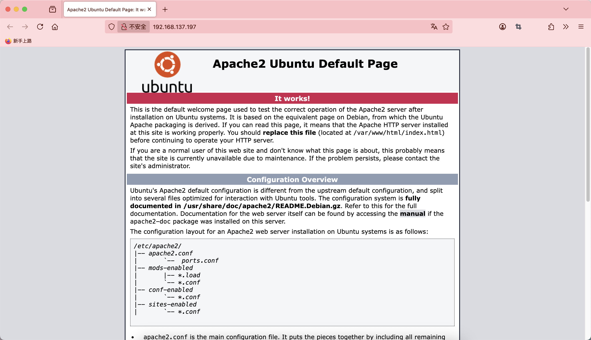  

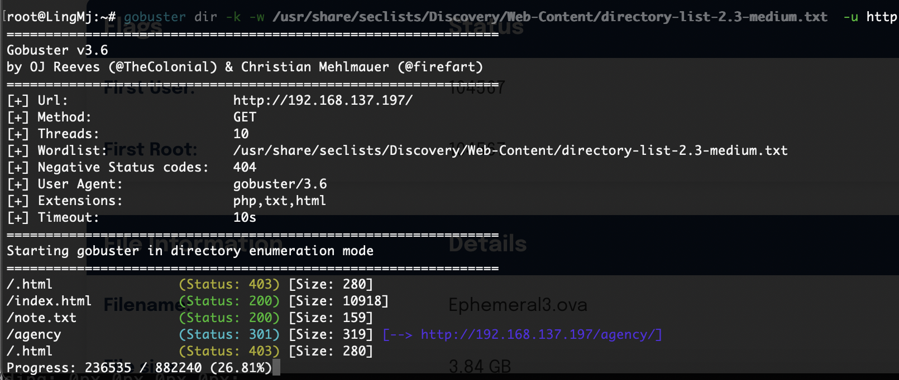  
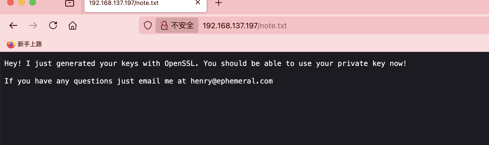  
  
  


>这个在hackmyvm就出现过的题目，重新打一遍，是个easy，就是等的时间有点久
>

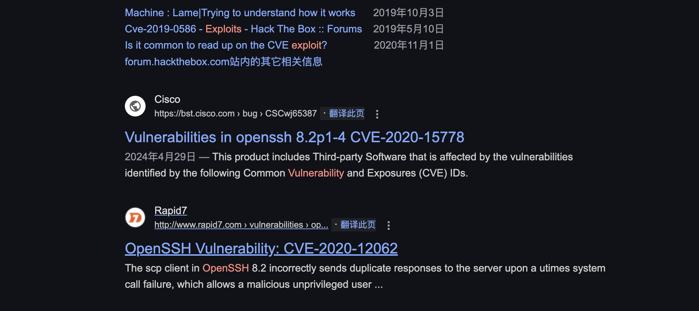  
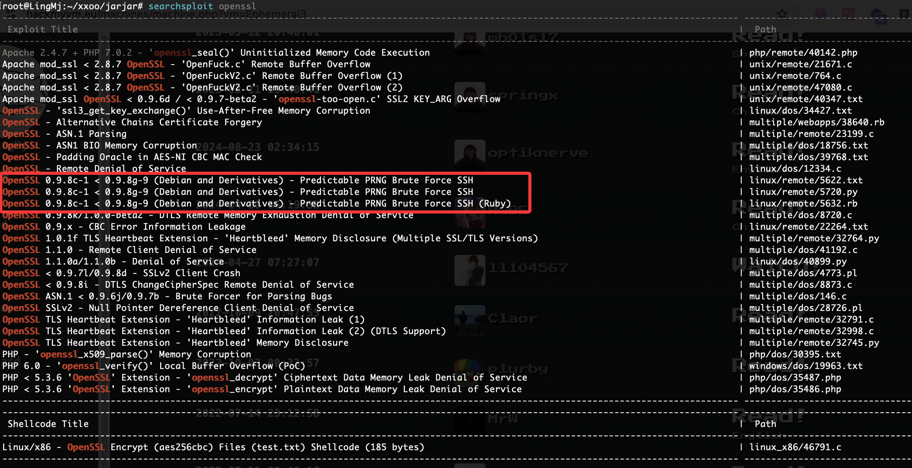  
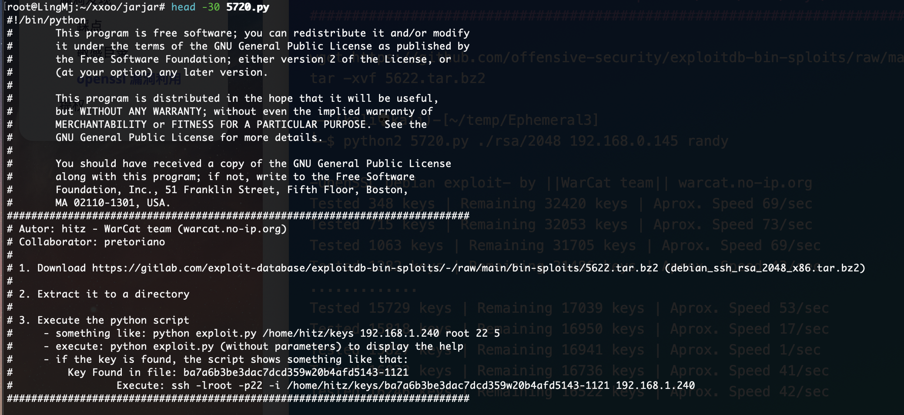  
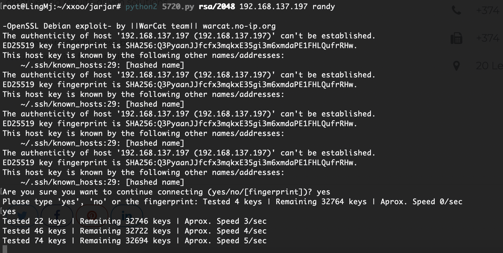  

>它是一个纯私要爆破的东西，也是纯等没啥技术，所以正常可以跳过等待环节，直接看wp拿私钥位置就好了
>

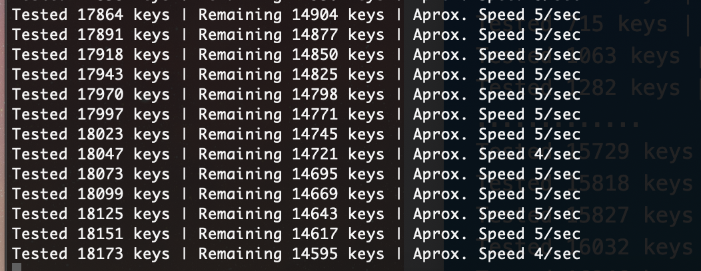  

>还没出来，感觉应该是bug了这个东西，上次都跑出来了，跑了一个点了，不跑了，直接下一步了
>

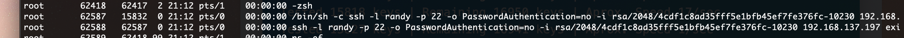  

>看进程有个程序，不知道对不对,验证一下不对奥，应该是我这里的问题，我直接看记录了
>

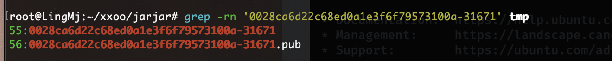  

>按理来说前100行内就能登录了
>

>写个无聊的for吧验证我说的不然没啥意思
>

  

>这是主要的ssh方式，我们现在有所有
>

>我先把所有的pub删了，接下来直接去前100行进行ssh私钥登录爆破
>

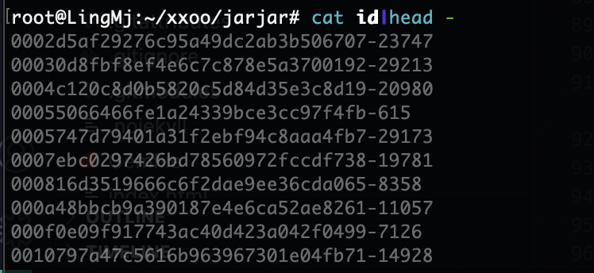  
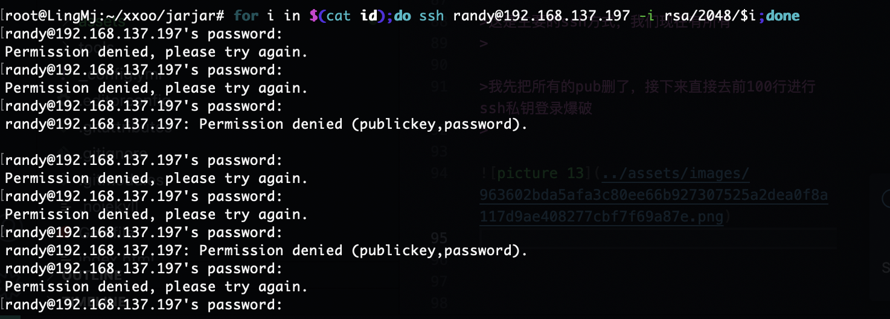  

>直接ssh这样好像要密码不对的
>

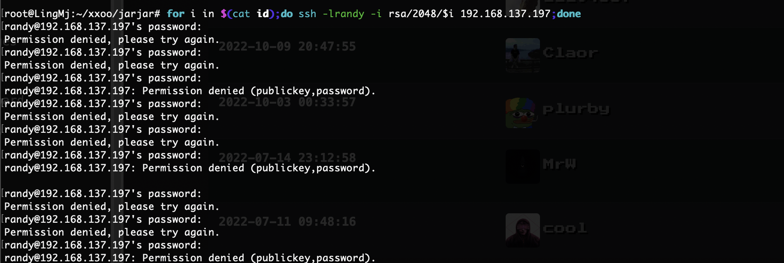  
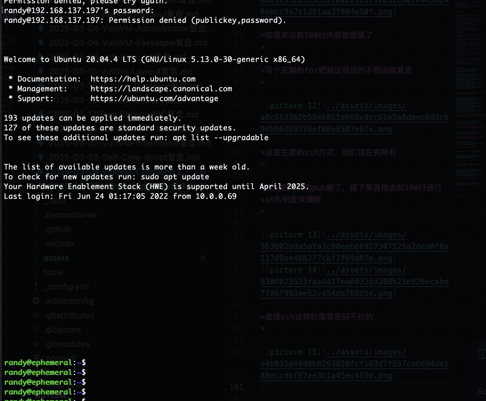  

>可以的一直按空格，比脚步好用，就是一个问题，不过优雅哈哈哈哈
>

## 提权

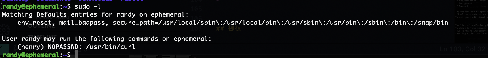  
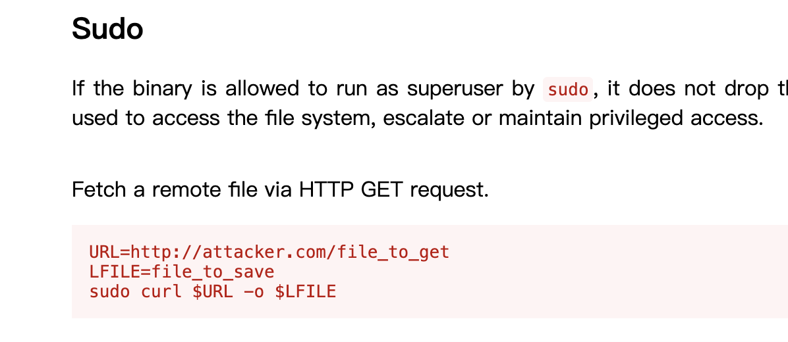  
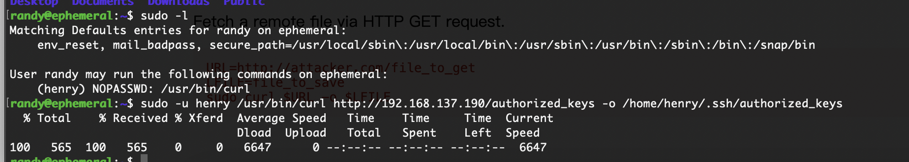  

>没有过多的条件奥
>
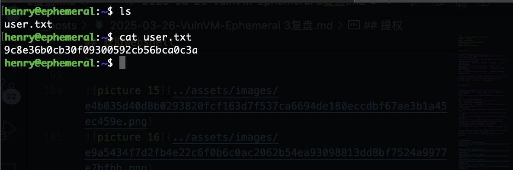  
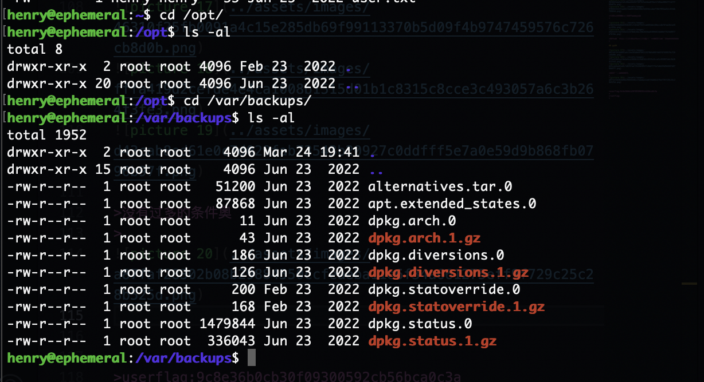  

>没密码无法sudo -l
>

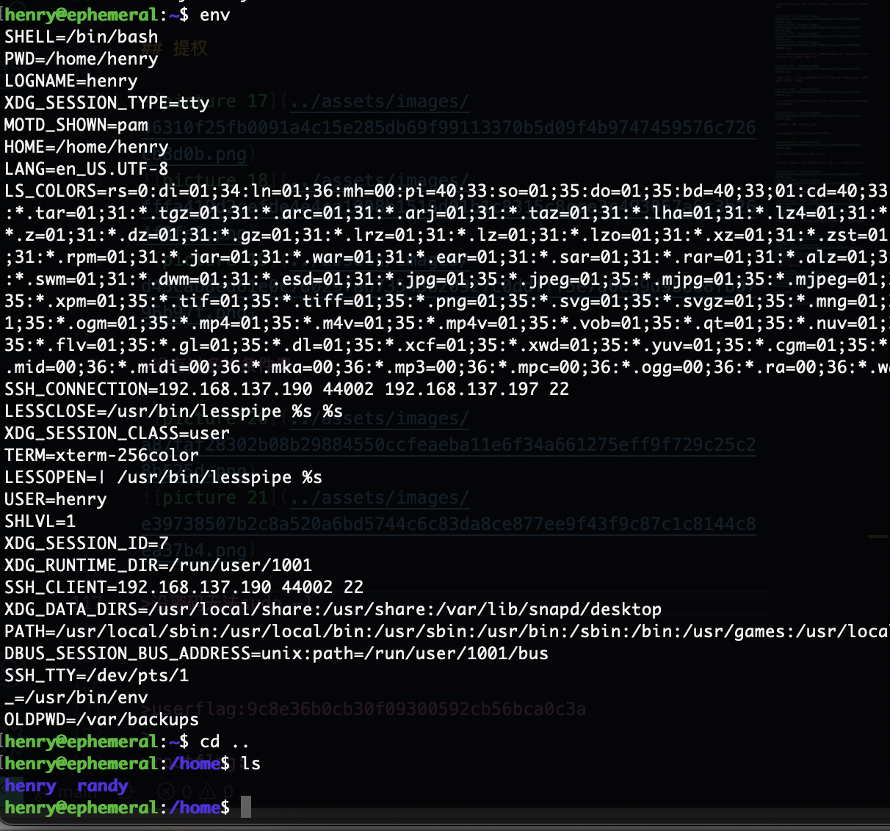  

>不想手查了工具找了
>

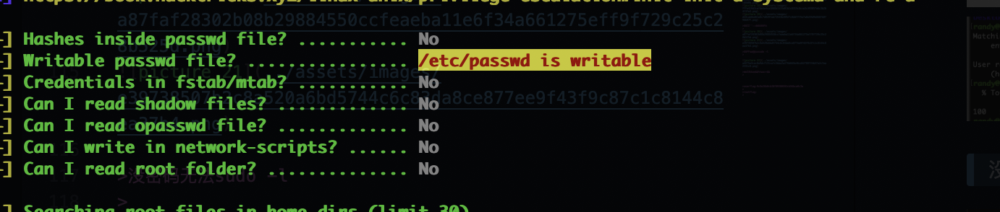  

>好了目测靶机结束了
>

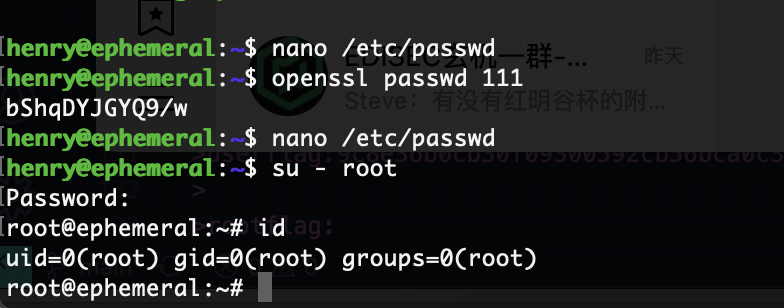  


>userflag:9c8e36b0cb30f09300592cb56bca0c3a
>
>rootflag:b0a3dec84d09f03615f768c8062cec4d
>


