## 网段扫描
```
root@LingMj:~/xxoo/jarjar# arp-scan -l
Interface: eth0, type: EN10MB, MAC: 00:0c:29:d1:27:55, IPv4: 192.168.137.190
Starting arp-scan 1.10.0 with 256 hosts (https://github.com/royhills/arp-scan)
192.168.137.1	3e:21:9c:12:bd:a3	(Unknown: locally administered)
192.168.137.116	3e:21:9c:12:bd:a3	(Unknown: locally administered)
192.168.137.203	a0:78:17:62:e5:0a	Apple, Inc.
192.168.137.172	62:2f:e8:e4:77:5d	(Unknown: locally administered)

9 packets received by filter, 0 packets dropped by kernel
Ending arp-scan 1.10.0: 256 hosts scanned in 2.062 seconds (124.15 hosts/sec). 4 responded
```

## 端口扫描

```
root@LingMj:~/xxoo/jarjar# nmap -p- -sV -sC 192.168.137.116
Starting Nmap 7.95 ( https://nmap.org ) at 2025-03-28 21:58 EDT
Nmap scan report for JaulaCon2025.mshome.net (192.168.137.116)
Host is up (0.0080s latency).
Not shown: 65533 closed tcp ports (reset)
PORT   STATE SERVICE VERSION
22/tcp open  ssh     OpenSSH 9.2p1 Debian 2+deb12u3 (protocol 2.0)
| ssh-hostkey: 
|   256 af:79:a1:39:80:45:fb:b7:cb:86:fd:8b:62:69:4a:64 (ECDSA)
|_  256 6d:d4:9d:ac:0b:f0:a1:88:66:b4:ff:f6:42:bb:f2:e5 (ED25519)
80/tcp open  http    Apache httpd 2.4.62 ((Debian))
|_http-server-header: Apache/2.4.62 (Debian)
|_http-title: Bienvenido a Bludit | BLUDIT
|_http-generator: Bludit
MAC Address: 3E:21:9C:12:BD:A3 (Unknown)
Service Info: OS: Linux; CPE: cpe:/o:linux:linux_kernel

Service detection performed. Please report any incorrect results at https://nmap.org/submit/ .
Nmap done: 1 IP address (1 host up) scanned in 18.10 seconds
```

## 获取webshell
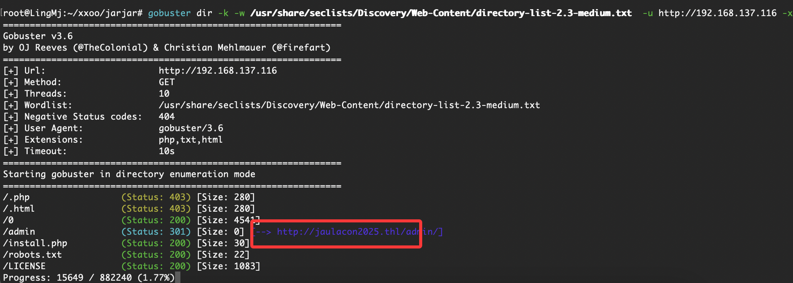  

>域名
>

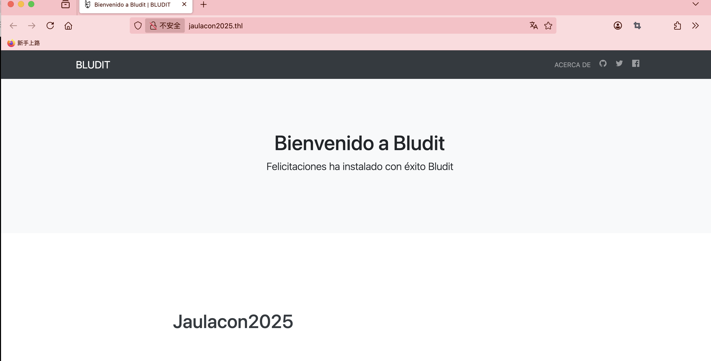  
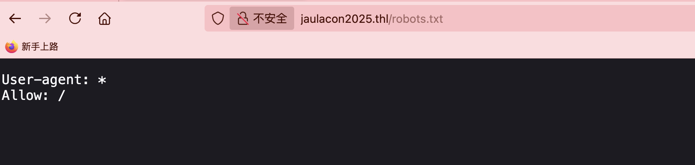  
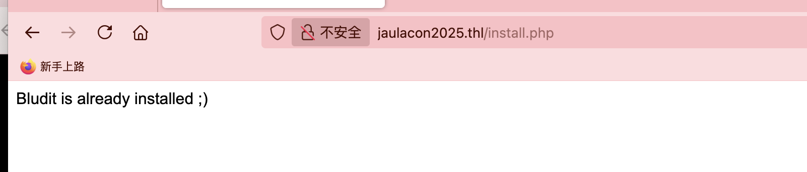  
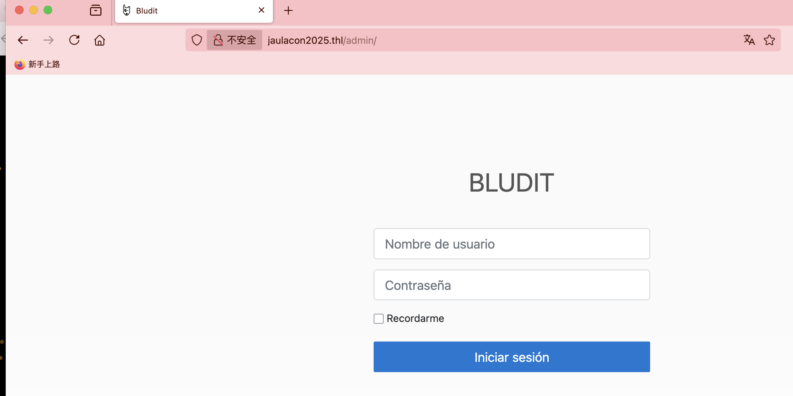  
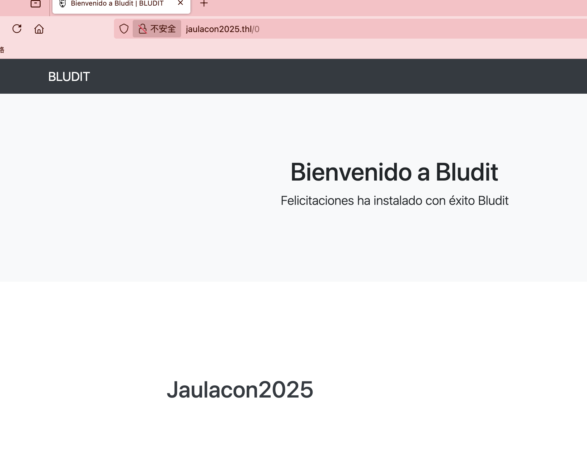  
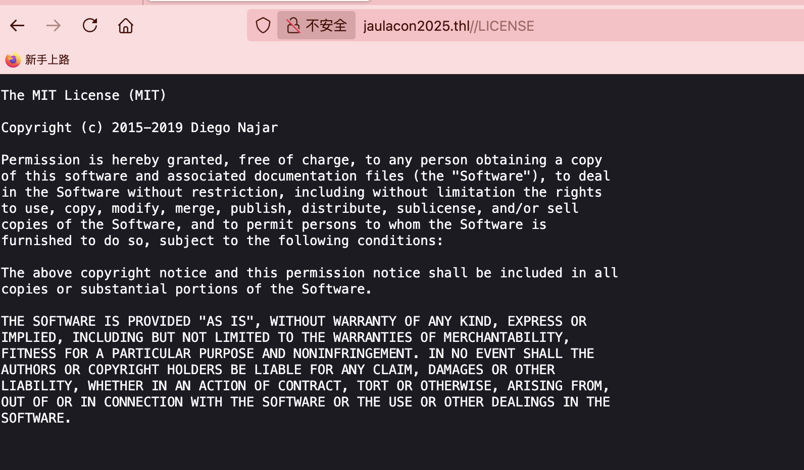  
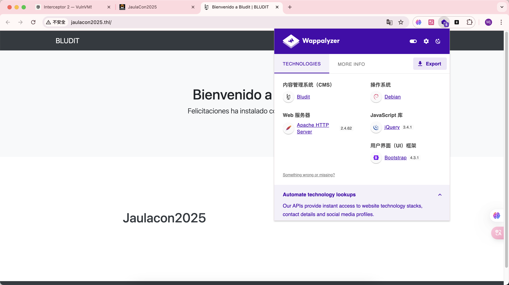  
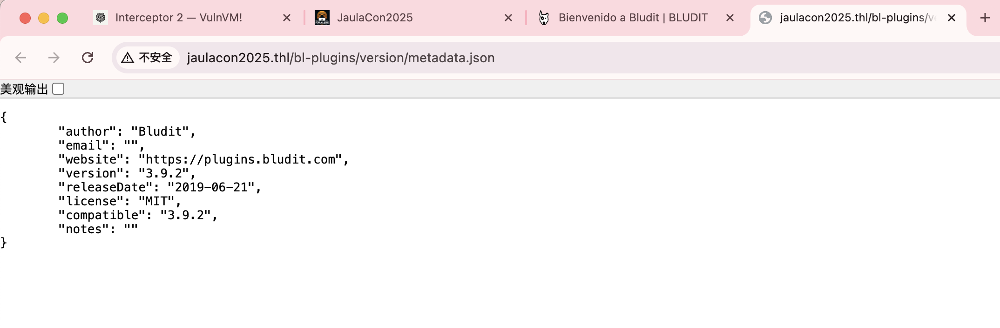  
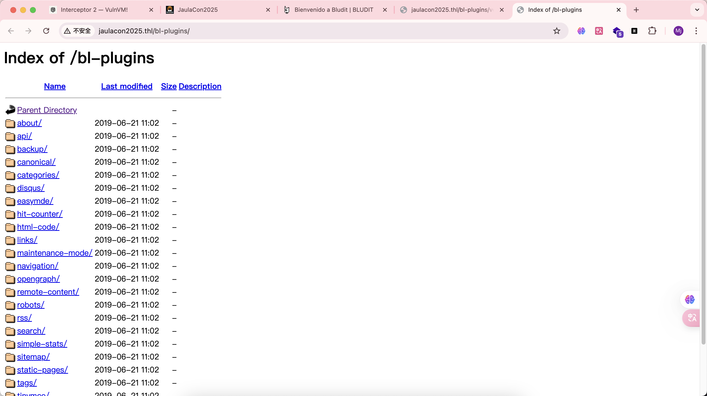  
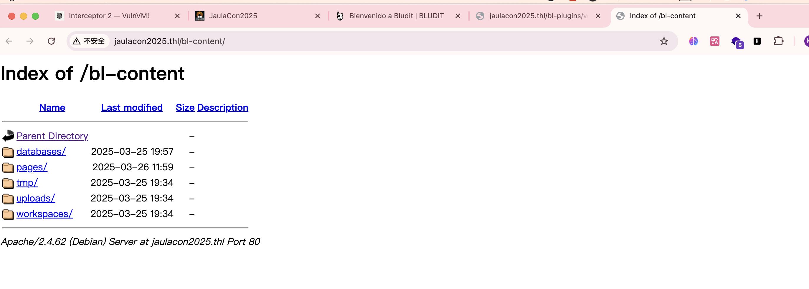 
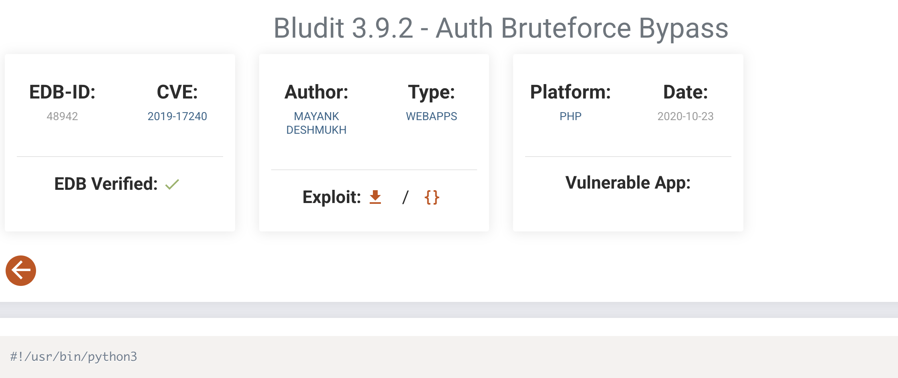  

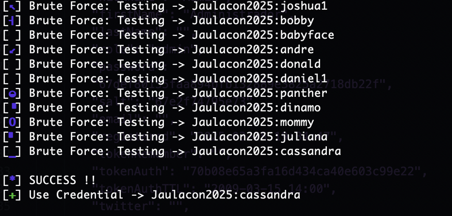  
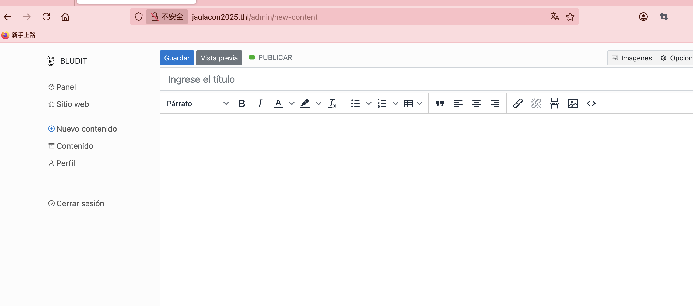  
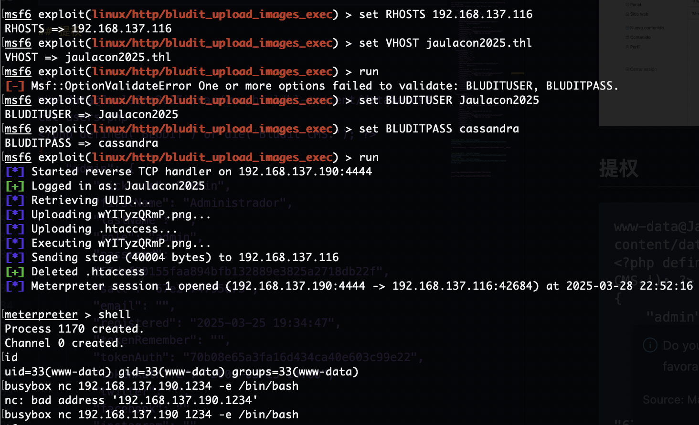  

>原本我是手动上传的，大佬来一句msf的使用，才往下继续
>

## 提权

>看了没sudo -l，就是找密码了
>

```
www-data@JaulaCon2025:/var/www/html/bl-content/databases$ cat users.php 
<?php defined('BLUDIT') or die('Bludit CMS.'); ?>
{
    "admin": {
        "nickname": "Admin",
        "firstName": "Administrador",
        "lastName": "",
        "role": "admin",
        "password": "67def80155faa894bfb132889e3825a2718db22f",
        "salt": "67e2f74795e73",
        "email": "",
        "registered": "2025-03-25 19:34:47",
        "tokenRemember": "",
        "tokenAuth": "70b08e65a3fa16d434ca40e603c99e22",
        "tokenAuthTTL": "2009-03-15 14:00",
        "twitter": "",
        "facebook": "",
        "instagram": "",
        "codepen": "",
        "linkedin": "",
        "github": "",
        "gitlab": ""
    },
    "Jaulacon2025": {
        "firstName": "",
        "lastName": "",
        "nickname": "",
        "description": "",
        "role": "author",
        "password": "a0fcd99fe4a21f30abd2053b1cf796da628e4e7e",
        "salt": "bo22u72!",
        "email": "",
        "registered": "2025-03-25 19:43:25",
        "tokenRemember": "",
        "tokenAuth": "d1ed37a30b769e2e48123c3efaa1e357",
        "tokenAuthTTL": "2009-03-15 14:00",
        "twitter": "",
        "facebook": "",
        "codepen": "",
        "instagram": "",
        "github": "",
        "gitlab": "",
        "linkedin": "",
        "mastodon": ""
    },
    "JaulaCon2025": {
        "firstName": "",
        "lastName": "",
        "nickname": "",
        "description": "",
        "role": "author",
        "password": "551211bcd6ef18e32742a73fcb85430b",
        "salt": "jejej",
        "email": "",
        "registered": "2025-03-25 19:43:25",
        "tokenRemember": "",
        "tokenAuth": "d1ed37a30b769e2e48123c3efaa1e357",
        "tokenAuthTTL": "2009-03-15 14:00",
        "twitter": "",
        "facebook": "",
        "codepen": "",
        "instagram": "",
        "github": "",
        "gitlab": "",
        "linkedin": "",
        "mastodon": ""
    }
```

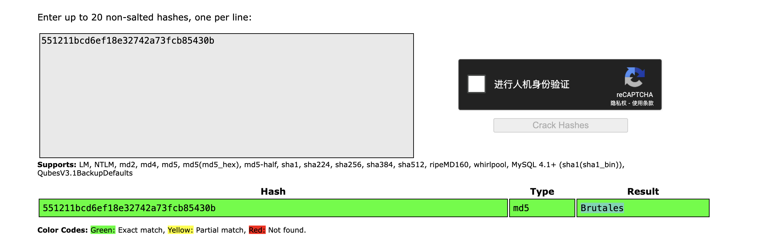  

> 这个user密码对我来说赶上medium了哈哈哈，压根不懂咋做，拿了提示
>

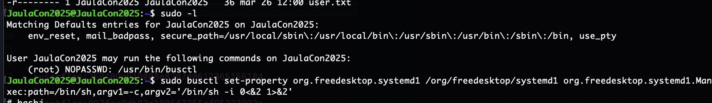  
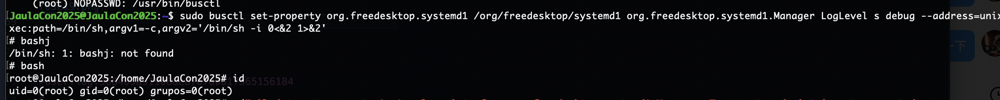  


>userflag:368409a919088e8707d0617365156184
>
>rootflag:097fac9db83a1806f3355cf95227992a
>